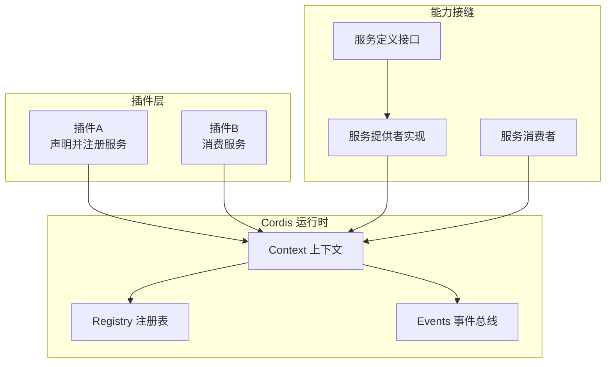
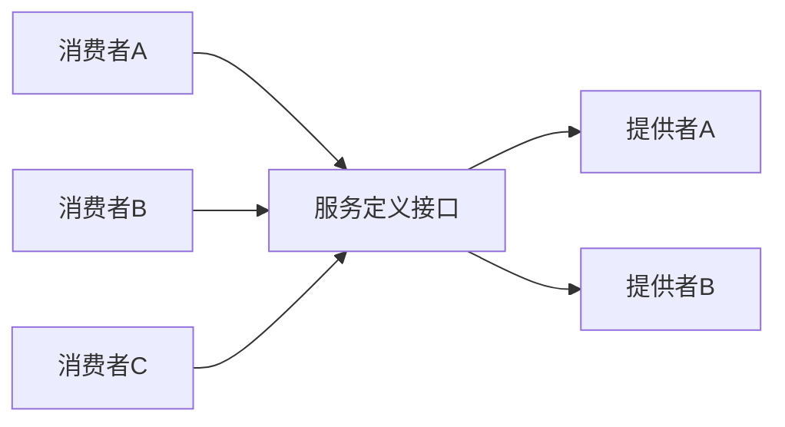
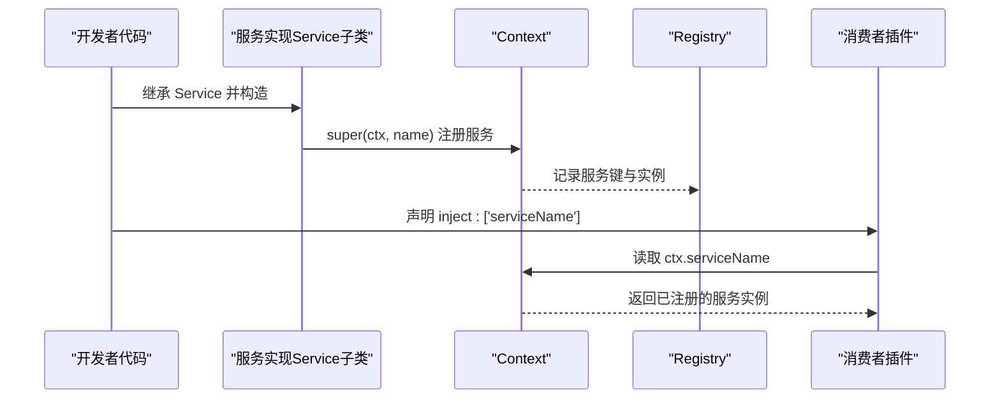
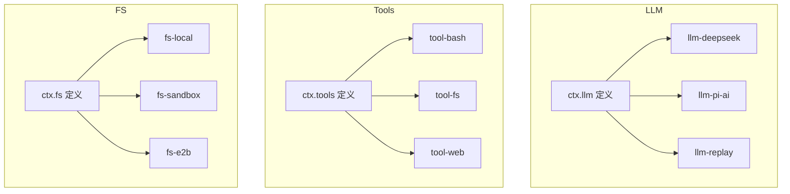
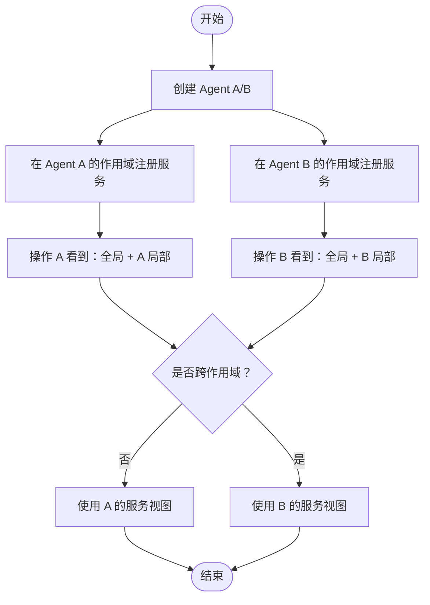
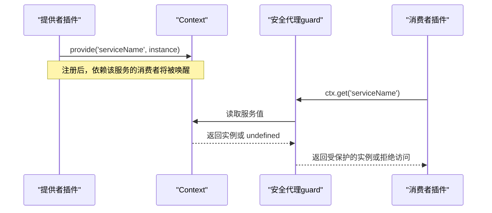
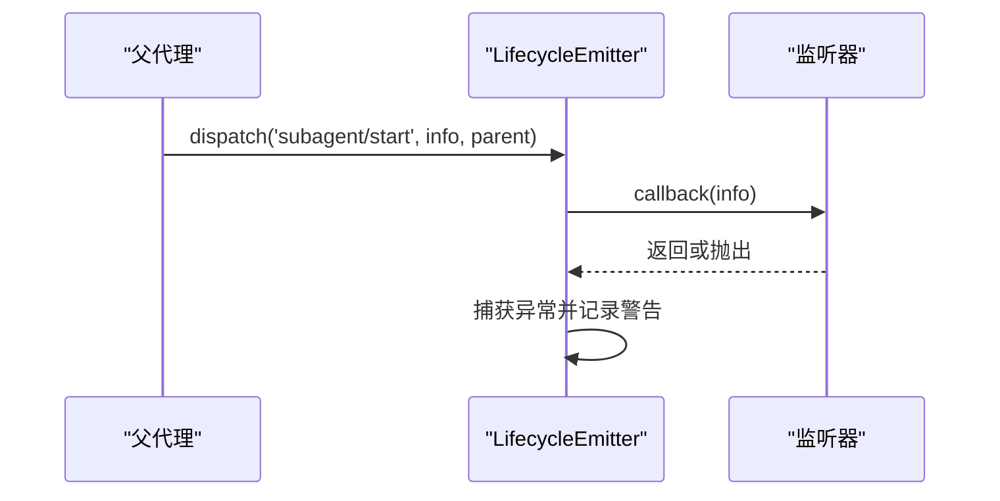
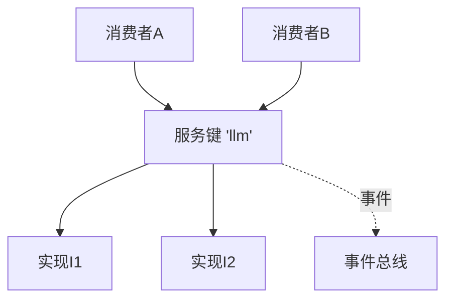

# 服务注册与发现

<cite>
**本文引用的文件**
- [能力接缝与核心服务](file://docs/capability-seams.md)
- [Cordis 入门](file://docs/cordis-primer.md)
- [Cordis 教程：服务](file://docs/cordis-tutorial/03-services.md)
- [Cordis API：上下文](file://docs/cordis-api/context.md)
- [Cordis API：服务基类](file://docs/cordis-api/service.md)
- [Cordis API：注册表](file://docs/cordis-api/registry.md)
- [作用域子系统文档](file://docs/subsystems/scope.md)
- [Agent 作用域上下文设计笔记](file://.agents/notes/implemented/architecture/2026-07-08-agent-scope-contexts.md)
- [Agent 生命周期与工厂注册（AgentRegistry）](file://packages/core/agent/src/index.ts)
- [子代理生命周期发射器](file://packages/subagent/subagent/src/lifecycle.ts)
- [主机运行器安全代理（ctx 访问守卫）](file://packages/extensions/cordis-host-runner/src/guard.ts)
- [预设挂载到 Agent 作用域的测试用例](file://packages/preset/agent-presets/tests/mount.spec.ts)
</cite>

## 目录
1. [简介](#简介)
2. [项目结构](#项目结构)
3. [核心组件](#核心组件)
4. [架构总览](#架构总览)
5. [详细组件分析](#详细组件分析)
6. [依赖关系分析](#依赖关系分析)
7. [性能考虑](#性能考虑)
8. [故障排查指南](#故障排查指南)
9. [结论](#结论)
10. [附录](#附录)

## 简介
本文件面向 DeepSeek Harness 中基于 Cordis 的服务注册与发现机制，聚焦以下目标：
- 解释 Cordis 框架中的服务注册原理，区分“核心服务”“可替换能力接缝”和“组合点”。
- 说明 ctx 服务的注册流程，包括 ctx.llm、ctx.tools、ctx.fs 等关键接口的声明、实现注册与服务发现。
- 阐述作用域（scope）机制如何在单个智能体级别进行服务隔离与生命周期管理。
- 描述服务契约的定义方式：接口声明、实现注册与消费者依赖管理。
- 提供实践示例路径，展示如何定义新的能力接缝、实现自定义提供者，并在不同作用域中注册和使用服务。
- 总结服务发现的性能考虑与最佳实践。

## 项目结构
DeepSeek Harness 将“能力”拆分为三个角色：服务定义（接口）、服务提供者（实现）、消费者（调用方）。该拆分通过 Cordis 的 Service 与 Context 机制在运行时装配，并通过作用域实现按智能体的隔离。



图表来源
- [Cordis 入门:7-13](file://docs/cordis-primer.md#L7-L13)
- [Cordis API：上下文:235-331](file://docs/cordis-api/context.md#L235-L331)
- [Cordis API：服务基类:1-67](file://docs/cordis-api/service.md#L1-L67)
- [Cordis API：注册表:121-153](file://docs/cordis-api/registry.md#L121-L153)

章节来源
- [Cordis 入门:7-13](file://docs/cordis-primer.md#L7-L13)
- [Cordis API：上下文:235-331](file://docs/cordis-api/context.md#L235-L331)
- [Cordis API：服务基类:1-67](file://docs/cordis-api/service.md#L1-L67)
- [Cordis API：注册表:121-153](file://docs/cordis-api/registry.md#L121-L153)

## 核心组件
- 上下文（Context）：服务仓库与查找入口，支持 isolate、intercept、get/set/provide/accessor 等能力。
- 服务基类（Service）：插件以继承方式注册为 ctx.<name>，生命周期由 Cordis 管理。
- 注册表（Registry）：处理插件加载与依赖注入（inject），保证依赖就绪后再启动。
- 事件总线（Events）：用于解耦通信，支持 emit/waterfall/parallel/serial/bail 等分发模式。
- 作用域（Scope）：按智能体维度隔离服务视图与生命周期，确保每个 Agent 拥有独立的能力装配。

章节来源
- [Cordis API：上下文:39-107](file://docs/cordis-api/context.md#L39-L107)
- [Cordis API：服务基类:1-67](file://docs/cordis-api/service.md#L1-L67)
- [Cordis API：注册表:121-153](file://docs/cordis-api/registry.md#L121-L153)
- [作用域子系统文档:1-60](file://docs/subsystems/scope.md#L1-L60)

## 架构总览
下图展示了“能力接缝”的整体关系：服务定义由某个包拥有，一个或多个实现包提供具体能力，多个消费者直接依赖该服务键名。



图表来源
- [能力接缝与核心服务:1-10](file://docs/capability-seams.md#L1-L10)

章节来源
- [能力接缝与核心服务:1-10](file://docs/capability-seams.md#L1-L10)

## 详细组件分析

### 能力接缝与核心服务
- 核心服务：系统内稳定且通常单例的关键能力，如 sessions、tools、systemPrompt、invariants 等。
- 能力接缝：可替换的能力边界，如 llm、fs、shell、storage、sessionPersistence 等，允许在不同部署或配置下切换实现。
- 组合点：将多个能力组合成更高层能力的装配点，例如 agentLoop、workflowEngine 等。

章节来源
- [能力接缝与核心服务:1-10](file://docs/capability-seams.md#L1-L10)

### 服务契约：接口声明、实现注册与消费者依赖
- 接口声明：通过 TypeScript 的 declare module 合并扩展 Context 类型，使 ctx.<key> 具备类型安全。
- 实现注册：继承 Service 并在构造函数中调用 super(ctx, name)，或在 apply 中使用 ctx.plugin(...) 注册。
- 消费者依赖：使用 inject 声明所需服务键名，Cordis 会等待依赖就绪再执行插件。



图表来源
- [Cordis 教程：服务:7-42](file://docs/cordis-tutorial/03-services.md#L7-L42)
- [Cordis API：服务基类:1-67](file://docs/cordis-api/service.md#L1-L67)
- [Cordis API：注册表:121-153](file://docs/cordis-api/registry.md#L121-L153)

章节来源
- [Cordis 教程：服务:7-42](file://docs/cordis-tutorial/03-services.md#L7-L42)
- [Cordis API：服务基类:1-67](file://docs/cordis-api/service.md#L1-L67)
- [Cordis API：注册表:121-153](file://docs/cordis-api/registry.md#L121-L153)

### 关键 ctx 服务：llm、tools、fs 的注册与发现
- ctx.llm：LLM 适配器注册中心，由 LLM 相关包提供实现；循环与压缩逻辑通过该服务调用模型流式能力。
- ctx.tools：工具注册与受保护执行管线，负责工具发现、策略拦截、结果观察等。
- ctx.fs：文件系统提供者接缝，支持本地、沙箱、E2B 等多种后端；工具层通过该接缝读写文件。



图表来源
- [能力接缝与核心服务:16-170](file://docs/capability-seams.md#L16-L170)

章节来源
- [能力接缝与核心服务:16-170](file://docs/capability-seams.md#L16-L170)

### 作用域（scope）机制：按智能体隔离与生命周期管理
- 作用域键（ScopeKey）：不透明对象标识，通常使用 Agent 实例作为键。
- 作用域层（ScopeLayer）：每个作用域对注册的贡献集合，支持全局层与精确作用域层的合并。
- 作用域上下文：通过 agent.ctx 注册的行为仅对该 Agent 可见；操作时选择“全局 + 当前 Agent 层”的视图。
- 生命周期：作用域随 Agent 创建而建立，随 Agent 销毁而释放；注册与清理遵循 Cordis effect 语义。



图表来源
- [作用域子系统文档:1-60](file://docs/subsystems/scope.md#L1-L60)
- [Agent 作用域上下文设计笔记:21-46](file://.agents/notes/implemented/architecture/2026-07-08-agent-scope-contexts.md#L21-L46)

章节来源
- [作用域子系统文档:1-60](file://docs/subsystems/scope.md#L1-L60)
- [Agent 作用域上下文设计笔记:21-46](file://.agents/notes/implemented/architecture/2026-07-08-agent-scope-contexts.md#L21-L46)

### 服务发现流程：从声明到消费


图表来源
- [Cordis API：上下文:235-331](file://docs/cordis-api/context.md#L235-L331)
- [主机运行器安全代理（ctx 访问守卫）:737-760](file://packages/extensions/cordis-host-runner/src/guard.ts#L737-L760)

章节来源
- [Cordis API：上下文:235-331](file://docs/cordis-api/context.md#L235-L331)
- [主机运行器安全代理（ctx 访问守卫）:737-760](file://packages/extensions/cordis-host-runner/src/guard.ts#L737-L760)

### 智能体工厂与生命周期
- Agent 工厂注册：通过 setFactory 注册创建/恢复代理的工厂，受 effect 管理，确保卸载时清理。
- 生命周期：dispose 停止循环、等待退出、注销 Agent、移除会话、回滚作用域世界。

```mermaid
sequenceDiagram
participant Loop as "AgentLoop"
participant Registry as "AgentRegistry"
participant Agent as "Agent"
participant Scope as "Scope"
Loop->>Registry : setFactory(factory)
Registry->>Registry : effect(() => { factory = target })
Loop->>Registry : create({ sessionId, setup })
Registry->>Agent : 创建 Agent 实例
Agent->>Scope : 建立作用域上下文
Agent-->>Loop : 返回 handle(agent, dispose)
```

图表来源
- [Agent 生命周期与工厂注册（AgentRegistry）:148-161](file://packages/core/agent/src/index.ts#L148-L161)
- [Agent 生命周期与工厂注册（AgentRegistry）:351-373](file://packages/core/agent/src/index.ts#L351-L373)

章节来源
- [Agent 生命周期与工厂注册（AgentRegistry）:148-161](file://packages/core/agent/src/index.ts#L148-L161)
- [Agent 生命周期与工厂注册（AgentRegistry）:351-373](file://packages/core/agent/src/index.ts#L351-L373)

### 子代理生命周期事件
- 生命周期发射器：为子代理的 start/end/provider-removed 等事件提供统一派发，监听器独立包含，异常不会破坏其他监听器或 teardown。



图表来源
- [子代理生命周期发射器:91-123](file://packages/subagent/subagent/src/lifecycle.ts#L91-L123)

章节来源
- [子代理生命周期发射器:91-123](file://packages/subagent/subagent/src/lifecycle.ts#L91-L123)

### 预设挂载到 Agent 作用域
- 在创建 Agent 时，通过 setup 钩子将预设挂载到 agent.ctx，从而在该作用域内生效。
- 测试覆盖验证了作用域隔离、重复提供者接受、以及跨 Agent 可达性。

章节来源
- [预设挂载到 Agent 作用域的测试用例:61-67](file://packages/preset/agent-presets/tests/mount.spec.ts#L61-L67)
- [预设挂载到 Agent 作用域的测试用例:273-290](file://packages/preset/agent-presets/tests/mount.spec.ts#L273-L290)

## 依赖关系分析
- 低耦合：消费者通过 ctx 键名依赖服务，而非导入具体实现，便于替换与测试。
- 高内聚：服务定义、实现与消费者分属不同包，职责清晰。
- 作用域隔离：同一服务键在不同 Agent 作用域可指向不同实现，避免相互干扰。
- 事件驱动：通过 Events 进行横切关注点（日志、审计、策略）的解耦。



图表来源
- [Cordis 入门:7-13](file://docs/cordis-primer.md#L7-L13)
- [能力接缝与核心服务:1-10](file://docs/capability-seams.md#L1-L10)

章节来源
- [Cordis 入门:7-13](file://docs/cordis-primer.md#L7-L13)
- [能力接缝与核心服务:1-10](file://docs/capability-seams.md#L1-L10)

## 性能考虑
- 延迟解析：服务发现通常在首次访问时解析，减少启动开销。
- 缓存与不可变数据：某些服务（如 tokenMeter）采用不可变修订版本共享测量，降低复制成本。
- 批量与扇出：工具与搜索能力通过扇出并行请求，提升吞吐；同时限制最大结果数以避免过载。
- 作用域合并：作用域层按需合并，避免不必要的拷贝；空层可快速回收。
- 事件分发模式：根据场景选择合适的分发模式（emit/parallel/serial/bail），平衡一致性与性能。

[本节为通用指导，无需特定文件引用]

## 故障排查指南
- 依赖未就绪：若消费者处于 PENDING 状态，检查其 inject 列表对应的服务是否已注册。
- 作用域隔离问题：确认注册发生在正确的 agent.ctx 上；跨作用域访问需通过明确的范围解析。
- 访问被拒绝：主机运行器的安全代理可能拒绝未声明的 ctx 访问；确保服务已正确声明并被允许。
- 生命周期泄漏：确保所有 effect 都有 disposer；卸载时检查服务是否已从 store 移除。
- 事件监听异常：监听器抛错会被捕获并记录，不影响其他监听器；检查日志定位问题。

章节来源
- [Cordis 教程：服务:72-79](file://docs/cordis-tutorial/03-services.md#L72-L79)
- [主机运行器安全代理（ctx 访问守卫）:737-760](file://packages/extensions/cordis-host-runner/src/guard.ts#L737-L760)
- [子代理生命周期发射器:91-123](file://packages/subagent/subagent/src/lifecycle.ts#L91-L123)

## 结论
DeepSeek Harness 通过 Cordis 的 Service、Context、Registry 与 Events 构建了灵活、可扩展的服务注册与发现体系。能力接缝将接口、实现与消费者解耦，作用域机制确保按智能体的隔离与生命周期管理。结合安全代理与事件驱动，系统在可维护性、可替换性与运行时安全性方面达到良好平衡。实践中应遵循“显式依赖、作用域隔离、效果可逆”的原则，以获得稳定的装配与清晰的调试体验。

[本节为总结，无需特定文件引用]

## 附录
- 新增能力接缝步骤建议：
  - 在服务定义包中声明接口并扩展 Context。
  - 在实现包中继承 Service 并注册为 ctx.<key>。
  - 在消费者包中通过 inject 声明依赖，并在 apply 中使用 ctx.<key>。
  - 如需作用域隔离，在 agent.ctx 中注册并提供作用域特定的实现。
- 参考示例路径：
  - 服务定义与注册：[Cordis 教程：服务:7-42](file://docs/cordis-tutorial/03-services.md#L7-L42)
  - 上下文 API：[Cordis API：上下文:235-331](file://docs/cordis-api/context.md#L235-L331)
  - 作用域概念：[作用域子系统文档:1-60](file://docs/subsystems/scope.md#L1-L60)
  - 能力接缝图：[能力接缝与核心服务:1-10](file://docs/capability-seams.md#L1-L10)

[本节为补充信息，无需特定文件引用]