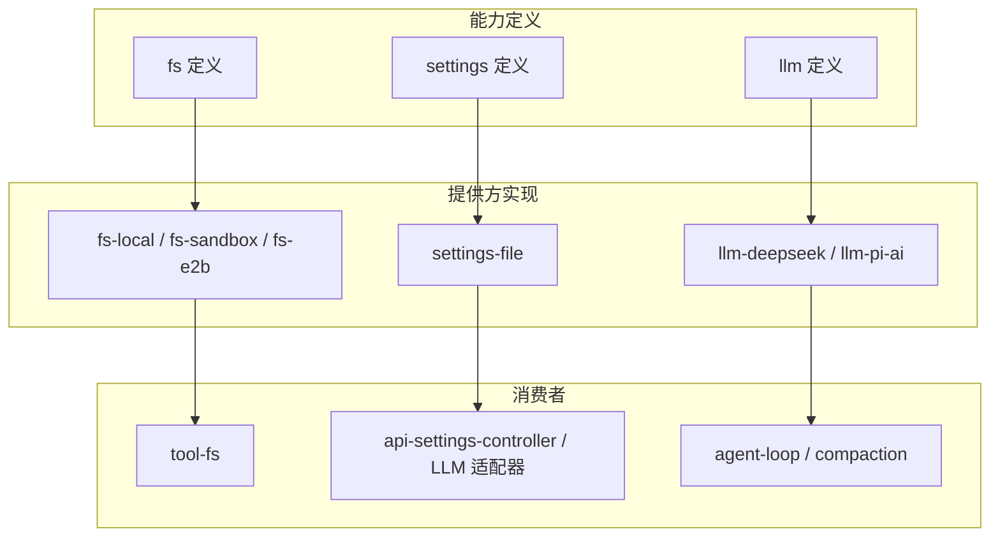
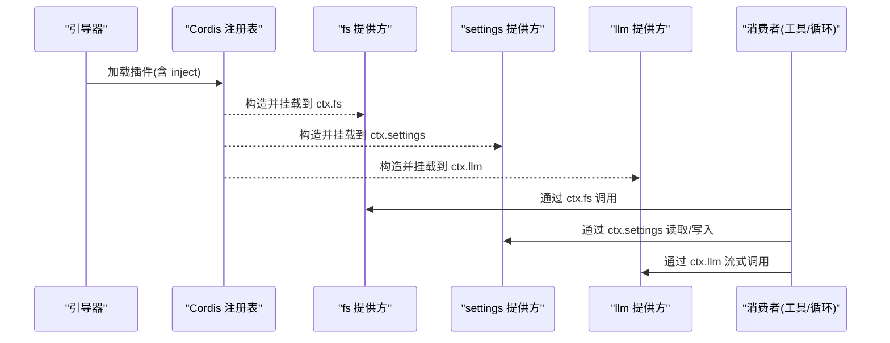
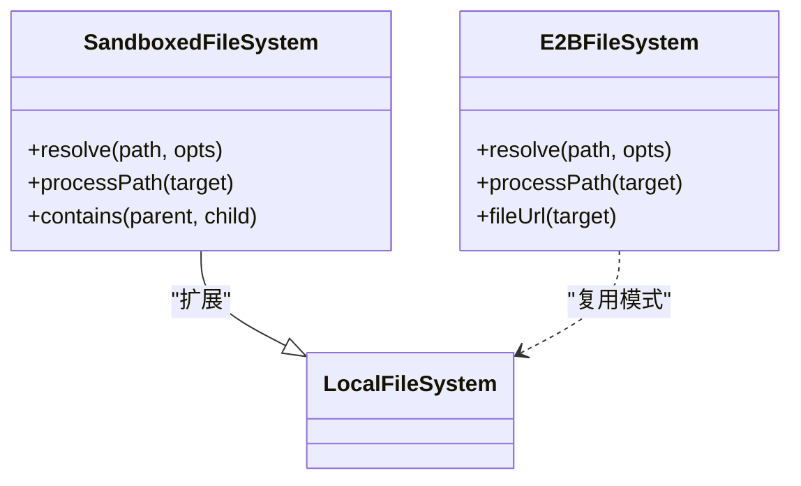
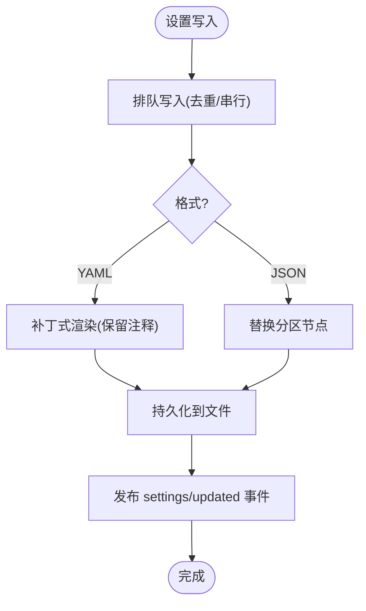

# 能力接缝实现

<cite>
**本文引用的文件**
- [docs/capability-seams.md](file://docs/capability-seams.md)
- [docs/glossary.md](file://docs/glossary.md)
- [docs/cordis-primer.md](file://docs/cordis-primer.md)
- [docs/cordis-api/registry.md](file://docs/cordis-api/registry.md)
- [packages/fs/fs-sandbox/src/index.ts](file://packages/fs/fs-sandbox/src/index.ts)
- [packages/fs/fs-sandbox/tests/fs-sandbox.spec.ts](file://packages/fs/fs-sandbox/tests/fs-sandbox.spec.ts)
- [packages/e2b/fs-e2b/src/index.ts](file://packages/e2b/fs-e2b/src/index.ts)
- [packages/settings/settings/src/index.ts](file://packages/settings/settings/src/index.ts)
- [packages/settings/settings-file/src/index.ts](file://packages/settings/settings-file/src/index.ts)
- [packages/settings/settings-file/tests/local.spec.ts](file://packages/settings/settings-file/tests/local.spec.ts)
- [packages/llm/llm-pi-ai/src/index.ts](file://packages/llm/llm-pi-ai/src/index.ts)
- [packages/llm/llm-deepseek/README.zh.md](file://packages/llm/llm-deepseek/README.zh.md)
- [packages/compaction/compaction-basic/tests/compaction-basic.spec.ts](file://packages/compaction/compaction-basic/tests/compaction-basic.spec.ts)
- [packages/llm/llm/tests/service.spec.ts](file://packages/llm/llm/tests/service.spec.ts)
</cite>

## 目录
1. [简介](#简介)
2. [项目结构](#项目结构)
3. [核心组件](#核心组件)
4. [架构总览](#架构总览)
5. [详细组件分析](#详细组件分析)
6. [依赖关系分析](#依赖关系分析)
7. [性能考虑](#性能考虑)
8. [故障排查指南](#故障排查指南)
9. [结论](#结论)
10. [附录](#附录)

## 简介
本文件系统性阐述 DeepSeek Harness 的“能力接缝（capability seam）”设计与实现。能力接缝是“可替换能力”的完整契约，包含三部分：服务定义（Service Definition）、服务提供方（Providers）与服务消费者（Consumers）。通过 Cordis 插件框架与上下文注入机制，消费方以稳定的 ctx.<key> 访问能力，而具体实现可在组合时动态替换，从而实现文件系统、LLM 适配器、设置等能力的热插拔与演进解耦。

## 项目结构
- 文档层：能力接缝总览、术语表、Cordis 入门与 API 参考，定义了“seam”概念与职责边界。
- 能力实现层：各包按“定义—提供方—消费者”分离组织，如 fs、settings、llm 等。
- 运行时层：通过 ctx.plugin 加载插件，声明 inject 依赖，完成服务注册与生命周期管理。



**图表来源**
- [docs/capability-seams.md:466-536](file://docs/capability-seams.md#L466-L536)
- [docs/glossary.md:7-9](file://docs/glossary.md#L7-L9)

**章节来源**
- [docs/capability-seams.md:466-536](file://docs/capability-seams.md#L466-L536)
- [docs/glossary.md:7-9](file://docs/glossary.md#L7-L9)

## 核心组件
- 能力接缝三要素
  - 服务定义：拥有 ctx.<key> 与领域词汇的 Service（抽象类或注册中心），不是 TypeScript interface。
  - 提供方：一个或多个实现，提供具体能力。
  - 消费者：注入并调用该服务的包。
- 典型示例
  - shell 接缝：dsh-shell（定义）、dsh-bash-local/dsh-bash-sandbox（提供方）、dsh-tool-bash（消费者）。
  - fs 接缝：ctx.fs；提供方包括本地、沙箱、E2B 等。
  - settings 接缝：ctx.settings；提供方为文件存储。
  - llm 接缝：ctx.llm；提供方为 deepseek/pi-ai 等适配器。

**章节来源**
- [docs/glossary.md:7-9](file://docs/glossary.md#L7-L9)
- [docs/capability-seams.md:466-536](file://docs/capability-seams.md#L466-L536)

## 架构总览
能力接缝通过 Cordis 的服务注册与注入实现动态绑定：
- 插件通过 ctx.plugin 加载，声明 inject 依赖，确保所需服务就绪。
- 提供方在启动时向 ctx 注册自身（例如 ctx.fs、ctx.settings、ctx.llm）。
- 消费者仅依赖稳定键名，不感知具体实现，从而支持热插拔与多实现并存。



**图表来源**
- [docs/cordis-primer.md:7-13](file://docs/cordis-primer.md#L7-L13)
- [docs/cordis-api/registry.md:35-56](file://docs/cordis-api/registry.md#L35-L56)

**章节来源**
- [docs/cordis-primer.md:7-13](file://docs/cordis-primer.md#L7-L13)
- [docs/cordis-api/registry.md:35-56](file://docs/cordis-api/registry.md#L35-L56)

## 详细组件分析

### 文件系统接缝（ctx.fs）
- 角色与职责
  - 定义：抽象文件系统能力（路径解析、读写、编辑、版本控制等）。
  - 提供方：fs-local（本地）、fs-sandbox（沙箱限制）、fs-e2b（远程 E2B）。
  - 消费者：tool-fs 等工具通过统一接口执行读/写/编辑。
- 关键实现要点
  - fs-sandbox 继承本地实现，叠加策略限制，拒绝越权操作并返回结构化 FsError。
  - fs-e2b 将路径规范化为进程内目标键，并通过 fileUrl 暴露可访问地址。
- 注册与测试
  - 测试验证作为 ctx.fs 注册、子 fiber 卸载后清理、以及沙箱拒绝错误码。



**图表来源**
- [packages/fs/fs-sandbox/src/index.ts:29-56](file://packages/fs/fs-sandbox/src/index.ts#L29-L56)
- [packages/e2b/fs-e2b/src/index.ts:174-203](file://packages/e2b/fs-e2b/src/index.ts#L174-L203)

**章节来源**
- [packages/fs/fs-sandbox/src/index.ts:29-56](file://packages/fs/fs-sandbox/src/index.ts#L29-L56)
- [packages/fs/fs-sandbox/tests/fs-sandbox.spec.ts:217-236](file://packages/fs/fs-sandbox/tests/fs-sandbox.spec.ts#L217-L236)
- [packages/e2b/fs-e2b/src/index.ts:174-203](file://packages/e2b/fs-e2b/src/index.ts#L174-L203)

### LLM 适配器接缝（ctx.llm）
- 角色与职责
  - 定义：提供方无关的流式生成服务与模型目录解析。
  - 提供方：llm-deepseek（官方直连）、llm-pi-ai（pi-ai 路由适配）。
  - 消费者：agent-loop、压缩模块等通过统一接口发起流式请求。
- 关键实现要点
  - pi-ai 适配器通过 settings 驱动配置，按需注册路由与模型目录。
  - deepseek 适配器提供独立路由，二者可并存但路由名需唯一。
- 注册与测试
  - 测试展示 registerAdapter、listProviders、resolveModelInfo 等行为。

```mermaid
sequenceDiagram
participant Loop as "Agent 循环"
participant Llm as "ctx.llm"
participant Adapter as "适配器(DeepSeek/pi-ai)"
participant Provider as "上游提供商"
Loop->>Llm : 选择路由/模型
Llm->>Adapter : stream(options)
Adapter->>Provider : 发送请求(携带认证/超时/重试策略)
Provider-->>Adapter : 流式分片
Adapter-->>Loop : 标准化分片事件
```

**图表来源**
- [packages/llm/llm-pi-ai/src/index.ts:58-91](file://packages/llm/llm-pi-ai/src/index.ts#L58-L91)
- [packages/llm/llm-deepseek/README.zh.md:1-32](file://packages/llm/llm-deepseek/README.zh.md#L1-L32)
- [packages/compaction/compaction-basic/tests/compaction-basic.spec.ts:73-79](file://packages/compaction/compaction-basic/tests/compaction-basic.spec.ts#L73-L79)
- [packages/llm/llm/tests/service.spec.ts:553-648](file://packages/llm/llm/tests/service.spec.ts#L553-L648)

**章节来源**
- [packages/llm/llm-pi-ai/src/index.ts:58-91](file://packages/llm/llm-pi-ai/src/index.ts#L58-L91)
- [packages/llm/llm-deepseek/README.zh.md:1-32](file://packages/llm/llm-deepseek/README.zh.md#L1-L32)
- [packages/compaction/compaction-basic/tests/compaction-basic.spec.ts:73-79](file://packages/compaction/compaction-basic/tests/compaction-basic.spec.ts#L73-L79)
- [packages/llm/llm/tests/service.spec.ts:553-648](file://packages/llm/llm/tests/service.spec.ts#L553-L648)

### 设置接缝（ctx.settings）
- 角色与职责
  - 定义：命名空间化的分层设置，提供注册、解析、变更监听与持久化。
  - 提供方：settings-file（YAML/JSON 文件），支持观察与防抖。
  - 消费者：API 控制器、LLM 适配器、UI 等。
- 关键实现要点
  - SettingsProvider 抽象类负责命名空间注册、变更检测、提交事件与队列化写入。
  - FileSettingsProvider 维护原文档缓存，增量补丁保留注释，避免覆盖用户手写内容。
- 注册与测试
  - 测试验证现有文档准备、从 YAML/JSON 读取分区、默认值合并等。



**图表来源**
- [packages/settings/settings/src/index.ts:344-368](file://packages/settings/settings/src/index.ts#L344-L368)
- [packages/settings/settings-file/src/index.ts:104-136](file://packages/settings/settings-file/src/index.ts#L104-L136)
- [packages/settings/settings-file/src/index.ts:340-368](file://packages/settings/settings-file/src/index.ts#L340-L368)
- [packages/settings/settings-file/tests/local.spec.ts:74-101](file://packages/settings/settings-file/tests/local.spec.ts#L74-L101)

**章节来源**
- [packages/settings/settings/src/index.ts:344-368](file://packages/settings/settings/src/index.ts#L344-L368)
- [packages/settings/settings-file/src/index.ts:104-136](file://packages/settings/settings-file/src/index.ts#L104-L136)
- [packages/settings/settings-file/src/index.ts:340-368](file://packages/settings/settings-file/src/index.ts#L340-L368)
- [packages/settings/settings-file/tests/local.spec.ts:74-101](file://packages/settings/settings-file/tests/local.spec.ts#L74-L101)

### 创建新的能力接缝（最佳实践）
- 接口设计
  - 使用 Service 抽象类或注册中心作为“服务定义”，明确 ctx.<key> 与领域类型。
  - 保持接口稳定，新增能力通过可选字段或扩展点引入，避免破坏消费者。
- 默认实现与可选扩展
  - 提供最小可用默认实现（如本地 fs、内存设置），同时允许沙箱/远程等增强实现。
  - 通过策略或服务拦截（intercept）注入差异化行为，而非修改核心接口。
- 服务注册与动态绑定
  - 提供方在插件启动时注册到 ctx，消费者通过 inject 声明依赖，由 Cordis 保证顺序与可用性。
- 测试方法
  - 单元测试覆盖注册/卸载、错误码、回退路径与并发安全（如设置写入队列、fs 沙箱拒绝）。
  - 集成测试验证端到端流程（如 LLM 流式响应、设置变更传播）。

**章节来源**
- [docs/glossary.md:7-9](file://docs/glossary.md#L7-L9)
- [docs/cordis-api/registry.md:35-56](file://docs/cordis-api/registry.md#L35-L56)
- [packages/fs/fs-sandbox/tests/fs-sandbox.spec.ts:217-236](file://packages/fs/fs-sandbox/tests/fs-sandbox.spec.ts#L217-L236)
- [packages/settings/settings-file/tests/local.spec.ts:74-101](file://packages/settings/settings-file/tests/local.spec.ts#L74-L101)

## 依赖关系分析
- 耦合与内聚
  - 消费方仅依赖稳定键名，降低对实现的耦合；提供方内聚于具体能力。
- 直接/间接依赖
  - fs 提供方依赖策略（sandbox-policy）与宿主环境；settings 提供方依赖文件系统 IO；llm 提供方依赖认证、网络与重试策略。
- 外部集成点
  - 网络（HTTP/WebSocket）、文件系统、操作系统交互（终端/PTY）、第三方 SDK（E2B、pi-ai）。
- 循环依赖规避
  - 通过服务定义与提供方分离、事件总线与回调解耦，避免环状导入。


**图表来源**
- [docs/capability-seams.md:466-536](file://docs/capability-seams.md#L466-L536)

**章节来源**
- [docs/capability-seams.md:466-536](file://docs/capability-seams.md#L466-L536)

## 性能考虑
- 设置写入队列化与防抖：避免频繁 IO 与竞争条件，保障并发安全。
- 流式 LLM 调用：采用流式分片减少首字节延迟，合理设置超时与空闲超时。
- 沙箱策略检查：在 fs 写入前进行路径与权限判定，失败快速返回，避免无效 IO。
- 资源复用：共享连接与句柄（如 E2B 会话、HTTP 客户端），减少建立开销。

[本节为通用指导，无需特定文件引用]

## 故障排查指南
- 文件系统沙箱拒绝
  - 现象：写入被拒绝，抛出结构化 FsError，错误码指示原因（如 FS_SANDBOX_DENIED）。
  - 排查：确认当前工作区根、沙箱模式与授权升级是否生效。
- 设置文件冲突
  - 现象：并发写入导致数据不一致或丢失。
  - 排查：确认写入队列串行化与自写抑制逻辑，检查 watcher 防抖与文档缓存一致性。
- LLM 适配器未注册或路由冲突
  - 现象：未知提供方或重复路由报错。
  - 排查：检查插件加载顺序与路由名唯一性，确认 settings 中启用的提供者列表。

**章节来源**
- [packages/fs/fs-sandbox/tests/fs-sandbox.spec.ts:217-236](file://packages/fs/fs-sandbox/tests/fs-sandbox.spec.ts#L217-L236)
- [packages/settings/settings-file/src/index.ts:104-136](file://packages/settings/settings-file/src/index.ts#L104-L136)
- [packages/llm/llm/tests/service.spec.ts:553-648](file://packages/llm/llm/tests/service.spec.ts#L553-L648)

## 结论
能力接缝通过“定义—提供方—消费者”的清晰分层与 Cordis 的动态绑定，实现了 DeepSeek Harness 的可插拔架构。文件系统、LLM 适配器与设置等核心能力均以稳定接口对外暴露，具体实现可按部署需求灵活替换。遵循最佳实践与性能优化建议，可进一步提升系统的可维护性与运行效率。

[本节为总结，无需特定文件引用]

## 附录
- 术语与参考
  - capability-seam：见术语表，强调 seam 是完整能力而非单一接口。
  - Cordis 入门与 API：了解插件加载、服务注入与生命周期。
- 相关文档
  - 能力接缝总览图与表格：列出所有 ctx.* 键的角色、所有者、实现与消费者。

**章节来源**
- [docs/glossary.md:7-9](file://docs/glossary.md#L7-L9)
- [docs/cordis-primer.md:7-13](file://docs/cordis-primer.md#L7-L13)
- [docs/capability-seams.md:466-536](file://docs/capability-seams.md#L466-L536)