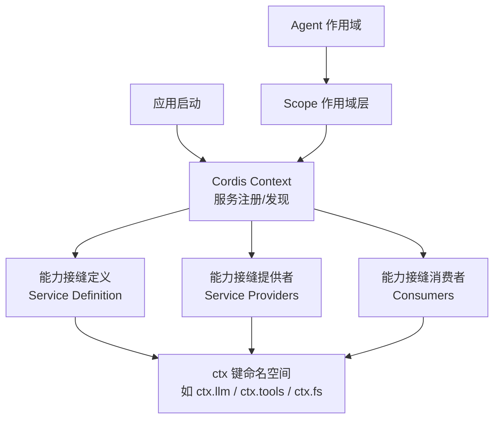
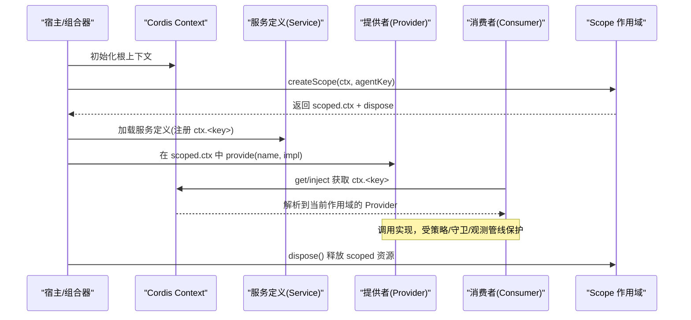
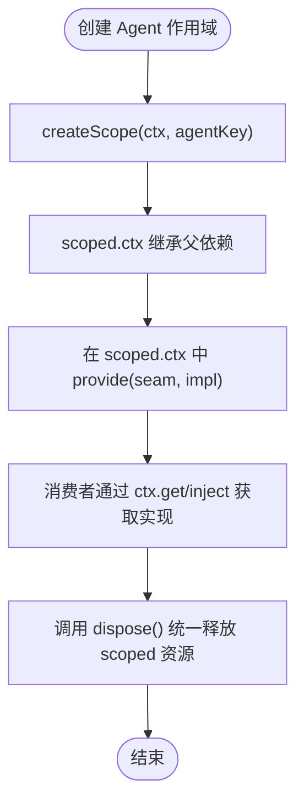
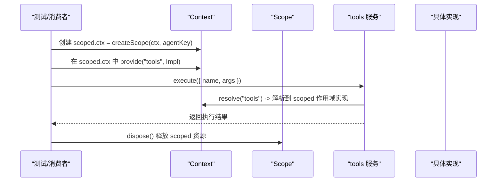
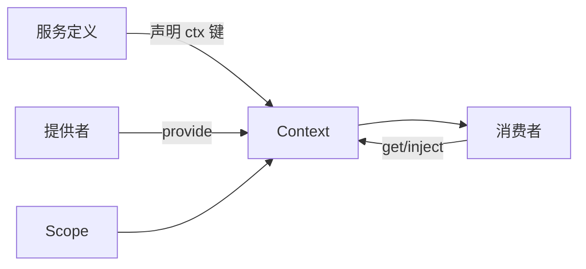

# 能力接缝机制

<cite>
**本文引用的文件**
- [docs/capability-seams.zh.md](file://docs/capability-seams.zh.md)
- [docs/cordis-api/service.md](file://docs/cordis-api/service.md)
- [docs/cordis-api/context.md](file://docs/cordis-api/context.md)
- [docs/subsystems/scope.md](file://docs/subsystems/scope.md)
- [packages/core/scope/src/index.ts](file://packages/core/scope/src/index.ts)
- [packages/core/agent/src/index.ts](file://packages/core/agent/src/index.ts)
- [packages/core/tools/tests/scoped.spec.ts](file://packages/core/tools/tests/scoped.spec.ts)
- [packages/core/system-prompt/tests/scoped.spec.ts](file://packages/core/system-prompt/tests/scoped.spec.ts)
</cite>

## 目录
1. [引言](#引言)
2. [项目结构](#项目结构)
3. [核心组件](#核心组件)
4. [架构总览](#架构总览)
5. [详细组件分析](#详细组件分析)
6. [依赖关系分析](#依赖关系分析)
7. [性能考量](#性能考量)
8. [故障排查指南](#故障排查指南)
9. [结论](#结论)
10. [附录](#附录)

## 引言
本文件系统性阐述 DeepSeek Harness 的“能力接缝（capability seam）”机制：什么是 seam、它由哪些角色构成、服务契约如何定义与注册、消费者如何发现与调用，以及作用域（scope）如何在单个智能体级别实现服务隔离与生命周期管理。文档同时给出实践建议与常见陷阱，帮助开发者安全地扩展系统能力。

## 项目结构
DeepSeek Harness 将“能力”抽象为可替换的 seam，并以 Cordis 上下文作为服务发现与依赖注入的基础设施。关键位置包括：
- 能力接缝清单与消费关系图：位于 docs/capability-seams.zh.md
- 服务基类与上下文 API：位于 docs/cordis-api/service.md、docs/cordis-api/context.md
- 作用域与分层注册：位于 docs/subsystems/scope.md 与 packages/core/scope/src/index.ts
- 智能体作用域与生命周期：位于 packages/core/agent/src/index.ts
- 作用域行为验证用例：位于 packages/core/tools/tests/scoped.spec.ts、packages/core/system-prompt/tests/scoped.spec.ts

图表来源
- [docs/capability-seams.zh.md:10-464](file://docs/capability-seams.zh.md#L10-L464)
- [docs/cordis-api/context.md:14-96](file://docs/cordis-api/context.md#L14-L96)
- [docs/subsystems/scope.md:29-59](file://docs/subsystems/scope.md#L29-L59)

章节来源
- [docs/capability-seams.zh.md:10-464](file://docs/capability-seams.zh.md#L10-L464)
- [docs/cordis-api/context.md:14-96](file://docs/cordis-api/context.md#L14-L96)
- [docs/subsystems/scope.md:29-59](file://docs/subsystems/scope.md#L29-L59)

## 核心组件
- 能力接缝（seam）：一个完整的能力由三部分构成——服务定义（Service Definition）、一个或多个提供者（Providers）、一个或多个消费者（Consumers）。例如 shell seam：dsh-shell（定义）、dsh-bash-local/dsh-bash-sandbox（提供者）、dsh-tool-bash（消费者）。
- 服务基类 Service：继承后在构造时通过 super(ctx, name) 立即注册到 ctx.<name>，并随 fiber 卸载自动移除。
- 上下文 Context：提供 extend/isolate/intercept/provide/get/set/accessor/mixin 等能力，用于创建子上下文、隔离服务作用域、拦截配置、注册与读取服务。
- 作用域 Scope：以不透明 ScopeKey 标识一层注册上下文，结合 Cordis effect/fiber 实现“可见性 + 所有权”的统一边界；createScope 返回 scoped context 与 dispose 边界。

章节来源
- [docs/capability-seams.zh.md:466-536](file://docs/capability-seams.zh.md#L466-L536)
- [docs/cordis-api/service.md:4-103](file://docs/cordis-api/service.md#L4-L103)
- [docs/cordis-api/context.md:14-96](file://docs/cordis-api/context.md#L14-L96)
- [docs/subsystems/scope.md:29-59](file://docs/subsystems/scope.md#L29-L59)
- [packages/core/scope/src/index.ts:129-156](file://packages/core/scope/src/index.ts#L129-L156)

## 架构总览
下图展示 seam 的角色分工与数据/控制流：服务定义声明契约与 ctx 键；提供者按作用域注册具体实现；消费者通过 ctx 发现并使用实现；Scope 保证每个 Agent 实例的服务隔离与生命周期。

图表来源
- [docs/cordis-api/context.md:14-96](file://docs/cordis-api/context.md#L14-L96)
- [docs/cordis-api/service.md:4-103](file://docs/cordis-api/service.md#L4-L103)
- [packages/core/scope/src/index.ts:129-156](file://packages/core/scope/src/index.ts#L129-L156)

## 详细组件分析

### 能力接缝（seam）的概念与角色
- 角色分离：服务定义（契约与词汇）、提供者（具体实现）、消费者（使用方）。三者通常分属不同包，便于独立演进。
- 典型示例：shell seam（dsh-shell / dsh-bash-local + dsh-bash-sandbox / dsh-tool-bash），fs seam（dsh-fs / fs-local + fs-sandbox + fs-e2b / tool-fs），llm seam（dsh-llm / llm-deepseek + llm-pi-ai + llm-replay / agent-loop）。
- 维护模式：服务从 Cordis 声明中发现；接口、实现、消费者角色分类在脚本中校验完整性。

章节来源
- [docs/capability-seams.zh.md:466-536](file://docs/capability-seams.zh.md#L466-L536)

### 服务契约：定义、注册与消费者依赖管理
- 定义方式：继承 Service 并在构造函数中调用 super(ctx, name)，即完成 ctx.<name> 注册；可通过静态符号扩展行为（init/check/config/invoke/extend/tracker/resolveConfig）。
- 注册时机：插件加载时立即注册，随 fiber 卸载自动移除。
- 消费者依赖：通过 Inject 声明（数组或对象形式），框架在插件上下文中解析依赖并可叠加拦截配置。
- 访问与覆盖：ctx.get(ctx.set/ctx.provide) 提供非注入式读写；accessor 提供计算属性；mixin 暴露方法直挂 ctx。

章节来源
- [docs/cordis-api/service.md:4-103](file://docs/cordis-api/service.md#L4-L103)
- [docs/cordis-api/context.md:235-365](file://docs/cordis-api/context.md#L235-L365)
- [docs/cordis-api/registry.md:121-153](file://docs/cordis-api/registry.md#L121-L153)

### 作用域（scope）机制：单智能体级隔离与生命周期
- 作用域标识：ScopeKey 是不透明的对象身份；ScopeLayer 表示某一层对注册的贡献；ScopedLayers 管理全局层与精确作用域层的合并与回收。
- 创建与作用域上下文：createScope(ctx, key) 在当前 fiber 下加载 scope 插件，返回 scoped.ctx（继承父依赖 API）与 dispose 边界；scopeOf(ctx) 可读取最近的作用域标签。
- 生命周期绑定：scoped.ctx 上的所有注册都受该 fiber/effect 生命周期约束；dispose 会静默等待并完成清理。
- 与 Agent 的关系：Agent 作用域通过 ScopeKey 路由，确保同一 Agent 内的服务可见性与共享生命周期，跨 Agent 隔离。

图表来源
- [packages/core/scope/src/index.ts:129-156](file://packages/core/scope/src/index.ts#L129-L156)
- [docs/subsystems/scope.md:29-59](file://docs/subsystems/scope.md#L29-L59)

章节来源
- [docs/subsystems/scope.md:29-59](file://docs/subsystems/scope.md#L29-L59)
- [packages/core/scope/src/index.ts:129-156](file://packages/core/scope/src/index.ts#L129-L156)

### 关键 ctx 服务与 seam 示例
- ctx.llm：LLM 适配器注册表；提供者如 llm-deepseek、llm-pi-ai、llm-replay；消费者如 agent-loop、compaction-basic。
- ctx.tools：工具注册与执行管线；负责 PTC 传输、策略前处理、单调守卫、环绕分派、策略后处理与结果观测；大量工具消费此服务。
- ctx.fs：文件系统提供者 seam；提供者包括 fs-local、fs-sandbox、fs-e2b；消费者 tool-fs 通过此 seam 执行读/写/编辑。
- ctx.shell：Shell 执行 seam；提供者 bash-local、bash-sandbox、pwsh-local；消费者 tool-bash/tool-pwsh 及 hooks 桥接。
- ctx.subagents：子智能体提供方与延续编排；多种传输实现；tool-subagent/tool-subagent-control/tool-ralph 消费。
- ctx.sessionPersistence：会话持久化 seam；JSONL/SQLite 后端；被 agent-loop、hooks、query 等消费。
- ctx.settings/credentials：用户设置与凭据 seam；settings-file 存储原始文档；controller 提供脱敏视图与只写存储。
- ctx.web/webhookRuntime/lsp 等：网络、Webhook、语言服务器等 seam，分别对应搜索抓取、规则运行、标准化查询执行。

章节来源
- [docs/capability-seams.zh.md:466-536](file://docs/capability-seams.zh.md#L466-L536)

### 作用域隔离与服务发现流程（代码级时序）

图表来源
- [packages/core/tools/tests/scoped.spec.ts:24-59](file://packages/core/tools/tests/scoped.spec.ts#L24-L59)
- [packages/core/system-prompt/tests/scoped.spec.ts:14-21](file://packages/core/system-prompt/tests/scoped.spec.ts#L14-L21)
- [packages/core/scope/src/index.ts:129-156](file://packages/core/scope/src/index.ts#L129-L156)

章节来源
- [packages/core/tools/tests/scoped.spec.ts:24-59](file://packages/core/tools/tests/scoped.spec.ts#L24-L59)
- [packages/core/system-prompt/tests/scoped.spec.ts:14-21](file://packages/core/system-prompt/tests/scoped.spec.ts#L14-L21)

### 复杂逻辑：作用域内工具与提示词装配
- 工具装配：systemPrompt 在 scoped 上下文中仅装配该作用域的工具 schema，避免跨作用域污染。
- 作用域隔离验证：全局与 scoped 工具列表在不同 assemble 调用中正确区分，体现作用域隔离。

章节来源
- [packages/core/system-prompt/tests/scoped.spec.ts:164-175](file://packages/core/system-prompt/tests/scoped.spec.ts#L164-L175)

## 依赖关系分析
- 耦合与内聚：seam 的定义、提供者、消费者解耦，通过 ctx 键与 Scope 作用域降低直接耦合；高内聚体现在每个 seam 职责单一。
- 直接/间接依赖：消费者通过 ctx 间接依赖提供者；Scope 提供跨 fiber 的可见性与生命周期绑定。
- 外部集成点：Host/组合器负责加载插件、创建作用域、选择后端；API Gateway/Session Controller 等消费 core services。
- 循环依赖规避：通过作用域与事件总线解耦；服务定义不包含具体实现，避免环。

图表来源
- [docs/cordis-api/context.md:14-96](file://docs/cordis-api/context.md#L14-L96)
- [docs/subsystems/scope.md:29-59](file://docs/subsystems/scope.md#L29-L59)

章节来源
- [docs/capability-seams.zh.md:466-536](file://docs/capability-seams.zh.md#L466-L536)
- [docs/cordis-api/context.md:14-96](file://docs/cordis-api/context.md#L14-L96)
- [docs/subsystems/scope.md:29-59](file://docs/subsystems/scope.md#L29-L59)

## 性能考量
- 作用域查找开销：Scope 层合并与查找在每次解析时进行，但通过惰性创建与缓存减少成本。
- 工具执行管线：tools 服务包含策略前处理、守卫、环绕分派与观测，应尽量减少昂贵钩子。
- 持久化后端：sessionPersistence/storage 等 seam 的后端选择影响 I/O 性能；按需启用与批量化写入可降低延迟。
- 并发与竞态：Scope.dispose 支持并发等待完成，避免重复释放导致的竞争条件。

[本节为通用指导，无需特定文件引用]

## 故障排查指南
- 服务未找到：检查是否在正确的 scoped.ctx 中 provide；确认 isolate/label 是否一致；查看 provider fiber 是否已激活。
- 作用域泄漏：确保调用 Scope.dispose；在 Agent 生命周期结束时释放 scoped 资源。
- 循环依赖：通过事件或异步消息解耦；避免在服务初始化时互相注入。
- 配置冲突：使用 intercept 为插件上下文叠加配置；避免同名服务在不同作用域意外覆盖。
- 生命周期错误：遵循 Cordis fiber 模型，不要在已卸载 fiber 中访问服务；利用 hasLifecycleAncestor 等机制判断归属。

章节来源
- [packages/core/agent/src/index.ts:630-672](file://packages/core/agent/src/index.ts#L630-L672)
- [docs/cordis-api/context.md:235-365](file://docs/cordis-api/context.md#L235-L365)

## 结论
DeepSeek Harness 通过“能力接缝”将系统能力抽象为可替换、可组合、可隔离的服务单元。借助 Cordis 上下文与 Scope 作用域，系统在单个智能体级别实现了清晰的服务隔离与生命周期管理。开发者应遵循 seam 三角色分离原则，合理定义契约、实现提供者与管理消费者依赖，并通过作用域与生命周期保障系统的可扩展性与稳定性。

[本节为总结，无需特定文件引用]

## 附录

### 最佳实践
- 明确 seam 边界：将易变能力抽为 seam，稳定部分保留在 core。
- 作用域最小化：仅在必要时使用 isolate/Scope，避免过度分割导致复杂度上升。
- 依赖显式化：使用 Inject 声明依赖，配合 intercept 精细控制插件上下文。
- 生命周期对齐：将资源分配与释放绑定到 fiber/effect 或 Scope.dispose。
- 可观测性：在 tools 管线中增加观测点，便于定位问题与性能瓶颈。

[本节为通用指导，无需特定文件引用]