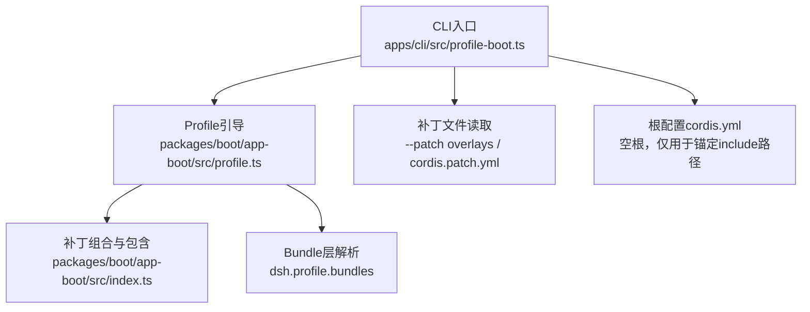
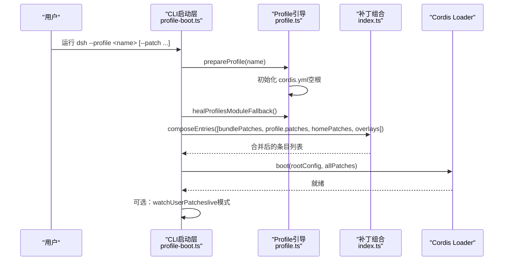
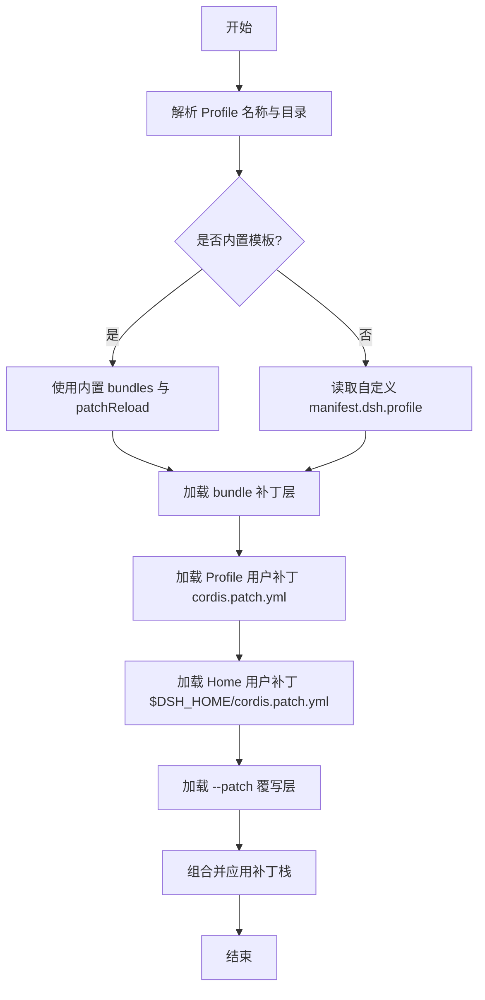
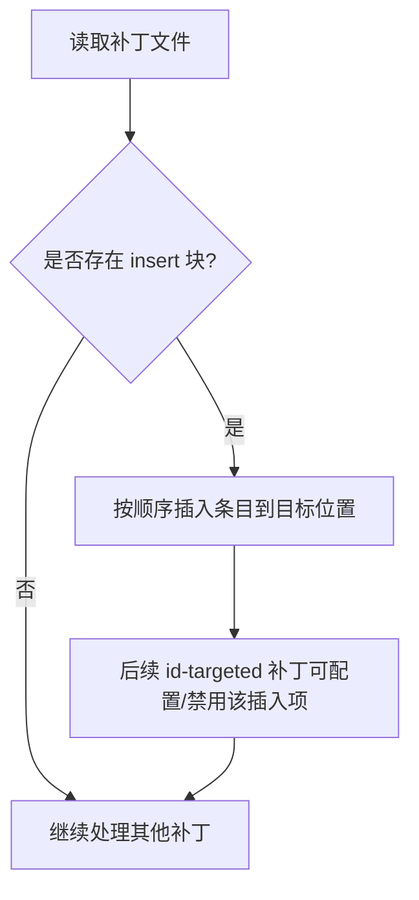
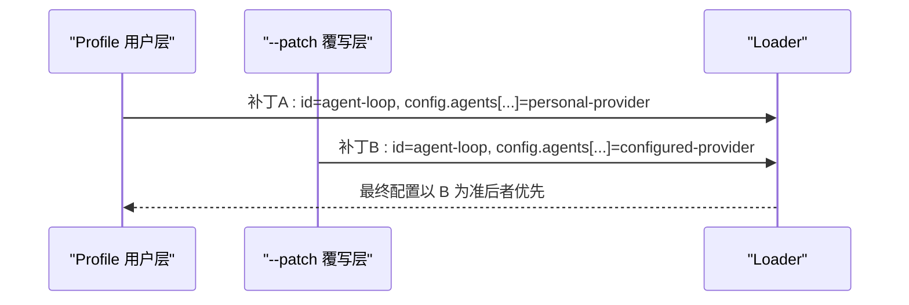
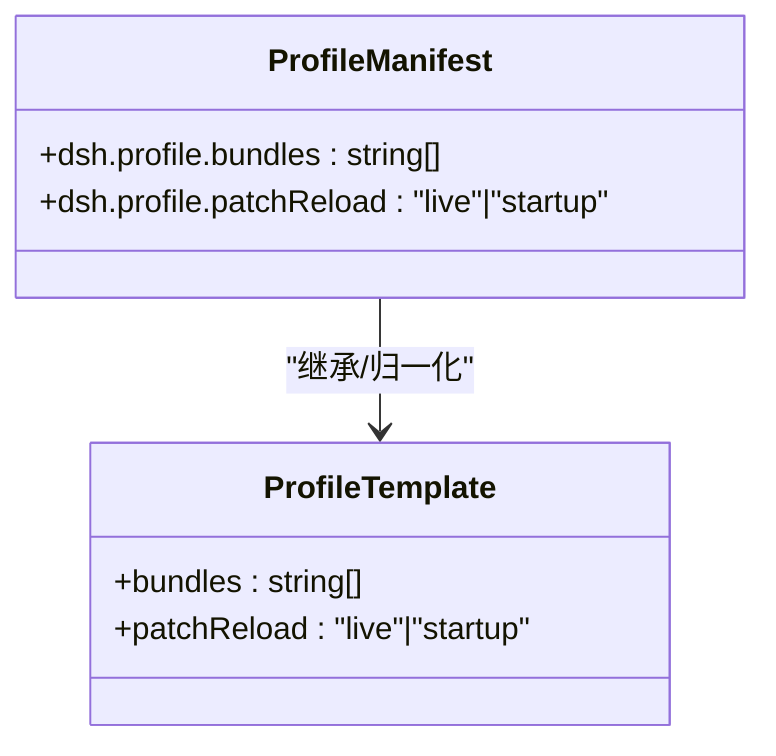
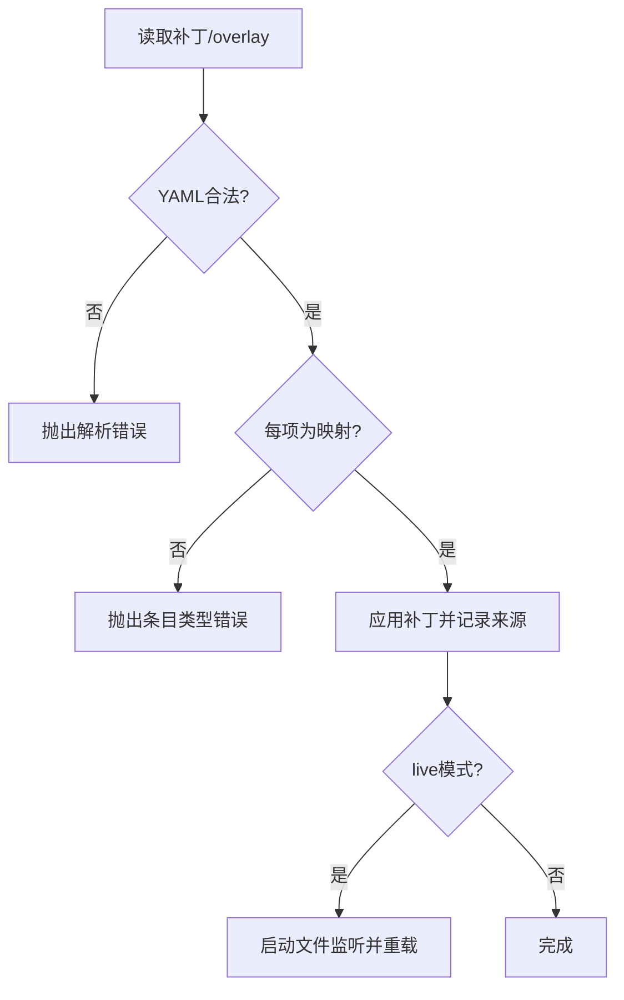
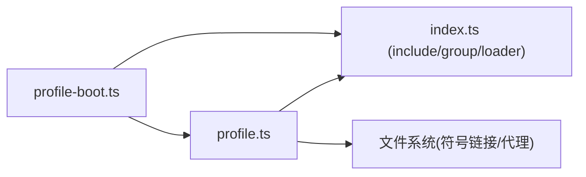

# Profile覆盖机制

<cite>
**本文引用的文件**
- [profile.ts](file://packages/boot/app-boot/src/profile.ts)
- [profile-boot.ts](file://apps/cli/src/profile-boot.ts)
- [index.ts](file://packages/boot/app-boot/src/index.ts)
- [built-bin.e2e.ts](file://apps/cli/tests/built-bin.e2e.ts)
- [config-reload.spec.ts](file://packages/boot/app-boot/tests/config-reload.spec.ts)
- [agent-team-profile/cordis.patch.yml](file://packages/experimental/agent-team-profile/cordis.patch.yml)
- [subagent-claude-code/cordis.patch.yml](file://packages/subagent/subagent-claude-code/cordis.patch.yml)
- [2026-08-04-configuration-source-ownership.md](file://.agents/notes/implemented/architecture/2026-08-04-configuration-source-ownership.md)
</cite>

## 目录
1. [简介](#简介)
2. [项目结构](#项目结构)
3. [核心组件](#核心组件)
4. [架构总览](#架构总览)
5. [详细组件分析](#详细组件分析)
6. [依赖关系分析](#依赖关系分析)
7. [性能考量](#性能考量)
8. [故障排查指南](#故障排查指南)
9. [结论](#结论)
10. [附录](#附录)

## 简介
本文件系统性说明 DeepSeek Harness 的 Profile 覆盖机制，包括：
- Profile 文件的命名规范、位置与加载顺序
- 如何通过 insert 操作符动态插入和修改插件配置
- 覆盖内置插件、新增插件实例、修改现有插件行为的实践示例
- Profile 继承机制（基于基础 Profile 构建特定环境）
- Profile 验证规则，确保配置的正确性与一致性

## 项目结构
Profile 相关能力由“引导层”和“CLI启动层”共同实现：
- 引导层负责发现 Profile、解析 Bundle 层、维护模块回退、组合补丁栈
- CLI启动层负责组装最终补丁栈、写入根配置、注入运行时上下文、支持热重载

图表来源
- [profile-boot.ts:118-173](file://apps/cli/src/profile-boot.ts#L118-L173)
- [profile.ts:127-158](file://packages/boot/app-boot/src/profile.ts#L127-L158)
- [index.ts:291-308](file://packages/boot/app-boot/src/index.ts#L291-L308)

章节来源
- [profile.ts:1-120](file://packages/boot/app-boot/src/profile.ts#L1-L120)
- [profile-boot.ts:1-173](file://apps/cli/src/profile-boot.ts#L1-L173)
- [index.ts:1-200](file://packages/boot/app-boot/src/index.ts#L1-L200)

## 核心组件
- Profile 定义与模板
  - Profile 目录位于 $DSH_HOME/profiles/<name>，包含 package.json、cordis.patch.yml、pnpm-workspace.yaml
  - 内置模板：acp、web、headless、sdk、sdk-minimal，声明 bundles 与 patchReload
- 补丁栈（Patch Stack）
  - 应用顺序：Bundle 层 → Profile 用户层 → Home 用户层 → --patch 覆写层 → 遥测开关
- 模块回退（Module Fallback）
  - 保证跨进程一致性与打包可执行场景下的模块实例唯一性
- 根配置与 include
  - 每个 Profile 的 cordis.yml 为空数组，作为 include 锚点；所有行为通过补丁叠加

章节来源
- [profile.ts:40-169](file://packages/boot/app-boot/src/profile.ts#L40-L169)
- [profile-boot.ts:79-173](file://apps/cli/src/profile-boot.ts#L79-L173)
- [profile.ts:579-677](file://packages/boot/app-boot/src/profile.ts#L579-L677)

## 架构总览
下图展示一次 dsh --profile 启动时的配置组合流程与覆盖优先级。

图表来源
- [profile-boot.ts:118-173](file://apps/cli/src/profile-boot.ts#L118-L173)
- [profile-boot.ts:209-307](file://apps/cli/src/profile-boot.ts#L209-L307)
- [profile.ts:197-217](file://packages/boot/app-boot/src/profile.ts#L197-L217)
- [index.ts:291-308](file://packages/boot/app-boot/src/index.ts#L291-L308)

## 详细组件分析

### Profile 命名、位置与加载顺序
- 命名与位置
  - Profile 名称为目录名，禁止包含路径分隔符或特殊名称
  - 目录位于 $DSH_HOME/profiles/<name>
- 加载顺序（非凭据值）
  - 显式运行参数 > 用户设置 > Composition（Profile Bundles + 用户补丁 + --patch 覆写）> 当前进程的 Shell 环境变量 > 发现的 .env 文件 > Schema/提供方默认值
- 关键约束
  - Composition 高于环境变量，避免陈旧的环境变量覆盖已配置的端点
  - 凭据采用更窄的独立顺序（进程环境最高）

图表来源
- [profile.ts:127-158](file://packages/boot/app-boot/src/profile.ts#L127-L158)
- [profile-boot.ts:135-173](file://apps/cli/src/profile-boot.ts#L135-L173)
- [2026-08-04-configuration-source-ownership.md:17-39](file://.agents/notes/implemented/architecture/2026-08-04-configuration-source-ownership.md#L17-L39)

章节来源
- [profile.ts:127-169](file://packages/boot/app-boot/src/profile.ts#L127-L169)
- [profile-boot.ts:135-173](file://apps/cli/src/profile-boot.ts#L135-L173)
- [2026-08-04-configuration-source-ownership.md:17-39](file://.agents/notes/implemented/architecture/2026-08-04-configuration-source-ownership.md#L17-L39)

### insert 操作符：动态插入与修改插件配置
- 作用
  - 在指定目标行之前插入新的插件条目（id/name/config）
  - 可与 id-targeted 补丁配合，先插入后配置/禁用
- 典型用法
  - 新增插件实例：insert 新 id/name/config
  - 修改已有插件：id-targeted config 覆盖
  - 禁用插件：id-targeted disabled: true
- 示例参考
  - 团队工作流 Profile 中插入 agent-team 与 tool-agent-team
  - Claude Code 子代理 Provider 的可选注册

图表来源
- [agent-team-profile/cordis.patch.yml:26-41](file://packages/experimental/agent-team-profile/cordis.patch.yml#L26-L41)
- [subagent-claude-code/cordis.patch.yml:4-7](file://packages/subagent/subagent-claude-code/cordis.patch.yml#L4-L7)
- [config-reload.spec.ts:342-369](file://packages/boot/app-boot/tests/config-reload.spec.ts#L342-L369)

章节来源
- [agent-team-profile/cordis.patch.yml:1-41](file://packages/experimental/agent-team-profile/cordis.patch.yml#L1-L41)
- [subagent-claude-code/cordis.patch.yml:1-7](file://packages/subagent/subagent-claude-code/cordis.patch.yml#L1-L7)
- [config-reload.spec.ts:282-369](file://packages/boot/app-boot/tests/config-reload.spec.ts#L282-L369)

### 覆盖内置插件配置、添加新插件、修改行为
- 覆盖内置插件
  - 通过 id-targeted 补丁修改 config 字段
  - 或通过 disabled: true 禁用内置工具/服务
- 添加新插件实例
  - 使用 insert 块新增 id/name/config
- 修改现有插件行为
  - 结合 insert 与 id-targeted 补丁，先插入再配置/禁用
- 端到端验证
  - e2e 测试演示了 Profile 用户层与 --patch 覆写的组合顺序与生效结果

图表来源
- [built-bin.e2e.ts:970-1009](file://apps/cli/tests/built-bin.e2e.ts#L970-L1009)

章节来源
- [built-bin.e2e.ts:970-1009](file://apps/cli/tests/built-bin.e2e.ts#L970-L1009)

### Profile 继承机制：基于基础 Profile 构建特定环境
- 基础 Profile
  - 内置模板（如 web、headless、sdk）提供 bundles 与 patchReload 默认值
- 继承方式
  - 自定义 Profile 可在 manifest 中声明 dsh.profile.bundles，选择多个 Bundle 层进行叠加
  - 安装级模板映射允许将历史 tuple 归一化为当前模板
- 热重载策略
  - patchReload: 'live' 或 'startup'，控制用户补丁文件的热更新时机

图表来源
- [profile.ts:136-169](file://packages/boot/app-boot/src/profile.ts#L136-L169)
- [profile.ts:721-743](file://packages/boot/app-boot/src/profile.ts#L721-L743)

章节来源
- [profile.ts:136-169](file://packages/boot/app-boot/src/profile.ts#L136-L169)
- [profile.ts:721-743](file://packages/boot/app-boot/src/profile.ts#L721-L743)

### Profile 验证规则：确保正确性与一致性
- 名称校验
  - 禁止包含路径分隔符或保留名（如 node_modules）
- Bundle 校验
  - 列出的 Bundle 必须存在且导出补丁；未声明 dsh.bundle 视为误配
- 补丁格式校验
  - overlay 与 patch 文件必须为 YAML 顶层数组；每项需为映射
  - 缺失或格式错误会抛出明确诊断信息
- 运行时一致性
  - 每次重新读取补丁都会重新应用，避免引用共享导致的污染
  - live 模式下对 cordis.patch.yml 与 $DSH_HOME/cordis.patch.yml 进行监听并重载

图表来源
- [index.ts:291-308](file://packages/boot/app-boot/src/index.ts#L291-L308)
- [profile-boot.ts:230-307](file://apps/cli/src/profile-boot.ts#L230-L307)
- [profile.ts:685-699](file://packages/boot/app-boot/src/profile.ts#L685-L699)

章节来源
- [index.ts:291-308](file://packages/boot/app-boot/src/index.ts#L291-L308)
- [profile-boot.ts:230-307](file://apps/cli/src/profile-boot.ts#L230-L307)
- [profile.ts:685-699](file://packages/boot/app-boot/src/profile.ts#L685-L699)

## 依赖关系分析
- 组件耦合
  - CLI启动层依赖 Profile引导层进行发现与组合
  - 补丁组合依赖 Cordis Include/Group 与 Loader
  - 模块回退依赖 Node 包解析与文件系统链接/代理
- 外部依赖
  - Cordis 插件加载器与 include/group 插件
  - JS-YAML 解析配置文件
  - 文件系统 API 管理符号链接与代理

图表来源
- [profile-boot.ts:118-173](file://apps/cli/src/profile-boot.ts#L118-L173)
- [profile.ts:579-677](file://packages/boot/app-boot/src/profile.ts#L579-L677)
- [index.ts:291-308](file://packages/boot/app-boot/src/index.ts#L291-L308)

章节来源
- [profile-boot.ts:118-173](file://apps/cli/src/profile-boot.ts#L118-L173)
- [profile.ts:579-677](file://packages/boot/app-boot/src/profile.ts#L579-L677)
- [index.ts:291-308](file://packages/boot/app-boot/src/index.ts#L291-L308)

## 性能考量
- 补丁对象克隆
  - 为避免 insert 引用污染，每次重新组合时都会结构化克隆补丁对象，减少内存复用带来的副作用
- 热重载开销
  - live 模式会监听两个补丁文件，频繁编辑可能触发多次重组合；建议合理拆分补丁与增量修改
- 模块回退
  - 首次启动需要计算依赖闭包并创建符号链接/代理；后续启动若状态一致则跳过

章节来源
- [profile-boot.ts:230-251](file://apps/cli/src/profile-boot.ts#L230-L251)
- [profile.ts:579-677](file://packages/boot/app-boot/src/profile.ts#L579-L677)

## 故障排查指南
- 常见错误
  - 无效的 Profile 名称：包含路径分隔符或保留名
  - Bundle 未找到或未导出补丁：检查 dsh.profile.bundles 与包清单
  - overlay/patch 文件格式错误：顶层必须为数组，每项为映射
  - 找不到目标 id：id-targeted 补丁无法匹配到任何条目时会报错
- 定位方法
  - 使用 --dump-config 查看最终组合结果
  - 检查 stderr 中的“patch: entry ... not found”等诊断信息
  - 确认 $DSH_HOME/cordis.patch.yml 与 Profile 的 cordis.patch.yml 内容

章节来源
- [profile.ts:127-134](file://packages/boot/app-boot/src/profile.ts#L127-L134)
- [profile.ts:778-789](file://packages/boot/app-boot/src/profile.ts#L778-L789)
- [built-bin.e2e.ts:970-1009](file://apps/cli/tests/built-bin.e2e.ts#L970-L1009)

## 结论
DeepSeek Harness 的 Profile 覆盖机制通过“分层补丁”的方式，实现了高度可组合、可继承、可热更新的配置体系。借助 insert 操作符与 id-targeted 补丁，用户可以灵活地插入新插件、覆盖内置行为、并在不同环境中快速切换。严格的验证规则与清晰的加载顺序保证了配置的一致性与可预测性。

## 附录
- 快速上手
  - 创建自定义 Profile：在 $DSH_HOME/profiles 下新建目录，编写 package.json 与 cordis.patch.yml
  - 使用内置模板：通过 dsh plugin init 或直接编辑 manifest 选择 bundles
  - 使用 --patch 覆写：命令行传入 overlay 文件，优先级高于 Profile 用户层
- 最佳实践
  - 将通用配置放入 Profile 用户层，机器级偏好放入 $DSH_HOME/cordis.patch.yml
  - 将临时调试配置放在 --patch overlay，便于撤销
  - 合理使用 patchReload 策略，平衡开发体验与稳定性