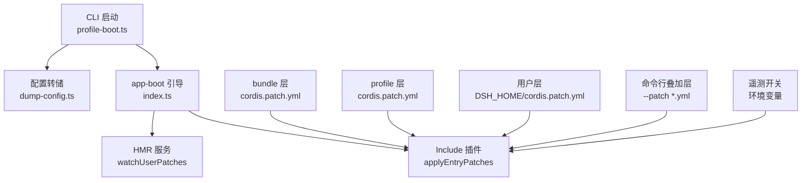
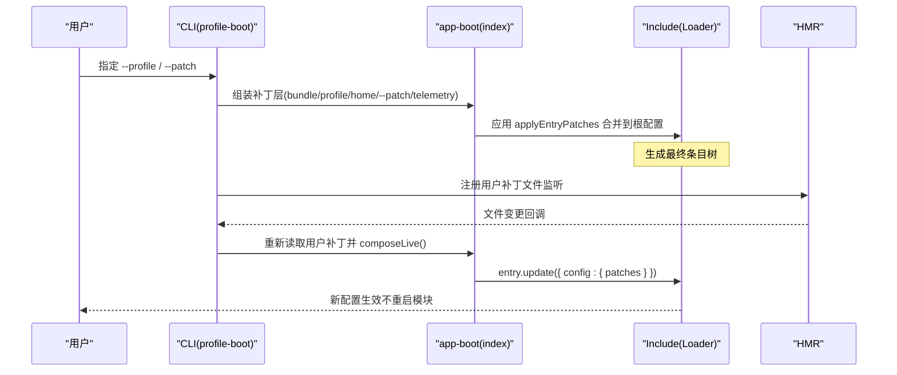
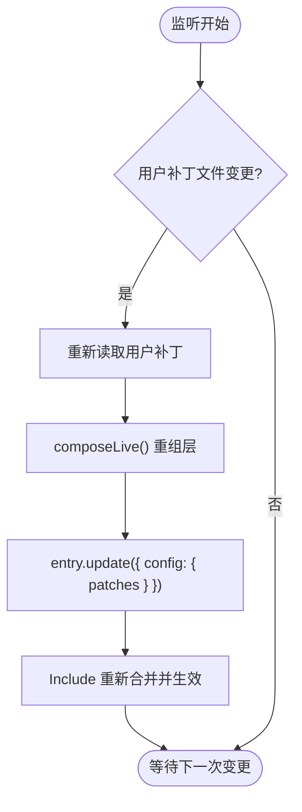
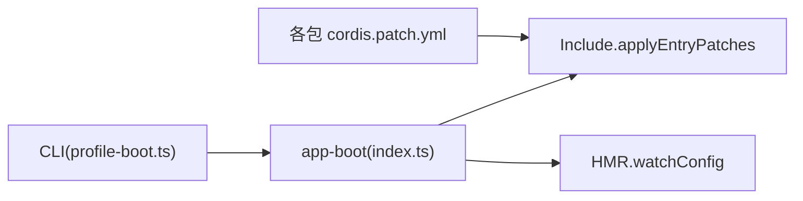

# 补丁文件系统

<cite>
**本文引用的文件**
- [apps/cli/src/profile-boot.ts](file://apps/cli/src/profile-boot.ts)
- [apps/cli/src/dump-config.ts](file://apps/cli/src/dump-config.ts)
- [packages/boot/app-boot/src/index.ts](file://packages/boot/app-boot/src/index.ts)
- [packages/boot/app-boot/tests/user-patches.spec.ts](file://packages/boot/app-boot/tests/user-patches.spec.ts)
- [packages/boot/app-boot/tests/config-reload.spec.ts](file://packages/boot/app-boot/tests/config-reload.spec.ts)
- [packages/experimental/inspector/cordis.patch.yml](file://packages/experimental/inspector/cordis.patch.yml)
- [apps/cli/src/sdk-source.cordis.patch.yml](file://apps/cli/src/sdk-source.cordis.patch.yml)
</cite>

## 目录
1. [简介](#简介)
2. [项目结构](#项目结构)
3. [核心组件](#核心组件)
4. [架构总览](#架构总览)
5. [详细组件分析](#详细组件分析)
6. [依赖关系分析](#依赖关系分析)
7. [性能考虑](#性能考虑)
8. [故障排查指南](#故障排查指南)
9. [结论](#结论)
10. [附录](#附录)

## 简介
本文件面向 DeepSeek Harness 的“补丁文件系统”，系统性说明补丁文件的语法、优先级与执行顺序，以及如何在运行时动态修改配置（新增字段、修改值、删除项）。文档还覆盖条件补丁、基于环境的动态配置、运行时热更新、错误处理机制与最佳实践，帮助读者安全、可预期地组合多层补丁。

## 项目结构
DeepSeek Harness 将“补丁”作为一等公民：每个 profile 由多个“层”组成，每一层都是一份补丁列表；启动时按固定顺序合并并应用到根配置树中。关键路径如下：
- CLI 入口负责解析 profile、组装补丁层、启动引导与热更新监听
- app-boot 提供补丁加载、解析、HMR 监听与渲染等通用能力
- 各包通过 cordis.patch.yml 以“插入/禁用/配置”的方式扩展行为
- 用户级补丁位于 DSH_HOME 下，用于跨 profile 的全局覆盖

图表来源
- [apps/cli/src/profile-boot.ts:156-173](file://apps/cli/src/profile-boot.ts#L156-L173)
- [packages/boot/app-boot/src/index.ts:228-251](file://packages/boot/app-boot/src/index.ts#L228-L251)
- [apps/cli/src/dump-config.ts:30-52](file://apps/cli/src/dump-config.ts#L30-L52)

章节来源
- [apps/cli/src/profile-boot.ts:1-308](file://apps/cli/src/profile-boot.ts#L1-L308)
- [packages/boot/app-boot/src/index.ts:1-200](file://packages/boot/app-boot/src/index.ts#L1-L200)
- [apps/cli/src/dump-config.ts:1-54](file://apps/cli/src/dump-config.ts#L1-L54)

## 核心组件
- 补丁层与优先级
  - 应用顺序（从低到高）：bundle 层 → profile 层 → 用户层（DSH_HOME/cordis.patch.yml）→ 命令行叠加层（--patch）→ 遥测开关补丁
  - 后一层可覆盖前一层插入或配置的条目，确保用户与运行期覆盖具有最高优先级
- 补丁文件格式
  - 顶层为数组，每项为一个 Loader 条目（id/name/config/insert/disabled 等）
  - 支持 !!js 表达式注入运行时值
- 运行时热更新
  - 通过 HMR 监听用户补丁文件变更，事务性地重新应用补丁到 Include 根条目
- 配置转储
  - 无需启动完整应用即可输出最终组合结果，便于调试与 diff

章节来源
- [apps/cli/src/profile-boot.ts:124-173](file://apps/cli/src/profile-boot.ts#L124-L173)
- [packages/boot/app-boot/src/index.ts:228-251](file://packages/boot/app-boot/src/index.ts#L228-L251)
- [apps/cli/src/dump-config.ts:30-52](file://apps/cli/src/dump-config.ts#L30-L52)

## 架构总览
下图展示了从 CLI 启动到补丁合并、再到运行时热更新的端到端流程。

图表来源
- [apps/cli/src/profile-boot.ts:209-306](file://apps/cli/src/profile-boot.ts#L209-L306)
- [packages/boot/app-boot/src/index.ts:228-251](file://packages/boot/app-boot/src/index.ts#L228-L251)

## 详细组件分析

### 补丁层与优先级
- 层来源
  - bundle 层：来自 dsh.profile.bundles 声明的各包补丁
  - profile 层：profile 自身的 cordis.patch.yml
  - 用户层：$DSH_HOME/cordis.patch.yml（机器级偏好，覆盖 profile 层）
  - 命令行叠加层：--patch 指定的文件（argv 顺序）
  - 遥测开关：根据 DSH_TELEMETRY_DISABLED 与是否存在对应行生成 disabled 补丁
- 合并规则
  - 所有层被展平后一次性调用 applyEntryPatches 合并
  - id 相同则后层覆盖前层；insert 追加；disabled 可禁用已有行
- 示例
  - 禁用某 loader：使用 id + disabled: true
  - 插入新插件：使用 insert 数组添加 id/name/config

章节来源
- [apps/cli/src/profile-boot.ts:124-173](file://apps/cli/src/profile-boot.ts#L124-L173)
- [packages/boot/app-boot/src/index.ts:408-470](file://packages/boot/app-boot/src/index.ts#L408-L470)
- [packages/experimental/inspector/cordis.patch.yml:1-9](file://packages/experimental/inspector/cordis.patch.yml#L1-L9)
- [apps/cli/src/sdk-source.cordis.patch.yml:1-6](file://apps/cli/src/sdk-source.cordis.patch.yml#L1-L6)

### 运行时动态修改配置（热更新）
- 触发方式
  - 当 profile 的 patchReload 为 live 时，CLI 会安装 HMR 监听用户补丁文件
- 工作机制
  - 监听 $DSH_HOME/cordis.patch.yml 与 profile 的 cordis.patch.yml
  - 变更时重新读取补丁，composeLive() 重组层，再调用 entry.update 原子替换补丁列表
  - 非补丁选项在每次刷新时也会重新读取，避免并发写入导致回退
- 适用场景
  - 运行时调整插件启用/禁用
  - 动态注入配置（如日志级别、超时、功能开关）
  - 临时覆盖默认值而不改动源码或打包产物

图表来源
- [apps/cli/src/profile-boot.ts:269-299](file://apps/cli/src/profile-boot.ts#L269-L299)
- [packages/boot/app-boot/src/index.ts:228-251](file://packages/boot/app-boot/src/index.ts#L228-L251)

章节来源
- [apps/cli/src/profile-boot.ts:269-299](file://apps/cli/src/profile-boot.ts#L269-L299)
- [packages/boot/app-boot/src/index.ts:228-251](file://packages/boot/app-boot/src/index.ts#L228-L251)
- [packages/boot/app-boot/tests/user-patches.spec.ts:346-403](file://packages/boot/app-boot/tests/user-patches.spec.ts#L346-L403)

### JSON Patch 格式与最佳实践
- 基本结构
  - 顶层必须为数组
  - 每项为 Loader 条目：id、name、config、insert、disabled 等
- 常用操作
  - 新增字段：在目标条目的 config 中追加键值
  - 修改现有值：覆盖同名键
  - 删除不需要的配置项：若上层未定义该键，可通过移除覆盖来“还原”；如需显式删除，可在更高层置空或禁用相关子项
- 表达式
  - 使用 !!js 注入运行时环境值（例如 process.env.*），注意安全性与可移植性
- 最佳实践
  - 尽量使用 id 精确匹配目标条目，避免误改
  - 将全局偏好放入 DSH_HOME/cordis.patch.yml，将特定 profile 的覆盖放入其 cordis.patch.yml
  - 使用 --patch 进行一次性覆盖或测试验证
  - 对关键开关使用 disabled 而非删除，便于回滚

章节来源
- [packages/boot/app-boot/src/index.ts:291-308](file://packages/boot/app-boot/src/index.ts#L291-L308)
- [packages/boot/app-boot/tests/user-patches.spec.ts:100-119](file://packages/boot/app-boot/tests/user-patches.spec.ts#L100-L119)
- [packages/boot/app-boot/tests/config-reload.spec.ts:342-369](file://packages/boot/app-boot/tests/config-reload.spec.ts#L342-L369)

### 条件补丁与基于环境的动态配置
- 基于环境变量的条件
  - 通过 !!js 表达式读取 DSH_* 等环境变量，构造不同补丁
  - 遥测开关即为此模式：当存在遥测行且环境变量开启时，生成 disabled 补丁
- 基于 profile 的组合
  - 不同 profile 自带不同 bundle/profile 层，天然形成“条件”
- 建议
  - 将敏感或平台相关逻辑放在用户层或 overlay 层
  - 保持表达式幂等，避免重复计算副作用

章节来源
- [apps/cli/src/profile-boot.ts:89-103](file://apps/cli/src/profile-boot.ts#L89-L103)
- [packages/boot/app-boot/src/index.ts:291-308](file://packages/boot/app-boot/src/index.ts#L291-L308)

### 运行时配置热更新与“热补丁”
- 热更新范围
  - 仅针对用户补丁层与 profile 补丁层（live 模式）
  - 不会重载模块代码，仅重新合并配置树
- 事务性与一致性
  - 每次变更通过 entry.update 原子替换补丁列表，避免中间态
  - 非补丁选项在每次刷新时重新读取，防止并发写冲突
- 回滚策略
  - 删除用户补丁文件或恢复上一版本即可回滚
  - 使用 --patch 进行临时覆盖，退出进程即失效

章节来源
- [apps/cli/src/profile-boot.ts:230-248](file://apps/cli/src/profile-boot.ts#L230-L248)
- [packages/boot/app-boot/src/index.ts:228-251](file://packages/boot/app-boot/src/index.ts#L228-L251)
- [packages/boot/app-boot/tests/config-reload.spec.ts:311-339](file://packages/boot/app-boot/tests/config-reload.spec.ts#L311-L339)

### 错误处理机制
- 解析失败
  - YAML 非法、顶层非数组、条目非对象等会在加载阶段抛出明确错误
- 表达式错误
  - !!js 表达式无内容或执行异常会被捕获并报告
- 运行时失败
  - 候选条目 apply 失败会广播 hmr/config-update-failed 事件，当前有效配置保持不变
- 恢复流程
  - 修复文件后自动重新应用；删除用户补丁文件会恢复到应用自有补丁
- 缺失依赖
  - 缺少 HMR 或根 Include 时，watchUserPatches 会立即报错，便于早期发现

章节来源
- [packages/boot/app-boot/tests/user-patches.spec.ts:100-119](file://packages/boot/app-boot/tests/user-patches.spec.ts#L100-L119)
- [packages/boot/app-boot/tests/user-patches.spec.ts:346-403](file://packages/boot/app-boot/tests/user-patches.spec.ts#L346-L403)
- [packages/boot/app-boot/tests/user-patches.spec.ts:405-453](file://packages/boot/app-boot/tests/user-patches.spec.ts#L405-L453)

## 依赖关系分析
- 组件耦合
  - CLI 依赖 app-boot 提供的补丁加载、HMR 监听与渲染能力
  - app-boot 依赖 Cordis Include 的 applyEntryPatches 完成实际合并
  - 各包通过 cordis.patch.yml 解耦地扩展行为
- 外部依赖
  - js-yaml 用于解析 YAML
  - Cordis HMR 用于热更新
  - dsh-home-paths 解析用户目录
- 循环依赖
  - 未见循环导入；补丁层通过 ID 定位条目，避免强耦合

图表来源
- [apps/cli/src/profile-boot.ts:156-173](file://apps/cli/src/profile-boot.ts#L156-L173)
- [packages/boot/app-boot/src/index.ts:408-470](file://packages/boot/app-boot/src/index.ts#L408-L470)

章节来源
- [apps/cli/src/profile-boot.ts:156-173](file://apps/cli/src/profile-boot.ts#L156-L173)
- [packages/boot/app-boot/src/index.ts:408-470](file://packages/boot/app-boot/src/index.ts#L408-L470)

## 性能考虑
- 合并复杂度
  - 每层补丁被展平后一次性合并，复杂度与条目数近似线性
- 热更新开销
  - 仅重新读取与合并补丁，不重载模块，开销较低
- 转储成本
  - 配置转储会逐层追踪 provenance，复杂度随层数与行数增长；仅在诊断时使用

[本节为通用指导，不直接分析具体文件]

## 故障排查指南
- 常见问题
  - YAML 语法错误：检查顶层是否为数组，条目是否为对象
  - 表达式错误：确认 !!js 表达式有合法内容且可执行
  - 热更新无效：确认已启用 HMR 且监听的是正确路径
  - 覆盖未生效：检查优先级，确认更高优先级层是否覆盖了你的更改
- 定位方法
  - 使用 --dump-config 输出最终组合，对比 --dump-default-config 查看差异
  - 关注 hmr/config-update-failed 事件获取失败详情
- 快速恢复
  - 回滚用户补丁文件或移除 --patch 覆盖
  - 修正后等待 HMR 自动重新应用

章节来源
- [packages/boot/app-boot/tests/user-patches.spec.ts:100-119](file://packages/boot/app-boot/tests/user-patches.spec.ts#L100-L119)
- [packages/boot/app-boot/tests/user-patches.spec.ts:346-403](file://packages/boot/app-boot/tests/user-patches.spec.ts#L346-L403)
- [apps/cli/src/dump-config.ts:30-52](file://apps/cli/src/dump-config.ts#L30-L52)

## 结论
DeepSeek Harness 的补丁文件系统通过分层、可组合、可热更新的机制，提供了强大而安全的配置扩展能力。遵循优先级与最佳实践，可以在不侵入源码的前提下实现条件化、环境化与运行时的灵活配置管理。配合配置转储与完善的错误处理，能够高效定位问题并快速恢复。

## 附录
- 典型用法速查
  - 新增字段：在目标条目 config 中添加键值
  - 修改值：覆盖同名键
  - 删除项：在更高层移除覆盖或禁用相关子项
  - 条件补丁：使用 !!js 读取环境变量
  - 热更新：编辑用户补丁文件，等待 HMR 自动应用
- 参考示例
  - 插入新插件：见 inspector 包的 cordis.patch.yml
  - 禁用内置行：见 SDK 源 checkout 的 cordis.patch.yml

章节来源
- [packages/experimental/inspector/cordis.patch.yml:1-9](file://packages/experimental/inspector/cordis.patch.yml#L1-L9)
- [apps/cli/src/sdk-source.cordis.patch.yml:1-6](file://apps/cli/src/sdk-source.cordis.patch.yml#L1-L6)