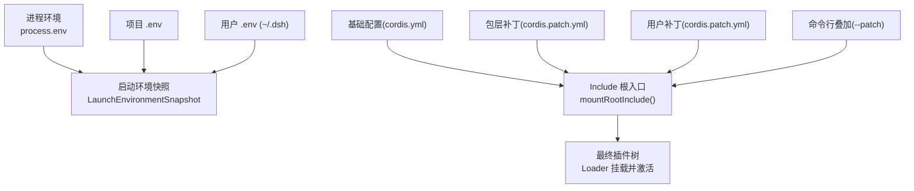
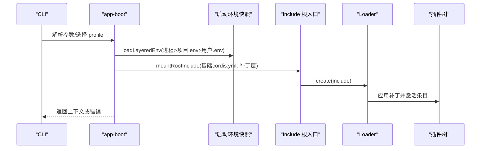
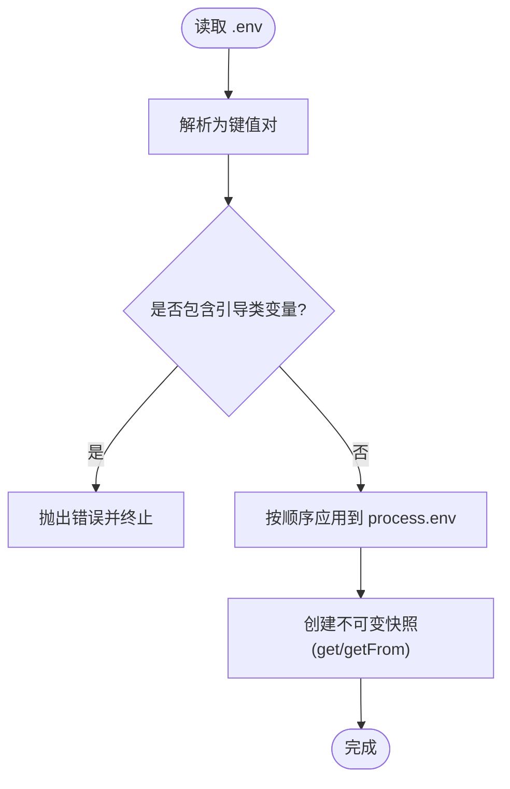
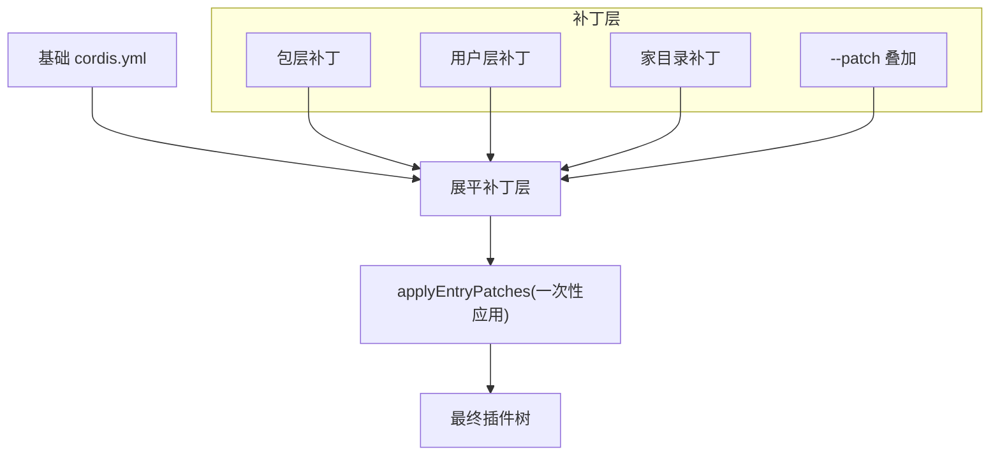
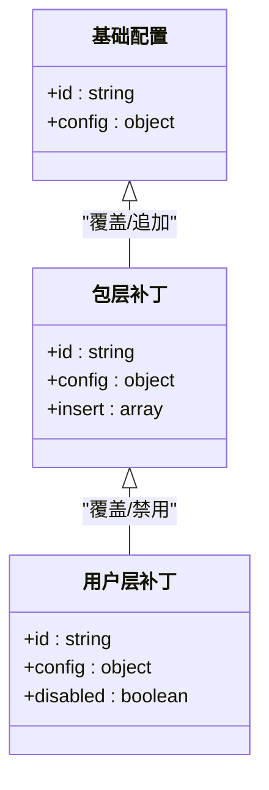
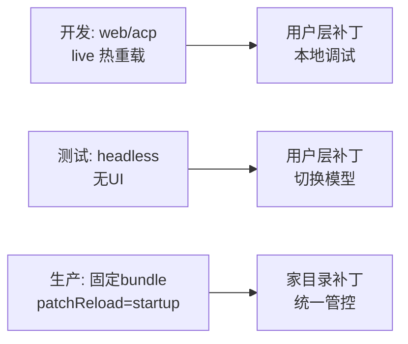
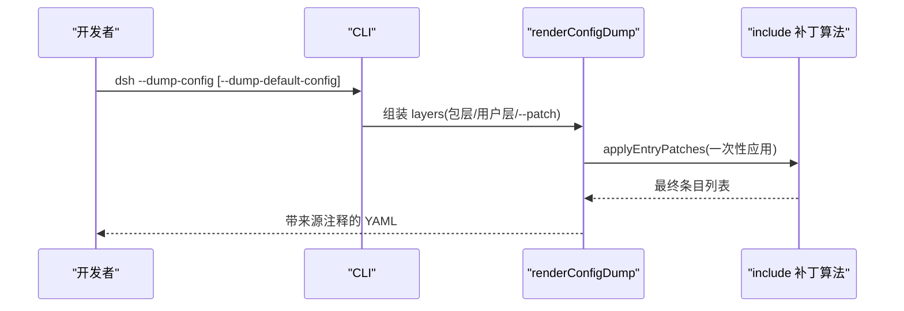
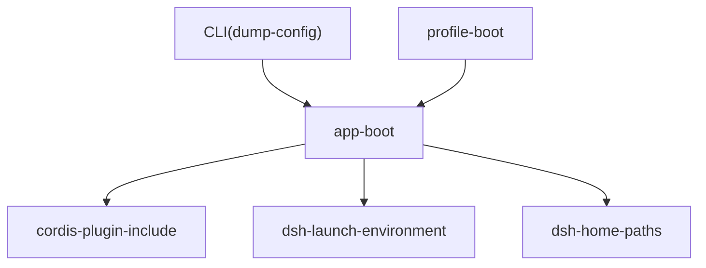

# 配置分层架构

<cite>
**本文引用的文件**
- [packages/boot/app-boot/src/index.ts](file://packages/boot/app-boot/src/index.ts)
- [packages/util/launch-environment/src/index.ts](file://packages/util/launch-environment/src/index.ts)
- [apps/cli/src/dump-config.ts](file://apps/cli/src/dump-config.ts)
- [apps/cli/config/examples/cordis/cordis.yml](file://apps/cli/config/examples/cordis/cordis.yml)
- [packages/boot/app-boot/src/profile.ts](file://packages/boot/app-boot/src/profile.ts)
- [apps/cli/src/profile-boot.ts](file://apps/cli/src/profile-boot.ts)
- [packages/boot/app-boot/tests/app-boot.spec.ts](file://packages/boot/app-boot/tests/app-boot.spec.ts)
- [packages/util/launch-environment/tests/launch-environment.spec.ts](file://packages/util/launch-environment/tests/launch-environment.spec.ts)
- [packages/boot/app-boot/tests/config-reload.spec.ts](file://packages/boot/app-boot/tests/config-reload.spec.ts)
- [apps/cli/tests/built-bin.e2e.ts](file://apps/cli/tests/built-bin.e2e.ts)
</cite>

## 目录
1. [简介](#简介)
2. [项目结构](#项目结构)
3. [核心组件](#核心组件)
4. [架构总览](#架构总览)
5. [详细组件分析](#详细组件分析)
6. [依赖关系分析](#依赖关系分析)
7. [性能考量](#性能考量)
8. [故障排查指南](#故障排查指南)
9. [结论](#结论)
10. [附录](#附录)

## 简介
本文件系统化说明 DeepSeek Harness 的配置分层架构，覆盖基础配置、用户配置与环境配置的层次与优先级；解释每种来源的作用域与覆盖机制；详述配置合并算法（对象合并、数组处理、冲突解决）；给出开发/测试/生产环境的组织示例；说明子配置如何继承父配置属性；并提供配置调试工具以诊断加载与合并问题。

## 项目结构
DeepSeek Harness 的配置由“环境快照”和“插件树补丁层”两部分组成：
- 环境快照：进程启动时的环境变量分层（进程 > 项目 .env > 用户 .env），提供不可变的启动期视图。
- 插件树补丁层：基于 Cordis Include 的补丁列表，按层顺序应用，实现基础配置、包层、用户层与命令行叠加层的组合。

**图示来源**
- [packages/boot/app-boot/src/index.ts:180-200](file://packages/boot/app-boot/src/index.ts#L180-L200)
- [packages/boot/app-boot/src/index.ts:501-544](file://packages/boot/app-boot/src/index.ts#L501-L544)
- [packages/util/launch-environment/src/index.ts:78-103](file://packages/util/launch-environment/src/index.ts#L78-L103)

**章节来源**
- [packages/boot/app-boot/src/index.ts:180-200](file://packages/boot/app-boot/src/index.ts#L180-L200)
- [packages/util/launch-environment/src/index.ts:78-103](file://packages/util/launch-environment/src/index.ts#L78-L103)

## 核心组件
- 启动环境快照：封装进程、项目、用户三层环境变量，提供 get/getFrom 查询，保证只读与可追溯来源。
- 分层环境加载：按“进程 > 项目 .env > 用户 .env”顺序解析并应用，禁止在 .env 中设置引导类变量。
- Include 根入口：将基础配置与多层补丁一次性扁平化应用，生成最终插件树。
- 配置转储：在不启动应用的前提下，输出带来源注释的有效配置，便于对比与排错。
- 配置文件与补丁：基础 cordis.yml + 多个 cordis.patch.yml（包层、用户层、--patch 叠加）。

**章节来源**
- [packages/util/launch-environment/src/index.ts:1-125](file://packages/util/launch-environment/src/index.ts#L1-L125)
- [packages/boot/app-boot/src/index.ts:180-200](file://packages/boot/app-boot/src/index.ts#L180-L200)
- [packages/boot/app-boot/src/index.ts:394-457](file://packages/boot/app-boot/src/index.ts#L394-L457)
- [apps/cli/src/dump-config.ts:1-54](file://apps/cli/src/dump-config.ts#L1-L54)

## 架构总览
下图展示从启动到最终生效的配置流：环境快照与补丁层并行工作，前者决定运行期环境变量，后者决定插件树结构与配置。

**图示来源**
- [packages/boot/app-boot/src/index.ts:180-200](file://packages/boot/app-boot/src/index.ts#L180-L200)
- [packages/boot/app-boot/src/index.ts:501-544](file://packages/boot/app-boot/src/index.ts#L501-L544)
- [packages/boot/app-boot/src/index.ts:772-800](file://packages/boot/app-boot/src/index.ts#L772-L800)

## 详细组件分析

### 环境配置分层与优先级
- 层级顺序（信任度从高到低）：进程环境 > 项目 .env > 用户 .env。
- 作用域：
  - 进程环境：由外部注入，不可被 .env 覆盖。
  - 项目 .env：仅对当前工作目录有效。
  - 用户 .env：位于 Harness home（~/.dsh），跨项目共享。
- 覆盖规则：
  - 同名键高优先级层覆盖低优先级层。
  - 空字符串值被视为“存在值”，由拥有者自行判断。
  - Windows 下键名大小写折叠，POSIX 保持精确匹配。
- 安全限制：
  - 禁止在 .env 中设置“引导类”变量（如 PATH、SSL_*、代理相关等），这些必须由启动环境显式导出。

**图示来源**
- [packages/boot/app-boot/src/index.ts:95-167](file://packages/boot/app-boot/src/index.ts#L95-L167)
- [packages/util/launch-environment/src/index.ts:78-103](file://packages/util/launch-environment/src/index.ts#L78-L103)

**章节来源**
- [packages/boot/app-boot/src/index.ts:95-200](file://packages/boot/app-boot/src/index.ts#L95-L200)
- [packages/util/launch-environment/src/index.ts:1-125](file://packages/util/launch-environment/src/index.ts#L1-L125)
- [packages/boot/app-boot/tests/app-boot.spec.ts:97-185](file://packages/boot/app-boot/tests/app-boot.spec.ts#L97-L185)
- [packages/util/launch-environment/tests/launch-environment.spec.ts:21-42](file://packages/util/launch-environment/tests/launch-environment.spec.ts#L21-L42)

### 配置合并算法（补丁层）
- 基础配置：cordis.yml（或快照版本）作为根配置。
- 补丁层来源与顺序：
  1) 包层补丁（bundle cordis.patch.yml）
  2) 用户层补丁（profile cordis.patch.yml）
  3) 用户家目录补丁（~/.dsh 下的可选补丁）
  4) 命令行叠加（--patch 文件）
- 合并策略：
  - 所有补丁层被展平后一次性通过 include 的 applyEntryPatches 应用，确保可见性与顺序一致。
  - id 目标替换整行 config；insert 追加新条目。
  - 未匹配的 id 会发出警告（与 Loader 启动时一致）。
- 对象与数组：
  - 针对某 id 的 config 替换为完整对象（深替换）。
  - insert 列表中的条目按顺序插入，后续层可再次修改或删除。

**图示来源**
- [packages/boot/app-boot/src/index.ts:394-457](file://packages/boot/app-boot/src/index.ts#L394-L457)
- [apps/cli/src/dump-config.ts:30-52](file://apps/cli/src/dump-config.ts#L30-L52)
- [apps/cli/src/profile-boot.ts:230-251](file://apps/cli/src/profile-boot.ts#L230-L251)

**章节来源**
- [packages/boot/app-boot/src/index.ts:394-457](file://packages/boot/app-boot/src/index.ts#L394-L457)
- [apps/cli/src/dump-config.ts:1-54](file://apps/cli/src/dump-config.ts#L1-L54)
- [apps/cli/src/profile-boot.ts:230-251](file://apps/cli/src/profile-boot.ts#L230-L251)
- [packages/boot/app-boot/tests/config-reload.spec.ts:342-369](file://packages/boot/app-boot/tests/config-reload.spec.ts#L342-L369)

### 配置继承链（子配置继承父配置）
- 继承方式：通过 id 目标进行配置替换，子层可覆盖父层任意字段；insert 可在父层基础上追加。
- 行为特性：
  - 后续层能访问并修改前一层插入的条目，避免“包层私有”导致用户无法覆盖。
  - 禁用条目可通过 disabled 标志移除。
- 典型场景：
  - 包层提供默认模型与提供商；用户层替换 provider/model。
  - 用户层禁用不需要的工具或服务。

**图示来源**
- [packages/boot/app-boot/tests/config-reload.spec.ts:342-369](file://packages/boot/app-boot/tests/config-reload.spec.ts#L342-L369)
- [apps/cli/tests/built-bin.e2e.ts:970-1009](file://apps/cli/tests/built-bin.e2e.ts#L970-L1009)

**章节来源**
- [packages/boot/app-boot/tests/config-reload.spec.ts:342-369](file://packages/boot/app-boot/tests/config-reload.spec.ts#L342-L369)
- [apps/cli/tests/built-bin.e2e.ts:970-1009](file://apps/cli/tests/built-bin.e2e.ts#L970-L1009)

### 不同环境的配置组织示例
- 开发环境：
  - 使用 web 或 acp profile，启用 live 热重载；通过 cordis.patch.yml 添加本地调试工具与服务。
  - 示例参考：[apps/cli/config/examples/cordis/cordis.yml:1-20](file://apps/cli/config/examples/cordis/cordis.yml#L1-L20)。
- 测试环境：
  - 使用 headless profile，关闭 UI，聚焦自动化执行；通过用户层补丁切换模型与提供商。
- 生产环境：
  - 固定 bundle 列表与 patchReload=‘startup’；通过家目录补丁统一管控敏感配置；使用 --patch 做灰度覆盖。

**图示来源**
- [packages/boot/app-boot/src/profile.ts:136-158](file://packages/boot/app-boot/src/profile.ts#L136-L158)
- [apps/cli/config/examples/cordis/cordis.yml:1-20](file://apps/cli/config/examples/cordis/cordis.yml#L1-L20)

**章节来源**
- [packages/boot/app-boot/src/profile.ts:136-158](file://packages/boot/app-boot/src/profile.ts#L136-L158)
- [apps/cli/config/examples/cordis/cordis.yml:1-20](file://apps/cli/config/examples/cordis/cordis.yml#L1-L20)

### 配置调试工具
- dsh --dump-config：
  - 输出最终组成的插件树 YAML，每段带有来源注释（基础文件与被哪些层打过补丁）。
  - 支持 --dump-default-config 对比默认与用户差异。
  - 不启动应用、不执行 !!js 表达式，纯函数式组合。
- 关键能力：
  - 逐层标签：每个补丁层有独立 label。
  - 未匹配警告：与 Loader 启动时一致的 stderr 提示。
  - 来源追踪：同一来源连续块用 # == 分隔，显示 origin 与 patchedBy。

**图示来源**
- [apps/cli/src/dump-config.ts:30-52](file://apps/cli/src/dump-config.ts#L30-L52)
- [packages/boot/app-boot/src/index.ts:394-457](file://packages/boot/app-boot/src/index.ts#L394-L457)

**章节来源**
- [apps/cli/src/dump-config.ts:1-54](file://apps/cli/src/dump-config.ts#L1-L54)
- [packages/boot/app-boot/src/index.ts:394-457](file://packages/boot/app-boot/src/index.ts#L394-L457)

## 依赖关系分析
- app-boot 依赖：
  - cordis-plugin-include：提供 applyEntryPatches 与 entryListSchema。
  - dsh-launch-environment：构建不可变的环境快照。
  - dsh-home-paths：解析 Harness home。
- CLI 依赖：
  - dump-config 调用 app-boot 的 renderConfigDump 与补丁加载函数。
  - profile-boot 负责 profile 发现、bundle 层解析与补丁重组。

**图示来源**
- [packages/boot/app-boot/src/index.ts:14-21](file://packages/boot/app-boot/src/index.ts#L14-L21)
- [apps/cli/src/dump-config.ts:9-17](file://apps/cli/src/dump-config.ts#L9-L17)
- [apps/cli/src/profile-boot.ts:230-251](file://apps/cli/src/profile-boot.ts#L230-L251)

**章节来源**
- [packages/boot/app-boot/src/index.ts:14-21](file://packages/boot/app-boot/src/index.ts#L14-L21)
- [apps/cli/src/dump-config.ts:9-17](file://apps/cli/src/dump-config.ts#L9-L17)
- [apps/cli/src/profile-boot.ts:230-251](file://apps/cli/src/profile-boot.ts#L230-L251)

## 性能考量
- 补丁合并采用一次性 applyEntryPatches，避免多次重建索引带来的额外开销。
- 配置转储路径会重复计算前缀快照并比较 JSON 序列化结果，复杂度与层数平方成正比，但仅在调试路径触发。
- 环境快照构建时对每层 values 进行拷贝与 Map 化，保证只读与快速查找。

[本节为通用指导，无需特定文件引用]

## 故障排查指南
- 常见错误与定位：
  - .env 设置了引导类变量：会在解析阶段抛出错误，需改为进程导出。
  - 补丁未匹配目标：stderr 会打印层标签与警告，检查 id 是否正确。
  - 插件未激活：启动后会审计 fiber 状态，列出失败或未就绪的条目。
- 建议步骤：
  - 使用 dsh --dump-config 查看最终组成与来源注释。
  - 对比 dsh --dump-default-config 与用户配置差异。
  - 逐步移除 --patch 与用户层补丁，缩小范围。
  - 检查 profile 的 patchReload 模式（live/startup）是否符合预期。

**章节来源**
- [packages/boot/app-boot/src/index.ts:95-167](file://packages/boot/app-boot/src/index.ts#L95-L167)
- [packages/boot/app-boot/src/index.ts:672-740](file://packages/boot/app-boot/src/index.ts#L672-L740)
- [apps/cli/tests/built-bin.e2e.ts:970-1009](file://apps/cli/tests/built-bin.e2e.ts#L970-L1009)

## 结论
DeepSeek Harness 通过“环境快照 + 补丁层”的分层架构，实现了清晰、可追溯且安全的配置管理。环境层保障启动期变量的可信来源与最小权限；补丁层通过统一的合并算法与严格的来源标注，使基础、包、用户与命令行叠加层协同工作。借助 --dump-config 等调试工具，开发者可以快速理解并修正配置问题，提升多环境交付的可维护性。

## 附录
- 术语
  - 基础配置：cordis.yml，定义插件树的初始结构。
  - 补丁层：cordis.patch.yml 或 --patch 文件，用于覆盖与扩展基础配置。
  - 环境快照：进程、项目、用户三层环境变量的不可变视图。
- 最佳实践
  - 将敏感信息放入家目录补丁或进程导出，避免提交到仓库。
  - 使用 --dump-config 验证最终配置，保留 diff 记录。
  - 在生产环境固定 bundle 列表与 patchReload 策略，减少运行时不确定性。

[本节为概念性内容，无需特定文件引用]