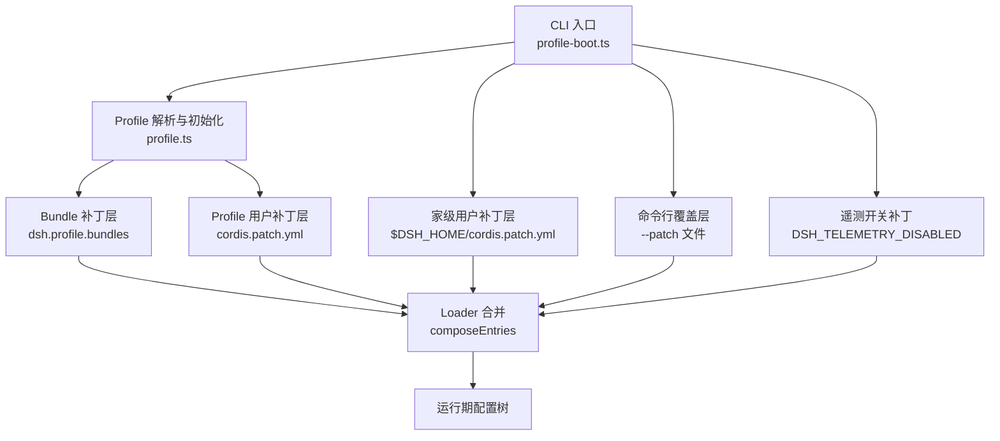
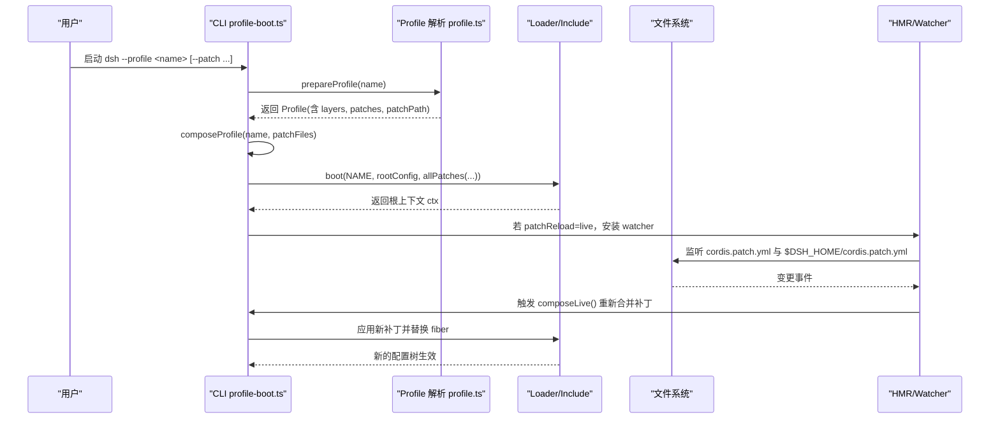
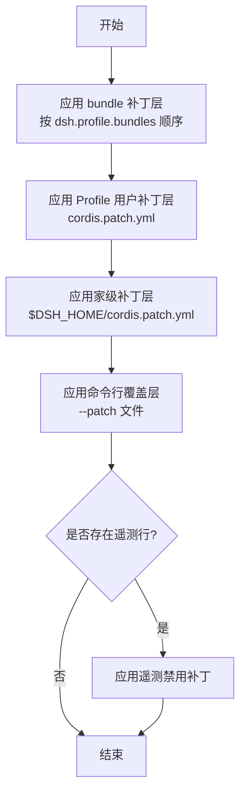
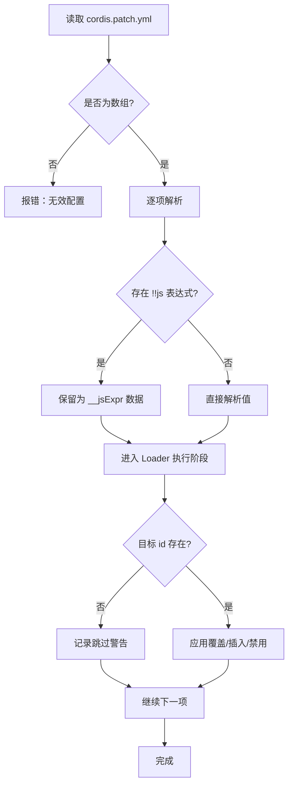
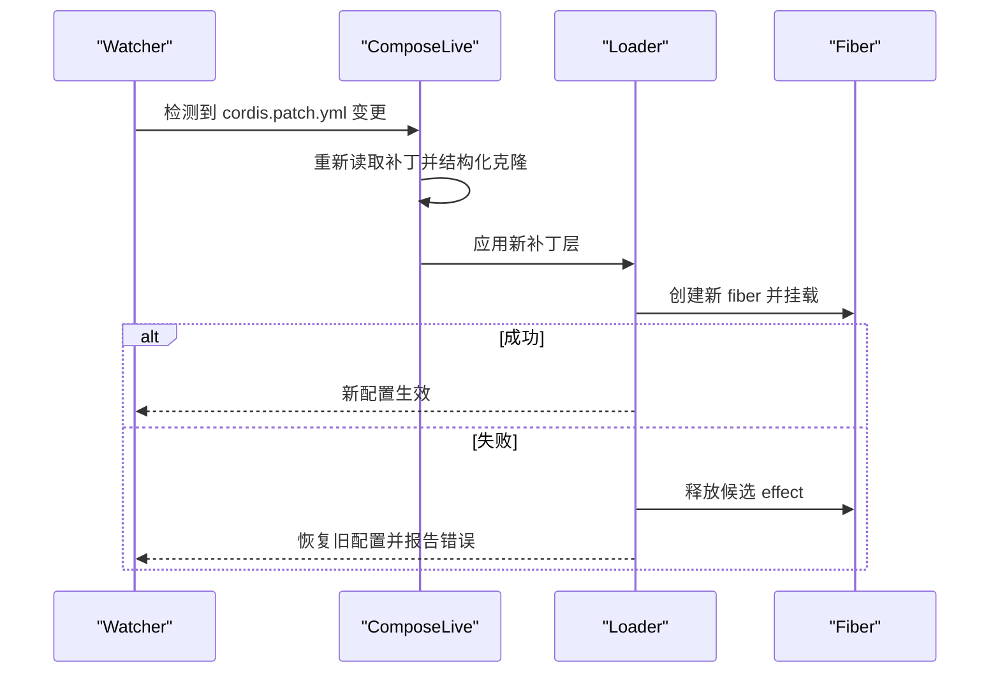
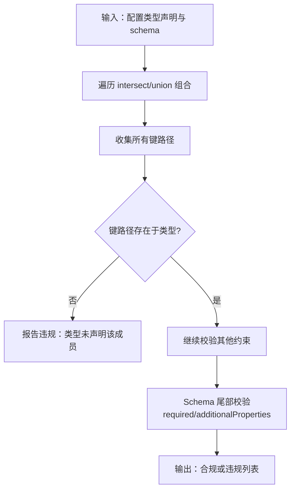
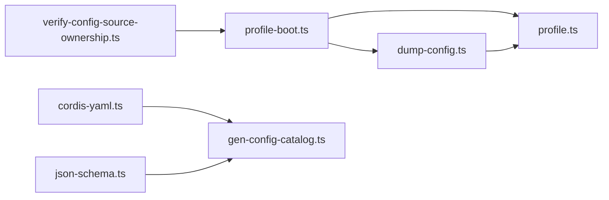

# 配置扩展点

<cite>
**本文引用的文件**
- [apps/cli/src/profile-boot.ts](file://apps/cli/src/profile-boot.ts)
- [packages/boot/app-boot/src/profile.ts](file://packages/boot/app-boot/src/profile.ts)
- [apps/cli/src/dump-config.ts](file://apps/cli/src/dump-config.ts)
- [scripts/cordis-yaml.ts](file://scripts/cordis-yaml.ts)
- [scripts/cordis-config-files.ts](file://scripts/cordis-config-files.ts)
- [scripts/gen-config-catalog.ts](file://scripts/gen-config-catalog.ts)
- [scripts/verify-config-source-ownership.ts](file://scripts/verify-config-source-ownership.ts)
- [apps/cli/tests/built-bin.e2e.ts](file://apps/cli/tests/built-bin.e2e.ts)
- [packages/boot/app-boot/tests/user-patches.spec.ts](file://packages/boot/app-boot/tests/user-patches.spec.ts)
</cite>

## 目录
1. [简介](#简介)
2. [项目结构](#项目结构)
3. [核心组件](#核心组件)
4. [架构总览](#架构总览)
5. [详细组件分析](#详细组件分析)
6. [依赖关系分析](#依赖关系分析)
7. [性能考量](#性能考量)
8. [故障排查指南](#故障排查指南)
9. [结论](#结论)
10. [附录](#附录)

## 简介
本文件面向 DeepSeek Harness 的配置扩展点，系统性说明 Profile 覆盖机制、补丁文件（patch files）语法与用法、配置分层与优先级、配置验证机制、动态与条件配置加载、热重载机制以及安全最佳实践。目标是帮助你在不重启服务的前提下，通过可组合的补丁层对运行时配置进行安全、可观测、可回滚的动态调整。

## 项目结构
DeepSeek Harness 的配置系统围绕“Profile + 补丁层”的组织方式构建：
- Profile：位于 $DSH_HOME/profiles/<name>，包含 package.json（声明 bundles 与 patchReload）和 cordis.patch.yml（用户补丁层）。
- Bundles：以 npm 包形式提供基础补丁层，通过 dsh.profile.bundles 顺序叠加。
- 补丁层：按严格顺序应用，形成最终生效的配置树。
- 工具链：包括配置转储、YAML 解析、配置清单生成与安全校验脚本。

图表来源
- [apps/cli/src/profile-boot.ts:124-173](file://apps/cli/src/profile-boot.ts#L124-L173)
- [packages/boot/app-boot/src/profile.ts:136-175](file://packages/boot/app-boot/src/profile.ts#L136-L175)

章节来源
- [apps/cli/src/profile-boot.ts:1-308](file://apps/cli/src/profile-boot.ts#L1-L308)
- [packages/boot/app-boot/src/profile.ts:1-800](file://packages/boot/app-boot/src/profile.ts#L1-L800)

## 核心组件
- Profile 发现与初始化：解析 $DSH_HOME/profiles/<name>，自动初始化 shipped 模板，维护模块回退链接。
- 补丁层组装：按固定顺序将 bundle 补丁、Profile 用户补丁、家级补丁、命令行覆盖层与遥测开关补丁合并。
- 配置转储：在不启动服务的情况下输出完整配置及其来源层，便于诊断。
- YAML 解析与分类：支持 !!js 表达式保留为数据，识别组条目等。
- 配置清单生成：从源码类型推导配置键路径并校验一致性。
- 安全校验：禁止在已分发配置中内联环境凭据或端点。

章节来源
- [packages/boot/app-boot/src/profile.ts:197-217](file://packages/boot/app-boot/src/profile.ts#L197-L217)
- [apps/cli/src/profile-boot.ts:156-173](file://apps/cli/src/profile-boot.ts#L156-L173)
- [apps/cli/src/dump-config.ts:1-54](file://apps/cli/src/dump-config.ts#L1-L54)
- [scripts/cordis-yaml.ts:1-55](file://scripts/cordis-yaml.ts#L1-L55)
- [scripts/gen-config-catalog.ts:463-787](file://scripts/gen-config-catalog.ts#L463-L787)
- [scripts/verify-config-source-ownership.ts:24-55](file://scripts/verify-config-source-ownership.ts#L24-L55)

## 架构总览
下图展示了 CLI 启动到配置生效的关键流程，包括补丁层顺序、热重载挂载与信号处理。

图表来源
- [apps/cli/src/profile-boot.ts:209-307](file://apps/cli/src/profile-boot.ts#L209-L307)
- [packages/boot/app-boot/src/profile.ts:136-175](file://packages/boot/app-boot/src/profile.ts#L136-L175)

## 详细组件分析

### Profile 覆盖机制与分层优先级
- 基础层：bundle 补丁层，按 dsh.profile.bundles 顺序应用。
- 用户层：Profile 自身的 cordis.patch.yml。
- 家级层：$DSH_HOME/cordis.patch.yml，应用于每个 Profile，优先级高于 Profile 自身层。
- 覆盖层：--patch 指定的外部覆盖文件，优先级更高。
- 开关层：遥测开关补丁（DSH_TELEMETRY_DISABLED），作为最后一步覆盖。

图表来源
- [apps/cli/src/profile-boot.ts:124-173](file://apps/cli/src/profile-boot.ts#L124-L173)
- [apps/cli/src/profile-boot.ts:230-248](file://apps/cli/src/profile-boot.ts#L230-L248)

章节来源
- [apps/cli/src/profile-boot.ts:124-173](file://apps/cli/src/profile-boot.ts#L124-L173)
- [packages/boot/app-boot/src/profile.ts:136-175](file://packages/boot/app-boot/src/profile.ts#L136-L175)

### 补丁文件（patch files）语法与使用
- 文件格式：YAML 数组，每项为 Loader 补丁条目（id 目标覆盖、禁用、insert 列表等）。
- 表达式：支持 !!js 表达式，解析时保留为数据，由 Loader 执行阶段处理。
- 组条目：可通过 group 或 name 指定组，用于组织配置。
- 缺失条目：当补丁引用不存在的 id 时，会记录跳过警告。
- 空层：不存在或空的补丁层不会挂载额外层。

图表来源
- [scripts/cordis-yaml.ts:1-55](file://scripts/cordis-yaml.ts#L1-L55)
- [packages/boot/app-boot/tests/user-patches.spec.ts:328-344](file://packages/boot/app-boot/tests/user-patches.spec.ts#L328-L344)

章节来源
- [scripts/cordis-yaml.ts:1-55](file://scripts/cordis-yaml.ts#L1-L55)
- [packages/boot/app-boot/tests/user-patches.spec.ts:328-344](file://packages/boot/app-boot/tests/user-patches.spec.ts#L328-L344)

### 动态修改与热重载
- 热重载模式：Profile 可声明 patchReload 为 live 或 startup；web 模板默认 live。
- 监听范围：同时监听 Profile 的 cordis.patch.yml 与 $DSH_HOME/cordis.patch.yml。
- 重复合成：每次变更都会重新读取补丁文件并结构化克隆，避免共享对象被后续应用污染。
- 回滚与恢复：候选应用失败时会释放 effect 并恢复先前插件或配置；组内并发启动候选项，等待结果并在拒绝前恢复变更。
- 进程信号：SIGTERM/SIGINT 会在启动窗口即接管清理，确保资源释放。

图表来源
- [apps/cli/src/profile-boot.ts:230-307](file://apps/cli/src/profile-boot.ts#L230-L307)
- [.agents/notes/implemented/bug-fix/2026-07-20-config-hot-reload-resilience.zh.md:17-21](file://.agents/notes/implemented/bug-fix/2026-07-20-config-hot-reload-resilience.zh.md#L17-L21)

章节来源
- [apps/cli/src/profile-boot.ts:230-307](file://apps/cli/src/profile-boot.ts#L230-L307)
- [packages/boot/app-boot/src/profile.ts:136-175](file://packages/boot/app-boot/src/profile.ts#L136-L175)

### 配置验证机制
- 类型检查：YAML 解析器支持 !!js 表达式并以数据结构保留；组条目识别基于 config 数组与 group/name。
- 必填字段与键路径：配置清单生成脚本从源码类型推导键路径，并与实际声明的类型进行交叉校验，确保 catalog 粘贴不会隐藏 loader 接受的字段。
- 自定义规则：JSON Schema 尾部校验强制 required 为字符串数组且名称必须在 properties 中声明；additionalProperties 必须为布尔值。
- 源所有权校验：禁止在已分发配置中内联凭据或端点，防止绕过凭据与服务端点解析通道。

图表来源
- [scripts/gen-config-catalog.ts:463-787](file://scripts/gen-config-catalog.ts#L463-L787)
- [packages/core/tools/src/json-schema.ts:202-224](file://packages/core/tools/src/json-schema.ts#L202-L224)

章节来源
- [scripts/gen-config-catalog.ts:463-787](file://scripts/gen-config-catalog.ts#L463-L787)
- [packages/core/tools/src/json-schema.ts:202-224](file://packages/core/tools/src/json-schema.ts#L202-L224)
- [scripts/verify-config-source-ownership.ts:24-55](file://scripts/verify-config-source-ownership.ts#L24-L55)

### 配置示例与实践
- 扩展新配置项：在 bundle 或 Profile 的 cordis.patch.yml 中 insert 新条目，并通过 id 目标覆盖其 config。
- 条件配置：利用 !!js 表达式在解析阶段保留逻辑，由 Loader 在执行阶段计算条件值。
- 动态配置加载：启用 live 模式的 Profile，编辑 cordis.patch.yml 即可实时生效；通过 --patch 文件实现一次性覆盖。
- 配置转储：使用 dump-config 命令输出各层来源与合并结果，便于定位覆盖冲突。

章节来源
- [apps/cli/tests/built-bin.e2e.ts:970-1007](file://apps/cli/tests/built-bin.e2e.ts#L970-L1007)
- [apps/cli/src/dump-config.ts:1-54](file://apps/cli/src/dump-config.ts#L1-L54)
- [scripts/cordis-yaml.ts:1-55](file://scripts/cordis-yaml.ts#L1-L55)

### 配置热重载机制
- 监听策略：精确路径监听最近现有祖先目录，串行化并合并刷新请求。
- 容错与广播：失败会被规范化为 Error、记录日志，并通过并行事件广播；发生 rejection 的观察者会被记录但不阻止后续刷新。
- 事务性：候选应用失败会释放 effect 并恢复先前状态；程序化变更后才持久化，属于补偿事务。

章节来源
- [.agents/notes/implemented/bug-fix/2026-07-20-config-hot-reload-resilience.zh.md:17-21](file://.agents/notes/implemented/bug-fix/2026-07-20-config-hot-reload-resilience.zh.md#L17-L21)
- [apps/cli/src/profile-boot.ts:270-307](file://apps/cli/src/profile-boot.ts#L270-L307)

### 配置安全最佳实践
- 敏感信息管理：避免在已分发配置中内联凭据或端点；应通过凭据与服务端点解析通道注入。
- 加密与隔离：将密钥置于受管文档或环境变量，并由运行时快照提供；优先使用只读继承值与可写后备值的分层模型。
- 最小权限：仅暴露必要的配置项；对 secret 字段在服务暴露前进行脱敏。

章节来源
- [scripts/verify-config-source-ownership.ts:24-55](file://scripts/verify-config-source-ownership.ts#L24-L55)
- [.agents/notes/implemented/architecture/2026-08-04-credentials-yaml-and-user-environment-layer.zh.md:28-30](file://.agents/notes/implemented/architecture/2026-08-04-credentials-yaml-and-user-environment-layer.zh.md#L28-L30)

## 依赖关系分析
- 组件耦合：
  - profile-boot.ts 依赖 profile.ts 进行 Profile 解析与模块回退修复。
  - dump-config.ts 复用 profile-boot.ts 的准备函数与 app-boot 的渲染能力。
  - cordis-yaml.ts 提供统一的 YAML 解析与分类能力，供脚本与测试使用。
  - gen-config-catalog.ts 与 json-schema.ts 共同保障配置类型与 schema 的一致性。
  - verify-config-source-ownership.ts 在 CI 中拦截不安全配置写入。
- 外部依赖：
  - Loader/Include 插件负责补丁应用与条目合并。
  - HMR/Timer 插件在需要时按需挂载以支持热重载。

图表来源
- [apps/cli/src/profile-boot.ts:1-308](file://apps/cli/src/profile-boot.ts#L1-L308)
- [packages/boot/app-boot/src/profile.ts:1-800](file://packages/boot/app-boot/src/profile.ts#L1-L800)
- [apps/cli/src/dump-config.ts:1-54](file://apps/cli/src/dump-config.ts#L1-L54)
- [scripts/cordis-yaml.ts:1-55](file://scripts/cordis-yaml.ts#L1-L55)
- [scripts/gen-config-catalog.ts:463-787](file://scripts/gen-config-catalog.ts#L463-L787)
- [scripts/verify-config-source-ownership.ts:24-55](file://scripts/verify-config-source-ownership.ts#L24-L55)

章节来源
- [apps/cli/src/profile-boot.ts:1-308](file://apps/cli/src/profile-boot.ts#L1-L308)
- [packages/boot/app-boot/src/profile.ts:1-800](file://packages/boot/app-boot/src/profile.ts#L1-L800)
- [apps/cli/src/dump-config.ts:1-54](file://apps/cli/src/dump-config.ts#L1-L54)
- [scripts/cordis-yaml.ts:1-55](file://scripts/cordis-yaml.ts#L1-L55)
- [scripts/gen-config-catalog.ts:463-787](file://scripts/gen-config-catalog.ts#L463-L787)
- [scripts/verify-config-source-ownership.ts:24-55](file://scripts/verify-config-source-ownership.ts#L24-L55)

## 性能考量
- 补丁层合并：每次热重载都会重新读取并结构化克隆补丁对象，避免共享对象被后续应用污染，代价是少量内存与 CPU 开销，但保证正确性。
- 按需挂载：仅在需要时挂载 HMR/Timer 插件，减少不必要的依赖引入。
- 并发与锁：模块回退修复使用文件锁序列化写入，避免并发竞争；对已完成生成的场景快速返回，避免重复工作。

章节来源
- [apps/cli/src/profile-boot.ts:230-307](file://apps/cli/src/profile-boot.ts#L230-L307)
- [packages/boot/app-boot/src/profile.ts:579-605](file://packages/boot/app-boot/src/profile.ts#L579-L605)

## 故障排查指南
- 配置无法生效：
  - 检查补丁层顺序是否正确，确认目标 id 是否存在。
  - 使用 dump-config 输出各层来源，定位覆盖冲突。
- 热重载失败：
  - 查看 HMR 事件与日志，确认 refresh 队列是否阻塞。
  - 关注候选应用失败时的恢复行为与 AggregateError 报告。
- 安全校验失败：
  - 移除已分发配置中的内联凭据或端点，改用凭据与服务端点解析通道。

章节来源
- [apps/cli/src/dump-config.ts:1-54](file://apps/cli/src/dump-config.ts#L1-L54)
- [.agents/notes/implemented/bug-fix/2026-07-20-config-hot-reload-resilience.zh.md:17-21](file://.agents/notes/implemented/bug-fix/2026-07-20-config-hot-reload-resilience.zh.md#L17-L21)
- [scripts/verify-config-source-ownership.ts:24-55](file://scripts/verify-config-source-ownership.ts#L24-L55)

## 结论
DeepSeek Harness 的配置扩展点通过 Profile 与补丁层的组合，提供了灵活、安全、可热重载的配置管理能力。借助严格的分层优先级、完善的验证机制与健壮的热重载事务性，你可以在不重启服务的情况下动态调整运行时配置，并确保变更的可观测性与可回滚性。遵循安全最佳实践，可有效避免敏感信息泄露与配置漂移问题。

## 附录
- 常用命令：
  - 转储配置：dsh --profile <name> --dump-config
  - 覆盖补丁：dsh --profile <name> --patch <file>
- 关键路径：
  - Profile 目录：$DSH_HOME/profiles/<name>
  - 用户补丁：$DSH_HOME/profiles/<name>/cordis.patch.yml
  - 家级补丁：$DSH_HOME/cordis.patch.yml

章节来源
- [apps/cli/src/dump-config.ts:1-54](file://apps/cli/src/dump-config.ts#L1-L54)
- [packages/boot/app-boot/src/profile.ts:136-175](file://packages/boot/app-boot/src/profile.ts#L136-L175)