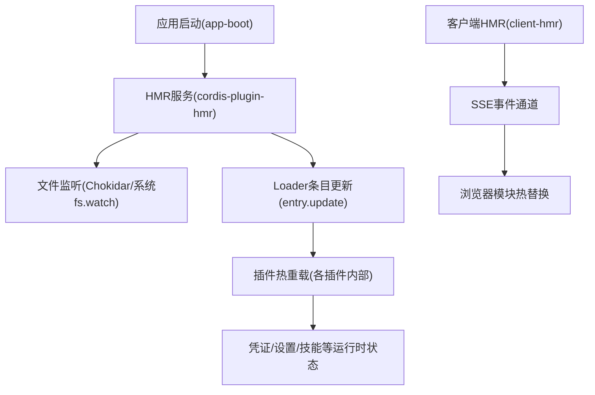
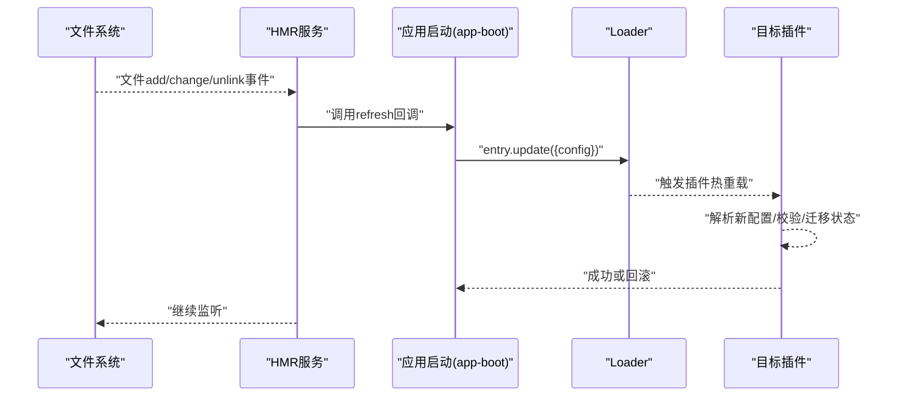
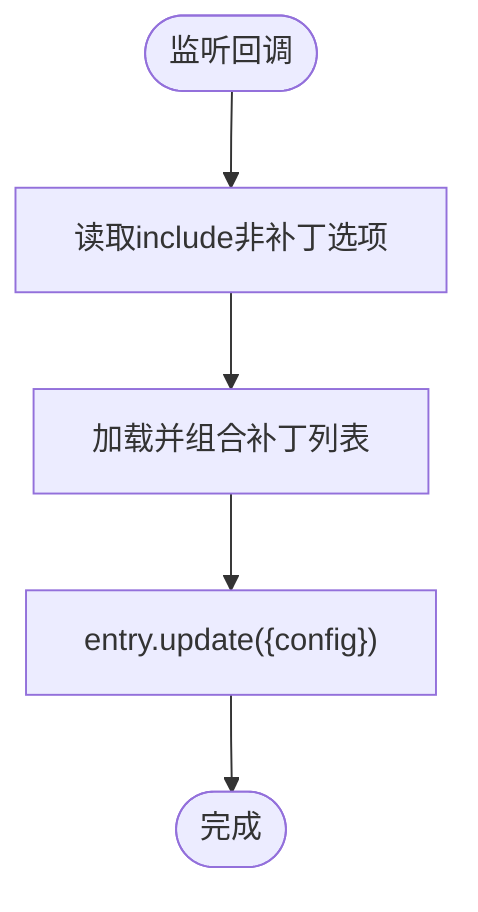
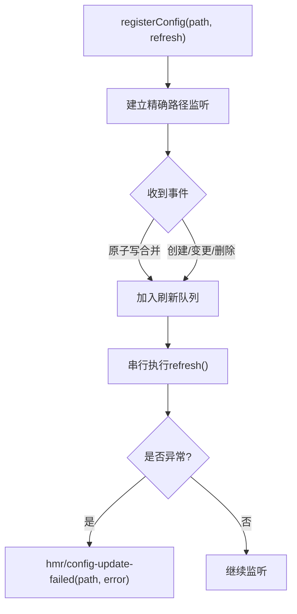
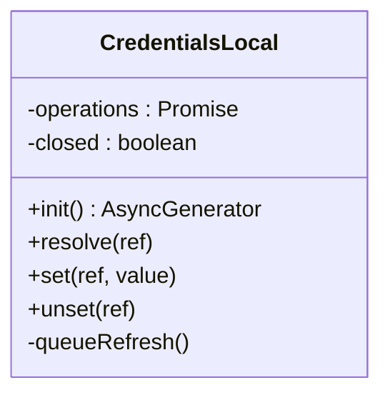
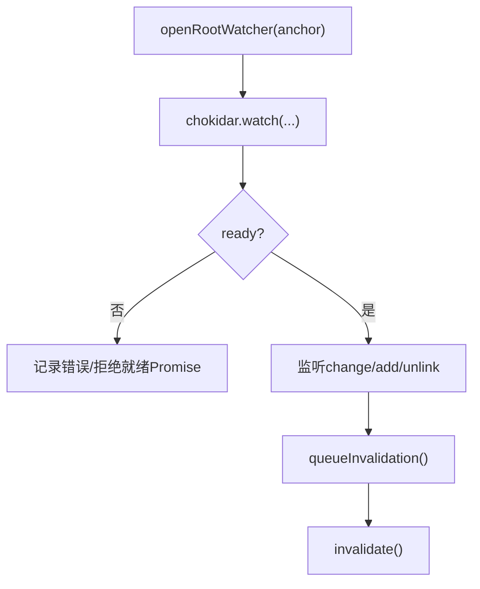
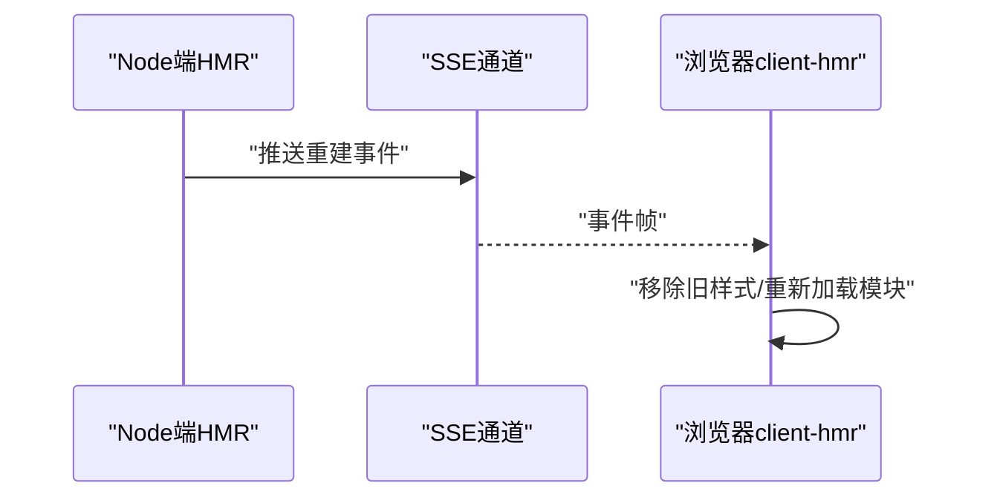

# 配置热重载

<cite>
**本文引用的文件**
- [packages/boot/app-boot/src/index.ts](file://packages/boot/app-boot/src/index.ts)
- [packages/boot/app-boot/tests/hmr-config.spec.ts](file://packages/boot/app-boot/tests/hmr-config.spec.ts)
- [packages/credentials/credentials-local/src/index.ts](file://packages/credentials/credentials-local/src/index.ts)
- [packages/skill/skill-filesystem/src/index.ts](file://packages/skill/skill-filesystem/src/index.ts)
- [packages/client/hmr/src/index.ts](file://packages/client/hmr/src/index.ts)
- [packages/client/hmr/src/client/index.ts](file://packages/client/hmr/src/client/index.ts)
- [apps/web/tests/hmr-live.e2e.ts](file://apps/web/tests/hmr-live.e2e.ts)
- [apps/cli/tests/built-bin.e2e.ts](file://apps/cli/tests/built-bin.e2e.ts)
- [docs/cordis-api/inherited.md](file://docs/cordis-api/inherited.md)
- [.agents/notes/implemented/bug-fix/2026-07-20-config-hot-reload-resilience.zh.md](file://.agents/notes/implemented/bug-fix/2026-07-20-config-hot-reload-resilience.zh.md)
</cite>

## 目录
1. [简介](#简介)
2. [项目结构](#项目结构)
3. [核心组件](#核心组件)
4. [架构总览](#架构总览)
5. [详细组件分析](#详细组件分析)
6. [依赖关系分析](#依赖关系分析)
7. [性能考量](#性能考量)
8. [故障恢复与排障指南](#故障恢复与排障指南)
9. [结论](#结论)
10. [附录](#附录)

## 简介
本文件面向 DeepSeek Harness 的配置热重载机制，系统性说明：
- 运行时如何检测配置变更并自动重载，无需重启服务
- 文件监听、变更合并与增量更新策略
- 热重载生命周期：旧实例清理与新实例初始化
- 安全切换、状态迁移与数据一致性保证
- 支持热重载的限制与注意事项
- 失败恢复与可观测性

## 项目结构
DeepSeek Harness 将“配置热重载”拆分为多个协作层：
- 应用启动层（app-boot）：注册对特定配置文件（如用户补丁层）的精确路径监听，并在变更时调用 Loader 的条目更新，完成热重载
- HMR 服务（cordis-plugin-hmr）：提供 registerConfig 能力，基于文件系统事件或轮询进行变更检测，序列化刷新并广播失败事件
- 具体插件的热重载实现：例如 credentials-local 通过 chokidar 监听凭据文件，按队列串行刷新；skill-filesystem 提供通用根级监听能力
- 客户端 HMR（client-hmr）：在浏览器端订阅 SSE 事件，触发模块热替换
- 测试与文档：覆盖端到端行为、事件继承与边界场景

图表来源
- [packages/boot/app-boot/src/index.ts:240-267](file://packages/boot/app-boot/src/index.ts#L240-L267)
- [packages/client/hmr/src/index.ts:63-91](file://packages/client/hmr/src/index.ts#L63-L91)
- [packages/client/hmr/src/client/index.ts:93-102](file://packages/client/hmr/src/client/index.ts#L93-L102)

章节来源
- [packages/boot/app-boot/src/index.ts:240-267](file://packages/boot/app-boot/src/index.ts#L240-L267)
- [packages/client/hmr/src/index.ts:63-91](file://packages/client/hmr/src/index.ts#L63-L91)
- [packages/client/hmr/src/client/index.ts:93-102](file://packages/client/hmr/src/client/index.ts#L93-L102)

## 核心组件
- 应用启动层（app-boot）
  - 负责为“用户补丁层”等关键配置文件注册精确路径监听
  - 在变更回调中读取最新配置并通过 Loader 的 entry.update 提交更新
- HMR 服务（cordis-plugin-hmr）
  - 暴露 registerConfig(filename, refresh)：监听单个确切路径，序列化刷新，返回异步释放器
  - 统一处理原子写合并、创建/变更/删除事件、刷新失败归一化与事件广播
- 具体插件热重载
  - credentials-local：基于 chokidar 监听凭据文件，使用操作队列串行刷新，确保读路径不会读到被并发替换的中间态
  - skill-filesystem：提供通用根级监听，支持稳定性阈值、轮询间隔、符号链接跟随等
- 客户端 HMR（client-hmr）
  - 浏览器侧订阅 SSE 事件，按需卸载旧样式并重新加载模块

章节来源
- [packages/boot/app-boot/src/index.ts:240-267](file://packages/boot/app-boot/src/index.ts#L240-L267)
- [packages/boot/app-boot/tests/hmr-config.spec.ts:70-128](file://packages/boot/app-boot/tests/hmr-config.spec.ts#L70-L128)
- [packages/credentials/credentials-local/src/index.ts:573-615](file://packages/credentials/credentials-local/src/index.ts#L573-L615)
- [packages/skill/skill-filesystem/src/index.ts:487-523](file://packages/skill/skill-filesystem/src/index.ts#L487-L523)
- [packages/client/hmr/src/index.ts:63-91](file://packages/client/hmr/src/index.ts#L63-L91)
- [packages/client/hmr/src/client/index.ts:93-102](file://packages/client/hmr/src/client/index.ts#L93-L102)

## 架构总览
下图展示一次“配置文件变更到热重载生效”的端到端流程。

图表来源
- [packages/boot/app-boot/src/index.ts:240-267](file://packages/boot/app-boot/src/index.ts#L240-L267)
- [packages/boot/app-boot/tests/hmr-config.spec.ts:86-128](file://packages/boot/app-boot/tests/hmr-config.spec.ts#L86-L128)

章节来源
- [packages/boot/app-boot/src/index.ts:240-267](file://packages/boot/app-boot/src/index.ts#L240-L267)
- [packages/boot/app-boot/tests/hmr-config.spec.ts:86-128](file://packages/boot/app-boot/tests/hmr-config.spec.ts#L86-L128)

## 详细组件分析

### 组件A：应用启动层（app-boot）的用户补丁层热重载
- 职责
  - 检查是否启用了 HMR 服务以及是否存在根 Include 入口
  - 使用 hmr.registerConfig 对补丁文件进行精确路径监听
  - 在回调中读取最新补丁并调用 entry.update 提交更新
- 关键点
  - 每次刷新都重新读取 include 的非补丁选项，避免并发写入导致的静默回退
  - 若进程正在退出导致 effect 未激活，返回空释放器，不抛错

图表来源
- [packages/boot/app-boot/src/index.ts:240-267](file://packages/boot/app-boot/src/index.ts#L240-L267)

章节来源
- [packages/boot/app-boot/src/index.ts:240-267](file://packages/boot/app-boot/src/index.ts#L240-L267)

### 组件B：HMR 服务（cordis-plugin-hmr）的精确路径监听
- 能力
  - registerConfig(filename, refresh)：监听一个确切路径，从最近存在的祖先开始建立监听
  - 合并原子写、观察创建/变更/删除，即使父目录在注册后创建也能捕获
  - 去重文件系统别名，防止重复注册
  - 序列化刷新，并在释放时等待活跃工作完成
  - 刷新失败归一化为 Error，并通过 hmr/config-update-failed 广播，不影响后续刷新
- 验证要点（来自测试）
  - 跨模块根的观察、父目录后创建的观察、别名折叠、释放时等待、失败广播

图表来源
- [packages/boot/app-boot/tests/hmr-config.spec.ts:70-128](file://packages/boot/app-boot/tests/hmr-config.spec.ts#L70-L128)
- [packages/boot/app-boot/tests/hmr-config.spec.ts:130-202](file://packages/boot/app-boot/tests/hmr-config.spec.ts#L130-L202)

章节来源
- [packages/boot/app-boot/tests/hmr-config.spec.ts:70-128](file://packages/boot/app-boot/tests/hmr-config.spec.ts#L70-L128)
- [packages/boot/app-boot/tests/hmr-config.spec.ts:130-202](file://packages/boot/app-boot/tests/hmr-config.spec.ts#L130-L202)

### 组件C：凭证插件（credentials-local）的文件监听与串行刷新
- 职责
  - 监听凭据文件变化，使用 chokidar 并设置稳定性阈值与轮询间隔
  - 所有读写与刷新进入单一 Promise 队列，确保读路径不会读到被并发替换的中间态
  - 在 dispose 时拒绝新操作、关闭监听并等待队列清空
- 关键点
  - ready 时做一次 reconcile，弥补初始加载与监听就绪之间的时间差
  - 错误仅记录日志，不中断监听

图表来源
- [packages/credentials/credentials-local/src/index.ts:573-615](file://packages/credentials/credentials-local/src/index.ts#L573-L615)
- [packages/credentials/credentials-local/src/index.ts:530-548](file://packages/credentials/credentials-local/src/index.ts#L530-L548)

章节来源
- [packages/credentials/credentials-local/src/index.ts:573-615](file://packages/credentials/credentials-local/src/index.ts#L573-L615)
- [packages/credentials/credentials-local/src/index.ts:530-548](file://packages/credentials/credentials-local/src/index.ts#L530-L548)

### 组件D：通用根级监听（skill-filesystem）
- 职责
  - 以 root 模式打开 chokidar 监听，支持深度、符号链接跟随、原子写、稳定性阈值与轮询间隔
  - 在监听准备就绪前拦截错误，之后将错误交由统一处理器
  - 失效任务入队，避免重复调度
- 关键点
  - 关闭监听时优雅降级，记录警告而非崩溃
  - 配置项集中解析与校验

图表来源
- [packages/skill/skill-filesystem/src/index.ts:487-523](file://packages/skill/skill-filesystem/src/index.ts#L487-L523)
- [packages/skill/skill-filesystem/src/index.ts:579-596](file://packages/skill/skill-filesystem/src/index.ts#L579-L596)

章节来源
- [packages/skill/skill-filesystem/src/index.ts:487-523](file://packages/skill/skill-filesystem/src/index.ts#L487-L523)
- [packages/skill/skill-filesystem/src/index.ts:579-596](file://packages/skill/skill-filesystem/src/index.ts#L579-L596)

### 组件E：客户端 HMR（client-hmr）
- 职责
  - 在浏览器端订阅系统 SSE 事件通道，当检测到模块重建时，卸载旧样式并重新加载模块
- 关键点
  - 通过 clientModules.rebuilt(id) 驱动前端热替换
  - 忽略 map-only 变更，减少不必要刷新

图表来源
- [packages/client/hmr/src/index.ts:63-91](file://packages/client/hmr/src/index.ts#L63-L91)
- [packages/client/hmr/src/client/index.ts:93-102](file://packages/client/hmr/src/client/index.ts#L93-L102)

章节来源
- [packages/client/hmr/src/index.ts:63-91](file://packages/client/hmr/src/index.ts#L63-L91)
- [packages/client/hmr/src/client/index.ts:93-102](file://packages/client/hmr/src/client/index.ts#L93-L102)

## 依赖关系分析
- 事件体系
  - 继承自 Cordis 的事件包括 hmr/change、hmr/reload、loader/config-update 等，用于贯穿监听、重载与配置更新
- 外部依赖
  - 文件系统监听主要依赖 chokidar，结合系统 fs.watch 特性
  - Loader 提供 entry.update 与生命周期协调，确保热重载的原子性与可回滚
- 耦合点
  - app-boot 依赖 HMR 服务提供的 registerConfig
  - 各插件内部自行管理监听与状态迁移，但遵循统一的串行刷新与释放契约

图表来源
- [docs/cordis-api/inherited.md:23-38](file://docs/cordis-api/inherited.md#L23-L38)
- [packages/boot/app-boot/src/index.ts:240-267](file://packages/boot/app-boot/src/index.ts#L240-L267)

章节来源
- [docs/cordis-api/inherited.md:23-38](file://docs/cordis-api/inherited.md#L23-L38)
- [packages/boot/app-boot/src/index.ts:240-267](file://packages/boot/app-boot/src/index.ts#L240-L267)

## 性能考量
- 原子写合并：HMR 默认合并短时间内的多次写入，降低抖动带来的频繁刷新
- 稳定性阈值与轮询：针对大文件或慢磁盘，可通过稳定性阈值与轮询间隔平衡实时性与开销
- 精确路径监听：只对确切路径建立监听，避免全量扫描
- 串行刷新：凭证等敏感配置采用单队列串行刷新，避免并发竞争
- 客户端忽略 map-only 变更：减少不必要的模块重建与刷新

[本节为通用指导，不直接分析具体文件]

## 故障恢复与排障指南
- 刷新失败处理
  - HMR 将刷新异常归一化为 Error，并通过 hmr/config-update-failed 广播，不影响后续刷新
  - 观察者抛出异常会被记录，不会终止监听
- 进程退出时的监听清理
  - 若进程退出导致 effect 未激活，app-boot 会返回空释放器，避免崩溃
  - 各插件在 dispose 时关闭监听并等待队列清空，确保无悬挂任务
- 常见排查步骤
  - 确认已启用 HMR 服务且存在根 Include 入口
  - 检查监听路径是否正确，尤其是符号链接与别名
  - 关注 hmr/config-update-failed 事件中的文件名与错误信息
  - 对于凭证/设置类配置，检查是否因并发写入导致中间态，必要时调整稳定性阈值

章节来源
- [packages/boot/app-boot/tests/hmr-config.spec.ts:171-202](file://packages/boot/app-boot/tests/hmr-config.spec.ts#L171-L202)
- [packages/boot/app-boot/src/index.ts:240-267](file://packages/boot/app-boot/src/index.ts#L240-L267)
- [packages/credentials/credentials-local/src/index.ts:573-615](file://packages/credentials/credentials-local/src/index.ts#L573-L615)

## 结论
DeepSeek Harness 的配置热重载通过“精确路径监听 + 串行刷新 + Loader 原子更新”的组合，实现了在不重启服务的前提下安全、可靠地更新配置。其设计兼顾了：
- 高可用：失败归一化与事件广播，避免单次失败影响整体
- 一致性：串行刷新与补偿事务，确保状态迁移安全
- 可观测性：丰富的继承事件与失败事件，便于定位问题
同时，针对不同场景提供了灵活的监听参数与客户端 HMR 支持，满足开发与生产环境的差异化需求。

[本节为总结，不直接分析具体文件]

## 附录

### 运行时更新配置的示例流程
- 编辑用户补丁层或凭据文件
- HMR 检测到变更并合并原子写
- 应用启动层读取最新配置并通过 Loader 更新条目
- 插件内部串行刷新，完成状态迁移
- 若失败，广播失败事件并保留上一版本

章节来源
- [packages/boot/app-boot/src/index.ts:240-267](file://packages/boot/app-boot/src/index.ts#L240-L267)
- [packages/credentials/credentials-local/src/index.ts:573-615](file://packages/credentials/credentials-local/src/index.ts#L573-L615)
- [packages/boot/app-boot/tests/hmr-config.spec.ts:86-128](file://packages/boot/app-boot/tests/hmr-config.spec.ts#L86-L128)

### 热重载的生命周期管理
- 旧实例清理：Loader 在更新前触发部分释放，插件需释放资源
- 新实例初始化：entry.update 成功后，插件重新应用配置并恢复运行
- 回滚机制：若应用阶段失败，Loader 会回滚变更，保持系统稳定

章节来源
- [docs/cordis-api/inherited.md:23-38](file://docs/cordis-api/inherited.md#L23-L38)
- [.agents/notes/implemented/bug-fix/2026-07-20-config-hot-reload-resilience.zh.md:1-15](file://.agents/notes/implemented/bug-fix/2026-07-20-config-hot-reload-resilience.zh.md#L1-L15)

### 限制与注意事项
- 需要显式启用 HMR 服务与根 Include 入口
- 某些配置可能不支持热重载，需重启服务
- 客户端 HMR 仅在开发环境有效，生产环境通常禁用
- 大量小文件频繁写入可能导致事件风暴，建议调整稳定性阈值或轮询间隔

章节来源
- [apps/cli/tests/built-bin.e2e.ts:693-701](file://apps/cli/tests/built-bin.e2e.ts#L693-L701)
- [apps/web/tests/hmr-live.e2e.ts:71-71](file://apps/web/tests/hmr-live.e2e.ts#L71-L71)