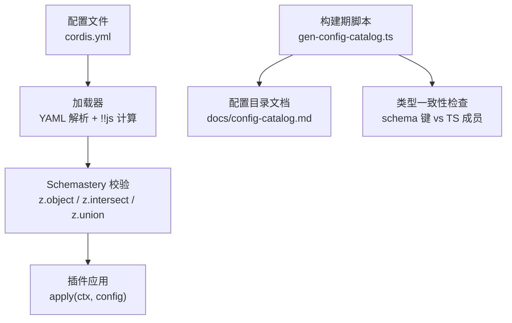
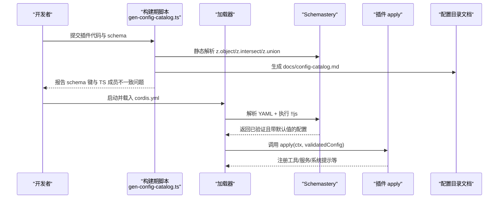
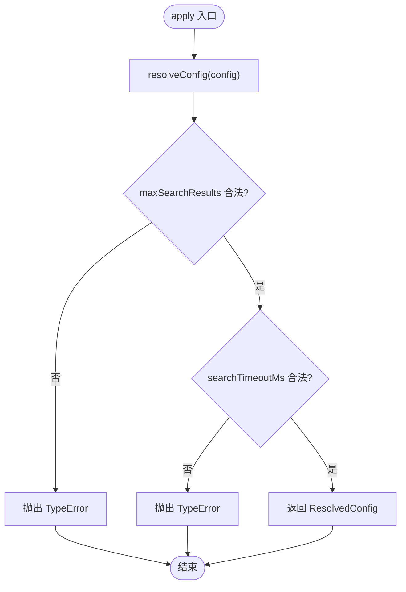
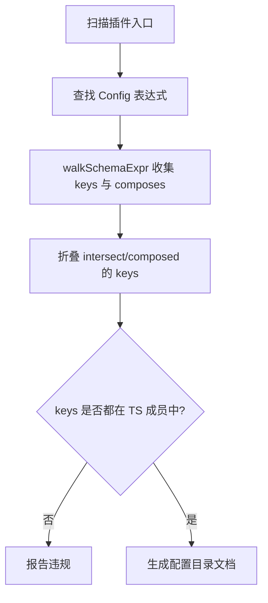
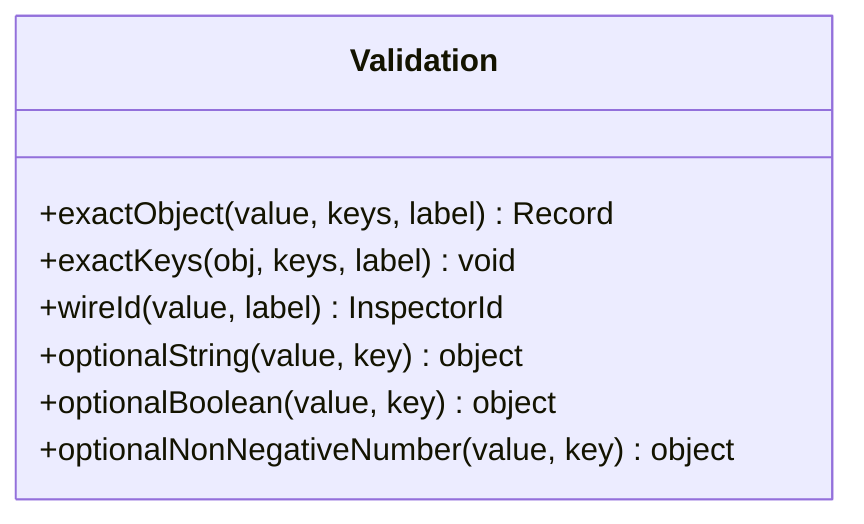
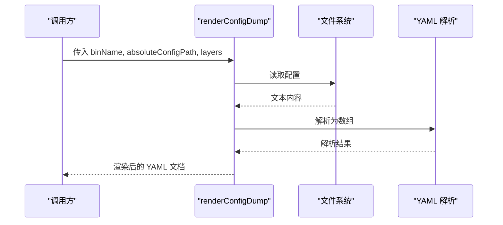
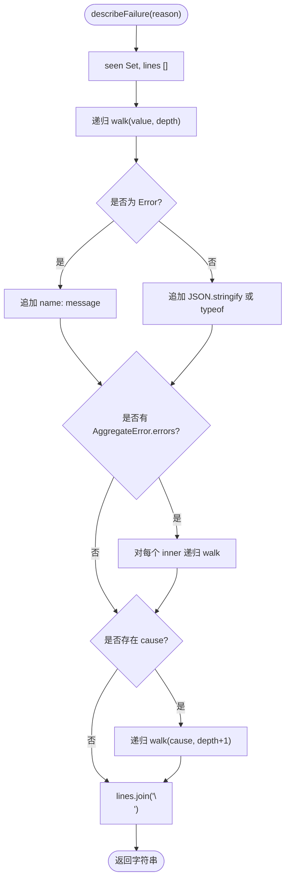
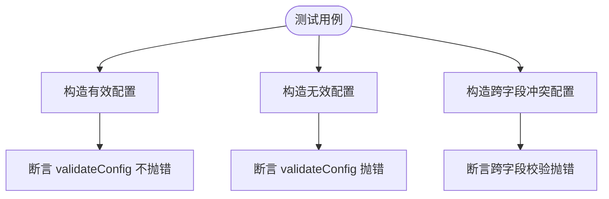
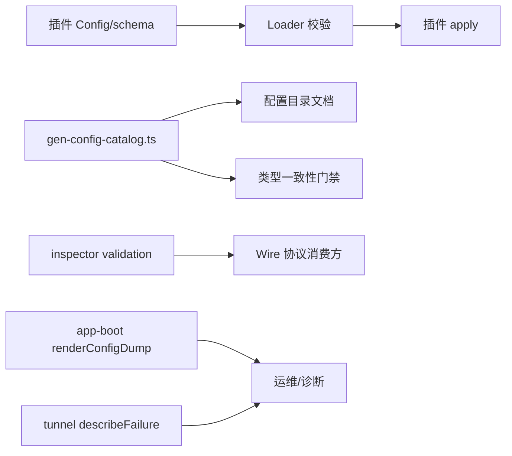

# 配置验证系统

<cite>
**本文引用的文件**
- [packages/session-query/tool-session-query/src/index.ts](file://packages/session-query/tool-session-query/src/index.ts)
- [scripts/gen-config-catalog.ts](file://scripts/gen-config-catalog.ts)
- [packages/experimental/inspector/src/shared/validation.ts](file://packages/experimental/inspector/src/shared/validation.ts)
- [packages/boot/app-boot/src/index.ts](file://packages/boot/app-boot/src/index.ts)
- [packages/experimental/webworker-runtime/src/transport/tunnel.ts](file://packages/experimental/webworker-runtime/src/transport/tunnel.ts)
- [packages/terminal/terminal-bash/tests/config.spec.ts](file://packages/terminal/terminal-bash/tests/config.spec.ts)
- [docs/cordis-tutorial/05-config.md](file://docs/cordis-tutorial/05-config.md)
</cite>

## 目录
1. [简介](#简介)
2. [项目结构](#项目结构)
3. [核心组件](#核心组件)
4. [架构总览](#架构总览)
5. [详细组件分析](#详细组件分析)
6. [依赖关系分析](#依赖关系分析)
7. [性能考虑](#性能考虑)
8. [故障排查指南](#故障排查指南)
9. [结论](#结论)
10. [附录](#附录)

## 简介
本文件面向 DeepSeek Harness 的配置验证系统，聚焦 Schemastery 框架在项目中的使用方式与高级验证规则。内容涵盖类型检查、必填字段、格式校验、自定义校验函数、错误处理机制（含错误消息生成与用户友好提示）、复杂业务规则与跨字段依赖验证、异步验证模式、性能优化（缓存与批量验证），以及调试与测试工具的使用建议。文档通过仓库内真实实现进行说明，并提供可追溯的源码路径。

## 项目结构
配置验证在项目中以“插件即配置”的方式组织：每个插件导出 TypeScript 接口 Config 与同名 Schemastery schema，Loader 在启动时解析 YAML 并执行 schema 校验，随后将已验证且带默认值填充的配置对象注入到插件 apply 中。构建期脚本会静态遍历 schema 表达式，生成配置目录并与声明的类型交叉校验，确保“schema 验证的键”与“TypeScript 声明的成员”一致。

**图示来源**
- [scripts/gen-config-catalog.ts:1-200](file://scripts/gen-config-catalog.ts#L1-L200)
- [scripts/gen-config-catalog.ts:412-500](file://scripts/gen-config-catalog.ts#L412-L500)
- [scripts/gen-config-catalog.ts:730-767](file://scripts/gen-config-catalog.ts#L730-L767)
- [docs/cordis-tutorial/05-config.md:1-85](file://docs/cordis-tutorial/05-config.md#L1-L85)

**章节来源**
- [docs/cordis-tutorial/05-config.md:1-85](file://docs/cordis-tutorial/05-config.md#L1-L85)
- [scripts/gen-config-catalog.ts:1-200](file://scripts/gen-config-catalog.ts#L1-L200)

## 核心组件
- 运行时配置定义与校验：插件通过导出 Config 接口与同名 schema，完成类型与运行时双重约束。示例见 session-query 插件，其 schema 定义了数值范围、步进、默认值等约束，并在 apply 前由 Loader 校验。
- 构建期配置目录生成与一致性校验：gen-config-catalog.ts 静态解析 schema 表达式，提取 key paths 与 intersect/compose 关系，并与 TypeScript 声明交叉比对，防止“schema 可验证但类型未声明”的漂移。
- 协议层轻量校验：inspector shared validation 提供 exactObject、exactKeys、wireId 等原语，用于版本化 wire 协议的严格白名单校验。
- 配置渲染与诊断：app-boot 提供 renderConfigDump，读取并解析配置，输出包含源注释的分层配置快照，便于定位覆盖来源。
- 错误呈现：webworker tunnel 提供 describeFailure，递归展开 AggregateError 与 cause 链，生成稳定可读的多行错误描述。

**章节来源**
- [packages/session-query/tool-session-query/src/index.ts:28-45](file://packages/session-query/tool-session-query/src/index.ts#L28-L45)
- [scripts/gen-config-catalog.ts:412-500](file://scripts/gen-config-catalog.ts#L412-L500)
- [scripts/gen-config-catalog.ts:730-767](file://scripts/gen-config-catalog.ts#L730-L767)
- [packages/experimental/inspector/src/shared/validation.ts:1-94](file://packages/experimental/inspector/src/shared/validation.ts#L1-L94)
- [packages/boot/app-boot/src/index.ts:382-412](file://packages/boot/app-boot/src/index.ts#L382-L412)
- [packages/experimental/webworker-runtime/src/transport/tunnel.ts:32-66](file://packages/experimental/webworker-runtime/src/transport/tunnel.ts#L32-L66)

## 架构总览
下图展示了从配置到运行时的完整链路，包括构建期与运行期的职责边界。

**图示来源**
- [scripts/gen-config-catalog.ts:412-500](file://scripts/gen-config-catalog.ts#L412-L500)
- [scripts/gen-config-catalog.ts:730-767](file://scripts/gen-config-catalog.ts#L730-L767)
- [docs/cordis-tutorial/05-config.md:1-85](file://docs/cordis-tutorial/05-config.md#L1-L85)

## 详细组件分析

### 插件级配置定义与运行时校验（session-query）
该插件展示了如何结合 Schemastery 与运行时二次校验：
- 使用 z.number().step(1).min(1).max(...) 表达整数、范围与步进约束；
- 使用 .default(...) 提供默认值；
- 在 resolveConfig 中进行更严格的运行时断言（如安全整数、上限），失败抛出 TypeError，阻止非法值进入执行管线。

**图示来源**
- [packages/session-query/tool-session-query/src/index.ts:28-45](file://packages/session-query/tool-session-query/src/index.ts#L28-L45)
- [packages/session-query/tool-session-query/src/index.ts:125-137](file://packages/session-query/tool-session-query/src/index.ts#L125-L137)

**章节来源**
- [packages/session-query/tool-session-query/src/index.ts:28-45](file://packages/session-query/tool-session-query/src/index.ts#L28-L45)
- [packages/session-query/tool-session-query/src/index.ts:125-137](file://packages/session-query/tool-session-query/src/index.ts#L125-L137)

### 构建期 schema 静态分析与目录生成（gen-config-catalog）
- walkSchemaExpr：静态遍历 z.object/z.intersect/z.union，收集 key paths 与 compose 包名；对不支持形式硬报错，避免静默降级。
- findSchemaExpr：定位插件导出的 Config 或类上的 static Config。
- 类型一致性校验：将 schema 所有可枚举的 key path 与主配置的 TypeScript 声明成员对比，缺失则报告违规，保证“schema 能验证的键一定能在类型中找到”。

**图示来源**
- [scripts/gen-config-catalog.ts:412-500](file://scripts/gen-config-catalog.ts#L412-L500)
- [scripts/gen-config-catalog.ts:502-518](file://scripts/gen-config-catalog.ts#L502-L518)
- [scripts/gen-config-catalog.ts:730-767](file://scripts/gen-config-catalog.ts#L730-L767)

**章节来源**
- [scripts/gen-config-catalog.ts:412-500](file://scripts/gen-config-catalog.ts#L412-L500)
- [scripts/gen-config-catalog.ts:502-518](file://scripts/gen-config-catalog.ts#L502-L518)
- [scripts/gen-config-catalog.ts:730-767](file://scripts/gen-config-catalog.ts#L730-L767)

### 协议层精确校验（inspector shared validation）
提供一组不可扩展的校验原语，适用于版本化 wire 协议：
- exactObject/exactKeys：要求仅包含允许字段，未知字段直接拒绝；
- wireId：校验标识符类型并赋予角色标签；
- optionalString/optionalBoolean/optionalNonNegativeNumber：可选字段的类型与取值域校验。

**图示来源**
- [packages/experimental/inspector/src/shared/validation.ts:1-94](file://packages/experimental/inspector/src/shared/validation.ts#L1-L94)

**章节来源**
- [packages/experimental/inspector/src/shared/validation.ts:1-94](file://packages/experimental/inspector/src/shared/validation.ts#L1-L94)

### 配置渲染与分层诊断（app-boot）
renderConfigDump 负责：
- 读取配置源文件；
- 按 entryListSchema 解析 YAML；
- 将各层覆盖合并后渲染为带源注释的 YAML 文档，便于定位具体覆盖来源；
- 对读取/解析失败抛出明确错误信息。

**图示来源**
- [packages/boot/app-boot/src/index.ts:382-412](file://packages/boot/app-boot/src/index.ts#L382-L412)

**章节来源**
- [packages/boot/app-boot/src/index.ts:382-412](file://packages/boot/app-boot/src/index.ts#L382-L412)

### 错误链渲染（webworker tunnel）
describeFailure 将嵌套错误（AggregateError 与 cause 链）逐层展开为多行可读文本，便于 TUI/日志展示与回归匹配。

**图示来源**
- [packages/experimental/webworker-runtime/src/transport/tunnel.ts:32-66](file://packages/experimental/webworker-runtime/src/transport/tunnel.ts#L32-L66)

**章节来源**
- [packages/experimental/webworker-runtime/src/transport/tunnel.ts:32-66](file://packages/experimental/webworker-runtime/src/transport/tunnel.ts#L32-L66)

### 终端 Bash 配置测试用例（config.spec）
通过单元测试覆盖：
- 正数边界、空串、非整数等非法输入；
- 跨字段依赖（handoffGraceMs 不得小于 pollIntervalMs）；
- 方言默认参数解析与显式覆盖优先级；
- 空数组/空字符串视为“未设置”，让 Schemastery 默认值生效。

**图示来源**
- [packages/terminal/terminal-bash/tests/config.spec.ts:1-74](file://packages/terminal/terminal-bash/tests/config.spec.ts#L1-L74)

**章节来源**
- [packages/terminal/terminal-bash/tests/config.spec.ts:1-74](file://packages/terminal/terminal-bash/tests/config.spec.ts#L1-L74)

## 依赖关系分析
- 插件与 Loader：插件通过导出 Config 接口与同名 schema，Loader 在启动阶段执行校验并注入 apply。
- 构建期与文档：gen-config-catalog.ts 依赖 TypeScript AST 与 Schemastery schema 表达式，生成 docs/config-catalog.md，并对 schema 与类型一致性进行门禁。
- 协议与共享校验：inspector shared validation 被上游模块复用，确保 wire 协议严格白名单。
- 诊断与错误：app-boot 提供配置渲染；tunnel 提供错误链渲染；两者共同提升可观测性。

**图示来源**
- [scripts/gen-config-catalog.ts:412-500](file://scripts/gen-config-catalog.ts#L412-L500)
- [scripts/gen-config-catalog.ts:730-767](file://scripts/gen-config-catalog.ts#L730-L767)
- [packages/experimental/inspector/src/shared/validation.ts:1-94](file://packages/experimental/inspector/src/shared/validation.ts#L1-L94)
- [packages/boot/app-boot/src/index.ts:382-412](file://packages/boot/app-boot/src/index.ts#L382-L412)
- [packages/experimental/webworker-runtime/src/transport/tunnel.ts:32-66](file://packages/experimental/webworker-runtime/src/transport/tunnel.ts#L32-L66)

**章节来源**
- [scripts/gen-config-catalog.ts:412-500](file://scripts/gen-config-catalog.ts#L412-L500)
- [scripts/gen-config-catalog.ts:730-767](file://scripts/gen-config-catalog.ts#L730-L767)
- [packages/experimental/inspector/src/shared/validation.ts:1-94](file://packages/experimental/inspector/src/shared/validation.ts#L1-L94)
- [packages/boot/app-boot/src/index.ts:382-412](file://packages/boot/app-boot/src/index.ts#L382-L412)
- [packages/experimental/webworker-runtime/src/transport/tunnel.ts:32-66](file://packages/experimental/webworker-runtime/src/transport/tunnel.ts#L32-L66)

## 性能考虑
- 构建期静态分析：gen-config-catalog.ts 通过 AST 静态遍历 schema 表达式，避免运行时代价，适合在 CI 中作为门禁。
- 运行时最小化校验：优先使用 Schemastery 内置约束（类型、范围、步进、默认值），减少重复逻辑；仅在必要时进行运行时二次校验（如安全整数、业务上限）。
- 批处理与缓存：
  - 对多次使用的 schema 结果（如工具参数 schema）应复用实例，避免重复创建；
  - 对大型配置集合，可在内存中维护已解析/已校验结果的缓存，按配置指纹去重；
  - 对于跨字段依赖校验，尽量在单次遍历中聚合多个条件，减少重复计算。
- 错误渲染成本：describeFailure 采用深度限制与 visited 集合，避免循环引用导致的无限递归与性能损耗。

[本节为通用指导，无需特定文件来源]

## 故障排查指南
- 配置解析失败：检查 YAML 语法与 !!js 表达式上下文；使用 app-boot 的 renderConfigDump 查看最终合并结果与来源注释。
- 校验失败：根据 ValidationError 的路径与期望类型定位字段；若涉及跨字段依赖，参考插件内的 resolveConfig 或测试用例。
- 错误链不可读：使用 describeFailure 将 AggregateError 与 cause 链展开为多行文本，便于定位根因。
- 类型与 schema 不一致：运行构建期脚本，关注“schema 验证了某键但类型未声明”的违规报告。

**章节来源**
- [packages/boot/app-boot/src/index.ts:382-412](file://packages/boot/app-boot/src/index.ts#L382-L412)
- [packages/experimental/webworker-runtime/src/transport/tunnel.ts:32-66](file://packages/experimental/webworker-runtime/src/transport/tunnel.ts#L32-L66)
- [scripts/gen-config-catalog.ts:730-767](file://scripts/gen-config-catalog.ts#L730-L767)

## 结论
DeepSeek Harness 的配置验证系统以 Schemastery 为核心，结合构建期静态分析与运行时强校验，形成“声明即契约”的可靠模型。通过统一的 schema 表达、严格的协议校验、完善的错误链渲染与详尽的测试用例，系统在易用性、可维护性与可观测性之间取得良好平衡。建议在新增插件时遵循“TS 接口与 schema 同步演进”的原则，并通过构建期门禁与单元测试保障质量。

[本节为总结性内容，无需特定文件来源]

## 附录
- 快速上手：参考教程文档了解如何在插件中声明 Config 与 schema，以及如何编写有效的 YAML 配置。
- 最佳实践：
  - 使用 z.object/z.intersect/z.union 组合表达配置；
  - 用 .default 提供合理默认值；
  - 对关键数值使用 step/min/max 限定范围；
  - 对跨字段依赖在 resolveConfig 中集中校验；
  - 借助测试用例覆盖边界与异常路径；
  - 利用构建期脚本发现 schema 与类型的漂移。

**章节来源**
- [docs/cordis-tutorial/05-config.md:1-85](file://docs/cordis-tutorial/05-config.md#L1-L85)