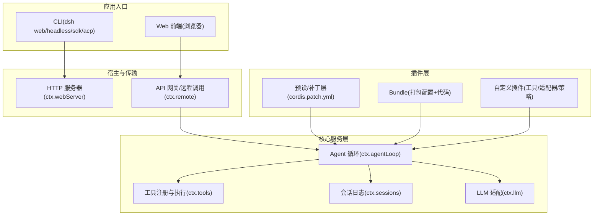
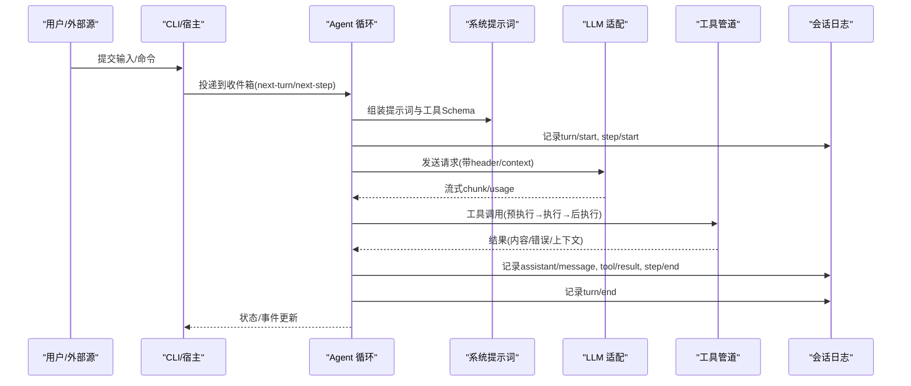
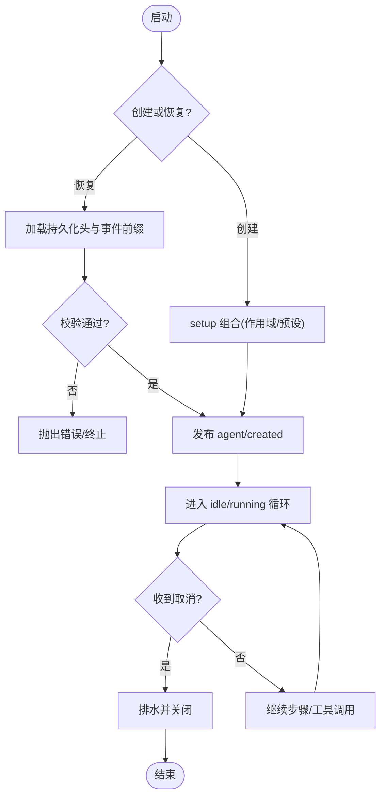
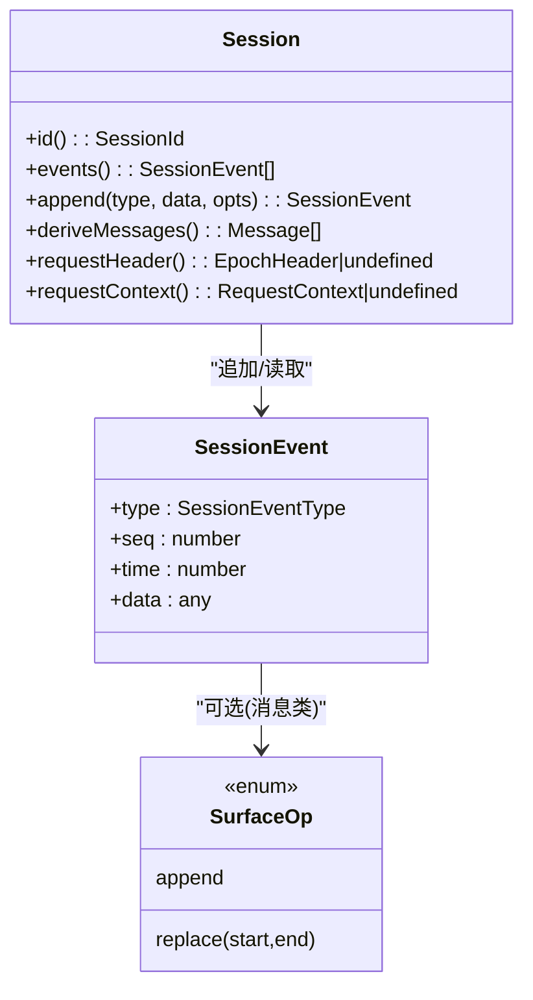
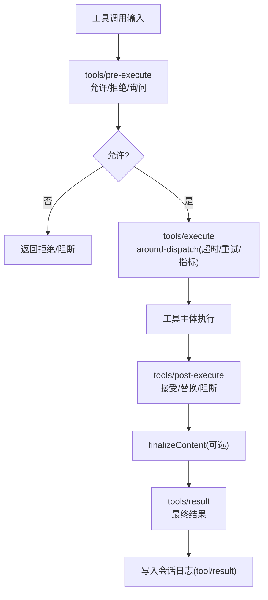
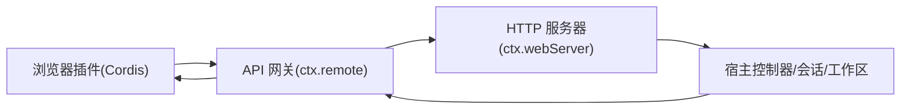
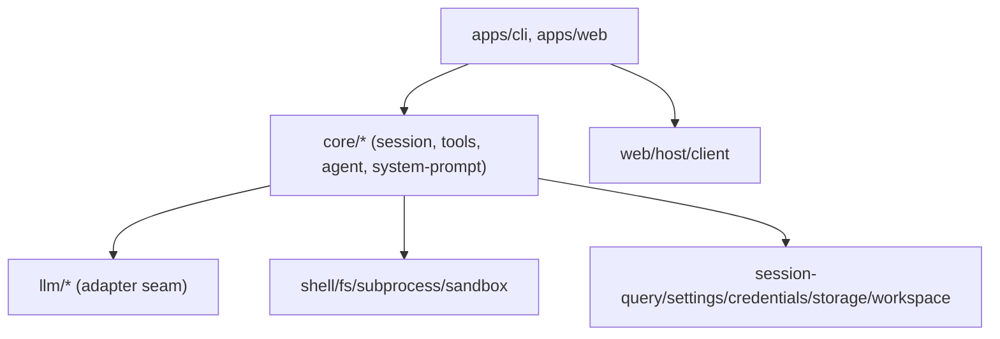

# 架构概览

<cite>
**本文引用的文件**
- [README.md](file://README.md)
- [architecture.md](file://docs/architecture.md)
- [packages/README.md](file://packages/README.md)
- [cordis-primer.md](file://docs/cordis-primer.md)
- [subsystems/core.md](file://docs/subsystems/core.md)
- [subsystems/session.md](file://docs/subsystems/session.md)
- [subsystems/tools.md](file://docs/subsystems/tools.md)
- [subsystems/web-server.md](file://docs/subsystems/web-server.md)
- [subsystems/web-client.md](file://docs/subsystems/web-client.md)
- [agent-loop/src/index.ts](file://packages/core/agent-loop/src/index.ts)
- [api/session-controller/src/agent.ts](file://packages/api/session-controller/src/agent.ts)
</cite>

## 目录
1. [简介](#简介)
2. [项目结构](#项目结构)
3. [核心组件](#核心组件)
4. [架构总览](#架构总览)
5. [详细组件分析](#详细组件分析)
6. [依赖关系分析](#依赖关系分析)
7. [性能考量](#性能考量)
8. [故障排查指南](#故障排查指南)
9. [结论](#结论)
10. [附录](#附录)

## 简介
DeepSeek Harness（dsh）是一个基于“一切皆插件”的开源智能体运行框架，底层由 Cordis 插件框架驱动。系统通过分层装配与事件驱动实现可插拔、可组合、可热重载的智能体运行时，支持 CLI、Web 界面、SDK 等多种应用形态。所有能力（模型适配、工具注册、会话日志、Agent 循环等）均以插件形式提供，可通过配置层替换或扩展。

**章节来源**
- [README.md:1-15](file://README.md#L1-L15)
- [architecture.md:9-14](file://docs/architecture.md#L9-L14)

## 项目结构
仓库采用多包工作区组织，按能力域分组：核心（会话、提示词、工具、Agent）、LLM 适配、执行环境（Shell/PTY/子进程/沙箱）、Web 客户端与服务端、持久化、设置、凭证、工作区、API 网关、SDK/ACP 等。每个包职责清晰，遵循“服务定义—服务提供者—消费者”的解耦模式。

**图表来源**
- [architecture.md:15-47](file://docs/architecture.md#L15-L47)
- [subsystems/web-server.md:1-54](file://docs/subsystems/web-server.md#L1-L54)
- [subsystems/web-client.md:20-31](file://docs/subsystems/web-client.md#L20-L31)
- [subsystems/core.md:7-20](file://docs/subsystems/core.md#L7-L20)

**章节来源**
- [packages/README.md:24-80](file://packages/README.md#L24-L80)
- [architecture.md:15-47](file://docs/architecture.md#L15-L47)

## 核心组件
- CLI 层：统一入口，选择 profile（web/headless/sdk/acp），加载 bundle 与补丁层，启动宿主与插件树。
- Web 界面层：浏览器侧 Cordis 应用，通过 API 网关与宿主通信；HTTP 服务器提供静态资源与升级路由。
- 核心服务层：
  - Agent 循环：驱动 turn/step，组装提示词，流式调用 LLM，调度工具执行，写入会话日志。
  - 工具管道：注册工具、参数校验、策略拦截、并行/独占调度、结果呈现。
  - 会话日志：追加不可变事件序列，派生模型可见消息，支撑回放、转储、压缩、遥测。
  - LLM 适配：抽象消息/流协议，提供多提供方适配器。
- 插件层：以 Cordis Service/Effect/Event 形式挂载，支持热重载与卸载回滚。

**章节来源**
- [architecture.md:49-72](file://docs/architecture.md#L49-L72)
- [subsystems/core.md:7-20](file://docs/subsystems/core.md#L7-L20)
- [subsystems/tools.md:9-12](file://docs/subsystems/tools.md#L9-L12)
- [subsystems/session.md:1-6](file://docs/subsystems/session.md#L1-L6)

## 架构总览
系统采用分层与事件驱动相结合的设计：
- 分层：应用入口 → 宿主/传输 → 核心服务 → 插件能力。
- 事件：会话事件（持久事实）、Agent 事件（生命周期/状态）、能力事件（策略/适配器）。
- 数据流：用户输入进入 Agent 收件箱 → pre-step 决策 → step 请求 LLM → 工具调用 → 结果写回日志 → 下一轮推导。

**图表来源**
- [architecture.md:74-101](file://docs/architecture.md#L74-L101)
- [subsystems/core.md:7-20](file://docs/subsystems/core.md#L7-L20)
- [subsystems/tools.md:170-173](file://docs/subsystems/tools.md#L170-L173)
- [subsystems/session.md:251-256](file://docs/subsystems/session.md#L251-L256)

## 详细组件分析

### 智能体生命周期管理（Agent 与 AgentLoop）
- 创建与恢复：通过 ctx.agents.create/resume 创建新会话或从持久化恢复；setup 阶段完成作用域内组合，失败时整体回滚。
- 生命周期：idle/running 状态机，支持取消、维护任务、whenIdle 等待收敛。
- 作用域与继承：Agent 拥有独立 ctx，支持 preset 组合与子 Agent 继承父作用域。
- 精确 ID 恢复：对相同 sessionId 的重载具备并发安全与排水等待。

**图表来源**
- [subsystems/core.md:22-51](file://docs/subsystems/core.md#L22-L51)
- [agent-loop/src/index.ts:407-435](file://packages/core/agent-loop/src/index.ts#L407-L435)
- [api/session-controller/src/agent.ts:228-261](file://packages/api/session-controller/src/agent.ts#L228-L261)

**章节来源**
- [subsystems/core.md:22-51](file://docs/subsystems/core.md#L22-L51)
- [agent-loop/src/index.ts:407-435](file://packages/core/agent-loop/src/index.ts#L407-L435)
- [api/session-controller/src/agent.ts:228-261](file://packages/api/session-controller/src/agent.ts#L228-L261)

### 会话持久化（Session 日志与投影）
- 追加日志：SessionEventMap 定义所有事件类型，包含 turn/step/user/assistant/tool/request 等。
- 派生历史：deriveMessages() 从有序表面节点派生模型可见消息，支持压缩 replace 操作。
- 持久化契约：所有 event.data 必须 JSON 可序列化；后端需保证 seq 连续性与完整回放。
- 种子边界：session/end-seed 标记构造种子结束，区分冷启动与后续写入。

**图表来源**
- [subsystems/session.md:9-132](file://docs/subsystems/session.md#L9-L132)
- [subsystems/session.md:178-220](file://docs/subsystems/session.md#L178-L220)
- [subsystems/session.md:224-330](file://docs/subsystems/session.md#L224-L330)
- [subsystems/session.md:332-491](file://docs/subsystems/session.md#L332-L491)
- [subsystems/session.md:550-578](file://docs/subsystems/session.md#L550-L578)

**章节来源**
- [subsystems/session.md:9-132](file://docs/subsystems/session.md#L9-L132)
- [subsystems/session.md:178-220](file://docs/subsystems/session.md#L178-L220)
- [subsystems/session.md:224-330](file://docs/subsystems/session.md#L224-L330)
- [subsystems/session.md:332-491](file://docs/subsystems/session.md#L332-L491)
- [subsystems/session.md:550-578](file://docs/subsystems/session.md#L550-L578)

### 工具执行管道（Tool Registry & Pipeline）
- 注册与 Schema：ToolDefinition 包含模型可见 Schema、输出声明、execute、可选 finalizeContent/presentation。
- 执行流程：pre-execute（允许/拒绝/询问）→ 单调守卫 → execute（around-dispatch）→ post-execute（接受/替换/阻断）→ result。
- 调度模式：parallel/exclusive，支持并发安全分类与滚动池。
- 呈现：presentCall/presentResult 提供跨宿主一致的 UI 意图。

**图表来源**
- [subsystems/tools.md:9-94](file://docs/subsystems/tools.md#L9-L94)
- [subsystems/tools.md:170-173](file://docs/subsystems/tools.md#L170-L173)
- [subsystems/tools.md:243-255](file://docs/subsystems/tools.md#L243-L255)
- [subsystems/tools.md:376-404](file://docs/subsystems/tools.md#L376-L404)
- [subsystems/tools.md:478-570](file://docs/subsystems/tools.md#L478-L570)

**章节来源**
- [subsystems/tools.md:9-94](file://docs/subsystems/tools.md#L9-L94)
- [subsystems/tools.md:170-173](file://docs/subsystems/tools.md#L170-L173)
- [subsystems/tools.md:243-255](file://docs/subsystems/tools.md#L243-L255)
- [subsystems/tools.md:376-404](file://docs/subsystems/tools.md#L376-L404)
- [subsystems/tools.md:478-570](file://docs/subsystems/tools.md#L478-L570)

### Web 界面与 HTTP 服务器
- HTTP 服务器：ctx.webServer 提供命名路由、升级路由、fallback、index 注入与压缩；不感知 harness 业务概念。
- Web 客户端：浏览器侧 Cordis 应用，通过 API 网关与宿主通信；模型层维护 Host 状态的镜像；UI 通过 Slots 组合。
- 传输层：Connection 负责物理连接与信任检查；Gateway 负责逻辑流、取消与事件转发。

**图表来源**
- [subsystems/web-server.md:1-54](file://docs/subsystems/web-server.md#L1-L54)
- [subsystems/web-client.md:20-31](file://docs/subsystems/web-client.md#L20-L31)
- [subsystems/web-client.md:62-83](file://docs/subsystems/web-client.md#L62-L83)

**章节来源**
- [subsystems/web-server.md:1-54](file://docs/subsystems/web-server.md#L1-L54)
- [subsystems/web-client.md:20-31](file://docs/subsystems/web-client.md#L20-L31)
- [subsystems/web-client.md:62-83](file://docs/subsystems/web-client.md#L62-L83)

### 微服务与模块化包组织
- 包分组：按能力域划分（core、llm、shell、fs、web、session、settings、credentials、workspace、api、client 等），每包职责单一。
- 服务契约：Service Definition 包持有 Request/Result 类型，Provider 与 Consumer 仅依赖契约包。
- 组合方式：通过 profile + bundle + cordis.patch.yml 分层装配，支持热重载与覆盖。

**章节来源**
- [packages/README.md:24-80](file://packages/README.md#L24-L80)
- [architecture.md:15-47](file://docs/architecture.md#L15-L47)

## 依赖关系分析
- 插件依赖服务定义而非具体实现，确保可替换性。
- 核心循环（agent-loop）可被替换；UI、Hook、Tool 插件依赖 agent 接口。
- 能力包分离服务定义/提供者/消费者角色，便于独立演进。

**图表来源**
- [packages/README.md:24-80](file://packages/README.md#L24-L80)
- [architecture.md:49-72](file://docs/architecture.md#L49-L72)

**章节来源**
- [packages/README.md:24-80](file://packages/README.md#L24-L80)
- [architecture.md:49-72](file://docs/architecture.md#L49-L72)

## 性能考量
- 会话日志追加路径非阻塞，持久化异步缓冲，避免影响主循环。
- deriveMessages() 缓存派生结果，仅在表面重写时重建。
- 工具执行支持并行/独占模式，减少不必要串行瓶颈。
- HTTP 响应压缩与最小阈值控制，降低带宽占用。

[本节为通用指导，无需特定文件引用]

## 故障排查指南
- 插件异常隔离：循环在 turn 级别捕获插件异常，防止进程退出。
- 取消与排水：Agent.cancel 支持保留收件箱或丢弃；ensureSession 创建/恢复具备并发安全。
- 持久化一致性：event.data 必须 JSON 可序列化；seq 必须连续；崩溃恢复会合成 interrupted 原因。
- Web 传输重连：Connection 负责物理重连，Gateway 负责逻辑流恢复；基线快照+增量更新。

**章节来源**
- [subsystems/core.md:783-800](file://docs/subsystems/core.md#L783-L800)
- [api/session-controller/src/agent.ts:228-261](file://packages/api/session-controller/src/agent.ts#L228-L261)
- [subsystems/session.md:550-578](file://docs/subsystems/session.md#L550-L578)
- [subsystems/web-client.md:72-83](file://docs/subsystems/web-client.md#L72-L83)

## 结论
DeepSeek Harness 以“一切皆插件”为核心哲学，借助 Cordis 将 CLI、Web、核心服务与插件能力解耦，通过事件驱动与追加日志实现可回放、可压缩、可遥测的智能体运行时。分层装配与能力接缝使模型、工具、执行环境与 UI 均可独立演进与替换，满足复杂场景下的可扩展性与稳定性需求。

[本节为总结，无需特定文件引用]

## 附录
- 术语与参考：Cordis 基础、事件分类、能力接缝、模块图、配置目录、工具目录、持久化目录等详见文档索引。
- 扩展点：新增模型提供方、工具、命令、后台任务、文件系统策略、Webhook 等，均通过对应事件或服务接缝接入。

[本节为索引说明，无需特定文件引用]