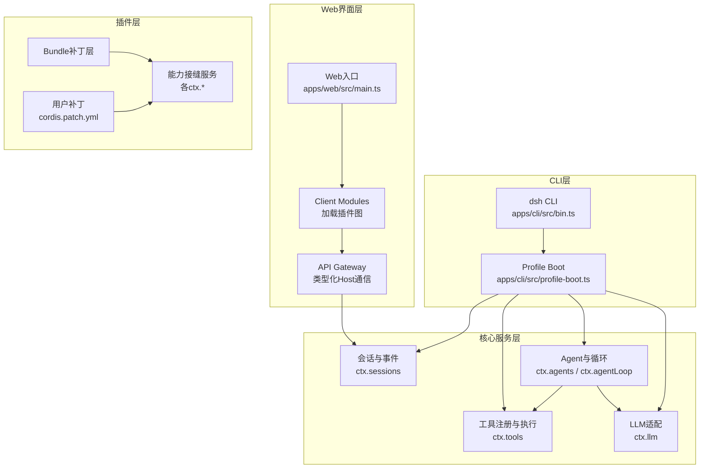
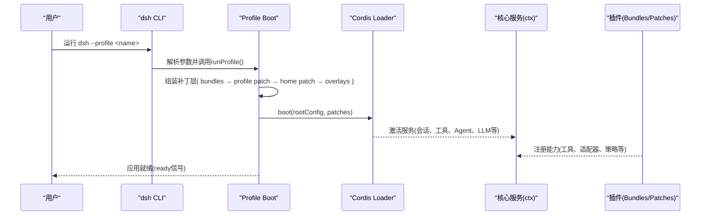
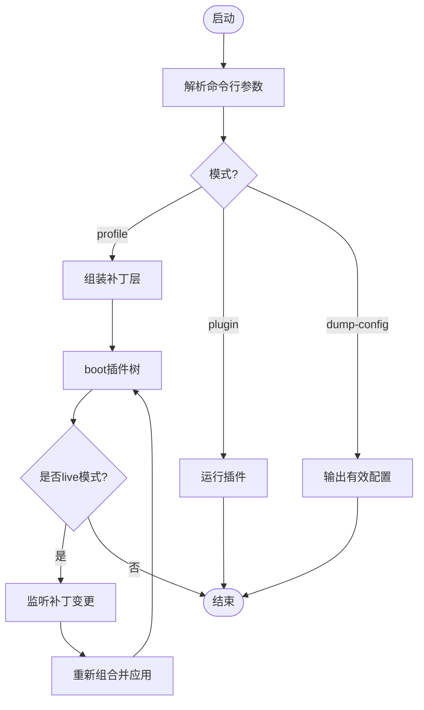
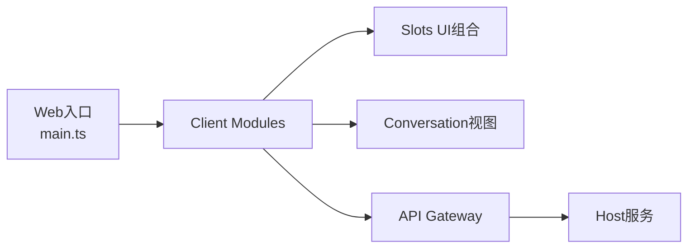
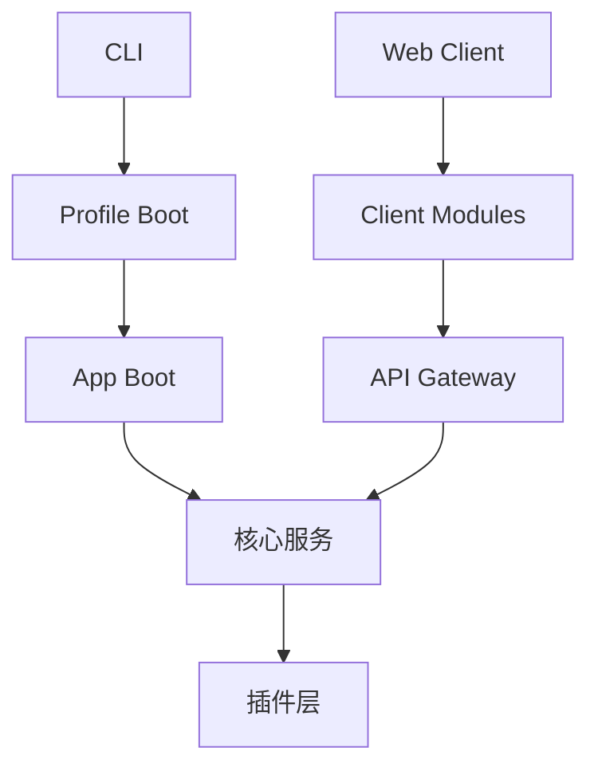

# 核心架构设计

<cite>
**本文引用的文件**
- [apps/cli/src/bin.ts](file://apps/cli/src/bin.ts)
- [apps/cli/src/profile-boot.ts](file://apps/cli/src/profile-boot.ts)
- [packages/boot/app-boot/README.md](file://packages/boot/app-boot/README.md)
- [docs/architecture.md](file://docs/architecture.md)
- [docs/capability-seams.md](file://docs/capability-seams.md)
- [docs/cordis-primer.md](file://docs/cordis-primer.md)
- [apps/web/src/main.ts](file://apps/web/src/main.ts)
- [docs/subsystems/web-client.md](file://docs/subsystems/web-client.md)
</cite>

## 目录
1. [简介](#简介)
2. [项目结构](#项目结构)
3. [核心组件](#核心组件)
4. [架构总览](#架构总览)
5. [详细组件分析](#详细组件分析)
6. [依赖关系分析](#依赖关系分析)
7. [性能考量](#性能考量)
8. [故障排查指南](#故障排查指南)
9. [结论](#结论)
10. [附录](#附录)

## 简介
本文件面向DeepSeek Harness的核心架构设计，围绕“一切皆插件”的Cordis插件框架展开，解释分层架构（CLI层、Web界面层、核心服务层、插件层）的职责与数据流，阐述插件树启动过程与配置叠加机制，说明Profile与Bundle在应用启动中的作用，并系统化介绍能力接缝（capability seams）的设计模式及其三个角色：服务定义、服务提供者与消费者。文档同时提供架构图表与组件关系图，帮助开发者理解整体设计思路与技术决策。

## 项目结构
DeepSeek Harness采用多包Monorepo组织，关键入口与子系统分布如下：
- CLI入口：apps/cli/src/bin.ts 解析命令行参数并分发到profile、plugin、dump-config等模式；profile模式通过profile-boot完成插件树装配与启动。
- Web客户端：apps/web/src/main.ts 作为浏览器侧入口，挂载由Client Modules加载的插件图，并通过API Gateway与Host通信。
- 启动与组合：packages/boot/app-boot 提供共享Loader引导库，负责环境层、配置文件、补丁层、插件装载与失败诊断。
- 架构与能力文档：docs/architecture.md、docs/capability-seams.md、docs/cordis-primer.md 描述整体架构、能力接缝与Cordis基础概念。



图表来源
- [apps/cli/src/bin.ts:1-51](file://apps/cli/src/bin.ts#L1-L51)
- [apps/cli/src/profile-boot.ts:1-308](file://apps/cli/src/profile-boot.ts#L1-L308)
- [apps/web/src/main.ts:1-7](file://apps/web/src/main.ts#L1-L7)
- [docs/architecture.md:1-144](file://docs/architecture.md#L1-L144)

章节来源
- [apps/cli/src/bin.ts:1-51](file://apps/cli/src/bin.ts#L1-L51)
- [apps/cli/src/profile-boot.ts:1-308](file://apps/cli/src/profile-boot.ts#L1-L308)
- [apps/web/src/main.ts:1-7](file://apps/web/src/main.ts#L1-L7)
- [docs/architecture.md:1-144](file://docs/architecture.md#L1-L144)

## 核心组件
- Cordis插件框架：以Context为服务仓库，插件声明依赖inject，事件用于通信，注册为可逆effect，支持热重载与卸载回滚。
- Profile与Bundle：Profile是命名组合，列出要堆叠的Bundle与用户补丁；Bundle是带补丁行的分发格式，确保上层仍可替换。
- 能力接缝：每个可替换能力包含服务定义、服务提供者、消费者三角色，统一通过ctx键暴露，实现解耦与可插拔。
- 启动流程：CLI解析参数→选择Profile→组装补丁层→boot插件树→注入环境与命令行→可选HMR监听→就绪信号提交。

章节来源
- [docs/cordis-primer.md:1-46](file://docs/cordis-primer.md#L1-L46)
- [docs/architecture.md:15-47](file://docs/architecture.md#L15-L47)
- [packages/boot/app-boot/README.md:25-65](file://packages/boot/app-boot/README.md#L25-L65)

## 架构总览
DeepSeek Harness的分层架构如下：
- CLI层：负责命令解析、Profile选择、补丁层组装、进程生命周期管理。
- Web界面层：浏览器端插件化UI，通过Client Modules加载插件图，使用API Gateway与Host进行类型化通信。
- 核心服务层：会话日志、工具执行、Agent循环、LLM适配等核心能力，通过ctx键提供服务。
- 插件层：通过Bundle与Patch对核心服务进行扩展与替换，所有行为以插件形式挂载。



图表来源
- [apps/cli/src/bin.ts:24-49](file://apps/cli/src/bin.ts#L24-L49)
- [apps/cli/src/profile-boot.ts:156-263](file://apps/cli/src/profile-boot.ts#L156-L263)
- [packages/boot/app-boot/README.md:35-65](file://packages/boot/app-boot/README.md#L35-L65)

章节来源
- [apps/cli/src/bin.ts:24-49](file://apps/cli/src/bin.ts#L24-L49)
- [apps/cli/src/profile-boot.ts:156-263](file://apps/cli/src/profile-boot.ts#L156-L263)
- [packages/boot/app-boot/README.md:35-65](file://packages/boot/app-boot/README.md#L35-L65)

## 详细组件分析

### 插件树启动与配置叠加机制
- 启动入口：bin.ts根据mode分发到profile、plugin或dump-config；profile模式调用profile-boot.runProfile。
- 配置叠加顺序：bundle层（按dsh.profile.bundles顺序）→ profile自身cordis.patch.yml → 家目录cordis.patch.yml → --patch覆盖层 → 遥测开关。
- 热重载：live模式的Profile会监听用户补丁文件变更并重新组合，startup模式仅在启动时应用一次。
- 就绪信号：boot完成后提交AppReady，供外部等待应用完全就绪。



图表来源
- [apps/cli/src/bin.ts:24-49](file://apps/cli/src/bin.ts#L24-L49)
- [apps/cli/src/profile-boot.ts:156-173](file://apps/cli/src/profile-boot.ts#L156-L173)
- [apps/cli/src/profile-boot.ts:270-300](file://apps/cli/src/profile-boot.ts#L270-L300)

章节来源
- [apps/cli/src/bin.ts:24-49](file://apps/cli/src/bin.ts#L24-L49)
- [apps/cli/src/profile-boot.ts:156-173](file://apps/cli/src/profile-boot.ts#L156-L173)
- [apps/cli/src/profile-boot.ts:270-300](file://apps/cli/src/profile-boot.ts#L270-L300)

### Profile与Bundle的作用
- Profile：命名组合，位于$DSH_HOME/profiles/<name>，声明bundles列表、用户补丁路径与patchReload策略。
- Bundle：可安装的分发单元，包含补丁行与代码，被Profile按序堆叠；base bundle提供模型适配器、工具、持久化、沙箱、设置、凭据、遥测等共享能力。
- 作用：将产品形态（web、headless、sdk、acp、sdk-minimal）抽象为可组合的配置与代码集合，便于部署与定制。

章节来源
- [docs/architecture.md:15-47](file://docs/architecture.md#L15-L47)
- [packages/boot/app-boot/README.md:45-56](file://packages/boot/app-boot/README.md#L45-L56)

### 能力接缝（Capability Seams）设计模式
- 三角色：
  - 服务定义：拥有ctx.<key>与词汇类型，不依赖具体实现。
  - 服务提供者：注册或提供实现，如bash-local、bash-sandbox。
  - 消费者：面向模型或插件使用的接口，如tool-bash。
- 优势：独立演进、可替换、降低耦合；一个Provider替换不影响Consumer与Definition。
- 示例：shell seam（dsh-shell定义、bash-local/sandbox提供者、tool-bash消费者）。

```mermaid
classDiagram
class ShellDefinition {
+execute(args) Promise~Result~
+types : ShellRunResult, ShellProcess
}
class BashLocalProvider {
+implements ShellDefinition
+spawnChildProcess()
}
class BashSandboxProvider {
+implements ShellDefinition
+applySandboxPolicy()
}
class ToolBashConsumer {
+registerTool()
+invokeShell()
}
ShellDefinition <|-- BashLocalProvider
ShellDefinition <|-- BashSandboxProvider
ToolBashConsumer --> ShellDefinition : "inject : ['shell']"
```

图表来源
- [docs/capability-seams.md:1-537](file://docs/capability-seams.md#L1-L537)
- [docs/user/develop/practice/index.md:1-27](file://docs/user/develop/practice/index.md#L1-L27)

章节来源
- [docs/capability-seams.md:1-537](file://docs/capability-seams.md#L1-L537)
- [docs/user/develop/practice/index.md:1-27](file://docs/user/develop/practice/index.md#L1-L27)

### Web界面层架构
- 入口：apps/web/src/main.ts 创建AppWebEntry并运行。
- 插件化UI：基于Client Modules加载插件图，Slots组合React UI，Conversation将Session历史转换为视图。
- 通信：通过API Gateway与Host进行类型化RPC，消费核心服务（如会话、工具、Agent）。



图表来源
- [apps/web/src/main.ts:1-7](file://apps/web/src/main.ts#L1-L7)
- [docs/subsystems/web-client.md:1-5](file://docs/subsystems/web-client.md#L1-L5)

章节来源
- [apps/web/src/main.ts:1-7](file://apps/web/src/main.ts#L1-L7)
- [docs/subsystems/web-client.md:1-5](file://docs/subsystems/web-client.md#L1-L5)

## 依赖关系分析
- CLI依赖profile-boot进行插件树装配；profile-boot依赖app-boot提供的boot、composeEntries、watcher等能力。
- Web客户端依赖Client Modules与API Gateway，间接依赖核心服务（会话、工具、Agent）。
- 核心服务之间通过事件与服务方法交互，如agent-loop消费tools、llm、sessions。
- 插件层通过Bundle与Patch对核心服务进行扩展，遵循能力接缝约定。



图表来源
- [apps/cli/src/bin.ts:24-49](file://apps/cli/src/bin.ts#L24-L49)
- [apps/cli/src/profile-boot.ts:156-263](file://apps/cli/src/profile-boot.ts#L156-L263)
- [apps/web/src/main.ts:1-7](file://apps/web/src/main.ts#L1-L7)

章节来源
- [apps/cli/src/bin.ts:24-49](file://apps/cli/src/bin.ts#L24-L49)
- [apps/cli/src/profile-boot.ts:156-263](file://apps/cli/src/profile-boot.ts#L156-L263)
- [apps/web/src/main.ts:1-7](file://apps/web/src/main.ts#L1-L7)

## 性能考量
- 启动性能：补丁层按需加载，避免无关插件影响冷启动；live模式仅监听用户补丁，模块热更新受控。
- 运行时性能：工具执行经过策略前处理、单调守卫、环绕分派、策略后处理与结果观测，平衡安全与效率。
- 内存与资源：插件卸载自动清理effect与监听器，避免资源泄漏；会话日志仅追加，回放与压缩按需触发。

[本节提供一般性指导，无需特定文件分析]

## 故障排查指南
- 启动失败：app-boot提供fail-loud机制，明确标注失败插件与阶段；检查补丁层语法与id匹配。
- 热重载异常：确认patchReload策略与监听文件路径；live模式下编辑无效会保留上次良好状态。
- 能力未生效：检查服务定义、提供者与消费者是否正确注册；确认inject依赖满足。
- 命令行错误：CLI层将help、版本、解析错误与action拒绝统一转换为退出请求，便于定位。

章节来源
- [packages/boot/app-boot/README.md:61-65](file://packages/boot/app-boot/README.md#L61-L65)
- [apps/cli/src/profile-boot.ts:187-201](file://apps/cli/src/profile-boot.ts#L187-L201)

## 结论
DeepSeek Harness以Cordis插件框架为基础，通过“一切皆插件”的哲学实现高度可扩展与可替换的系统。分层架构清晰划分CLI、Web、核心服务与插件职责；Profile与Bundle提供灵活的组合与部署方式；能力接缝确保能力独立演进与替换。该设计使系统既能满足复杂AI代理需求，又保持模块化与可维护性。

[本节总结无特定文件分析]

## 附录
- 术语：seam指完整能力（服务定义+提供者+消费者），而非单一接口。
- 事件模式：emit、waterfall、parallel、serial、bail决定事件传播与短路行为。
- 启动快照：可通过--dump-config预览有效配置，便于调试与验证。

[本节为概念性内容，无需特定文件分析]