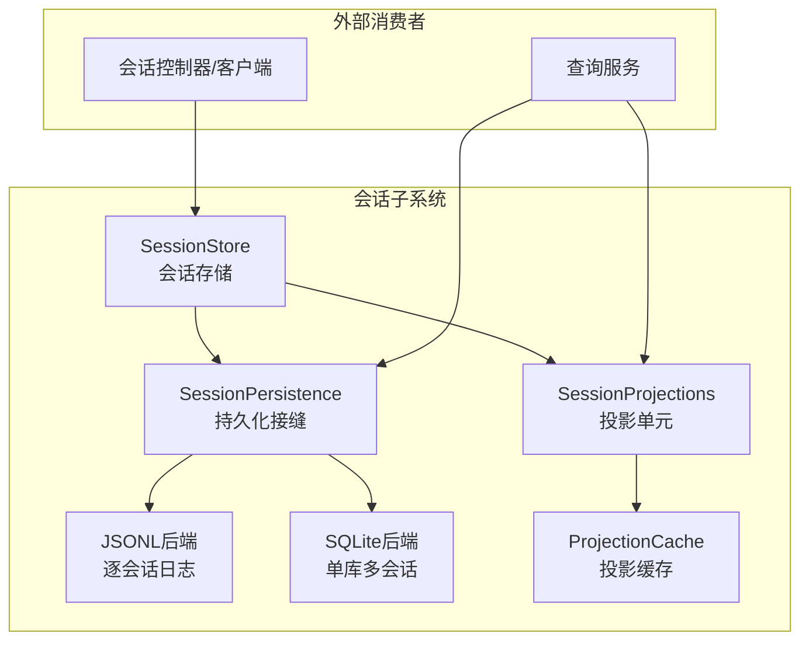
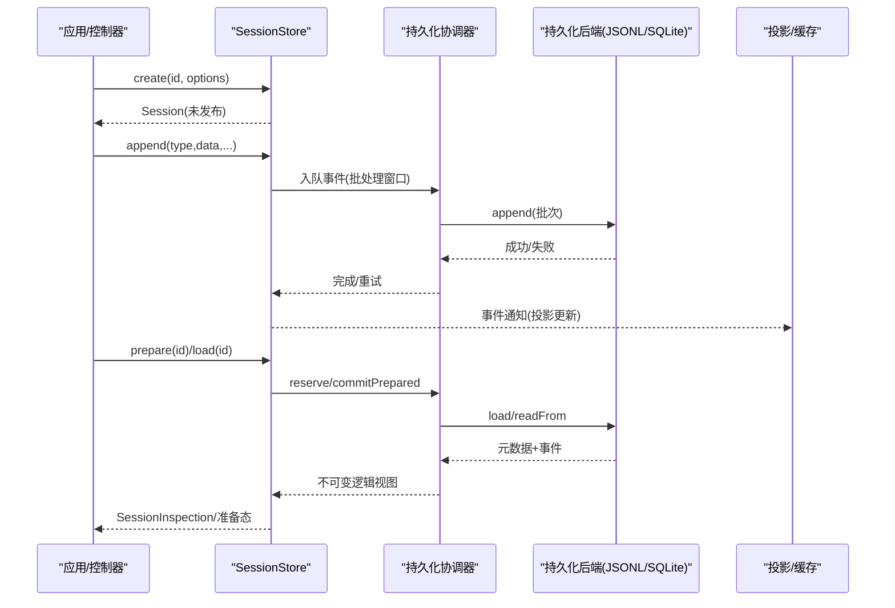
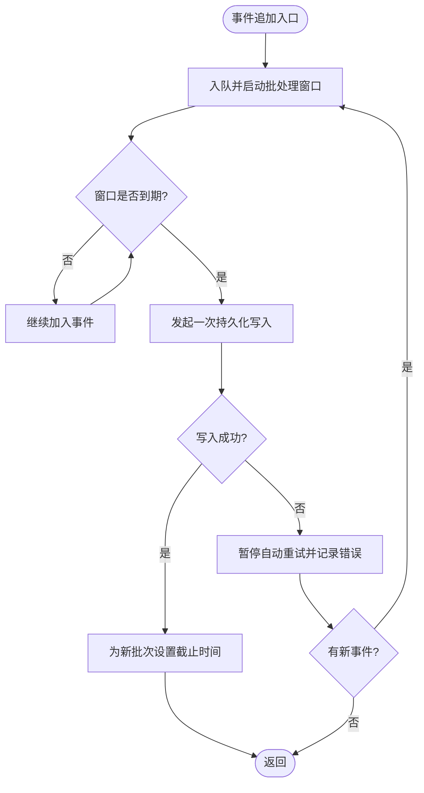
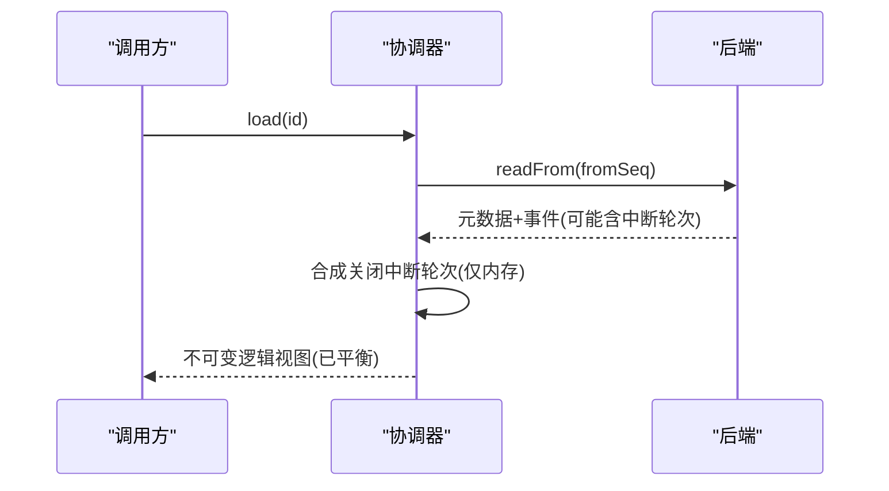
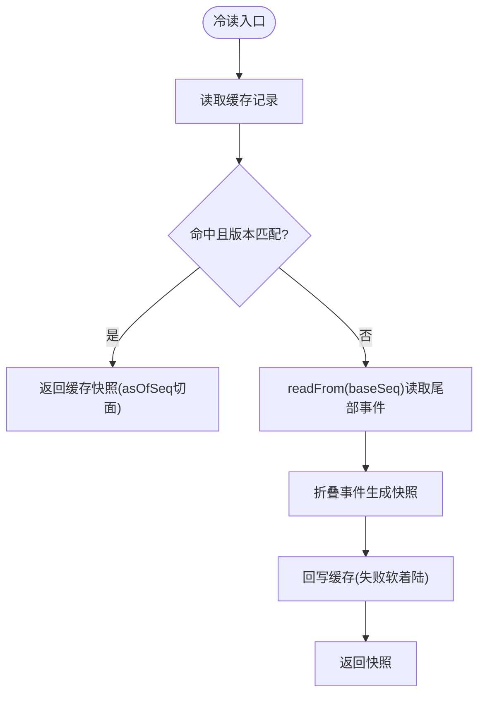
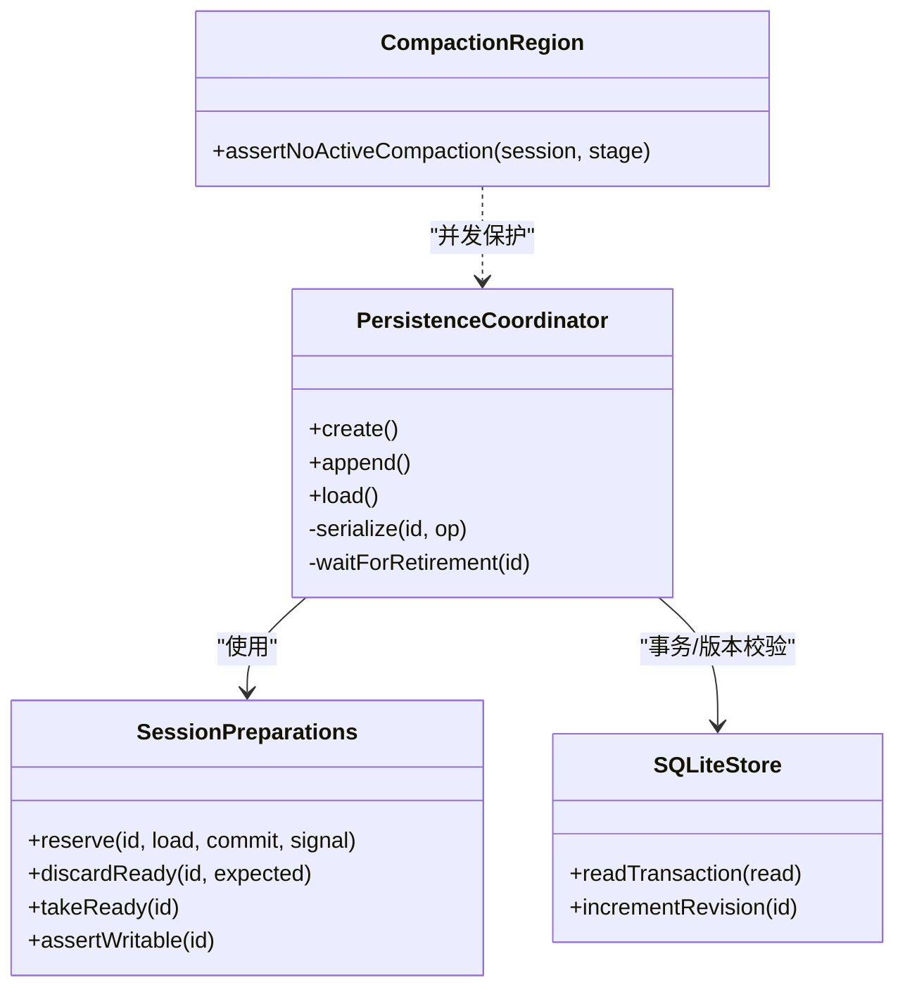
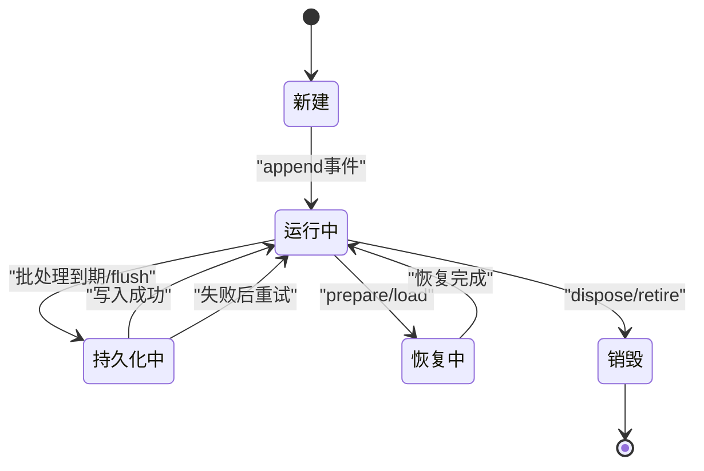
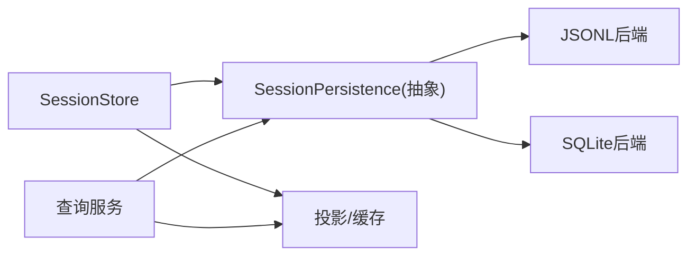

# 会话生命周期

<cite>
**本文引用的文件**
- [packages/session/README.md](file://packages/session/README.md)
- [docs/subsystems/persistence.md](file://docs/subsystems/persistence.md)
- [docs/subsystems/session.md](file://docs/subsystems/session.md)
- [packages/session/session-persistence/src/coordinator.ts](file://packages/session/session-persistence/src/coordinator.ts)
- [packages/session/session-persistence/src/preparations.ts](file://packages/session/session-persistence/src/preparations.ts)
- [packages/session/session-persistence-sqlite/src/schema.ts](file://packages/session/session-persistence-sqlite/src/schema.ts)
- [packages/session/session-persistence-sqlite/src/store.ts](file://packages/session/session-persistence-sqlite/src/store.ts)
- [packages/session/session-projection-cache/README.zh.md](file://packages/session/session-projection-cache/README.zh.md)
- [packages/session/session-projection/tests/registry.spec.ts](file://packages/session/session-projection/tests/registry.spec.ts)
- [packages/session/session-persistence/tests/persistence.spec.ts](file://packages/session/session-persistence/tests/persistence.spec.ts)
- [packages/session-query/session-query/tests/session-query.spec.ts](file://packages/session-query/session-query/tests/session-query.spec.ts)
- [packages/compaction/compaction-basic/src/region.ts](file://packages/compaction/compaction-basic/src/region.ts)
</cite>

## 目录
1. [简介](#简介)
2. [项目结构](#项目结构)
3. [核心组件](#核心组件)
4. [架构总览](#架构总览)
5. [详细组件分析](#详细组件分析)
6. [依赖关系分析](#依赖关系分析)
7. [性能考量](#性能考量)
8. [故障排查指南](#故障排查指南)
9. [结论](#结论)
10. [附录：API使用示例与最佳实践](#附录api使用示例与最佳实践)

## 简介
本文件面向DeepSeek Harness的“会话生命周期管理”，围绕会话的创建、持久化、恢复与销毁，系统阐述内存缓存、磁盘持久化与状态同步机制；说明事件日志系统的追加式写入、压缩优化与查询接口；解释断点续传、数据一致性与版本兼容性；并给出并发访问控制（读写锁、事务管理与冲突解决）的实践要点。文末提供会话状态图、数据流图以及API使用示例，帮助开发者正确、安全地管理会话。

## 项目结构
会话子系统由“持久化接缝 + 后端实现 + 检查点策略 + 投影与缓存 + 标题与遥测”组成。其中：
- 持久化接缝定义统一的 create/append/load/inspect/readFrom/list/listSnapshots 等能力，屏蔽后端差异。
- JSONL与SQLite为两种可插拔后端，分别以逐会话JSONL日志或单库多会话存储。
- 投影与缓存将已提交事件折叠为当前值，并提供冷读加速。
- 标题与遥测消费会话内容，用于展示与上报。

图表来源
- [packages/session/README.md:27-43](file://packages/session/README.md#L27-L43)
- [docs/subsystems/persistence.md:231-237](file://docs/subsystems/persistence.md#L231-L237)

章节来源
- [packages/session/README.md:27-43](file://packages/session/README.md#L27-L43)
- [docs/subsystems/persistence.md:231-237](file://docs/subsystems/persistence.md#L231-L237)

## 核心组件
- 会话与会话事件：会话是仅追加的事件日志，消息历史由事件推导，保证可回放与一致性。
- 持久化接缝：抽象出 locate/create/append/prepare/load/inspect/readFrom/list/listSnapshots 等能力，供不同后端实现。
- 协调器与会话准备：负责写路径批处理、恢复、准备态独占与发布、冷读复用与一致性收敛。
- 投影与缓存：将事件折叠为当前值，支持冷读快照与增量回放，按会话独立落盘。
- 查询接口：基于持久化接缝提供的 readFrom/list/listSnapshots 等能力进行轻量列举与分页读取。

章节来源
- [docs/subsystems/session.md:1-12](file://docs/subsystems/session.md#L1-L12)
- [docs/subsystems/persistence.md:246-399](file://docs/subsystems/persistence.md#L246-L399)
- [packages/session/session-persistence/src/coordinator.ts:608-628](file://packages/session/session-persistence/src/coordinator.ts#L608-L628)
- [packages/session/session-projection-cache/README.zh.md:59-66](file://packages/session/session-projection-cache/README.zh.md#L59-L66)

## 架构总览
下图展示了从创建到恢复的关键流程，包括事件追加、批处理、持久化、恢复准备与快照构建。

图表来源
- [docs/subsystems/persistence.md:9-19](file://docs/subsystems/persistence.md#L9-L19)
- [docs/subsystems/persistence.md:246-399](file://docs/subsystems/persistence.md#L246-L399)
- [packages/session/session-persistence/src/coordinator.ts:772-798](file://packages/session/session-persistence/src/coordinator.ts#L772-L798)
- [packages/session/session-persistence/src/coordinator.ts:1085-1114](file://packages/session/session-persistence/src/coordinator.ts#L1085-L1114)

## 详细组件分析

### 会话创建与发布
- 通过 SessionStore.create(id, { seed, meta }) 创建会话，store 填充 version/id/createdAt 等元信息。
- 对于需要与 Agent 生命周期严格对齐的场景，使用 prepare + enter + announce 组合，确保在 effect 卸载时有序释放。
- 创建后事件进入仅追加日志，观察者通过模块内发布钩子接收，I/O 不阻塞热路径。

章节来源
- [docs/subsystems/session.md:738-800](file://docs/subsystems/session.md#L738-L800)
- [docs/subsystems/session.md:332-492](file://docs/subsystems/session.md#L332-L492)

### 事件追加与批处理
- 事件追加是同步通知，持久化插件复制到每会话控制器中异步批处理。
- 首个待持久化事件启动固定批处理窗口，后续事件加入而不重置截止时间；到期触发一次持久化批次。
- flush 取消等待并排空至静默，作为顺序与错误观察的检查点；失败会保留事件并暂停自动重试，新事件开启新窗口。

图表来源
- [docs/subsystems/persistence.md:9-12](file://docs/subsystems/persistence.md#L9-L12)

章节来源
- [docs/subsystems/persistence.md:9-12](file://docs/subsystems/persistence.md#L9-L12)

### 持久化后端与压缩
- JSONL后端：每会话一个仅追加日志，默认使用Zstandard压缩帧，具备崩溃安全原子写入与中断轮次恢复。
- SQLite后端：单库多会话，物理行压缩，完整写入更快，后缀读取更快；拒绝旧schema而非迁移。
- 压缩策略：对数据字段进行可选压缩，若压缩后更小则写入压缩结果，否则回退原始文本，避免额外依赖与调优复杂度。

章节来源
- [docs/subsystems/persistence.md:231-237](file://docs/subsystems/persistence.md#L231-L237)
- [packages/session/session-persistence-sqlite/src/compression.ts:77-113](file://packages/session/session-persistence-sqlite/src/compression.ts#L77-L113)

### 恢复与断点续传
- 冷加载：load 会平衡被中断的尾轮次，合成 turn/end{kind:'interrupted'} 保持边界平衡，不截断已持久化事件。
- 准备态：prepare 预留会话，提交修复并返回不可变逻辑视图；load 使用相同机制提交修复但不发布。
- 版本兼容：后端拒绝无法忠实解读的格式，区分“格式不支持”和“损坏”；SQLite通过SCHEMA_VERSION拒绝旧版本。

图表来源
- [docs/subsystems/persistence.md:13-19](file://docs/subsystems/persistence.md#L13-L19)
- [docs/subsystems/persistence.md:318-331](file://docs/subsystems/persistence.md#L318-L331)
- [packages/session/session-persistence/src/coordinator.ts:772-798](file://packages/session/session-persistence/src/coordinator.ts#L772-L798)

章节来源
- [docs/subsystems/persistence.md:13-19](file://docs/subsystems/persistence.md#L13-L19)
- [docs/subsystems/persistence.md:318-331](file://docs/subsystems/persistence.md#L318-L331)
- [packages/session/session-persistence/src/coordinator.ts:772-798](file://packages/session/session-persistence/src/coordinator.ts#L772-L798)

### 投影与缓存
- 投影单元将已提交事件折叠为当前值，支持冷读快照与增量回放。
- 缓存按会话独立落盘，遵循“日志领先，缓存跟随”原则：先持久化缓冲事件，再保存缓存记录，崩溃不会让缓存领先日志。
- 读取时校验身份、版本与schema匹配，未知id、无关生命周期或缺失记录均视为不存在。

图表来源
- [packages/session/session-projection-cache/README.zh.md:59-66](file://packages/session/session-projection-cache/README.zh.md#L59-L66)
- [packages/session/session-projection/tests/registry.spec.ts:328-379](file://packages/session/session-projection/tests/registry.spec.ts#L328-L379)

章节来源
- [packages/session/session-projection-cache/README.zh.md:59-66](file://packages/session/session-projection-cache/README.zh.md#L59-L66)
- [packages/session/session-projection/tests/registry.spec.ts:328-379](file://packages/session/session-projection/tests/registry.spec.ts#L328-L379)

### 查询接口
- 通过 persistence.list/listSnapshots 获取轻量列表与变更令牌，避免全量解析。
- readFrom(id, fromSeq) 提供从指定序列开始的物理后缀读取，用于投影缓存等只读模型恢复。
- 测试用例展示了最小化的内存后端实现，便于理解接口契约。

章节来源
- [docs/subsystems/persistence.md:361-399](file://docs/subsystems/persistence.md#L361-L399)
- [packages/session-query/session-query/tests/session-query.spec.ts:63-85](file://packages/session-query/session-query/tests/session-query.spec.ts#L63-L85)

### 并发访问控制与冲突解决
- 会话级串行化：协调器维护 per-id 的Promise链，确保同一会话的操作串行执行，避免交错写入。
- 准备态独占：preparations.reserve 在准备阶段独占会话，阻止其他写入；discardReady/takeReady 保障竞争安全。
- 事务与一致性：SQLite后端使用显式事务封装读取/写入，失败时回滚；schema与application_id校验防止并发篡改。
- 压缩锁：compaction/start…end 成对标记，禁止在活跃压缩期间执行手动压缩，避免并发冲突。

图表来源
- [packages/session/session-persistence/src/coordinator.ts:1085-1114](file://packages/session/session-persistence/src/coordinator.ts#L1085-L1114)
- [packages/session/session-persistence/src/preparations.ts:119-141](file://packages/session/session-persistence/src/preparations.ts#L119-L141)
- [packages/session/session-persistence/src/preparations.ts:245-280](file://packages/session/session-persistence/src/preparations.ts#L245-L280)
- [packages/session/session-persistence-sqlite/src/store.ts:305-335](file://packages/session/session-persistence-sqlite/src/store.ts#L305-L335)
- [packages/session/session-persistence-sqlite/src/schema.ts:254-277](file://packages/session/session-persistence-sqlite/src/schema.ts#L254-L277)
- [packages/compaction/compaction-basic/src/region.ts:281-314](file://packages/compaction/compaction-basic/src/region.ts#L281-L314)

章节来源
- [packages/session/session-persistence/src/coordinator.ts:1085-1114](file://packages/session/session-persistence/src/coordinator.ts#L1085-L1114)
- [packages/session/session-persistence/src/preparations.ts:119-141](file://packages/session/session-persistence/src/preparations.ts#L119-L141)
- [packages/session/session-persistence/src/preparations.ts:245-280](file://packages/session/session-persistence/src/preparations.ts#L245-L280)
- [packages/session/session-persistence-sqlite/src/store.ts:305-335](file://packages/session/session-persistence-sqlite/src/store.ts#L305-L335)
- [packages/session/session-persistence-sqlite/src/schema.ts:254-277](file://packages/session/session-persistence-sqlite/src/schema.ts#L254-L277)
- [packages/compaction/compaction-basic/src/region.ts:281-314](file://packages/compaction/compaction-basic/src/region.ts#L281-L314)

### 会话状态图

图表来源
- [packages/session/session-persistence/src/coordinator.ts:1230-1260](file://packages/session/session-persistence/src/coordinator.ts#L1230-L1260)
- [docs/subsystems/persistence.md:9-19](file://docs/subsystems/persistence.md#L9-L19)

## 依赖关系分析
- SessionStore 依赖 SessionPersistence 抽象，具体后端可替换。
- 协调器封装了写路径、准备态与恢复逻辑，后端仅暴露持久化原语。
- 投影与缓存依赖会话事件流与持久化接缝的 readFrom/list/listSnapshots。
- 查询服务直接消费持久化接缝能力，无需感知后端细节。

图表来源
- [packages/session/README.md:27-43](file://packages/session/README.md#L27-L43)
- [docs/subsystems/persistence.md:231-237](file://docs/subsystems/persistence.md#L231-L237)

章节来源
- [packages/session/README.md:27-43](file://packages/session/README.md#L27-L43)
- [docs/subsystems/persistence.md:231-237](file://docs/subsystems/persistence.md#L231-L237)

## 性能考量
- 批处理窗口：固定延迟合并事件，减少频繁I/O；失败不阻塞主循环，新事件开启新窗口。
- 压缩：JSONL默认Zstandard压缩帧，SQLite物理行压缩，兼顾体积与速度。
- 冷读优化：投影缓存按会话独立落盘，冷读跳过已检查点前缀，失败软着陆不影响可用性。
- 后缀读取：readFrom 支持从指定seq开始读取，减少不必要的全量解析。

章节来源
- [docs/subsystems/persistence.md:9-12](file://docs/subsystems/persistence.md#L9-L12)
- [packages/session/session-projection-cache/README.zh.md:59-66](file://packages/session/session-projection-cache/README.zh.md#L59-L66)
- [docs/subsystems/persistence.md:361-379](file://docs/subsystems/persistence.md#L361-L379)

## 故障排查指南
- 格式不支持：当后端无法忠实解读日志时抛出格式不支持错误，需升级Harness或调整配置。
- 损坏检测：committed prefix损坏会拒绝加载；SQLite通过schema版本校验防止并发篡改。
- 恢复行为：冷加载会合成中断轮次的结束事件，保持边界平衡；live会话的open turn不会被合成关闭。
- 缓存回写失败：冷读回写失败仅记录警告，不抛错，保证可用性。

章节来源
- [docs/subsystems/persistence.md:92-95](file://docs/subsystems/persistence.md#L92-L95)
- [docs/subsystems/persistence.md:13-19](file://docs/subsystems/persistence.md#L13-L19)
- [packages/session/session-persistence-sqlite/src/schema.ts:254-277](file://packages/session/session-persistence-sqlite/src/schema.ts#L254-L277)
- [packages/session/session-projection-cache/README.zh.md:59-66](file://packages/session/session-projection-cache/README.zh.md#L59-L66)

## 结论
DeepSeek Harness的会话生命周期以事件溯源为核心，通过持久化接缝统一抽象，结合JSONL与SQLite后端，实现了高可靠、可恢复、可扩展的会话管理。批处理与压缩优化提升吞吐与空间效率；投影与缓存提供高效冷读；协调器与准备态机制保障并发安全与一致性。配合查询接口与恢复机制，开发者可以构建健壮、可观测、易维护的会话驱动应用。

## 附录：API使用示例与最佳实践
- 创建会话：使用 ctx.sessions.create(id, { seed, meta }) 创建会话，store 填充必要元信息。
- 追加事件：session.append(type, data, ...opts)，热路径不阻塞I/O，持久化异步批处理。
- 刷新检查点：session.flush(session) 作为顺序与错误观察的检查点。
- 恢复会话：ctx.sessionPersistence.prepare(id) 或 load(id) 获取不可变逻辑视图，用于恢复或历史读取。
- 查询与会话列表：使用 list/listSnapshots 获取轻量列表与变更令牌；readFrom(id, fromSeq) 进行后缀读取。
- 并发与事务：避免在同一会话上并发写入；SQLite后端通过事务与schema版本校验保证一致性。
- 压缩与缓存：默认启用压缩；利用投影缓存加速冷读，注意其“日志领先，缓存跟随”的一致性语义。

章节来源
- [docs/subsystems/session.md:738-800](file://docs/subsystems/session.md#L738-L800)
- [docs/subsystems/persistence.md:246-399](file://docs/subsystems/persistence.md#L246-L399)
- [packages/session/session-persistence/tests/persistence.spec.ts:2048-2082](file://packages/session/session-persistence/tests/persistence.spec.ts#L2048-L2082)
- [packages/session/session-persistence/tests/persistence.spec.ts:1342-1361](file://packages/session/session-persistence/tests/persistence.spec.ts#L1342-L1361)