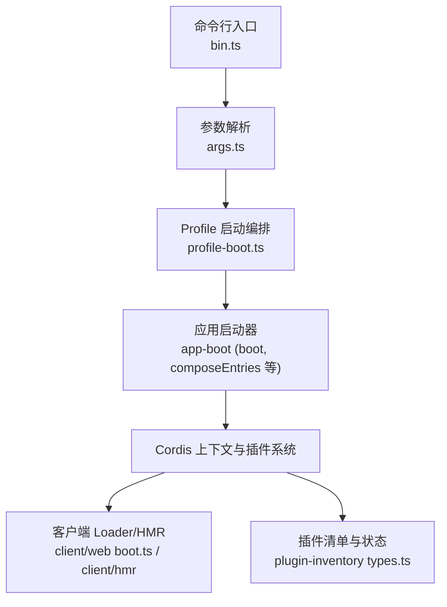
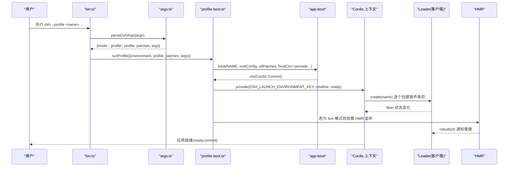
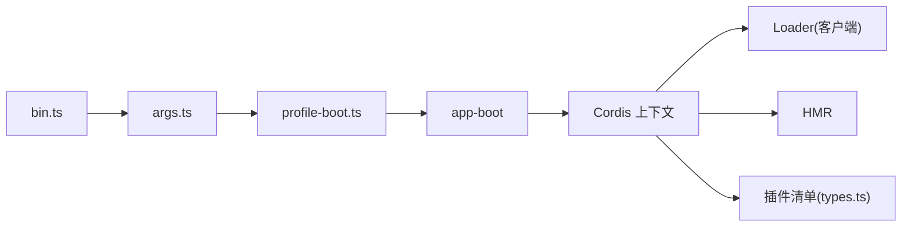
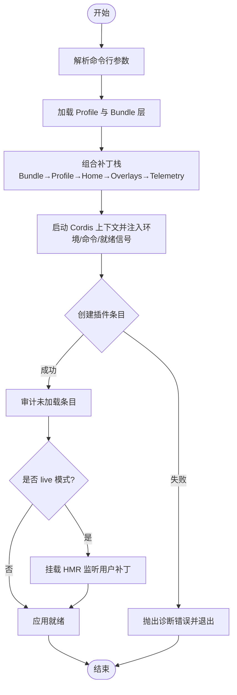

# 应用启动

<cite>
**本文引用的文件**
- [apps/cli/src/bin.ts](file://apps/cli/src/bin.ts)
- [apps/cli/src/args.ts](file://apps/cli/src/args.ts)
- [apps/cli/src/profile-boot.ts](file://apps/cli/src/profile-boot.ts)
- [packages/boot/app-boot/README.md](file://packages/boot/app-boot/README.md)
- [packages/boot/app-boot/src/index.ts](file://packages/boot/app-boot/src/index.ts)
- [packages/client/web/src/boot.ts](file://packages/client/web/src/boot.ts)
- [packages/host/plugin-inventory/src/types.ts](file://packages/host/plugin-inventory/src/types.ts)
- [packages/client/hmr/src/index.ts](file://packages/client/hmr/src/index.ts)
- [packages/extensions/cordis-client-runner/src/client/runtime.ts](file://packages/extensions/cordis-client-runner/src/client/runtime.ts)
- [docs/cordis-tutorial/03-services.md](file://docs/cordis-tutorial/03-services.md)
</cite>

## 目录
1. [简介](#简介)
2. [项目结构](#项目结构)
3. [核心组件](#核心组件)
4. [架构总览](#架构总览)
5. [详细组件分析](#详细组件分析)
6. [依赖关系分析](#依赖关系分析)
7. [性能考量](#性能考量)
8. [故障排查指南](#故障排查指南)
9. [结论](#结论)
10. [附录](#附录)

## 简介
本文件面向 DeepSeek Harness 的“应用启动”流程，系统性说明从命令行入口到 Profile 加载、Bundle 组装、插件树构建、配置解析与依赖注入、服务注册、动态加载机制、错误处理以及热重载（HMR）支持的完整过程。文档以代码级为依据，配合流程图与序列图，帮助开发者理解并自定义启动行为。

## 项目结构
DeepSeek Harness 的 CLI 入口位于 apps/cli，负责解析参数、选择 Profile 并调用统一启动器；Profile 与 Bundle 的组合由 dsh-app-boot 提供；Cordis 框架负责插件生命周期、依赖注入与服务注册；客户端侧包含 Loader 与 HMR 支持，用于开发模式下的增量更新与资源清理。

图表来源
- [apps/cli/src/bin.ts:1-51](file://apps/cli/src/bin.ts#L1-L51)
- [apps/cli/src/args.ts:1-192](file://apps/cli/src/args.ts#L1-L192)
- [apps/cli/src/profile-boot.ts:1-308](file://apps/cli/src/profile-boot.ts#L1-L308)
- [packages/boot/app-boot/README.md:34-48](file://packages/boot/app-boot/README.md#L34-L48)
- [packages/client/web/src/boot.ts:112-135](file://packages/client/web/src/boot.ts#L112-L135)
- [packages/host/plugin-inventory/src/types.ts:1-28](file://packages/host/plugin-inventory/src/types.ts#L1-L28)
- [packages/client/hmr/src/index.ts:63-91](file://packages/client/hmr/src/index.ts#L63-L91)

章节来源
- [apps/cli/src/bin.ts:1-51](file://apps/cli/src/bin.ts#L1-L51)
- [apps/cli/src/args.ts:1-192](file://apps/cli/src/args.ts#L1-L192)
- [apps/cli/src/profile-boot.ts:1-308](file://apps/cli/src/profile-boot.ts#L1-L308)
- [packages/boot/app-boot/README.md:34-48](file://packages/boot/app-boot/README.md#L34-L48)

## 核心组件
- 命令行入口与参数解析：负责识别 --profile、--patch、--dump-config 等选项，并将剩余参数透传给被启动的应用。
- Profile 启动编排：组合 Bundle 层、Profile 自身 patch、用户 home 层、--patch 覆盖层与遥测开关，生成最终补丁栈并启动 Cordis 上下文。
- 应用启动器：提供 boot、composeEntries、assertEntriesLoaded 等能力，完成插件装配与启动后审计。
- 插件系统与依赖注入：基于 Cordis 的 Fiber/Lifecycle/Registry，按声明式依赖决定加载顺序，并在运行时维护依赖关系。
- 客户端 Loader 与 HMR：在浏览器端创建、加载、监控模块，支持开发模式下的增量更新与失效清理。
- 插件清单与状态：对外暴露每个插件条目的启用状态与 Fiber 阶段，便于诊断与可视化。

章节来源
- [apps/cli/src/args.ts:1-192](file://apps/cli/src/args.ts#L1-L192)
- [apps/cli/src/profile-boot.ts:1-308](file://apps/cli/src/profile-boot.ts#L1-L308)
- [packages/boot/app-boot/src/index.ts:666-693](file://packages/boot/app-boot/src/index.ts#L666-L693)
- [docs/cordis-tutorial/03-services.md:59-78](file://docs/cordis-tutorial/03-services.md#L59-L78)
- [packages/client/web/src/boot.ts:112-135](file://packages/client/web/src/boot.ts#L112-L135)
- [packages/host/plugin-inventory/src/types.ts:1-28](file://packages/host/plugin-inventory/src/types.ts#L1-L28)

## 架构总览
下图展示从命令行到插件树就绪的关键路径，包括环境快照注入、命令参数注入、补丁栈组装、Cordis 启动、Loader 初始化与 HMR 挂载。

图表来源
- [apps/cli/src/bin.ts:1-51](file://apps/cli/src/bin.ts#L1-L51)
- [apps/cli/src/args.ts:1-192](file://apps/cli/src/args.ts#L1-L192)
- [apps/cli/src/profile-boot.ts:1-308](file://apps/cli/src/profile-boot.ts#L1-L308)
- [packages/client/web/src/boot.ts:112-135](file://packages/client/web/src/boot.ts#L112-L135)
- [packages/client/hmr/src/index.ts:63-91](file://packages/client/hmr/src/index.ts#L63-L91)

## 详细组件分析

### 命令行入口与参数解析
- bin.ts 读取版本信息，解析 argv，根据 mode 分派到 profile、plugin、dump-config 三种模式。
- args.ts 使用 Commander 定义 launcher 自有选项（--profile、--patch、--dump-config、--dump-default-config），将未知选项透传给被启动应用，确保应用拥有 -h/--help 的控制权。
- 对 dump-config 模式进行严格校验，避免与 --patch 混用或传入应用参数导致不一致。

章节来源
- [apps/cli/src/bin.ts:1-51](file://apps/cli/src/bin.ts#L1-L51)
- [apps/cli/src/args.ts:1-192](file://apps/cli/src/args.ts#L1-L192)

### Profile 加载与补丁栈组装
- prepareProfile：加载指定 Profile，写入空根配置文件 cordis.yml，保证 Loader 的 baseUrl 锚点稳定且可写回。
- composeProfile：按优先级拼接补丁栈：
  1) Bundle 层（来自 dsh.profile.bundles，含平台门控行）
  2) Profile 自身 cordis.patch.yml
  3) 用户 home 层 $DSH_HOME/cordis.patch.yml（机器级偏好，优先级高于 Profile 层）
  4) --patch 覆盖层（argv 顺序）
  5) 遥测开关（DSH_TELEMETRY_DISABLED）作为顶层覆盖
- 通过 composeEntries 合并所有补丁行，去重并按 id 索引，以便后续覆盖与定位。
- 对于 live reload 的 Profile，启动后会重新监听用户补丁文件变更，并以结构化克隆的方式重组补丁栈，避免引用共享导致的污染。

章节来源
- [apps/cli/src/profile-boot.ts:1-308](file://apps/cli/src/profile-boot.ts#L1-L308)

### 应用启动与依赖注入
- app-boot 的 boot 函数接收根配置与补丁栈，启动 Cordis 上下文，并在宿主回调中注入：
  - 启动环境快照（DSH_LAUNCH_ENVIRONMENT_KEY）
  - 命令行参数与退出信号（provideCmdline）
  - 应用就绪信号（AppReady）
- 启动完成后，断言所有插件条目已加载成功（assertEntriesLoaded），未加载的非禁用条目会抛出带诊断信息的错误。

章节来源
- [packages/boot/app-boot/README.md:34-48](file://packages/boot/app-boot/README.md#L34-L48)
- [packages/boot/app-boot/src/index.ts:666-693](file://packages/boot/app-boot/src/index.ts#L666-L693)
- [apps/cli/src/profile-boot.ts:1-308](file://apps/cli/src/profile-boot.ts#L1-L308)

### 插件树构建与生命周期
- 客户端 Loader：遍历 manifest.plugins，逐个 create，记录状态并等待全部就绪，最后断言激活。
- 插件状态：通过 PluginInventoryEntry 暴露 moduleName、enabled、fiberPhase（pending/loading/active/failed/unloading/null）。
- 依赖驱动加载：Cordis 的 inject 声明决定加载时机，直到所有依赖就绪才激活；依赖消失时依赖方卸载并重启，保证一致性。

章节来源
- [packages/client/web/src/boot.ts:112-135](file://packages/client/web/src/boot.ts#L112-L135)
- [packages/host/plugin-inventory/src/types.ts:1-28](file://packages/host/plugin-inventory/src/types.ts#L1-L28)
- [docs/cordis-tutorial/03-services.md:59-78](file://docs/cordis-tutorial/03-services.md#L59-L78)

### 动态加载机制：发现、版本检查与冲突解决
- 插件发现：来自 Profile 的 bundles 与 patch 列表，经 composeEntries 合并后形成 Loader 的条目集合。
- 版本与安装锚点：Profile 通过 dsh.profile.bundles 显式声明组合包，安装锚点固定于 dsh 安装目录，避免 link: 带来的路径漂移问题。
- 冲突解决：补丁栈具有明确优先级（Bundle → Profile → Home → Overlays → Telemetry），同名 id 的条目会被上层覆盖；同时通过 structuredClone 避免跨次应用共享对象导致的残留覆盖。

章节来源
- [apps/cli/src/profile-boot.ts:1-308](file://apps/cli/src/profile-boot.ts#L1-L308)

### 错误处理策略
- 启动失败审计：assertEntriesLoaded 收集未加载的非禁用条目并抛出错误，附带名称与提示。
- 信号与关闭：SIGTERM/SIGINT 触发中断，结合 installFailLoud 与进程关闭控制器，确保在启动窗口也能正确中止。
- HMR 初始扫描死锁修复：主 watcher 忽略首次扫描以避免与启动期消费竞争；Include 的 update 串行化保证组事务安全。
- 运行时卸载：当依赖服务不可用时，依赖方卸载并可在返回时重启，避免持有过期引用。

章节来源
- [packages/boot/app-boot/src/index.ts:666-693](file://packages/boot/app-boot/src/index.ts#L666-L693)
- [apps/cli/src/profile-boot.ts:1-308](file://apps/cli/src/profile-boot.ts#L1-L308)
- [packages/extensions/cordis-client-runner/src/client/runtime.ts:439-467](file://packages/extensions/cordis-client-runner/src/client/runtime.ts#L439-L467)

### 热重载（HMR）支持
- 开发模式：若 Profile 设置为 live 模式，会在启动后挂载 cordis-plugin-hmr（必要时先装载 timer），仅监听用户补丁文件变更，不替换源码模块。
- 增量更新：HMR 通过 stat 轮询检测 bundle 重建，调用 clientModuleHost.rebuilt(id) 通知客户端刷新；首次扫描忽略以避免与启动期竞争。
- 资源清理：插件卸载时移除 Loader 条目、失效模块缓存并释放样式等资源，保证无泄漏。

章节来源
- [apps/cli/src/profile-boot.ts:1-308](file://apps/cli/src/profile-boot.ts#L1-L308)
- [packages/client/hmr/src/index.ts:63-91](file://packages/client/hmr/src/index.ts#L63-L91)
- [packages/extensions/cordis-client-runner/src/client/runtime.ts:439-467](file://packages/extensions/cordis-client-runner/src/client/runtime.ts#L439-L467)

## 依赖关系分析
- 入口依赖：bin.ts 依赖 args.ts 解析参数，再调用 profile-boot.ts。
- 启动编排：profile-boot.ts 依赖 app-boot 提供的 boot/composeEntries/loadProfile 等能力，并注入环境与命令行服务。
- 插件系统：Cordis 管理 Fiber 生命周期与依赖注入；客户端 Loader 负责模块创建与状态上报；HMR 与 Loader 协作实现增量更新。
- 诊断与可视化：PluginInventory 暴露条目与状态，供设置页与调试工具使用。

图表来源
- [apps/cli/src/bin.ts:1-51](file://apps/cli/src/bin.ts#L1-L51)
- [apps/cli/src/args.ts:1-192](file://apps/cli/src/args.ts#L1-L192)
- [apps/cli/src/profile-boot.ts:1-308](file://apps/cli/src/profile-boot.ts#L1-L308)
- [packages/host/plugin-inventory/src/types.ts:1-28](file://packages/host/plugin-inventory/src/types.ts#L1-L28)
- [packages/client/web/src/boot.ts:112-135](file://packages/client/web/src/boot.ts#L112-L135)
- [packages/client/hmr/src/index.ts:63-91](file://packages/client/hmr/src/index.ts#L63-L91)

## 性能考量
- 补丁栈重组：live 模式下每次重组都使用 structuredClone，避免引用共享导致的副作用，代价是少量内存分配，但保证了稳定性。
- HMR 轮询：stat 轮询间隔可调，避免频繁 I/O；首次扫描忽略以减少启动竞争。
- 依赖懒加载：Cordis 仅在依赖满足时激活插件，减少不必要的初始化开销。
- 条目审计：启动后一次性审计未加载条目，集中报错，便于快速定位瓶颈。

[本节为通用指导，无需特定文件来源]

## 故障排查指南
- 插件未加载：检查 assertEntriesLoaded 抛出的名称列表，确认模块是否可解析、是否存在拼写错误或路径问题。
- 依赖缺失：查看 Cordis 的 PENDING 状态，确认所需服务是否已注册；若服务被卸载，依赖方也会卸载并等待恢复。
- HMR 无效：确认是否为 live 模式并已挂载 HMR；检查统计轮询是否正常；关注 ENOENT 等文件系统错误。
- 启动崩溃：结合 installFailLoud 与进程关闭控制器，观察是否在启动窗口收到 SIGTERM/SIGINT；必要时缩小补丁范围定位问题。

章节来源
- [packages/boot/app-boot/src/index.ts:666-693](file://packages/boot/app-boot/src/index.ts#L666-L693)
- [docs/cordis-tutorial/03-services.md:59-78](file://docs/cordis-tutorial/03-services.md#L59-L78)
- [packages/client/hmr/src/index.ts:63-91](file://packages/client/hmr/src/index.ts#L63-L91)
- [apps/cli/src/profile-boot.ts:1-308](file://apps/cli/src/profile-boot.ts#L1-L308)

## 结论
DeepSeek Harness 的启动流程以 Profile 为中心，通过明确的补丁栈优先级与 Cordis 依赖驱动模型，实现了可组合、可观测、可热更新的插件化应用启动。命令行入口与参数解析保持简洁，Profile 编排负责组合与覆盖，应用启动器保障健壮性与可诊断性，客户端 Loader 与 HMR 提供开发体验。遵循该流程，开发者可以安全地扩展与定制启动行为。

[本节为总结，无需特定文件来源]

## 附录

### 启动流程图（算法视角）

图表来源
- [apps/cli/src/args.ts:1-192](file://apps/cli/src/args.ts#L1-L192)
- [apps/cli/src/profile-boot.ts:1-308](file://apps/cli/src/profile-boot.ts#L1-L308)
- [packages/boot/app-boot/src/index.ts:666-693](file://packages/boot/app-boot/src/index.ts#L666-L693)
- [packages/client/hmr/src/index.ts:63-91](file://packages/client/hmr/src/index.ts#L63-L91)

### 关键配置示例（路径指引）
- Profile 根配置：cordis.yml（由启动器写入空根，实际组合通过补丁层生效）
- 用户补丁：$DSH_HOME/cordis.patch.yml（机器级覆盖）
- Profile 补丁：各 Profile 目录下的 cordis.patch.yml
- 额外覆盖：--patch <path>（argv 顺序叠加）
- 遥测开关：DSH_TELEMETRY_DISABLED（非空即禁用对应行）

章节来源
- [apps/cli/src/profile-boot.ts:1-308](file://apps/cli/src/profile-boot.ts#L1-L308)