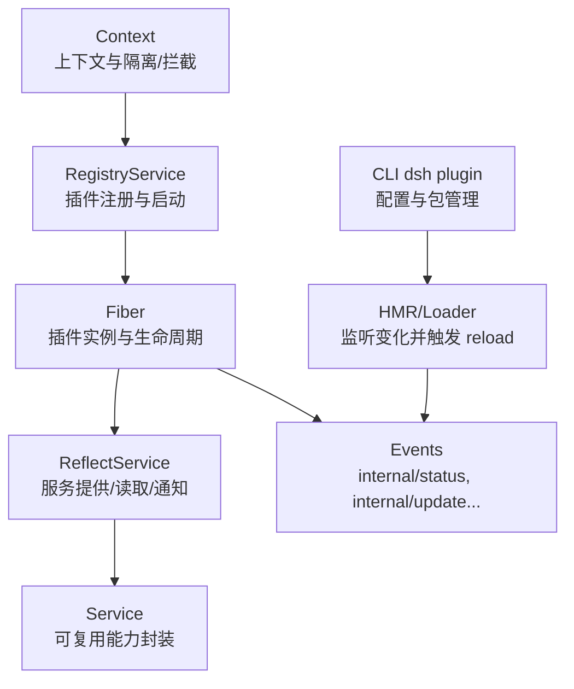
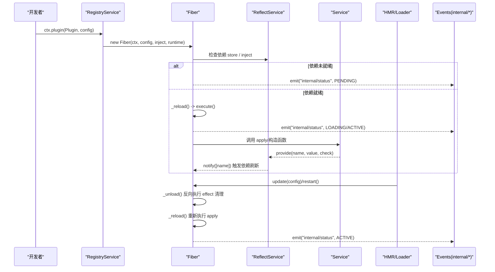
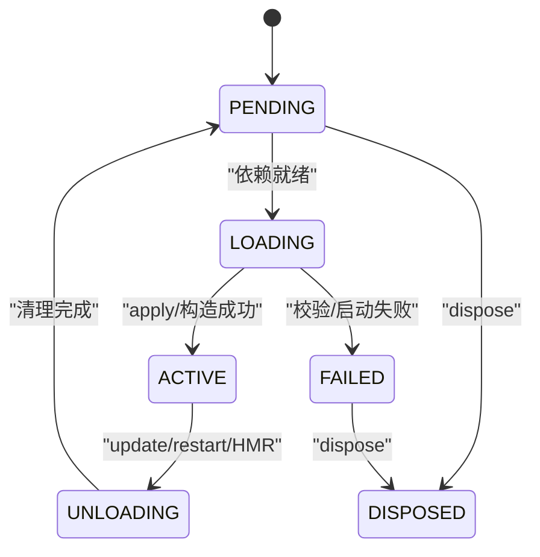
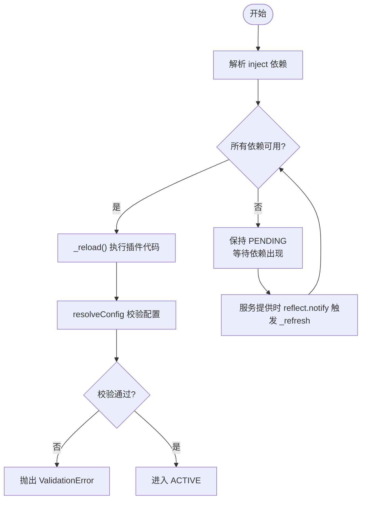
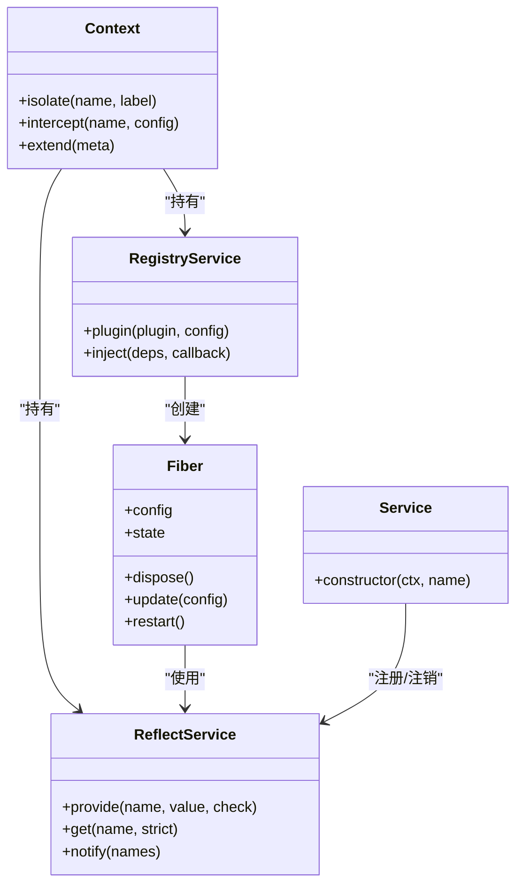
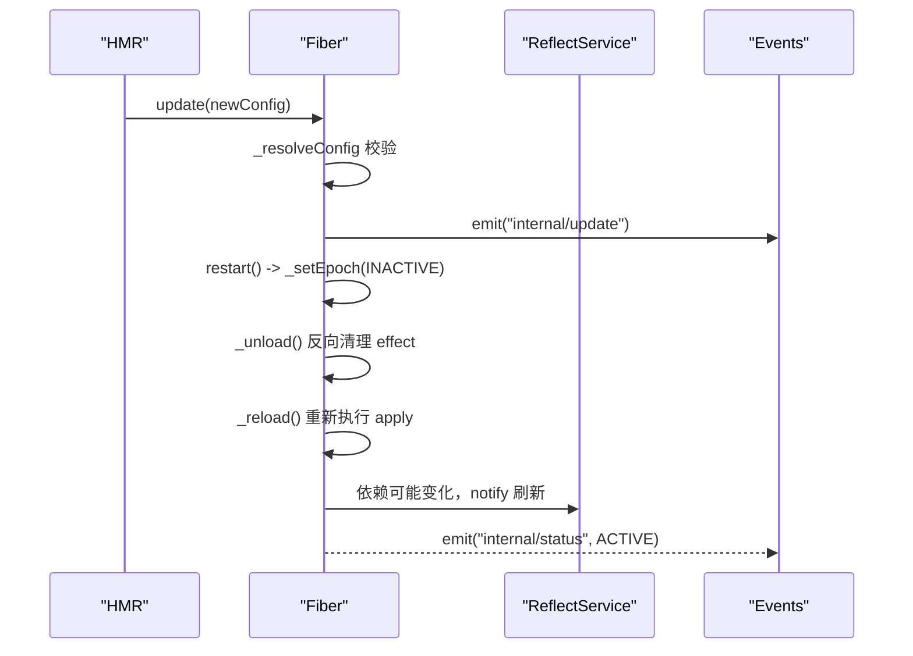
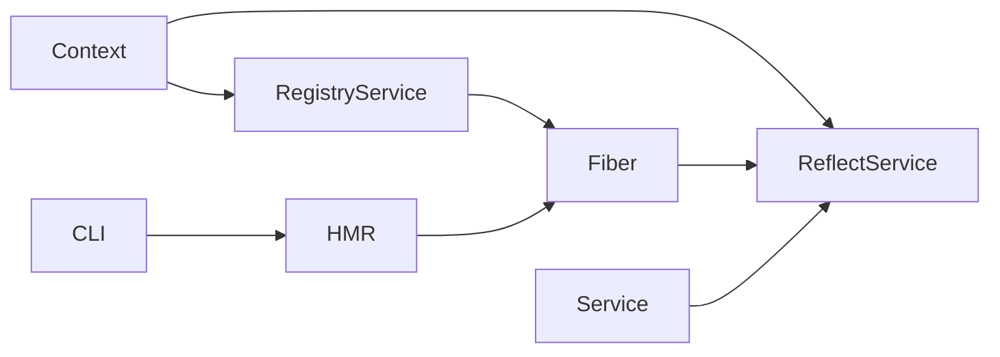

# 插件生命周期

<cite>
**本文引用的文件**
- [fiber.ts](file://vendor/cordis/src/fiber.ts)
- [registry.ts](file://vendor/cordis/src/registry.ts)
- [context.ts](file://vendor/cordis/src/context.ts)
- [reflect.ts](file://vendor/cordis/src/reflect.ts)
- [service.ts](file://vendor/cordis/src/service.ts)
- [02-lifecycle-and-effects.md](file://docs/cordis-tutorial/02-lifecycle-and-effects.md)
- [03-services.md](file://docs/cordis-tutorial/03-services.md)
- [06-composition-and-hmr.md](file://docs/cordis-tutorial/06-composition-and-hmr.md)
- [inherited.md](file://docs/cordis-api/inherited.md)
- [plugin.ts](file://apps/cli/src/plugin.ts)
</cite>

## 目录
1. [简介](#简介)
2. [项目结构](#项目结构)
3. [核心组件](#核心组件)
4. [架构总览](#架构总览)
5. [详细组件分析](#详细组件分析)
6. [依赖关系分析](#依赖关系分析)
7. [性能考量](#性能考量)
8. [故障排查指南](#故障排查指南)
9. [结论](#结论)
10. [附录](#附录)

## 简介
本文面向 DeepSeek Harness 的插件系统，围绕 Cordis 内核（fiber、registry、context、reflect、service）与 HMR/Loader 生态，系统化阐述插件的完整生命周期：加载、初始化、激活、热重载与卸载；解释依赖解析与服务注册发现机制；说明资源管理与回滚策略；并提供扩展点与最佳实践，帮助开发者编写高质量插件。

## 项目结构
Cordis 插件框架位于 vendor/cordis 源码中，配合文档教程与 CLI 工具共同构成完整的插件体系：
- 运行时核心：Context、Fiber、RegistryService、ReflectService、Service
- 事件与钩子：internal/* 系列内部事件用于状态变更、服务拦截、配置更新等
- 热重载与加载：HMR 插件与 Loader 通过事件驱动 fiber 的重载与回滚
- CLI 管理：dsh plugin 命令负责配置文件层与包管理的协调

图表来源
- [context.ts:70-84](file://vendor/cordis/src/context.ts#L70-L84)
- [registry.ts:195-336](file://vendor/cordis/src/registry.ts#L195-L336)
- [fiber.ts:184-333](file://vendor/cordis/src/fiber.ts#L184-L333)
- [reflect.ts:133-223](file://vendor/cordis/src/reflect.ts#L133-L223)
- [service.ts:11-59](file://vendor/cordis/src/service.ts#L11-L59)
- [inherited.md:23-38](file://docs/cordis-api/inherited.md#L23-L38)

章节来源
- [context.ts:70-84](file://vendor/cordis/src/context.ts#L70-L84)
- [registry.ts:195-336](file://vendor/cordis/src/registry.ts#L195-L336)
- [fiber.ts:184-333](file://vendor/cordis/src/fiber.ts#L184-L333)
- [reflect.ts:133-223](file://vendor/cordis/src/reflect.ts#L133-L223)
- [service.ts:11-59](file://vendor/cordis/src/service.ts#L11-L59)
- [inherited.md:23-38](file://docs/cordis-api/inherited.md#L23-L38)

## 核心组件
- Fiber：单个插件实例的生命周期管理器，维护状态机、effect 收集器、依赖快照与热重载调度。
- RegistryService：插件入口规范化、运行时记录、fiber 创建与注入依赖解析。
- Context：应用上下文，提供 isolate（隔离）、intercept（拦截配置）、extend（派生子上下文）。
- ReflectService：服务注册、读取、访问器与 mixin 能力，支撑 ctx.get/set/provide/mixin。
- Service：可复用的服务基类，自动注册到 ctx 并在 fiber 卸载时清理。

章节来源
- [fiber.ts:184-333](file://vendor/cordis/src/fiber.ts#L184-L333)
- [registry.ts:195-336](file://vendor/cordis/src/registry.ts#L195-L336)
- [context.ts:70-147](file://vendor/cordis/src/context.ts#L70-L147)
- [reflect.ts:133-419](file://vendor/cordis/src/reflect.ts#L133-L419)
- [service.ts:11-116](file://vendor/cordis/src/service.ts#L11-L116)

## 架构总览
下图展示插件从注册到运行、再到热重载与卸载的整体流程，以及各组件间的交互。

图表来源
- [registry.ts:316-336](file://vendor/cordis/src/registry.ts#L316-L336)
- [fiber.ts:646-696](file://vendor/cordis/src/fiber.ts#L646-L696)
- [reflect.ts:277-335](file://vendor/cordis/src/reflect.ts#L277-L335)
- [inherited.md:23-38](file://docs/cordis-api/inherited.md#L23-L38)

## 详细组件分析

### 插件生命周期与状态机
- 状态定义：PENDING、LOADING、ACTIVE、FAILED、UNLOADING、DISPOSED。
- 关键行为：
  - 依赖就绪后进入 LOADING，执行插件回调或构造实例，成功后进入 ACTIVE。
  - 配置更新或依赖变更会先 UNLOADING 再 LOADING，保证 effect 正确回收。
  - dispose 会触发全部 effect 的反向清理，并等待异步清理完成。

图表来源
- [fiber.ts:147-154](file://vendor/cordis/src/fiber.ts#L147-L154)
- [fiber.ts:625-696](file://vendor/cordis/src/fiber.ts#L625-L696)
- [02-lifecycle-and-effects.md:68-82](file://docs/cordis-tutorial/02-lifecycle-and-effects.md#L68-L82)

章节来源
- [fiber.ts:147-154](file://vendor/cordis/src/fiber.ts#L147-L154)
- [fiber.ts:625-696](file://vendor/cordis/src/fiber.ts#L625-L696)
- [02-lifecycle-and-effects.md:68-82](file://docs/cordis-tutorial/02-lifecycle-and-effects.md#L68-L82)

### 依赖解析与版本兼容
- 声明式依赖：通过 inject 数组或对象声明所需服务名称及可选拦截配置。
- 解析与等待：Fiber 在 PENDING 状态下等待所有依赖可用；依赖变化时会触发 _refresh/_setEpoch 以重新评估 epoch。
- 可用性检查：服务可提供 check 谓词，Fiber 在 _checkImpl 中调用以决定是否满足依赖。
- 版本兼容性：通过 StandardSchemaV1 对配置进行强校验；不兼容配置会在 resolveConfig 阶段抛出 ValidationError。

图表来源
- [registry.ts:19-88](file://vendor/cordis/src/registry.ts#L19-L88)
- [fiber.ts:597-644](file://vendor/cordis/src/fiber.ts#L597-L644)
- [reflect.ts:277-335](file://vendor/cordis/src/reflect.ts#L277-L335)

章节来源
- [registry.ts:19-88](file://vendor/cordis/src/registry.ts#L19-L88)
- [fiber.ts:597-644](file://vendor/cordis/src/fiber.ts#L597-L644)
- [reflect.ts:277-335](file://vendor/cordis/src/reflect.ts#L277-L335)

### 循环依赖检测
- 当前实现通过“依赖就绪才激活”的策略避免循环依赖导致的死锁：若 A 依赖 B，B 未提供则 A 保持 PENDING；当 B 提供后，A 被唤醒并尝试加载。
- 若存在真正的循环（A 依赖 B，B 也依赖 A），两者将始终无法同时满足依赖，从而保持 PENDING，不会进入 ACTIVE。
- 建议：显式拆分模块或使用事件/消息解耦，避免形成环。

章节来源
- [fiber.ts:611-639](file://vendor/cordis/src/fiber.ts#L611-L639)
- [reflect.ts:314-335](file://vendor/cordis/src/reflect.ts#L314-L335)

### 服务注册与发现
- 提供服务：Service 子类在构造时调用 super(ctx, name)，内部通过 ctx.reflect.provide 注册，并绑定 fiber 生命周期自动注销。
- 发现服务：ctx.get('name') 可在非严格模式下获取任意已提供的服务；ctx.name 在声明了 inject 后可直接访问。
- 拦截与隔离：Context.intercept 为特定服务注入 per-plugin 配置；Context.isolate 为服务名建立独立作用域，支持多实例共存。
- 通知机制：服务提供/更新时，ReflectService.notify 会遍历所有相关 fiber 并触发 _refresh，确保依赖图一致性。

图表来源
- [context.ts:99-147](file://vendor/cordis/src/context.ts#L99-L147)
- [registry.ts:195-336](file://vendor/cordis/src/registry.ts#L195-L336)
- [fiber.ts:184-333](file://vendor/cordis/src/fiber.ts#L184-L333)
- [reflect.ts:277-335](file://vendor/cordis/src/reflect.ts#L277-L335)
- [service.ts:11-59](file://vendor/cordis/src/service.ts#L11-L59)

章节来源
- [context.ts:99-147](file://vendor/cordis/src/context.ts#L99-L147)
- [registry.ts:195-336](file://vendor/cordis/src/registry.ts#L195-L336)
- [fiber.ts:184-333](file://vendor/cordis/src/fiber.ts#L184-L333)
- [reflect.ts:277-335](file://vendor/cordis/src/reflect.ts#L277-L335)
- [service.ts:11-59](file://vendor/cordis/src/service.ts#L11-L59)

### 热重载支持：增量更新、状态保持与回滚
- 增量更新：HMR 监听文件变化，触发 fiber.update/restart，先卸载旧实例（反向执行 effect），再加载新实例。
- 状态保持：Fiber.store 保存依赖实现的快照；_reload 前复制 store，确保执行期间依赖稳定。
- 回滚机制：配置更新通过 internal/update 水线允许拦截或替换；HMR 侧对失败刷新进行收容，保留上一份有效树或恢复。
- 事件驱动：internal/status、internal/update、hmr/change、hmr/reload 等事件贯穿整个热重载过程。

图表来源
- [fiber.ts:736-753](file://vendor/cordis/src/fiber.ts#L736-L753)
- [fiber.ts:646-696](file://vendor/cordis/src/fiber.ts#L646-L696)
- [inherited.md:23-38](file://docs/cordis-api/inherited.md#L23-L38)

章节来源
- [fiber.ts:646-696](file://vendor/cordis/src/fiber.ts#L646-L696)
- [fiber.ts:736-753](file://vendor/cordis/src/fiber.ts#L736-L753)
- [inherited.md:23-38](file://docs/cordis-api/inherited.md#L23-L38)

### 资源管理：内存、文件句柄与外部资源释放
- Effect 模型：所有通过 ctx.effect 注册的副作用都会在其 fiber 卸载时按逆序释放，包括异步清理。
- 服务生命周期：Service 实例随 fiber 生命周期自动注册/注销，避免悬挂引用。
- CLI 与进程级资源：dsh plugin 在 profile 目录下协调 pnpm 安装与卸载，确保包与依赖一致；失败路径输出诊断信息。
- 文件系统句柄：在 worker/fs 等子系统内，文件流关闭时释放 fd 并清理监听器，确保无泄漏。

章节来源
- [fiber.ts:415-561](file://vendor/cordis/src/fiber.ts#L415-L561)
- [service.ts:42-59](file://vendor/cordis/src/service.ts#L42-L59)
- [plugin.ts:120-163](file://apps/cli/src/plugin.ts#L120-L163)

## 依赖关系分析
- 耦合度：Fiber 依赖 ReflectService 进行服务查找与通知；RegistryService 负责创建 Fiber 并管理运行时；Context 提供隔离与拦截能力。
- 内聚性：每个组件职责清晰——Fiber 专注生命周期，ReflectService 专注服务元数据与代理，Service 封装可复用能力。
- 外部集成：HMR/Loader 通过事件与 fiber.update/restart 协作；CLI 通过包管理协调插件清单。

图表来源
- [context.ts:70-84](file://vendor/cordis/src/context.ts#L70-L84)
- [registry.ts:195-336](file://vendor/cordis/src/registry.ts#L195-L336)
- [fiber.ts:184-333](file://vendor/cordis/src/fiber.ts#L184-L333)
- [reflect.ts:133-223](file://vendor/cordis/src/reflect.ts#L133-L223)
- [service.ts:11-59](file://vendor/cordis/src/service.ts#L11-L59)

章节来源
- [context.ts:70-84](file://vendor/cordis/src/context.ts#L70-L84)
- [registry.ts:195-336](file://vendor/cordis/src/registry.ts#L195-L336)
- [fiber.ts:184-333](file://vendor/cordis/src/fiber.ts#L184-L333)
- [reflect.ts:133-223](file://vendor/cordis/src/reflect.ts#L133-L223)
- [service.ts:11-59](file://vendor/cordis/src/service.ts#L11-L59)

## 性能考量
- 依赖变更最小化：尽量合并服务更新，减少频繁 notify 导致的全量刷新。
- 避免长耗时 effect：在 effect 中执行 I/O 或计算应异步化，避免阻塞卸载与重载。
- 合理使用隔离：仅在必要时使用 isolate，避免过多作用域增加查找成本。
- 配置校验前置：利用 StandardSchemaV1 尽早拒绝无效配置，减少无效加载。

## 故障排查指南
- 插件未加载：检查 fiber.state 是否为 PENDING，确认是否缺少 inject 的服务提供者。
- 热重载失败：关注 internal/update 与 hmr/reload 事件；HMR 会收容失败并保留上一份有效配置。
- 服务冲突：ReflectService.provide 在同一作用域重复注册会抛错；检查命名空间与作用域。
- CLI 安装失败：dsh plugin 会提示 pnpm 错误或 git 构建脚本需白名单；根据提示调整 workspace 配置。

章节来源
- [06-composition-and-hmr.md:61-110](file://docs/cordis-tutorial/06-composition-and-hmr.md#L61-L110)
- [reflect.ts:277-335](file://vendor/cordis/src/reflect.ts#L277-L335)
- [plugin.ts:120-163](file://apps/cli/src/plugin.ts#L120-L163)

## 结论
DeepSeek Harness 的插件生命周期由 Cordis 内核提供稳健保障：通过 Fiber 的状态机、ReflectService 的服务网络与 Context 的隔离/拦截能力，实现了可组合、可热重载、可回滚的插件生态。依赖解析与版本校验确保稳定性，HMR 与事件系统提供开发期高效迭代。遵循最佳实践（effect 管理、inject 声明、服务命名规范）可显著提升插件质量与可维护性。

## 附录

### 扩展点与事件
- internal/plugin：插件 fiber 创建
- internal/status：fiber 状态变更
- internal/service：服务绑定拦截
- internal/update：配置更新水线
- internal/get/internal/set：服务读写拦截
- hmr/change、hmr/reload：热重载事件
- exit、loader/config-update、loader/entry-init、loader/partial-dispose、loader/patch-context：加载器事件

章节来源
- [inherited.md:23-38](file://docs/cordis-api/inherited.md#L23-L38)

### 插件开发最佳实践
- 使用 ctx.effect 管理外部资源，确保卸载时清理。
- 明确声明 inject 依赖，避免隐式耦合；可选依赖用 ctx.get 查询。
- 服务命名加前缀，避免与 harness 内置服务冲突。
- 配置使用 StandardSchemaV1 校验，提供合理的默认值与错误提示。
- 热重载友好：避免全局状态突变；在 effect 中处理副作用。
- 调试技巧：枚举 registry.values() 与 fiber.state 定位 PENDING 插件。

章节来源
- [02-lifecycle-and-effects.md:7-95](file://docs/cordis-tutorial/02-lifecycle-and-effects.md#L7-L95)
- [03-services.md:7-95](file://docs/cordis-tutorial/03-services.md#L7-L95)
- [06-composition-and-hmr.md:23-110](file://docs/cordis-tutorial/06-composition-and-hmr.md#L23-L110)