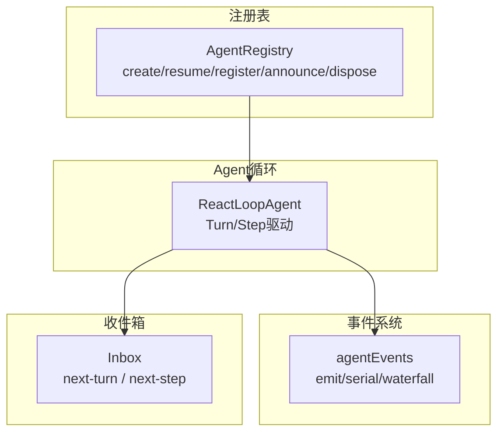
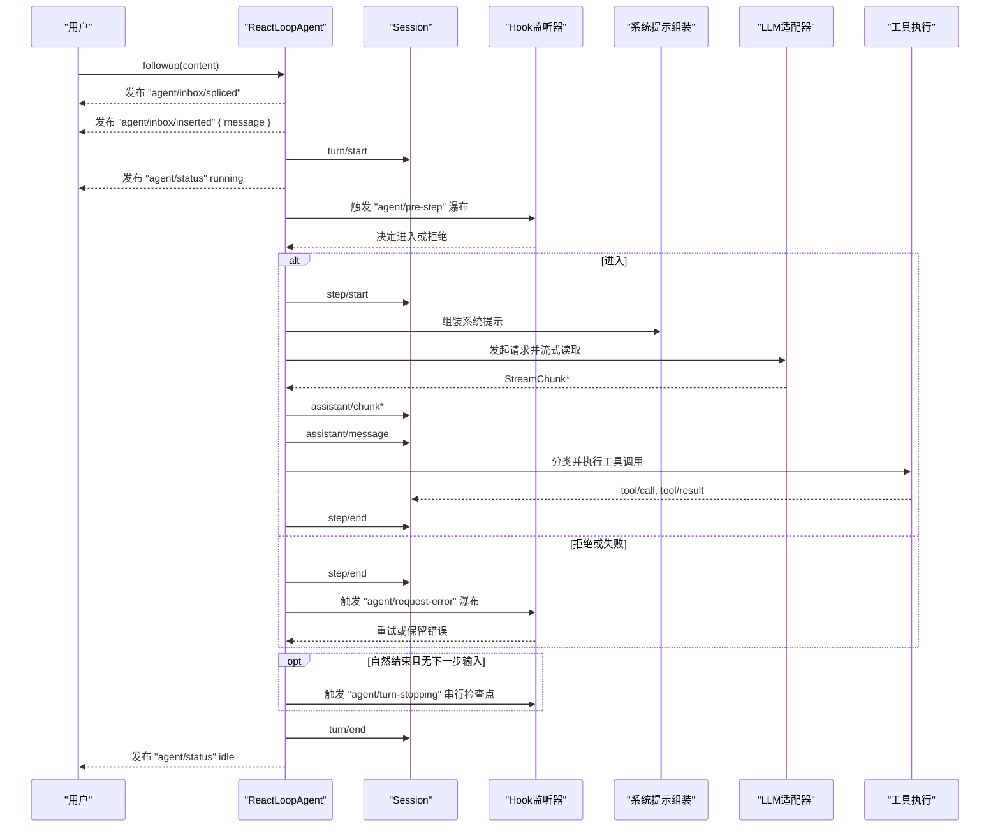
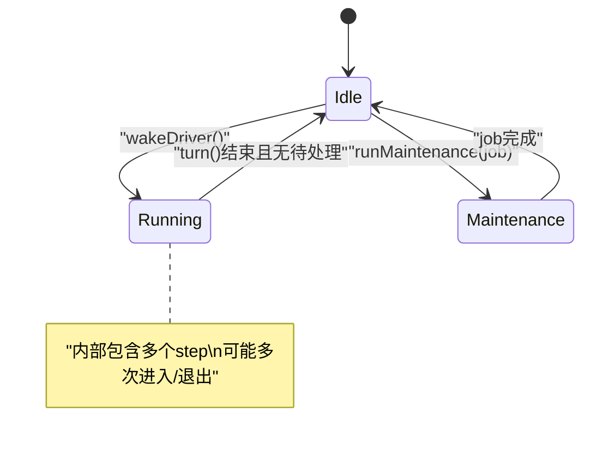
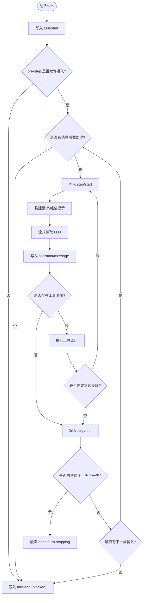
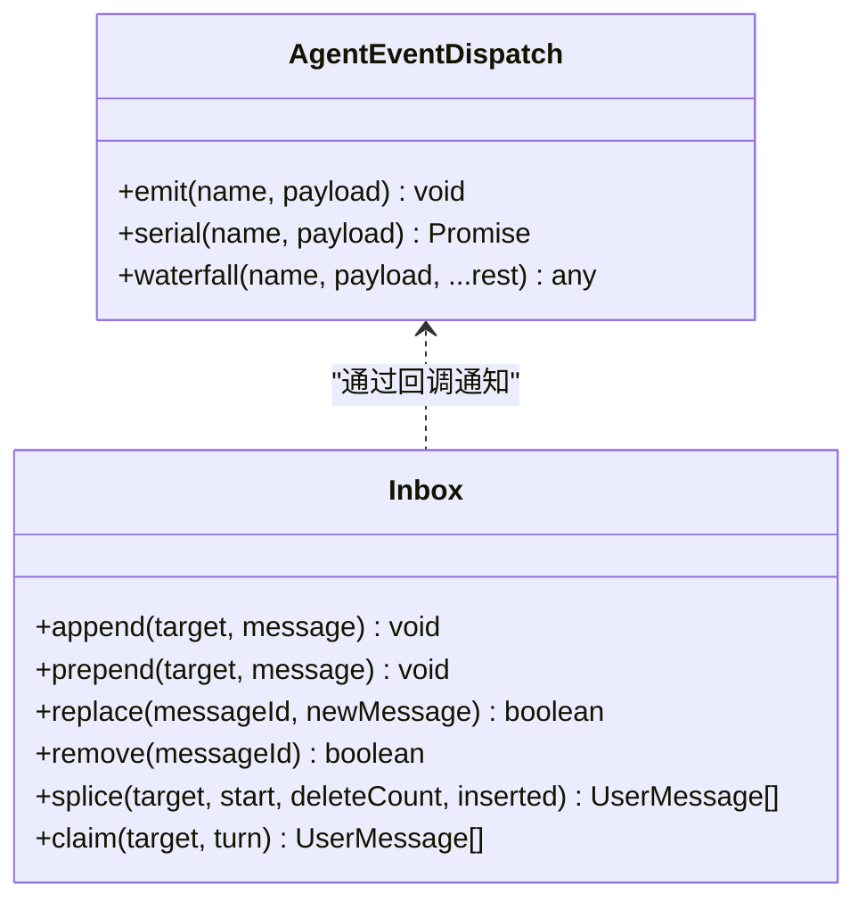
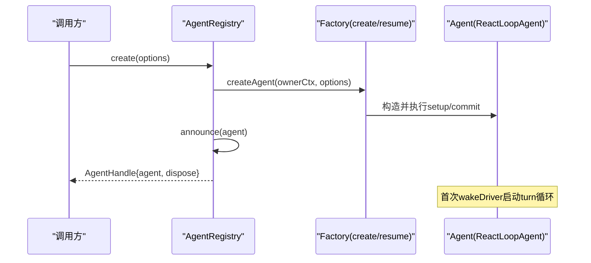
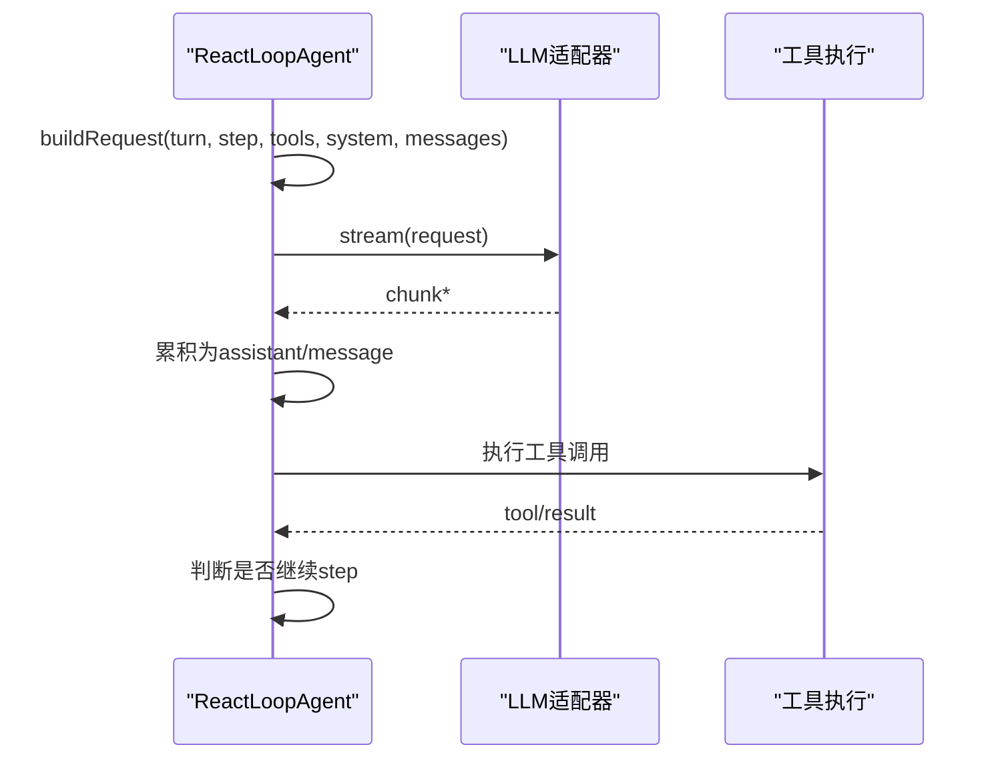
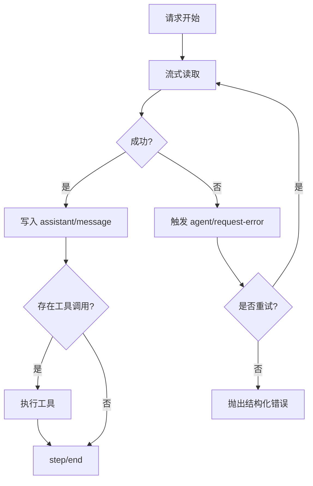
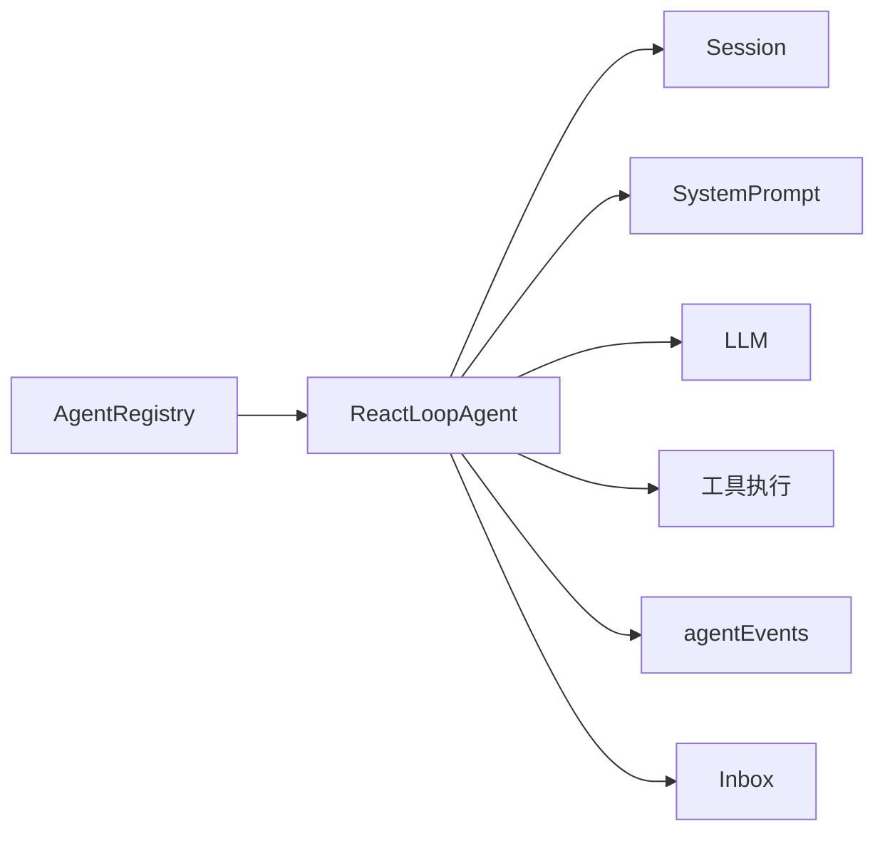

# 智能体生命周期

<cite>
**本文引用的文件**
- [packages/core/agent-loop/src/agent.ts](file://packages/core/agent-loop/src/agent.ts)
- [packages/core/agent/src/index.ts](file://packages/core/agent/src/index.ts)
- [packages/core/agent/src/dispatch.ts](file://packages/core/agent/src/dispatch.ts)
- [packages/core/agent/src/inbox.ts](file://packages/core/agent/src/inbox.ts)
- [docs/agent-lifecycle.md](file://docs/agent-lifecycle.md)
</cite>

## 目录
1. [简介](#简介)
2. [项目结构](#项目结构)
3. [核心组件](#核心组件)
4. [架构总览](#架构总览)
5. [详细组件分析](#详细组件分析)
6. [依赖关系分析](#依赖关系分析)
7. [性能考量](#性能考量)
8. [故障排查指南](#故障排查指南)
9. [结论](#结论)
10. [附录](#附录)

## 简介
本文面向DeepSeek Harness的智能体（Agent）生命周期管理，系统性阐述从创建、初始化、运行到销毁的完整流程；解释Turn与Step的生命周期管理机制，包括请求处理、工具调用与结果返回；说明Agent状态转换（idle → running → completed/aborted/error）；描述事件驱动执行模型（如 agent/inbox、agent/status 等事件的触发时机与处理逻辑）；并给出错误处理与恢复机制（重试策略、故障隔离、优雅降级）。文末提供状态转换图与关键代码路径，帮助开发者理解智能体的执行流程与状态管理。

## 项目结构
围绕智能体生命周期的核心实现分布在以下模块：
- Agent循环驱动：负责Turn/Step边界控制、LLM流式调用、工具执行、状态与事件发布
- 事件分发：为Agent作用域提供emit/serial/waterfall三种分发模式，保证作用域与主体一致
- 收件箱Inbox：持久化投影，维护next-turn与next-step两条待处理队列，支持追加、替换、删除、声明（claim）
- 注册表Registry：负责Agent的创建、恢复、登记、公告与销毁，维护进程内发起者上下文

图示来源
- [packages/core/agent-loop/src/agent.ts:68-118](file://packages/core/agent-loop/src/agent.ts#L68-L118)
- [packages/core/agent/src/dispatch.ts:107-149](file://packages/core/agent/src/dispatch.ts#L107-L149)
- [packages/core/agent/src/inbox.ts:24-78](file://packages/core/agent/src/inbox.ts#L24-L78)
- [packages/core/agent/src/index.ts:396-421](file://packages/core/agent/src/index.ts#L396-L421)

章节来源
- [packages/core/agent-loop/src/agent.ts:68-118](file://packages/core/agent-loop/src/agent.ts#L68-L118)
- [packages/core/agent/src/dispatch.ts:107-149](file://packages/core/agent/src/dispatch.ts#L107-L149)
- [packages/core/agent/src/inbox.ts:24-78](file://packages/core/agent/src/inbox.ts#L24-L78)
- [packages/core/agent/src/index.ts:396-421](file://packages/core/agent/src/index.ts#L396-L421)

## 核心组件
- ReactLoopAgent：实现Agent接口，维护phase（idle/maintenance/running），驱动turn/step循环，封装LLM请求构建、流式输出、工具调用、状态与事件发布
- AgentEventDispatch：绑定Agent作用域的事件分发器，提供非阻断通知（emit）、串行拦截（serial）、可插拔中间件（waterfall）
- Inbox：基于Session事件的可回放投影，维护两条待处理队列（next-turn、next-step），支持持久化的增删改查与声明
- AgentRegistry：Agent工厂与生命周期管理，负责创建、恢复、登记、公告、销毁以及发起者上下文传播

章节来源
- [packages/core/agent-loop/src/agent.ts:68-118](file://packages/core/agent-loop/src/agent.ts#L68-L118)
- [packages/core/agent/src/dispatch.ts:54-82](file://packages/core/agent/src/dispatch.ts#L54-L82)
- [packages/core/agent/src/inbox.ts:24-78](file://packages/core/agent/src/inbox.ts#L24-L78)
- [packages/core/agent/src/index.ts:246-289](file://packages/core/agent/src/index.ts#L246-L289)

## 架构总览
下图展示一次用户followup触发的端到端流程：从消息入队、状态切换、Turn/Step边界、提示组装、LLM流式响应、工具调用到最终完成或继续下一轮。

图示来源
- [docs/agent-lifecycle.md:8-72](file://docs/agent-lifecycle.md#L8-L72)
- [packages/core/agent-loop/src/agent.ts:252-337](file://packages/core/agent-loop/src/agent.ts#L252-L337)
- [packages/core/agent-loop/src/agent.ts:339-435](file://packages/core/agent-loop/src/agent.ts#L339-L435)

章节来源
- [docs/agent-lifecycle.md:8-72](file://docs/agent-lifecycle.md#L8-L72)
- [packages/core/agent-loop/src/agent.ts:252-337](file://packages/core/agent-loop/src/agent.ts#L252-L337)
- [packages/core/agent-loop/src/agent.ts:339-435](file://packages/core/agent-loop/src/agent.ts#L339-L435)

## 详细组件分析

### Agent状态机与生命周期
- 状态定义
  - idle：空闲，等待唤醒或维护任务
  - maintenance：维护任务执行中（不对外暴露为running）
  - running：正在执行Turn/Step循环
- 状态转换
  - idle → running：当有工作被唤醒时，构造AbortController并启动驱动
  - running → idle：Turn/Step循环结束后，若仍有待处理消息则再次唤醒；否则回到idle
  - 维护任务完成后回到idle，并在必要时重新唤醒驱动
- 外部可见状态
  - status属性将maintenance视为idle，仅idle与running对外可见

图示来源
- [packages/core/agent-loop/src/agent.ts:38-47](file://packages/core/agent-loop/src/agent.ts#L38-L47)
- [packages/core/agent-loop/src/agent.ts:106-118](file://packages/core/agent-loop/src/agent.ts#L106-L118)
- [packages/core/agent-loop/src/agent.ts:149-169](file://packages/core/agent-loop/src/agent.ts#L149-L169)
- [packages/core/agent-loop/src/agent.ts:179-200](file://packages/core/agent-loop/src/agent.ts#L179-L200)
- [packages/core/agent-loop/src/agent.ts:217-230](file://packages/core/agent-loop/src/agent.ts#L217-L230)

章节来源
- [packages/core/agent-loop/src/agent.ts:38-47](file://packages/core/agent-loop/src/agent.ts#L38-L47)
- [packages/core/agent-loop/src/agent.ts:106-118](file://packages/core/agent-loop/src/agent.ts#L106-L118)
- [packages/core/agent-loop/src/agent.ts:149-169](file://packages/core/agent-loop/src/agent.ts#L149-L169)
- [packages/core/agent-loop/src/agent.ts:179-200](file://packages/core/agent-loop/src/agent.ts#L179-L200)
- [packages/core/agent-loop/src/agent.ts:217-230](file://packages/core/agent-loop/src/agent.ts#L217-L230)

### Turn与Step生命周期
- Turn边界
  - 打开：写入turn/start
  - 关闭：写入turn/end，reason可为completed/max-tokens/blocked/aborted/error
  - 在turn结束时若存在“自然停止”且无下一步输入，触发agent/turn-stopping串行检查点
- Step边界
  - 打开：写入step/start
  - 关闭：写入step/end
  - 每个step会尝试构建请求、流式获取、生成assistant/message，随后根据是否存在工具调用决定是否继续
- 决策与拦截
  - pre-step水线：可拒绝进入step或改写消息集合
  - request水线：可调整provider/model/配置，用于适配不同路由或默认值
  - request-error水线：对失败进行重试或保留错误

图示来源
- [packages/core/agent-loop/src/agent.ts:252-337](file://packages/core/agent-loop/src/agent.ts#L252-L337)
- [packages/core/agent-loop/src/agent.ts:339-435](file://packages/core/agent-loop/src/agent.ts#L339-L435)

章节来源
- [packages/core/agent-loop/src/agent.ts:252-337](file://packages/core/agent-loop/src/agent.ts#L252-L337)
- [packages/core/agent-loop/src/agent.ts:339-435](file://packages/core/agent-loop/src/agent.ts#L339-L435)

### 事件驱动的执行模型
- 事件类型与作用
  - agent/inbox/spliced：收件箱变更（插入/删除/替换）的持久化记录
  - agent/inbox/inserted：新消息入队通知
  - agent/inbox/claimed：消息被某个turn声明消费的通知
  - agent/status：Agent状态变化（idle/running）
  - agent/pre-step：在进入step前拦截/改写消息
  - agent/request：构建请求前的配置拦截
  - agent/request-error：请求失败时的重试或错误处理
  - agent/turn-stopping：turn即将结束时的串行检查点
- 事件分发模式
  - emit：非阻断通知，异常被捕获并记录
  - serial：串行链，首个返回值作为结果
  - waterfall：中间件模式，包裹默认行为，可改写或短路

图示来源
- [packages/core/agent/src/dispatch.ts:54-82](file://packages/core/agent/src/dispatch.ts#L54-L82)
- [packages/core/agent/src/dispatch.ts:107-149](file://packages/core/agent/src/dispatch.ts#L107-L149)
- [packages/core/agent/src/inbox.ts:80-146](file://packages/core/agent/src/inbox.ts#L80-L146)

章节来源
- [packages/core/agent/src/dispatch.ts:54-82](file://packages/core/agent/src/dispatch.ts#L54-L82)
- [packages/core/agent/src/dispatch.ts:107-149](file://packages/core/agent/src/dispatch.ts#L107-L149)
- [packages/core/agent/src/inbox.ts:80-146](file://packages/core/agent/src/inbox.ts#L80-L146)

### 创建、初始化、运行与销毁
- 创建与恢复
  - create：创建新Agent与Session，执行setup与commit，公告agent/created，启动loop
  - resume：加载持久化Session并恢复Agent，同样执行setup与commit后公告并启动
- 登记与公告
  - register/enter/announce：将已构造的Agent登记到注册表，并发出agent/created
- 销毁
  - dispose：停止循环、等待退出、注销Agent、移除Session、回收作用域
- 发起者上下文
  - withInitiator/withoutInitiator：设置或清除进程内发起者上下文，便于归属与追踪

图示来源
- [packages/core/agent/src/index.ts:396-421](file://packages/core/agent/src/index.ts#L396-L421)
- [packages/core/agent/src/index.ts:441-567](file://packages/core/agent/src/index.ts#L441-L567)
- [packages/core/agent-loop/src/agent.ts:179-200](file://packages/core/agent-loop/src/agent.ts#L179-L200)

章节来源
- [packages/core/agent/src/index.ts:396-421](file://packages/core/agent/src/index.ts#L396-L421)
- [packages/core/agent/src/index.ts:441-567](file://packages/core/agent/src/index.ts#L441-L567)
- [packages/core/agent-loop/src/agent.ts:179-200](file://packages/core/agent-loop/src/agent.ts#L179-L200)

### 请求处理、工具调用与结果返回
- 请求构建
  - 基于session.deriveMessages()与systemPrompt组装，结合request水线调整provider/model/配置
  - 使用prepareCall绑定具体适配器，记录header与context变更
- 流式响应
  - 逐块写入assistant/chunk，最终合并为assistant/message，记录usage与sourceEventSeqs
- 工具调用
  - 若assistant/message包含tool-call，则进入工具执行阶段，按顺序pre、并发执行、有序post，写入tool/call与tool/result
  - 工具可注入上下文到next-step，形成多步交互

图示来源
- [packages/core/agent-loop/src/agent.ts:339-435](file://packages/core/agent-loop/src/agent.ts#L339-L435)
- [packages/core/agent-loop/src/agent.ts:442-541](file://packages/core/agent-loop/src/agent.ts#L442-L541)

章节来源
- [packages/core/agent-loop/src/agent.ts:339-435](file://packages/core/agent-loop/src/agent.ts#L339-L435)
- [packages/core/agent-loop/src/agent.ts:442-541](file://packages/core/agent-loop/src/agent.ts#L442-L541)

### 错误处理与恢复机制
- 请求失败
  - 触发agent/request-error水线，支持重试策略；若不重试则抛出结构化错误
- 中断与部分完成
  - 流式读取被中止时，仍会写入已累积的assistant/message（标记interrupted）
- 终止与清理
  - cancel支持清空收件箱与中止活动；finally确保turn/end写入
- 故障隔离
  - 每个listener异常被捕获并记录，避免阻塞后续观察者
  - 注册表在announce/dispose过程中保证成对事件与幂等性

图示来源
- [packages/core/agent-loop/src/agent.ts:361-406](file://packages/core/agent-loop/src/agent.ts#L361-L406)
- [packages/core/agent-loop/src/agent.ts:408-435](file://packages/core/agent-loop/src/agent.ts#L408-L435)
- [packages/core/agent/src/dispatch.ts:120-147](file://packages/core/agent/src/dispatch.ts#L120-L147)

章节来源
- [packages/core/agent-loop/src/agent.ts:361-406](file://packages/core/agent-loop/src/agent.ts#L361-L406)
- [packages/core/agent-loop/src/agent.ts:408-435](file://packages/core/agent-loop/src/agent.ts#L408-L435)
- [packages/core/agent/src/dispatch.ts:120-147](file://packages/core/agent/src/dispatch.ts#L120-L147)

## 依赖关系分析
- ReactLoopAgent依赖
  - Session：写入turn/step边界、消息、chunk、工具事件、请求头/上下文
  - SystemPrompt：组装系统提示
  - LLM：准备与流式调用
  - 工具执行：executeToolCalls
  - 事件分发：agentEvents
  - 收件箱：Inbox
- AgentRegistry依赖
  - Cordis服务与事件系统
  - 类型注册与上下文访问器
  - 发起者上下文传播

图示来源
- [packages/core/agent-loop/src/agent.ts:68-104](file://packages/core/agent-loop/src/agent.ts#L68-L104)
- [packages/core/agent/src/index.ts:246-289](file://packages/core/agent/src/index.ts#L246-L289)

章节来源
- [packages/core/agent-loop/src/agent.ts:68-104](file://packages/core/agent-loop/src/agent.ts#L68-L104)
- [packages/core/agent/src/index.ts:246-289](file://packages/core/agent/src/index.ts#L246-L289)

## 性能考量
- 热路径零分配：事件分发器在构造函数中构建一次并复用，避免频繁分配
- 流式处理：逐块写入assistant/chunk，减少内存峰值并提升实时性
- 工具并行：工具执行采用有序pre、并发执行、有序post，兼顾吞吐与顺序一致性
- 状态最小化：phase仅维护必要字段，status计算简单，降低开销
- 持久化优先：收件箱变更以事件形式持久化，支持回放与恢复

[本节为通用指导，无需特定文件引用]

## 故障排查指南
- 常见问题定位
  - 未注册工厂：create/resume前需注册AgentFactory
  - 重复注册：同一id的Agent不可重复登记
  - 无provider/model：request水线必须提供有效的provider与model
  - 收件箱冲突：消息id重复会导致验证失败
- 调试建议
  - 订阅agent/status观察状态切换
  - 订阅agent/inbox/*观察消息入队与声明
  - 使用agent/pre-step与agent/request拦截确认上下文与配置
  - 使用agent/request-error处理重试与降级
- 恢复策略
  - 利用session/event回放重建状态
  - 在agent/turn-stopping进行收尾检查点
  - 通过cancel清理收件箱并中止活动

章节来源
- [packages/core/agent/src/index.ts:396-421](file://packages/core/agent/src/index.ts#L396-L421)
- [packages/core/agent/src/index.ts:441-567](file://packages/core/agent/src/index.ts#L441-L567)
- [packages/core/agent/src/inbox.ts:202-219](file://packages/core/agent/src/inbox.ts#L202-L219)
- [packages/core/agent-loop/src/agent.ts:252-337](file://packages/core/agent-loop/src/agent.ts#L252-L337)

## 结论
DeepSeek Harness通过ReactLoopAgent实现了严谨的Turn/Step边界控制与事件驱动执行模型；借助AgentEventDispatch与Inbox，系统在保持高性能的同时提供了强大的可观测性与可恢复性；AgentRegistry确保了Agent的创建、恢复与销毁过程的一致性与安全性。开发者可通过事件水线与工具执行机制灵活扩展智能体行为，并通过错误处理与恢复策略保障系统的健壮性。

[本节为总结，无需特定文件引用]

## 附录
- 关键代码路径参考
  - Turn/Step驱动与状态管理：[packages/core/agent-loop/src/agent.ts:252-337](file://packages/core/agent-loop/src/agent.ts#L252-L337)
  - 请求构建与流式处理：[packages/core/agent-loop/src/agent.ts:339-435](file://packages/core/agent-loop/src/agent.ts#L339-L435)
  - 事件分发器实现：[packages/core/agent/src/dispatch.ts:107-149](file://packages/core/agent/src/dispatch.ts#L107-L149)
  - 收件箱投影与持久化：[packages/core/agent/src/inbox.ts:24-78](file://packages/core/agent/src/inbox.ts#L24-L78)
  - Agent注册与生命周期：[packages/core/agent/src/index.ts:396-421](file://packages/core/agent/src/index.ts#L396-L421)
  - 端到端流程图参考：[docs/agent-lifecycle.md:8-72](file://docs/agent-lifecycle.md#L8-L72)