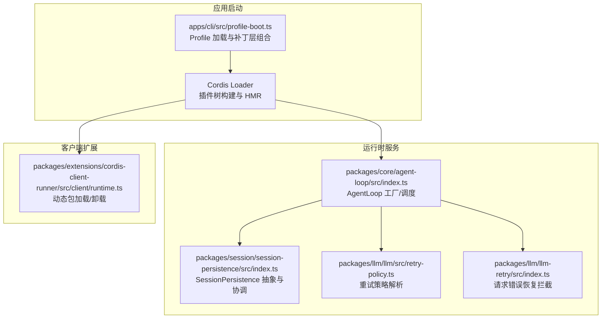
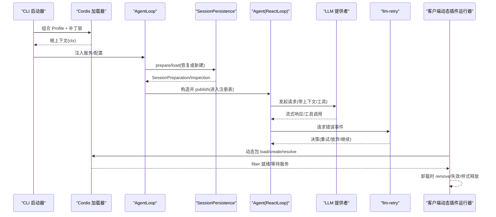
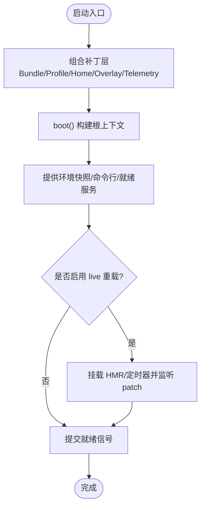
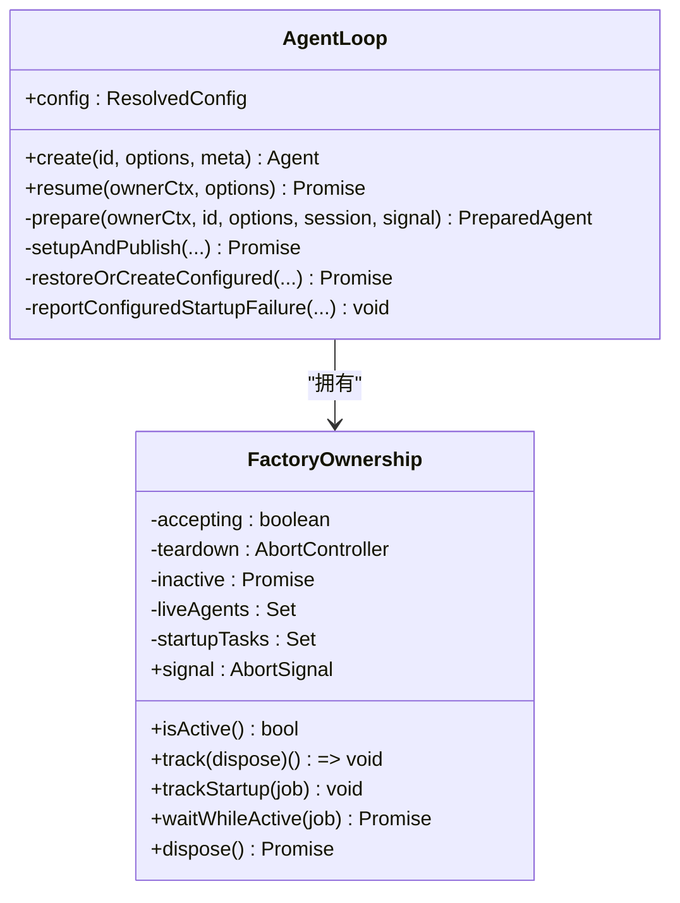
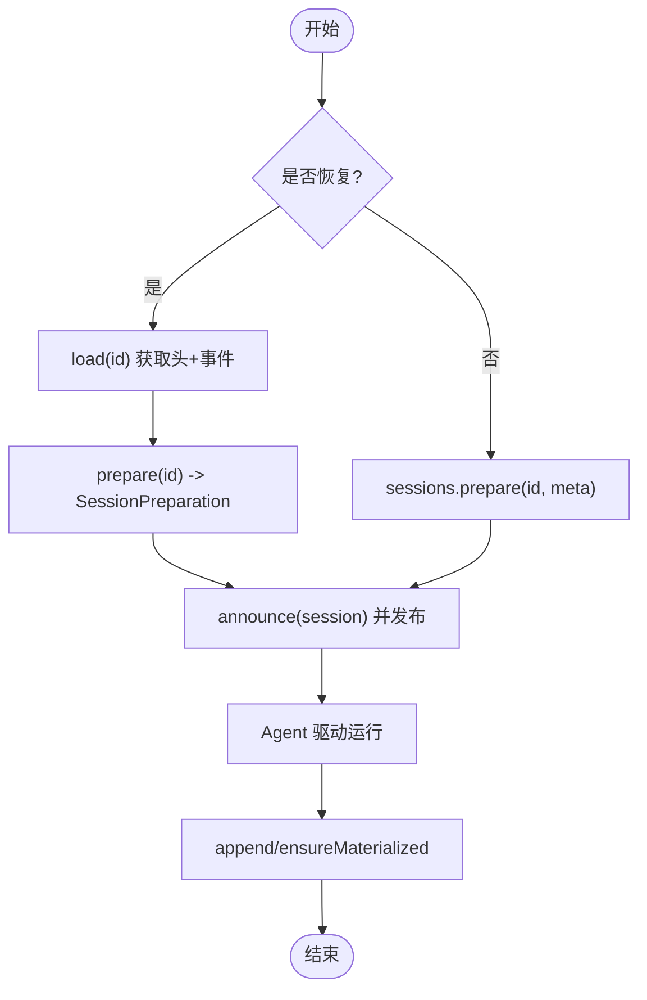
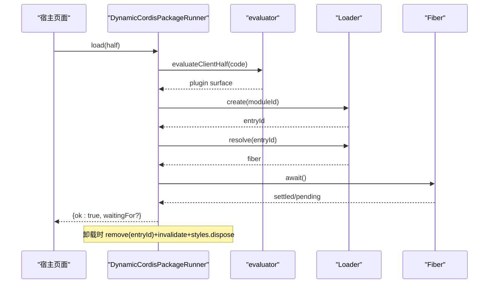
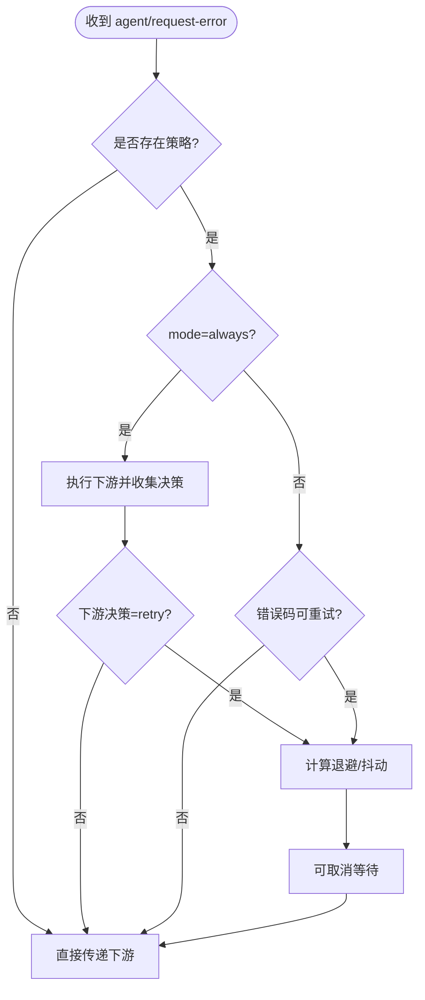
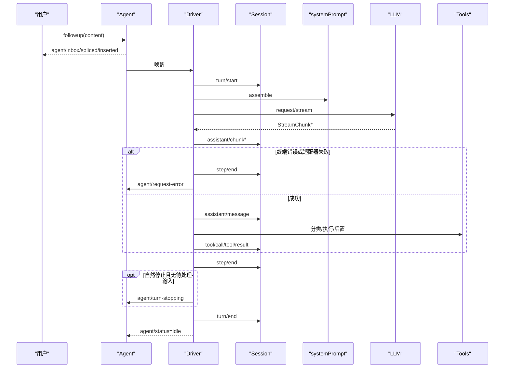
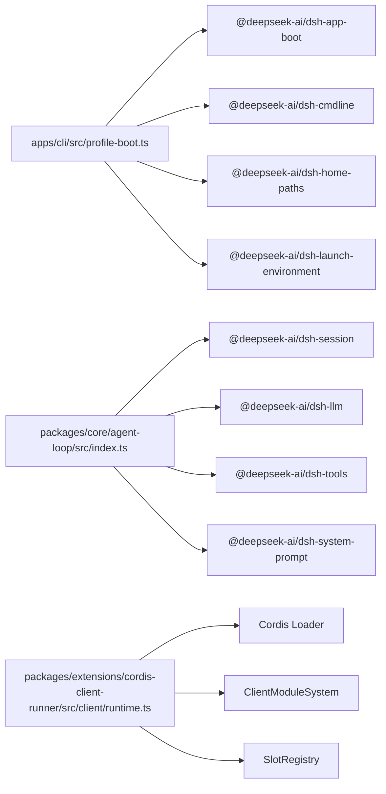
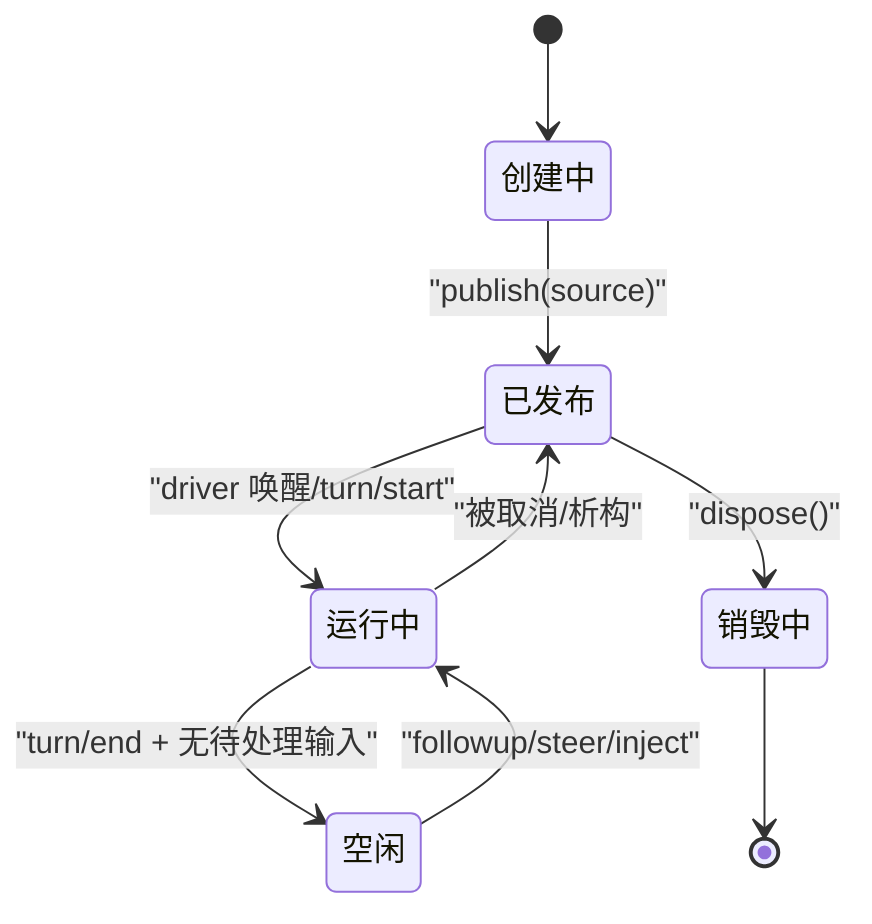

# 生命周期管理

<cite>
**本文引用的文件**
- [profile-boot.ts](file://apps/cli/src/profile-boot.ts)
- [index.ts（agent-loop）](file://packages/core/agent-loop/src/index.ts)
- [index.ts（session-persistence）](file://packages/session/session-persistence/src/index.ts)
- [retry-policy.ts](file://packages/llm/llm/src/retry-policy.ts)
- [index.ts（llm-retry）](file://packages/llm/llm-retry/src/index.ts)
- [runtime.ts（cordis-client-runner）](file://packages/extensions/cordis-client-runner/src/client/runtime.ts)
- [agent-lifecycle.md](file://docs/agent-lifecycle.md)
- [inherited.md](file://docs/cordis-api/inherited.md)
- [persistence.zh.md](file://docs/subsystems/persistence.zh.md)
</cite>

## 目录
1. [简介](#简介)
2. [项目结构](#项目结构)
3. [核心组件](#核心组件)
4. [架构总览](#架构总览)
5. [详细组件分析](#详细组件分析)
6. [依赖关系分析](#依赖关系分析)
7. [性能考虑](#性能考虑)
8. [故障排查指南](#故障排查指南)
9. [结论](#结论)
10. [附录](#附录)

## 简介
本文件面向 DeepSeek Harness 的生命周期管理系统，系统性阐述智能体（Agent）从创建、初始化、运行到销毁的完整生命周期；说明 Agent 接口与默认驱动的工作机制；解释应用启动流程（Profile 加载、Bundle 组装、插件树构建）；描述会话（Session）的生命周期管理（创建、状态持久化与恢复）；阐述插件生命周期（动态加载、热重载、资源清理）；并给出错误处理与恢复策略（重试、故障隔离、优雅降级）。文末提供状态图与关键节点流程图，帮助开发者理解与管理各组件的生命周期。

## 项目结构
DeepSeek Harness 围绕 Cordis 插件框架组织，CLI 负责 Profile 与 Bundle 的装配与启动，Agent Loop 负责 Agent/Session 的编排，Session Persistence 负责事件溯源与恢复，LLM Retry 提供请求级重试策略，客户端 Runner 负责浏览器端动态插件的动态加载与卸载。

图表来源
- [profile-boot.ts:156-308](file://apps/cli/src/profile-boot.ts#L156-L308)
- [index.ts（agent-loop）:296-383](file://packages/core/agent-loop/src/index.ts#L296-L383)
- [index.ts（session-persistence）:105-283](file://packages/session/session-persistence/src/index.ts#L105-L283)
- [retry-policy.ts:149-160](file://packages/llm/llm/src/retry-policy.ts#L149-L160)
- [index.ts（llm-retry）:99-179](file://packages/llm/llm-retry/src/index.ts#L99-L179)
- [runtime.ts（cordis-client-runner）:177-458](file://packages/extensions/cordis-client-runner/src/client/runtime.ts#L177-L458)

章节来源
- [profile-boot.ts:156-308](file://apps/cli/src/profile-boot.ts#L156-L308)

## 核心组件
- 应用启动器（Profile Boot）：负责加载 Profile、组合补丁层（Bundle 层、Profile 自身 patch、用户 home 层、命令行覆盖层）、安装失败即停与进程退出钩子、可选 HMR 监听与就绪信号。
- Agent Loop：实现 Agent 工厂，负责配置驱动的 Agent 创建/恢复、会话准备与发布、并发工具调用上限、启动失败上报、工厂级析构与等待。
- Session Persistence：定义事件溯源后端抽象，提供 prepare/load/inspect/borrow/readFrom/list/listSnapshots 等能力，协调冷启动恢复与活会话互斥。
- LLM 重试策略与恢复：解析 provider 重试策略，拦截 agent/request-error 事件，支持 always/normal 模式、退避与抖动、可取消延迟。
- 客户端动态插件运行器：在浏览器侧对动态包进行求值、注册、挂载、卸载，维护槽位注册与渲染崩溃上报，保证加载串行与资源释放。

章节来源
- [profile-boot.ts:156-308](file://apps/cli/src/profile-boot.ts#L156-L308)
- [index.ts（agent-loop）:296-383](file://packages/core/agent-loop/src/index.ts#L296-L383)
- [index.ts（session-persistence）:105-283](file://packages/session/session-persistence/src/index.ts#L105-L283)
- [retry-policy.ts:149-160](file://packages/llm/llm/src/retry-policy.ts#L149-L160)
- [index.ts（llm-retry）:99-179](file://packages/llm/llm-retry/src/index.ts#L99-L179)
- [runtime.ts（cordis-client-runner）:177-458](file://packages/extensions/cordis-client-runner/src/client/runtime.ts#L177-L458)

## 架构总览
下图展示了从 CLI 启动到 Agent 运行、会话持久化、LLM 重试以及客户端动态插件的全链路交互。

图表来源
- [profile-boot.ts:209-308](file://apps/cli/src/profile-boot.ts#L209-L308)
- [index.ts（agent-loop）:356-383](file://packages/core/agent-loop/src/index.ts#L356-L383)
- [index.ts（session-persistence）:186-214](file://packages/session/session-persistence/src/index.ts#L186-L214)
- [index.ts（llm-retry）:156-179](file://packages/llm/llm-retry/src/index.ts#L156-L179)
- [runtime.ts（cordis-client-runner）:288-400](file://packages/extensions/cordis-client-runner/src/client/runtime.ts#L288-L400)

## 详细组件分析

### 应用启动：Profile 加载、Bundle 组装与插件树构建
- Profile 组合顺序：Bundle 层 → Profile 自身 patch → 用户 home 层 → 命令行覆盖层 → 遥测开关。
- 写入空根配置以支撑 Loader include 锚点，避免重复插入。
- 安装 fail-loud 与进程信号处理（SIGTERM/SIGINT），确保启动期异常快速暴露。
- 若启用 live 补丁重载，按需挂载 HMR 与定时器，并监听用户 patch 变更触发重组合。
- 通过 AppReady 服务在启动完成后通知上层。

图表来源
- [profile-boot.ts:156-173](file://apps/cli/src/profile-boot.ts#L156-L173)
- [profile-boot.ts:209-308](file://apps/cli/src/profile-boot.ts#L209-L308)

章节来源
- [profile-boot.ts:156-308](file://apps/cli/src/profile-boot.ts#L156-L308)

### Agent 生命周期：创建、初始化、运行与销毁
- 工厂所有权：FactoryOwnership 统一管理 teardown 信号、活跃 Agent 集合与启动任务，确保在工厂销毁时所有工作收敛。
- 配置驱动 Agent：启动时根据配置决定是否恢复已有会话或新建会话；若存在冲突身份则拒绝。
- 会话准备与发布：使用 SessionPreparation 创建未发布的 Session，随后进入注册表并广播 session-start。
- 取消与析构：prepare 阶段融合 caller 取消、owner fiber 卸载与工厂 teardown；dispose 会停止机器、离开注册表、释放作用域。
- 启动失败上报：当配置驱动的 restore/resume 失败时，发出 agent-loop/config-start-failed 事件供身份绑定消费者处理。

图表来源
- [index.ts（agent-loop）:39-90](file://packages/core/agent-loop/src/index.ts#L39-L90)
- [index.ts（agent-loop）:296-383](file://packages/core/agent-loop/src/index.ts#L296-L383)
- [index.ts（agent-loop）:460-579](file://packages/core/agent-loop/src/index.ts#L460-L579)
- [index.ts（agent-loop）:625-711](file://packages/core/agent-loop/src/index.ts#L625-L711)

章节来源
- [index.ts（agent-loop）:39-90](file://packages/core/agent-loop/src/index.ts#L39-L90)
- [index.ts（agent-loop）:296-383](file://packages/core/agent-loop/src/index.ts#L296-L383)
- [index.ts（agent-loop）:460-579](file://packages/core/agent-loop/src/index.ts#L460-L579)
- [index.ts（agent-loop）:625-711](file://packages/core/agent-loop/src/index.ts#L625-L711)

### 会话生命周期：创建、持久化与恢复
- 会话准备：SessionPreparation.create 接收普通创建选项或通过 RestoredSessionOptions 转移所有权；prepare 后持有未发布 Session 直至发布或回滚。
- 冷启动恢复：SessionPersistence.prepare 先 load 再 create SessionPreparation；load 需平衡中断尾记录，必要时合成关闭事件。
- 冷/活互斥：borrowSession 返回 prepared/live 两种源，确保同一 identity 不被并发占用；已存在的活会话将拒绝重复准备。
- 列表与快照：list/listSnapshots 提供轻量元数据与不可变 revision，便于外部观察者增量感知。

图表来源
- [index.ts（session-persistence）:186-214](file://packages/session/session-persistence/src/index.ts#L186-L214)
- [persistence.zh.md:143-175](file://docs/subsystems/persistence.zh.md#L143-L175)

章节来源
- [index.ts（session-persistence）:186-214](file://packages/session/session-persistence/src/index.ts#L186-L214)
- [persistence.zh.md:143-175](file://docs/subsystems/persistence.zh.md#L143-L175)

### 插件生命周期：动态加载、热重载与资源清理
- 动态包加载：evaluateClientHalf → guardedSurface → loader.create → resolve.await；等待声明的服务满足后才视为成功（可能 parked）。
- 加载串行：按 pluginId 队列化，避免并行导致的状态竞争。
- 卸载清理：loader.remove(entryId) 级联释放 fiber/slot/facade effects；invalidate 模块表使后续重新加载合法；释放样式标签。
- 渲染崩溃上报：slot entry 崩溃通过监督通道上报至宿主，包含 slot、消息与是否退役标记。

图表来源
- [runtime.ts（cordis-client-runner）:288-400](file://packages/extensions/cordis-client-runner/src/client/runtime.ts#L288-L400)
- [runtime.ts（cordis-client-runner）:439-458](file://packages/extensions/cordis-client-runner/src/client/runtime.ts#L439-L458)

章节来源
- [runtime.ts（cordis-client-runner）:288-400](file://packages/extensions/cordis-client-runner/src/client/runtime.ts#L288-L400)
- [runtime.ts（cordis-client-runner）:439-458](file://packages/extensions/cordis-client-runner/src/client/runtime.ts#L439-L458)

### 错误处理与恢复：重试、隔离与降级
- 重试策略解析：provider 可配置 normal/always 模式、最大重试次数、可重试错误码、退避初始/最大延迟与抖动比例；参数校验严格且结果冻结为不可变对象。
- 请求错误拦截：llm-retry 订阅 agent/request-error，结合策略与信号决定重试或放弃；支持“始终”模式先执行下游再决策，避免阻塞主循环。
- 可取消延迟：cancellableDelay 基于 AbortSignal 实现可取消的等待，防止长时间阻塞。
- 故障隔离：工厂级 ownership.signal 与 owner effect 在卸载/中止时统一终止长任务；Agent 析构路径确保注册表与 scope 安全释放。
- 优雅降级：当遥测行不存在时跳过禁用补丁；HMR 仅在需要时挂载；配置驱动启动失败通过事件上报而不阻断整体启动。

图表来源
- [retry-policy.ts:149-160](file://packages/llm/llm/src/retry-policy.ts#L149-L160)
- [index.ts（llm-retry）:99-179](file://packages/llm/llm-retry/src/index.ts#L99-L179)

章节来源
- [retry-policy.ts:149-160](file://packages/llm/llm/src/retry-policy.ts#L149-L160)
- [index.ts（llm-retry）:99-179](file://packages/llm/llm-retry/src/index.ts#L99-L179)

### 智能体轮次与步骤：事件与状态流转
- 典型流程：followup → driver 唤醒 → turn/start → pre-step 瀑布 → systemPrompt 组装 → llm/stream → assistant/chunk → tool 调用 → step/end → turn/end → idle。
- 关键事件：agent/status、agent/inbox/*、turn/start|end、step/start|end、assistant/chunk、tool/call|result、agent/request-error、agent/turn-stopping。
- 恢复边界：失败步骤关闭后可恢复；若压缩/摘要推进了替换生成，则开启新重试轮次，否则保留原始请求错误。

图表来源
- [agent-lifecycle.md:8-83](file://docs/agent-lifecycle.md#L8-L83)

章节来源
- [agent-lifecycle.md:8-83](file://docs/agent-lifecycle.md#L8-L83)

## 依赖关系分析
- 启动依赖：CLI 依赖 @deepseek-ai/dsh-app-boot 提供的 boot/composeEntries/watchUserPatches 等能力；通过 provideCmdline 注入命令行与退出控制。
- 运行时依赖：AgentLoop 依赖 agents/sessions/llm/tools/systemPrompt 等服务；SessionPersistence 依赖 sessions 服务用于 prepare。
- 客户端依赖：DynamicCordisPackageRunner 依赖 Loader、ClientModuleSystem、SlotRegistry 与宿主通信能力。
- 事件继承：Cordis 内部事件（internal/plugin/status/service/update/get/set/listener/dispatch）与 HMR/loader 事件贯穿生命周期。

图表来源
- [profile-boot.ts:14-35](file://apps/cli/src/profile-boot.ts#L14-L35)
- [index.ts（agent-loop）:8-29](file://packages/core/agent-loop/src/index.ts#L8-L29)
- [runtime.ts（cordis-client-runner）:17-28](file://packages/extensions/cordis-client-runner/src/client/runtime.ts#L17-L28)

章节来源
- [profile-boot.ts:14-35](file://apps/cli/src/profile-boot.ts#L14-L35)
- [index.ts（agent-loop）:8-29](file://packages/core/agent-loop/src/index.ts#L8-L29)
- [runtime.ts（cordis-client-runner）:17-28](file://packages/extensions/cordis-client-runner/src/client/runtime.ts#L17-L28)

## 性能考虑
- 工具调用并发上限：通过设置 maxParallelToolCalls 限制每步并发，避免过载；该值可在运行时通过 settings 更新，影响下一组调度。
- 冷启动优化：SessionPersistence.load 仅返回平衡的尾部日志，必要时合成关闭事件，减少不必要重建；revision 机制避免重复加载。
- 重试退避：backoff.initialDelayMs/maxDelayMs/jitterRatio 合理配置可降低雪崩风险；always 模式需谨慎使用以避免放大负载。
- 动态插件加载：按 package 串行化避免竞争；仅在需要时挂载 HMR；卸载时及时 invalidate 模块表与释放样式，降低内存占用。

[本节为通用指导，不直接分析具体文件]

## 故障排查指南
- 配置驱动启动失败：关注 agent-loop/config-start-failed 事件，定位 sessionId 与错误原因；检查 persistence 可用性与会话是否存在。
- 会话恢复冲突：若出现“已存在相同身份”的错误，确认是否有其他 fiber 仍持有该会话；等待其完全释放后再尝试。
- 动态插件崩溃：查看 render failures 与 host 上报信息，定位 slot 与错误消息；必要时卸载并重载对应包。
- 重试风暴：检查 provider 的重试策略与错误码；适当增大 backoff.maxDelayMs 与 jitterRatio，或降低 maxRetries。

章节来源
- [index.ts（agent-loop）:385-405](file://packages/core/agent-loop/src/index.ts#L385-L405)
- [index.ts（session-persistence）:186-214](file://packages/session/session-persistence/src/index.ts#L186-L214)
- [runtime.ts（cordis-client-runner）:217-234](file://packages/extensions/cordis-client-runner/src/client/runtime.ts#L217-L234)
- [index.ts（llm-retry）:156-179](file://packages/llm/llm-retry/src/index.ts#L156-L179)

## 结论
DeepSeek Harness 的生命周期管理以 Cordis 插件体系为基础，通过 CLI 的 Profile/Bundle 组合与 Loader 的插件树构建，形成可扩展的运行时。AgentLoop 作为核心编排者，配合 SessionPersistence 的事件溯源与恢复机制，确保会话的强一致性与可恢复性。LLM 重试策略与客户端动态插件运行器分别保障了请求级鲁棒性与前端扩展的灵活性。遵循本文所述的生命周期与错误处理策略，可有效提升系统的稳定性与可维护性。

[本节为总结性内容，不直接分析具体文件]

## 附录
- 关键状态图（Agent 生命周期）

[本节为概念性图示，不映射具体源码文件]