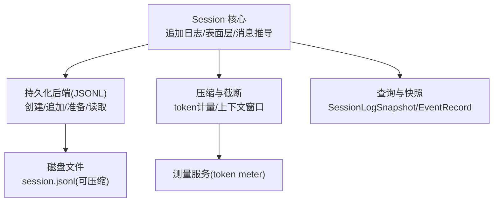
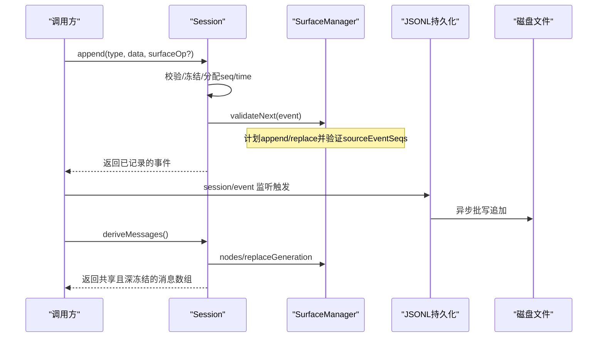
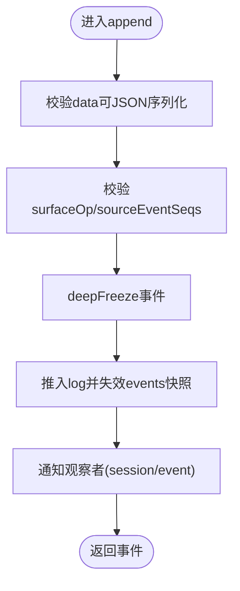
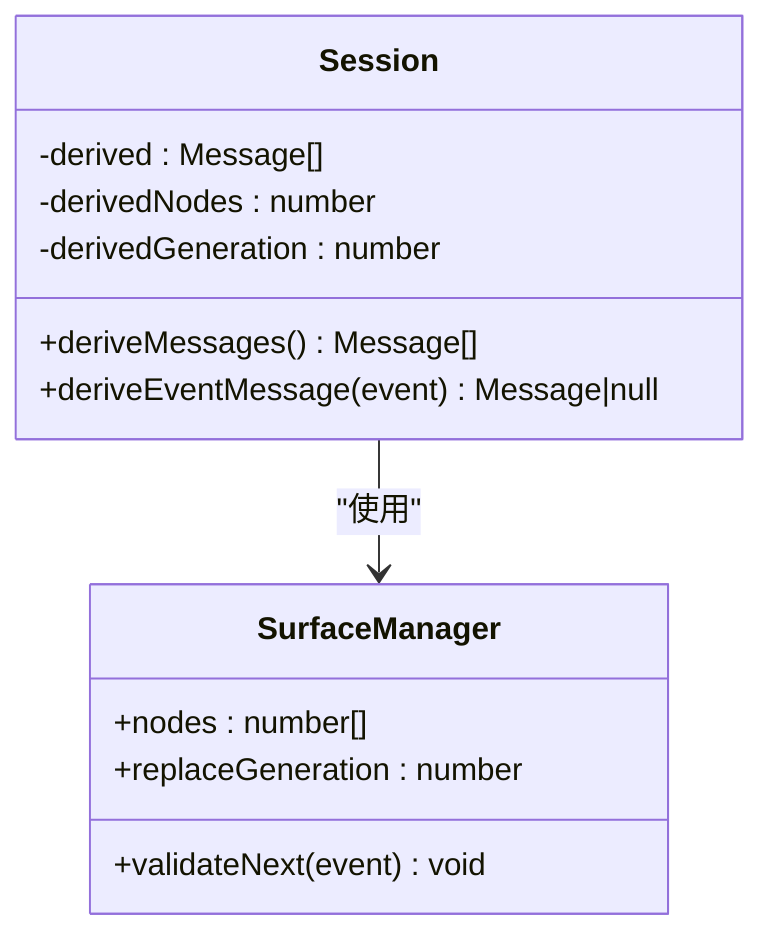
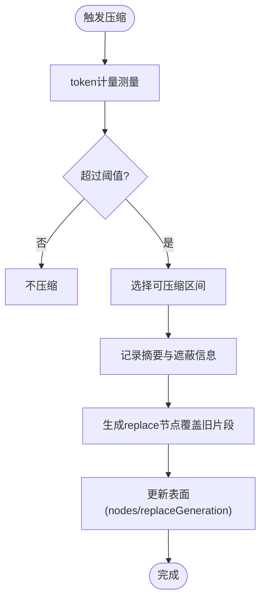
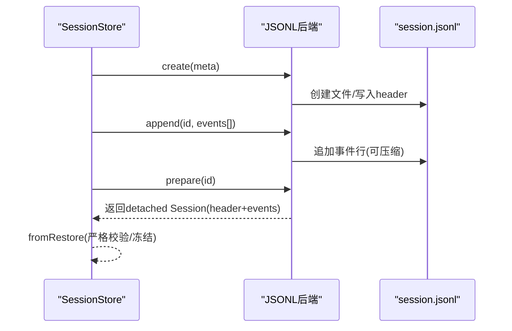
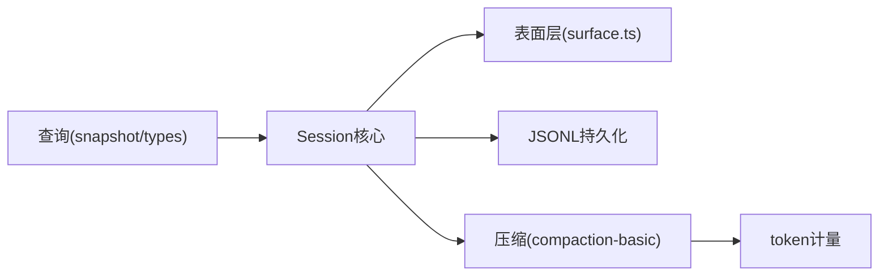

# Session日志系统

<cite>
**本文引用的文件**
- [packages/core/session/src/index.ts](file://packages/core/session/src/index.ts)
- [packages/core/session/src/surface.ts](file://packages/core/session/src/surface.ts)
- [packages/core/session/src/types.ts](file://packages/core/session/src/types.ts)
- [packages/session/session-persistence-jsonl/src/index.ts](file://packages/session/session-persistence-jsonl/src/index.ts)
- [packages/session/session-persistence-jsonl/src/format.ts](file://packages/session/session-persistence-jsonl/src/format.ts)
- [packages/compaction/compaction-basic/src/index.ts](file://packages/compaction/compaction-basic/src/index.ts)
- [packages/llm/token-meter/tests/context-breakdown-projection.spec.ts](file://packages/llm/token-meter/tests/context-breakdown-projection.spec.ts)
- [packages/session-query/session-query/src/types.ts](file://packages/session-query/session-query/src/types.ts)
</cite>

## 目录
1. [简介](#简介)
2. [项目结构](#项目结构)
3. [核心组件](#核心组件)
4. [架构总览](#架构总览)
5. [详细组件分析](#详细组件分析)
6. [依赖关系分析](#依赖关系分析)
7. [性能考量](#性能考量)
8. [故障排查指南](#故障排查指南)
9. [结论](#结论)
10. [附录：使用示例与查询模式](#附录使用示例与查询模式)

## 简介
本文件为 DeepSeek Harness 的 Session 日志系统提供系统化文档，围绕“追加式事件日志 + 不可变数据 + 事件溯源”的设计展开，重点解释 deriveMessages() 如何从原始事件流生成模型可见的历史记录，并说明日志压缩、截断策略（上下文窗口管理）、Session 持久化机制（内存缓存、磁盘存储、恢复加载），以及日志格式规范、数据模型、监控调试能力与查询分析方法。

## 项目结构
Session 日志系统由以下关键模块组成：
- 会话与事件核心：定义事件类型、表面层（surface）投影规则、追加写入与消息推导。
- 持久化后端：JSONL 追加式文件存储，负责创建、追加、准备、读取等。
- 压缩与截断：基于 token 计量与上下文窗口的自动压缩策略。
- 查询与快照：对完整原始日志的校验与轻量元数据视图。

图表来源
- [packages/core/session/src/index.ts:423-755](file://packages/core/session/src/index.ts#L423-L755)
- [packages/core/session/src/surface.ts:1-114](file://packages/core/session/src/surface.ts#L1-L114)
- [packages/session/session-persistence-jsonl/src/index.ts:1-180](file://packages/session/session-persistence-jsonl/src/index.ts#L1-L180)
- [packages/compaction/compaction-basic/src/index.ts:278-304](file://packages/compaction/compaction-basic/src/index.ts#L278-L304)
- [packages/session-query/session-query/src/types.ts:43-71](file://packages/session-query/session-query/src/types.ts#L43-L71)

章节来源
- [packages/core/session/src/index.ts:423-755](file://packages/core/session/src/index.ts#L423-L755)
- [packages/core/session/src/surface.ts:1-114](file://packages/core/session/src/surface.ts#L1-L114)
- [packages/session/session-persistence-jsonl/src/index.ts:1-180](file://packages/session/session-persistence-jsonl/src/index.ts#L1-L180)
- [packages/compaction/compaction-basic/src/index.ts:278-304](file://packages/compaction/compaction-basic/src/index.ts#L278-L304)
- [packages/session-query/session-query/src/types.ts:43-71](file://packages/session-query/session-query/src/types.ts#L43-L71)

## 核心组件
- 事件与表面层
  - 事件类型与表面操作：仅 user/message、assistant/message、tool/result 可进入有序表面；append 或 replace 两种插入方式。
  - 表面折叠：将事件序列转换为模型可见的节点序列，支持替换范围以支撑压缩。
- 会话对象
  - 追加写入：严格校验 JSON 可序列化、表面元数据、源事件引用，冻结数据后入队。
  - 消息推导：基于表面节点顺序，按投影规则生成 Message[]，带增量缓存。
- 持久化
  - JSONL 后端：每会话一个追加文件，支持压缩与批写延迟；提供 create/append/prepare/readRaw 等能力。
- 压缩与截断
  - 基于 token 计量与上下文窗口阈值选择可压缩区间，生成 replace 节点覆盖旧片段。
- 查询与快照
  - 提供 SessionLogSnapshot 与 SessionEventRecord，用于离线分析与审计。

章节来源
- [packages/core/session/src/types.ts:221-418](file://packages/core/session/src/types.ts#L221-L418)
- [packages/core/session/src/surface.ts:14-114](file://packages/core/session/src/surface.ts#L14-L114)
- [packages/core/session/src/index.ts:548-755](file://packages/core/session/src/index.ts#L548-L755)
- [packages/session/session-persistence-jsonl/src/index.ts:126-180](file://packages/session/session-persistence-jsonl/src/index.ts#L126-L180)
- [packages/compaction/compaction-basic/src/index.ts:278-304](file://packages/compaction/compaction-basic/src/index.ts#L278-L304)
- [packages/session-query/session-query/src/types.ts:43-71](file://packages/session-query/session-query/src/types.ts#L43-L71)

## 架构总览
Session 日志系统采用“追加式事件日志 + 表面层投影 + 持久化插件 + 压缩策略”的分层架构。事件是唯一的真实来源，表面层维护模型可见的有序节点，消息推导基于表面层计算；持久化通过事件总线订阅与 flush 钩子实现；压缩在必要时用 replace 节点替换历史片段，保持可重放一致性。

图表来源
- [packages/core/session/src/index.ts:602-653](file://packages/core/session/src/index.ts#L602-L653)
- [packages/core/session/src/surface.ts:320-379](file://packages/core/session/src/surface.ts#L320-L379)
- [packages/session/session-persistence-jsonl/src/index.ts:126-180](file://packages/session/session-persistence-jsonl/src/index.ts#L126-L180)

## 详细组件分析

### 事件溯源与不可变数据
- 设计要点
  - 所有事件必须可无损 JSON 序列化；写入时 deepFreeze，确保历史不可变。
  - 种子/恢复路径同样执行严格校验，保证 live 与 replay 的一致性。
  - events 属性返回冻结快照，避免外部持有引用被后续 append 改变。
- 关键流程
  - 构造/恢复：校验 header、seed 事件、连续性 seq，冻结后入队。
  - 追加：校验 data 与 surface metadata，冻结事件，更新表面状态，通知观察者。
  - 快照：events 懒构建并冻结，首次访问后复用直到下一次 append。

图表来源
- [packages/core/session/src/index.ts:602-653](file://packages/core/session/src/index.ts#L602-L653)
- [packages/core/session/src/index.ts:497-546](file://packages/core/session/src/index.ts#L497-L546)

章节来源
- [packages/core/session/src/index.ts:497-653](file://packages/core/session/src/index.ts#L497-L653)

### 表面层与 deriveMessages()
- 表面层职责
  - 维护模型可见的有序节点序列 nodes 与替换计数 replaceGeneration。
  - 仅三类事件可进入表面：user/message、assistant/message、tool/result。
  - 支持 append 与 replace；replace 需声明 start/end 并包含所有被遮蔽节点的 sourceEventSeqs。
- 投影规则
  - deriveEventMessage：user/message 直接取内容；assistant/message 跳过空内容；tool/result 取 message。
- deriveMessages() 工作原理
  - 基于 SurfaceManager.nodes 顺序，逐个事件投影为 Message，空结果丢弃。
  - 增量缓存：仅在 replaceGeneration 变化时重建；每次新增节点 O(新节点数)。
  - 返回值是新鲜数组，内部 Message 对象共享且深冻结，避免二次拷贝与可变性风险。

图表来源
- [packages/core/session/src/index.ts:699-755](file://packages/core/session/src/index.ts#L699-L755)
- [packages/core/session/src/surface.ts:136-142](file://packages/core/session/src/surface.ts#L136-L142)
- [packages/core/session/src/surface.ts:397-461](file://packages/core/session/src/surface.ts#L397-L461)

章节来源
- [packages/core/session/src/surface.ts:14-114](file://packages/core/session/src/surface.ts#L14-L114)
- [packages/core/session/src/index.ts:699-755](file://packages/core/session/src/index.ts#L699-L755)

### 日志压缩与截断策略
- 触发条件
  - 上下文溢出或压力策略：根据目标模型的 contextWindow 与 token 计量决定是否需要压缩。
  - 可选工具结果剪枝：先尝试 prune，再评估是否满足压缩阈值。
- 压缩过程
  - 选择可压缩区间，生成 compaction/summary 事件，附带 shadowedRange/shadowedSeqs/shadowedTokenCount。
  - 使用 replace 节点覆盖旧片段，保持表面一致性与可重放性。
- 性能优化
  - 单次决策使用统一测量，减少重复开销。
  - 保留 tool-call/result 配对边界，避免破坏语义。

图表来源
- [packages/compaction/compaction-basic/src/index.ts:278-304](file://packages/compaction/compaction-basic/src/index.ts#L278-L304)
- [packages/llm/token-meter/tests/context-breakdown-projection.spec.ts:39-71](file://packages/llm/token-meter/tests/context-breakdown-projection.spec.ts#L39-L71)

章节来源
- [packages/compaction/compaction-basic/src/index.ts:278-304](file://packages/compaction/compaction-basic/src/index.ts#L278-L304)
- [packages/llm/token-meter/tests/context-breakdown-projection.spec.ts:39-71](file://packages/llm/token-meter/tests/context-breakdown-projection.spec.ts#L39-L71)

### Session 持久化机制
- 内存缓存
  - SessionStore 维护内存中的会话实例与生命周期；事件通过事件总线分发，持久化插件订阅处理。
- 磁盘存储
  - JSONL 后端：每个会话一个追加文件，支持压缩与批写延迟；提供 locate/create/append/prepare/readRaw。
  - 格式：首行为 header，后续为事件行；支持 provenance 扩展（如 sourceEventSeqs）。
- 恢复加载
  - prepare 返回 detached Session，携带验证后的 header 与事件；fromRestore 路径进行更严格的头校验与冻结。
  - 冷启动：coldSnapshot 可跳过已检查点前缀，刷新记录而不读取持久化层。

图表来源
- [packages/session/session-persistence-jsonl/src/index.ts:126-180](file://packages/session/session-persistence-jsonl/src/index.ts#L126-L180)
- [packages/session/session-persistence-jsonl/src/format.ts:241-263](file://packages/session/session-persistence-jsonl/src/format.ts#L241-L263)
- [packages/core/session/src/index.ts:480-495](file://packages/core/session/src/index.ts#L480-L495)

章节来源
- [packages/session/session-persistence-jsonl/src/index.ts:126-180](file://packages/session/session-persistence-jsonl/src/index.ts#L126-L180)
- [packages/session/session-persistence-jsonl/src/format.ts:241-263](file://packages/session/session-persistence-jsonl/src/format.ts#L241-L263)
- [packages/core/session/src/index.ts:480-495](file://packages/core/session/src/index.ts#L480-L495)

### 日志格式规范与数据模型
- 会话头（SessionHeader）
  - version、id、createdAt、cwd、parentSession、seedLength、origin、delegationDepth、agentPreset。
- 事件（SessionEvent）
  - type、seq、time、data；表面事件额外包含 surfaceOp 与 sourceEventSeqs。
  - 表面事件类型限定为 user/message、assistant/message、tool/result。
- 查询快照（SessionLogSnapshot / SessionEventRecord）
  - 提供会话头与事件列表的克隆副本，以及单事件的轻量元数据（sessionId、seq、type、time、surface）。

章节来源
- [packages/core/session/src/types.ts:58-99](file://packages/core/session/src/types.ts#L58-L99)
- [packages/core/session/src/types.ts:221-418](file://packages/core/session/src/types.ts#L221-L418)
- [packages/session-query/session-query/src/types.ts:43-71](file://packages/session-query/session-query/src/types.ts#L43-L71)

## 依赖关系分析
- Session 核心依赖 surface.ts 的投影与折叠逻辑，确保消息推导与表面一致性。
- 持久化后端通过事件总线与 flush 钩子解耦，支持多种存储实现。
- 压缩模块依赖 token 计量服务，结合模型上下文窗口配置进行决策。
- 查询模块提供只读快照与元数据，便于离线分析。

图表来源
- [packages/core/session/src/index.ts:423-755](file://packages/core/session/src/index.ts#L423-L755)
- [packages/core/session/src/surface.ts:1-114](file://packages/core/session/src/surface.ts#L1-L114)
- [packages/session/session-persistence-jsonl/src/index.ts:126-180](file://packages/session/session-persistence-jsonl/src/index.ts#L126-L180)
- [packages/compaction/compaction-basic/src/index.ts:278-304](file://packages/compaction/compaction-basic/src/index.ts#L278-L304)
- [packages/session-query/session-query/src/types.ts:43-71](file://packages/session-query/session-query/src/types.ts#L43-L71)

章节来源
- [packages/core/session/src/index.ts:423-755](file://packages/core/session/src/index.ts#L423-L755)
- [packages/core/session/src/surface.ts:1-114](file://packages/core/session/src/surface.ts#L1-L114)
- [packages/session/session-persistence-jsonl/src/index.ts:126-180](file://packages/session/session-persistence-jsonl/src/index.ts#L126-L180)
- [packages/compaction/compaction-basic/src/index.ts:278-304](file://packages/compaction/compaction-basic/src/index.ts#L278-L304)
- [packages/session-query/session-query/src/types.ts:43-71](file://packages/session-query/session-query/src/types.ts#L43-L71)

## 性能考量
- 追加路径零阻塞 I/O：持久化通过事件总线异步批写，降低热路径延迟。
- 消息推导增量缓存：仅在 replaceGeneration 变化时重建，O(新节点) 成本。
- 表面折叠一次性验证：validateNext 提前计划转换，失败不污染状态。
- 压缩策略统一测量：一次测量驱动多次决策，减少重复开销。
- 冻结与快照：deepFreeze 与惰性冻结 events 快照，避免频繁拷贝。

[本节为通用性能指导，不直接分析具体文件]

## 故障排查指南
- 常见错误
  - 非 JSON 可序列化数据：append 会拒绝并抛出错误。
  - 表面元数据非法：缺少 surfaceOp 或 replace 范围无效将被拒绝。
  - sourceEventSeqs 引用错误：必须指向更早事件且不重复。
  - 工具结果替换限制：仅允许修改 content 字段。
- 诊断建议
  - 使用 readRaw 获取原始日志文本，核对事件顺序与完整性。
  - 通过 query 快照查看 SessionEventRecord 的 surface 位置，定位问题事件。
  - 关注压缩过程中的 summary 事件，确认遮蔽范围与 token 计数。

章节来源
- [packages/core/session/src/index.ts:602-653](file://packages/core/session/src/index.ts#L602-L653)
- [packages/core/session/src/surface.ts:184-243](file://packages/core/session/src/surface.ts#L184-L243)
- [packages/session/session-persistence-jsonl/src/index.ts:173-180](file://packages/session/session-persistence-jsonl/src/index.ts#L173-L180)
- [packages/session-query/session-query/src/types.ts:43-71](file://packages/session-query/session-query/src/types.ts#L43-L71)

## 结论
Session 日志系统以追加式事件日志为核心，通过表面层投影与消息推导，实现了不可变、可重放、可扩展的会话历史管理。配合 JSONL 持久化与智能压缩策略，系统在性能与一致性之间取得平衡，并提供完善的查询与诊断能力，适用于复杂的多轮对话与工具调用场景。

[本节为总结性内容，不直接分析具体文件]

## 附录：使用示例与查询模式
- 查询与分析
  - 获取完整原始日志快照：使用 SessionLogSnapshot 获取会话头与事件列表，进行离线分析。
  - 定位特定事件：通过 SessionEventRecord 的 seq、type、surface 字段快速定位。
  - 分析压缩影响：查看 compaction/summary 事件中的 shadowedRange 与 shadowedSeqs，理解历史替换。
- 典型工作流
  - 创建会话：create(meta)，随后 append 用户消息与助手响应。
  - 推导消息：调用 deriveMessages() 获取模型可见历史。
  - 持久化：通过事件总线与 flush 钩子将事件落盘。
  - 恢复加载：prepare(id) 获取 detached Session，fromRestore 严格校验并冻结。

章节来源
- [packages/session-query/session-query/src/types.ts:43-71](file://packages/session-query/session-query/src/types.ts#L43-L71)
- [packages/core/session/src/index.ts:480-495](file://packages/core/session/src/index.ts#L480-L495)
- [packages/core/session/src/index.ts:699-755](file://packages/core/session/src/index.ts#L699-L755)
- [packages/session/session-persistence-jsonl/src/index.ts:173-180](file://packages/session/session-persistence-jsonl/src/index.ts#L173-L180)