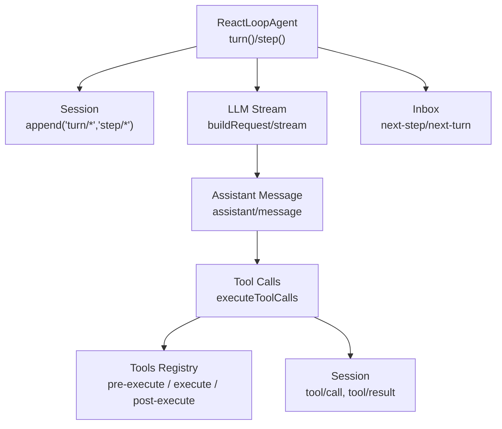
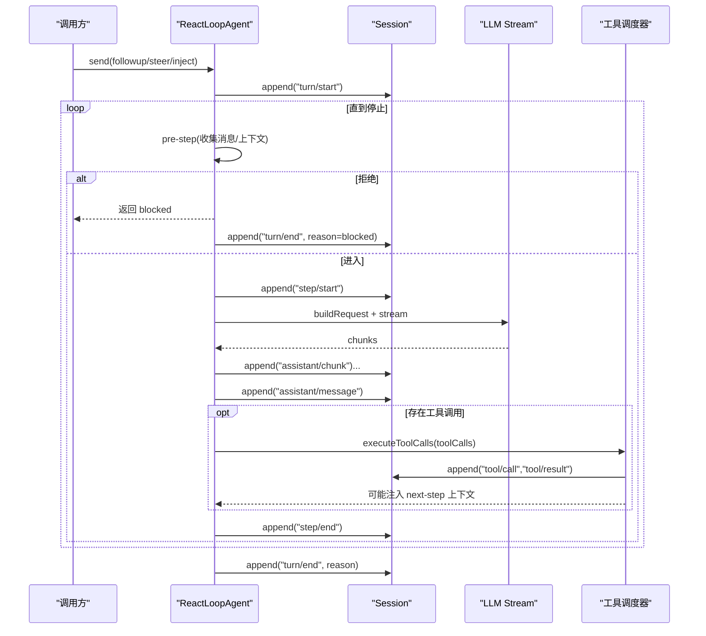
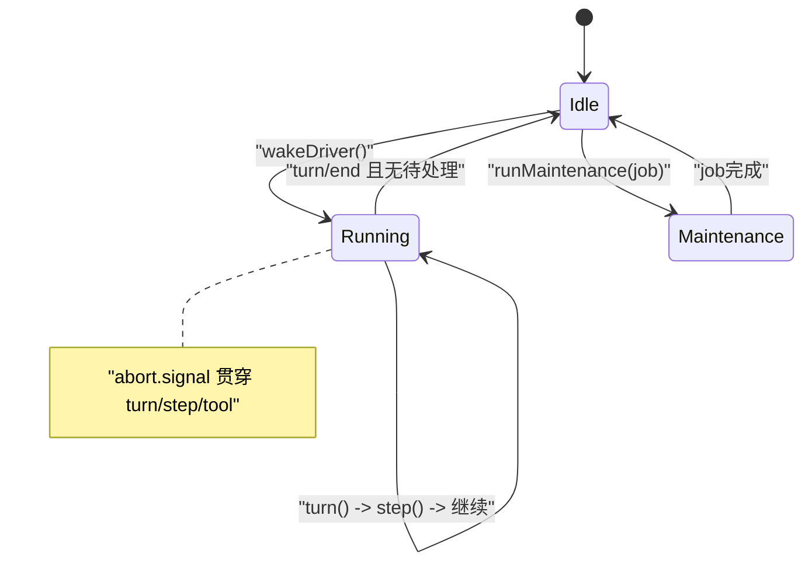
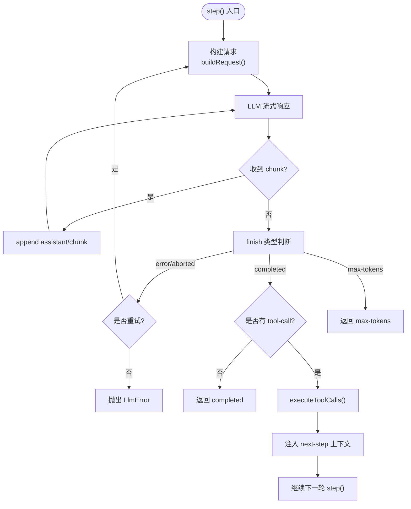
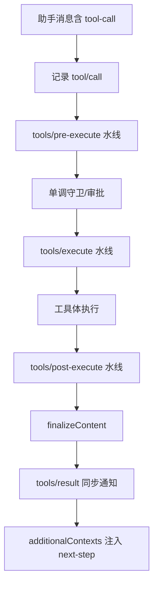
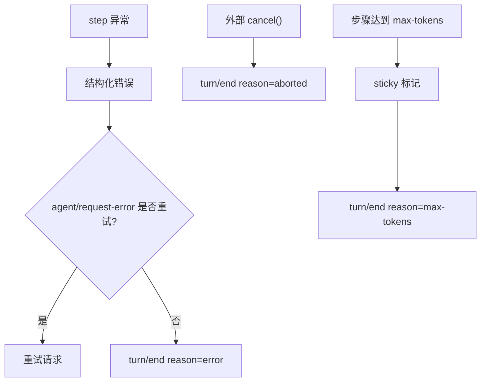
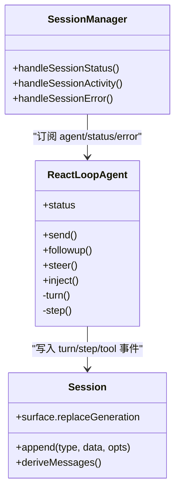
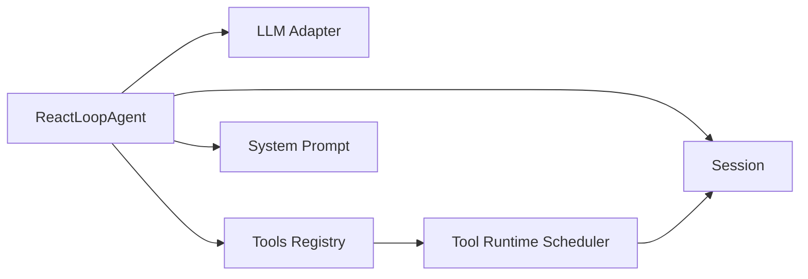

# Turn生命周期管理

<cite>
**本文引用的文件**
- [agent.ts](file://packages/core/agent-loop/src/agent.ts)
- [tool-calls.ts](file://packages/core/agent-loop/src/tool-calls.ts)
- [session.md](file://docs/subsystems/session.md)
- [tool-execution-pipeline.zh.md](file://docs/tool-execution-pipeline.zh.md)
- [2026-07-16-explicit-turn-cancellation.md](file://agents/notes/implemented/architecture/2026-07-16-explicit-turn-cancellation.md)
- [loop.spec.ts](file://packages/core/agent-loop/tests/loop.spec.ts)
- [coverage-edges.spec.ts](file://packages/core/agent-loop/tests/coverage-edges.spec.ts)
- [manager.ts](file://packages/api/session-controller/src/client/sessions/manager.ts)
</cite>

## 目录
1. [简介](#简介)
2. [项目结构](#项目结构)
3. [核心组件](#核心组件)
4. [架构总览](#架构总览)
5. [详细组件分析](#详细组件分析)
6. [依赖关系分析](#依赖关系分析)
7. [性能考量](#性能考量)
8. [故障排查指南](#故障排查指南)
9. [结论](#结论)
10. [附录](#附录)

## 简介
本文件系统性阐述 DeepSeek Harness 中 Turn 的生命周期管理，覆盖从 turn/start 到 turn/end 的完整流程，解释 Step 的概念与执行顺序、模型请求与工具调用的交替执行模式、Turn 状态管理与并发控制、资源清理、错误处理与恢复策略，并提供时序图与状态转换图。同时说明 Turn 与 Session、Agent 的关系与交互方式，并给出在不同阶段进行扩展与定制的实践要点。

## 项目结构
围绕 Turn 生命周期的关键代码位于 agent-loop 包：
- ReactLoopAgent：驱动 Session 在 turn/step 边界上推进，负责 pre-step、request、tool-calls、post-execute 等阶段的编排与事件记录。
- tool-calls：调度一次 step 内的工具调用（串行屏障或并行池），维护模型有序的结果提交与上下文注入。
- Session 子系统文档：定义 turn/start、turn/end、step/* 等事件语义与结束原因 TurnEndReasonMap。

图表来源
- [agent.ts:252-337](file://packages/core/agent-loop/src/agent.ts#L252-L337)
- [tool-calls.ts:59-101](file://packages/core/agent-loop/src/tool-calls.ts#L59-L101)
- [session.md:500-553](file://docs/subsystems/session.md#L500-L553)

章节来源
- [agent.ts:252-337](file://packages/core/agent-loop/src/agent.ts#L252-L337)
- [tool-calls.ts:59-101](file://packages/core/agent-loop/src/tool-calls.ts#L59-L101)
- [session.md:500-553](file://docs/subsystems/session.md#L500-L553)

## 核心组件
- ReactLoopAgent：以 Phase（idle/maintenance/running）管理活跃 Turn；通过 Inbox 协调 next-turn/next-step 输入；在 turn/start、step/start、step/end、turn/end 处写入持久化事件；构建 LLM 请求、流式消费助手消息、处理工具调用与结果注入。
- Tool Call 调度器：按执行模式（串行/并行）组织工具调用，保证模型侧顺序提交 tool/call 与 tool/result，并在取消时生成合成结果以保持回放一致性。
- Session 事件模型：turn/start、turn/end、step/start、step/end、assistant/chunk、assistant/message、user/message、tool/call、tool/result 等构成 Turn 的可回放日志。

章节来源
- [agent.ts:68-118](file://packages/core/agent-loop/src/agent.ts#L68-L118)
- [tool-calls.ts:19-38](file://packages/core/agent-loop/src/tool-calls.ts#L19-L38)
- [session.md:500-553](file://docs/subsystems/session.md#L500-L553)

## 架构总览
Turn 由 Agent 驱动，Step 是 Turn 内的最小可重试单元。每个 Step 包含：
- pre-step：收集待处理消息、组装系统提示与上下文，交由插件水线决定进入还是拒绝。
- request：构建冻结的请求配置，记录 request/header 与 request/context，调用 LLM stream。
- assistant 输出：将 chunk 追加为 assistant/chunk，完成后拼装 assistant/message。
- tool-calls：若存在工具调用块，则调度执行；工具结果作为 user-role 内容注入 next-step 队列，形成“模型请求—工具调用”交替循环。
- post-execute：工具执行后水线允许接受/阻止/替换/附加上下文，最终产出 tool/result。
- step/end：无论成功、max-tokens、错误或取消，均记录 step/end。
- turn/end：当无更多 next-step 输入且满足停止条件时，记录 turn/end 及结束原因。

图表来源
- [agent.ts:252-337](file://packages/core/agent-loop/src/agent.ts#L252-L337)
- [agent.ts:339-436](file://packages/core/agent-loop/src/agent.ts#L339-L436)
- [tool-calls.ts:59-101](file://packages/core/agent-loop/src/tool-calls.ts#L59-L101)
- [session.md:500-553](file://docs/subsystems/session.md#L500-L553)

## 详细组件分析

### Turn 状态机与并发控制
- 状态：idle、maintenance、running。running 下维护 turn、step 计数与 AbortController 信号。
- 并发：同一时刻仅一个 running driver；wakeDriver 确保空闲时启动新 driver，运行中时复用现有 abort 信号。
- 唤醒与入队：send/followup/steer/inject 统一通过 Inbox 投递 next-turn/next-step；wakeup=true 时在 idle 时立即启动 driver。
- 资源清理：cancel 支持 keepInbox 保留队列；finally 中重置 phase 并检查 latch 的 wakeRequested。

图表来源
- [agent.ts:38-47](file://packages/core/agent-loop/src/agent.ts#L38-L47)
- [agent.ts:171-200](file://packages/core/agent-loop/src/agent.ts#L171-L200)
- [agent.ts:217-230](file://packages/core/agent-loop/src/agent.ts#L217-L230)

章节来源
- [agent.ts:38-47](file://packages/core/agent-loop/src/agent.ts#L38-L47)
- [agent.ts:171-200](file://packages/core/agent-loop/src/agent.ts#L171-L200)
- [agent.ts:217-230](file://packages/core/agent-loop/src/agent.ts#L217-L230)

### Step 执行与“模型请求—工具调用”交替
- pre-step：读取 Inbox 目标队列，组装系统提示与上下文，调用 agent/pre-step 水线决定是否进入。
- request：构建冻结请求头，记录 request/header（含 provider/model/system/tools），必要时记录 request/context。
- 流式响应：assistant/chunk 逐条追加，完成后生成 assistant/message；若 finish 为 max-tokens，标记 sticky 的 turn 结束原因。
- tool-calls：若 assistant message 包含 tool-call 块，调用 executeToolCalls；工具结果以 user-message 形式注入 next-step，驱动下一轮模型请求。

图表来源
- [agent.ts:339-436](file://packages/core/agent-loop/src/agent.ts#L339-L436)
- [tool-calls.ts:59-101](file://packages/core/agent-loop/src/tool-calls.ts#L59-L101)

章节来源
- [agent.ts:339-436](file://packages/core/agent-loop/src/agent.ts#L339-L436)
- [tool-calls.ts:59-101](file://packages/core/agent-loop/src/tool-calls.ts#L59-L101)

### 工具执行管线（pre-execute / execute / post-execute）
- tools/pre-execute：权限、沙箱、审批等前置策略。
- tools/execute：超时、重试、指标等环绕执行。
- tools/post-execute：接受/阻止/替换/附加上下文。
- finalizeContent 与 tools/result：最终内容规范化与同步通知。
- 结果上下文：additionalContexts 按 FIFO 注入 next-step，驱动后续模型请求。

图表来源
- [tool-execution-pipeline.zh.md:8-60](file://docs/tool-execution-pipeline.zh.md#L8-L60)

章节来源
- [tool-execution-pipeline.zh.md:8-60](file://docs/tool-execution-pipeline.zh.md#L8-L60)

### Turn 结束原因与错误处理
- 结束原因：completed、aborted、blocked、error、max-tokens、interrupted（崩溃恢复合成）。
- 错误传播：step 内异常被捕获并结构化；LlmError 原样保留，其他错误扁平化为 UNKNOWN。
- 恢复策略：agent/request-error 水线可返回 retry 动作；未选择重试则终止 turn。
- 取消：AbortSignal 贯穿 turn/step/tool；取消时记录 aborted 原因，并清理资源。

图表来源
- [agent.ts:309-337](file://packages/core/agent-loop/src/agent.ts#L309-L337)
- [session.md:513-549](file://docs/subsystems/session.md#L513-L549)
- [coverage-edges.spec.ts:421-440](file://packages/core/agent-loop/tests/coverage-edges.spec.ts#L421-L440)

章节来源
- [agent.ts:309-337](file://packages/core/agent-loop/src/agent.ts#L309-L337)
- [session.md:513-549](file://docs/subsystems/session.md#L513-L549)
- [coverage-edges.spec.ts:421-440](file://packages/core/agent-loop/tests/coverage-edges.spec.ts#L421-L440)

### Turn 与 Session、Agent 的关系
- Agent 是 Session 的执行者：ReactLoopAgent 持有 Session 引用，通过 session.append 记录所有结构性事件。
- Session 提供事件源与投影：Surface 层将 assistant/chunk、assistant/message、user/message、tool/result 等映射为对话节点。
- 上层控制器：SessionManager 监听 agent/status、activity、error 等事件，维护会话列表与活动状态。

图表来源
- [agent.ts:68-118](file://packages/core/agent-loop/src/agent.ts#L68-L118)
- [manager.ts:769-796](file://packages/api/session-controller/src/client/sessions/manager.ts#L769-L796)

章节来源
- [agent.ts:68-118](file://packages/core/agent-loop/src/agent.ts#L68-L118)
- [manager.ts:769-796](file://packages/api/session-controller/src/client/sessions/manager.ts#L769-L796)

### 扩展点与定制示例（路径引用）
- 自定义请求配置：在 agent/request 水线中修改 provider/model/maxTokens/reasoningEffort 等。
  - 参考路径：[agent.ts:442-542](file://packages/core/agent-loop/src/agent.ts#L442-L542)
- 请求错误恢复：在 agent/request-error 水线中返回 retry 动作实现重试。
  - 参考路径：[agent.ts:388-406](file://packages/core/agent-loop/src/agent.ts#L388-L406)
- 工具执行策略：在 tools/pre-execute/tools/execute/tools/post-execute 水线中实现权限、审批、结果重写。
  - 参考路径：[tool-execution-pipeline.zh.md:8-60](file://docs/tool-execution-pipeline.zh.md#L8-L60)
- 工具调用并发：通过 ctx.agentLoop.config.maxParallelToolCalls 控制并行度。
  - 参考路径：[tool-calls.ts:121-132](file://packages/core/agent-loop/src/tool-calls.ts#L121-L132)
- 端到端验证：工具调用往返测试展示 model→tool→result→next-request 的流程。
  - 参考路径：[loop.spec.ts:226-255](file://packages/core/agent-loop/tests/loop.spec.ts#L226-L255)

章节来源
- [agent.ts:388-406](file://packages/core/agent-loop/src/agent.ts#L388-L406)
- [agent.ts:442-542](file://packages/core/agent-loop/src/agent.ts#L442-L542)
- [tool-calls.ts:121-132](file://packages/core/agent-loop/src/tool-calls.ts#L121-L132)
- [tool-execution-pipeline.zh.md:8-60](file://docs/tool-execution-pipeline.zh.md#L8-L60)
- [loop.spec.ts:226-255](file://packages/core/agent-loop/tests/loop.spec.ts#L226-L255)

## 依赖关系分析
- ReactLoopAgent 依赖：
  - Session：写入 turn/step/tool 事件，提供 deriveMessages 与 surface 能力。
  - LLM：prepareCall/stream 提供模型调用与流式响应。
  - Tools：注册表与执行调度器，支持 pre-execute/execute/post-execute 水线与执行模式。
  - System Prompt：组装系统提示与上下文。
- 工具调度器依赖：
  - Tools 运行时调度器：prepare/dispatch/finalize 以及 executionMode。
  - Session：记录 tool/call 与 tool/result，并将 additionalContexts 回注 next-step。

图表来源
- [agent.ts:68-118](file://packages/core/agent-loop/src/agent.ts#L68-L118)
- [tool-calls.ts:121-132](file://packages/core/agent-loop/src/tool-calls.ts#L121-L132)

章节来源
- [agent.ts:68-118](file://packages/core/agent-loop/src/agent.ts#L68-L118)
- [tool-calls.ts:121-132](file://packages/core/agent-loop/src/tool-calls.ts#L121-L132)

## 性能考量
- 流式响应：assistant/chunk 增量追加，避免整段等待，降低首字延迟。
- 工具并行：通过 maxParallelToolCalls 限制并发，平衡吞吐与资源占用。
- 粘性 max-tokens：一旦某 step 达到上限，整个 turn 以 max-tokens 结束，避免下游误判。
- 请求头缓存：首次记录 request/header，变更时才追加，减少冗余事件。

[本节为通用指导，不直接分析具体文件]

## 故障排查指南
- 请求失败：检查 agent/request-error 水线是否返回 retry；若无重试，turn 将以 error 结束。
  - 参考路径：[coverage-edges.spec.ts:421-440](file://packages/core/agent-loop/tests/coverage-edges.spec.ts#L421-L440)
- 工具调用被跳过：取消时未分发的工具调用会记录合成错误结果，保持回放一致。
  - 参考路径：[tool-calls.ts:248-259](file://packages/core/agent-loop/src/tool-calls.ts#L248-L259)
- 取消与资源清理：确认 cancel({ keepInbox }) 行为是否符合预期；driver finally 中会重置 phase 并处理 latch。
  - 参考路径：[agent.ts:141-147](file://packages/core/agent-loop/src/agent.ts#L141-L147)
  - 参考路径：[agent.ts:217-230](file://packages/core/agent-loop/src/agent.ts#L217-L230)
- 会话状态不同步：检查 SessionManager 是否正确接收 agent/status/activity/error。
  - 参考路径：[manager.ts:769-796](file://packages/api/session-controller/src/client/sessions/manager.ts#L769-L796)

章节来源
- [coverage-edges.spec.ts:421-440](file://packages/core/agent-loop/tests/coverage-edges.spec.ts#L421-L440)
- [tool-calls.ts:248-259](file://packages/core/agent-loop/src/tool-calls.ts#L248-L259)
- [agent.ts:141-147](file://packages/core/agent-loop/src/agent.ts#L141-L147)
- [agent.ts:217-230](file://packages/core/agent-loop/src/agent.ts#L217-L230)
- [manager.ts:769-796](file://packages/api/session-controller/src/client/sessions/manager.ts#L769-L796)

## 结论
DeepSeek Harness 的 Turn 生命周期以 ReactLoopAgent 为核心，结合 Session 事件模型与工具执行管线，实现了“模型请求—工具调用”交替执行的稳定闭环。通过明确的 Phase 状态、AbortSignal 驱动的取消、粘性 max-tokens 与结构化错误恢复，Turn 具备高可靠性与可观测性。上层可通过水线机制在 pre-step、request、tool 执行各阶段进行扩展与定制，满足多样化业务需求。

[本节为总结性内容，不直接分析具体文件]

## 附录
- 取消与显式信号：每轮拥有唯一 signal，贯穿异步扩展点，终端发布与持久化不受其控制。
  - 参考路径：[2026-07-16-explicit-turn-cancellation.md:47-56](file://agents/notes/implemented/architecture/2026-07-16-explicit-turn-cancellation.md#L47-L56)
- 工具调用往返示例：验证 model→tool→result→next-request 的完整链路。
  - 参考路径：[loop.spec.ts:226-255](file://packages/core/agent-loop/tests/loop.spec.ts#L226-L255)

章节来源
- [2026-07-16-explicit-turn-cancellation.md:47-56](file://agents/notes/implemented/architecture/2026-07-16-explicit-turn-cancellation.md#L47-L56)
- [loop.spec.ts:226-255](file://packages/core/agent-loop/tests/loop.spec.ts#L226-L255)