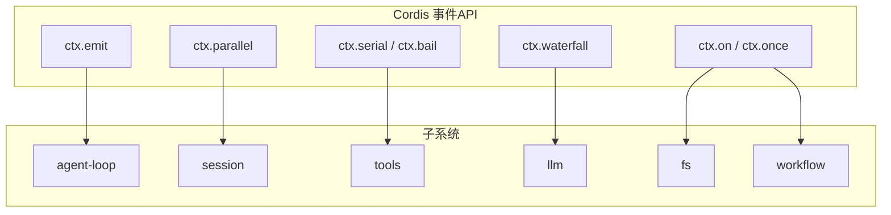
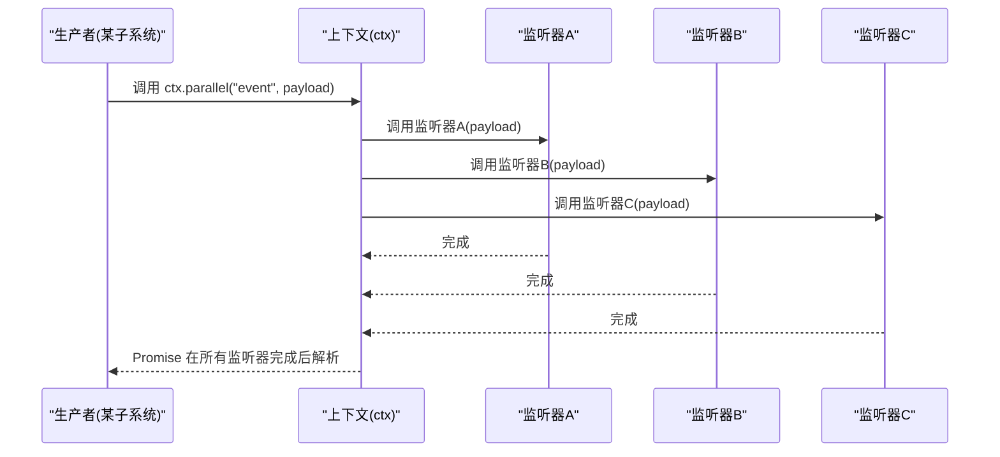
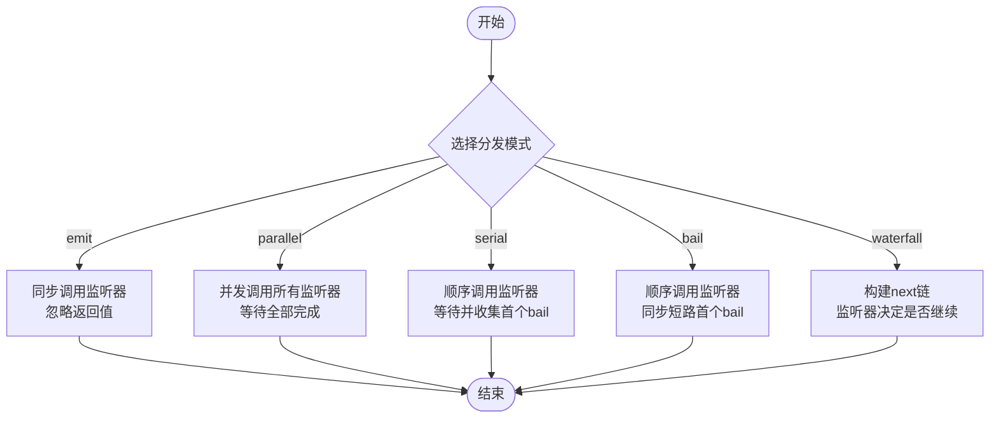
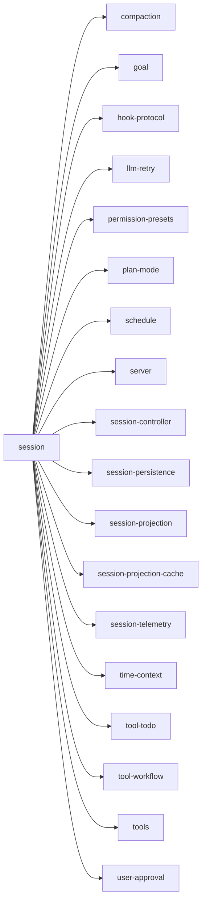

# 事件系统架构

<cite>
**本文引用的文件**
- [docs/cordis-api/events.md](file://docs/cordis-api/events.md)
- [docs/event-producer-consumer.md](file://docs/event-producer-consumer.md)
- [docs/cordis-api/inherited.md](file://docs/cordis-api/inherited.md)
</cite>

## 目录
1. [简介](#简介)
2. [项目结构](#项目结构)
3. [核心组件](#核心组件)
4. [架构总览](#架构总览)
5. [详细组件分析](#详细组件分析)
6. [依赖关系分析](#依赖关系分析)
7. [性能考量](#性能考量)
8. [故障排查指南](#故障排查指南)
9. [结论](#结论)
10. [附录](#附录)

## 简介
本文件为 DeepSeek Harness 的事件系统架构文档，聚焦于事件驱动设计在 Harness 中的落地方式。内容涵盖：
- 四种事件分发模式（emit、waterfall、serial、parallel）的原理与适用场景
- 生产者-消费者模式的实现机制：事件声明、分发器注册、监听器管理与消息传递流程
- 事件类型系统的设计要点：运行时类型定义与类型安全保证
- 完整的事件矩阵：各包之间的依赖关系与事件流向
- 实践示例：如何正确声明、分发和监听事件
- 错误处理机制与调试方法

## 项目结构
Harness 的事件能力由 Cordis 提供，并通过上下文注入到每个子系统。事件 API 与分发模式在文档中集中描述，事件矩阵则汇总了各包的声明者、分发者与监听者关系。

图表来源
- [docs/cordis-api/events.md:8-123](file://docs/cordis-api/events.md#L8-L123)
- [docs/cordis-api/inherited.md:12-13](file://docs/cordis-api/inherited.md#L12-L13)

章节来源
- [docs/cordis-api/events.md:8-123](file://docs/cordis-api/events.md#L8-L123)
- [docs/cordis-api/inherited.md:12-13](file://docs/cordis-api/inherited.md#L12-L13)

## 核心组件
- 事件分发 API
  - emit：同步分发，忽略监听器返回值，适用于“通知型”事件
  - parallel：并发分发，等待所有监听器完成，适用于“广播+聚合结果”的场景
  - serial/bail：顺序分发，遇到首个“bail 值”即停止；bail 为同步短路，serial 支持异步并返回首个 bail
  - waterfall：链式组合，最后一个参数为 next 延续；监听器可选择调用 next 继续链路或拦截/改写行为
- 监听器管理
  - on/once：在当前 fiber 下注册监听器，返回可调用以移除监听器的 disposer；once 仅触发一次后自动移除
  - EventOptions：支持 prepend（前置插入）与 global（绕过上下文过滤）等选项
- 类型系统
  - Events 映射将事件名与监听器签名绑定，确保 ctx.* 调用的参数与返回值类型安全
  - DispatchMode 枚举约束了可用的分发模式

章节来源
- [docs/cordis-api/events.md:8-123](file://docs/cordis-api/events.md#L8-L123)
- [docs/cordis-api/events.md:125-187](file://docs/cordis-api/events.md#L125-L187)
- [docs/cordis-api/events.md:189-207](file://docs/cordis-api/events.md#L189-L207)
- [docs/cordis-api/inherited.md:12-13](file://docs/cordis-api/inherited.md#L12-L13)

## 架构总览
Harness 采用“事件驱动 + 插件化”的架构：
- 子系统通过 ctx.* 分发事件，其他子系统通过 ctx.on/once 订阅事件
- 事件类型由 Events 映射约束，保证编译期类型安全
- 不同分发模式满足不同的语义需求：通知、并行、顺序短路、链式组合

图表来源
- [docs/cordis-api/events.md:8-29](file://docs/cordis-api/events.md#L8-L29)

章节来源
- [docs/cordis-api/events.md:8-29](file://docs/cordis-api/events.md#L8-L29)

## 详细组件分析

### 事件分发模式对比与使用场景
- emit（同步通知）
  - 特点：不等待监听器，忽略返回值
  - 适用：日志、遥测、状态广播等无需回流的场景
- parallel（并发广播）
  - 特点：并发执行所有监听器，统一等待全部完成
  - 适用：需要聚合多个副作用且无顺序依赖的场景
- serial/bail（顺序短路）
  - 特点：按序执行，遇到首个非空/非假/非 undefined 的返回值即停止；bail 同步短路，serial 支持异步并返回首个 bail
  - 适用：策略选择、权限校验、优先级处理等“首个命中即决定”的场景
- waterfall（链式组合）
  - 特点：最后一个参数为 next 延续；监听器可选择调用 next 继续链路或拦截/改写
  - 适用：请求/响应管道、中间件式处理、可插拔增强

章节来源
- [docs/cordis-api/events.md:8-123](file://docs/cordis-api/events.md#L8-L123)
- [docs/cordis-api/events.md:189-207](file://docs/cordis-api/events.md#L189-L207)

### 事件生产者-消费者模式
- 事件声明：在各子系统的类型文件中声明事件名与监听器签名，Events 映射自动生成类型约束
- 分发器注册：通过 ctx.* 调用分发事件，根据模式选择合适分发策略
- 监听器管理：通过 ctx.on/once 注册监听器，支持 prepend/global 选项；返回 disposer 用于清理
- 消息传递流程：
  - 生产者调用 ctx.* 分发事件
  - 上下文根据模式调度监听器
  - 监听器执行副作用或返回 bail/next 控制流
  - 分发器根据模式返回结果或 Promise

图表来源
- [docs/cordis-api/events.md:8-123](file://docs/cordis-api/events.md#L8-L123)

章节来源
- [docs/cordis-api/events.md:8-123](file://docs/cordis-api/events.md#L8-L123)

### 事件类型系统与类型安全
- Events 映射将事件名与监听器函数签名绑定，ctx.* 的参数与返回值受 TypeScript 类型检查保护
- DispatchMode 枚举限定可用分发模式，避免误用
- 通过类型约束，可在编译期发现事件名拼写错误、参数不匹配等问题

章节来源
- [docs/cordis-api/events.md:189-207](file://docs/cordis-api/events.md#L189-L207)

### 事件矩阵分析（包间依赖与事件流向）
以下表格展示了 Harness 内主要事件的声明位置、分发模式、分发者与监听者关系。该矩阵有助于理解跨包耦合与数据流向。

| 事件 | 模式 | 声明位置 | 分发者 | 监听者 |
| --- | --- | --- | --- | --- |
| agent-loop/config-start-failed | emit | packages/core/agent-loop/src/index.ts:183 | agent-loop (events.dispatch) | - |
| agent-preset/selected | emit | packages/preset/agent-presets/src/types.ts:92 | agent-presets (emit) | remotes |
| agent/created | emit | packages/core/agent/src/runtime-types.ts:166 | agent (events.dispatch) | agent-presets, file-reference-local, goal-round-driver, schedule, tool-agent-team, tool-subagent |
| agent/disposed | emit | packages/core/agent/src/runtime-types.ts:175 | agent (events.dispatch) | agent-loop, file-reference-local, goal-round-driver, subagent, tool-agent-team, tool-subagent |
| agent/error | emit | packages/core/agent/src/runtime-types.ts:297 | agent-loop (emit) | acp, goal-round-driver, session-controller, session-telemetry |
| agent/inbox/claimed | emit | packages/core/agent/src/runtime-types.ts:204 | agent-loop (emit) | acp, goal-round-driver, subagent, tool-jobs |
| agent/inbox/discarded | emit | packages/core/agent/src/runtime-types.ts:212 | agent-loop (emit) | goal-round-driver, subagent |
| agent/inbox/inserted | emit | packages/core/agent/src/runtime-types.ts:193 | agent-loop (emit) | goal-round-driver |
| agent/pre-step | waterfall | packages/core/agent/src/runtime-types.ts:238 | agent-loop (waterfall) | agent-instructions, compaction-basic, goal-round-driver, hooks-claude-code, hooks-codex, plan-mode, repeat-tool-reminder, session-checkpoint-policy, session-reference, subagent-in-process-driver, time-context, tmux-context, tool-cordis, tool-skill, tool-subagent |
| agent/request | waterfall | packages/core/agent/src/runtime-types.ts:251 | agent-loop (waterfall) | agent, webhook |
| agent/request-error | waterfall | packages/core/agent/src/runtime-types.ts:267 | agent-loop (waterfall) | compaction-basic, llm-retry |
| agent/session-start | emit | packages/core/agent/src/runtime-types.ts:224 | agent-loop (emitAgentEvent) | agent-team, goal, goal-round-driver, hooks-claude-code, hooks-codex |
| agent/status | emit | packages/core/agent/src/runtime-types.ts:185 | agent-loop (emit) | agent, agent-team, compaction-basic, goal-round-driver, schedule, server, session-controller |
| agent/turn-stopping | serial | packages/core/agent/src/runtime-types.ts:285 | agent-loop (serial) | hooks-claude-code, hooks-codex |
| api-session/activity | emit | packages/api/session-controller/src/types.ts:537 | session-controller (emit) | remotes |
| api-session/added | emit | packages/api/session-controller/src/types.ts:517 | session-controller (emit) | remotes |
| api-session/error | emit | packages/api/session-controller/src/types.ts:544 | session-controller (emit) | remotes |
| api-session/removed | emit | packages/api/session-controller/src/types.ts:523 | session-controller (emit) | remotes |
| api-session/status | emit | packages/api/session-controller/src/types.ts:530 | session-controller (emit) | remotes |
| approval/request | waterfall | packages/interaction/user-approval/src/types.ts:85 | user-approval (waterfall) | acp, remotes |
| authorization/settled | emit | packages/credentials/authorization/src/index.ts:57 | authorization (events.dispatch) | authorization |
| commands/change | emit | packages/interaction/commands/src/types.ts:80 | commands (events.dispatch) | remotes |
| cordis/dynamic-package | emit | packages/extensions/cordis-host-runner/src/types.ts:379 | cordis-host-runner (emit) | remotes |
| cordis/dynamic-retract | emit | packages/extensions/cordis-host-runner/src/types.ts:385 | cordis-host-runner (emit) | remotes |
| cordis/inspect-query | emit | packages/extensions/cordis-host-runner/src/types.ts:391 | cordis-host-runner (emit) | remotes |
| cordis/inspect-query-resolved | emit | packages/extensions/cordis-host-runner/src/types.ts:397 | cordis-host-runner (emit) | remotes |
| cordis/request-run | emit | packages/extensions/cordis-host-runner/src/types.ts:367 | cordis-host-runner (emit) | remotes |
| cordis/request-run-resolved | emit | packages/extensions/cordis-host-runner/src/types.ts:373 | cordis-host-runner (emit) | remotes |
| credentials/record-updated | emit | packages/credentials/credentials/src/types.ts:102 | credentials (events.dispatch) | authorization |
| credentials/reference-updated | emit | packages/credentials/credentials/src/types.ts:90 | credentials (events.dispatch) | credentials, remotes |
| domain/changed | emit | packages/storage/storage-domain/src/events.ts:46 | storage-domain (emit) | storage-domain, workspace, workspace-controller |
| fs/edit-intent | waterfall | packages/fs/fs/src/index.ts:66 | tool-fs (waterfall), tool-str-replace-editor (waterfall) | fs-observation-policy |
| fs/observed | emit | packages/fs/fs/src/index.ts:76 | tool-fs (emit), tool-str-replace-editor (emit) | fs-observation-policy, skill-filesystem |
| fs/write-intent | waterfall | packages/fs/fs/src/index.ts:58 | tool-fs (waterfall), tool-str-replace-editor (waterfall) | fs-observation-policy |
| goal/changed | emit | packages/goal/goal/src/domain.ts:114 | goal (emit) | goal-round-driver |
| llm/adapters-updated | emit | packages/llm/llm/src/types.ts:23 | llm (events.dispatch) | acp, llm, remotes |
| llm/stream | waterfall | packages/llm/llm/src/index.ts:67 | llm (waterfall) | agent-loop, llm, llm-replay, session-checkpoint-policy, session-title |
| session-telemetry/record | waterfall | packages/session/session-telemetry/src/index.ts:43 | session-telemetry (waterfall) | - |
| session/created | emit | packages/core/session/src/index.ts:54 | session (events.dispatch) | compaction, goal, hook-protocol, llm-retry, permission-presets, plan-mode, schedule, server, session, session-controller, session-log-deepseek, session-persistence, session-projection, session-projection-cache, session-telemetry, time-context, tool-todo, tool-workflow, tools, user-approval |
| session/disposed | emit | packages/core/session/src/index.ts:64 | session (events.dispatch) | agent-loop, agent-team, session-controller, session-persistence, session-projection-cache, session-telemetry, session-title |
| session/event | emit | packages/core/session/src/index.ts:76 | session (events.dispatch) | acp, agent-instructions, agent-loop, agent-presets, agent-team, compaction, compaction-basic, file-reference-local, goal, goal-round-driver, headless, hook-protocol, loader-smoke, server, session, session-controller, session-persistence, session-projection, session-projection-cache, session-telemetry, session-telemetry-otel, session-title, token-meter, tool-todo, tool-workflow, tools, user-approval |
| session/flush | parallel | packages/core/session/src/index.ts:85 | session (events.dispatch) | session-persistence, session-telemetry |
| settings/document-updated | emit | packages/settings/settings/src/types.ts:105 | settings (events.dispatch) | remotes |
| settings/updated | emit | packages/settings/settings/src/types.ts:92 | settings (events.dispatch) | settings |
| skills/change | emit | packages/skill/skill/src/index.ts:297 | skill (events.dispatch) | - |
| subagent/end | emit | packages/subagent/subagent/src/index.ts:178 | subagent (events.dispatch) | hooks-claude-code, server, subagent |
| subagent/provider-added | emit | packages/subagent/subagent/src/index.ts:152 | subagent (emit) | subagent, tool-subagent |
| subagent/provider-removed | emit | packages/subagent/subagent/src/index.ts:158 | subagent (events.dispatch) | subagent, tool-subagent |
| subagent/start | emit | packages/subagent/subagent/src/index.ts:169 | subagent (events.dispatch) | hooks-claude-code, subagent |
| system-prompt/assemble | waterfall | packages/core/system-prompt/src/index.ts:31 | system-prompt (waterfall) | agent, agent-presets, system-prompt |
| system-prompt/change | emit | packages/core/system-prompt/src/index.ts:37 | system-prompt (emit) | - |
| tools/change | emit | packages/core/tools/src/index.ts:207 | agent-presets (emit), tools (emit) | tool-subagent |
| tools/execute | waterfall | packages/core/tools/src/index.ts:163 | tools (waterfall) | session-checkpoint-policy, timeout-policy |
| tools/post-execute | waterfall | packages/core/tools/src/index.ts:175 | tools (waterfall) | hooks-claude-code, hooks-codex, repeat-tool-reminder, spill-policy, tool-fs-search |
| tools/pre-execute | waterfall | packages/core/tools/src/index.ts:152 | tools (waterfall) | hooks-claude-code, hooks-codex, tool-jobs |
| tools/ptc-dispatch-log | waterfall | packages/core/tools/src/index.ts:189 | tools (waterfall) | spill-policy |
| tools/result | emit | packages/core/tools/src/index.ts:197 | tools (events.dispatch) | agent-instructions, subagent-in-process-driver |
| user-questions/request | waterfall | packages/interaction/user-questions/src/types.ts:85 | user-questions (waterfall) | remotes |
| webserver/index-inject | emit | packages/host/webserver/src/index.ts:34 | webserver (emit) | inspector, modules |
| workflow/agent-end | emit | packages/workflow/workflow/src/index.ts:79 | workflow (events.dispatch) | tool-workflow, workflow |
| workflow/agent-start | emit | packages/workflow/workflow/src/index.ts:68 | workflow (events.dispatch) | tool-workflow, workflow |
| workflow/end | emit | packages/workflow/workflow/src/index.ts:89 | workflow (events.dispatch) | workflow |
| workflow/log | emit | packages/workflow/workflow/src/index.ts:58 | workflow (events.dispatch) | - |
| workflow/phase | emit | packages/workflow/workflow/src/index.ts:51 | workflow (events.dispatch) | - |
| workflow/start | emit | packages/workflow/workflow/src/index.ts:43 | workflow (events.dispatch) | workflow |

章节来源
- [docs/event-producer-consumer.md:8-75](file://docs/event-producer-consumer.md#L8-L75)

### 代码级示例（路径引用）
- 声明事件与分发
  - 参考：[packages/core/agent/src/runtime-types.ts:166-297](file://packages/core/agent/src/runtime-types.ts#L166-L297)
  - 说明：在运行时类型中声明事件名与监听器签名，并在 agent-loop 中使用 ctx.emit/parallel/serial/waterfall 进行分发
- 监听事件
  - 参考：[docs/cordis-api/events.md:125-187](file://docs/cordis-api/events.md#L125-L187)
  - 说明：通过 ctx.on/once 注册监听器，支持 prepend/global 选项，返回 disposer 用于清理

章节来源
- [docs/cordis-api/events.md:125-187](file://docs/cordis-api/events.md#L125-L187)
- [packages/core/agent/src/runtime-types.ts:166-297](file://packages/core/agent/src/runtime-types.ts#L166-L297)

## 依赖关系分析
- 事件矩阵显示了大量多对多的依赖关系，典型如：
  - session 生命周期事件被多个子系统监听（compaction、goal、hook-protocol、llm-retry、permission-presets、plan-mode、schedule、server、session、session-controller、session-log-deepseek、session-persistence、session-projection、session-projection-cache、session-telemetry、time-context、tool-todo、tool-workflow、tools、user-approval）
  - tools 执行管线通过 waterfall 串联多个策略与钩子（session-checkpoint-policy、timeout-policy、hooks-*、spill-policy、tool-fs-search）
- 这种设计使子系统解耦，但需关注事件风暴与性能影响

图表来源
- [docs/event-producer-consumer.md:48-50](file://docs/event-producer-consumer.md#L48-L50)

章节来源
- [docs/event-producer-consumer.md:48-50](file://docs/event-producer-consumer.md#L48-L50)

## 性能考量
- 选择合适的分发模式：
  - 高吞吐通知：优先使用 emit，避免阻塞
  - 需要聚合结果：使用 parallel，注意监听器耗时与资源占用
  - 需要顺序控制：使用 serial/bail，避免不必要的后续监听器执行
  - 复杂管道：使用 waterfall，合理拆分职责，避免深层嵌套
- 监听器优化：
  - 避免在监听器中进行昂贵计算或 I/O
  - 合理使用 once 减少长期驻留的监听器
  - 使用 prepend 谨慎，避免破坏默认顺序
- 事件风暴防护：
  - 对高频事件进行节流或合并
  - 对关键路径事件增加限流与降级策略

## 故障排查指南
- 常见问题定位
  - 事件未触发：检查事件名是否与 Events 映射一致；确认分发模式是否正确；验证监听器是否已注册
  - 监听器未执行：检查 EventOptions.global 是否必要；确认上下文过滤是否阻止了事件传播
  - 顺序问题：对于需要顺序的场景，使用 serial/bail；对于并行场景，使用 parallel 并注意竞态条件
- 调试建议
  - 在关键事件处添加日志，记录事件名、参数与时间戳
  - 使用 waterfall 的 next 链观察中间状态
  - 利用 session/event 等通用事件作为观测点，结合 session-telemetry/record 进行追踪

章节来源
- [docs/cordis-api/events.md:8-123](file://docs/cordis-api/events.md#L8-L123)
- [docs/event-producer-consumer.md:46-51](file://docs/event-producer-consumer.md#L46-L51)

## 结论
DeepSeek Harness 的事件系统基于 Cordis 提供的强大抽象，通过 emit、parallel、serial/bail、waterfall 四种模式覆盖大多数业务场景。借助类型化的 Events 映射与灵活的监听器管理，系统在保持解耦的同时提供了良好的可维护性与扩展性。通过事件矩阵，开发者可以清晰理解跨包依赖与事件流向，从而做出更合理的架构决策。

## 附录
- 快速参考
  - 分发模式：emit、parallel、serial/bail、waterfall
  - 监听器管理：on、once、EventOptions（prepend、global）
  - 类型安全：Events 映射、DispatchMode 枚举
- 实践清单
  - 明确事件语义，选择合适分发模式
  - 在类型文件中声明事件，确保类型安全
  - 使用 ctx.on/once 注册监听器，及时清理
  - 通过事件矩阵理解依赖关系，避免过度耦合