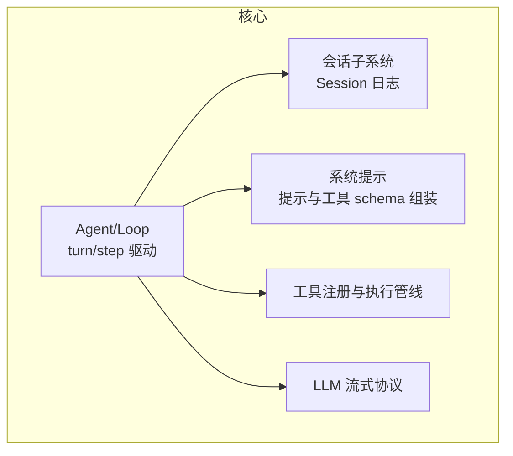
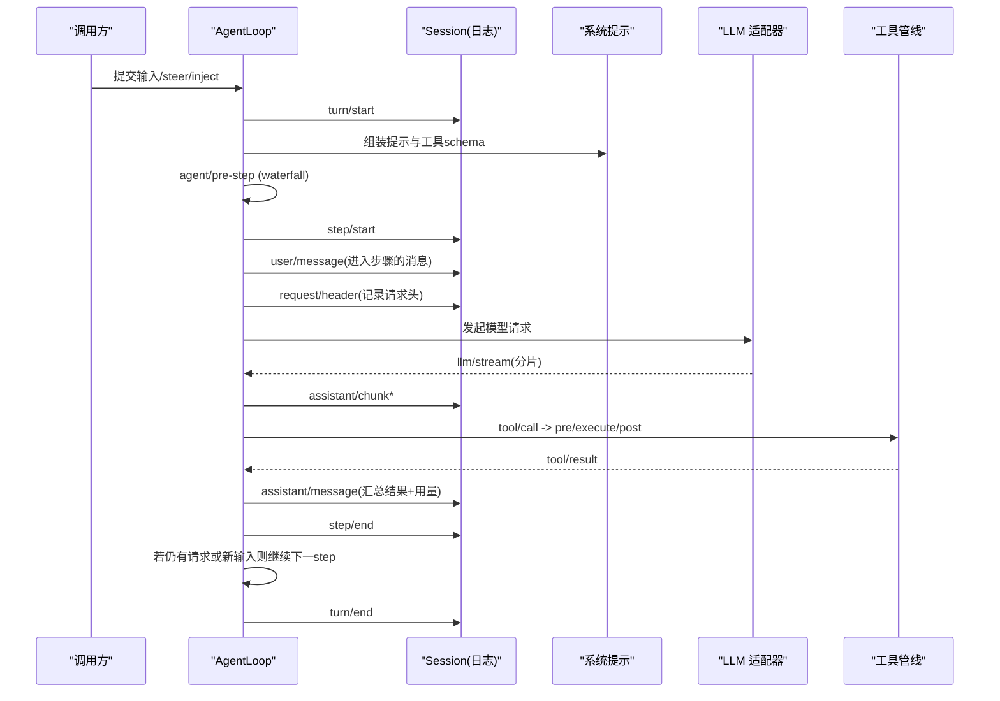
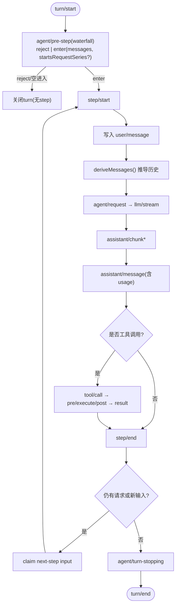
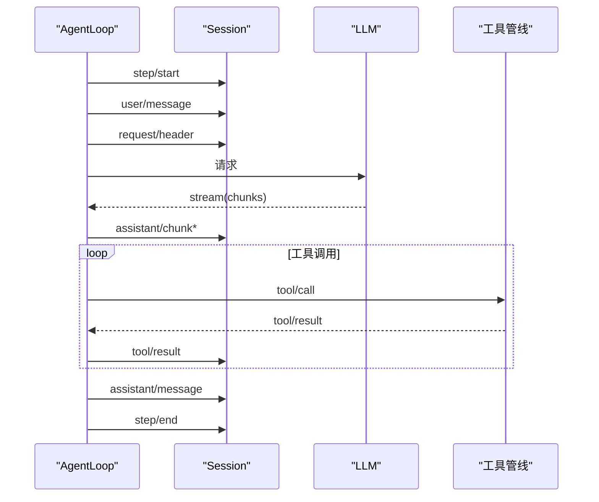
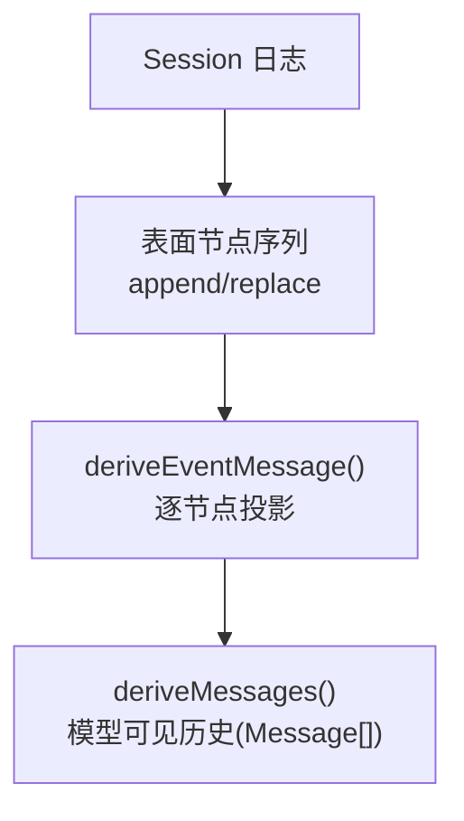
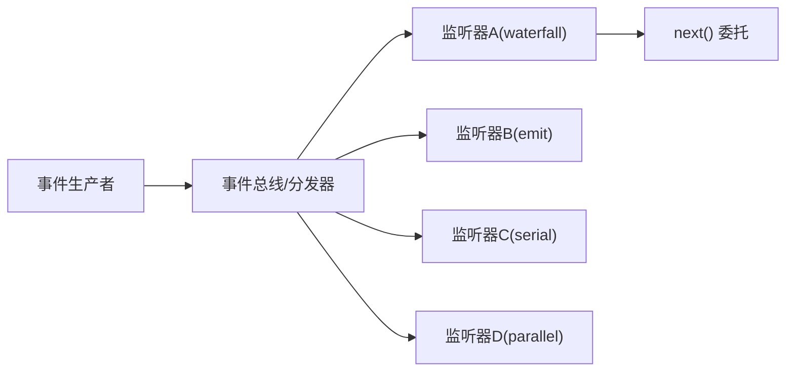
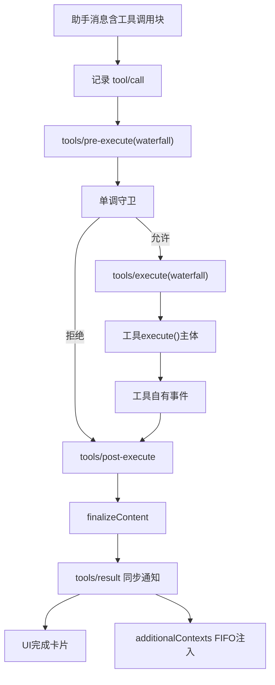
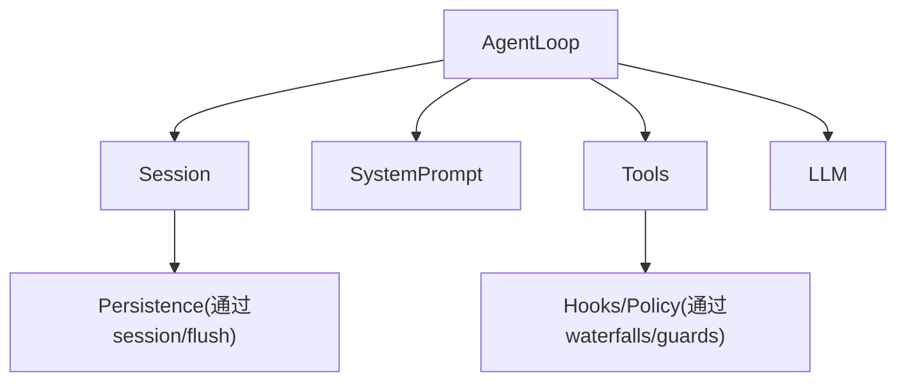

# 组件交互机制

<cite>
**本文引用的文件**
- [架构总览](file://docs/architecture.md)
- [事件生产者-消费者矩阵](file://docs/event-producer-consumer.md)
- [会话子系统文档](file://docs/subsystems/session.md)
- [核心子系统文档](file://docs/subsystems/core.md)
- [工具执行流水线](file://docs/tool-execution-pipeline.md)
</cite>

## 目录
1. [简介](#简介)
2. [项目结构](#项目结构)
3. [核心组件](#核心组件)
4. [架构总览](#架构总览)
5. [详细组件分析](#详细组件分析)
6. [依赖关系分析](#依赖关系分析)
7. [性能考量](#性能考量)
8. [故障排查指南](#故障排查指南)
9. [结论](#结论)
10. [附录](#附录)

## 简介
本文件聚焦 DeepSeek Harness 的组件交互机制，围绕事件驱动架构、Turn/Step 生命周期、Session 日志作为单一事实来源、以及 deriveMessages() 的历史推导进行系统化说明。同时给出事件生产者-消费者模式在 Harness 中的实现方式（事件映射、监听器注册与消息传递），并通过流程图与时序图展示各组件间的通信模式和数据流向。

## 项目结构
Harness 以插件化 Cordis 框架为基础，将模型适配器、工具注册表、会话日志、Agent 循环等全部作为可替换插件组合运行。核心由以下子系统构成：
- 会话子系统：追加式 SessionEvent 日志与内存存储，提供 deriveMessages() 推导模型可见历史。
- Agent 与 Agent Loop：定义 Agent 接口与默认驱动，负责 turn/step 编排、输入投递、取消与拦截。
- 系统提示与工具：组装系统提示与工具 schema，并提供受保护的执行管线。
- LLM 流式协议：统一消息、流块与请求词汇。
- Webhook/工作流等扩展能力通过事件与 seam 接入。

图表来源
- [架构总览:49-63](file://docs/architecture.md#L49-L63)
- [核心子系统文档:7-19](file://docs/subsystems/core.md#L7-L19)

章节来源
- [架构总览:49-63](file://docs/architecture.md#L49-L63)
- [核心子系统文档:7-19](file://docs/subsystems/core.md#L7-L19)

## 核心组件
- 会话（Session）：追加式事件日志，所有模型可见事实必须落盘并可重放；deriveMessages() 从日志推导模型历史。
- Agent/AgentLoop：对外暴露 Agent 句柄，内部驱动 turn/step 流程，处理输入投递、取消、拦截与状态。
- 工具执行管线：pre-execute → execute → post-execute 三段水瀑，结合审批、沙箱、超时、指标与结果规范化。
- 事件体系：session/*、agent/*、tools/*、llm/* 等，覆盖持久化事实与运行时扩展点。

章节来源
- [会话子系统文档:1-12](file://docs/subsystems/session.md#L1-L12)
- [核心子系统文档:7-19](file://docs/subsystems/core.md#L7-L19)
- [工具执行流水线:1-10](file://docs/tool-execution-pipeline.md#L1-L10)

## 架构总览
Harness 的事件驱动架构以“会话日志为唯一事实来源”为核心，所有进入模型请求的内容均可从日志中重建。Turn 是零或多个 Step 的集合，Step 是一次模型请求及其调用的工具执行。事件分为三类：
- 会话事件：持久化到日志并通过 session/event 广播，适合需要跨重启的事实。
- 智能体事件（agent/*）：携带实时 Agent 上下文，用于观察或拦截飞行中的工作。
- 能力事件（如 tools/*、fs/*、llm/*）：在不引入循环的情况下挂载策略与适配器。

图表来源
- [架构总览:74-101](file://docs/architecture.md#L74-L101)
- [会话子系统文档:27-131](file://docs/subsystems/session.md#L27-L131)
- [核心子系统文档:213-242](file://docs/subsystems/core.md#L213-L242)

章节来源
- [架构总览:64-101](file://docs/architecture.md#L64-L101)
- [会话子系统文档:27-131](file://docs/subsystems/session.md#L27-L131)
- [核心子系统文档:213-242](file://docs/subsystems/core.md#L213-L242)

## 详细组件分析

### 事件分类与使用场景
- 会话事件（session/*）：turn/start、turn/end、step/start、step/end、user/message、assistant/chunk、assistant/message、tool/call、tool/result、request/header、request/context、session/end-seed。这些事件构成可重放的日志，并参与 deriveMessages() 推导。
- 智能体事件（agent/*）：agent/created、agent/disposed、agent/status、agent/inbox/*、agent/pre-step、agent/request、agent/request-error、agent/turn-stopping、agent/session-start。用于观察/拦截 Agent 生命周期与请求流。
- 能力事件（tools/*、fs/*、llm/* 等）：tools/pre-execute、tools/execute、tools/post-execute、tools/result、fs/write-intent/fs/edit-intent、llm/stream 等，用于挂载策略、钩子、重试、度量与 UI 呈现。

章节来源
- [事件生产者-消费者矩阵:8-74](file://docs/event-producer-consumer.md#L8-L74)
- [会话子系统文档:27-131](file://docs/subsystems/session.md#L27-L131)
- [核心子系统文档:783-800](file://docs/subsystems/core.md#L783-L800)

### Turn 生命周期（turn/start → turn/end）
- turn/start：打开一个 turn，准备 claim 下一个步骤的输入与一条排队消息，并组装提示与工具 schema。
- agent/pre-step（waterfall）：决定进入步骤或拒绝；拒绝或首个进入为空时关闭 turn（无 step）。
- step/start：开始一个 step（一次模型请求 + 其工具调用）。
- 写入 user/message：记录进入该步骤的消息。
- deriveMessages()：从日志推导模型可见历史。
- agent/request → llm/stream → assistant/chunk* → assistant/message：模型响应流式返回并聚合。
- tool/call → tools/pre-execute → tools/execute → tools/post-execute → tool/result：工具调用与结果。
- step/end：结束当前 step。
- 若仍有待处理的请求或新的 next-step 输入，则 claim 并进入下一步。
- agent/turn-stopping：串行收尾阶段。
- turn/end：关闭 turn，记录结束原因。

图表来源
- [架构总览:74-101](file://docs/architecture.md#L74-L101)
- [会话子系统文档:27-131](file://docs/subsystems/session.md#L27-L131)
- [核心子系统文档:213-242](file://docs/subsystems/core.md#L213-L242)

章节来源
- [架构总览:74-101](file://docs/architecture.md#L74-L101)
- [会话子系统文档:27-131](file://docs/subsystems/session.md#L27-L131)
- [核心子系统文档:213-242](file://docs/subsystems/core.md#L213-L242)

### Step 的概念与执行顺序
- Step 是一次模型请求及其调用的工具执行的原子单元。
- 执行顺序：
  - 先写 step/start。
  - 写入进入步骤的用户消息。
  - 记录 request/header（包含配置、系统提示、工具 schema）。
  - 发起模型请求，收到 llm/stream 分片，累积 assistant/chunk。
  - 遇到工具调用时，走工具执行管线（pre/execute/post），产出 tool/result。
  - 最终汇总为 assistant/message（含 usage）。
  - 写 step/end。
  - 若仍有后续请求或输入，重复上述过程。

图表来源
- [会话子系统文档:27-131](file://docs/subsystems/session.md#L27-L131)
- [工具执行流水线:8-60](file://docs/tool-execution-pipeline.md#L8-L60)

章节来源
- [会话子系统文档:27-131](file://docs/subsystems/session.md#L27-L131)
- [工具执行流水线:8-60](file://docs/tool-execution-pipeline.md#L8-L60)

### Session 日志与 deriveMessages()
- Session 日志是追加式、类型化的事件序列，所有模型可见事实必须可重放。
- deriveMessages() 基于有序表面（surface）投影规则生成模型可见历史：
  - user/message → 用户消息
  - assistant/message → 助手消息（跳过空内容）
  - tool/result → 工具结果消息
  - 注入上下文（非 user 源）→ 用户角色消息
- 其他事件（turn/*、step/*、chunk 等）不直接投影为消息，但参与表面计算与重放。
- request/header 与 request/context 为日志内状态快照，不参与消息投影。

图表来源
- [会话子系统文档:494-503](file://docs/subsystems/session.md#L494-L503)
- [会话子系统文档:27-131](file://docs/subsystems/session.md#L27-L131)

章节来源
- [会话子系统文档:494-503](file://docs/subsystems/session.md#L494-L503)
- [会话子系统文档:27-131](file://docs/subsystems/session.md#L27-L131)

### 事件生产者-消费者模式
- 事件映射：每个事件有明确的声明位置、分发者与监听者，形成多对多关系。
- 监听器注册：通过 Cordis 服务与 ctx 上下文注册监听器，支持 emit、waterfall、serial、parallel 等分发模式。
- 消息传递：
  - emit：单向通知，适用于状态变更与事实广播。
  - waterfall：链式处理，监听器需调用 next() 委托给后续监听器，常用于拦截与增强（如 agent/pre-step、tools/*）。
  - serial：串行执行，无 next()，用于终止性操作（如 agent/turn-stopping）。
  - parallel：并行执行，用于独立副作用（如 flush 持久化）。

图表来源
- [事件生产者-消费者矩阵:8-74](file://docs/event-producer-consumer.md#L8-L74)
- [架构总览:64-73](file://docs/architecture.md#L64-L73)

章节来源
- [事件生产者-消费者矩阵:8-74](file://docs/event-producer-consumer.md#L8-L74)
- [架构总览:64-73](file://docs/architecture.md#L64-L73)

### 工具执行流水线（工具调用与结果）
- 入口：assistant message 包含工具调用块。
- 预执行（tools/pre-execute）：钩子、权限、沙箱检查。
- 单调守卫：deny 或 abstain，保护身份。
- 审批（ctx.approval）：一次性询问，未回答则拒绝。
- 执行（tools/execute）：包装超时、重试、指标。
- 工具主体：可能产生自有会话事件（如 todo/write、fs/observed）。
- 后处理（tools/post-execute）：接受、阻止、替换、附加上下文。
- 规范化与最终化：registry 外层规范化抛出异常为 isError；finalizeContent 保证内容不变量。
- 结果：tools/result 同步通知，冻结且不可变；UI 完成卡片呈现；批量完成后注入 additionalContexts。

图表来源
- [工具执行流水线:8-60](file://docs/tool-execution-pipeline.md#L8-L60)

章节来源
- [工具执行流水线:8-60](file://docs/tool-execution-pipeline.md#L8-L60)

## 依赖关系分析
- 耦合与内聚：
  - AgentLoop 强依赖 Session、SystemPrompt、Tools、LLM，但通过事件与 seam 解耦策略与扩展点。
  - 工具管线通过 waterfalls 与 guards 将策略与实现分离，提高内聚。
- 直接与间接依赖：
  - 直接：AgentLoop → Session/Tools/LLM/SystemPrompt。
  - 间接：hooks、审批、沙箱、文件系统策略通过 tools/* 与 fs/* 事件接入。
- 循环依赖：
  - scope/ 作为无依赖库被 session/ 与 system-prompt/ 消费，避免环。
- 外部集成点：
  - LLM 适配器、Webhook、工作流、命令、作业等通过事件与 seam 接入。

图表来源
- [核心子系统文档:7-19](file://docs/subsystems/core.md#L7-L19)
- [工具执行流水线:8-60](file://docs/tool-execution-pipeline.md#L8-L60)

章节来源
- [核心子系统文档:7-19](file://docs/subsystems/core.md#L7-L19)
- [工具执行流水线:8-60](file://docs/tool-execution-pipeline.md#L8-L60)

## 性能考量
- 日志追加与投影：
  - deriveMessages() 缓存每个表面节点的投影，首次 O(new nodes)，重写时重建。
  - assistant/chunk 保留原始分片以保证回放与 UI 保真。
- 工具执行：
  - 预/后水瀑与守卫可短路失败路径，减少无效执行。
  - 批处理工具结果后注入 additionalContexts，避免多次往返。
- 持久化：
  - 热路径不阻塞 I/O，持久化插件异步缓冲；显式 await flush 可获得即时屏障。

[本节为通用指导，无需特定文件引用]

## 故障排查指南
- 常见错误与恢复：
  - agent/request-error：模型请求失败后、turn 关闭前触发，监听器可返回 retry 进行修复。
  - 工具执行异常：tools/pre-execute/tools/execute/tools/post-execute 抛出的异常会被规范化为 isError，并在 tools/result 中体现。
  - 审批失败或未回答：视为拒绝，跳过工具主体。
- 调试建议：
  - 关注 session/event 流，定位 turn/step 边界与工具调用/结果配对。
  - 检查 request/header 与 request/context 以确定请求头与路由容量变化。
  - 使用 deriveMessages() 验证模型可见历史是否与预期一致。

章节来源
- [核心子系统文档:235-242](file://docs/subsystems/core.md#L235-L242)
- [工具执行流水线:8-60](file://docs/tool-execution-pipeline.md#L8-L60)
- [会话子系统文档:27-131](file://docs/subsystems/session.md#L27-L131)

## 结论
DeepSeek Harness 通过事件驱动与追加式会话日志实现了高内聚、低耦合的组件交互机制。Turn/Step 生命周期清晰，工具执行管线灵活可扩展，deriveMessages() 确保模型可见历史可从日志稳定推导。事件生产者-消费者模式通过多种分发模式满足不同场景需求，使策略与实现有效解耦，便于扩展与维护。

[本节为总结，无需特定文件引用]

## 附录
- 术语速查：
  - Turn：零或多个 Step 的集合。
  - Step：一次模型请求及其工具调用。
  - Session 日志：追加式事件序列，单一事实来源。
  - deriveMessages()：从日志推导模型可见历史。
  - Waterfall：链式处理，需调用 next() 委托。
  - Seam：可替换的能力接口（服务定义/提供者/消费者）。

[本节为概念性内容，无需特定文件引用]