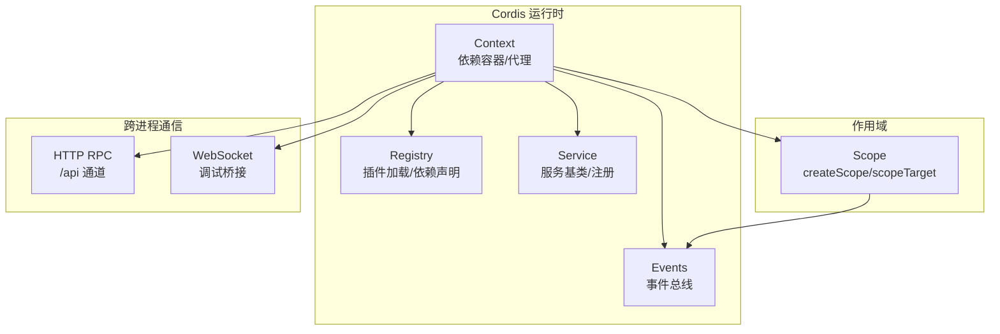
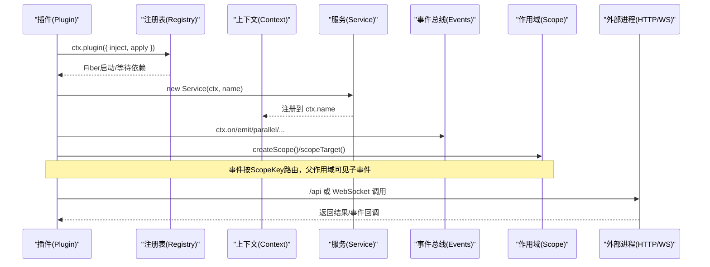
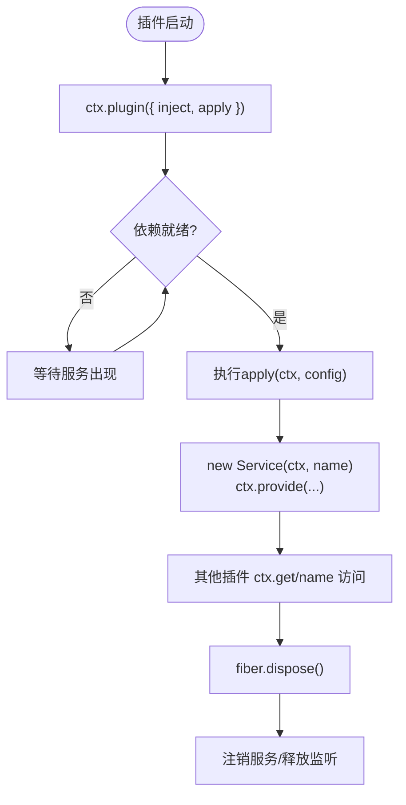
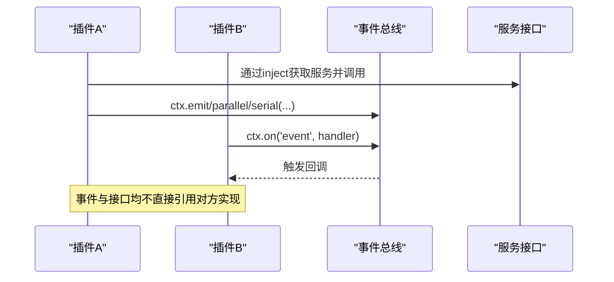
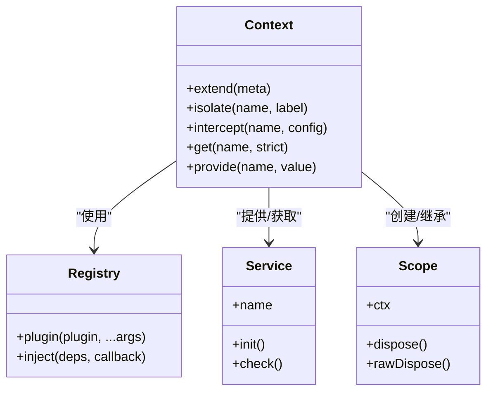
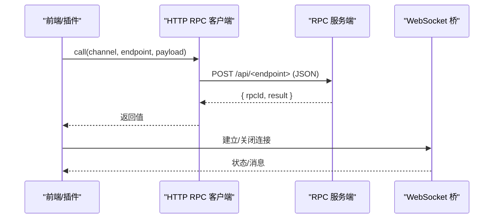
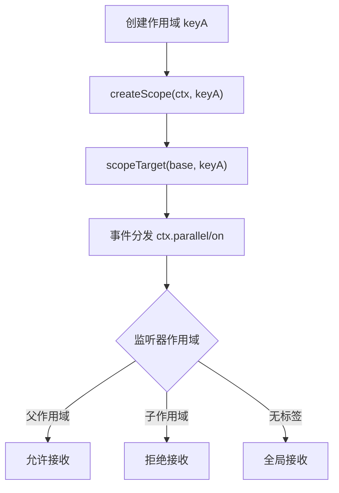
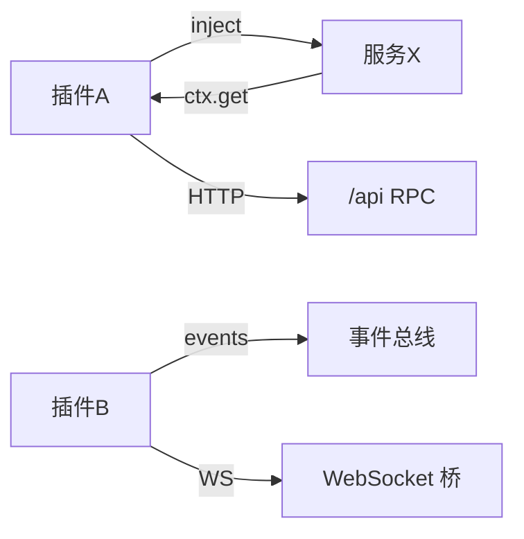

# 组件通信模式

<cite>
**本文引用的文件**
- [docs/cordis-api/context.md](file://docs/cordis-api/context.md)
- [docs/cordis-api/registry.md](file://docs/cordis-api/registry.md)
- [docs/cordis-api/service.md](file://docs/cordis-api/service.md)
- [docs/cordis-api/events.md](file://docs/cordis-api/events.md)
- [packages/core/scope/src/index.ts](file://packages/core/scope/src/index.ts)
- [packages/client/connection/src/api-path.ts](file://packages/client/connection/src/api-path.ts)
- [packages/client/connection/src/client/rpc.ts](file://packages/client/connection/src/client/rpc.ts)
- [packages/client/connection/src/rpc-host.ts](file://packages/client/connection/src/rpc-host.ts)
- [packages/experimental/inspector/src/worker/bridge/endpoint.ts](file://packages/experimental/inspector/src/worker/bridge/endpoint.ts)
</cite>

## 目录
1. [简介](#简介)
2. [项目结构](#项目结构)
3. [核心组件](#核心组件)
4. [架构总览](#架构总览)
5. [详细组件分析](#详细组件分析)
6. [依赖关系分析](#依赖关系分析)
7. [性能考虑](#性能考虑)
8. [故障排查指南](#故障排查指南)
9. [结论](#结论)
10. [附录](#附录)

## 简介
本文件面向DeepSeek Harness的组件通信模式，聚焦Cordis框架下的服务发现、插件解耦通信、依赖注入与作用域控制，以及跨进程通信（IPC、WebSocket、HTTP API）机制。文档以“由浅入深”的方式组织：先给出系统级架构图与数据流，再深入到具体实现要点、最佳实践与性能优化建议，并附带可追溯的代码片段路径，帮助读者快速定位源码。

## 项目结构
围绕组件通信的关键位置如下：
- Cordis上下文与服务注册：通过Context、Registry、Service等能力提供依赖注入、服务发现与生命周期管理。
- 事件总线：通过ctx.on/emit/parallel/serial/bail/waterfall等API实现插件间解耦通信。
- 作用域与路由：scope模块提供基于ScopeKey的上下文标签与事件路由，支持父子作用域的继承与隔离。
- 跨进程通信：client/connection提供基于HTTP的RPC调用与通道；experimental/inspector包含WebSocket桥接与关闭逻辑。

图表来源
- [docs/cordis-api/context.md:14-96](file://docs/cordis-api/context.md#L14-L96)
- [docs/cordis-api/registry.md:8-56](file://docs/cordis-api/registry.md#L8-L56)
- [docs/cordis-api/service.md:6-12](file://docs/cordis-api/service.md#L6-L12)
- [docs/cordis-api/events.md:8-123](file://docs/cordis-api/events.md#L8-L123)
- [packages/core/scope/src/index.ts:129-185](file://packages/core/scope/src/index.ts#L129-L185)
- [packages/client/connection/src/api-path.ts:1-7](file://packages/client/connection/src/api-path.ts#L1-L7)
- [packages/client/connection/src/client/rpc.ts:25-71](file://packages/client/connection/src/client/rpc.ts#L25-L71)
- [packages/experimental/inspector/src/worker/bridge/endpoint.ts:289-304](file://packages/experimental/inspector/src/worker/bridge/endpoint.ts#L289-L304)

章节来源
- [docs/cordis-api/context.md:14-96](file://docs/cordis-api/context.md#L14-L96)
- [docs/cordis-api/registry.md:8-56](file://docs/cordis-api/registry.md#L8-L56)
- [docs/cordis-api/service.md:6-12](file://docs/cordis-api/service.md#L6-L12)
- [docs/cordis-api/events.md:8-123](file://docs/cordis-api/events.md#L8-L123)
- [packages/core/scope/src/index.ts:129-185](file://packages/core/scope/src/index.ts#L129-L185)
- [packages/client/connection/src/api-path.ts:1-7](file://packages/client/connection/src/api-path.ts#L1-L7)
- [packages/client/connection/src/client/rpc.ts:25-71](file://packages/client/connection/src/client/rpc.ts#L25-L71)
- [packages/experimental/inspector/src/worker/bridge/endpoint.ts:289-304](file://packages/experimental/inspector/src/worker/bridge/endpoint.ts#L289-L304)

## 核心组件
- 上下文（Context）：作为依赖容器与代理，暴露extend/isolate/intercept等方法创建子上下文与作用域，同时混入事件、日志、反射与注册表能力。
- 注册表（Registry）：负责插件加载、依赖声明（inject）、服务提供（provide）与生命周期管理。
- 服务（Service）：基于Context的服务基类，实例化即注册到ctx.name，随fiber卸载自动注销。
- 事件（Events）：提供emit/parallel/serial/bail/waterfall等多种分发模式，支持on/once订阅与全局/前置选项。
- 作用域（Scope）：为Context与事件增加ScopeKey标签，实现按作用域的路由与隔离，支持父子链路与事件向上可见。
- 跨进程通信：HTTP RPC通过统一前缀/api进行请求与响应封装；WebSocket用于调试桥接与资源清理。

章节来源
- [docs/cordis-api/context.md:14-96](file://docs/cordis-api/context.md#L14-L96)
- [docs/cordis-api/registry.md:8-56](file://docs/cordis-api/registry.md#L8-L56)
- [docs/cordis-api/service.md:6-12](file://docs/cordis-api/service.md#L6-L12)
- [docs/cordis-api/events.md:8-123](file://docs/cordis-api/events.md#L8-L123)
- [packages/core/scope/src/index.ts:129-185](file://packages/core/scope/src/index.ts#L129-L185)
- [packages/client/connection/src/api-path.ts:1-7](file://packages/client/connection/src/api-path.ts#L1-L7)
- [packages/client/connection/src/client/rpc.ts:25-71](file://packages/client/connection/src/client/rpc.ts#L25-L71)
- [packages/experimental/inspector/src/worker/bridge/endpoint.ts:289-304](file://packages/experimental/inspector/src/worker/bridge/endpoint.ts#L289-L304)

## 架构总览
下图展示了插件在Cordis中的加载、服务注册、事件通信与作用域路由，以及与外部进程的HTTP/WS通信边界。

图表来源
- [docs/cordis-api/registry.md:8-56](file://docs/cordis-api/registry.md#L8-L56)
- [docs/cordis-api/service.md:6-12](file://docs/cordis-api/service.md#L6-L12)
- [docs/cordis-api/events.md:8-123](file://docs/cordis-api/events.md#L8-L123)
- [packages/core/scope/src/index.ts:129-185](file://packages/core/scope/src/index.ts#L129-L185)
- [packages/client/connection/src/api-path.ts:1-7](file://packages/client/connection/src/api-path.ts#L1-L7)
- [packages/client/connection/src/client/rpc.ts:25-71](file://packages/client/connection/src/client/rpc.ts#L25-L71)
- [packages/experimental/inspector/src/worker/bridge/endpoint.ts:289-304](file://packages/experimental/inspector/src/worker/bridge/endpoint.ts#L289-L304)

## 详细组件分析

### 服务发现与生命周期（注册、查找、销毁）
- 服务注册：Service子类构造时立即注册到ctx.name，随所属fiber卸载自动移除。
- 服务查找：通过ctx.get(name, strict?)读取当前作用域内的服务实现；ctx.provide(name, value)在当前fiber内提供实现，并在disposer或fiber卸载时注销。
- 生命周期：插件通过ctx.plugin加载，返回Fiber；await Fiber即可等待启动完成。ctx.inject(deps, callback)是快捷方式，当依赖变化时会卸载并重跑回调。
- 拦截与覆盖：ctx.intercept(name, config)为后续插件叠加服务拦截配置；ctx.isolate(name, label)创建独立作用域，避免影响父作用域。

图表来源
- [docs/cordis-api/registry.md:8-56](file://docs/cordis-api/registry.md#L8-L56)
- [docs/cordis-api/service.md:6-12](file://docs/cordis-api/service.md#L6-L12)
- [docs/cordis-api/context.md:237-314](file://docs/cordis-api/context.md#L237-L314)

章节来源
- [docs/cordis-api/registry.md:8-56](file://docs/cordis-api/registry.md#L8-L56)
- [docs/cordis-api/service.md:6-12](file://docs/cordis-api/service.md#L6-L12)
- [docs/cordis-api/context.md:237-314](file://docs/cordis-api/context.md#L237-L314)

### 插件间解耦通信（直接调用、事件总线、服务接口）
- 直接调用：通过ctx.get('service')获取服务实例后直接调用方法，适合强耦合但高性能场景。
- 事件总线：使用ctx.emit/parallel/serial/bail/waterfall进行解耦广播或流水线处理；ctx.on/once订阅，支持prepend/global选项。
- 服务接口：将能力抽象为Service，并通过inject声明依赖，使插件仅依赖接口而非具体实现。

图表来源
- [docs/cordis-api/events.md:8-123](file://docs/cordis-api/events.md#L8-L123)
- [docs/cordis-api/registry.md:123-150](file://docs/cordis-api/registry.md#L123-L150)

章节来源
- [docs/cordis-api/events.md:8-123](file://docs/cordis-api/events.md#L8-L123)
- [docs/cordis-api/registry.md:123-150](file://docs/cordis-api/registry.md#L123-L150)

### 依赖注入与容器管理（作用域控制）
- 依赖声明：插件可通过inject数组或对象声明所需服务；ctx.inject(deps, callback)会在依赖可用时运行回调。
- 作用域隔离：ctx.isolate(name, label)为指定服务创建独立作用域；ctx.extend(meta)创建携带元数据的子上下文。
- 作用域路由：scope模块通过createScope与scopeTarget为Context与事件附加ScopeKey，实现“父作用域可见子事件”的定向路由。

图表来源
- [docs/cordis-api/context.md:14-96](file://docs/cordis-api/context.md#L14-L96)
- [docs/cordis-api/registry.md:8-56](file://docs/cordis-api/registry.md#L8-L56)
- [docs/cordis-api/service.md:6-12](file://docs/cordis-api/service.md#L6-L12)
- [packages/core/scope/src/index.ts:129-185](file://packages/core/scope/src/index.ts#L129-L185)

章节来源
- [docs/cordis-api/context.md:14-96](file://docs/cordis-api/context.md#L14-L96)
- [docs/cordis-api/registry.md:8-56](file://docs/cordis-api/registry.md#L8-L56)
- [docs/cordis-api/service.md:6-12](file://docs/cordis-api/service.md#L6-L12)
- [packages/core/scope/src/index.ts:129-185](file://packages/core/scope/src/index.ts#L129-L185)

### 跨进程通信（IPC、WebSocket、HTTP API）
- HTTP API：统一使用/api前缀进行RPC调用；客户端封装请求ID与响应信封校验，服务端解析路径并路由到端点。
- WebSocket：调试桥接中提供关闭服务器等能力，便于资源回收。
- 错误处理：地址占用等常见错误可被识别并处理。

图表来源
- [packages/client/connection/src/api-path.ts:1-7](file://packages/client/connection/src/api-path.ts#L1-L7)
- [packages/client/connection/src/client/rpc.ts:25-71](file://packages/client/connection/src/client/rpc.ts#L25-L71)
- [packages/client/connection/src/rpc-host.ts:259-296](file://packages/client/connection/src/rpc-host.ts#L259-L296)
- [packages/experimental/inspector/src/worker/bridge/endpoint.ts:289-304](file://packages/experimental/inspector/src/worker/bridge/endpoint.ts#L289-L304)

章节来源
- [packages/client/connection/src/api-path.ts:1-7](file://packages/client/connection/src/api-path.ts#L1-L7)
- [packages/client/connection/src/client/rpc.ts:25-71](file://packages/client/connection/src/client/rpc.ts#L25-L71)
- [packages/client/connection/src/rpc-host.ts:259-296](file://packages/client/connection/src/rpc-host.ts#L259-L296)
- [packages/experimental/inspector/src/worker/bridge/endpoint.ts:289-304](file://packages/experimental/inspector/src/worker/bridge/endpoint.ts#L289-L304)

### 事件路由与作用域传播
- 作用域键：每个ScopeKey代表一个路由标识，createScope在Context上打标签，scopeTarget构建带过滤器的接收器。
- 路由规则：事件从子作用域向父作用域可见；未标记的监听器默认全局可见；通过scopeChainOf可遍历祖先链。
- 安全与一致性：绑定父作用域时检测环，防止循环依赖导致无限遍历。

图表来源
- [packages/core/scope/src/index.ts:129-185](file://packages/core/scope/src/index.ts#L129-L185)

章节来源
- [packages/core/scope/src/index.ts:129-185](file://packages/core/scope/src/index.ts#L129-L185)

## 依赖关系分析
- 低耦合：插件通过inject声明服务依赖，避免硬编码引用；事件总线进一步降低耦合度。
- 作用域隔离：通过isolate与scope，不同会话/组件可拥有独立服务实现与事件路由。
- 跨进程边界：HTTP RPC与WebSocket作为明确的通信边界，便于扩展与监控。

图表来源
- [docs/cordis-api/registry.md:123-150](file://docs/cordis-api/registry.md#L123-L150)
- [docs/cordis-api/events.md:8-123](file://docs/cordis-api/events.md#L8-L123)
- [packages/client/connection/src/api-path.ts:1-7](file://packages/client/connection/src/api-path.ts#L1-L7)
- [packages/experimental/inspector/src/worker/bridge/endpoint.ts:289-304](file://packages/experimental/inspector/src/worker/bridge/endpoint.ts#L289-L304)

章节来源
- [docs/cordis-api/registry.md:123-150](file://docs/cordis-api/registry.md#L123-L150)
- [docs/cordis-api/events.md:8-123](file://docs/cordis-api/events.md#L8-L123)
- [packages/client/connection/src/api-path.ts:1-7](file://packages/client/connection/src/api-path.ts#L1-L7)
- [packages/experimental/inspector/src/worker/bridge/endpoint.ts:289-304](file://packages/experimental/inspector/src/worker/bridge/endpoint.ts#L289-L304)

## 性能考虑
- 事件分发策略选择：高频通知优先使用emit（同步忽略返回值），需要并发处理用parallel，顺序处理用serial，短路逻辑用bail，管道处理用waterfall。
- 作用域粒度：尽量缩小作用域范围，减少不必要的事件广播与依赖解析开销。
- HTTP RPC：复用连接、批量请求、合理设置超时与重试，避免频繁短连接。
- 服务懒加载：通过inject延迟加载重型服务，仅在必要时初始化。

[本节为通用指导，不直接分析具体文件]

## 故障排查指南
- 端口占用：在WebSocket桥接中识别EADDRINUSE错误并进行恢复处理。
- RPC失败：检查/api路径与端点命名是否合法，确认channel与endpoint匹配。
- 作用域问题：若事件未按预期路由，检查scopeTarget与监听器作用域层级是否正确。
- 依赖缺失：确保插件inject声明完整，或使用ctx.get(name)并处理undefined情况。

章节来源
- [packages/experimental/inspector/src/worker/bridge/endpoint.ts:289-304](file://packages/experimental/inspector/src/worker/bridge/endpoint.ts#L289-L304)
- [packages/client/connection/src/rpc-host.ts:259-296](file://packages/client/connection/src/rpc-host.ts#L259-L296)
- [packages/core/scope/src/index.ts:129-185](file://packages/core/scope/src/index.ts#L129-L185)

## 结论
DeepSeek Harness通过Cordis框架提供了强大的组件通信能力：以Context为核心的依赖注入与作用域控制，以Service为边界的稳定接口，以Events为纽带的高内聚低耦合通信，并以HTTP/WS作为清晰的跨进程边界。遵循本文的最佳实践与性能建议，可实现可靠、可扩展且高效的组件通信体系。

[本节为总结性内容，不直接分析具体文件]

## 附录
- 代码示例路径（不展示代码内容，仅提供定位）：
  - 插件加载与依赖注入：[docs/cordis-api/registry.md:8-56](file://docs/cordis-api/registry.md#L8-L56)
  - 服务注册与生命周期：[docs/cordis-api/service.md:6-12](file://docs/cordis-api/service.md#L6-L12)
  - 事件总线用法：[docs/cordis-api/events.md:8-123](file://docs/cordis-api/events.md#L8-L123)
  - 作用域创建与路由：[packages/core/scope/src/index.ts:129-185](file://packages/core/scope/src/index.ts#L129-L185)
  - HTTP RPC客户端与服务端：[packages/client/connection/src/client/rpc.ts:25-71](file://packages/client/connection/src/client/rpc.ts#L25-L71), [packages/client/connection/src/rpc-host.ts:259-296](file://packages/client/connection/src/rpc-host.ts#L259-L296)
  - WebSocket桥接与关闭：[packages/experimental/inspector/src/worker/bridge/endpoint.ts:289-304](file://packages/experimental/inspector/src/worker/bridge/endpoint.ts#L289-L304)

[本节为参考索引，不直接分析具体文件]