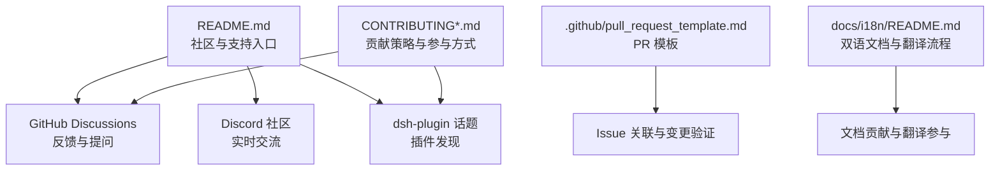
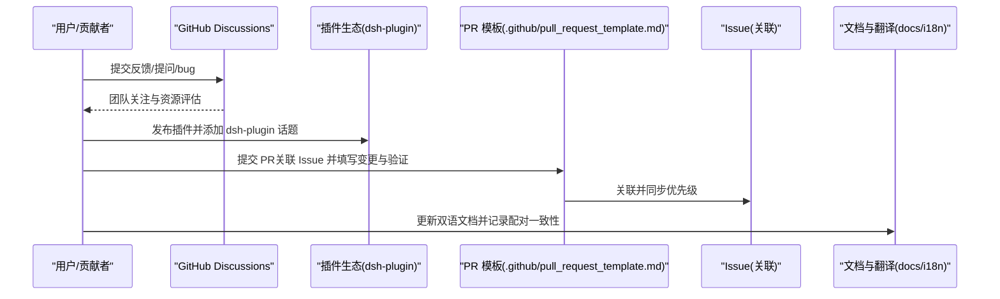
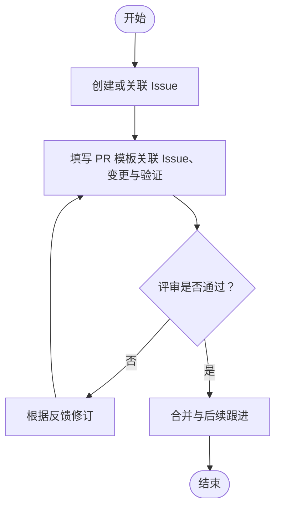
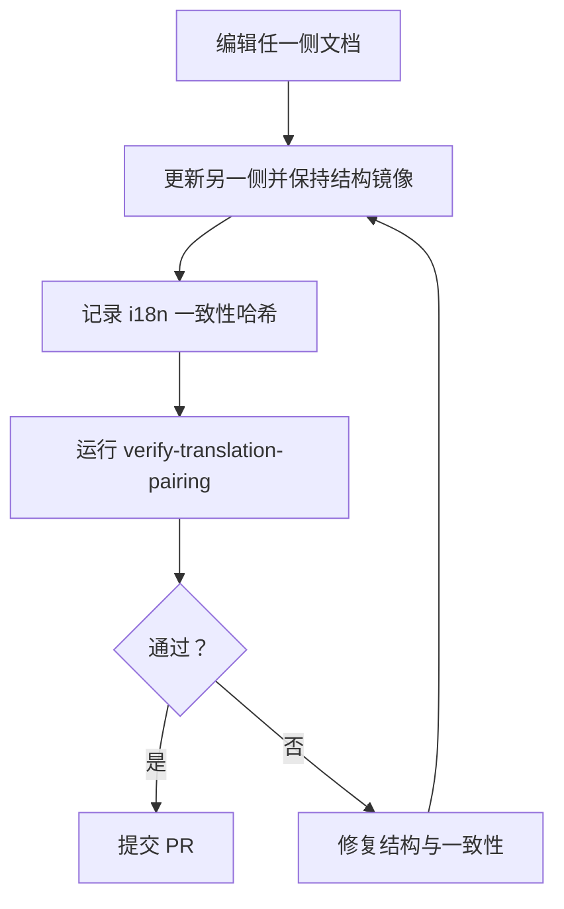
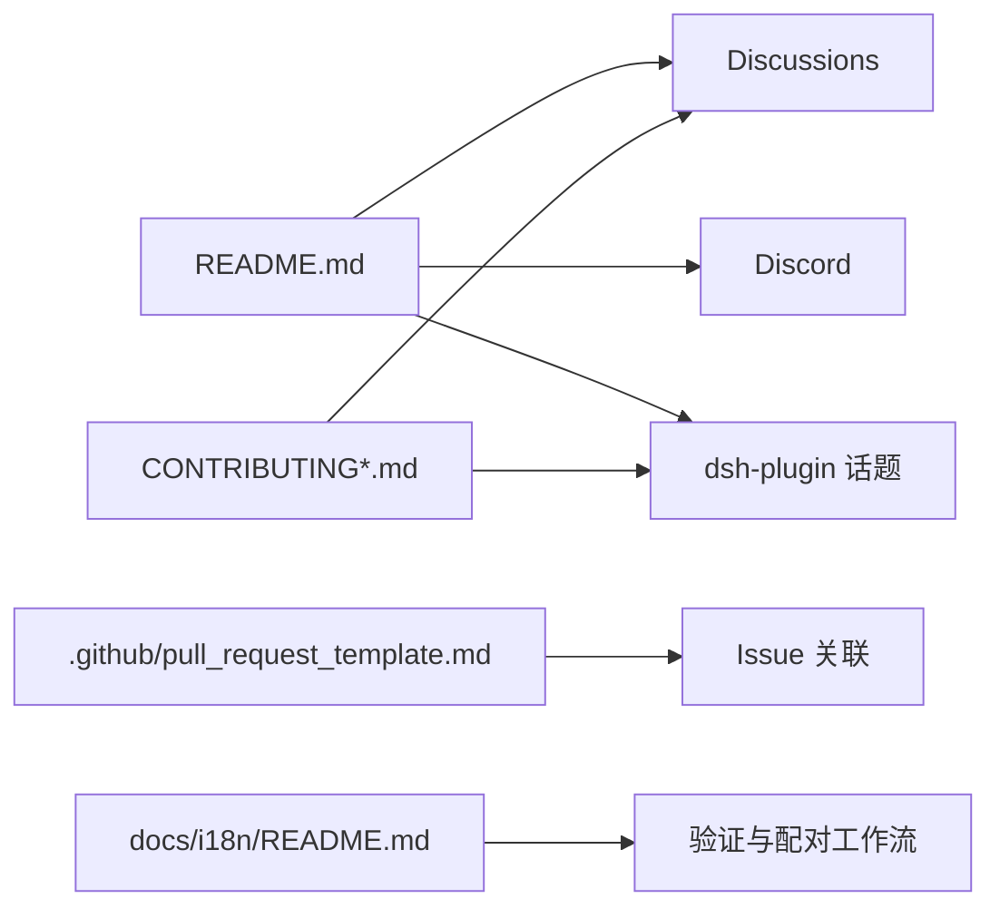

# 社区与支持

<cite>
**本文引用的文件**
- [README.md](file://README.md)
- [CONTRIBUTING.md](file://CONTRIBUTING.md)
- [CONTRIBUTING.zh.md](file://CONTRIBUTING.zh.md)
- [.github/pull_request_template.md](file://.github/pull_request_template.md)
- [docs/i18n/README.md](file://docs/i18n/README.md)
</cite>

## 目录
1. [简介](#简介)
2. [项目结构](#项目结构)
3. [核心组件](#核心组件)
4. [架构总览](#架构总览)
5. [详细组件分析](#详细组件分析)
6. [依赖分析](#依赖分析)
7. [性能考虑](#性能考虑)
8. [故障排查指南](#故障排查指南)
9. [结论](#结论)
10. [附录](#附录)

## 简介
本文件为 DeepSeek Harness（简称 dsh）的社区与支持指南，面向希望参与讨论、反馈问题、贡献文档与插件生态的开发者与用户。内容涵盖：
- 如何在 GitHub Discussions 中高效提问与反馈
- 如何报告 bug 与提交功能请求（含 Issue 模板与最佳实践）
- 插件生态参与方式：发布与发现 dsh-plugin
- 贡献指南：代码规范、提交流程与审查标准
- Discord 社区使用与交流规则
- 文档贡献流程与多语言翻译参与方式
- 常见问题解答与获取帮助的渠道
- 版本发布周期与支持政策
- 社区行为准则与协作规范

## 项目结构
仓库围绕“一切皆插件”的架构组织，社区与支持相关的入口与约定主要位于根级说明与 GitHub 配置中：
- 根级 README 提供社区与支持入口链接（Discussions、Discord、dsh-plugin 话题）
- CONTRIBUTING 系列文件明确当前阶段的外部贡献策略与可参与的途径
- .github/pull_request_template.md 定义了 PR 关联 Issue 与变更验证的格式要求
- docs/i18n/README.md 定义双语文档配对契约、检查机制与翻译工作流

图表来源
- [README.md:43-51](file://README.md#L43-L51)
- [CONTRIBUTING.md:9-21](file://CONTRIBUTING.md#L9-L21)
- [CONTRIBUTING.zh.md:9-21](file://CONTRIBUTING.zh.md#L9-L21)
- [.github/pull_request_template.md:1-14](file://.github/pull_request_template.md#L1-L14)
- [docs/i18n/README.md:7-22](file://docs/i18n/README.md#L7-L22)

章节来源
- [README.md:43-51](file://README.md#L43-L51)
- [CONTRIBUTING.md:9-21](file://CONTRIBUTING.md#L9-L21)
- [CONTRIBUTING.zh.md:9-21](file://CONTRIBUTING.zh.md#L9-L21)
- [.github/pull_request_template.md:1-14](file://.github/pull_request_template.md#L1-L14)
- [docs/i18n/README.md:7-22](file://docs/i18n/README.md#L7-L22)

## 核心组件
- 社区讨论与反馈通道：通过 GitHub Discussions 提交反馈或 bug 报告；团队会关注并据此分配资源
- 插件生态：鼓励创建并分享插件，使用 dsh-plugin 话题提升可发现性
- 贡献策略：当前阶段不接受外部 PR，但欢迎以讨论、文档、插件等方式参与
- 文档与翻译：遵循双语配对契约，确保中英文档一致性与可维护性

章节来源
- [README.md:43-51](file://README.md#L43-L51)
- [CONTRIBUTING.md:9-21](file://CONTRIBUTING.md#L9-L21)
- [CONTRIBUTING.zh.md:9-21](file://CONTRIBUTING.zh.md#L9-L21)
- [docs/i18n/README.md:7-22](file://docs/i18n/README.md#L7-L22)

## 架构总览
下图展示了社区与支持在仓库中的关键交互点：用户通过 Discussions 反馈问题，插件作者通过 dsh-plugin 话题发布插件，贡献者依据贡献指南参与文档与生态建设，PR 模板规范了变更与验证流程。

图表来源
- [README.md:43-51](file://README.md#L43-L51)
- [CONTRIBUTING.md:9-21](file://CONTRIBUTING.md#L9-L21)
- [.github/pull_request_template.md:1-14](file://.github/pull_request_template.md#L1-L14)
- [docs/i18n/README.md:7-22](file://docs/i18n/README.md#L7-L22)

## 详细组件分析

### 社区讨论与提问技巧（GitHub Discussions）
- 使用 Discussions 提交反馈或 bug 报告，便于团队跟踪与资源分配
- 为重要讨论投票，帮助团队优先处理高价值问题
- 提问建议：
  - 清晰描述问题背景、复现步骤与环境信息
  - 附上相关日志或截图（如有）
  - 指明期望结果与实际结果差异
  - 若涉及插件，说明插件名称与版本

章节来源
- [README.md:43-51](file://README.md#L43-L51)
- [CONTRIBUTING.md:9-21](file://CONTRIBUTING.md#L9-L21)
- [CONTRIBUTING.zh.md:9-21](file://CONTRIBUTING.zh.md#L9-L21)

### 报告 Bug 与提交功能请求（Issue 模板与最佳实践）
- 当前阶段不直接接受外部 PR，但可通过 Discussions 反馈问题与需求
- 如需提交 PR（内部或特定场景），请遵循 PR 模板：
  - 关联 Issue（Fixes/Related to）
  - 填写变更与验证摘要
  - 保持解决型 PR 与 Issue 优先级一致

图表来源
- [.github/pull_request_template.md:1-14](file://.github/pull_request_template.md#L1-L14)

章节来源
- [.github/pull_request_template.md:1-14](file://.github/pull_request_template.md#L1-L14)

### 插件生态系统参与（发布与发现 dsh-plugin）
- 创建插件并分享给社区
- 为 GitHub 项目添加 dsh-plugin 话题，提升可发现性
- 官方仓库定位为理念、示例与灵感来源，鼓励社区生态独立发展

章节来源
- [CONTRIBUTING.md:9-21](file://CONTRIBUTING.md#L9-L21)
- [CONTRIBUTING.zh.md:9-21](file://CONTRIBUTING.zh.md#L9-L21)
- [README.md:43-51](file://README.md#L43-L51)

### 贡献指南（代码规范、提交流程、审查标准）
- 当前阶段不接受外部 PR，但欢迎通过以下方式贡献：
  - 在 Discussions 中发现并报告问题或 bug
  - 为插件生态贡献力量（开发插件、撰写指南、回答问题）
- 提交流程（如适用）：
  - 遵循 PR 模板，关联 Issue 并填写变更与验证
- 审查标准：
  - 变更需具备清晰的动机与验证
  - 保持与 Issue 优先级一致

章节来源
- [CONTRIBUTING.md:9-21](file://CONTRIBUTING.md#L9-L21)
- [CONTRIBUTING.zh.md:9-21](file://CONTRIBUTING.zh.md#L9-L21)
- [.github/pull_request_template.md:1-14](file://.github/pull_request_template.md#L1-L14)

### Discord 社区使用方法与交流规则
- 加入 DeepSeek Harness Discord 社区进行实时交流与互助
- 建议在 Discord 中：
  - 先查阅现有文档与 Discussions
  - 提问时提供必要上下文与复现信息
  - 遵守社区礼仪，尊重他人时间与贡献

章节来源
- [README.md:43-51](file://README.md#L43-L51)

### 文档贡献流程与多语言翻译参与
- 所有受控文档需维护英文与简体中文双语配对
- 配对契约要点：
  - 三种文件为一对：英文、中文、i18n 一致性记录
  - 语言切换器：中文文件立即回链英文，英文文件回链中文（生成源除外）
  - 结构镜像：标题层级、列表、表格、代码块等严格对应
- 工作流与检查：
  - 使用 verify-translation-pairing 工具校验配对完整性与一致性
  - 编辑任一侧后，需在同一 PR 中更新另一侧并重新记录哈希
  - 排除清单与范围由脚本与文档共同约束

图表来源
- [docs/i18n/README.md:7-22](file://docs/i18n/README.md#L7-L22)
- [docs/i18n/README.md:24-40](file://docs/i18n/README.md#L24-L40)

章节来源
- [docs/i18n/README.md:7-22](file://docs/i18n/README.md#L7-L22)
- [docs/i18n/README.md:24-40](file://docs/i18n/README.md#L24-L40)

### 常见问题解答与获取帮助的渠道
- 首选渠道：GitHub Discussions（反馈 bug、提问、功能请求）
- 实时交流：Discord 社区
- 插件发现：搜索 dsh-plugin 话题
- 文档参考：阅读仓库内 docs 与用户指南

章节来源
- [README.md:43-51](file://README.md#L43-L51)

### 版本发布周期与支持政策
- 项目处于开发者预览阶段，迭代快速，可能存在破坏性变更
- 运行前请阅读安全通知
- 支持政策与发布节奏以官方公告为准

章节来源
- [README.md:11-16](file://README.md#L11-L16)

### 社区行为准则与协作规范
- 品牌与社区环境强调清晰有序，鼓励友好与可持续的协作
- 对于不符合规范的少数情况，团队可能联系相关方进行调整以维护生态秩序

章节来源
- [BRAND_GUIDELINES.md:12-13](file://BRAND_GUIDELINES.md#L12-L13)

## 依赖分析
社区与支持的关键依赖关系如下：
- README 作为统一入口，指向 Discussions、Discord 与 dsh-plugin 话题
- CONTRIBUTING 指导贡献路径与生态参与方式
- PR 模板规范变更与验证流程，确保 Issue 关联与优先级一致
- i18n 文档契约保障双语一致性与可维护性

图表来源
- [README.md:43-51](file://README.md#L43-L51)
- [CONTRIBUTING.md:9-21](file://CONTRIBUTING.md#L9-L21)
- [.github/pull_request_template.md:1-14](file://.github/pull_request_template.md#L1-L14)
- [docs/i18n/README.md:7-22](file://docs/i18n/README.md#L7-L22)

## 性能考虑
- 社区支持与文档流程的性能主要体现在响应效率与可发现性：
  - 使用 Discussions 集中反馈，减少重复沟通
  - 使用 dsh-plugin 话题提升插件可发现性
  - 遵循 i18n 配对契约，降低翻译与维护成本

## 故障排查指南
- 若 Discussions 未获及时回复：
  - 为讨论投票以提升可见度
  - 补充必要信息与复现步骤
- 若插件无法被发现：
  - 确认已添加 dsh-plugin 话题
  - 检查仓库元数据与描述是否清晰
- 若双语文档校验失败：
  - 检查 i18n 一致性记录哈希是否更新
  - 确保结构镜像与语言切换器正确

章节来源
- [CONTRIBUTING.md:9-21](file://CONTRIBUTING.md#L9-L21)
- [CONTRIBUTING.zh.md:9-21](file://CONTRIBUTING.zh.md#L9-L21)
- [docs/i18n/README.md:24-40](file://docs/i18n/README.md#L24-L40)

## 结论
DeepSeek Harness 的社区与支持体系以 Discussions 为核心反馈渠道，结合 Discord 实时交流与 dsh-plugin 插件生态，形成开放、有序的协作环境。当前阶段虽暂不接受外部 PR，但仍鼓励通过讨论、文档与插件贡献推动生态发展。遵循 i18n 配对契约与 PR 模板，有助于提升协作效率与质量。

## 附录
- 快速链接：
  - 社区与支持入口：README 中的 Discussions、Discord 与 dsh-plugin 话题
  - 贡献指南：CONTRIBUTING.md / CONTRIBUTING.zh.md
  - PR 模板：.github/pull_request_template.md
  - 双语文档契约：docs/i18n/README.md