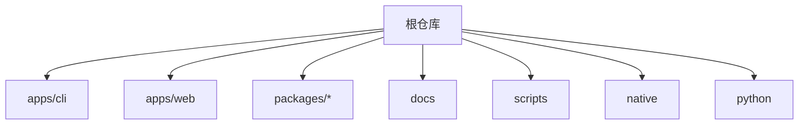
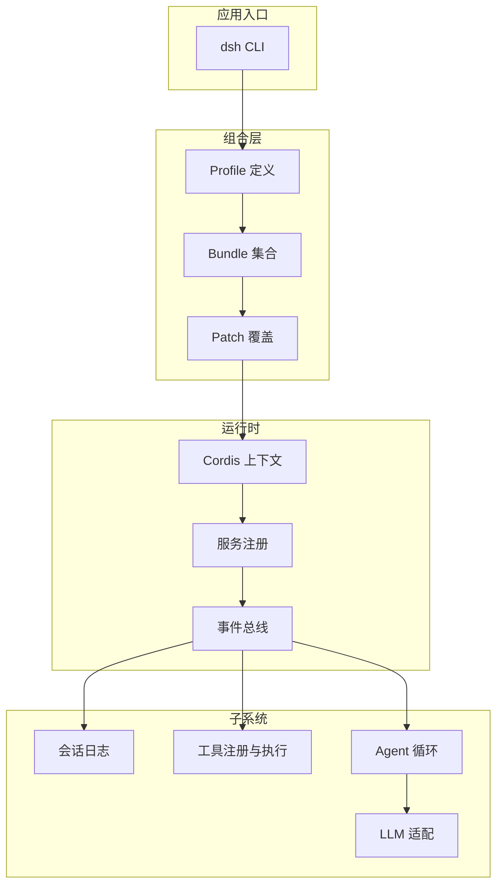
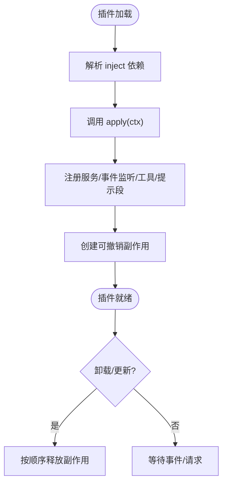
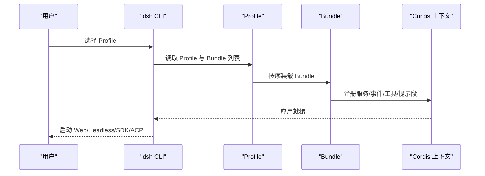
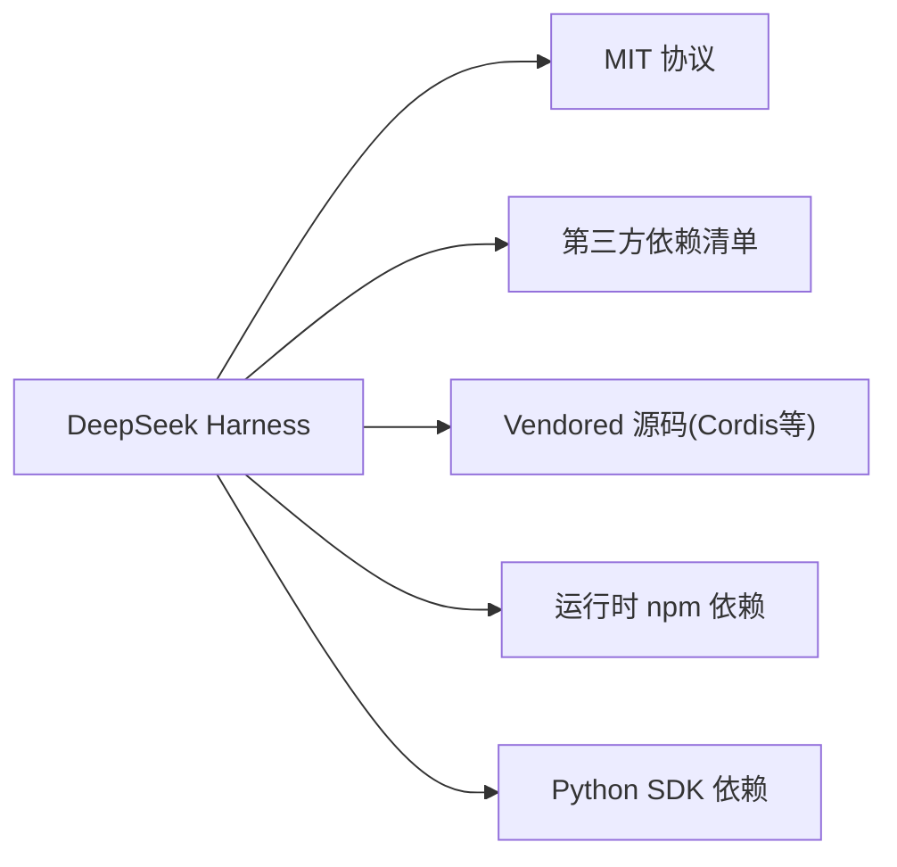

# 项目介绍

<cite>
**本文引用的文件**
- [README.md](file://README.md)
- [package.json](file://package.json)
- [THIRD_PARTY_NOTICES.md](file://THIRD_PARTY_NOTICES.md)
- [docs/architecture.md](file://docs/architecture.md)
- [docs/cordis-primer.md](file://docs/cordis-primer.md)
- [docs/glossary.md](file://docs/glossary.md)
- [docs/subsystems/core.md](file://docs/subsystems/core.md)
</cite>

## 目录
1. [引言](#引言)
2. [项目结构](#项目结构)
3. [核心组件](#核心组件)
4. [架构总览](#架构总览)
5. [详细组件分析](#详细组件分析)
6. [依赖分析](#依赖分析)
7. [性能考量](#性能考量)
8. [故障排查指南](#故障排查指南)
9. [结论](#结论)
10. [附录](#附录)

## 引言
DeepSeek Harness（简称 dsh）是由 DeepSeek AI 开源的智能体编排平台，采用“一切皆插件”的架构，基于 Cordis 插件框架构建。其设计目标是让模型适配器、工具注册表、会话日志、智能体循环等所有能力都以插件形式提供，从而通过配置即可替换与组合，形成可插拔、可扩展、可观测的智能体运行时。

项目的核心价值在于：
- 以插件为中心的可组合性：任何能力均可被声明、挂载、卸载，且具备可逆副作用，便于热更新与回滚。
- 时空可组合性编程范式：通过服务、事件、作用域与生命周期管理，将“何时何地如何执行”的能力显式化，使复杂智能体工作流具备强一致性与可恢复性。
- 面向多形态应用：同一套内核支持 Web UI、无头运行、SDK JSON-RPC、自动化 ACP 服务器等多种启动形态，统一由 CLI 选择 Profile 驱动。

本项目处于开发者预览阶段，迭代快速，存在不兼容变更的可能；使用前请阅读安全须知。

**章节来源**
- [README.md:5-15](file://README.md#L5-L15)

## 项目结构
仓库采用 Monorepo 组织，包含应用、包、文档、脚本与测试等。顶层 package.json 定义了 workspaces、脚本命令与开发/发布流程；apps 下提供 CLI 与 Web 前端；packages 下按子系统划分核心能力；docs 提供架构、子系统、教程与用户指南；scripts 提供构建、验证、生成与质量门禁；native 提供原生安全沙箱相关能力；python 提供 Python SDK 与运行时。



**图表来源**
- [package.json:11-18](file://package.json#L11-L18)

**章节来源**
- [package.json:11-18](file://package.json#L11-L18)

## 核心组件
- 插件框架与上下文：Cordis 提供 Service、Context、Event、Effect 等基础抽象，所有产品能力均以插件形式贡献到共享上下文。
- 应用启动与组合：通过 Profile + Bundle 的分层组合机制，在启动时按序装配插件树，支持热重载与覆盖补丁。
- 核心子系统：会话日志、系统提示组装、工具注册与执行管线、Agent 接口与默认循环、作用域与事件体系。
- 扩展点与能力接缝：通过事件与 Provider 实现能力解耦，如 LLM 适配、文件系统策略、子代理、Webhook 等。

这些组件共同构成“一切皆插件”的运行基座，使得模型、工具、存储、UI 等均可按需替换与组合。

**章节来源**
- [docs/architecture.md:9-29](file://docs/architecture.md#L9-L29)
- [docs/cordis-primer.md:7-14](file://docs/cordis-primer.md#L7-L14)

## 架构总览
DeepSeek Harness 的架构围绕“插件树 + 事件总线 + 能力接缝”展开：
- 插件树：Profile 声明 Bundle 列表，Bundle 提供配置与代码挂载；启动时按序装配，支持 patch 覆盖。
- 事件总线：Typed Events 作为跨插件通信机制，支持 emit/waterfall/parallel/serial/bail 多种分发模式。
- 能力接缝：Service Definition + Provider + Consumer 三元角色，确保能力可替换、可组合、可观测。



**图表来源**
- [docs/architecture.md:15-47](file://docs/architecture.md#L15-L47)
- [docs/cordis-primer.md:15-39](file://docs/cordis-primer.md#L15-L39)

**章节来源**
- [docs/architecture.md:9-47](file://docs/architecture.md#L9-L47)
- [docs/cordis-primer.md:7-39](file://docs/cordis-primer.md#L7-L39)

## 详细组件分析

### 插件框架与上下文（Cordis）
- 插件即 Service：函数或类实现 Service，通过 inject 声明依赖，apply(ctx) 中完成注册与副作用。
- 上下文即服务仓库：插件通过 ctx.<key> 访问服务，避免硬耦合。
- 类型化事件：通过 TypeScript 声明合并扩展事件集，支持多种分发模式，保证契约与行为一致。
- 可逆副作用：注册项通过 effect/on 安装，卸载时自动回滚，保障热更新与稳定性。



**图表来源**
- [docs/cordis-primer.md:7-14](file://docs/cordis-primer.md#L7-L14)
- [docs/cordis-primer.md:15-39](file://docs/cordis-primer.md#L15-L39)

**章节来源**
- [docs/cordis-primer.md:7-39](file://docs/cordis-primer.md#L7-L39)

### 应用启动与组合（Profile + Bundle）
- Profile：命名化的组合描述，列出要堆叠的 Bundle，并持有用户自定义 cordis.patch.yml。
- Bundle：分布格式，包含配置行与待挂载代码，保持上层可覆盖。
- 装配顺序：每个 Bundle → Profile 的 patch → Home 级 patch → --patch 覆盖；每行可通过 id 替换或插入新行。
- 启动形态：web、headless、sdk、sdk-minimal、acp 等 Profile 对应不同应用形态，CLI 统一入口。



**图表来源**
- [docs/architecture.md:15-47](file://docs/architecture.md#L15-L47)

**章节来源**
- [docs/architecture.md:15-47](file://docs/architecture.md#L15-L47)

### 核心子系统：会话、工具、Agent 循环
- 会话日志：追加型事件日志，模型历史从日志推导，保证可重放与一致性。
- 工具注册与执行：scoped 工具注册表 + 受保护的执行管线，支持权限、策略与 UI 呈现。
- Agent 接口与循环：统一的 Agent 句柄，封装 send/followup/steer/inject/cancel 等能力；默认循环负责 turn/step 驱动、提示组装、LLM 流式响应与工具调用。

```mermaid
sequenceDiagram
participant User as "用户"
participant Agent as "Agent"
participant Loop as "Agent 循环"
participant Sys as "系统提示"
participant LLM as "LLM 适配"
participant Tools as "工具注册表"
participant Log as "会话日志"
User->>Agent : followup/send/steer
Agent->>Loop : 投递输入
Loop->>Log : turn/start
Loop->>Sys : 组装提示与工具Schema
Loop->>LLM : 发起请求
LLM-->>Loop : 流式片段
Loop->>Log : assistant/chunk*
Loop->>Tools : tool/call*
Tools-->>Loop : tool/result*
Loop->>Log : step/end, assistant/message
Loop->>Log : turn/end
```

**图表来源**
- [docs/architecture.md:74-101](file://docs/architecture.md#L74-L101)
- [docs/subsystems/core.md:7-20](file://docs/subsystems/core.md#L7-L20)

**章节来源**
- [docs/architecture.md:74-101](file://docs/architecture.md#L74-L101)
- [docs/subsystems/core.md:7-20](file://docs/subsystems/core.md#L7-L20)

### 术语与概念（面向初学者）
- 智能体（Agent）：一个拥有会话、输入队列、状态与上下文的运行实体，负责驱动模型请求与工具调用。
- 会话（Session）：追加型事件日志，记录 turn/step/user/assistant/tool/request 等事实，是模型可见历史的唯一真实来源。
- 工具（Tool）：模型可调用的能力单元，具有类型化 Schema 与执行函数，可带权限与 UI 呈现。
- 插件（Plugin）：实现 Service 的代码单元，通过 Context 注册服务、事件监听、工具、提示段等，具备可逆副作用。
- 步骤（Step）：一次模型请求及其引发的工具执行。
- 回合（Turn）：零或多个 Step 的集合，从首个输入被认领开始，直到无待处理任务结束。

**章节来源**
- [docs/glossary.md:7-46](file://docs/glossary.md#L7-L46)

## 依赖分析
- 许可证与第三方依赖：项目采用 MIT 协议；第三方依赖清单与版本锁定在 THIRD_PARTY_NOTICES.md 与 pnpm-lock.yaml 中维护。
- 源码 vendored：Cordis 及其基础库以源码 vendored 方式纳入仓库，保留上游 LICENSE 与变更记录。
- 运行时依赖：涵盖 LLM SDK、Web 渲染、终端、序列化、遥测等广泛生态。
- Python SDK：独立依赖与构建工具链，运行时 wheel 内嵌 dsh CLI 并以 sdk Profile 启动。



**图表来源**
- [THIRD_PARTY_NOTICES.md:4-14](file://THIRD_PARTY_NOTICES.md#L4-L14)
- [THIRD_PARTY_NOTICES.md:28-112](file://THIRD_PARTY_NOTICES.md#L28-L112)
- [THIRD_PARTY_NOTICES.md:197-217](file://THIRD_PARTY_NOTICES.md#L197-L217)

**章节来源**
- [THIRD_PARTY_NOTICES.md:4-14](file://THIRD_PARTY_NOTICES.md#L4-L14)
- [THIRD_PARTY_NOTICES.md:28-112](file://THIRD_PARTY_NOTICES.md#L28-L112)
- [THIRD_PARTY_NOTICES.md:197-217](file://THIRD_PARTY_NOTICES.md#L197-L217)

## 性能考量
- 事件驱动的异步流水线：通过 waterfall/serial/parallel/bail 等分发模式，平衡吞吐与一致性。
- 会话日志为单一事实源：模型历史从日志推导，减少冗余状态，提升可重放与回放性能。
- 插件可热重载：开发期支持 live patch reload，缩短反馈周期；生产态可按需一次性装配以降低开销。
- 作用域与隔离：per-agent scope 与 isolate realm 限制影响范围，降低全局污染与竞争。

[本节为通用指导，不直接分析具体文件]

## 故障排查指南
- 查看装配树：使用 dsh --profile web --dump-config 输出当前机器启动的插件树，定位重复或冲突的行。
- 检查事件与钩子：agent/pre-step、tools/*、llm/stream 等关键扩展点用于拦截与诊断，确认是否短路或错误返回。
- 会话日志审计：turn/start、step/start、tool/call、assistant/message 等事件可用于回溯模型可见输入与工具调用。
- 取消与恢复：cancel 携带 cause 与 options，turn/end 记录终止原因；必要时通过 resume 恢复持久化会话。

**章节来源**
- [docs/architecture.md:31-39](file://docs/architecture.md#L31-L39)
- [docs/architecture.md:64-101](file://docs/architecture.md#L64-L101)
- [docs/subsystems/core.md:251-256](file://docs/subsystems/core.md#L251-L256)

## 结论
DeepSeek Harness 以“一切皆插件”为核心，结合 Cordis 的时空可组合性编程范式，提供了高内聚、低耦合、可观测、可恢复的智能体编排平台。通过 Profile + Bundle 的组合机制与能力接缝，用户可在不侵入核心代码的前提下，灵活替换模型、工具、存储与 UI，满足从 Web 应用到自动化服务的多样化需求。项目遵循 MIT 协议，透明披露第三方依赖，适合社区共建与二次开发。

[本节为总结性内容，不直接分析具体文件]

## 附录
- 快速上手：通过 npx @deepseek-ai/dsh web 启动 Web UI，或通过源码克隆后执行构建与运行命令。
- 开发指引：参考 development 与 architecture 文档，理解插件开发与子系统扩展方法。
- 安全须知：运行前阅读 SAFETY.md，了解沙箱、权限与执行边界。

**章节来源**
- [README.md:17-41](file://README.md#L17-L41)
- [README.md:53-57](file://README.md#L53-L57)
- [README.md:59-63](file://README.md#L59-L63)