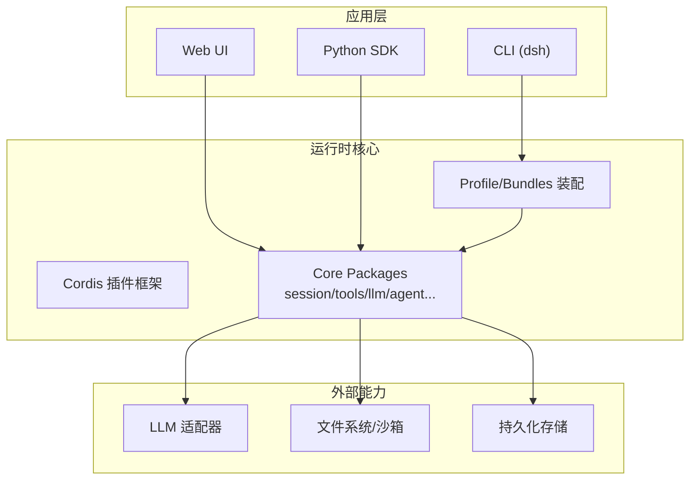
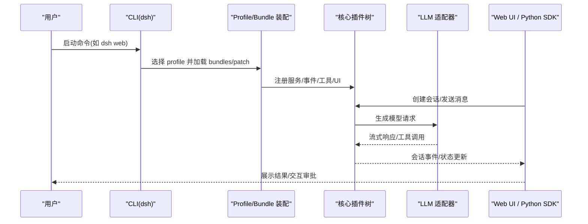
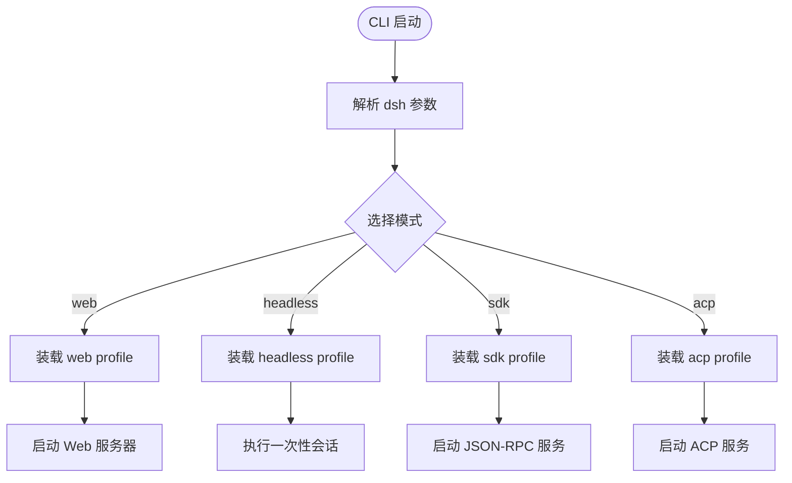
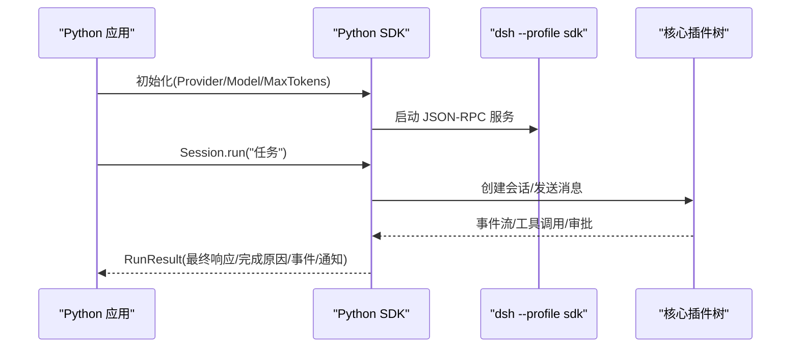
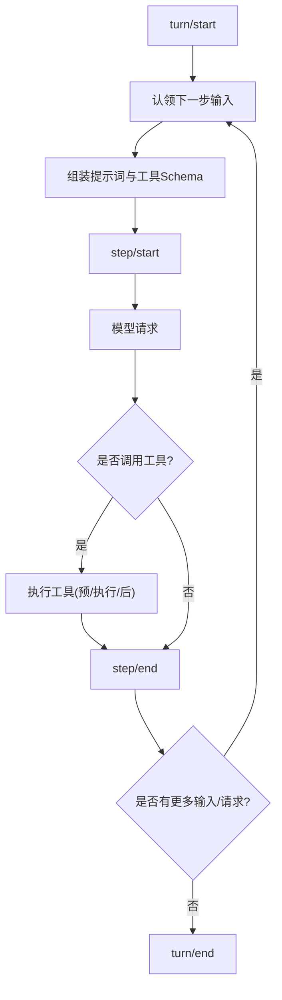
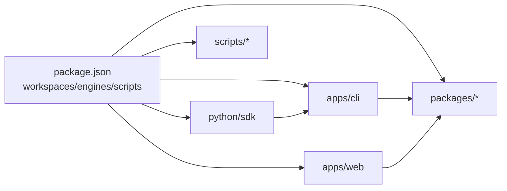

# 项目概览

<cite>
**本文引用的文件**
- [README.md](file://README.md)
- [package.json](file://package.json)
- [apps/cli/README.md](file://apps/cli/README.md)
- [docs/architecture.md](file://docs/architecture.md)
- [docs/cordis-primer.md](file://docs/cordis-primer.md)
- [docs/user/guide/index.md](file://docs/user/guide/index.md)
- [python/sdk/README.md](file://python/sdk/README.md)
- [CONTRIBUTING.md](file://CONTRIBUTING.md)
</cite>

## 目录
1. [简介](#简介)
2. [项目结构](#项目结构)
3. [核心组件](#核心组件)
4. [架构总览](#架构总览)
5. [详细组件分析](#详细组件分析)
6. [依赖关系分析](#依赖关系分析)
7. [性能与可扩展性](#性能与可扩展性)
8. [故障排查指南](#故障排查指南)
9. [结论](#结论)
10. [附录：快速开始与概念入门](#附录快速开始与概念入门)

## 简介
DeepSeek Harness（简称 dsh）是由 DeepSeek AI 开源的智能体编排平台，采用“一切皆插件”的架构思想，基于 Cordis 插件框架构建。它通过可插拔的服务、事件和效果机制，将模型适配器、工具注册表、会话日志、智能体循环等全部能力以插件形式组合，从而支持 CLI、Web UI、SDK 等多种使用方式，并允许用户以配置化方式定制运行时的插件树。

核心价值与目标
- 以插件为中心的可组合运行时：所有功能均可被替换或增强，无需修改核心代码。
- 多形态接入：提供 Web UI、CLI、Python SDK 等入口，覆盖交互式开发、自动化集成与嵌入式场景。
- 安全与可控：内置沙箱、审批策略、权限控制与持久化日志，确保智能体行为可观测、可审计。
- 生态开放：鼓励社区贡献插件与扩展，形成围绕智能体的工具链与应用生态。

**章节来源**
- [README.md:1-15](file://README.md#L1-L15)

## 项目结构
仓库采用 monorepo 组织，核心目录说明如下：
- apps：应用层
  - cli：统一的 Node 应用启动器，负责解析参数、选择 profile、加载插件树并启动对应模式（web/headless/sdk/acp）。
  - web：浏览器前端应用，提供对话、工作区管理、设置、审批等交互界面。
- packages：核心能力与子系统，按领域拆分（如 session、tools、llm、agent、webhook、workflow、sandbox、schedule 等），每个包通常实现一个服务或一组相关能力。
- docs：文档体系，包含架构、子系统、用户指南、开发者实践、Cordis 教程等。
- python：Python SDK 及运行时轮子，封装 JSON-RPC 调用与进程管理。
- scripts：构建、验证、发布、测试等工程脚本。
- native：原生能力（如 landlock-run 用于进程隔离）。
- snapshots：端到端快照与预期输出，保障行为一致性。

**图表来源**
- [apps/cli/README.md:1-18](file://apps/cli/README.md#L1-L18)
- [docs/architecture.md:15-47](file://docs/architecture.md#L15-L47)

**章节来源**
- [apps/cli/README.md:1-18](file://apps/cli/README.md#L1-L18)
- [docs/architecture.md:15-47](file://docs/architecture.md#L15-L47)

## 核心组件
- 插件框架（Cordis）：以 Service 为基本单元，通过 inject 声明依赖，通过 effect/on 注册可逆效果；事件分为 emit/waterfall/parallel/serial/bail 多种分发模式，构成系统扩展点。
- Profile 与 Bundle：Profile 是命名化的插件组合，Bundle 是打包的配置行与挂载代码；启动时按顺序叠加 patch 层，最终形成完整的插件树。
- 应用启动器（CLI）：唯一受支持的 Node 应用入口，根据 profile 选择运行模式（web/headless/sdk/acp），并将参数转发给具体应用。
- Web UI：基于浏览器的前端应用，提供会话、工作区、审批、设置、工具调用可视化等能力。
- Python SDK：通过 JSON-RPC over stdio 驱动 dsh，封装会话生命周期、结果与通知、超时与诊断等。
- 核心子系统：会话日志、工具注册与执行管线、LLM 流式接口、Agent 循环、Webhook、计划与目标、权限与审批、工作区与存储等。

**章节来源**
- [docs/cordis-primer.md:7-14](file://docs/cordis-primer.md#L7-L14)
- [docs/architecture.md:15-47](file://docs/architecture.md#L15-L47)
- [apps/cli/README.md:1-18](file://apps/cli/README.md#L1-L18)
- [python/sdk/README.md:1-15](file://python/sdk/README.md#L1-L15)

## 架构总览
DeepSeek Harness 的架构围绕“插件即能力”展开：
- 启动阶段：CLI 解析参数，选择 profile，按顺序应用 bundle 与 patch，组装出完整的 Cordis 插件树。
- 运行阶段：各插件注册服务、监听事件、注册工具与 UI 插槽；Agent 循环消费输入，驱动模型请求与工具调用，产出会话事件。
- 扩展点：通过事件（session/event、agent/*、tools/* 等）与服务接口（ctx.*）进行横向扩展，避免侵入核心。
- 多形态接入：Web UI 通过连接层订阅会话事件与状态；Python SDK 通过 JSON-RPC 发起任务并接收结果与通知。

**图表来源**
- [docs/architecture.md:41-47](file://docs/architecture.md#L41-L47)
- [docs/architecture.md:74-101](file://docs/architecture.md#L74-L101)

**章节来源**
- [docs/architecture.md:41-47](file://docs/architecture.md#L41-L47)
- [docs/architecture.md:74-101](file://docs/architecture.md#L74-L101)

## 详细组件分析

### CLI（命令行入口）
- 职责：统一入口，解析自身参数后，将剩余参数转发给已启动的应用；支持 web、headless、sdk、sdk-minimal、acp 等模式。
- 关键特性：
  - 仅通过 dsh 启动 Node 应用，保证一致的插件装配流程。
  - 支持 --profile 指定组合，支持 --dump-config 查看装配结果。
  - 支持 plugin 子命令管理 profile 的插件与依赖。
- 典型用法：
  - dsh web：启动 Web UI 服务器。
  - dsh --profile headless "任务描述"：一次性运行会话并输出结果。
  - dsh --profile sdk：启动 JSON-RPC 服务供 SDK 调用。

**图表来源**
- [apps/cli/README.md:1-18](file://apps/cli/README.md#L1-L18)
- [apps/cli/README.md:21-47](file://apps/cli/README.md#L21-L47)

**章节来源**
- [apps/cli/README.md:1-18](file://apps/cli/README.md#L1-L18)
- [apps/cli/README.md:21-47](file://apps/cli/README.md#L21-L47)

### Web UI（浏览器前端）
- 职责：提供会话编辑、工作区管理、审批交互、工具调用可视化、设置与品牌化等界面。
- 特点：
  - 通过连接层订阅会话事件与状态，实时渲染对话与工具调用树。
  - 支持审批策略下的交互式确认。
  - 可通过设置面板配置模型提供方与偏好。
- 使用要点：
  - 首次运行需选择工作区并配置模型提供方。
  - 在会话中发送自然语言指令，智能体会读取/编辑文件、执行命令、委派任务并维护计划。

**章节来源**
- [docs/user/guide/index.md:1-31](file://docs/user/guide/index.md#L1-L31)

### Python SDK
- 职责：通过 JSON-RPC over stdio 驱动 dsh，封装会话生命周期、结果与通知、超时与诊断。
- 关键特性：
  - 无独立应用入口，直接拉起 dsh --profile sdk。
  - 支持显式 dsh_home 隔离环境与 patches 注入。
  - 返回 RunResult（final_response、finish_reason、events、notifications）。
- 典型用法：
  - 初始化 DeepSeekHarness 并传入 provider/model/max_tokens 等参数。
  - 调用 run() 提交任务，获取结果与通知。

**图表来源**
- [python/sdk/README.md:11-33](file://python/sdk/README.md#L11-L33)
- [python/sdk/README.md:64-70](file://python/sdk/README.md#L64-L70)

**章节来源**
- [python/sdk/README.md:11-33](file://python/sdk/README.md#L11-L33)
- [python/sdk/README.md:64-70](file://python/sdk/README.md#L64-L70)

### Cordis 插件框架与事件模型
- 插件以 Service 为单位，通过 inject 声明依赖，apply(ctx) 中注册效果（如工具、UI、监听器）。
- 事件分发模式：
  - emit：观察型，不等待。
  - waterfall：中间件式包裹，可短路。
  - parallel：并行监听。
  - serial：串行监听。
  - bail：首个返回特定值则中断。
- 推荐实践：将行为封装到插件，优先用事件做拦截与策略，用服务方法做直接能力调用。

**章节来源**
- [docs/cordis-primer.md:7-14](file://docs/cordis-primer.md#L7-L14)
- [docs/cordis-primer.md:15-27](file://docs/cordis-primer.md#L15-L27)
- [docs/cordis-primer.md:29-35](file://docs/cordis-primer.md#L29-L35)
- [docs/cordis-primer.md:41-45](file://docs/cordis-primer.md#L41-L45)

### 会话、智能体与工具（面向初学者）
- 会话（Session）：一次对话的生命周期，包含消息、工具调用、计划、目标等，所有对模型可见的内容都会记录为持久化事件。
- 智能体（Agent）：驱动会话运行的主体，负责步骤（step）与回合（turn）的控制，协调模型请求与工具调用。
- 工具（Tool）：由插件注册的能力，可在会话中被智能体调用，具备安全的执行管道与权限策略。
- 回合与步骤：
  - step：一次模型请求及其调用的工具集合。
  - turn：零或多个 step 的组合，打开于首个输入被认领，关闭于无待处理事项。

**图表来源**
- [docs/architecture.md:74-101](file://docs/architecture.md#L74-L101)

**章节来源**
- [docs/architecture.md:74-101](file://docs/architecture.md#L74-L101)

## 依赖关系分析
- 运行时依赖：Node.js（版本要求见 package.json engines），pnpm 作为包管理器。
- 主要模块：
  - apps/cli：应用启动器与参数解析。
  - apps/web：浏览器前端。
  - packages/*：核心能力与子系统（session、tools、llm、agent、webhook、workflow、sandbox、schedule 等）。
  - python/sdk：Python 侧 SDK 与运行时轮子。
  - scripts：构建、验证、测试、发布等工程脚本。
- 插件装配：通过 profile 与 bundle 的有序叠加，最终形成可替换的插件树；任何一行配置都可被上层 patch 替换或插入新行。

**图表来源**
- [package.json:11-18](file://package.json#L11-L18)
- [package.json:19-155](file://package.json#L19-L155)

**章节来源**
- [package.json:11-18](file://package.json#L11-L18)
- [package.json:19-155](file://package.json#L19-L155)

## 性能与可扩展性
- 可扩展性：
  - 通过 Cordis 的事件与服务接口，新增模型提供商、工具、UI 组件、审批策略等，均无需改动核心。
  - Profile 与 Bundle 机制允许按需组合最小可用集，减少不必要的依赖与开销。
- 性能考量：
  - 会话日志作为模型可见上下文的唯一来源，便于回放与压缩，有助于控制上下文大小。
  - 工具执行管道具备预/执行/后钩子，可引入缓存、限流、审计等优化。
  - Web UI 与 SDK 通过事件流与增量更新降低带宽与渲染压力。
- 建议：
  - 合理划分插件边界，避免跨域耦合。
  - 使用事件而非直接调用进行横切关注点（如日志、监控、权限）。
  - 针对高频工具与模型调用，考虑缓存与批处理。

[本节为通用指导，不直接分析具体文件]

## 故障排查指南
- 启动失败：
  - 检查 dsh 命令是否正确，profile 是否存在且可装配。
  - 使用 --dump-config 查看实际装配结果，定位冲突或缺失的行。
- 模型不可用：
  - 确认 Provider 与 Model 已在当前 composition 中注册。
  - 检查凭据与环境变量（如 API Key、Base URL）。
- 工具执行异常：
  - 查看工具执行管道的 pre/execute/post 钩子日志。
  - 确认权限策略与沙箱配置是否允许该操作。
- Web UI 无法连接：
  - 确认端口与防火墙设置，检查浏览器控制台错误。
  - 重新加载页面或重启服务。
- Python SDK 超时：
  - 调整 initialize_timeout_seconds 与 request_timeout_seconds。
  - 查看保留的诊断信息，定位初始化或会话阶段问题。

**章节来源**
- [apps/cli/README.md:21-47](file://apps/cli/README.md#L21-L47)
- [python/sdk/README.md:11-33](file://python/sdk/README.md#L11-L33)

## 结论
DeepSeek Harness 以 Cordis 插件框架为核心，构建了高度可组合、可替换的智能体编排平台。通过 CLI、Web UI、Python SDK 等多形态接入，满足从交互式开发到自动化集成的多样化需求。其“一切皆插件”的设计使得生态扩展与定制成本大幅降低，同时通过会话日志、权限与沙箱等机制保障安全性与可观测性。对于初学者，可从 Web UI 与 Python SDK 入手；对于资深开发者，可深入插件开发与子系统扩展，构建面向业务场景的智能体解决方案。

[本节为总结性内容，不直接分析具体文件]

## 附录：快速开始与概念入门

### 快速开始
- 通过 npm 运行 Web UI：
  - 安装 Node.js 后执行 npx @deepseek-ai/dsh web，默认在本地浏览器打开 http://127.0.0.1:3080。
- 从源码运行：
  - git clone 仓库，执行 pnpm install、pnpm run build，然后 pnpm dsh web。
- 配置模型：
  - 在 Web UI 的设置中选择模型提供方并填入凭据。
- 选择工作区并运行任务：
  - 在工作区中选择项目目录，然后在会话中发送自然语言指令。

**章节来源**
- [README.md:17-41](file://README.md#L17-L41)
- [docs/user/guide/index.md:7-23](file://docs/user/guide/index.md#L7-L23)

### 概念速览
- 智能体（Agent）：驱动会话运行的主体，负责步骤与回合控制。
- 会话（Session）：一次对话的生命周期，包含消息、工具调用、计划与目标。
- 工具（Tool）：插件注册的可调用能力，具备安全执行管道与权限策略。
- 插件（Plugin）：以 Service 为单位的功能单元，通过 inject 声明依赖，通过 effect/on 注册效果。
- 事件（Event）：插件间通信与扩展的核心机制，支持多种分发模式。

**章节来源**
- [docs/cordis-primer.md:7-14](file://docs/cordis-primer.md#L7-L14)
- [docs/architecture.md:74-101](file://docs/architecture.md#L74-L101)

### 社区支持与贡献
- 反馈与讨论：通过 GitHub Discussions 提交反馈或报告问题。
- 插件生态：为插件仓库添加 dsh-plugin 主题以提升可发现性。
- 社区交流：加入 Discord 社区参与讨论。
- 贡献方式：目前暂不接受外部 PR，但欢迎通过插件、博客、问答等方式参与生态建设。

**章节来源**
- [README.md:43-51](file://README.md#L43-L51)
- [CONTRIBUTING.md:9-23](file://CONTRIBUTING.md#L9-L23)