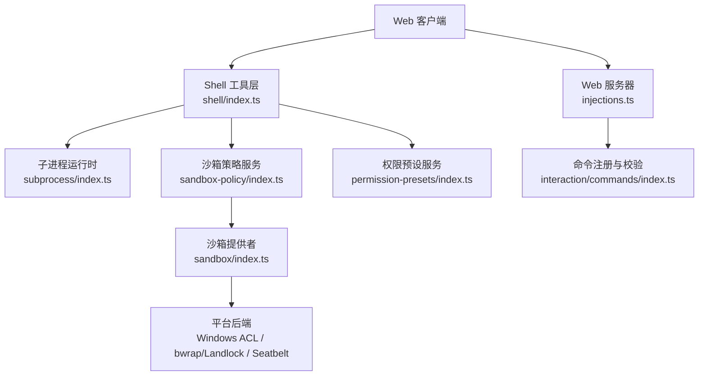
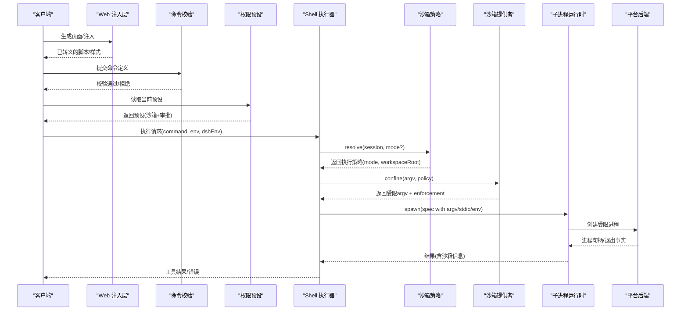
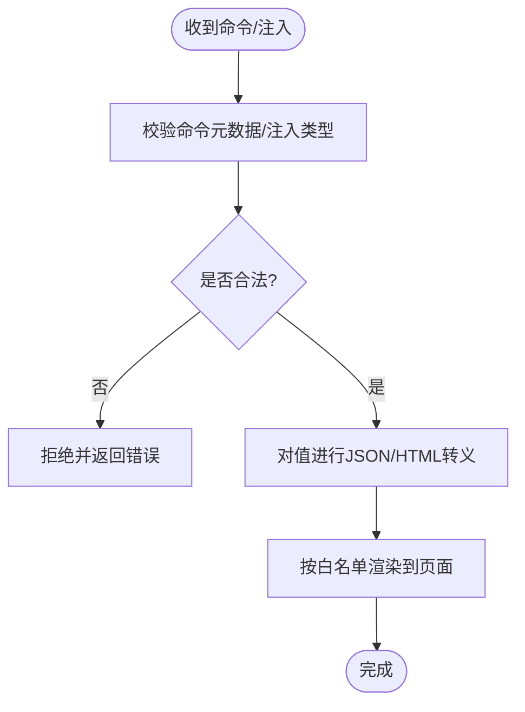
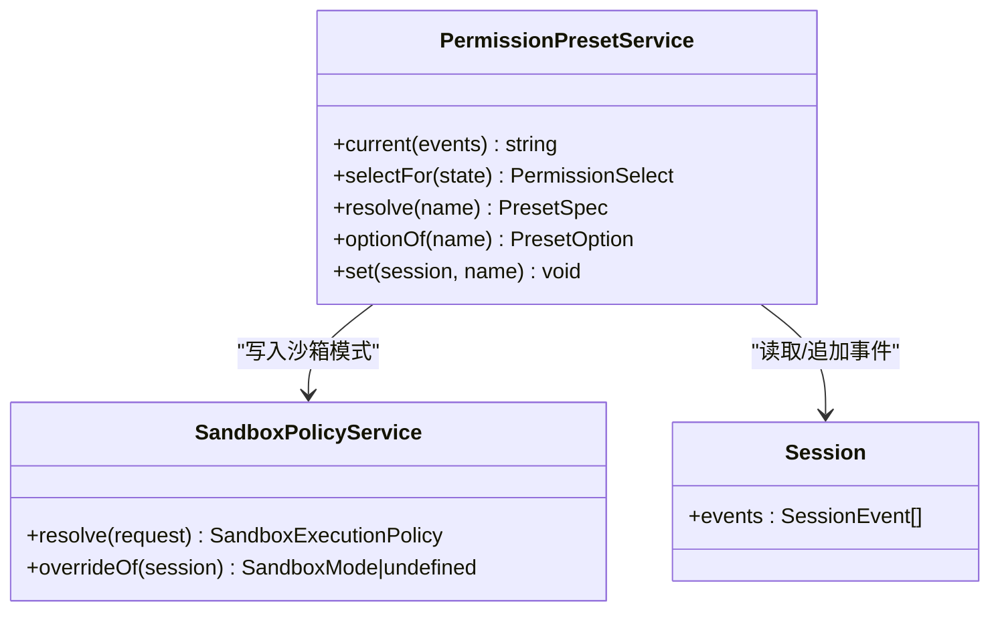
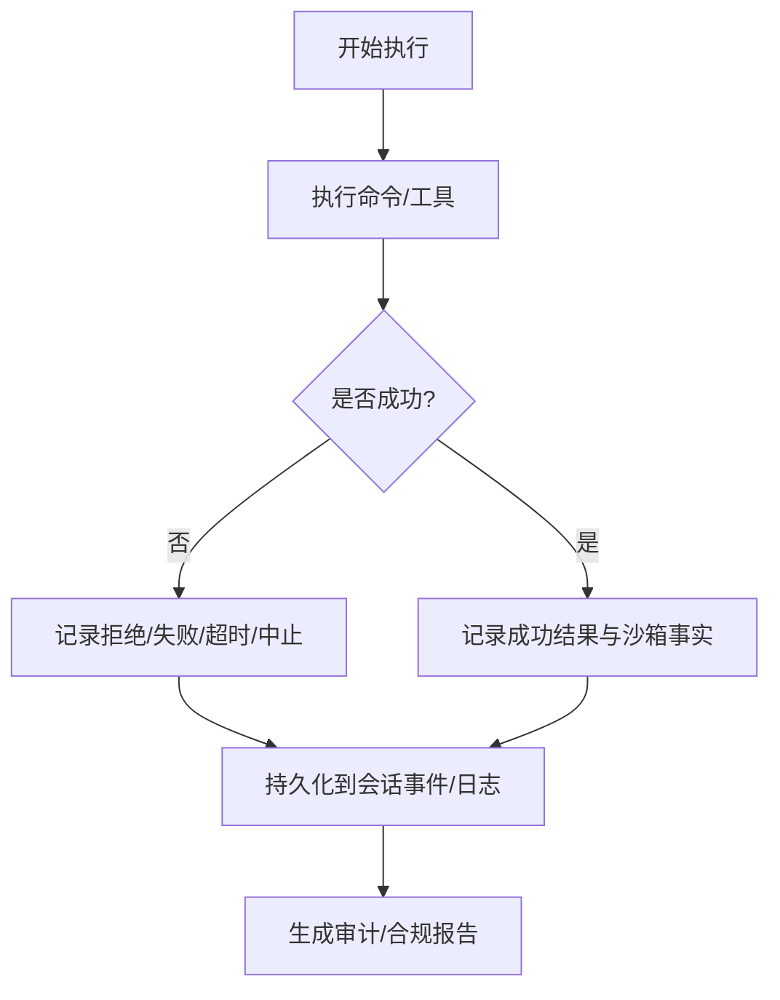
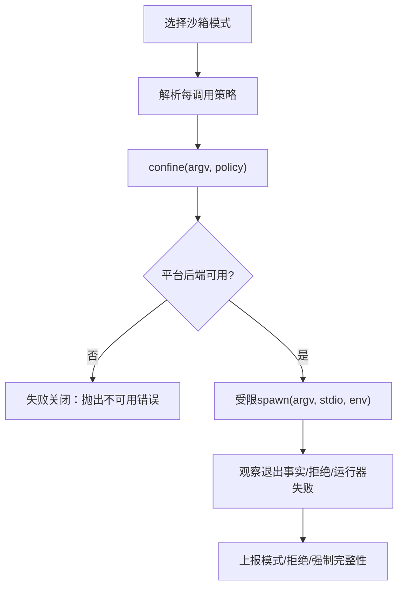
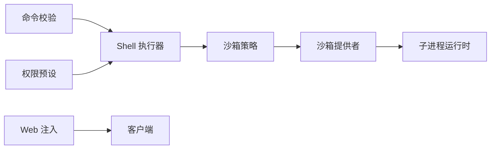

# 安全考虑

<cite>
**本文引用的文件**
- [packages/sandbox/sandbox/src/index.ts](file://packages/sandbox/sandbox/src/index.ts)
- [packages/sandbox/sandbox-policy/src/index.ts](file://packages/sandbox/sandbox-policy/src/index.ts)
- [packages/shell/shell/src/types.ts](file://packages/shell/shell/src/types.ts)
- [packages/shell/shell/src/index.ts](file://packages/shell/shell/src/index.ts)
- [packages/subprocess/subprocess/src/types.ts](file://packages/subprocess/subprocess/src/types.ts)
- [packages/subprocess/subprocess/src/index.ts](file://packages/subprocess/subprocess/src/index.ts)
- [packages/interaction/permission-presets/src/index.ts](file://packages/interaction/permission-presets/src/index.ts)
- [packages/host/webserver/src/injections.ts](file://packages/host/webserver/src/injections.ts)
- [packages/interaction/commands/src/index.ts](file://packages/interaction/commands/src/index.ts)
- [packages/sandbox/sandbox-windows-acl/src/index.ts](file://packages/sandbox/sandbox-windows-acl/src/index.ts)
- [docs/subsystems/sandbox.md](file://docs/subsystems/sandbox.md)
- [docs/subsystems/shell.md](file://docs/subsystems/shell.md)
- [docs/subsystems/subprocess.md](file://docs/subsystems/subprocess.md)
- [docs/subsystems/permission-presets.md](file://docs/subsystems/permission-presets.md)
- [apps/web/tests/permission-policy-context.e2e.ts](file://apps/web/tests/permission-policy-context.e2e.ts)
</cite>

## 目录
1. [简介](#简介)
2. [项目结构](#项目结构)
3. [核心组件](#核心组件)
4. [架构总览](#架构总览)
5. [详细组件分析](#详细组件分析)
6. [依赖关系分析](#依赖关系分析)
7. [性能与安全权衡](#性能与安全权衡)
8. [故障排查指南](#故障排查指南)
9. [结论](#结论)
10. [附录：配置与威胁防护清单](#附录配置与威胁防护清单)

## 简介
本文件聚焦 DeepSeek Harness 的安全设计，围绕输入验证与过滤、权限控制、审计日志、沙箱隔离以及安全配置与常见威胁防护进行系统化说明。内容基于仓库中的子系统文档与实现接口，强调“最小权限”“失败关闭”“可观测性”三大原则，帮助读者理解如何在不同平台（Linux/macOS/Windows）上以一致策略运行受限进程，并在 Web 端与命令层做好输入清洗与注入防护。

## 项目结构
DeepSeek Harness 将安全能力拆分为多个子系统与能力边界：
- 子进程与执行环境：统一抽象子进程生命周期、环境变量清理、输出收集与终止策略。
- Shell 执行：在子进程之上提供 Bash/Pwsh 执行语义，并集成沙箱策略。
- 沙箱策略与后端：定义文件系统影响模式、每调用策略解析、跨平台后端选择与失败关闭。
- 权限预设：将沙箱模式与审批策略打包为可切换的预设，持久化用户意图。
- Web 注入与命令校验：对前端注入点进行 HTML 转义与白名单渲染；对命令元数据进行严格校验。

图表来源
- [packages/host/webserver/src/injections.ts:42-76](file://packages/host/webserver/src/injections.ts#L42-L76)
- [packages/shell/shell/src/index.ts:231-269](file://packages/shell/shell/src/index.ts#L231-L269)
- [packages/subprocess/subprocess/src/index.ts:276-323](file://packages/subprocess/subprocess/src/index.ts#L276-L323)
- [packages/sandbox/sandbox-policy/src/index.ts:189-217](file://packages/sandbox/sandbox-policy/src/index.ts#L189-L217)
- [packages/sandbox/sandbox/src/index.ts:152-187](file://packages/sandbox/sandbox/src/index.ts#L152-L187)
- [packages/interaction/permission-presets/src/index.ts:201-228](file://packages/interaction/permission-presets/src/index.ts#L201-L228)
- [packages/interaction/commands/src/index.ts:170-196](file://packages/interaction/commands/src/index.ts#L170-L196)

章节来源
- [docs/subsystems/shell.md:1-304](file://docs/subsystems/shell.md#L1-L304)
- [docs/subsystems/subprocess.md:1-325](file://docs/subsystems/subprocess.md#L1-L325)
- [docs/subsystems/sandbox.md:1-219](file://docs/subsystems/sandbox.md#L1-L219)
- [docs/subsystems/permission-presets.md:1-132](file://docs/subsystems/permission-presets.md#L1-L132)

## 核心组件
- 子进程运行时：负责可执行查找、环境变量清理、stdio 处置、输出收集与树级终止。
- Shell 执行器：封装 Bash/Pwsh 执行请求与结果，集成沙箱策略与环境变量管理。
- 沙箱策略与服务：定义文件系统影响模式（只读、工作区写入、危险全访问）、每调用策略解析与跨平台后端选择。
- 权限预设：将沙箱模式与审批策略绑定为预设，支持会话内切换与持久化。
- Web 注入与命令校验：对脚本注入进行属性转义与白名单渲染；对命令定义进行类型与格式校验。

章节来源
- [packages/subprocess/subprocess/src/types.ts:13-37](file://packages/subprocess/subprocess/src/types.ts#L13-L37)
- [packages/subprocess/subprocess/src/types.ts:89-130](file://packages/subprocess/subprocess/src/types.ts#L89-L130)
- [packages/shell/shell/src/types.ts:17-99](file://packages/shell/shell/src/types.ts#L17-L99)
- [packages/sandbox/sandbox/src/index.ts:9-39](file://packages/sandbox/sandbox/src/index.ts#L9-L39)
- [packages/sandbox/sandbox-policy/src/index.ts:41-94](file://packages/sandbox/sandbox-policy/src/index.ts#L41-L94)
- [packages/interaction/permission-presets/src/index.ts:1-449](file://packages/interaction/permission-presets/src/index.ts#L1-L449)
- [packages/host/webserver/src/injections.ts:42-76](file://packages/host/webserver/src/injections.ts#L42-L76)
- [packages/interaction/commands/src/index.ts:170-196](file://packages/interaction/commands/src/index.ts#L170-L196)

## 架构总览
下图展示一次受控命令执行的端到端流程：Web 或 CLI 发起请求，经过命令校验与权限预设解析，进入 Shell 执行层，由沙箱策略决定执行模式，最终通过子进程运行时在平台后端中受限执行。

图表来源
- [packages/host/webserver/src/injections.ts:42-76](file://packages/host/webserver/src/injections.ts#L42-L76)
- [packages/interaction/commands/src/index.ts:170-196](file://packages/interaction/commands/src/index.ts#L170-L196)
- [packages/interaction/permission-presets/src/index.ts:201-228](file://packages/interaction/permission-presets/src/index.ts#L201-L228)
- [packages/shell/shell/src/index.ts:231-269](file://packages/shell/shell/src/index.ts#L231-L269)
- [packages/sandbox/sandbox-policy/src/index.ts:189-217](file://packages/sandbox/sandbox-policy/src/index.ts#L189-L217)
- [packages/sandbox/sandbox/src/index.ts:152-187](file://packages/sandbox/sandbox/src/index.ts#L152-L187)
- [packages/subprocess/subprocess/src/index.ts:276-323](file://packages/subprocess/subprocess/src/index.ts#L276-L323)

## 详细组件分析

### 输入验证与过滤机制
- 命令元数据校验：命令名称需匹配规范，描述必须为非空字符串，处理器必须为函数，输入提示与图像标志等字段需满足类型约束。未通过则直接拒绝，防止非法命令进入协议层。
- Web 注入安全：所有注入点使用 JSON 序列化与 HTML 属性转义，避免脚本注入与 XSS。仅允许预定义的注入类型（全局变量、脚本、样式、HTML 片段），并对 src 等属性进行转义。

图表来源
- [packages/interaction/commands/src/index.ts:170-196](file://packages/interaction/commands/src/index.ts#L170-L196)
- [packages/host/webserver/src/injections.ts:42-76](file://packages/host/webserver/src/injections.ts#L42-L76)

章节来源
- [packages/interaction/commands/src/index.ts:170-196](file://packages/interaction/commands/src/index.ts#L170-L196)
- [packages/host/webserver/src/injections.ts:42-76](file://packages/host/webserver/src/injections.ts#L42-L76)

### 权限控制系统
- 细粒度访问控制：沙箱模式限定文件系统影响范围（只读、工作区写入、危险全访问）。每调用策略包含模式与工作区根目录，必要时携带会话标识以便后端区分状态。
- 角色基础权限管理：通过权限预设将沙箱模式与审批策略组合为用户可见的选项，默认包含“工作区写入+询问”和“危险全访问+从不”。
- 动态权限评估：会话启动时补齐缺失权限事实；用户切换预设会记录意图事件并更新对应旋钮值，回放时可恢复有效预设。

图表来源
- [packages/interaction/permission-presets/src/index.ts:201-228](file://packages/interaction/permission-presets/src/index.ts#L201-L228)
- [packages/interaction/permission-presets/src/index.ts:410-446](file://packages/interaction/permission-presets/src/index.ts#L410-L446)
- [packages/sandbox/sandbox-policy/src/index.ts:189-217](file://packages/sandbox/sandbox-policy/src/index.ts#L189-L217)

章节来源
- [docs/subsystems/permission-presets.md:1-132](file://docs/subsystems/permission-presets.md#L1-L132)
- [packages/interaction/permission-presets/src/index.ts:201-228](file://packages/interaction/permission-presets/src/index.ts#L201-L228)
- [packages/interaction/permission-presets/src/index.ts:410-446](file://packages/interaction/permission-presets/src/index.ts#L410-L446)
- [apps/web/tests/permission-policy-context.e2e.ts:120-139](file://apps/web/tests/permission-policy-context.e2e.ts#L120-L139)

### 审计日志系统
- 操作记录：Shell 执行结果包含退出码、信号、超时/中止标记及沙箱信息；子进程运行时提供增量输出读取与溢出回退路径，便于事后审查。
- 安全事件追踪：沙箱拒绝、运行器失败、执行模式与强制完整性均作为事实随结果返回；权限预设切换会记录 log-only 事件，用于回放与合规审计。
- 合规性报告：通过会话事件流与工具结果，可重建命令执行上下文、策略决策与结果，支撑审计与取证。

图表来源
- [packages/shell/shell/src/types.ts:105-163](file://packages/shell/shell/src/types.ts#L105-L163)
- [packages/subprocess/subprocess/src/types.ts:132-239](file://packages/subprocess/subprocess/src/types.ts#L132-L239)
- [docs/subsystems/shell.md:141-166](file://docs/subsystems/shell.md#L141-L166)
- [docs/subsystems/subprocess.md:221-239](file://docs/subsystems/subprocess.md#L221-L239)

章节来源
- [docs/subsystems/shell.md:105-166](file://docs/subsystems/shell.md#L105-L166)
- [docs/subsystems/subprocess.md:132-239](file://docs/subsystems/subprocess.md#L132-L239)

### 沙箱隔离机制
- 文件系统访问限制：沙箱模式限定写权限范围；只读模式仅允许必要写入点（如 /dev/null），工作区写入模式允许在工作区根与后端临时区域写入，危险全访问模式绕过限制。
- 网络请求控制：当前沙箱词汇表不涵盖网络与进程可见性，需在更高层面（容器/微VM/远程执行）进行控制。
- 进程隔离：子进程运行时提供树级终止、环境变量清理、输出收集与溢出回退；平台后端（bwrap/Landlock、Seatbelt、Windows ACL）负责具体强制执行。

图表来源
- [docs/subsystems/sandbox.md:9-39](file://docs/subsystems/sandbox.md#L9-L39)
- [docs/subsystems/sandbox.md:41-94](file://docs/subsystems/sandbox.md#L41-L94)
- [packages/sandbox/sandbox/src/index.ts:152-187](file://packages/sandbox/sandbox/src/index.ts#L152-L187)
- [packages/sandbox/sandbox-windows-acl/src/index.ts:338-367](file://packages/sandbox/sandbox-windows-acl/src/index.ts#L338-L367)
- [docs/subsystems/subprocess.md:89-130](file://docs/subsystems/subprocess.md#L89-L130)

章节来源
- [docs/subsystems/sandbox.md:9-157](file://docs/subsystems/sandbox.md#L9-L157)
- [packages/sandbox/sandbox/src/index.ts:152-187](file://packages/sandbox/sandbox/src/index.ts#L152-L187)
- [packages/sandbox/sandbox-windows-acl/src/index.ts:338-367](file://packages/sandbox/sandbox-windows-acl/src/index.ts#L338-L367)
- [docs/subsystems/subprocess.md:89-130](file://docs/subsystems/subprocess.md#L89-L130)

## 依赖关系分析
- Shell 执行器依赖子进程运行时与沙箱策略服务，消费其提供的执行环境与受限 argv。
- 沙箱策略服务依赖会话事件与部署默认值，解析每调用策略并传递给沙箱提供者。
- 权限预设服务依赖 Shell 执行器的沙箱能力与审批服务，将两者组合为可切换的预设。
- Web 注入与命令校验独立于执行链路，但共同构成输入侧的安全门。

图表来源
- [packages/interaction/commands/src/index.ts:170-196](file://packages/interaction/commands/src/index.ts#L170-L196)
- [packages/interaction/permission-presets/src/index.ts:201-228](file://packages/interaction/permission-presets/src/index.ts#L201-L228)
- [packages/shell/shell/src/index.ts:231-269](file://packages/shell/shell/src/index.ts#L231-L269)
- [packages/sandbox/sandbox-policy/src/index.ts:189-217](file://packages/sandbox/sandbox-policy/src/index.ts#L189-L217)
- [packages/sandbox/sandbox/src/index.ts:152-187](file://packages/sandbox/sandbox/src/index.ts#L152-L187)
- [packages/subprocess/subprocess/src/index.ts:276-323](file://packages/subprocess/subprocess/src/index.ts#L276-L323)
- [packages/host/webserver/src/injections.ts:42-76](file://packages/host/webserver/src/injections.ts#L42-L76)

章节来源
- [docs/subsystems/shell.md:219-304](file://docs/subsystems/shell.md#L219-L304)
- [docs/subsystems/subprocess.md:247-325](file://docs/subsystems/subprocess.md#L247-L325)
- [docs/subsystems/sandbox.md:152-219](file://docs/subsystems/sandbox.md#L152-L219)
- [docs/subsystems/permission-presets.md:44-69](file://docs/subsystems/permission-presets.md#L44-L69)

## 性能与安全权衡
- 输出收集与溢出：子进程输出采用内存尾缓存加溢出文件策略，兼顾性能与可恢复性；大输出场景建议启用 spill 并限制最大字节数。
- 沙箱强制完整性：后端可能报告 partial 强制完整性（旧内核 ABI 或 Windows ACL 边界），对需要绝对边界的调用应拒绝或显式提示风险。
- 超时与中止：Shell 执行器将超时与中止分类为独立事实，避免误判为成功；合理设置 graceMs 与超时上限，确保资源及时回收。

[本节为通用指导，无需特定文件引用]

## 故障排查指南
- 沙箱不可用：当受限模式无可用后端时，沙箱提供者抛出不可用错误；Shell 执行器在前台执行时会传播该错误，后台任务记录 runnerFailed。
- 命令被拒绝：若 stderr 匹配后端拒绝特征（如 EROFS/EACCES/EPERM），视为沙箱正常工作并阻止了文件操作；检查模式与工作区根是否正确。
- 运行器失败：若匹配运行器失败规则（非零退出码+致命签名），应先判定为基础设施失败而非普通任务失败；检查平台后端与 ABI 版本。
- 权限预设异常：确认会话已补齐初始权限事实；若两个预设共享同一捆绑值，last selection 优先；自定义预设名保留给派生状态。

章节来源
- [docs/subsystems/sandbox.md:152-157](file://docs/subsystems/sandbox.md#L152-L157)
- [docs/subsystems/shell.md:141-166](file://docs/subsystems/shell.md#L141-L166)
- [docs/subsystems/subprocess.md:221-239](file://docs/subsystems/subprocess.md#L221-L239)
- [docs/subsystems/permission-presets.md:44-69](file://docs/subsystems/permission-presets.md#L44-L69)

## 结论
DeepSeek Harness 通过“输入校验—权限预设—沙箱策略—子进程隔离”的分层设计，实现了从 Web 到命令执行的端到端安全防护。其关键特性包括：严格的命令与注入校验、可组合的权限预设、每调用策略解析、失败关闭的沙箱执行、以及完整的审计与可恢复输出。生产部署时应关注平台后端的强制完整性、超时与资源回收策略，并结合审批流程与日志审计满足合规要求。

[本节为总结性内容，无需特定文件引用]

## 附录：配置与威胁防护清单
- 输入验证与过滤
  - 命令元数据：名称、描述、处理器、输入提示与图像标志均需类型与格式校验。
  - Web 注入：仅允许白名单类型，所有值进行 JSON/HTML 转义，避免 XSS。
- 命令注入防护
  - 禁止 shell 解释 argv；通过子进程运行时直接传递参数。
  - 环境变量清理：丢弃环境中的 DSH_* 前缀，再合并可信快照。
- XSS 攻击防护
  - 注入点统一转义；src 等属性使用属性转义；禁止任意 HTML 注入。
- 权限控制
  - 沙箱模式：read-only、workspace-write、danger-full-access；仅前两种可发送到提供者。
  - 预设：将沙箱模式与审批策略打包为可切换项，默认包含“工作区写入+询问”和“危险全访问+从不”。
  - 动态评估：会话启动补齐缺失权限事实；预设切换记录意图事件。
- 审计日志
  - 记录执行结果、沙箱拒绝/运行器失败、模式与强制完整性；支持溢出文件回溯。
- 沙箱隔离
  - 文件系统：限制写权限范围；必要时使用后端临时区域。
  - 网络与进程：不在当前沙箱词汇表中，需在更高层面控制。
  - 进程隔离：树级终止、输出收集与溢出回退、环境变量清理。
- 安全配置建议
  - 默认使用 read-only 或 workspace-write；仅在明确授权时使用 danger-full-access。
  - 配置合理的 stdoutMaxBytes 与 graceMs，避免资源泄漏。
  - 监控 partial 强制完整性，必要时拒绝执行或提示风险。
- 常见威胁与对策
  - 命令注入：使用白名单命令与参数校验，禁止 shell 解释。
  - XSS：对所有注入值进行转义，限制注入类型。
  - 权限提升：通过审批流程与预设限制危险操作；记录所有变更。
  - 资源耗尽：设置超时与输出上限，及时终止进程树。

章节来源
- [packages/interaction/commands/src/index.ts:170-196](file://packages/interaction/commands/src/index.ts#L170-L196)
- [packages/host/webserver/src/injections.ts:42-76](file://packages/host/webserver/src/injections.ts#L42-L76)
- [docs/subsystems/sandbox.md:9-39](file://docs/subsystems/sandbox.md#L9-L39)
- [docs/subsystems/shell.md:105-166](file://docs/subsystems/shell.md#L105-L166)
- [docs/subsystems/subprocess.md:89-130](file://docs/subsystems/subprocess.md#L89-L130)
- [docs/subsystems/permission-presets.md:1-69](file://docs/subsystems/permission-presets.md#L1-L69)