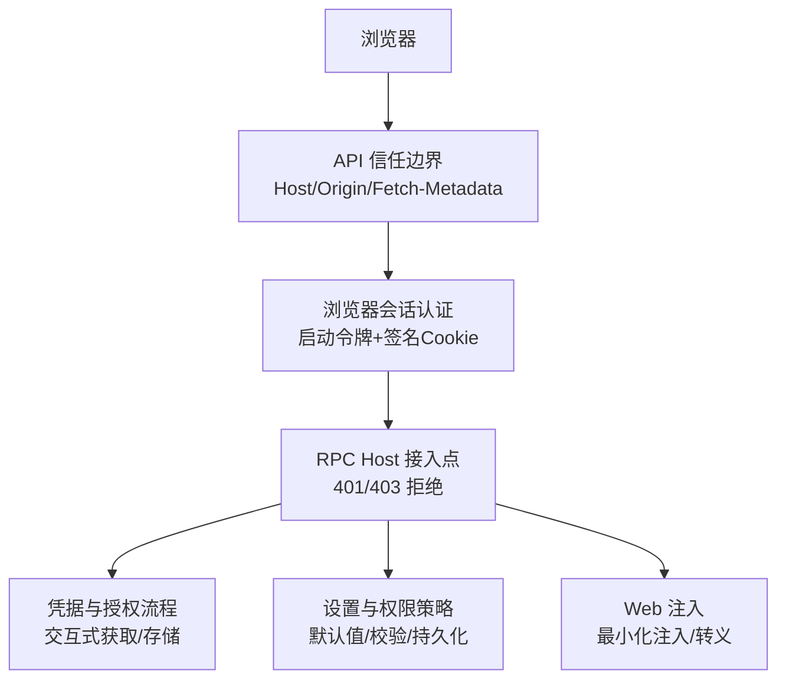
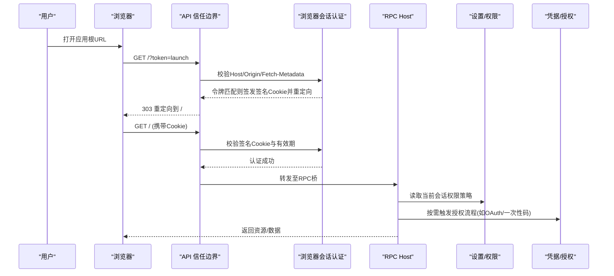
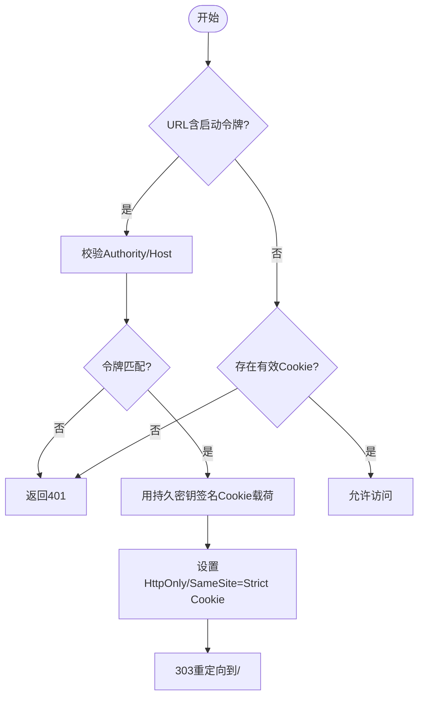
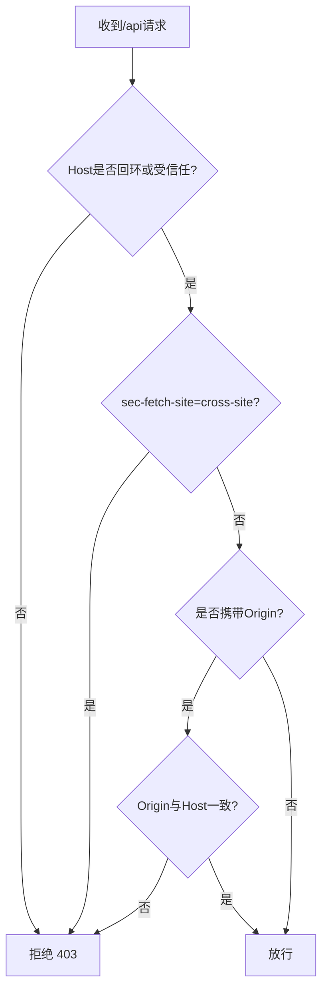
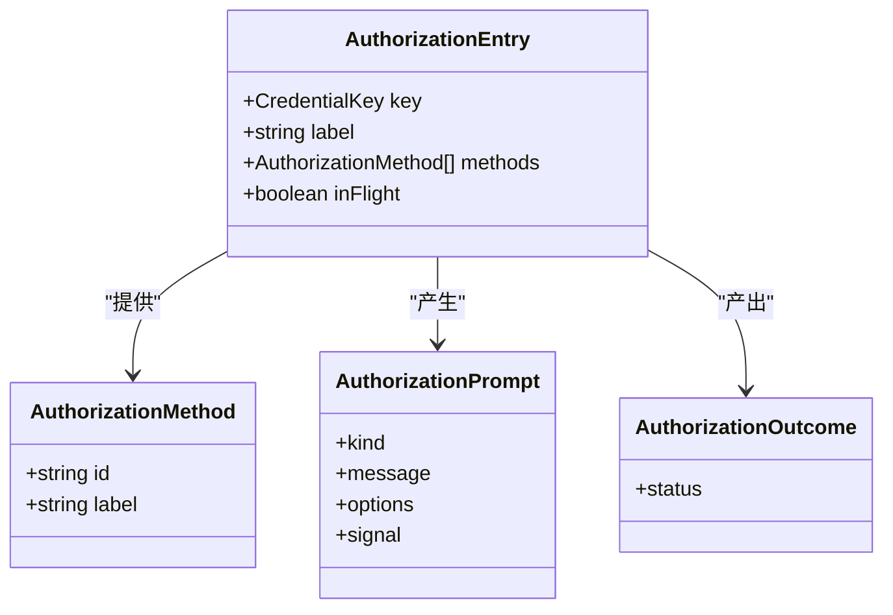
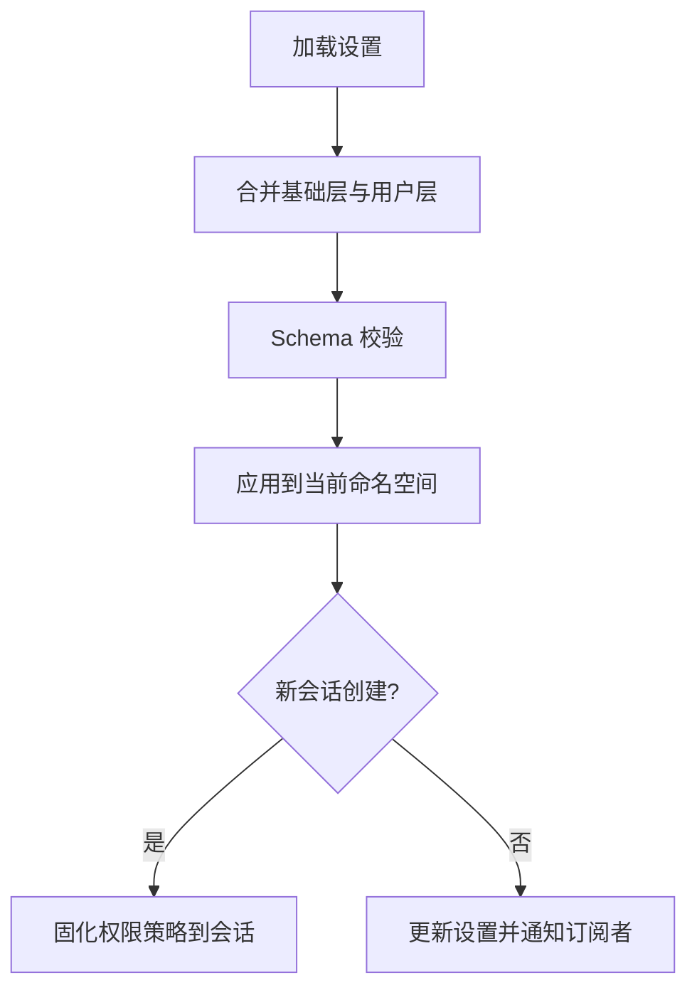
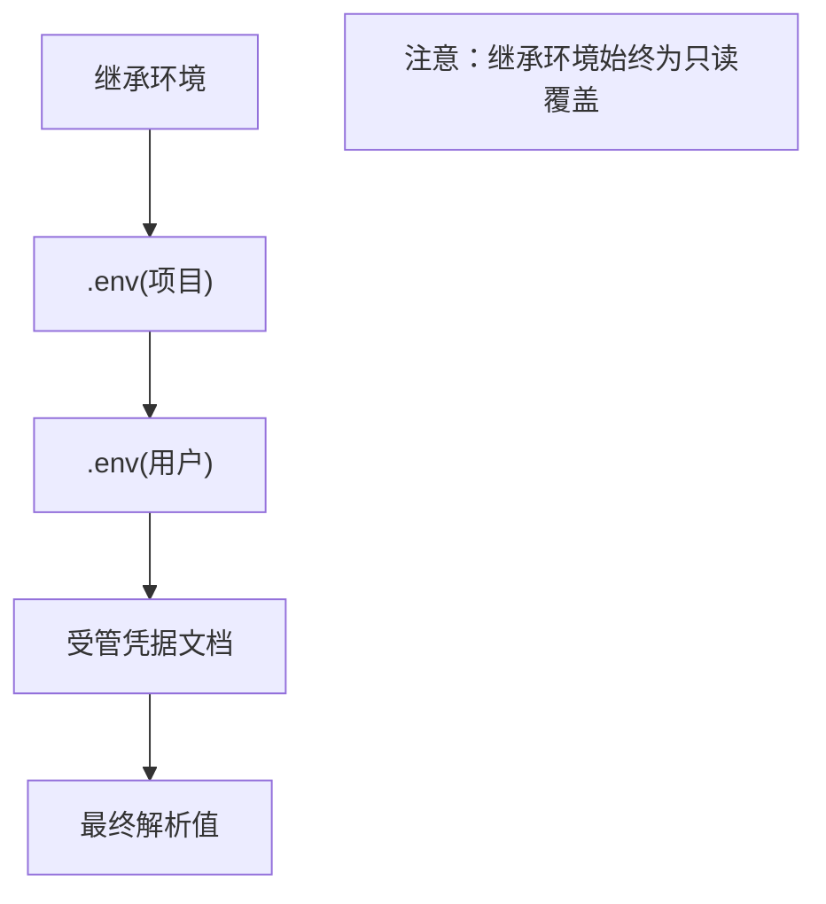
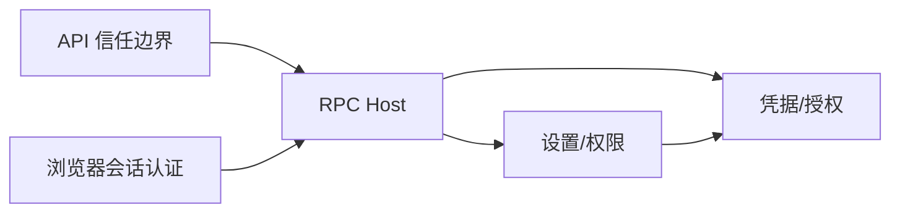

# 安全配置指南

<cite>
**本文引用的文件**
- [SAFETY.md](file://SAFETY.md)
- [browser-auth.ts](file://packages/client/connection/src/browser-auth.ts)
- [api-request-trust.ts](file://packages/client/connection/src/api-request-trust.ts)
- [rpc-host.ts](file://packages/client/connection/src/rpc-host.ts)
- [injections.ts](file://packages/host/webserver/src/injections.ts)
- [types.ts](file://packages/credentials/authorization/src/types.ts)
- [index.ts（认证流程）](file://packages/credentials/authorization/src/index.ts)
- [README（凭证与授权）](file://packages/credentials/README.md)
- [index.ts（设置解析）](file://packages/settings/settings/src/index.ts)
- [loadLayeredEnv（分层环境加载）](file://packages/boot/app-boot/src/index.ts)
- [app-boot.spec.ts（环境覆盖测试）](file://packages/boot/app-boot/tests/app-boot.spec.ts)
- [credential-lifecycle note](file://.agents/notes/implemented/bug-fix/2026-08-06-provider-credential-lifecycle.md)
- [browser-token-auth note](file://.agents/notes/implemented/architecture/2026-08-24-browser-token-authentication.md)
- [permission-default note](file://.agents/notes/implemented/feature/2026-07-31-permission-default-for-new-sessions.md)
- [PermissionRow.tsx](file://packages/client/ui-permission-presets/src/client/PermissionRow.tsx)
- [PermissionSelect.tsx](file://packages/client/ui-conversation/src/client/skeleton/PermissionSelect.tsx)
- [presentation.ts](file://packages/client/ui-permission-presets/src/client/presentation.ts)
- [settings-store.client.spec.ts](file://packages/client/ui-agent-preset/tests/settings-store.client.spec.ts)
- [gen-config-catalog.ts](file://scripts/gen-config-catalog.ts)
</cite>

## 目录
1. [简介](#简介)
2. [项目结构](#项目结构)
3. [核心组件](#核心组件)
4. [架构总览](#架构总览)
5. [详细组件分析](#详细组件分析)
6. [依赖关系分析](#依赖关系分析)
7. [性能与安全权衡](#性能与安全权衡)
8. [故障排查指南](#故障排查指南)
9. [结论](#结论)
10. [附录：检查清单与自动化验证](#附录：检查清单与自动化验证)

## 简介
本指南聚焦 DeepSeek Harness 的安全配置，围绕认证、授权、访问控制、跨站防护、凭据管理、权限策略与环境变量优先级展开。文档基于仓库中的实际实现与架构笔记，给出不同部署环境的差异化建议、默认值与校验机制、常见威胁的防护要点，以及可落地的检查清单与自动化脚本使用方法。

## 项目结构
与安全相关的关键代码分布在以下模块：
- 浏览器会话认证与令牌交换：packages/client/connection/src/browser-auth.ts
- API 请求信任边界（防 DNS 重绑定与跨站）：packages/client/connection/src/api-request-trust.ts
- RPC Host 接入点（鉴权与拒绝策略）：packages/client/connection/src/rpc-host.ts
- Web 注入与页面内容安全：packages/host/webserver/src/injections.ts
- 凭据与授权流程：packages/credentials/authorization/src/types.ts, index.ts, README
- 设置与权限策略：packages/settings/settings/src/index.ts；UI 侧权限选择与确认
- 环境变量分层与覆盖：packages/boot/app-boot/src/index.ts 及测试用例
- 架构与特性决策笔记：.agents/notes/...（浏览器令牌、权限默认值等）

图表来源
- [api-request-trust.ts:1-119](file://packages/client/connection/src/api-request-trust.ts#L1-L119)
- [browser-auth.ts:180-314](file://packages/client/connection/src/browser-auth.ts#L180-L314)
- [rpc-host.ts:87-109](file://packages/client/connection/src/rpc-host.ts#L87-L109)
- [injections.ts:42-76](file://packages/host/webserver/src/injections.ts#L42-L76)

章节来源
- [api-request-trust.ts:1-119](file://packages/client/connection/src/api-request-trust.ts#L1-L119)
- [browser-auth.ts:180-314](file://packages/client/connection/src/browser-auth.ts#L180-L314)
- [rpc-host.ts:87-109](file://packages/client/connection/src/rpc-host.ts#L87-L109)
- [injections.ts:42-76](file://packages/host/webserver/src/injections.ts#L42-L76)

## 核心组件
- 浏览器会话认证（BrowserAuth）
  - 通过进程级一次性启动令牌换取带签名的 HttpOnly SameSite=Strict Cookie，按 Authority 绑定并限制有效期。
  - 支持版本化的密钥与载荷，避免旧格式兼容风险。
- API 信任边界（isTrustedApiRequest）
  - 强制 Host 白名单（回环或受信任主机），拒绝跨站标记，校验 Origin 与 Host 一致性。
  - 防御 DNS 重绑定与跨站请求伪造场景。
- RPC Host 接入点
  - 先执行信任边界校验，再执行浏览器认证，未通过返回 403/401。
- 凭据与授权
  - 将“需要人类交互”的认证流程抽象为 Authorization Flow，提供方法注册、提示与状态事件。
  - 凭据以引用方式出现在配置中，运行时从凭据存储读取，避免密钥进入配置文件。
- 设置与权限策略
  - 设置层合并：Schema 默认值 → base → 用户层，统一经 Schema 校验后生效。
  - 新会话创建时固化权限策略，避免运行中动态变更影响已持久化日志。
- 环境变量分层
  - 继承环境 > 项目 .env > 用户 .env，且仅当目标键不存在时才写入，保证最高优先级不被覆盖。
  - 凭据优先顺序：继承环境 > 受管凭据文档 > 项目/用户 .env 回退。

章节来源
- [browser-auth.ts:180-314](file://packages/client/connection/src/browser-auth.ts#L180-L314)
- [api-request-trust.ts:1-119](file://packages/client/connection/src/api-request-trust.ts#L1-L119)
- [rpc-host.ts:87-109](file://packages/client/connection/src/rpc-host.ts#L87-L109)
- [types.ts:1-92](file://packages/credentials/authorization/src/types.ts#L1-L92)
- [index.ts（设置解析）:686-723](file://packages/settings/settings/src/index.ts#L686-L723)
- [loadLayeredEnv（分层环境加载）:169-194](file://packages/boot/app-boot/src/index.ts#L169-L194)
- [app-boot.spec.ts（环境覆盖测试）:93-127](file://packages/boot/app-boot/tests/app-boot.spec.ts#L93-L127)

## 架构总览
下图展示一次浏览器访问到后端服务的完整安全链路：

图表来源
- [api-request-trust.ts:1-119](file://packages/client/connection/src/api-request-trust.ts#L1-L119)
- [browser-auth.ts:218-302](file://packages/client/connection/src/browser-auth.ts#L218-L302)
- [rpc-host.ts:87-109](file://packages/client/connection/src/rpc-host.ts#L87-L109)
- [types.ts:1-92](file://packages/credentials/authorization/src/types.ts#L1-L92)

## 详细组件分析

### 浏览器会话认证（BrowserAuth）
- 启动令牌：进程内随机生成，仅在一次启动生命周期有效，用于首次握手。
- Cookie 签名：使用持久化密钥对载荷进行 HMAC 签名，包含 Authority、签发时间、过期时间。
- 安全属性：HttpOnly、SameSite=Strict、Path=/，防止客户端脚本访问与跨站携带。
- 版本化：存储与 Cookie 载荷均含版本号，不兼容旧格式直接拒绝。

图表来源
- [browser-auth.ts:218-302](file://packages/client/connection/src/browser-auth.ts#L218-L302)

章节来源
- [browser-auth.ts:180-314](file://packages/client/connection/src/browser-auth.ts#L180-L314)
- [browser-token-auth note:33-43](file://.agents/notes/implemented/architecture/2026-08-24-browser-token-authentication.md#L33-L43)

### API 信任边界（防DNS重绑定与跨站）
- Host 白名单：仅允许回环地址或配置的 trustedHosts。
- Cross-Site 标记：若浏览器标记 cross-site，一律拒绝。
- Origin 校验：若携带 Origin，必须与 Host 一致（规范化比较）。
- 非浏览器流量：通过回环或可信 LAN IP 同样受此边界保护。

图表来源
- [api-request-trust.ts:1-119](file://packages/client/connection/src/api-request-trust.ts#L1-L119)

章节来源
- [api-request-trust.ts:1-119](file://packages/client/connection/src/api-request-trust.ts#L1-L119)
- [rpc-host.ts:87-109](file://packages/client/connection/src/rpc-host.ts#L87-L109)

### 凭据与授权流程
- 授权方法：每个流程暴露若干方法（id/label），由调用方选择。
- 提示类型：text、secret（脱敏显示）、select（选项列表）。
- 状态与结果：authorized/cancelled/failed，失败以异常形式上报给发起者。
- 最佳实践：固定密钥走凭据引用；需与人交互的认证走授权流程。

图表来源
- [types.ts:1-92](file://packages/credentials/authorization/src/types.ts#L1-L92)

章节来源
- [types.ts:1-92](file://packages/credentials/authorization/src/types.ts#L1-L92)
- [README（凭证与授权）:1-22](file://packages/credentials/README.md#L1-L22)
- [credential-lifecycle note:25-28](file://.agents/notes/implemented/bug-fix/2026-08-06-provider-credential-lifecycle.md#L25-L28)

### 设置与权限策略
- 设置解析：Schema 默认值 → base → 用户层，统一经 Schema 校验后返回。
- 路径操作：支持 set/unset 路径级修改，避免整段替换导致机密字段丢失。
- 权限默认值：新会话在创建时固化权限策略，后续设置变更不影响已持久化会话。
- UI 风险门：全量访问需显式确认，避免误开启高权限。

图表来源
- [index.ts（设置解析）:686-723](file://packages/settings/settings/src/index.ts#L686-L723)
- [permission-default note:1-15](file://.agents/notes/implemented/feature/2026-07-31-permission-default-for-new-sessions.md#L1-L15)

章节来源
- [index.ts（设置解析）:686-723](file://packages/settings/settings/src/index.ts#L686-L723)
- [permission-default note:1-15](file://.agents/notes/implemented/feature/2026-07-31-permission-default-for-new-sessions.md#L1-L15)
- [PermissionRow.tsx:65-106](file://packages/client/ui-permission-presets/src/client/PermissionRow.tsx#L65-L106)
- [PermissionSelect.tsx:131-175](file://packages/client/ui-conversation/src/client/skeleton/PermissionSelect.tsx#L131-L175)
- [presentation.ts:1-22](file://packages/client/ui-permission-presets/src/client/presentation.ts#L1-L22)
- [settings-store.client.spec.ts:334-368](file://packages/client/ui-agent-preset/tests/settings-store.client.spec.ts#L334-L368)

### 环境变量与凭据优先级
- 环境变量分层：继承环境 > 项目 .env > 用户 .env，仅在目标键不存在时写入，确保最高优先级不被覆盖。
- 凭据优先顺序：继承环境 > 受管凭据文档 > 项目/用户 .env 回退。
- 迁移策略：已有键保留为回退，一旦在受管文档中存储引用即优先于 .env。

图表来源
- [loadLayeredEnv（分层环境加载）:169-194](file://packages/boot/app-boot/src/index.ts#L169-L194)
- [app-boot.spec.ts（环境覆盖测试）:93-127](file://packages/boot/app-boot/tests/app-boot.spec.ts#L93-L127)
- [credential-lifecycle note:28-30](file://.agents/notes/implemented/bug-fix/2026-08-06-provider-credential-lifecycle.md#L28-L30)

章节来源
- [loadLayeredEnv（分层环境加载）:169-194](file://packages/boot/app-boot/src/index.ts#L169-L194)
- [app-boot.spec.ts（环境覆盖测试）:93-127](file://packages/boot/app-boot/tests/app-boot.spec.ts#L93-L127)
- [credential-lifecycle note:28-30](file://.agents/notes/implemented/bug-fix/2026-08-06-provider-credential-lifecycle.md#L28-L30)

### Web 注入与页面安全
- 注入类型：全局变量、script、style、HTML 片段等。
- 安全处理：对用户可控字符串进行转义，避免 XSS 注入。
- 建议：生产环境最小化注入，仅注入必要的全局常量，避免执行任意脚本。

章节来源
- [injections.ts:42-76](file://packages/host/webserver/src/injections.ts#L42-L76)

## 依赖关系分析
- 信任边界依赖 Host/Origin/Fetch-Metadata 头信息，决定请求是否可达 RPC 桥。
- 浏览器认证依赖持久化密钥与启动令牌，二者共同保障会话有效性。
- 设置与权限策略依赖 Schema 定义，确保配置项合法与默认值正确。
- 凭据与授权解耦：配置仅引用凭据名，运行时通过凭据提供者获取真实值。

图表来源
- [api-request-trust.ts:1-119](file://packages/client/connection/src/api-request-trust.ts#L1-L119)
- [browser-auth.ts:180-314](file://packages/client/connection/src/browser-auth.ts#L180-L314)
- [rpc-host.ts:87-109](file://packages/client/connection/src/rpc-host.ts#L87-L109)
- [types.ts:1-92](file://packages/credentials/authorization/src/types.ts#L1-L92)

章节来源
- [api-request-trust.ts:1-119](file://packages/client/connection/src/api-request-trust.ts#L1-L119)
- [browser-auth.ts:180-314](file://packages/client/connection/src/browser-auth.ts#L180-L314)
- [rpc-host.ts:87-109](file://packages/client/connection/src/rpc-host.ts#L87-L109)
- [types.ts:1-92](file://packages/credentials/authorization/src/types.ts#L1-L92)

## 性能与安全权衡
- Cookie 签名与校验带来少量 CPU 开销，但显著降低会话劫持风险。
- 信任边界在入口处快速拒绝非法请求，减少后续处理成本。
- 设置与权限策略在会话创建时固化，避免运行时频繁切换带来的不一致性。
- 环境变量分层与凭据引用减少配置体积与泄露面，提升可维护性。

## 故障排查指南
- 401 未认证：检查启动令牌是否正确传递、Cookie 是否被浏览器策略拦截、Authority 是否匹配。
- 403 禁止访问：检查 Host 是否在回环或 trustedHosts 列表中，是否存在 cross-site 标记或 Origin 不匹配。
- 权限策略未生效：确认新会话创建时是否固化了策略；检查设置 Schema 与默认值是否正确。
- 凭据未生效：确认凭据引用是否正确；检查凭据文档与 .env 优先级；必要时清理无效记录并重启。

章节来源
- [browser-auth.ts:218-314](file://packages/client/connection/src/browser-auth.ts#L218-L314)
- [api-request-trust.ts:1-119](file://packages/client/connection/src/api-request-trust.ts#L1-L119)
- [rpc-host.ts:87-109](file://packages/client/connection/src/rpc-host.ts#L87-L109)
- [index.ts（设置解析）:686-723](file://packages/settings/settings/src/index.ts#L686-L723)

## 结论
DeepSeek Harness 在浏览器认证、API 信任边界、凭据与授权、设置与权限策略等方面提供了系统化的安全能力。通过严格的 Host/Origin/Fetch-Metadata 校验、带签名的会话 Cookie、最小化注入与权限策略固化，能够有效抵御 DNS 重绑定、跨站请求与越权访问等常见威胁。结合环境变量分层与凭据引用，可在不同部署环境中实现灵活而安全的配置管理。

## 附录：检查清单与自动化验证

### 安全配置检查清单
- 认证与会话
  - 启用浏览器会话认证，确保启动令牌仅在一次启动中有效。
  - 校验 Cookie 的 HttpOnly、SameSite=Strict、Path=/ 与有效期。
  - 定期轮换持久化密钥，避免长期复用。
- 访问控制
  - 配置 trustedHosts 仅包含必要域名/IP，避免宽泛匹配。
  - 确保所有 /api 请求经过信任边界校验。
- 凭据管理
  - 使用凭据引用替代明文密钥；敏感值不进入配置文件。
  - 优先使用继承环境变量作为只读覆盖。
- 权限策略
  - 新会话创建时固化权限策略，避免运行中变更。
  - 全量访问需显式确认，UI 提供风险门。
- Web 安全
  - 最小化注入，对用户可控内容进行转义。
  - 避免在生产环境执行任意脚本。

### 常见威胁防护示例
- SQL 注入
  - 通过参数化查询与输入校验，避免拼接用户输入。
  - 在工具执行前进行命令白名单与沙箱隔离。
- XSS 攻击
  - 对所有输出进行上下文相关的转义，避免注入脚本。
  - 严格限制 Web 注入范围，仅注入必要常量。
- CSRF 防护
  - 使用 SameSite=Strict Cookie，配合 Host/Origin/Fetch-Metadata 校验。
  - 关键操作要求重新认证或二次确认。

### 自动化验证脚本使用方法
- 配置目录扫描与校验
  - 使用配置目录生成脚本，收集插件配置键与组合关系，发现未知键或错误组合。
  - 参考路径：[gen-config-catalog.ts:463-757](file://scripts/gen-config-catalog.ts#L463-L757)
- 环境与凭据优先级验证
  - 通过单元测试验证环境变量分层与覆盖行为，确保继承环境不被覆盖。
  - 参考路径：[app-boot.spec.ts:93-127](file://packages/boot/app-boot/tests/app-boot.spec.ts#L93-L127)
- 权限策略默认值验证
  - 验证新会话权限策略默认值与 UI 展示一致性。
  - 参考路径：[settings-store.client.spec.ts:334-368](file://packages/client/ui-agent-preset/tests/settings-store.client.spec.ts#L334-L368)

章节来源
- [gen-config-catalog.ts:463-757](file://scripts/gen-config-catalog.ts#L463-L757)
- [app-boot.spec.ts:93-127](file://packages/boot/app-boot/tests/app-boot.spec.ts#L93-L127)
- [settings-store.client.spec.ts:334-368](file://packages/client/ui-agent-preset/tests/settings-store.client.spec.ts#L334-L368)