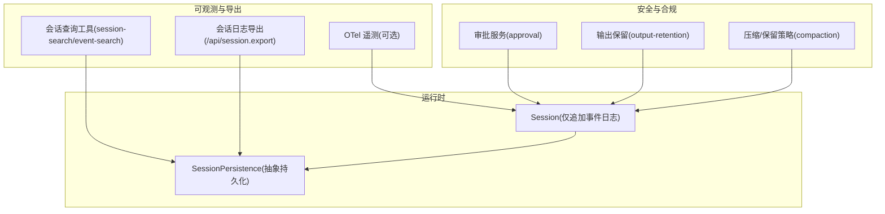
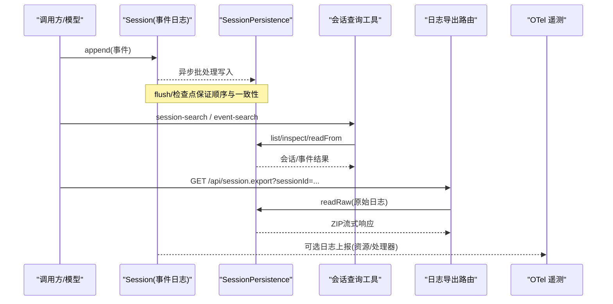
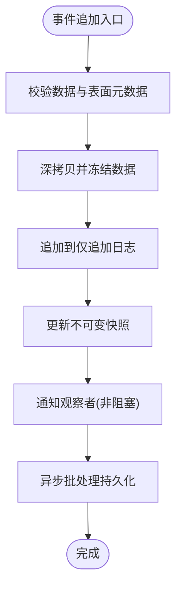
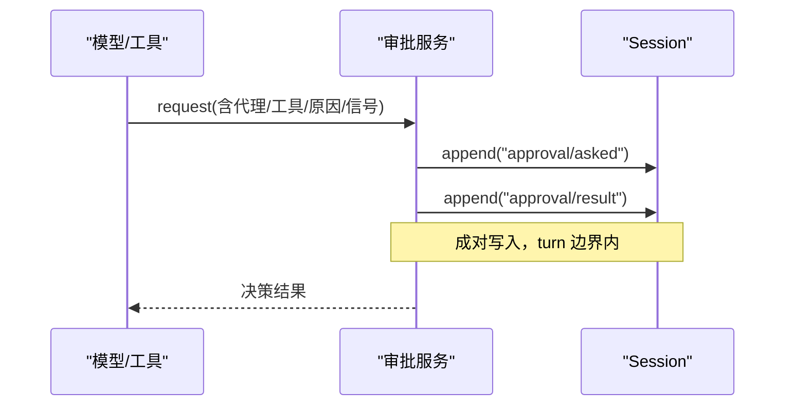
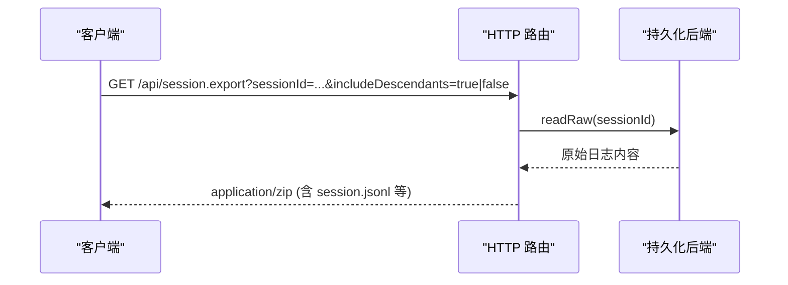
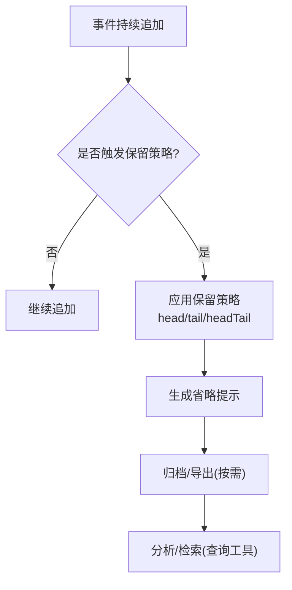
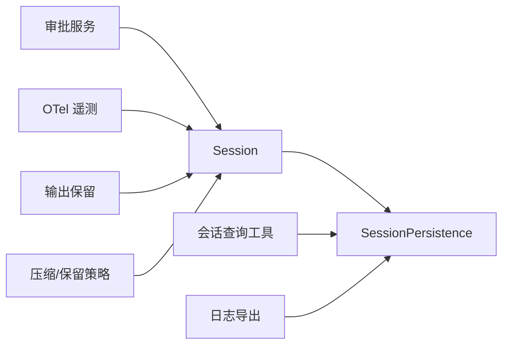

# 审计日志系统

<cite>
**本文引用的文件**
- [packages/core/session/src/index.ts](file://packages/core/session/src/index.ts)
- [packages/session/session-persistence/src/index.ts](file://packages/session/session-persistence/src/index.ts)
- [docs/subsystems/persistence.md](file://docs/subsystems/persistence.md)
- [packages/interaction/user-approval/src/index.ts](file://packages/interaction/user-approval/src/index.ts)
- [packages/interaction/user-approval/src/types.ts](file://packages/interaction/user-approval/src/types.ts)
- [packages/extensions/tool-cordis/src/api-catalog.ts](file://packages/extensions/tool-cordis/src/api-catalog.ts)
- [packages/session-query/tool-session-query/src/input.ts](file://packages/session-query/tool-session-query/src/input.ts)
- [packages/session-query/session-log-export/src/index.ts](file://packages/session-query/session-log-export/src/index.ts)
- [packages/session-query/session-log-export/tests/route.host.spec.ts](file://packages/session-query/session-log-export/tests/route.host.spec.ts)
- [packages/session/session-telemetry-otel/src/index.ts](file://packages/session/session-telemetry-otel/src/index.ts)
- [packages/util/output-retention/src/index.ts](file://packages/util/output-retention/src/index.ts)
- [packages/compaction/compaction-basic/src/config.ts](file://packages/compaction/compaction-basic/src/config.ts)
- [snapshots/session/hook-codex-posttool-context/session.jsonl](file://snapshots/session/hook-codex-posttool-context/session.jsonl)
- [snapshots/sdk/subagent-report/session.jsonl](file://snapshots/sdk/subagent-report/session.jsonl)
</cite>

## 目录
1. [简介](#简介)
2. [项目结构](#项目结构)
3. [核心组件](#核心组件)
4. [架构总览](#架构总览)
5. [详细组件分析](#详细组件分析)
6. [依赖关系分析](#依赖关系分析)
7. [性能考量](#性能考量)
8. [故障排查指南](#故障排查指南)
9. [结论](#结论)
10. [附录](#附录)

## 简介
本文件系统化说明 DeepSeek Harness 的审计日志体系，覆盖以下目标：
- 操作记录机制：用户操作追踪、系统事件捕获与数据变更历史。
- 安全事件追踪：异常行为检测、入侵尝试记录与合规性监控。
- 合规性报告：生成与管理（格式、存储策略、导出）。
- 生命周期管理：归档、清理与分析工具。
- 配置与扩展：审计日志的配置项与自定义日志格式扩展方法。
- 实战示例：日志查询与安全分析场景。

## 项目结构
DeepSeek Harness 将“会话”作为审计事实来源，通过仅追加的事件日志实现不可变的历史记录；持久化层提供多种后端；查询与导出能力暴露为工具与 HTTP 路由；遥测与输出保留策略支撑可观测性与容量治理。

图表来源
- [packages/core/session/src/index.ts:548-653](file://packages/core/session/src/index.ts#L548-L653)
- [packages/session/session-persistence/src/index.ts:248-399](file://packages/session/session-persistence/src/index.ts#L248-L399)
- [packages/session-query/tool-session-query/src/input.ts:45-82](file://packages/session-query/tool-session-query/src/input.ts#L45-L82)
- [packages/session-query/session-log-export/src/index.ts:72-94](file://packages/session-query/session-log-export/src/index.ts#L72-L94)
- [packages/interaction/user-approval/src/index.ts:85-112](file://packages/interaction/user-approval/src/index.ts#L85-L112)
- [packages/util/output-retention/src/index.ts:112-156](file://packages/util/output-retention/src/index.ts#L112-L156)
- [packages/compaction/compaction-basic/src/config.ts:169-191](file://packages/compaction/compaction-basic/src/config.ts#L169-L191)

章节来源
- [packages/core/session/src/index.ts:548-653](file://packages/core/session/src/index.ts#L548-L653)
- [docs/subsystems/persistence.md:1-405](file://docs/subsystems/persistence.md#L1-L405)

## 核心组件
- 会话与事件日志：以仅追加方式记录所有操作与系统事件，提供不可变快照与序列号连续性保证。
- 持久化抽象：定义 locate/create/append/load/inspect/readFrom/list/listSnapshots 等能力，支持 JSONL 与 SQLite 等多种后端。
- 会话查询工具：提供跨会话与单会话全文检索、按类型/时间/序列/表面过滤、溯源与读取。
- 会话日志导出：通过 Web 路由下载指定会话的原始日志归档（ZIP），支持包含子会话。
- 审批与审计对：关键决策（如权限审批）以成对事件写入日志，确保可回放与不可抵赖。
- 遥测与输出保留：可选 OTLP 日志上报；对大输出进行头尾保留与省略提示，避免溢出。
- 压缩与保留策略：基于 token/比例的策略控制历史保留范围，保障容量与可用性。

章节来源
- [packages/core/session/src/index.ts:548-653](file://packages/core/session/src/index.ts#L548-L653)
- [packages/session/session-persistence/src/index.ts:248-399](file://packages/session/session-persistence/src/index.ts#L248-L399)
- [packages/session-query/tool-session-query/src/input.ts:45-82](file://packages/session-query/tool-session-query/src/input.ts#L45-L82)
- [packages/session-query/session-log-export/src/index.ts:72-94](file://packages/session-query/session-log-export/src/index.ts#L72-L94)
- [packages/interaction/user-approval/src/index.ts:85-112](file://packages/interaction/user-approval/src/index.ts#L85-L112)
- [packages/session/session-telemetry-otel/src/index.ts:86-214](file://packages/session/session-telemetry-otel/src/index.ts#L86-L214)
- [packages/util/output-retention/src/index.ts:112-156](file://packages/util/output-retention/src/index.ts#L112-L156)
- [packages/compaction/compaction-basic/src/config.ts:169-191](file://packages/compaction/compaction-basic/src/config.ts#L169-L191)

## 架构总览
下图展示从事件产生到持久化、查询与导出的完整链路，以及安全审批与遥测的接入点。

图表来源
- [packages/core/session/src/index.ts:548-653](file://packages/core/session/src/index.ts#L548-L653)
- [packages/session/session-persistence/src/index.ts:248-399](file://packages/session/session-persistence/src/index.ts#L248-L399)
- [packages/session-query/tool-session-query/src/input.ts:45-82](file://packages/session-query/tool-session-query/src/input.ts#L45-L82)
- [packages/session-query/session-log-export/src/index.ts:72-94](file://packages/session-query/session-log-export/src/index.ts#L72-L94)
- [packages/session/session-telemetry-otel/src/index.ts:86-214](file://packages/session/session-telemetry-otel/src/index.ts#L86-L214)

## 详细组件分析

### 操作记录机制：用户操作、系统事件与数据变更
- 事件追加：每次操作或系统状态变化都以 typed 事件追加到 Session 日志，附带 seq/time 与可选 surface 元数据，确保可排序、可溯源。
- 不可变性：事件数据在写入前被深拷贝并冻结，防止后续修改污染历史。
- 表面投影：消息类事件通过 surfaceOp/sourceEventSeqs 参与有序表面，用于推导 LLM 对话历史。
- 持久化边界：flush 与检查点确保批量写入的顺序与一致性；崩溃恢复会补全中断的 turn。

图表来源
- [packages/core/session/src/index.ts:548-653](file://packages/core/session/src/index.ts#L548-L653)
- [docs/subsystems/persistence.md:9-19](file://docs/subsystems/persistence.md#L9-L19)

章节来源
- [packages/core/session/src/index.ts:548-653](file://packages/core/session/src/index.ts#L548-L653)
- [docs/subsystems/persistence.md:9-19](file://docs/subsystems/persistence.md#L9-L19)

### 安全事件追踪：异常行为、入侵尝试与合规监控
- 审批审计对：关键请求（如权限审批）在打开的 turn 内成对写入日志，确保可回放与不可抵赖；若任一审计事件无法提交则拒绝请求。
- 工具执行上下文：工具调用与结果事件携带调用 ID、参数与返回，便于回溯工具链路与副作用。
- 钩子与插件：hook 事件记录拦截点、匹配器与决策，辅助定位异常路径。
- 遥测上报：可选 OTLP 上报，携带进程级资源属性，便于集中分析与告警。

图表来源
- [packages/interaction/user-approval/src/index.ts:85-112](file://packages/interaction/user-approval/src/index.ts#L85-L112)
- [packages/interaction/user-approval/src/types.ts:37-51](file://packages/interaction/user-approval/src/types.ts#L37-L51)
- [packages/extensions/tool-cordis/src/api-catalog.ts:444](file://packages/extensions/tool-cordis/src/api-catalog.ts#L444)

章节来源
- [packages/interaction/user-approval/src/index.ts:85-112](file://packages/interaction/user-approval/src/index.ts#L85-L112)
- [packages/interaction/user-approval/src/types.ts:37-51](file://packages/interaction/user-approval/src/types.ts#L37-L51)
- [packages/extensions/tool-cordis/src/api-catalog.ts:444](file://packages/extensions/tool-cordis/src/api-catalog.ts#L444)
- [packages/session/session-telemetry-otel/src/index.ts:86-214](file://packages/session/session-telemetry-otel/src/index.ts#L86-L214)

### 合规性报告：格式、存储与导出
- 报告格式：会话日志为结构化 JSONL 事件流，附带会话头（版本、创建时间、工作目录、血缘等）。
- 存储策略：JSONL 后端默认使用分块压缩帧；SQLite 后端以精确块存储增量；均支持只读后缀读取与轻量列表。
- 导出功能：Web 路由 /api/session.export 支持按会话下载 ZIP 归档，可选择包含子会话；HEAD 请求仅返回头部信息。
- 压缩级别：导出 ZIP 条目支持 0-9 压缩级别，默认值受配置约束。

图表来源
- [packages/session-query/session-log-export/src/index.ts:72-94](file://packages/session-query/session-log-export/src/index.ts#L72-L94)
- [packages/session-query/session-log-export/tests/route.host.spec.ts:61-102](file://packages/session-query/session-log-export/tests/route.host.spec.ts#L61-L102)
- [docs/subsystems/persistence.md:127-141](file://docs/subsystems/persistence.md#L127-L141)

章节来源
- [packages/session-query/session-log-export/src/index.ts:72-94](file://packages/session-query/session-log-export/src/index.ts#L72-L94)
- [packages/session-query/session-log-export/tests/route.host.spec.ts:61-102](file://packages/session-query/session-log-export/tests/route.host.spec.ts#L61-L102)
- [docs/subsystems/persistence.md:127-141](file://docs/subsystems/persistence.md#L127-L141)

### 日志生命周期：归档、清理与分析
- 归档：通过导出接口获取原始日志，便于离线归档与长期保存。
- 清理：结合压缩与保留策略，按 token 数量或比例裁剪历史，避免无限增长；输出保留策略对超大输出进行头尾截取并给出省略提示。
- 分析：利用会话查询工具进行全文检索与过滤，结合事件类型、时间窗口、序列范围与表面类型进行精准定位。

图表来源
- [packages/util/output-retention/src/index.ts:112-156](file://packages/util/output-retention/src/index.ts#L112-L156)
- [packages/compaction/compaction-basic/src/config.ts:169-191](file://packages/compaction/compaction-basic/src/config.ts#L169-L191)

章节来源
- [packages/util/output-retention/src/index.ts:112-156](file://packages/util/output-retention/src/index.ts#L112-L156)
- [packages/compaction/compaction-basic/src/config.ts:169-191](file://packages/compaction/compaction-basic/src/config.ts#L169-L191)

### 配置选项与自定义日志格式扩展
- 导出配置：compressionLevel 限制在 0-9，默认值由常量提供；缺失必要服务时返回 500，未找到会话返回 404。
- 查询输入：session-search 与 event-search 支持多类过滤（会话 ID、创建时间、事件类型、时间范围、序列范围、表面类型）。
- 遥测配置：mode/exporter/processor/shutdownTimeoutMillis 等，外部模式需验证端点并在加载时校验。
- 自定义扩展：通过新增事件类型与 surface 规则，可在不破坏现有契约的前提下扩展审计语义；查询层可通过 input 过滤器适配新字段。

章节来源
- [packages/session-query/session-log-export/src/index.ts:46-50](file://packages/session-query/session-log-export/src/index.ts#L46-L50)
- [packages/session-query/tool-session-query/src/input.ts:45-82](file://packages/session-query/tool-session-query/src/input.ts#L45-L82)
- [packages/session/session-telemetry-otel/src/index.ts:86-214](file://packages/session/session-telemetry-otel/src/index.ts#L86-L214)

### 实际日志查询示例与安全分析场景
- 查询示例（概念）：
  - 跨会话搜索：使用 session-search，传入 query 与 event_types/surfaces 过滤，限定 created_at 范围与 availability。
  - 单会话搜索：使用 event-search，限定 seq_from/to、time_from/to、event_types、surfaces。
  - 溯源：使用 session_trace/session_event_trace 查看会话血缘与事件引用关系。
- 安全分析场景（概念）：
  - 异常工具调用：筛选 tool/call 与 tool/result，结合 hook/invoked 与 hook/result 定位失败或越权路径。
  - 审批绕过检测：检查 approval/asked 与 approval/result 是否成对出现，是否存在未授权跳过。
  - 大输出泄露防护：关注 output-retention 生成的省略提示，确认是否触达阈值。

章节来源
- [packages/session-query/tool-session-query/src/input.ts:45-82](file://packages/session-query/tool-session-query/src/input.ts#L45-L82)
- [snapshots/session/hook-codex-posttool-context/session.jsonl:24-32](file://snapshots/session/hook-codex-posttool-context/session.jsonl#L24-L32)
- [snapshots/sdk/subagent-report/session.jsonl:18-24](file://snapshots/sdk/subagent-report/session.jsonl#L18-L24)

## 依赖关系分析
- Session 依赖持久化抽象进行落盘；查询与导出依赖持久化的 list/inspect/readFrom/readRaw。
- 审批服务依赖 Session 的 append 能力，并以 turn 边界保证审计对的可回放性。
- 遥测模块依赖 LoggerProvider 与 BatchLogRecordProcessor，将日志上报至 OTLP 收集器。
- 输出保留与压缩策略作用于事件流与工具输出，影响最终归档与分析质量。

图表来源
- [packages/core/session/src/index.ts:548-653](file://packages/core/session/src/index.ts#L548-L653)
- [packages/session/session-persistence/src/index.ts:248-399](file://packages/session/session-persistence/src/index.ts#L248-L399)
- [packages/interaction/user-approval/src/index.ts:85-112](file://packages/interaction/user-approval/src/index.ts#L85-L112)
- [packages/session/session-telemetry-otel/src/index.ts:86-214](file://packages/session/session-telemetry-otel/src/index.ts#L86-L214)
- [packages/util/output-retention/src/index.ts:112-156](file://packages/util/output-retention/src/index.ts#L112-L156)
- [packages/compaction/compaction-basic/src/config.ts:169-191](file://packages/compaction/compaction-basic/src/config.ts#L169-L191)

章节来源
- [packages/core/session/src/index.ts:548-653](file://packages/core/session/src/index.ts#L548-L653)
- [packages/session/session-persistence/src/index.ts:248-399](file://packages/session/session-persistence/src/index.ts#L248-L399)
- [packages/interaction/user-approval/src/index.ts:85-112](file://packages/interaction/user-approval/src/index.ts#L85-L112)
- [packages/session/session-telemetry-otel/src/index.ts:86-214](file://packages/session/session-telemetry-otel/src/index.ts#L86-L214)
- [packages/util/output-retention/src/index.ts:112-156](file://packages/util/output-retention/src/index.ts#L112-L156)
- [packages/compaction/compaction-basic/src/config.ts:169-191](file://packages/compaction/compaction-basic/src/config.ts#L169-L191)

## 性能考量
- 追加路径非阻塞 I/O：事件进入内存日志后立即返回，持久化在后台批处理，避免阻塞主流程。
- 快照复用：events 快照在下次追加前复用，减少重复拷贝成本。
- 查询优化：readFrom 支持从指定 seq 开始的后缀读取，适合增量消费；listSnapshots 提供轻量变更感知。
- 导出流式：ZIP 流式响应降低内存峰值，支持 HEAD 预检。
- 输出保留：对超大输出采用 head/tail/headTail 策略，避免 OOM 与磁盘压力。

[本节为通用性能指导，不直接分析具体文件]

## 故障排查指南
- 导出不可用：当缺少 session-query、session-persistence 或 attachments 服务时，导出路由返回 500；若后端不支持 raw artifacts，返回 501。
- 会话不存在：readRaw 返回 undefined 时，导出返回 404。
- 查询参数无效：sessionId 缺失或 includeDescendants 非法将返回 400。
- 崩溃恢复：冷启动检测到未关闭的 turn 时，会合成 turn/end { reason: 'interrupted' } 保持平衡，不影响已提交事件。
- 审批审计对：若任一审计事件无法提交，请求将被拒绝，确保无未记录的决策。

章节来源
- [packages/session-query/session-log-export/src/index.ts:100-144](file://packages/session-query/session-log-export/src/index.ts#L100-L144)
- [packages/session-query/session-log-export/tests/route.host.spec.ts:61-102](file://packages/session-query/session-log-export/tests/route.host.spec.ts#L61-L102)
- [docs/subsystems/persistence.md:13-19](file://docs/subsystems/persistence.md#L13-L19)
- [packages/interaction/user-approval/src/index.ts:85-112](file://packages/interaction/user-approval/src/index.ts#L85-L112)

## 结论
DeepSeek Harness 的审计日志系统以“会话事件日志”为核心，通过严格的追加与不可变设计，结合持久化抽象、查询与导出能力，提供了完整的操作追踪、安全审计与合规报告能力。配合遥测与输出保留策略，既满足可观测性与容量治理需求，又保证了高可用与高性能。通过标准化的查询接口与导出协议，用户可以高效地进行安全分析与合规审计。

[本节为总结性内容，不直接分析具体文件]

## 附录
- 术语
  - 会话：一次交互的上下文，承载仅追加事件日志。
  - 事件：描述用户操作、系统状态或工具调用的结构化记录。
  - 表面：消息类事件的有序视图，用于推导对话历史。
  - 持久化：将事件日志可靠落盘的能力抽象。
  - 导出：将会话日志打包为 ZIP 供下载归档。
  - 遥测：将日志上报至外部收集器的可选能力。
  - 输出保留：对大输出的头尾截取与省略提示。
  - 压缩/保留策略：控制历史保留范围的策略。

[本节为概念性内容，不直接分析具体文件]