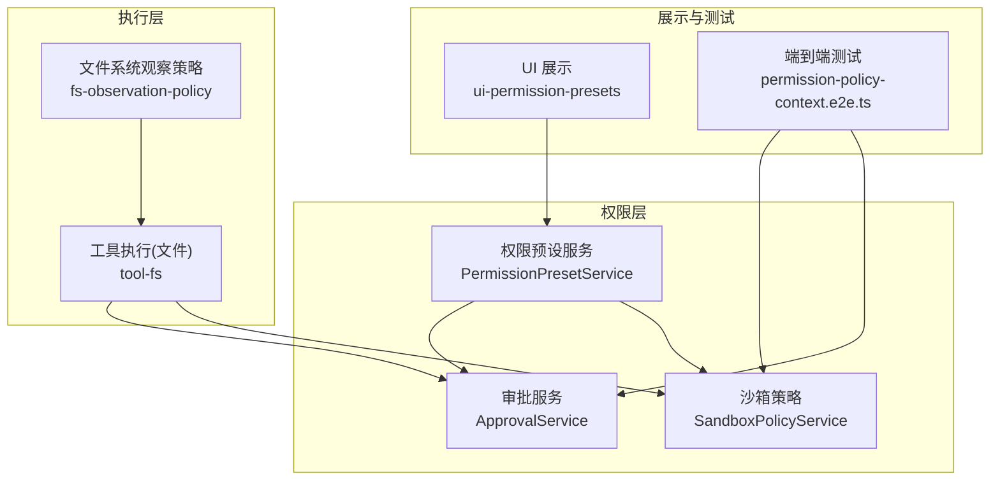
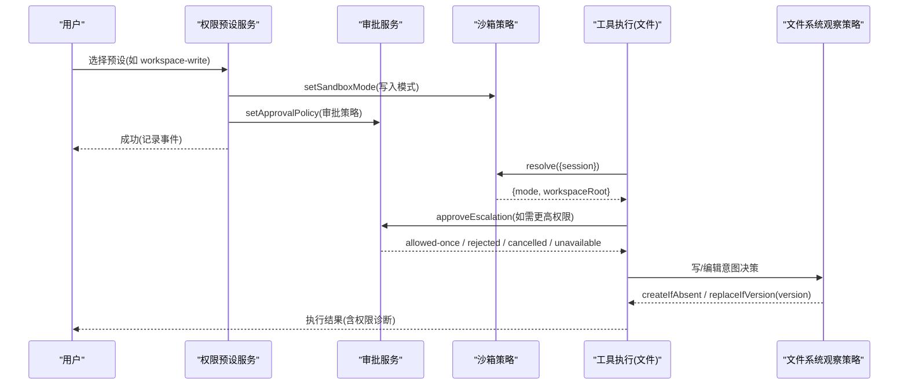
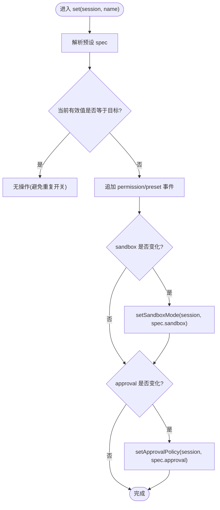
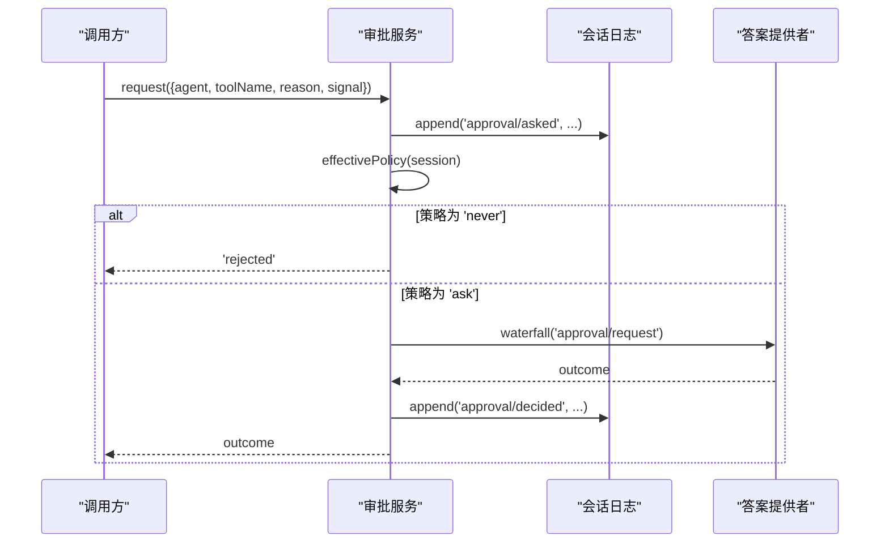
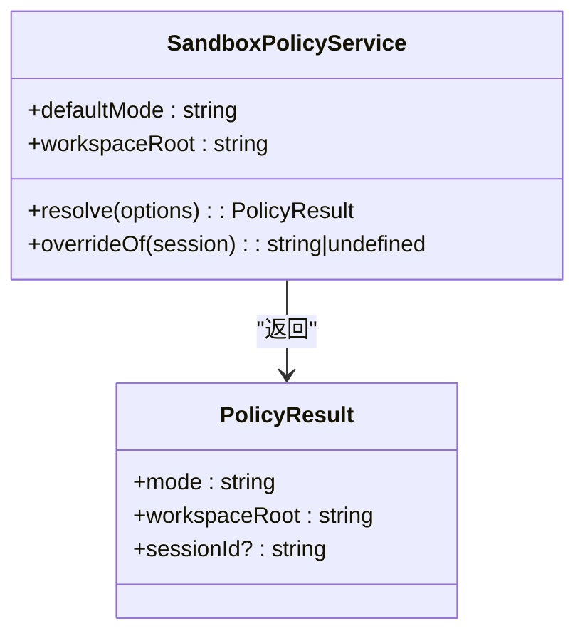
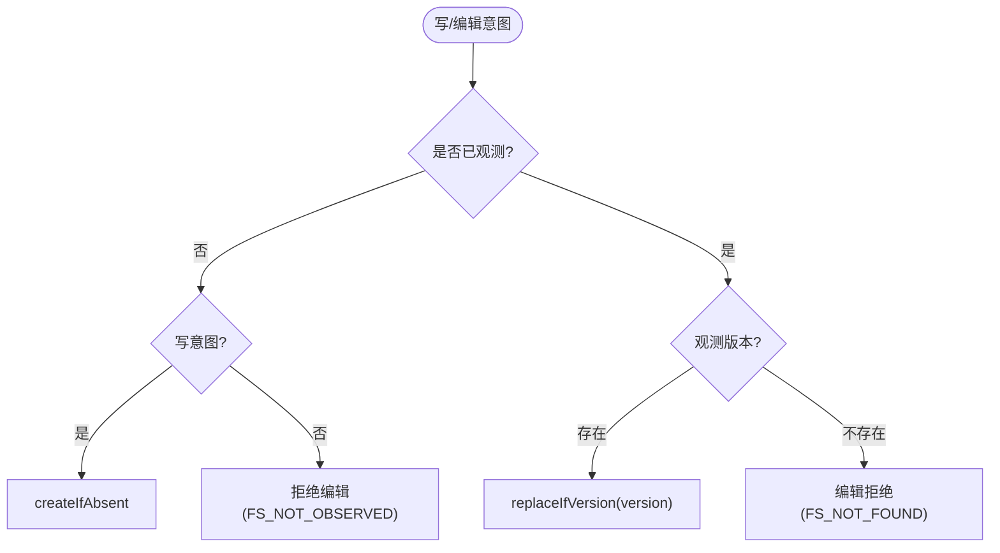
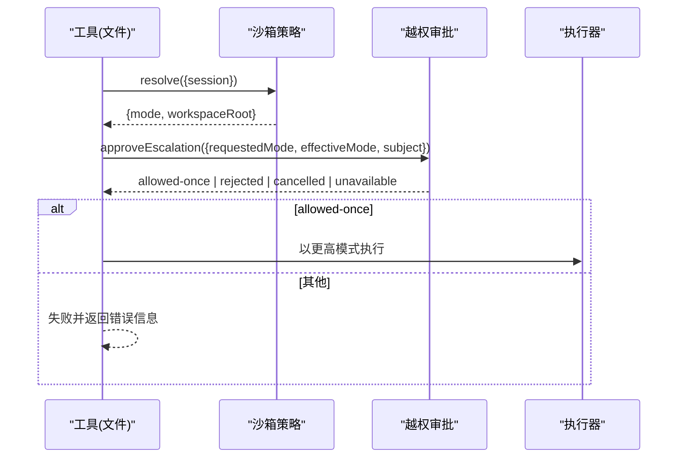
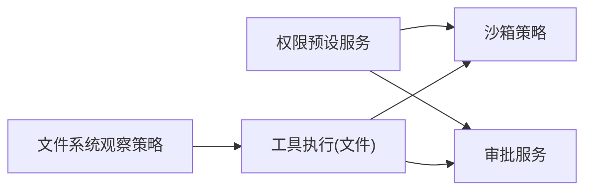

# 权限控制系统

<cite>
**本文引用的文件**
- [packages/interaction/permission-presets/src/index.ts](file://packages/interaction/permission-presets/src/index.ts)
- [packages/interaction/user-approval/src/index.ts](file://packages/interaction/user-approval/src/index.ts)
- [packages/sandbox/sandbox-policy/tests/policy.spec.ts](file://packages/sandbox/sandbox-policy/tests/policy.spec.ts)
- [packages/fs/tool-fs/src/sandbox.ts](file://packages/fs/tool-fs/src/sandbox.ts)
- [packages/fs/fs-observation-policy/tests/policy.spec.ts](file://packages/fs/fs-observation-policy/tests/policy.spec.ts)
- [apps/web/tests/permission-policy-context.e2e.ts](file://apps/web/tests/permission-policy-context.e2e.ts)
- [packages/client/ui-permission-presets/src/client/presentation.ts](file://packages/client/ui-permission-presets/src/client/presentation.ts)
- [packages/client/connection/src/client/fixture.ts](file://packages/client/connection/src/client/fixture.ts)
- [docs/subsystems/approval.md](file://docs/subsystems/approval.md)
- [.agents/notes/implemented/feature/2026-07-30-current-sandbox-policy-context.md](file://.agents/notes/implemented/feature/2026-07-30-current-sandbox-policy-context.md)
</cite>

## 目录
1. [简介](#简介)
2. [项目结构](#项目结构)
3. [核心组件](#核心组件)
4. [架构总览](#架构总览)
5. [详细组件分析](#详细组件分析)
6. [依赖关系分析](#依赖关系分析)
7. [性能考虑](#性能考虑)
8. [故障排除指南](#故障排除指南)
9. [结论](#结论)
10. [附录](#附录)

## 简介
本文件系统性说明 DeepSeek Harness 的权限控制系统，覆盖细粒度访问控制（资源级、操作级、上下文感知）、角色基础权限管理（RBAC）的配置与使用、动态权限评估机制（检查点、条件判断、缓存），以及权限预设（Presets）的使用与自定义策略开发。文档同时提供可操作的配置示例与常见问题排查路径，帮助读者在安全与可用性之间取得平衡。

## 项目结构
权限相关能力由多个子系统协作实现：
- 权限预设服务：将“沙箱模式 + 审批策略”打包为可切换的预设，并提供会话初始化和持久化默认值。
- 审批服务：负责审批策略的生效、请求路由、审计日志和运行时上下文注入。
- 沙箱策略：定义并解析当前会话的文件访问模式与工作区根路径，向系统提示注入当前策略。
- 文件系统观察策略：基于“先观测后编辑”的原则，确保写操作具备版本一致性。
- 工具执行时的越权审批：在执行阶段对需要更高权限的操作进行审批拦截。
- Web 端展示与测试：将权限状态以用户友好的方式呈现，并通过端到端测试验证行为。

图表来源
- [packages/interaction/permission-presets/src/index.ts:170-294](file://packages/interaction/permission-presets/src/index.ts#L170-L294)
- [packages/interaction/user-approval/src/index.ts:157-202](file://packages/interaction/user-approval/src/index.ts#L157-L202)
- [packages/sandbox/sandbox-policy/tests/policy.spec.ts:42-141](file://packages/sandbox/sandbox-policy/tests/policy.spec.ts#L42-L141)
- [packages/fs/tool-fs/src/sandbox.ts:95-108](file://packages/fs/tool-fs/src/sandbox.ts#L95-L108)
- [packages/fs/fs-observation-policy/tests/policy.spec.ts:47-110](file://packages/fs/fs-observation-policy/tests/policy.spec.ts#L47-L110)
- [apps/web/tests/permission-policy-context.e2e.ts:126-139](file://apps/web/tests/permission-policy-context.e2e.ts#L126-L139)

章节来源
- [packages/interaction/permission-presets/src/index.ts:170-294](file://packages/interaction/permission-presets/src/index.ts#L170-L294)
- [packages/interaction/user-approval/src/index.ts:157-202](file://packages/interaction/user-approval/src/index.ts#L157-L202)
- [packages/sandbox/sandbox-policy/tests/policy.spec.ts:42-141](file://packages/sandbox/sandbox-policy/tests/policy.spec.ts#L42-L141)
- [packages/fs/tool-fs/src/sandbox.ts:95-108](file://packages/fs/tool-fs/src/sandbox.ts#L95-L108)
- [packages/fs/fs-observation-policy/tests/policy.spec.ts:47-110](file://packages/fs/fs-observation-policy/tests/policy.spec.ts#L47-L110)
- [apps/web/tests/permission-policy-context.e2e.ts:126-139](file://apps/web/tests/permission-policy-context.e2e.ts#L126-L139)

## 核心组件
- 权限预设服务（PermissionPresetService）
  - 职责：维护预设表（沙箱模式 + 审批策略组合），提供会话初始化时“钉入”默认权限，支持通过命令或 UI 切换预设，生成只读投影供前端展示。
  - 关键特性：保留用户选择意图；当组合不匹配任何预设时返回“custom”状态；为新会话写入缺失的权限事实。
- 审批服务（ApprovalService）
  - 职责：应用会话级审批策略，处理审批请求、审计日志、运行时上下文注入；支持“ask/never”两种策略。
  - 关键特性：策略变更会通知模型；审批必须在打开的 turn 内进行；失败关闭（fail-closed）。
- 沙箱策略（SandboxPolicyService）
  - 职责：解析部署默认模式与工作区根路径，按会话叠加覆盖；向系统提示注入当前策略上下文。
  - 关键特性：模式枚举受控；工作区路径解析稳定；支持符号链接语义。
- 文件系统观察策略（fs-observation-policy）
  - 职责：基于“先观测后编辑”原则，决定写/编辑意图（createIfAbsent / replaceIfVersion），隔离多所有者。
  - 关键特性：首次未观测写操作允许创建；编辑需证明已观测；释放监听器后状态清理。
- 工具执行时的越权审批
  - 职责：在工具调用时对需要更高权限的操作发起审批；根据结果提升或拒绝执行。
  - 关键特性：非扩宽请求直接失败；不同审批结果映射到明确错误信息。

章节来源
- [packages/interaction/permission-presets/src/index.ts:170-449](file://packages/interaction/permission-presets/src/index.ts#L170-L449)
- [packages/interaction/user-approval/src/index.ts:157-313](file://packages/interaction/user-approval/src/index.ts#L157-L313)
- [packages/sandbox/sandbox-policy/tests/policy.spec.ts:42-231](file://packages/sandbox/sandbox-policy/tests/policy.spec.ts#L42-L231)
- [packages/fs/fs-observation-policy/tests/policy.spec.ts:47-237](file://packages/fs/fs-observation-policy/tests/policy.spec.ts#L47-L237)
- [packages/fs/tool-fs/src/sandbox.ts:95-108](file://packages/fs/tool-fs/src/sandbox.ts#L95-L108)

## 架构总览
下图展示了从用户切换到预设，到执行阶段审批与沙箱控制的完整流程。

图表来源
- [packages/interaction/permission-presets/src/index.ts:391-408](file://packages/interaction/permission-presets/src/index.ts#L391-L408)
- [packages/interaction/user-approval/src/index.ts:191-202](file://packages/interaction/user-approval/src/index.ts#L191-L202)
- [packages/sandbox/sandbox-policy/tests/policy.spec.ts:63-85](file://packages/sandbox/sandbox-policy/tests/policy.spec.ts#L63-L85)
- [packages/fs/tool-fs/src/sandbox.ts:95-108](file://packages/fs/tool-fs/src/sandbox.ts#L95-L108)
- [packages/fs/fs-observation-policy/tests/policy.spec.ts:66-110](file://packages/fs/fs-observation-policy/tests/policy.spec.ts#L66-L110)

## 详细组件分析

### 权限预设服务（PermissionPresetService）
- 设计要点
  - 预设表包含 sandbox 与 approval 的组合，支持 name/description 用于客户端展示。
  - 新会话创建时“钉入”默认权限；若已有部分事实则补齐缺失项。
  - 当组合不匹配任何预设时，推导为“custom”，仅作为视图状态，不可作为目标预设。
  - 提供会话投影（permissions）与命令（/permission）两个可选子模块。
- 关键流程
  - 设置预设：写入 permission/preset 事件，随后按需写入 sandbox/mode 与 approval/policy。
  - 读取当前预设：折叠最近的事件，优先保留用户选择，再回退到表格顺序匹配。
  - 新会话初始化：若无任何权限事实且非种子会话，则写入默认预设及对应模式与策略。

图表来源
- [packages/interaction/permission-presets/src/index.ts:391-408](file://packages/interaction/permission-presets/src/index.ts#L391-L408)
- [packages/interaction/permission-presets/src/index.ts:416-446](file://packages/interaction/permission-presets/src/index.ts#L416-L446)

章节来源
- [packages/interaction/permission-presets/src/index.ts:170-449](file://packages/interaction/permission-presets/src/index.ts#L170-L449)

### 审批服务（ApprovalService）
- 设计要点
  - 策略：'ask' 委托给答案提供者，'never' 自动拒绝；两者均保证确定性。
  - 审计：每次 ask/decided 成对写入会话日志，必须位于打开的 turn 内。
  - 上下文：通过运行时上下文注入当前策略文本，使模型知晓是否需要审批。
- 关键流程
  - 切换策略：setPolicy 写入策略事件并向 agent 注入通知消息。
  - 审批请求：校验 turn 状态，写入 asked，计算 outcome，写入 decided，返回结果。
  - 策略判定：在服务内部优先判定 'never'，再进入 waterfall 分发。

图表来源
- [packages/interaction/user-approval/src/index.ts:191-202](file://packages/interaction/user-approval/src/index.ts#L191-L202)
- [packages/interaction/user-approval/src/index.ts:222-241](file://packages/interaction/user-approval/src/index.ts#L222-L241)
- [packages/interaction/user-approval/src/index.ts:269-309](file://packages/interaction/user-approval/src/index.ts#L269-L309)

章节来源
- [packages/interaction/user-approval/src/index.ts:157-313](file://packages/interaction/user-approval/src/index.ts#L157-L313)
- [docs/subsystems/approval.md:100-140](file://docs/subsystems/approval.md#L100-L140)

### 沙箱策略（SandboxPolicyService）
- 设计要点
  - 模式枚举：read-only / workspace-write / danger-full-access。
  - 工作区根路径：解析绝对路径，支持符号链接语义。
  - 上下文注入：向系统提示注入当前策略文本，保持字节稳定。
- 关键流程
  - 解析策略：按会话模式与 cwd 解析最终模式与根路径。
  - 覆盖优先级：批准的 mode 可覆盖会话模式但保留其 root。
  - 恢复重建：从会话日志重建策略，无 agent 时省略诊断。

图表来源
- [packages/sandbox/sandbox-policy/tests/policy.spec.ts:42-141](file://packages/sandbox/sandbox-policy/tests/policy.spec.ts#L42-L141)
- [packages/sandbox/sandbox-policy/tests/policy.spec.ts:144-208](file://packages/sandbox/sandbox-policy/tests/policy.spec.ts#L144-L208)

章节来源
- [packages/sandbox/sandbox-policy/tests/policy.spec.ts:42-231](file://packages/sandbox/sandbox-policy/tests/policy.spec.ts#L42-L231)

### 文件系统观察策略（fs-observation-policy）
- 设计要点
  - 写意图：未观测的目标允许 createIfAbsent；已观测的目标以版本为基础 replaceIfVersion。
  - 编辑意图：必须证明已观测，否则拒绝（FS_NOT_OBSERVED）；观测为 absent 时编辑拒绝（FS_NOT_FOUND）。
  - 多所有者隔离：每个所有者独立记录观测版本。
- 关键流程
  - 注册监听：首次挂载即生效，后续注册者不覆盖（first-wins）。
  - 释放清理：dispose 后状态释放，HMR 安全。

图表来源
- [packages/fs/fs-observation-policy/tests/policy.spec.ts:47-110](file://packages/fs/fs-observation-policy/tests/policy.spec.ts#L47-L110)
- [packages/fs/fs-observation-policy/tests/policy.spec.ts:154-213](file://packages/fs/fs-observation-policy/tests/policy.spec.ts#L154-L213)

章节来源
- [packages/fs/fs-observation-policy/tests/policy.spec.ts:47-237](file://packages/fs/fs-observation-policy/tests/policy.spec.ts#L47-L237)

### 工具执行时的越权审批
- 设计要点
  - 在工具执行前检查是否需要更宽松的沙箱模式；若是，则发起审批。
  - 非扩宽请求直接失败；不同审批结果映射到明确错误信息。
- 关键流程
  - 获取当前策略，构造请求（requestedMode/effectiveMode/subject）。
  - 调用审批服务，根据结果调整执行策略或终止。

图表来源
- [packages/fs/tool-fs/src/sandbox.ts:95-108](file://packages/fs/tool-fs/src/sandbox.ts#L95-L108)

章节来源
- [packages/fs/tool-fs/src/sandbox.ts:95-108](file://packages/fs/tool-fs/src/sandbox.ts#L95-L108)

### 权限预设（Presets）与 UI 展示
- 预设表：包含内置预设（如 workspace-write、danger-full-access），支持自定义名称与描述。
- UI 展示：将机器值转换为人类可读标题；特殊值（如 full access）显示产品标签。
- 夹具与测试：Web 夹具中复现预设折叠逻辑，用于端到端测试。

章节来源
- [packages/interaction/permission-presets/src/index.ts:170-227](file://packages/interaction/permission-presets/src/index.ts#L170-L227)
- [packages/client/ui-permission-presets/src/client/presentation.ts:1-22](file://packages/client/ui-permission-presets/src/client/presentation.ts#L1-L22)
- [packages/client/connection/src/client/fixture.ts:979-1009](file://packages/client/connection/src/client/fixture.ts#L979-L1009)

## 依赖关系分析
- 松耦合：各组件通过事件与接口交互，预设服务依赖沙箱策略与审批服务，但不直接执行 I/O。
- 强内聚：审批服务集中处理策略、审计与上下文；沙箱策略专注模式解析与上下文注入。
- 外部集成：文件系统观察策略与工具执行层紧密配合，确保写/编辑一致性与安全性。
- 循环依赖：未发现循环依赖；依赖方向清晰（预设→策略/审批→执行→观察）。

图表来源
- [packages/interaction/permission-presets/src/index.ts:196-294](file://packages/interaction/permission-presets/src/index.ts#L196-L294)
- [packages/fs/tool-fs/src/sandbox.ts:95-108](file://packages/fs/tool-fs/src/sandbox.ts#L95-L108)
- [packages/fs/fs-observation-policy/tests/policy.spec.ts:47-110](file://packages/fs/fs-observation-policy/tests/policy.spec.ts#L47-L110)

章节来源
- [packages/interaction/permission-presets/src/index.ts:196-294](file://packages/interaction/permission-presets/src/index.ts#L196-L294)
- [packages/fs/tool-fs/src/sandbox.ts:95-108](file://packages/fs/tool-fs/src/sandbox.ts#L95-L108)
- [packages/fs/fs-observation-policy/tests/policy.spec.ts:47-110](file://packages/fs/fs-observation-policy/tests/policy.spec.ts#L47-L110)

## 性能考虑
- 策略上下文缓存：沙箱策略上下文贡献是缓存安全的，避免重复计算与不稳定输出。
- 最小事件写入：预设切换仅在值变化时写入事件，减少日志膨胀。
- 首问策略可见性：通过运行时上下文注入当前策略，降低首次拒绝带来的额外开销。
- 观察策略优化：首次观测后可直接编辑，无需重复读取，提升并发编辑效率。

章节来源
- [.agents/notes/implemented/feature/2026-07-30-current-sandbox-policy-context.md:1-41](file://.agents/notes/implemented/feature/2026-07-30-current-sandbox-policy-context.md#L1-L41)
- [packages/interaction/permission-presets/src/index.ts:391-408](file://packages/interaction/permission-presets/src/index.ts#L391-L408)
- [packages/fs/fs-observation-policy/tests/policy.spec.ts:120-129](file://packages/fs/fs-observation-policy/tests/policy.spec.ts#L120-L129)

## 故障排除指南
- 问题：新会话未携带当前策略上下文
  - 现象：模型首次请求不包含策略信息，直到第一次拒绝才得知限制。
  - 解决：确认沙箱策略上下文贡献已挂载；检查会话是否已正确解析策略。
- 问题：审批被自动拒绝
  - 现象：审批结果为 'rejected'，无交互。
  - 解决：检查会话策略是否为 'never'；必要时改为 'ask' 并配置答案提供者。
- 问题：编辑失败（FS_NOT_OBSERVED）
  - 现象：编辑操作被拒绝，提示未观测。
  - 解决：先执行读取或观测操作，确保版本已知后再编辑。
- 问题：预设切换无效
  - 现象：切换后仍为 custom。
  - 解决：确认组合值匹配预设表；若确实不匹配，应显式配置 defaultPreset。

章节来源
- [apps/web/tests/permission-policy-context.e2e.ts:126-139](file://apps/web/tests/permission-policy-context.e2e.ts#L126-L139)
- [packages/interaction/user-approval/src/index.ts:269-309](file://packages/interaction/user-approval/src/index.ts#L269-L309)
- [packages/fs/fs-observation-policy/tests/policy.spec.ts:82-110](file://packages/fs/fs-observation-policy/tests/policy.spec.ts#L82-L110)
- [packages/interaction/permission-presets/src/index.ts:416-446](file://packages/interaction/permission-presets/src/index.ts#L416-L446)

## 结论
DeepSeek Harness 的权限控制系统通过“预设 + 策略 + 审批 + 观察”的分层设计，实现了资源级、操作级与上下文感知的细粒度访问控制。权限预设简化了复杂策略的组合与切换；审批服务确保敏感操作的合规性；沙箱策略与工作区解析保障文件访问的安全边界；文件系统观察策略提供一致的写/编辑语义。整体架构清晰、可扩展，并在性能与稳定性方面做了充分优化。

## 附录
- 配置示例（概念性说明）
  - 预设表：定义 workspace-write（沙箱写 + 询问审批）与 danger-full-access（全量访问 + 禁用审批）。
  - 默认预设：为新会话指定默认预设；若组合不匹配任何预设，需显式配置。
  - 审批策略：'ask' 启用交互审批，'never' 自动拒绝所有需要审批的操作。
- 自定义权限策略开发方法
  - 扩展预设表：新增 sandbox 与 approval 的组合，提供 name/description。
  - 注册命令/投影：可选地暴露 /permission 命令与 permissions 投影，便于管理与展示。
  - 集成审批与沙箱：确保预设切换能正确写入策略事件，并在执行阶段生效。
- 实际权限配置示例（参考路径）
  - 预设定义与默认值：[packages/interaction/permission-presets/src/index.ts:170-227](file://packages/interaction/permission-presets/src/index.ts#L170-L227)
  - 审批策略与上下文：[packages/interaction/user-approval/src/index.ts:157-202](file://packages/interaction/user-approval/src/index.ts#L157-L202)
  - 沙箱策略解析与上下文：[packages/sandbox/sandbox-policy/tests/policy.spec.ts:42-141](file://packages/sandbox/sandbox-policy/tests/policy.spec.ts#L42-L141)
  - 工具执行时的越权审批：[packages/fs/tool-fs/src/sandbox.ts:95-108](file://packages/fs/tool-fs/src/sandbox.ts#L95-L108)
  - 文件系统观察策略：[packages/fs/fs-observation-policy/tests/policy.spec.ts:47-110](file://packages/fs/fs-observation-policy/tests/policy.spec.ts#L47-L110)
  - 端到端验证：[apps/web/tests/permission-policy-context.e2e.ts:126-139](file://apps/web/tests/permission-policy-context.e2e.ts#L126-L139)