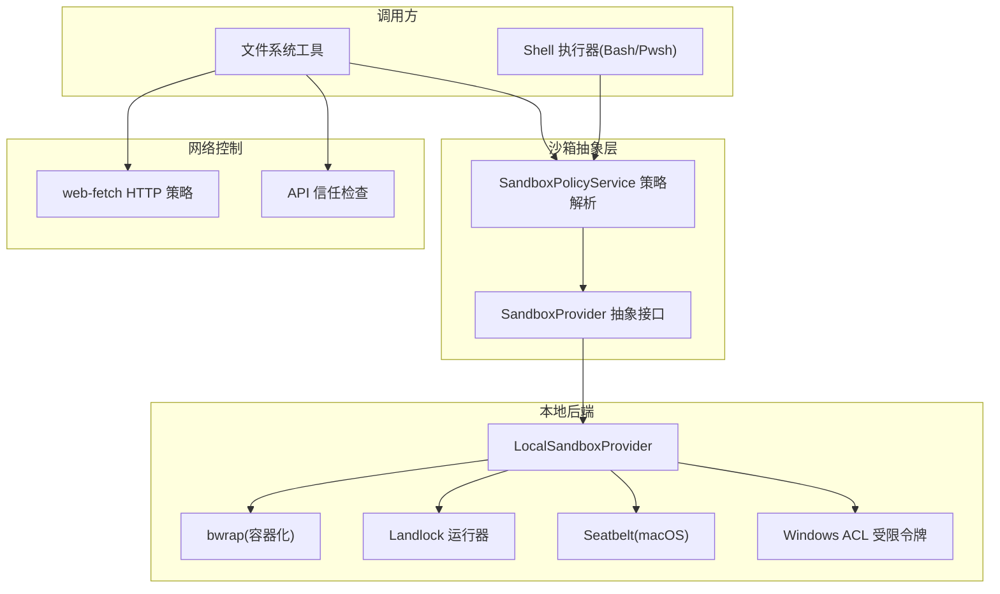
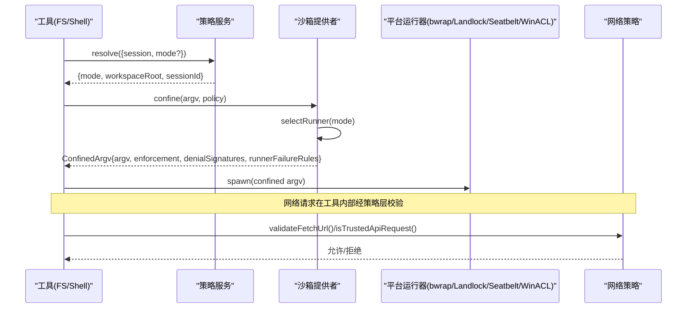
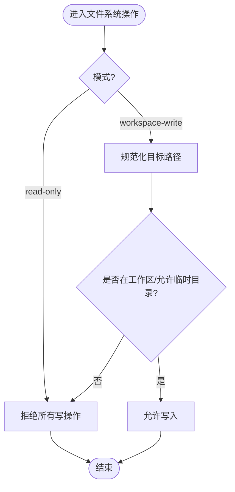
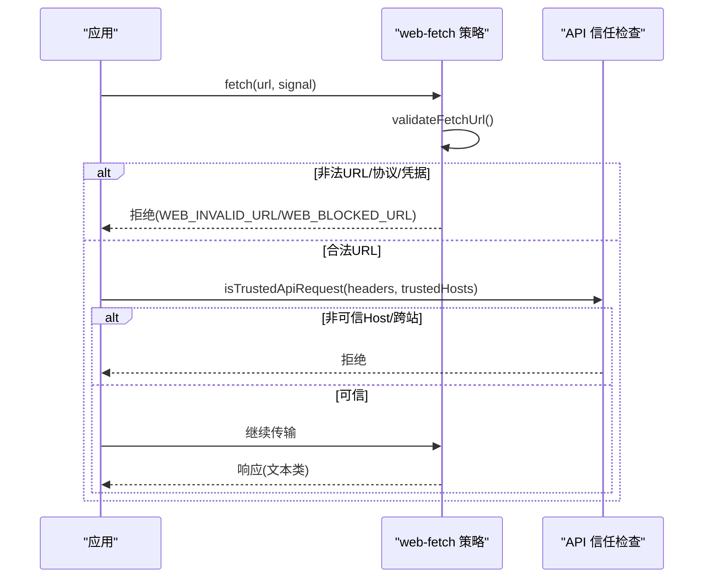
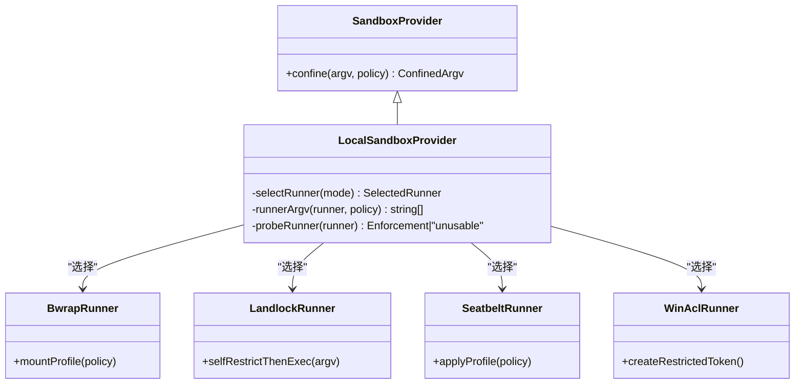
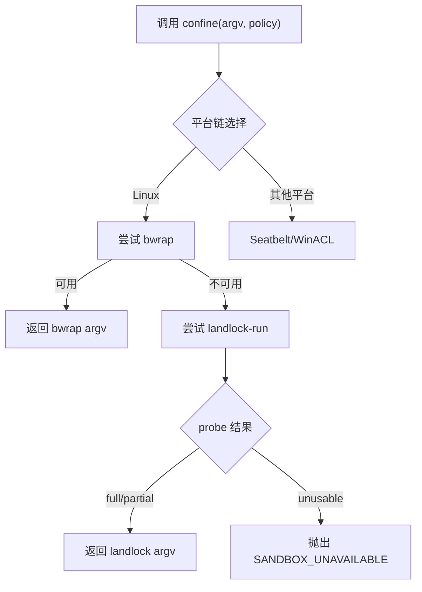
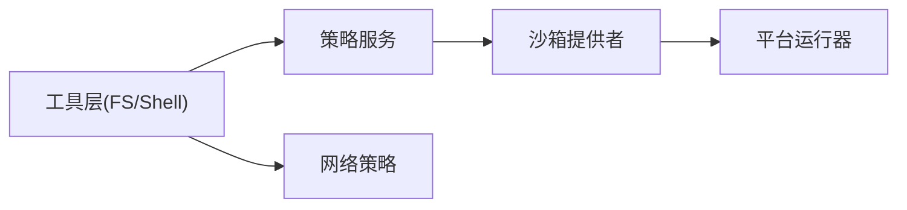

# 沙箱隔离机制

<cite>
**本文引用的文件**
- [packages/sandbox/sandbox/src/index.ts](file://packages/sandbox/sandbox/src/index.ts)
- [packages/sandbox/sandbox-local/src/index.ts](file://packages/sandbox/sandbox-local/src/index.ts)
- [packages/sandbox/sandbox/roots.ts](file://packages/sandbox/sandbox/roots.ts)
- [native/landlock-run/README.md](file://native/landlock-run/README.md)
- [packages/experimental/webworker-runtime/src/shell/process/landlock.ts](file://packages/experimental/webworker-runtime/src/shell/process/landlock.ts)
- [packages/fs/tool-fs/src/sandbox.ts](file://packages/fs/tool-fs/src/sandbox.ts)
- [packages/web/web-fetch-http/src/policy.ts](file://packages/web/web-fetch-http/src/policy.ts)
- [packages/client/connection/src/api-request-trust.ts](file://packages/client/connection/src/api-request-trust.ts)
- [packages/shell/bash-sandbox/tests/landlock.e2e.ts](file://packages/shell/bash-sandbox/tests/landlock.e2e.ts)
- [packages/sandbox/sandbox-local/tests/bwrap.e2e.ts](file://packages/sandbox/sandbox-local/tests/bwrap.e2e.ts)
- [packages/sandbox/sandbox-local/tests/landlock.e2e.ts](file://packages/sandbox/sandbox-local/tests/landlock.e2e.ts)
- [packages/sandbox/sandbox-windows-acl/src/index.ts](file://packages/sandbox/sandbox-windows-acl/src/index.ts)
- [docs/subsystems/sandbox.md](file://docs/subsystems/sandbox.md)
</cite>

## 目录
1. [简介](#简介)
2. [项目结构](#项目结构)
3. [核心组件](#核心组件)
4. [架构总览](#架构总览)
5. [详细组件分析](#详细组件分析)
6. [依赖关系分析](#依赖关系分析)
7. [性能考量](#性能考量)
8. [故障排查指南](#故障排查指南)
9. [结论](#结论)
10. [附录](#附录)

## 简介
本文件系统性梳理 DeepSeek Harness 的沙箱隔离机制，覆盖文件系统访问限制、网络请求控制、进程隔离与 Landlock 内核级安全模块的使用。文档面向不同技术背景的读者，提供从高层架构到代码级实现的渐进式说明，并给出启动配置、性能优化、故障恢复策略与安全测试用例参考。

## 项目结构
DeepSeek Harness 将“沙箱”作为能力边界进行抽象：上层工具（如 Bash/Pwsh 执行器、文件系统工具）通过统一的沙箱服务接口发起受限执行；本地后端根据平台选择具体实现（Linux bwrap/Landlock、macOS Seatbelt、Windows ACL 受限令牌）。网络侧提供独立的 URL 白名单与协议限制，确保仅允许受控的 HTTP(S) 出站流量。

图表来源
- [packages/sandbox/sandbox/src/index.ts:1-179](file://packages/sandbox/sandbox/src/index.ts#L1-L179)
- [packages/sandbox/sandbox-local/src/index.ts:1-568](file://packages/sandbox/sandbox-local/src/index.ts#L1-L568)
- [packages/web/web-fetch-http/src/policy.ts:1-119](file://packages/web/web-fetch-http/src/policy.ts#L1-L119)
- [packages/client/connection/src/api-request-trust.ts:85-105](file://packages/client/connection/src/api-request-trust.ts#L85-L105)

章节来源
- [docs/subsystems/sandbox.md:1-219](file://docs/subsystems/sandbox.md#L1-L219)
- [packages/sandbox/sandbox/src/index.ts:1-179](file://packages/sandbox/sandbox/src/index.ts#L1-L179)

## 核心组件
- 沙箱抽象与服务
  - SandboxProvider：定义 confine(argv, policy) 契约，要求返回受约束的可执行 argv 或失败关闭。
  - LocalSandboxProvider：平台后端选择与探测（bwrap/Landlock/Seatbelt/Windows ACL），生成 runner argv 并报告 enforcement 完整度与诊断方言。
  - SandboxPolicyService：按会话与部署默认值解析每调用策略（mode/workspaceRoot/sessionId）。
- 文件系统白名单与权限
  - writableRoots：计算可写根集合（read-only 为空；workspace-write 包含工作区、/tmp、os.tmpdir()）。
  - canonicalPath：规范化路径以匹配真实文件系统身份。
  - landlockFileSystem：在实验运行时中基于 grant 列表构建进程内文件系统守卫，拒绝未授权读写。
- 网络控制
  - web-fetch HTTP 策略：URL 长度上限、仅允许 http/https、禁止凭据嵌入、同源重定向拦截、内容类型分类与解码。
  - API 信任检查：Host 白名单校验、防 DNS 重绑定、跨站标记拒绝。
- 进程隔离
  - bwrap：命名空间隔离、私有 PID、临时 /tmp 挂载、读/写模式映射。
  - Landlock：自限制后 exec，继承规则集，按 ABI 级别报告 full/partial。
  - Windows ACL：受限令牌 + 双重 DACL 检查，工作区与临时目录写入 SID 分离。

章节来源
- [packages/sandbox/sandbox/src/index.ts:23-179](file://packages/sandbox/sandbox/src/index.ts#L23-L179)
- [packages/sandbox/sandbox-local/src/index.ts:140-344](file://packages/sandbox/sandbox-local/src/index.ts#L140-L344)
- [packages/sandbox/sandbox/roots.ts:16-55](file://packages/sandbox/sandbox/roots.ts#L16-L55)
- [packages/experimental/webworker-runtime/src/shell/process/landlock.ts:87-125](file://packages/experimental/webworker-runtime/src/shell/process/landlock.ts#L87-L125)
- [packages/web/web-fetch-http/src/policy.ts:1-119](file://packages/web/web-fetch-http/src/policy.ts#L1-L119)
- [packages/client/connection/src/api-request-trust.ts:85-105](file://packages/client/connection/src/api-request-trust.ts#L85-L105)

## 架构总览
下图展示一次受限执行的端到端流程：工具层解析策略，沙箱后端选择 runner，构造 argv 并执行；网络请求在到达传输前被策略层过滤。

图表来源
- [packages/sandbox/sandbox/src/index.ts:158-179](file://packages/sandbox/sandbox/src/index.ts#L158-L179)
- [packages/sandbox/sandbox-local/src/index.ts:316-344](file://packages/sandbox/sandbox-local/src/index.ts#L316-L344)
- [packages/web/web-fetch-http/src/policy.ts:41-67](file://packages/web/web-fetch-http/src/policy.ts#L41-L67)
- [packages/client/connection/src/api-request-trust.ts:85-105](file://packages/client/connection/src/api-request-trust.ts#L85-L105)

## 详细组件分析

### 文件系统访问限制
- 路径白名单
  - writableRoots 根据 mode 输出可写根集合；read-only 为空，workspace-write 包含工作区、/tmp、os.tmpdir()，并通过 canonicalPath 规范化。
  - landlockFileSystem 对 readWrite/readOnly 授予根进行归一化与存在性校验，并在每次系统调用时进行包含性检查，拒绝越界路径。
- 文件类型过滤
  - 网络侧 classifyContentType 仅允许文本类响应体（html/text/json/xml 等），二进制默认拒绝。
- 读写权限控制
  - bwrap：read-only 模式下写操作被内核拒绝；workspace-write 允许在工作区内写入，并提供临时 /tmp。
  - Landlock：按 ABI 级别报告 full/partial，失败时通过特定 stderr 方言识别。
  - Windows ACL：工作区与临时目录使用不同 SID，双重 DACL 检查保证写权限仅在两者均允许时生效。

图表来源
- [packages/sandbox/sandbox/roots.ts:43-55](file://packages/sandbox/sandbox/roots.ts#L43-L55)
- [packages/experimental/webworker-runtime/src/shell/process/landlock.ts:94-125](file://packages/experimental/webworker-runtime/src/shell/process/landlock.ts#L94-L125)
- [packages/sandbox/sandbox-local/tests/bwrap.e2e.ts:119-146](file://packages/sandbox/sandbox-local/tests/bwrap.e2e.ts#L119-L146)

章节来源
- [packages/sandbox/sandbox/roots.ts:16-55](file://packages/sandbox/sandbox/roots.ts#L16-L55)
- [packages/experimental/webworker-runtime/src/shell/process/landlock.ts:87-125](file://packages/experimental/webworker-runtime/src/shell/process/landlock.ts#L87-L125)
- [packages/sandbox/sandbox-local/tests/bwrap.e2e.ts:73-146](file://packages/sandbox/sandbox-local/tests/bwrap.e2e.ts#L73-L146)

### 网络请求控制
- URL 白名单与协议限制
  - validateFetchUrl 强制 URL 长度上限，仅允许 http/https，拒绝含用户名的 URL。
  - isSameOrigin 阻止跨源重定向，每个新源需重新校验。
- 流量监控与信任检查
  - isTrustedApiRequest 校验 Host 为回环或可信权威，拒绝跨站标记，防御 DNS 重绑定。
- 内容类型与编码
  - classifyContentType 仅接受文本类响应；decoderForCharset 支持声明字符集，未知则报错。

图表来源
- [packages/web/web-fetch-http/src/policy.ts:1-119](file://packages/web/web-fetch-http/src/policy.ts#L1-L119)
- [packages/client/connection/src/api-request-trust.ts:85-105](file://packages/client/connection/src/api-request-trust.ts#L85-L105)

章节来源
- [packages/web/web-fetch-http/src/policy.ts:1-119](file://packages/web/web-fetch-http/src/policy.ts#L1-L119)
- [packages/client/connection/src/api-request-trust.ts:85-105](file://packages/client/connection/src/api-request-trust.ts#L85-L105)

### 进程隔离技术
- 容器化执行环境
  - bwrap：创建私有 PID 命名空间、挂载临时 /tmp，读/写模式映射到文件系统效果。
- 资源限制
  - 通过 runner 参数与平台特性限制可见性与写范围；Landlock 按 ABI 级别报告完整度。
- 进程间通信安全
  - Windows ACL：受限令牌 + 双重 DACL 检查，避免匿名对象创建导致的权限绕过。

图表来源
- [packages/sandbox/sandbox/src/index.ts:158-179](file://packages/sandbox/sandbox/src/index.ts#L158-L179)
- [packages/sandbox/sandbox-local/src/index.ts:316-344](file://packages/sandbox/sandbox-local/src/index.ts#L316-L344)
- [packages/sandbox/sandbox-local/src/index.ts:492-539](file://packages/sandbox/sandbox-local/src/index.ts#L492-L539)
- [packages/sandbox/sandbox-windows-acl/src/index.ts:272-294](file://packages/sandbox/sandbox-windows-acl/src/index.ts#L272-L294)

章节来源
- [packages/sandbox/sandbox-local/tests/bwrap.e2e.ts:53-146](file://packages/sandbox/sandbox-local/tests/bwrap.e2e.ts#L53-L146)
- [packages/sandbox/sandbox-local/tests/landlock.e2e.ts:24-52](file://packages/sandbox/sandbox-local/tests/landlock.e2e.ts#L24-L52)
- [packages/sandbox/sandbox-windows-acl/src/index.ts:272-294](file://packages/sandbox/sandbox-windows-acl/src/index.ts#L272-L294)

### Landlock 安全模块的使用与配置
- 自限制后执行：landlock-run 安装 Landlock 规则集后 exec 子命令，规则集在 execve 继承，子进程及后代均受约束。
- 探针与报告：probe 返回 full/partial/unusable；partial 表示旧 ABI 或平台限制导致部分约束。
- 集成方式：LocalSandboxProvider 在 Linux 链中优先尝试 bwrap，再回退至 Landlock；失败关闭，不静默降级。

图表来源
- [native/landlock-run/README.md:1-61](file://native/landlock-run/README.md#L1-L61)
- [packages/sandbox/sandbox-local/src/index.ts:492-539](file://packages/sandbox/sandbox-local/src/index.ts#L492-L539)

章节来源
- [native/landlock-run/README.md:1-61](file://native/landlock-run/README.md#L1-L61)
- [packages/sandbox/sandbox-local/src/index.ts:140-240](file://packages/sandbox/sandbox-local/src/index.ts#L140-L240)

### 沙箱环境的启动配置、性能优化与故障恢复
- 启动配置
  - 策略服务：resolve({session?, mode?}) 决定 mode 与 workspaceRoot；danger-full-access 由消费者直接执行原 argv，不调用 ctx.sandbox。
  - 后端配置：LocalSandboxProvider 支持 runnerCommand、runnerFailureSignatures、probeTimeoutMs。
- 性能优化
  - 平台链缓存：selectRunner 结果缓存，避免重复探测。
  - Windows ACL 缓存：工作区 ACE 复用，临时目录按会话分配并回收。
- 故障恢复
  - 失败关闭：无可用后端时抛出 SANDBOX_UNAVAILABLE；runner 失败通过结构化规则识别（exit code + stderr 签名）。
  - 清理：provider dispose 撤销临时 ACL 并删除临时目录。

章节来源
- [docs/subsystems/sandbox.md:10-157](file://docs/subsystems/sandbox.md#L10-L157)
- [packages/sandbox/sandbox-local/src/index.ts:250-344](file://packages/sandbox/sandbox-local/src/index.ts#L250-L344)
- [packages/sandbox/sandbox-local/src/index.ts:445-483](file://packages/sandbox/sandbox-local/src/index.ts#L445-L483)

### 实际的安全测试用例与漏洞防护示例
- 文件系统逃逸防护
  - bwrap 私有 PID 命名空间验证，防止通过 /proc 逃逸。
  - workspace-write 下外部路径写入被拒绝。
- Landlock 行为验证
  - 探针判定 partial/full；错误输出方言匹配。
- 网络越权防护
  - 阻止 loopback 目的地、非 http/https 协议、URL 含凭据。
  - API 信任检查拒绝重绑域名与跨站标记。

章节来源
- [packages/sandbox/sandbox-local/tests/bwrap.e2e.ts:81-146](file://packages/sandbox/sandbox-local/tests/bwrap.e2e.ts#L81-L146)
- [packages/shell/bash-sandbox/tests/landlock.e2e.ts:26-54](file://packages/shell/bash-sandbox/tests/landlock.e2e.ts#L26-L54)
- [packages/web/web-fetch-http/tests/fetch-http.spec.ts:462-492](file://packages/web/web-fetch-http/tests/fetch-http.spec.ts#L462-L492)
- [packages/client/connection/tests/api-request-trust.host.spec.ts:22-115](file://packages/client/connection/tests/api-request-trust.host.spec.ts#L22-L115)

## 依赖关系分析
- 组件耦合
  - 工具层依赖策略服务解析 per-call 策略；策略服务依赖会话与部署配置。
  - 沙箱提供者依赖平台 runner；失败关闭且不静默降级。
- 外部依赖
  - bwrap、sandbox-exec、landlock-run 二进制可用性决定后端选择。
  - Windows ACL 依赖受限令牌与 DACL 机制。
- 循环依赖
  - 当前设计分层清晰，未见循环依赖迹象。

图表来源
- [packages/sandbox/sandbox/src/index.ts:158-179](file://packages/sandbox/sandbox/src/index.ts#L158-L179)
- [packages/sandbox/sandbox-local/src/index.ts:316-344](file://packages/sandbox/sandbox-local/src/index.ts#L316-L344)
- [packages/web/web-fetch-http/src/policy.ts:1-119](file://packages/web/web-fetch-http/src/policy.ts#L1-L119)

章节来源
- [packages/sandbox/sandbox-local/src/index.ts:140-344](file://packages/sandbox/sandbox-local/src/index.ts#L140-L344)
- [packages/web/web-fetch-http/src/policy.ts:1-119](file://packages/web/web-fetch-http/src/policy.ts#L1-L119)

## 性能考量
- 减少重复探测：平台链选择结果缓存，避免多次 spawnSync。
- 最小化权限面：read-only 模式仅授予必要 sink；workspace-write 严格限制写入根。
- 网络开销控制：URL 长度上限、仅文本类响应、同源重定向阻断。
- 资源清理：provider dispose 及时撤销 ACL 并删除临时目录，避免资源泄漏。

[本节提供通用指导，无需特定文件引用]

## 故障排查指南
- 常见错误码与诊断
  - SANDBOX_UNAVAILABLE：无可用后端，需安装 bwrap/启用 Landlock/确保 sandbox-exec 可用或切换危险模式。
  - WEB_INVALID_URL/WEB_BLOCKED_URL：URL 非法或协议不被允许。
  - FS_SANDBOX_DENIED：文件系统操作被沙箱拒绝，可通过升级策略重试（需审批）。
- 定位步骤
  - 检查策略解析结果（mode/workspaceRoot）。
  - 查看 runner 失败规则与 stderr 方言（denialSignatures/runnerFailureRules）。
  - 验证网络策略（validateFetchUrl/isTrustedApiRequest）。
- 恢复建议
  - 修复环境依赖（安装 runner、启用内核功能）。
  - 调整策略（在审批流程下提升 mode）。
  - 修正 URL 与 Host 配置。

章节来源
- [packages/sandbox/sandbox/src/index.ts:118-144](file://packages/sandbox/sandbox/src/index.ts#L118-L144)
- [packages/web/web-fetch-http/src/policy.ts:1-119](file://packages/web/web-fetch-http/src/policy.ts#L1-L119)
- [packages/fs/tool-fs/src/sandbox.ts:110-132](file://packages/fs/tool-fs/src/sandbox.ts#L110-L132)

## 结论
DeepSeek Harness 的沙箱隔离机制通过统一抽象、平台适配与严格的策略解析，实现了文件系统、网络与进程的细粒度隔离。Landlock 提供内核级保护，bwrap/Seatbelt/Windows ACL 在不同平台上补齐能力缺口。结合 URL 白名单、协议限制与信任检查，形成纵深防御。生产部署应关注后端可用性、策略审批流与资源清理，确保高安全与高可用。

[本节总结性内容，无需特定文件引用]

## 附录
- 关键术语
  - 模式：read-only、workspace-write、danger-full-access
  - 执行完整度：full、partial
  - 策略：per-call 的 mode/workspaceRoot/sessionId
- 参考路径
  - 沙箱抽象与策略：packages/sandbox/sandbox/src/index.ts
  - 本地后端实现：packages/sandbox/sandbox-local/src/index.ts
  - 文件系统白名单：packages/sandbox/sandbox/roots.ts
  - Landlock 运行器：native/landlock-run/README.md
  - 网络策略：packages/web/web-fetch-http/src/policy.ts
  - API 信任检查：packages/client/connection/src/api-request-trust.ts

[本节为补充信息，无需特定文件引用]