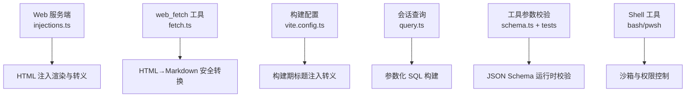
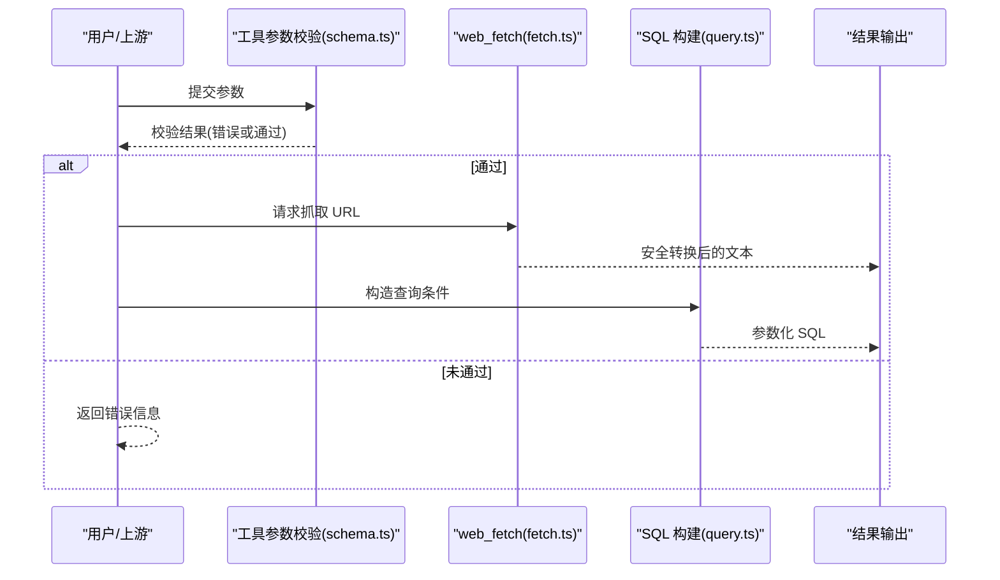
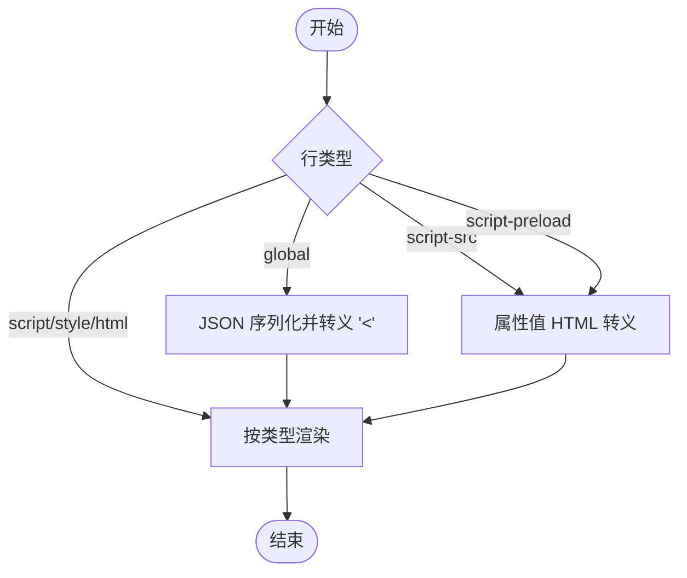
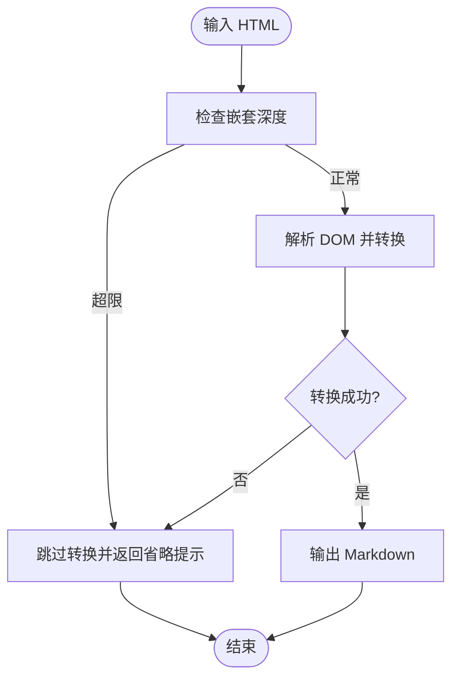
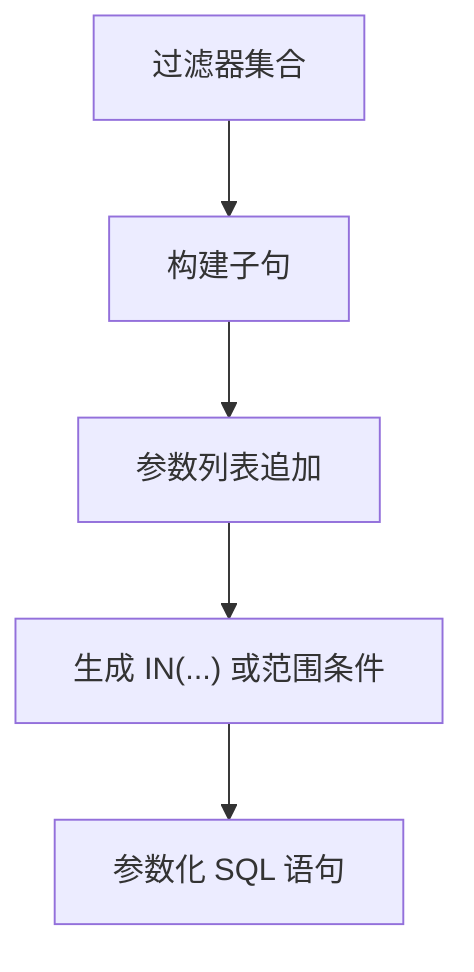
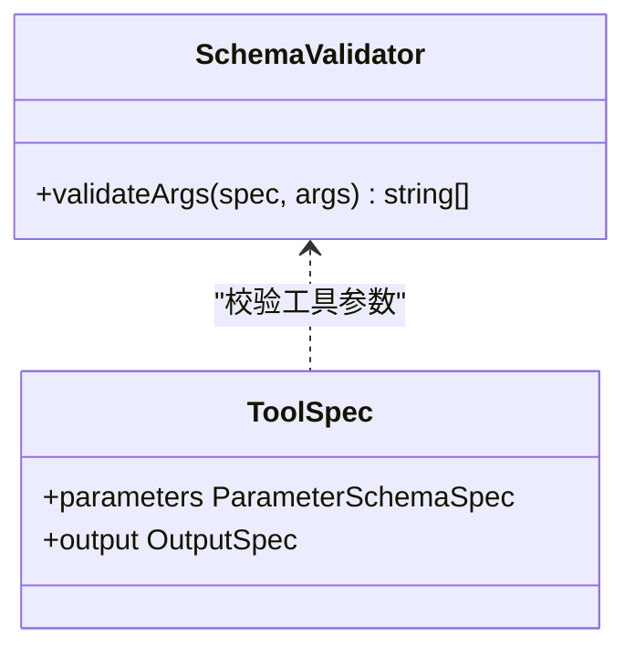
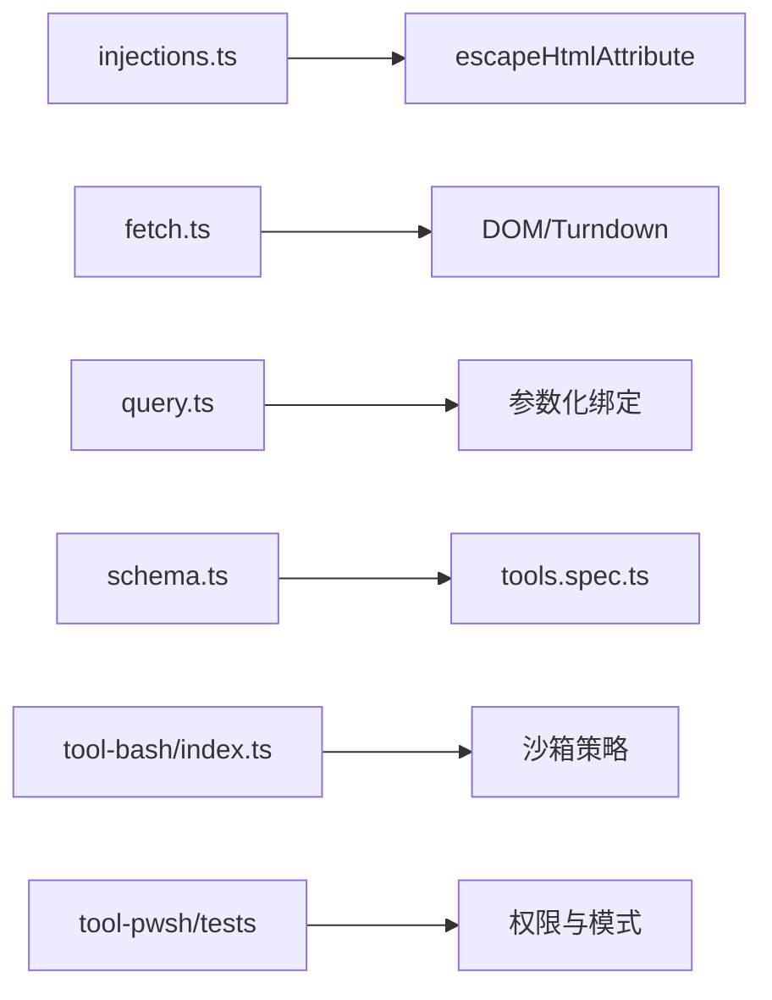

# 输入验证和过滤

<cite>
**本文引用的文件**
- [packages/host/webserver/src/injections.ts](file://packages/host/webserver/src/injections.ts)
- [packages/web/tool-web/src/fetch.ts](file://packages/web/tool-web/src/fetch.ts)
- [apps/web/vite.config.ts](file://apps/web/vite.config.ts)
- [packages/session-query/session-query-sqlite/src/query.ts](file://packages/session-query/session-query-sqlite/src/query.ts)
- [packages/session/session-persistence-sqlite/tests/sql-resource-boundary.spec.ts](file://packages/session/session-persistence-sqlite/tests/sql-resource-boundary.spec.ts)
- [packages/core/tools/src/schema.ts](file://packages/core/tools/src/schema.ts)
- [packages/core/tools/tests/tools.spec.ts](file://packages/core/tools/tests/tools.spec.ts)
- [packages/fs/tool-fs-search/src/grep.ts](file://packages/fs/tool-fs-search/src/grep.ts)
- [packages/shell/tool-bash/src/index.ts](file://packages/shell/tool-bash/src/index.ts)
- [packages/shell/tool-pwsh/tests/tools.spec.ts](file://packages/shell/tool-pwsh/tests/tools.spec.ts)
</cite>

## 目录
1. [简介](#简介)
2. [项目结构](#项目结构)
3. [核心组件](#核心组件)
4. [架构总览](#架构总览)
5. [详细组件分析](#详细组件分析)
6. [依赖关系分析](#依赖关系分析)
7. [性能考量](#性能考量)
8. [故障排查指南](#故障排查指南)
9. [结论](#结论)
10. [附录](#附录)

## 简介
本文件聚焦 DeepSeek Harness 的输入验证与过滤机制，覆盖用户输入清洗、特殊字符转义、SQL 注入防护、命令注入防护、XSS 防护（内容安全策略、输出编码、DOM 操作安全）、以及输入验证框架的使用与自定义规则配置。文档通过代码级分析与图示，帮助读者理解各层如何协同保障系统安全。

## 项目结构
围绕输入安全的关键实现分布在以下模块：
- Web 服务端 HTML 注入渲染：对结构化注入行进行安全渲染与属性转义，避免 XSS。
- Web 抓取工具：对外部 HTML 内容进行深度防御式转换与裁剪，防止恶意脚本进入模型上下文。
- 构建期标题注入：将构建时环境变量安全地注入到页面标题中。
- SQL 查询构建：使用参数化绑定生成 SQL，避免字符串拼接导致的注入风险。
- 工具参数校验：基于 JSON Schema 的运行时参数校验，确保输入符合预期类型与约束。
- Shell/命令执行：沙箱模式与权限控制，限制危险操作。

**图表来源**
- [packages/host/webserver/src/injections.ts:34-76](file://packages/host/webserver/src/injections.ts#L34-L76)
- [packages/web/tool-web/src/fetch.ts:112-263](file://packages/web/tool-web/src/fetch.ts#L112-L263)
- [apps/web/vite.config.ts:15-27](file://apps/web/vite.config.ts#L15-L27)
- [packages/session-query/session-query-sqlite/src/query.ts:385-442](file://packages/session-query/session-query-sqlite/src/query.ts#L385-L442)
- [packages/core/tools/src/schema.ts:478-478](file://packages/core/tools/src/schema.ts#L478-L478)
- [packages/shell/tool-bash/src/index.ts:70-83](file://packages/shell/tool-bash/src/index.ts#L70-L83)

**章节来源**
- [packages/host/webserver/src/injections.ts:1-120](file://packages/host/webserver/src/injections.ts#L1-L120)
- [packages/web/tool-web/src/fetch.ts:1-515](file://packages/web/tool-web/src/fetch.ts#L1-L515)
- [apps/web/vite.config.ts:1-230](file://apps/web/vite.config.ts#L1-L230)
- [packages/session-query/session-query-sqlite/src/query.ts:385-442](file://packages/session-query/session-query-sqlite/src/query.ts#L385-L442)
- [packages/core/tools/src/schema.ts:478-478](file://packages/core/tools/src/schema.ts#L478-L478)
- [packages/shell/tool-bash/src/index.ts:70-83](file://packages/shell/tool-bash/src/index.ts#L70-L83)

## 核心组件
- 结构化 HTML 注入渲染器：提供安全的行类型与属性转义，避免注入攻击。
- web_fetch 工具：对外部 HTML 进行深度解析与转换，设置嵌套深度上限，拒绝不安全内容。
- 构建期标题注入：在构建阶段对标题文本进行 HTML 转义后注入页面。
- SQL 查询构建器：使用占位符与参数列表生成 SQL，避免直接拼接用户输入。
- 工具参数校验框架：基于 JSON Schema 的运行时校验，返回错误路径与消息。
- Shell 工具与沙箱：通过沙箱模式与权限声明限制命令执行范围。

**章节来源**
- [packages/host/webserver/src/injections.ts:34-76](file://packages/host/webserver/src/injections.ts#L34-L76)
- [packages/web/tool-web/src/fetch.ts:112-263](file://packages/web/tool-web/src/fetch.ts#L112-L263)
- [apps/web/vite.config.ts:15-27](file://apps/web/vite.config.ts#L15-L27)
- [packages/session-query/session-query-sqlite/src/query.ts:385-442](file://packages/session-query/session-query-sqlite/src/query.ts#L385-L442)
- [packages/core/tools/src/schema.ts:478-478](file://packages/core/tools/src/schema.ts#L478-L478)
- [packages/shell/tool-bash/src/index.ts:70-83](file://packages/shell/tool-bash/src/index.ts#L70-L83)

## 架构总览
下图展示从外部输入到最终输出的关键安全路径：
- 用户或外部源输入经工具参数校验（JSON Schema）与业务逻辑处理。
- 涉及 HTML 的内容通过安全转换与深度限制，再输出为 Markdown 或安全标记。
- 涉及 SQL 的查询通过参数化绑定生成，避免注入。
- 涉及命令执行的调用受沙箱与权限策略约束。

**图表来源**
- [packages/core/tools/src/schema.ts:478-478](file://packages/core/tools/src/schema.ts#L478-L478)
- [packages/web/tool-web/src/fetch.ts:112-263](file://packages/web/tool-web/src/fetch.ts#L112-L263)
- [packages/session-query/session-query-sqlite/src/query.ts:385-442](file://packages/session-query/session-query-sqlite/src/query.ts#L385-L442)

## 详细组件分析

### 结构化 HTML 注入渲染器（XSS 防护）
- 设计要点：
  - 定义结构化注入行类型（全局变量、内联脚本、外部脚本、预加载、样式、原始片段），每种类型有明确的安全边界。
  - 属性值统一通过 HTML 属性转义函数处理，避免闭合标签或注入。
  - 全局变量赋值时对 JSON 序列化后的值进行额外转义，防止跨出 script 元素。
- 安全效果：
  - 阻止通过可控数据注入任意 HTML/JS。
  - 保证注入顺序与位置可控，便于后续 CSP 与白名单管理。

**图表来源**
- [packages/host/webserver/src/injections.ts:34-76](file://packages/host/webserver/src/injections.ts#L34-L76)

**章节来源**
- [packages/host/webserver/src/injections.ts:1-120](file://packages/host/webserver/src/injections.ts#L1-L120)

### web_fetch 工具（HTML→Markdown 安全转换）
- 设计要点：
  - 对 HTML 进行单遍扫描，计算元素嵌套深度，超过阈值则跳过转换，避免同步阻塞与资源耗尽。
  - 忽略注释与原始文本区域（script/style/noscript），防止恶意脚本被解析。
  - 使用 Turndown 将 HTML 转换为 Markdown，移除不可见与非内容元素，降低攻击面。
  - 捕获异常并在失败时返回固定省略提示，不暴露原始恶意内容。
- 安全效果：
  - 阻断 XSS 与 DoS 向量。
  - 确保模型仅接收安全、可读的文本内容。

**图表来源**
- [packages/web/tool-web/src/fetch.ts:112-263](file://packages/web/tool-web/src/fetch.ts#L112-L263)

**章节来源**
- [packages/web/tool-web/src/fetch.ts:1-515](file://packages/web/tool-web/src/fetch.ts#L1-L515)

### 构建期标题注入（输出编码）
- 设计要点：
  - 在 Vite 构建阶段，将环境变量中的标题文本进行 HTML 转义后再注入页面 title。
  - 避免构建产物被污染导致 XSS。
- 安全效果：
  - 构建期即完成编码，减少运行时风险。

**章节来源**
- [apps/web/vite.config.ts:15-27](file://apps/web/vite.config.ts#L15-L27)

### SQL 注入防护（参数化查询）
- 设计要点：
  - 所有列表与范围条件通过参数化绑定生成 SQL，避免字符串拼接。
  - 测试强制要求 SQL 资源静态化且禁止插值，确保查询来源可信。
- 安全效果：
  - 有效抵御 SQL 注入攻击。
  - 保持查询可审计与可维护。

**图表来源**
- [packages/session-query/session-query-sqlite/src/query.ts:385-442](file://packages/session-query/session-query-sqlite/src/query.ts#L385-L442)
- [packages/session/session-persistence-sqlite/tests/sql-resource-boundary.spec.ts:57-102](file://packages/session/session-persistence-sqlite/tests/sql-resource-boundary.spec.ts#L57-L102)

**章节来源**
- [packages/session-query/session-query-sqlite/src/query.ts:385-442](file://packages/session-query/session-query-sqlite/src/query.ts#L385-L442)
- [packages/session/session-persistence-sqlite/tests/sql-resource-boundary.spec.ts:57-102](file://packages/session/session-persistence-sqlite/tests/sql-resource-boundary.spec.ts#L57-L102)

### 工具参数校验框架（JSON Schema 运行时校验）
- 设计要点：
  - 使用 JSON Schema 描述参数结构与约束，运行时 validateArgs 返回具体违规路径与消息。
  - 测试覆盖缺失必填项、类型错误、额外属性等场景，确保校验全面。
- 安全效果：
  - 早期拦截非法输入，减少下游处理风险。
  - 提供清晰的错误定位，便于修复与审计。

**图表来源**
- [packages/core/tools/src/schema.ts:478-478](file://packages/core/tools/src/schema.ts#L478-L478)
- [packages/core/tools/tests/tools.spec.ts:2467-2511](file://packages/core/tools/tests/tools.spec.ts#L2467-L2511)

**章节来源**
- [packages/core/tools/src/schema.ts:478-478](file://packages/core/tools/src/schema.ts#L478-L478)
- [packages/core/tools/tests/tools.spec.ts:2467-2511](file://packages/core/tools/tests/tools.spec.ts#L2467-L2511)

### 命令注入防护（Shell 工具与沙箱）
- 设计要点：
  - Bash/Pwsh 工具通过沙箱模式与权限声明限制执行范围，拒绝越权访问。
  - 测试覆盖受限模式下的行为，确保无法逃逸或执行危险操作。
- 安全效果：
  - 最小权限原则，降低命令注入与横向移动风险。

**章节来源**
- [packages/shell/tool-bash/src/index.ts:70-83](file://packages/shell/tool-bash/src/index.ts#L70-L83)
- [packages/shell/tool-pwsh/tests/tools.spec.ts:555-573](file://packages/shell/tool-pwsh/tests/tools.spec.ts#L555-L573)

### 搜索参数校验（防正则滥用）
- 设计要点：
  - grep 工具对 pattern、path、include 进行非空与格式校验，防止无效或恶意输入。
- 安全效果：
  - 避免正则回溯攻击与路径遍历。

**章节来源**
- [packages/fs/tool-fs-search/src/grep.ts:81-99](file://packages/fs/tool-fs-search/src/grep.ts#L81-L99)

## 依赖关系分析
- 注入渲染器依赖属性转义函数，确保所有可控值在进入 HTML 前被正确编码。
- web_fetch 工具依赖 DOM 解析与转换库，并通过深度限制与异常捕获提升鲁棒性。
- SQL 构建器依赖参数化绑定机制，测试强制静态 SQL 资源。
- 工具参数校验依赖 JSON Schema 规范，测试覆盖多种非法输入。
- Shell 工具依赖沙箱与权限策略，测试验证受限模式下的行为。

**图表来源**
- [packages/host/webserver/src/injections.ts:34-76](file://packages/host/webserver/src/injections.ts#L34-L76)
- [packages/web/tool-web/src/fetch.ts:112-263](file://packages/web/tool-web/src/fetch.ts#L112-L263)
- [packages/session-query/session-query-sqlite/src/query.ts:385-442](file://packages/session-query/session-query-sqlite/src/query.ts#L385-L442)
- [packages/core/tools/src/schema.ts:478-478](file://packages/core/tools/src/schema.ts#L478-L478)
- [packages/shell/tool-bash/src/index.ts:70-83](file://packages/shell/tool-bash/src/index.ts#L70-L83)
- [packages/shell/tool-pwsh/tests/tools.spec.ts:555-573](file://packages/shell/tool-pwsh/tests/tools.spec.ts#L555-L573)

**章节来源**
- [packages/host/webserver/src/injections.ts:1-120](file://packages/host/webserver/src/injections.ts#L1-L120)
- [packages/web/tool-web/src/fetch.ts:1-515](file://packages/web/tool-web/src/fetch.ts#L1-L515)
- [packages/session-query/session-query-sqlite/src/query.ts:385-442](file://packages/session-query/session-query-sqlite/src/query.ts#L385-L442)
- [packages/core/tools/src/schema.ts:478-478](file://packages/core/tools/src/schema.ts#L478-L478)
- [packages/shell/tool-bash/src/index.ts:70-83](file://packages/shell/tool-bash/src/index.ts#L70-L83)
- [packages/shell/tool-pwsh/tests/tools.spec.ts:555-573](file://packages/shell/tool-pwsh/tests/tools.spec.ts#L555-L573)

## 性能考量
- web_fetch 的 HTML 转换采用单遍扫描与深度上限，避免递归解析导致的性能退化与超时。
- 注入渲染器对属性值进行轻量转义，开销低且安全。
- SQL 构建使用参数化绑定，避免字符串拼接带来的解析成本与安全风险。
- 工具参数校验在入口处快速失败，减少后续处理负担。

[本节为通用指导，无需特定文件引用]

## 故障排查指南
- 若出现“未知注入行类型”错误，检查注入表是否包含未处理的新类型。
- 若 web_fetch 返回“无法安全转换”，检查 HTML 是否过于复杂或存在恶意结构。
- 若 SQL 查询报错，确认是否使用了参数化绑定而非字符串拼接。
- 若工具参数校验失败，根据返回的错误路径修正输入结构或类型。
- 若命令执行被拒绝，检查沙箱模式与权限声明是否符合预期。

**章节来源**
- [packages/host/webserver/src/injections.ts:42-44](file://packages/host/webserver/src/injections.ts#L42-L44)
- [packages/web/tool-web/src/fetch.ts:243-263](file://packages/web/tool-web/src/fetch.ts#L243-L263)
- [packages/session/session-persistence-sqlite/tests/sql-resource-boundary.spec.ts:57-102](file://packages/session/session-persistence-sqlite/tests/sql-resource-boundary.spec.ts#L57-L102)
- [packages/core/tools/tests/tools.spec.ts:2467-2511](file://packages/core/tools/tests/tools.spec.ts#L2467-L2511)
- [packages/shell/tool-pwsh/tests/tools.spec.ts:555-573](file://packages/shell/tool-pwsh/tests/tools.spec.ts#L555-L573)

## 结论
DeepSeek Harness 通过多层输入验证与过滤机制，构建了从入口到输出的完整安全防护体系：
- 结构化注入与属性转义防止 XSS。
- web_fetch 的深度限制与异常处理阻断恶意 HTML。
- 参数化 SQL 构建抵御注入攻击。
- JSON Schema 运行时校验确保输入合规。
- 沙箱与权限策略限制命令执行风险。
这些措施共同提升了系统的健壮性与安全性。

[本节为总结，无需特定文件引用]

## 附录
- 最佳实践建议：
  - 始终使用参数化查询，避免字符串拼接。
  - 对所有可控输出进行适当编码（HTML、属性、URL）。
  - 在入口处进行严格参数校验，尽早失败。
  - 对外部内容（如网页）进行安全转换与裁剪。
  - 使用沙箱与最小权限原则执行命令。

[本节为通用指导，无需特定文件引用]