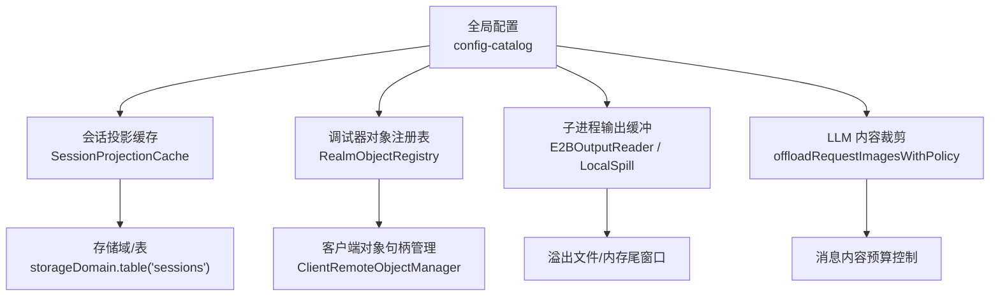
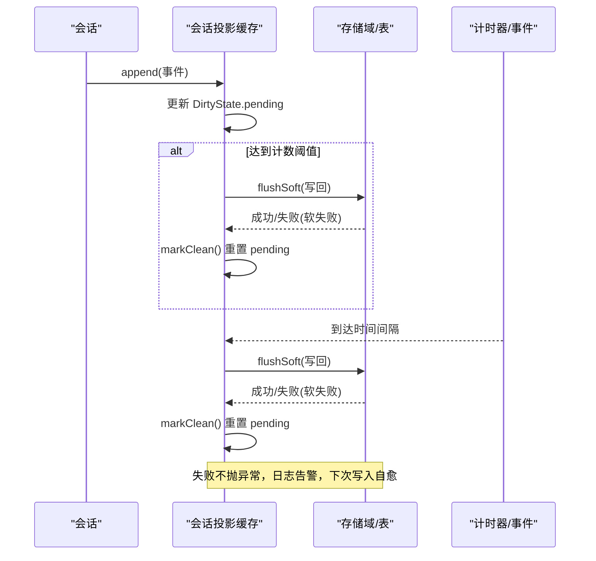
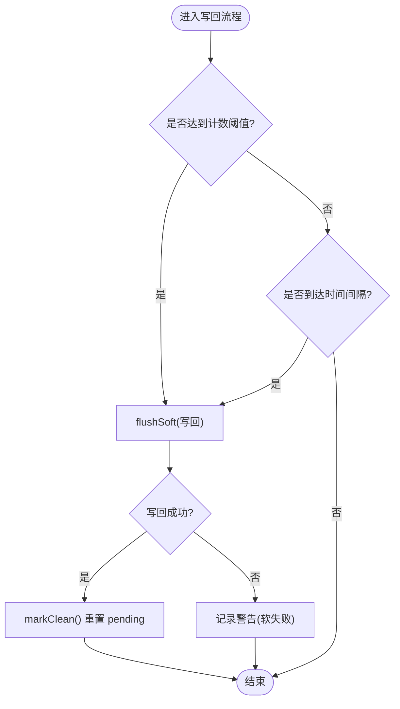
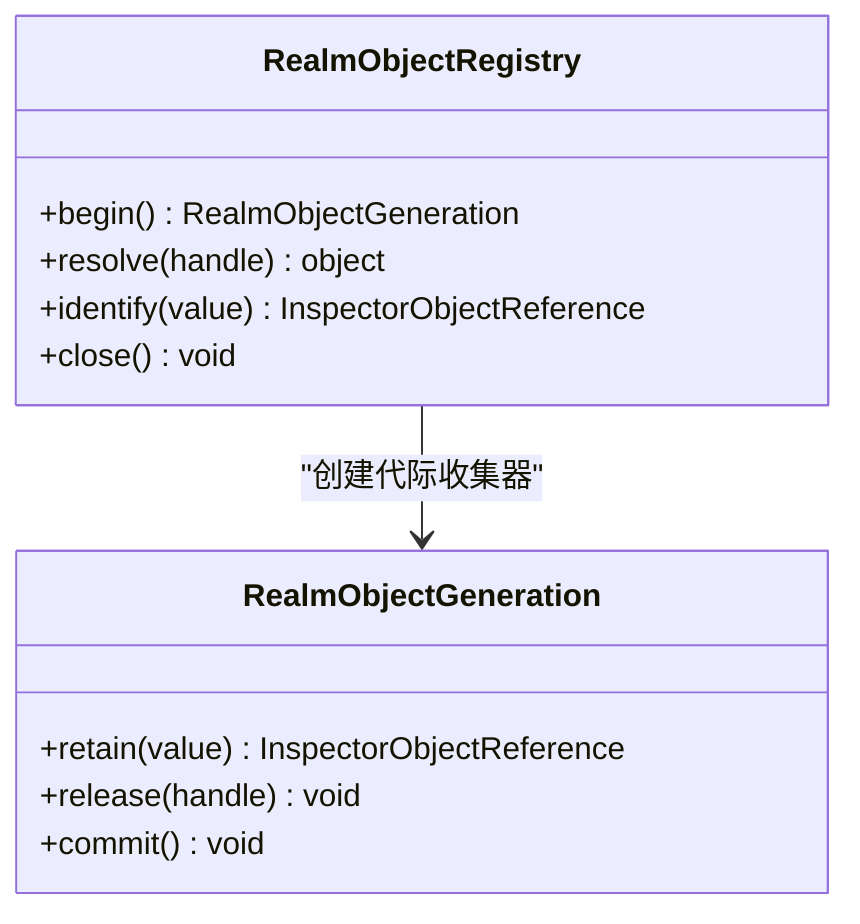
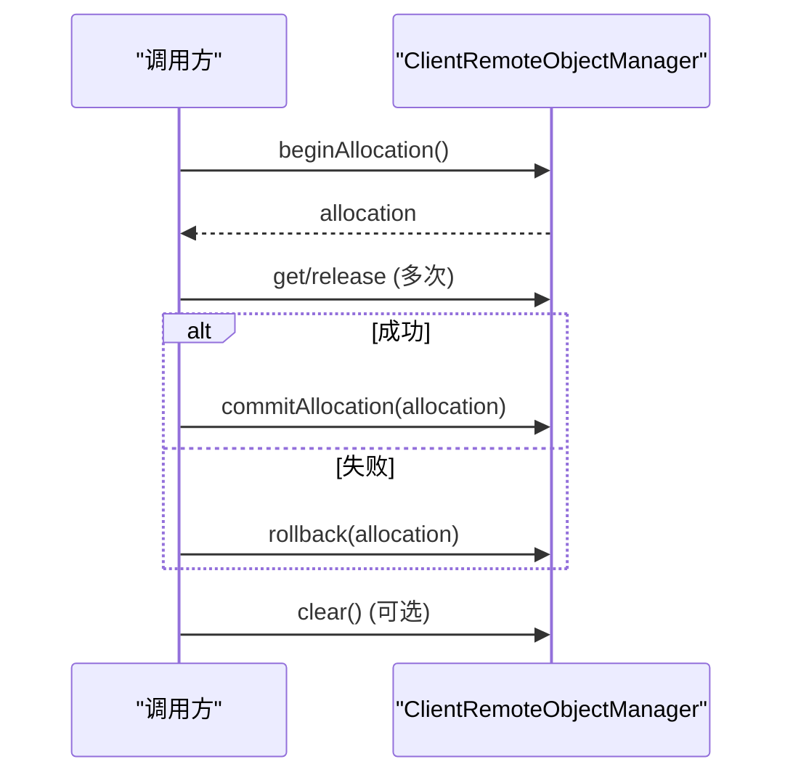
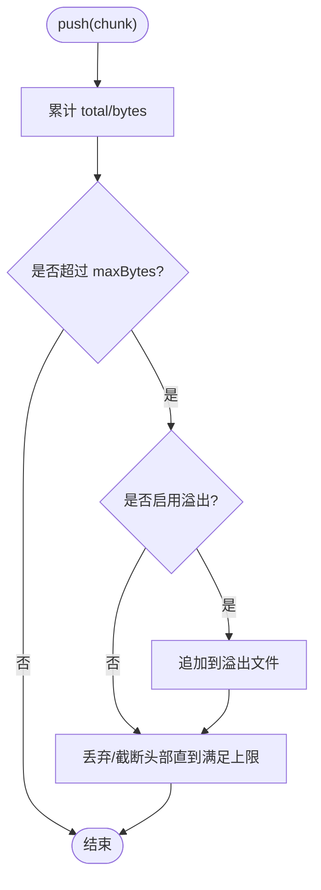
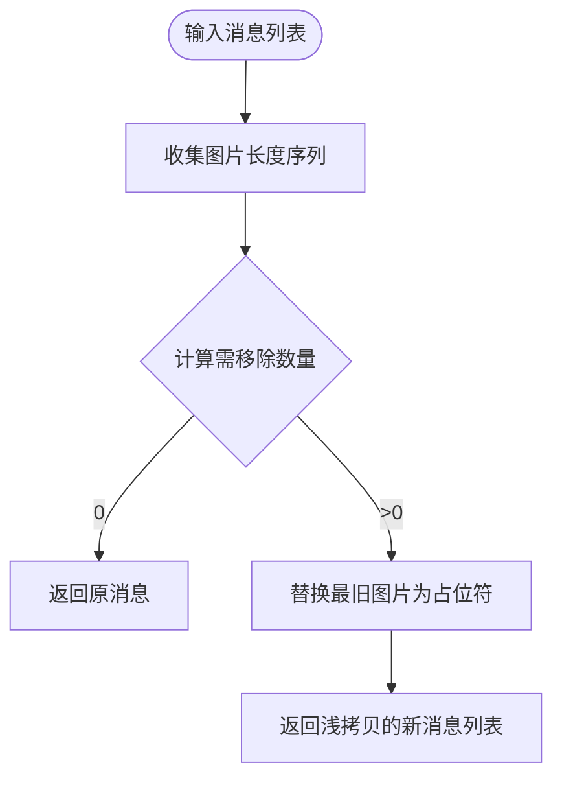
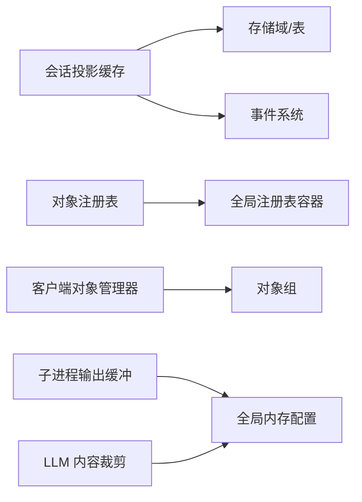

# 内存管理

<cite>
**本文引用的文件**
- [packages/session/session-projection-cache/src/index.ts](file://packages/session/session-projection-cache/src/index.ts)
- [packages/session/session-projection-cache/tests/cache.spec.ts](file://packages/session/session-projection-cache/tests/cache.spec.ts)
- [packages/experimental/inspector/src/shared/cordis/object-registry.ts](file://packages/experimental/inspector/src/shared/cordis/object-registry.ts)
- [packages/experimental/inspector/src/client/cdp/objects.ts](file://packages/experimental/inspector/src/client/cdp/objects.ts)
- [packages/subprocess/subprocess-local/src/spawn.ts](file://packages/subprocess/subprocess-local/src/spawn.ts)
- [packages/e2b/subprocess-e2b/src/output.ts](file://packages/e2b/subprocess-e2b/src/output.ts)
- [packages/llm/llm/src/content.ts](file://packages/llm/llm/src/content.ts)
- [docs/config-catalog.md](file://docs/config-catalog.md)
</cite>

## 目录
1. [简介](#简介)
2. [项目结构](#项目结构)
3. [核心组件](#核心组件)
4. [架构总览](#架构总览)
5. [详细组件分析](#详细组件分析)
6. [依赖关系分析](#依赖关系分析)
7. [性能考量](#性能考量)
8. [故障排查指南](#故障排查指南)
9. [结论](#结论)
10. [附录](#附录)

## 简介
本文件聚焦 DeepSeek Harness 的内存管理优化，围绕以下目标展开：
- 会话投影缓存机制的实现原理，包括 DirtyState 状态管理、写回策略与内存泄漏防护。
- 对象池化技术的使用场景与实现方式，涵盖智能体对象、工具实例与会话对象的复用策略。
- 垃圾回收优化措施，包括引用清理、弱引用使用与内存监控。
- 内存使用最佳实践，包括大对象处理、流式数据处理与内存限制配置。
- 内存泄漏检测工具与性能分析方法指导。

## 项目结构
与内存管理密切相关的代码主要分布在以下模块：
- 会话投影缓存：负责将会话事件持久化为投影并支持写回节流与强制落盘点。
- 调试器对象注册表：通过“代际”强引用集合与原子提交，避免长生命周期快照持有过多对象。
- 子进程输出缓冲：对超大流进行内存尾窗口与溢出转储（spill）控制。
- LLM 内容裁剪：按预算替换最旧图片以控制请求体积。
- 配置项：提供 Worker/观察等子系统的全局内存上限参数。

图表来源
- [packages/session/session-projection-cache/src/index.ts:77-95](file://packages/session/session-projection-cache/src/index.ts#L77-L95)
- [packages/experimental/inspector/src/shared/cordis/object-registry.ts:34-111](file://packages/experimental/inspector/src/shared/cordis/object-registry.ts#L34-L111)
- [packages/experimental/inspector/src/client/cdp/objects.ts:42-164](file://packages/experimental/inspector/src/client/cdp/objects.ts#L42-L164)
- [packages/subprocess/subprocess-local/src/spawn.ts:123-153](file://packages/subprocess/subprocess-local/src/spawn.ts#L123-L153)
- [packages/e2b/subprocess-e2b/src/output.ts:48-91](file://packages/e2b/subprocess-e2b/src/output.ts#L48-L91)
- [packages/llm/llm/src/content.ts:265-289](file://packages/llm/llm/src/content.ts#L265-L289)
- [docs/config-catalog.md:658-667](file://docs/config-catalog.md#L658-L667)

章节来源
- [packages/session/session-projection-cache/src/index.ts:77-95](file://packages/session/session-projection-cache/src/index.ts#L77-L95)
- [docs/config-catalog.md:658-667](file://docs/config-catalog.md#L658-L667)

## 核心组件
- 会话投影缓存服务：维护每个会话的 DirtyState（待持久化事件数与定时器），在计数阈值或时间间隔触发写回，并在创建、回合结束、会话释放等强制点落盘；失败软降级，下次写入自愈。
- 调试器对象注册表：以“生成”为单位收集强引用，commit 时原子替换当前可见集合，close 时释放所有强引用，避免跨代泄漏。
- 客户端对象管理器：为 DevTools RemoteObject 分配句柄、分组与批量释放，支持失败回滚与清空。
- 子进程输出缓冲：内存尾窗口 + 溢出转储，保证诊断尾部完整且内存可控。
- LLM 内容裁剪：按预算替换最旧图片，保持确定性且仅基于完整历史。

章节来源
- [packages/session/session-projection-cache/src/index.ts:55-113](file://packages/session/session-projection-cache/src/index.ts#L55-L113)
- [packages/experimental/inspector/src/shared/cordis/object-registry.ts:34-111](file://packages/experimental/inspector/src/shared/cordis/object-registry.ts#L34-L111)
- [packages/experimental/inspector/src/client/cdp/objects.ts:42-164](file://packages/experimental/inspector/src/client/cdp/objects.ts#L42-L164)
- [packages/subprocess/subprocess-local/src/spawn.ts:123-153](file://packages/subprocess/subprocess-local/src/spawn.ts#L123-L153)
- [packages/e2b/subprocess-e2b/src/output.ts:48-91](file://packages/e2b/subprocess-e2b/src/output.ts#L48-L91)
- [packages/llm/llm/src/content.ts:265-289](file://packages/llm/llm/src/content.ts#L265-L289)

## 架构总览
下图展示从事件到投影缓存写回的关键路径，以及各组件间的依赖关系。

图表来源
- [packages/session/session-projection-cache/src/index.ts:77-113](file://packages/session/session-projection-cache/src/index.ts#L77-L113)
- [packages/session/session-projection-cache/tests/cache.spec.ts:1-106](file://packages/session/session-projection-cache/tests/cache.spec.ts#L1-L106)

## 详细组件分析

### 会话投影缓存与 DirtyState 写回
- 状态模型：每个活跃会话维护 DirtyState，包含 pending（自上次持久化以来的事件数）与 timer（间隔触发器）。
- 写回触发：
  - 计数阈值：每 N 个事件触发一次写回。
  - 时间间隔：首次脏事件后启动定时器，到期触发写回。
  - 强制点：会话创建、turn/end、session/disposed（detach）必须落盘。
- 失败处理：写回失败记录警告但不中断事件流，下一次写回自动修复。
- 资源清理：插件卸载时清除所有定时器并清空 dirty 映射，防止悬挂引用。

图表来源
- [packages/session/session-projection-cache/src/index.ts:55-113](file://packages/session/session-projection-cache/src/index.ts#L55-L113)
- [packages/session/session-projection-cache/src/index.ts:250-271](file://packages/session/session-projection-cache/src/index.ts#L250-L271)

章节来源
- [packages/session/session-projection-cache/src/index.ts:55-113](file://packages/session/session-projection-cache/src/index.ts#L55-L113)
- [packages/session/session-projection-cache/src/index.ts:250-271](file://packages/session/session-projection-cache/src/index.ts#L250-L271)
- [packages/session/session-projection-cache/tests/cache.spec.ts:1-106](file://packages/session/session-projection-cache/tests/cache.spec.ts#L1-L106)

### 调试器对象注册表与代际强引用
- 设计要点：
  - 使用 RealmObjectGeneration 在单次快照前收集强引用，commit 时原子替换 retained 集合，避免中间态泄露。
  - close 时删除全局注册表并清空 retained，释放所有强引用。
  - identify 支持穿透 thenable 包装，定位真实对象。
- 内存安全：
  - 通过 begin/commit/release 明确生命周期，避免跨代保留。
  - 对代理/原型链遍历设置深度上限，防止恶意对象导致无限循环。

图表来源
- [packages/experimental/inspector/src/shared/cordis/object-registry.ts:34-111](file://packages/experimental/inspector/src/shared/cordis/object-registry.ts#L34-L111)
- [packages/experimental/inspector/src/shared/cordis/object-registry.ts:113-145](file://packages/experimental/inspector/src/shared/cordis/object-registry.ts#L113-L145)

章节来源
- [packages/experimental/inspector/src/shared/cordis/object-registry.ts:34-111](file://packages/experimental/inspector/src/shared/cordis/object-registry.ts#L34-L111)
- [packages/experimental/inspector/src/shared/cordis/object-registry.ts:113-145](file://packages/experimental/inspector/src/shared/cordis/object-registry.ts#L113-L145)

### 客户端对象句柄管理与组释放
- 功能：
  - 为每次操作分配独立句柄集合，支持 commitAllocation/rollback 确保失败时不残留句柄。
  - 支持按组 releaseGroup 批量释放，clear 清空全部。
- 内存影响：
  - 及时释放句柄与组，避免 DevTools 侧对象长期驻留。
  - 失败快速回滚，减少无用对象占用。

图表来源
- [packages/experimental/inspector/src/client/cdp/objects.ts:42-164](file://packages/experimental/inspector/src/client/cdp/objects.ts#L42-L164)

章节来源
- [packages/experimental/inspector/src/client/cdp/objects.ts:42-164](file://packages/experimental/inspector/src/client/cdp/objects.ts#L42-L164)

### 子进程输出缓冲与溢出转储
- 内存尾窗口：维护 chunks 与 bytes，超过 maxBytes 时从头部丢弃或截断，确保最后 maxBytes 始终可用。
- 溢出转储：一旦超界或已开启 spill，后续数据追加至溢出文件，内存中仅保留尾部窗口。
- 完整性校验：finish 可要求完整 EOF，否则抛出错误提示截断。

图表来源
- [packages/subprocess/subprocess-local/src/spawn.ts:123-153](file://packages/subprocess/subprocess-local/src/spawn.ts#L123-L153)
- [packages/e2b/subprocess-e2b/src/output.ts:48-91](file://packages/e2b/subprocess-e2b/src/output.ts#L48-L91)

章节来源
- [packages/subprocess/subprocess-local/src/spawn.ts:123-153](file://packages/subprocess/subprocess-local/src/spawn.ts#L123-L153)
- [packages/e2b/subprocess-e2b/src/output.ts:48-91](file://packages/e2b/subprocess-e2b/src/output.ts#L48-L91)

### LLM 内容裁剪与预算控制
- 策略：根据 RequestImageOffloadPolicy 计算需移除的最旧图片数量与字节量子，替换为占位符，保持确定性。
- 适用场景：当消息历史中的图片总量超过预算时，优先裁剪最旧部分，降低请求体积与内存压力。

图表来源
- [packages/llm/llm/src/content.ts:265-289](file://packages/llm/llm/src/content.ts#L265-L289)

章节来源
- [packages/llm/llm/src/content.ts:265-289](file://packages/llm/llm/src/content.ts#L265-L289)

### 对象池化与复用策略
- 智能体对象：通过 Context.agents 注册与生命周期管理，配合 agentPresets 的 mount/recompose，在不同会话间隔离但复用工具视图，减少重复构建成本。
- 工具实例：工具注册与变更通过 tools/change 事件通知，避免频繁重建；在会话销毁时清理绑定。
- 会话对象：会话投影缓存仅在活跃会话维护 DirtyState，会话释放时清理定时器与映射，避免跨会话泄漏。

章节来源
- [packages/preset/agent-presets/tests/mount.spec.ts:500-528](file://packages/preset/agent-presets/tests/mount.spec.ts#L500-L528)
- [apps/cli/tests/web-agent-presets.e2e.ts:303-324](file://apps/cli/tests/web-agent-presets.e2e.ts#L303-L324)
- [packages/schedule/schedule/tests/plugin.spec.ts:65-105](file://packages/schedule/schedule/tests/plugin.spec.ts#L65-L105)

## 依赖关系分析
- 会话投影缓存依赖存储域与事件系统，通过 on('session/disposed') 与 effect 清理资源。
- 调试器对象注册表依赖全局 Symbol 键维护多注册表，客户端对象管理器依赖句柄与分组机制。
- 子进程输出缓冲与 LLM 内容裁剪均受全局配置项约束，确保内存上限一致。

图表来源
- [packages/session/session-projection-cache/src/index.ts:77-95](file://packages/session/session-projection-cache/src/index.ts#L77-L95)
- [packages/experimental/inspector/src/shared/cordis/object-registry.ts:169-176](file://packages/experimental/inspector/src/shared/cordis/object-registry.ts#L169-L176)
- [packages/experimental/inspector/src/client/cdp/objects.ts:42-164](file://packages/experimental/inspector/src/client/cdp/objects.ts#L42-L164)
- [docs/config-catalog.md:658-667](file://docs/config-catalog.md#L658-L667)

章节来源
- [packages/session/session-projection-cache/src/index.ts:77-95](file://packages/session/session-projection-cache/src/index.ts#L77-L95)
- [packages/experimental/inspector/src/shared/cordis/object-registry.ts:169-176](file://packages/experimental/inspector/src/shared/cordis/object-registry.ts#L169-L176)
- [packages/experimental/inspector/src/client/cdp/objects.ts:42-164](file://packages/experimental/inspector/src/client/cdp/objects.ts#L42-L164)
- [docs/config-catalog.md:658-667](file://docs/config-catalog.md#L658-L667)

## 性能考量
- 写回节流：计数与时间双阈值降低磁盘压力，强制点保证一致性。
- 失败软降级：避免事件路径阻塞，提升吞吐。
- 内存尾窗口：子进程输出仅保留尾部，必要时转储到文件，控制峰值内存。
- 内容裁剪：按预算替换最旧图片，降低请求大小与内存占用。
- 对象代际：快照期间集中收集强引用，commit 原子替换，减少中间态驻留。

[本节为通用性能讨论，无需特定文件来源]

## 故障排查指南
- 写回失败：检查存储域可用性，关注日志警告；确认下次写回能自愈。
- 内存增长：检查子进程输出缓冲是否启用溢出转储，调整 maxBytes；核对 LLM 图片预算是否合理。
- 对象泄漏：确认调试器对象注册表是否正确 close；客户端对象管理器是否及时 release/releaseGroup/clear。
- 定时器未清理：验证会话释放时是否清除了 DirtyState.timer 与 dirty 映射。

章节来源
- [packages/session/session-projection-cache/src/index.ts:250-271](file://packages/session/session-projection-cache/src/index.ts#L250-L271)
- [packages/experimental/inspector/src/shared/cordis/object-registry.ts:80-86](file://packages/experimental/inspector/src/shared/cordis/object-registry.ts#L80-L86)
- [packages/experimental/inspector/src/client/cdp/objects.ts:123-164](file://packages/experimental/inspector/src/client/cdp/objects.ts#L123-L164)
- [packages/subprocess/subprocess-local/src/spawn.ts:123-153](file://packages/subprocess/subprocess-local/src/spawn.ts#L123-L153)

## 结论
DeepSeek Harness 通过会话投影缓存的写回节流与强制落盘、调试器对象注册表的代际强引用管理、子进程输出的内存尾窗口与溢出转储、以及 LLM 内容预算裁剪，构建了稳健的内存管理机制。结合全局配置项与严格的资源清理策略，可在高并发与大数据量场景下保持稳定与高效。

[本节为总结性内容，无需特定文件来源]

## 附录
- 内存限制配置参考：Worker 与观察子系统提供多项最大字节/记录数限制，建议根据运行环境调优。
- 最佳实践：
  - 大对象处理：优先使用溢出转储与内容裁剪，避免常驻内存。
  - 流式数据处理：合理设置 highWaterMark 与 maxBytes，及时消费与释放。
  - 内存限制配置：依据业务负载调整 maxBodyChunkBytes、maxJournalBytes、maxRetainedRequests 等。

章节来源
- [docs/config-catalog.md:658-667](file://docs/config-catalog.md#L658-L667)