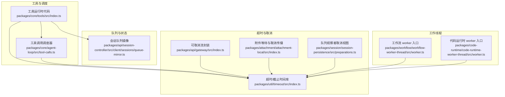
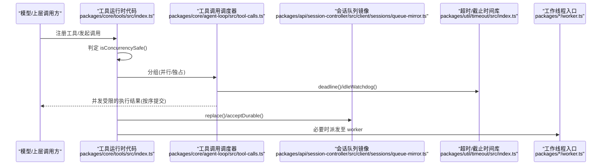
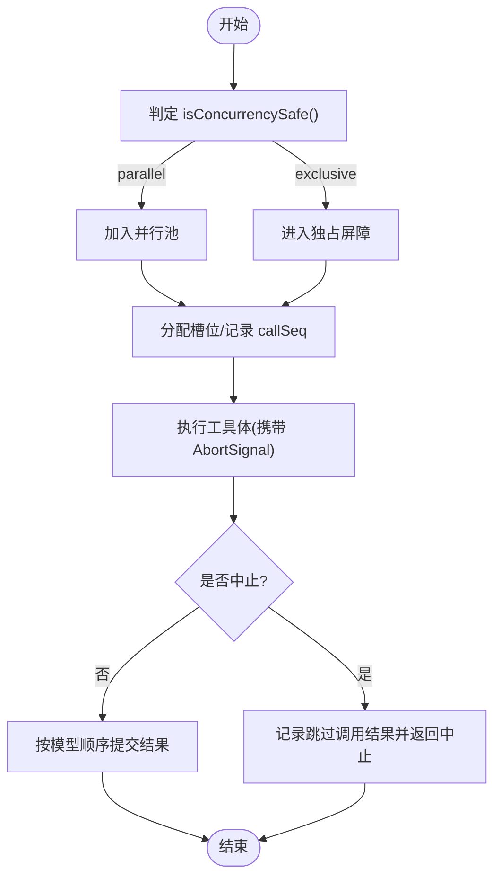
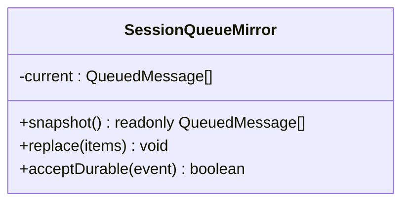
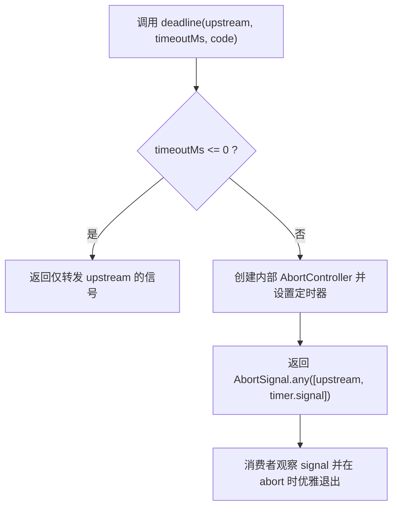
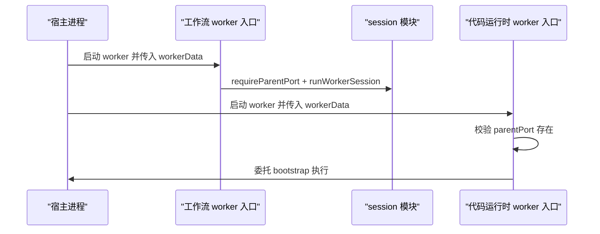
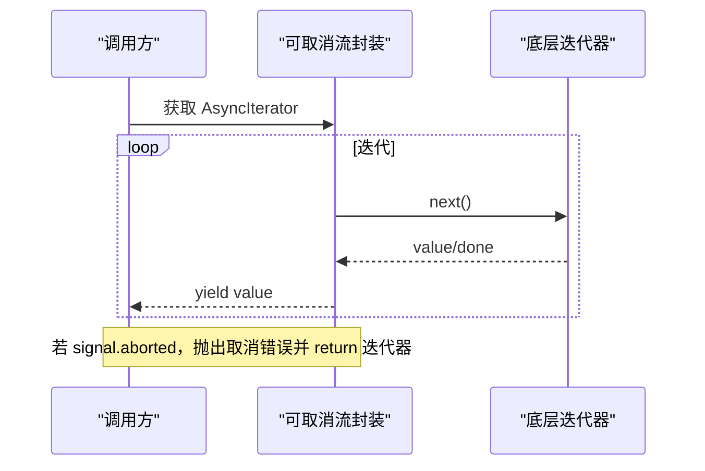
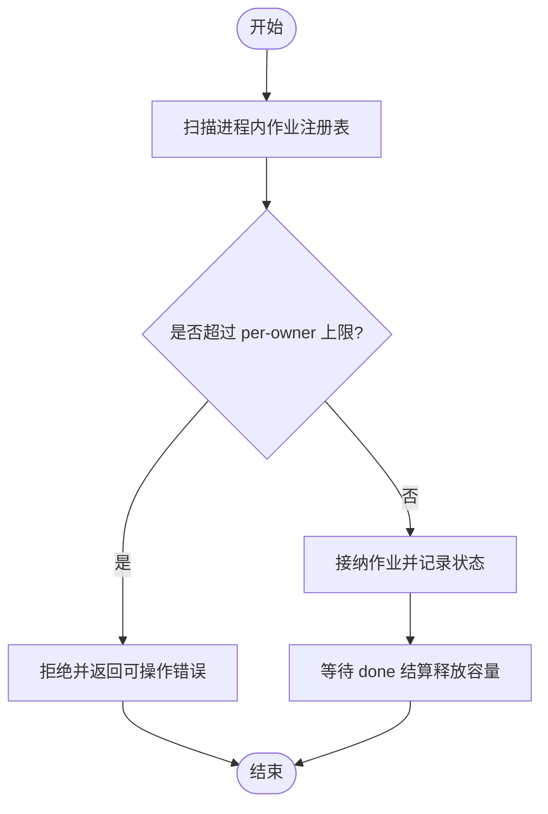
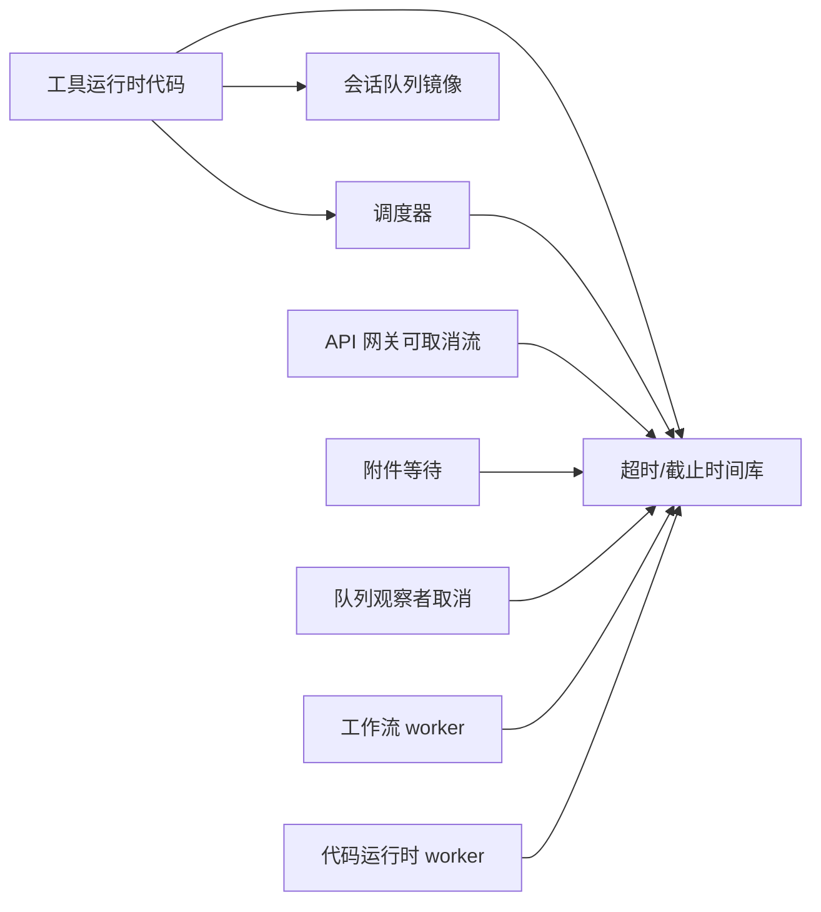

# 并发处理

<cite>
**本文引用的文件**
- [packages/core/tools/src/index.ts](file://packages/core/tools/src/index.ts)
- [packages/core/agent-loop/src/tool-calls.ts](file://packages/core/agent-loop/src/tool-calls.ts)
- [packages/util/timeout/src/index.ts](file://packages/util/timeout/src/index.ts)
- [packages/api/session-controller/src/client/sessions/queue-mirror.ts](file://packages/api/session-controller/src/client/sessions/queue-mirror.ts)
- [packages/workflow/workflow-worker-thread/src/worker.ts](file://packages/workflow/workflow-worker-thread/src/worker.ts)
- [packages/code-runtime/code-runtime-worker-thread/src/worker.ts](file://packages/code-runtime/code-runtime-worker-thread/src/worker.ts)
- [packages/api/gateway/src/index.ts](file://packages/api/gateway/src/index.ts)
- [packages/attachment/attachment-local/src/index.ts](file://packages/attachment/attachment-local/src/index.ts)
- [packages/session/session-persistence/src/preparations.ts](file://packages/session/session-persistence/src/preparations.ts)
- [packages/experimental/webworker-runtime/src/node/builtin_modules/implemented/abort-error.ts](file://packages/experimental/webworker-runtime/src/node/builtin_modules/implemented/abort-error.ts)
- [.agents/notes/implemented/bug-fix/2026-08-11-bounded-background-job-admission.md](file://.agents/notes/implemented/bug-fix/2026-08-11-bounded-background-job-admission.md)
</cite>

## 目录
1. [简介](#简介)
2. [项目结构](#项目结构)
3. [核心组件](#核心组件)
4. [架构总览](#架构总览)
5. [详细组件分析](#详细组件分析)
6. [依赖关系分析](#依赖关系分析)
7. [性能考量](#性能考量)
8. [故障排查指南](#故障排查指南)
9. [结论](#结论)
10. [附录](#附录)

## 简介
本文件聚焦 DeepSeek Harness 的并发处理优化，围绕异步任务调度、工作队列管理、任务优先级与资源分配策略展开；系统阐述线程安全设计模式（锁机制、无共享数据结构、并发数据结构）；给出避免资源竞争的策略（死锁预防、超时与优雅降级）；总结并发编程最佳实践（Promise 链优化、错误处理与取消机制）；并提供并发性能测试方法与瓶颈识别技巧。内容基于仓库中的工具执行管线、会话队列镜像、超时/截止时间库、工作线程入口、可取消流等实现进行提炼。

## 项目结构
DeepSeek Harness 将并发能力分散在多个子系统：
- 工具执行与调度：工具注册表、执行模式判定、并行/独占分组与屏障
- 会话队列镜像：对宿主侧队列的瞬时投影与持久化交接
- 超时与截止时间：统一的 AbortSignal 融合、空闲看门狗、超时原因分类
- 工作线程：代码运行时与工作流子进程的生命周期与隔离
- 可取消流：API 网关层对迭代器的统一取消包装
- 附件等待与观察取消：等待者计数、取消传播与释放
- 背景作业准入控制：按拥有者限制并发，避免无限增长

**图表来源**
- [packages/core/tools/src/index.ts:1254-1284](file://packages/core/tools/src/index.ts#L1254-L1284)
- [packages/core/agent-loop/src/tool-calls.ts:112-143](file://packages/core/agent-loop/src/tool-calls.ts#L112-L143)
- [packages/util/timeout/src/index.ts:91-113](file://packages/util/timeout/src/index.ts#L91-L113)
- [packages/api/session-controller/src/client/sessions/queue-mirror.ts:23-68](file://packages/api/session-controller/src/client/sessions/queue-mirror.ts#L23-L68)
- [packages/workflow/workflow-worker-thread/src/worker.ts:1-15](file://packages/workflow/workflow-worker-thread/src/worker.ts#L1-L15)
- [packages/code-runtime/code-runtime-worker-thread/src/worker.ts:1-15](file://packages/code-runtime/code-runtime-worker-thread/src/worker.ts#L1-L15)
- [packages/api/gateway/src/index.ts:968-995](file://packages/api/gateway/src/index.ts#L968-L995)
- [packages/attachment/attachment-local/src/index.ts:100-140](file://packages/attachment/attachment-local/src/index.ts#L100-L140)
- [packages/session/session-persistence/src/preparations.ts:354-401](file://packages/session/session-persistence/src/preparations.ts#L354-L401)

**章节来源**
- [packages/core/tools/src/index.ts:1254-1284](file://packages/core/tools/src/index.ts#L1254-L1284)
- [packages/core/agent-loop/src/tool-calls.ts:112-143](file://packages/core/agent-loop/src/tool-calls.ts#L112-L143)
- [packages/util/timeout/src/index.ts:91-113](file://packages/util/timeout/src/index.ts#L91-L113)
- [packages/api/session-controller/src/client/sessions/queue-mirror.ts:23-68](file://packages/api/session-controller/src/client/sessions/queue-mirror.ts#L23-L68)
- [packages/workflow/workflow-worker-thread/src/worker.ts:1-15](file://packages/workflow/workflow-worker-thread/src/worker.ts#L1-L15)
- [packages/code-runtime/code-runtime-worker-thread/src/worker.ts:1-15](file://packages/code-runtime/code-runtime-worker-thread/src/worker.ts#L1-L15)
- [packages/api/gateway/src/index.ts:968-995](file://packages/api/gateway/src/index.ts#L968-L995)
- [packages/attachment/attachment-local/src/index.ts:100-140](file://packages/attachment/attachment-local/src/index.ts#L100-L140)
- [packages/session/session-persistence/src/preparations.ts:354-401](file://packages/session/session-persistence/src/preparations.ts#L354-L401)

## 核心组件
- 工具执行模式与并发分类：通过工具定义声明是否“并发安全”，由运行时判定为 parallel 或 exclusive，从而进入并行池或独占屏障
- 工具调用调度器：按组组织调用，维护槽位、序列号、中止信号，保证结果按模型顺序提交
- 会话队列镜像：提供不可变快照、替换权威帧、接受持久化事件以移除临时行，用于 UI 展示与持久化衔接
- 超时与截止时间：统一生成带 TimeoutReason 的 AbortSignal，支持 idleWatchdog 仅在有 next 调用时计时
- 工作线程：最小化入口，将实际逻辑委托给 session/bootstrap，确保主线程与 worker 边界清晰
- 可取消流：对同步/异步迭代器统一包装，监听 abort 并提前终止
- 附件等待：多等待者计数，首个取消即触发上游中断，确保资源及时释放
- 背景作业准入：按拥有者限制并发，拒绝超配请求，避免后台任务无限增长

**章节来源**
- [packages/core/tools/src/index.ts:256-269](file://packages/core/tools/src/index.ts#L256-L269)
- [packages/core/tools/src/index.ts:1254-1284](file://packages/core/tools/src/index.ts#L1254-L1284)
- [packages/core/agent-loop/src/tool-calls.ts:112-143](file://packages/core/agent-loop/src/tool-calls.ts#L112-L143)
- [packages/api/session-controller/src/client/sessions/queue-mirror.ts:23-68](file://packages/api/session-controller/src/client/sessions/queue-mirror.ts#L23-L68)
- [packages/util/timeout/src/index.ts:91-113](file://packages/util/timeout/src/index.ts#L91-L113)
- [packages/util/timeout/src/index.ts:126-173](file://packages/util/timeout/src/index.ts#L126-L173)
- [packages/workflow/workflow-worker-thread/src/worker.ts:1-15](file://packages/workflow/workflow-worker-thread/src/worker.ts#L1-L15)
- [packages/code-runtime/code-runtime-worker-thread/src/worker.ts:1-15](file://packages/code-runtime/code-runtime-worker-thread/src/worker.ts#L1-L15)
- [packages/api/gateway/src/index.ts:968-995](file://packages/api/gateway/src/index.ts#L968-L995)
- [packages/attachment/attachment-local/src/index.ts:100-140](file://packages/attachment/attachment-local/src/index.ts#L100-L140)
- [.agents/notes/implemented/bug-fix/2026-08-11-bounded-background-job-admission.md:1-43](file://.agents/notes/implemented/bug-fix/2026-08-11-bounded-background-job-admission.md#L1-L43)

## 架构总览
下图展示了从工具注册到执行调度的关键路径，以及取消、超时、队列镜像的协作方式。

**图表来源**
- [packages/core/tools/src/index.ts:1254-1284](file://packages/core/tools/src/index.ts#L1254-L1284)
- [packages/core/agent-loop/src/tool-calls.ts:112-143](file://packages/core/agent-loop/src/tool-calls.ts#L112-L143)
- [packages/util/timeout/src/index.ts:91-113](file://packages/util/timeout/src/index.ts#L91-L113)
- [packages/api/session-controller/src/client/sessions/queue-mirror.ts:23-68](file://packages/api/session-controller/src/client/sessions/queue-mirror.ts#L23-L68)
- [packages/workflow/workflow-worker-thread/src/worker.ts:1-15](file://packages/workflow/workflow-worker-thread/src/worker.ts#L1-L15)
- [packages/code-runtime/code-runtime-worker-thread/src/worker.ts:1-15](file://packages/code-runtime/code-runtime-worker-thread/src/worker.ts#L1-L15)

## 详细组件分析

### 工具执行与并发调度
- 并发分类：工具可通过 isConcurrencySafe(args) 返回 true 加入并行组；否则走独占屏障，形成顺序约束
- 调度器职责：runGroup 维护槽位、callSeqs、已启动数、已提交数、中止标志；支持 abort 停止新启动、排空已启动并提交上下文；失败时不提交合成恢复结果
- 配置项：maxParallelSubCalls 限制 run_code 程序内子调用重叠度，默认值受校验保护

**图表来源**
- [packages/core/tools/src/index.ts:1254-1284](file://packages/core/tools/src/index.ts#L1254-L1284)
- [packages/core/agent-loop/src/tool-calls.ts:112-143](file://packages/core/agent-loop/src/tool-calls.ts#L112-L143)

**章节来源**
- [packages/core/tools/src/index.ts:256-269](file://packages/core/tools/src/index.ts#L256-L269)
- [packages/core/tools/src/index.ts:1254-1284](file://packages/core/tools/src/index.ts#L1254-L1284)
- [packages/core/agent-loop/src/tool-calls.ts:112-143](file://packages/core/agent-loop/src/tool-calls.ts#L112-L143)

### 会话队列镜像（工作队列管理与优先级）
- 不可变快照：snapshot() 返回当前队列行，供 UI 渲染
- 权威替换：replace() 用宿主提供的完整帧覆盖本地 current，包含 placement/rpcId/content 等字段
- 持久化交接：acceptDurable() 当用户消息进入日志后移除 steering 临时行，保持 UI 与持久化一致
- 预览与文本提取：previewOf/textOf 用于快速展示与检索

**图表来源**
- [packages/api/session-controller/src/client/sessions/queue-mirror.ts:23-68](file://packages/api/session-controller/src/client/sessions/queue-mirror.ts#L23-L68)

**章节来源**
- [packages/api/session-controller/src/client/sessions/queue-mirror.ts:23-68](file://packages/api/session-controller/src/client/sessions/queue-mirror.ts#L23-L68)

### 超时与截止时间（资源超时与优雅降级）
- deadline：融合上游取消与超时，产生带 TimeoutReason 的 AbortSignal；<=0 表示无超时（仅转发上游）
- clampTimeout：校验并裁剪超时值，防止非法/过大配置
- idleWatchdog：仅在 next 调用期间计时，避免消费端思考时间被误判为提供者空闲
- timeoutOf：从信号或错误中抽取 TimeoutReason，便于区分超时与其他取消

**图表来源**
- [packages/util/timeout/src/index.ts:91-113](file://packages/util/timeout/src/index.ts#L91-L113)
- [packages/util/timeout/src/index.ts:126-173](file://packages/util/timeout/src/index.ts#L126-L173)
- [packages/util/timeout/src/index.ts:45-55](file://packages/util/timeout/src/index.ts#L45-L55)

**章节来源**
- [packages/util/timeout/src/index.ts:45-55](file://packages/util/timeout/src/index.ts#L45-L55)
- [packages/util/timeout/src/index.ts:91-113](file://packages/util/timeout/src/index.ts#L91-L113)
- [packages/util/timeout/src/index.ts:126-173](file://packages/util/timeout/src/index.ts#L126-L173)

### 工作线程与隔离（资源分配策略）
- 工作流 worker：最小入口，仅负责初始化 parentPort 与 workerData，并将运行交给 session 模块
- 代码运行时 worker：同样最小入口，校验 parentPort 存在性，委托 bootstrap 执行
- 优势：主线程与 worker 边界清晰，避免共享可变状态；通过消息通道传递任务，天然具备隔离与容错

**图表来源**
- [packages/workflow/workflow-worker-thread/src/worker.ts:1-15](file://packages/workflow/workflow-worker-thread/src/worker.ts#L1-L15)
- [packages/code-runtime/code-runtime-worker-thread/src/worker.ts:1-15](file://packages/code-runtime/code-runtime-worker-thread/src/worker.ts#L1-L15)

**章节来源**
- [packages/workflow/workflow-worker-thread/src/worker.ts:1-15](file://packages/workflow/workflow-worker-thread/src/worker.ts#L1-L15)
- [packages/code-runtime/code-runtime-worker-thread/src/worker.ts:1-15](file://packages/code-runtime/code-runtime-worker-thread/src/worker.ts#L1-L15)

### 可取消流与取消传播（Promise 链优化与取消机制）
- 可取消流：cancellableStream 对同步/异步迭代器统一包装，监听 abort 并抛出远程取消错误，finally 中清理迭代器
- 附件等待：wait(signal) 支持可选取消信号，首个取消即触发上游中断，确保资源释放
- 队列观察者取消：observeQueuedAbort 为排队观察者提供“可取消视图”，在不取消共享工作的前提下允许观察者提前退出

**图表来源**
- [packages/api/gateway/src/index.ts:968-995](file://packages/api/gateway/src/index.ts#L968-L995)
- [packages/attachment/attachment-local/src/index.ts:100-140](file://packages/attachment/attachment-local/src/index.ts#L100-L140)
- [packages/session/session-persistence/src/preparations.ts:354-401](file://packages/session/session-persistence/src/preparations.ts#L354-L401)

**章节来源**
- [packages/api/gateway/src/index.ts:968-995](file://packages/api/gateway/src/index.ts#L968-L995)
- [packages/attachment/attachment-local/src/index.ts:100-140](file://packages/attachment/attachment-local/src/index.ts#L100-L140)
- [packages/session/session-persistence/src/preparations.ts:354-401](file://packages/session/session-persistence/src/preparations.ts#L354-L401)

### 背景作业准入控制（资源竞争避免策略）
- 问题：后台 Bash/PTY/一次性子代理可在不同 turn 持续启动，导致进程/子工作无界增长
- 决策：LocalJobRegistry 引入 per-owner 最大并发限制，默认值受配置保护；拒绝超配请求，避免抢占无关会话
- 注意事项：stopping 状态仍占用容量直至 done 结算；不引入全局抢占或自动终止最老任务

**图表来源**
- [.agents/notes/implemented/bug-fix/2026-08-11-bounded-background-job-admission.md:1-43](file://.agents/notes/implemented/bug-fix/2026-08-11-bounded-background-job-admission.md#L1-L43)

**章节来源**
- [.agents/notes/implemented/bug-fix/2026-08-11-bounded-background-job-admission.md:1-43](file://.agents/notes/implemented/bug-fix/2026-08-11-bounded-background-job-admission.md#L1-L43)

## 依赖关系分析
- 工具运行时代码依赖调度器与超时库，并通过队列镜像与 UI/持久化对接
- 调度器依赖超时库以支持中止与空闲看门狗
- 工作线程入口依赖各自 session/bootstrap 模块，保持边界清晰
- API 网关的可取消流依赖超时库的统一取消语义
- 附件等待与队列观察者均使用统一的 AbortSignal 语义

**图表来源**
- [packages/core/tools/src/index.ts:1254-1284](file://packages/core/tools/src/index.ts#L1254-L1284)
- [packages/core/agent-loop/src/tool-calls.ts:112-143](file://packages/core/agent-loop/src/tool-calls.ts#L112-L143)
- [packages/util/timeout/src/index.ts:91-113](file://packages/util/timeout/src/index.ts#L91-L113)
- [packages/api/gateway/src/index.ts:968-995](file://packages/api/gateway/src/index.ts#L968-L995)
- [packages/attachment/attachment-local/src/index.ts:100-140](file://packages/attachment/attachment-local/src/index.ts#L100-L140)
- [packages/session/session-persistence/src/preparations.ts:354-401](file://packages/session/session-persistence/src/preparations.ts#L354-L401)
- [packages/workflow/workflow-worker-thread/src/worker.ts:1-15](file://packages/workflow/workflow-worker-thread/src/worker.ts#L1-L15)
- [packages/code-runtime/code-runtime-worker-thread/src/worker.ts:1-15](file://packages/code-runtime/code-runtime-worker-thread/src/worker.ts#L1-L15)

**章节来源**
- [packages/core/tools/src/index.ts:1254-1284](file://packages/core/tools/src/index.ts#L1254-L1284)
- [packages/core/agent-loop/src/tool-calls.ts:112-143](file://packages/core/agent-loop/src/tool-calls.ts#L112-L143)
- [packages/util/timeout/src/index.ts:91-113](file://packages/util/timeout/src/index.ts#L91-L113)
- [packages/api/gateway/src/index.ts:968-995](file://packages/api/gateway/src/index.ts#L968-L995)
- [packages/attachment/attachment-local/src/index.ts:100-140](file://packages/attachment/attachment-local/src/index.ts#L100-L140)
- [packages/session/session-persistence/src/preparations.ts:354-401](file://packages/session/session-persistence/src/preparations.ts#L354-L401)
- [packages/workflow/workflow-worker-thread/src/worker.ts:1-15](file://packages/workflow/workflow-worker-thread/src/worker.ts#L1-L15)
- [packages/code-runtime/code-runtime-worker-thread/src/worker.ts:1-15](file://packages/code-runtime/code-runtime-worker-thread/src/worker.ts#L1-L15)

## 性能考量
- 并行度控制：通过 maxParallelSubCalls 与工具并发分类，避免过度并行导致的资源争用与背压
- 超时与空闲看门狗：仅在有活动需求时计时，减少无效等待；统一超时原因便于监控与告警
- 队列镜像不可变性：每次 replace 生成新数组引用，降低锁竞争与竞态风险
- 工作线程隔离：将重负载任务迁移至 worker，降低主线程阻塞概率
- 背景作业准入：per-owner 限制防止单会话耗尽资源，提升整体吞吐稳定性

[本节为通用指导，无需特定文件来源]

## 故障排查指南
- 取消与超时
  - 检查是否正确使用 deadline/idleWatchdog，并确保下游代码观察 AbortSignal
  - 使用 timeoutOf 判断是否为超时导致的中断，区分上游取消与超时
- 工具执行异常
  - 确认 isConcurrencySafe 返回值与预期一致；exclusive 调用会形成屏障
  - 关注 runGroup 的中止分支，确保已启动调用能正确提交上下文
- 队列不一致
  - 核对 replace 与 acceptDurable 的调用时机，确保 steering 行在持久化后移除
- 工作线程问题
  - 确认 parentPort 存在且 workerData 类型正确；避免在主线程直接加载 worker 入口
- 附件等待泄漏
  - 检查 waiters 计数与 release 路径，确保取消时能触发上游中断

**章节来源**
- [packages/util/timeout/src/index.ts:184-190](file://packages/util/timeout/src/index.ts#L184-L190)
- [packages/core/agent-loop/src/tool-calls.ts:112-143](file://packages/core/agent-loop/src/tool-calls.ts#L112-L143)
- [packages/api/session-controller/src/client/sessions/queue-mirror.ts:23-68](file://packages/api/session-controller/src/client/sessions/queue-mirror.ts#L23-L68)
- [packages/code-runtime/code-runtime-worker-thread/src/worker.ts:1-15](file://packages/code-runtime/code-runtime-worker-thread/src/worker.ts#L1-L15)
- [packages/attachment/attachment-local/src/index.ts:100-140](file://packages/attachment/attachment-local/src/index.ts#L100-L140)

## 结论
DeepSeek Harness 通过工具并发分类、调度器屏障、超时/截止时间库、工作线程隔离、可取消流与队列镜像等机制，构建了高内聚、低耦合的并发处理体系。其设计强调：
- 明确的并发边界与资源配额（per-owner 限制、maxParallelSubCalls）
- 统一的取消语义与超时分类（AbortSignal 融合、TimeoutReason）
- 不可变数据与最小共享状态（队列镜像快照、worker 隔离）
- 可观测性与可诊断性（超时原因、队列投影、作业状态）

这些实践共同保障了在高并发场景下的稳定性、可维护性与可扩展性。

[本节为总结，无需特定文件来源]

## 附录
- 并发编程最佳实践
  - Promise 链优化：尽量使用 AbortSignal 串联取消，避免悬挂 Promise；在 finally 中清理资源
  - 错误处理：区分超时、取消与业务错误；使用 timeoutOf 精准识别超时
  - 取消机制：所有长耗时操作均应支持取消；对外暴露取消点（如迭代器 next）
- 并发性能测试方法
  - 压力测试：模拟高并发工具调用，观察并行度、延迟分布与资源占用
  - 瓶颈识别：结合超时统计、队列长度、作业注册表大小定位热点
  - 回归验证：变更并发参数后，复测关键路径的吞吐与尾延迟

[本节为通用指导，无需特定文件来源]