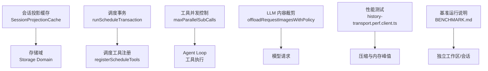
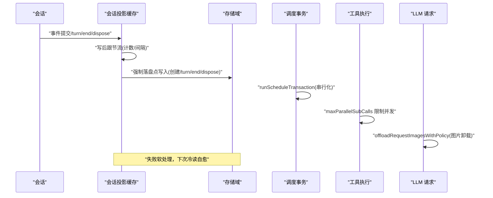
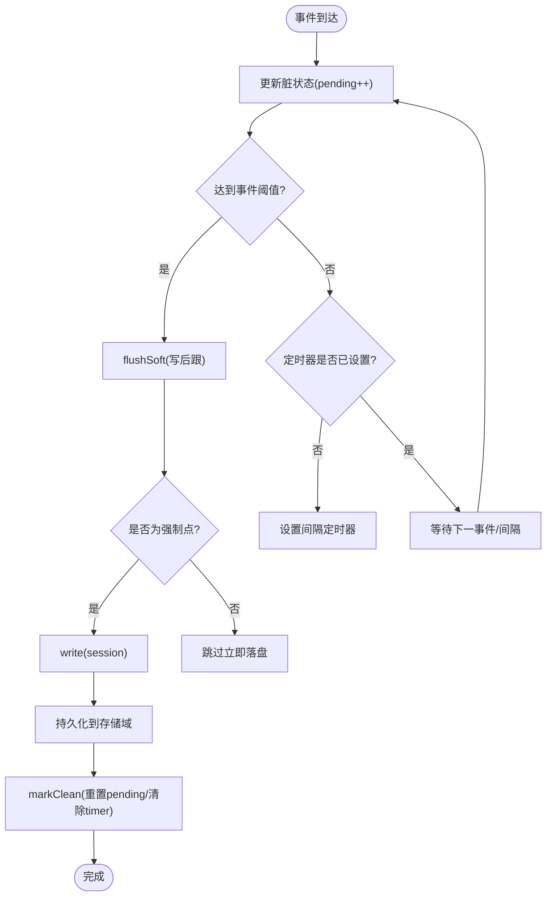
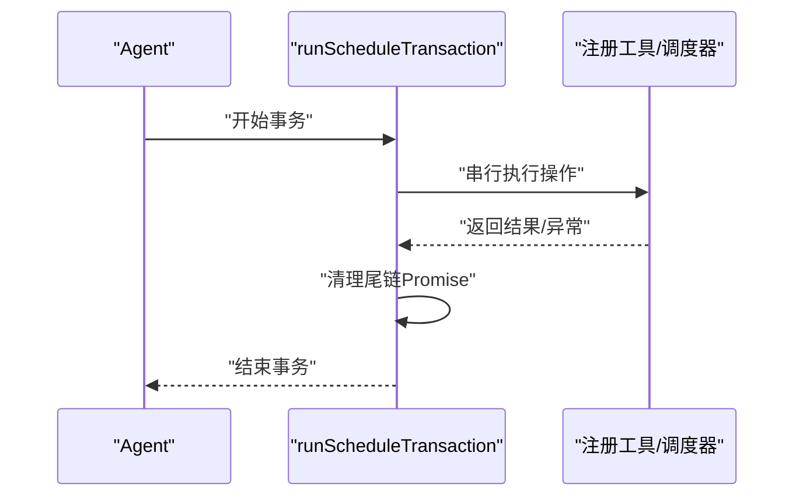
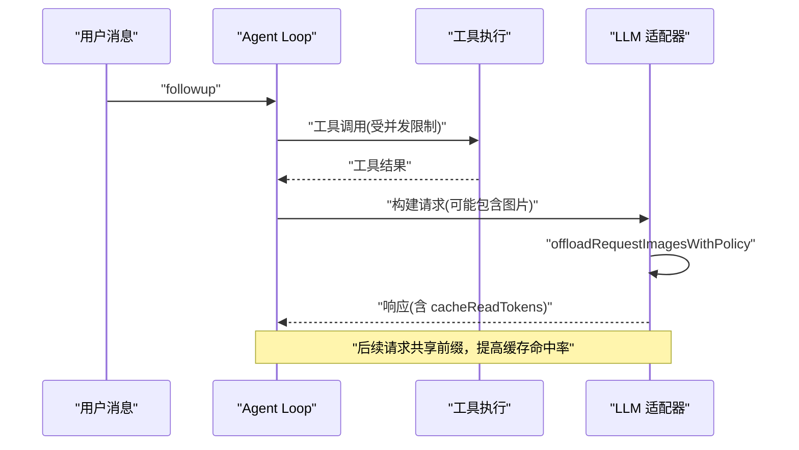
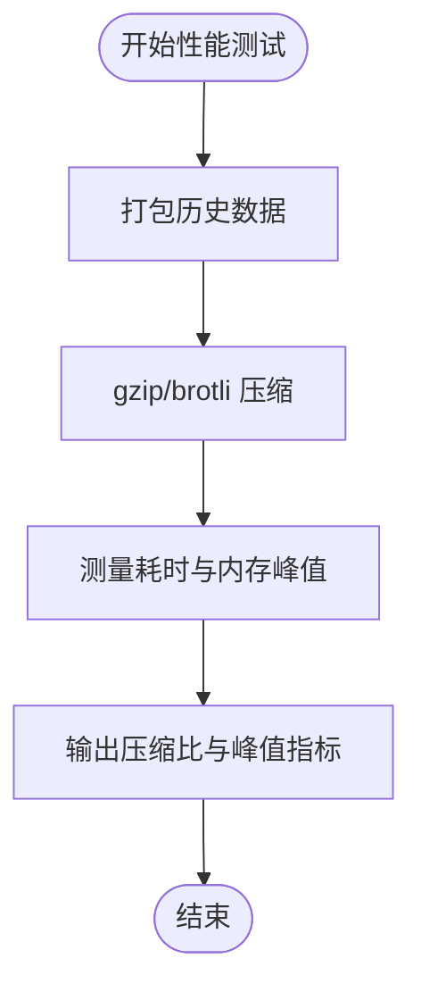
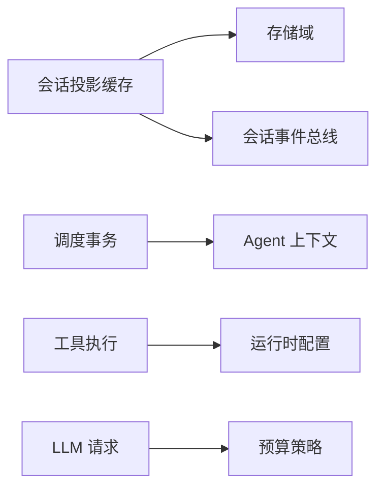

# 性能优化

<cite>
**本文引用的文件**
- [packages/session/session-projection-cache/src/index.ts](file://packages/session/session-projection-cache/src/index.ts)
- [packages/session/session-projection-cache/tests/cache.spec.ts](file://packages/session/session-projection-cache/tests/cache.spec.ts)
- [packages/core/agent-loop/tests/tool-calls.spec.ts](file://packages/core/agent-loop/tests/tool-calls.spec.ts)
- [packages/core/tools/tests/ptc.spec.ts](file://packages/core/tools/tests/ptc.spec.ts)
- [packages/schedule/schedule/src/transaction.ts](file://packages/schedule/schedule/src/transaction.ts)
- [packages/schedule/schedule/src/tools.ts](file://packages/schedule/schedule/src/tools.ts)
- [packages/client/ui-conversation/tests/history-transport.perf.client.ts](file://packages/client/ui-conversation/tests/history-transport.perf.client.ts)
- [packages/core/agent-loop/tests/request-cache.e2e.ts](file://packages/core/agent-loop/tests/request-cache.e2e.ts)
- [packages/llm/llm/src/content.ts](file://packages/llm/llm/src/content.ts)
- [BENCHMARK.md](file://BENCHMARK.md)
</cite>

## 目录
1. [简介](#简介)
2. [项目结构](#项目结构)
3. [核心组件](#核心组件)
4. [架构总览](#架构总览)
5. [详细组件分析](#详细组件分析)
6. [依赖关系分析](#依赖关系分析)
7. [性能考量](#性能考量)
8. [故障排查指南](#故障排查指南)
9. [结论](#结论)
10. [附录](#附录)

## 简介
本文件聚焦 DeepSeek Harness 的性能优化，围绕内存管理、并发处理与缓存机制三大主题展开：
- 内存管理：会话投影缓存（写后跟+强制落盘点）、对象池化与共享读取、垃圾回收友好设计。
- 并发处理：异步任务调度、线程安全与资源竞争避免、工具调用并发上限控制。
- 缓存机制：会话状态缓存、工具调用缓存、LLM 响应缓存（基于前缀的提示缓存命中）。
- 性能监控与分析：指标收集、瓶颈识别与优化建议，并附带基准测试方法。

## 项目结构
DeepSeek Harness 采用模块化插件式架构，关键性能相关模块分布如下：
- 会话投影缓存：位于 packages/session/session-projection-cache，提供持久化的会话投影检查点服务，支持写后跟与强制落盘点。
- 调度与事务：位于 packages/schedule/schedule，提供 Agent 级串行事务与工具注册。
- 工具执行与并发：位于 packages/core/tools 与 packages/core/agent-loop，实现工具调用的并发限制与隔离。
- LLM 内容裁剪：位于 packages/llm/llm，按策略对请求中的图片进行卸载以降低内存与传输压力。
- 性能测试与基准：位于 apps/web/tests 与根目录 BENCHMARK.md，提供历史传输压缩与端到端基准流程。

图表来源
- [packages/session/session-projection-cache/src/index.ts:68-113](file://packages/session/session-projection-cache/src/index.ts#L68-L113)
- [packages/schedule/schedule/src/transaction.ts:1-23](file://packages/schedule/schedule/src/transaction.ts#L1-L23)
- [packages/schedule/schedule/src/tools.ts:291-314](file://packages/schedule/schedule/src/tools.ts#L291-L314)
- [packages/core/tools/tests/ptc.spec.ts:486-603](file://packages/core/tools/tests/ptc.spec.ts#L486-L603)
- [packages/llm/llm/src/content.ts:265-289](file://packages/llm/llm/src/content.ts#L265-L289)
- [packages/client/ui-conversation/tests/history-transport.perf.client.ts:568-596](file://packages/client/ui-conversation/tests/history-transport.perf.client.ts#L568-L596)
- [BENCHMARK.md:1-4](file://BENCHMARK.md#L1-L4)

章节来源
- [packages/session/session-projection-cache/src/index.ts:68-113](file://packages/session/session-projection-cache/src/index.ts#L68-L113)
- [packages/schedule/schedule/src/transaction.ts:1-23](file://packages/schedule/schedule/src/transaction.ts#L1-L23)
- [packages/schedule/schedule/src/tools.ts:291-314](file://packages/schedule/schedule/src/tools.ts#L291-L314)
- [packages/core/tools/tests/ptc.spec.ts:486-603](file://packages/core/tools/tests/ptc.spec.ts#L486-L603)
- [packages/llm/llm/src/content.ts:265-289](file://packages/llm/llm/src/content.ts#L265-L289)
- [packages/client/ui-conversation/tests/history-transport.perf.client.ts:568-596](file://packages/client/ui-conversation/tests/history-transport.perf.client.ts#L568-L596)
- [BENCHMARK.md:1-4](file://BENCHMARK.md#L1-L4)

## 核心组件
- 会话投影缓存（SessionProjectionCache）
  - 职责：维护每个会话的投影检查点，提供冷读加速与热路径写后跟；在创建、turn/end、dispose 三个强制点落盘。
  - 关键点：fail-soft 写入、版本/身份校验、同步快照读取、写后跟节流（事件计数与时间间隔）。
- 调度事务（runScheduleTransaction）
  - 职责：为每个 Agent 提供串行事务执行，避免并发读写冲突。
- 工具并发控制
  - 职责：通过 maxParallelSubCalls 限制子调用并发度，保障资源占用可控。
- LLM 内容裁剪
  - 职责：根据预算策略替换最旧图片，降低请求体积与内存峰值。
- 性能测试与基准
  - 职责：测量历史传输压缩比、内存峰值与耗时；提供基准运行指引。

章节来源
- [packages/session/session-projection-cache/src/index.ts:68-113](file://packages/session/session-projection-cache/src/index.ts#L68-L113)
- [packages/schedule/schedule/src/transaction.ts:1-23](file://packages/schedule/schedule/src/transaction.ts#L1-L23)
- [packages/core/tools/tests/ptc.spec.ts:486-603](file://packages/core/tools/tests/ptc.spec.ts#L486-L603)
- [packages/llm/llm/src/content.ts:265-289](file://packages/llm/llm/src/content.ts#L265-L289)
- [packages/client/ui-conversation/tests/history-transport.perf.client.ts:568-596](file://packages/client/ui-conversation/tests/history-transport.perf.client.ts#L568-L596)
- [BENCHMARK.md:1-4](file://BENCHMARK.md#L1-L4)

## 架构总览
下图展示了会话投影缓存与存储域的交互、调度事务的串行化、工具并发控制以及 LLM 内容裁剪的整体协作关系。

图表来源
- [packages/session/session-projection-cache/src/index.ts:218-271](file://packages/session/session-projection-cache/src/index.ts#L218-L271)
- [packages/schedule/schedule/src/transaction.ts:1-23](file://packages/schedule/schedule/src/transaction.ts#L1-L23)
- [packages/core/tools/tests/ptc.spec.ts:580-603](file://packages/core/tools/tests/ptc.spec.ts#L580-L603)
- [packages/llm/llm/src/content.ts:265-289](file://packages/llm/llm/src/content.ts#L265-L289)

## 详细组件分析

### 会话投影缓存（SessionProjectionCache）
- 设计要点
  - 写后跟：事件计数达到阈值或超过时间间隔触发落盘；在 turn/end、session created、session disposed 三个强制点无条件落盘。
  - 一致性：读取来自内存表，写入先持久化再更新内存，保证“读不会绕过写链”；记录带身份与版本，防止跨生命周期污染。
  - 容错：写入失败不阻断主路径，仅记录警告并在下次冷读时自愈。
- 数据流
  - 事件到达 → 更新脏状态 → 触发节流或强制点 → 检查点快照 → 持久化 → 更新内存表。
- 复杂度
  - 写入：每次落盘需序列化检查点并持久化，O(N) 取决于投影大小；节流将高频写入聚合，降低 I/O 次数。
  - 读取：冷读从完整日志恢复，可复用缓存行跳过已折叠前缀；热读直接查内存表 O(1)。
- 优化机会
  - 调整 writeEveryEvents 与 writeIntervalMs 平衡延迟与 I/O。
  - 确保投影单元满足 JSON 可序列化约束，避免额外转换开销。

图表来源
- [packages/session/session-projection-cache/src/index.ts:218-271](file://packages/session/session-projection-cache/src/index.ts#L218-L271)
- [packages/session/session-projection-cache/src/index.ts:172-193](file://packages/session/session-projection-cache/src/index.ts#L172-L193)

章节来源
- [packages/session/session-projection-cache/src/index.ts:68-113](file://packages/session/session-projection-cache/src/index.ts#L68-L113)
- [packages/session/session-projection-cache/src/index.ts:172-193](file://packages/session/session-projection-cache/src/index.ts#L172-L193)
- [packages/session/session-projection-cache/src/index.ts:218-271](file://packages/session/session-projection-cache/src/index.ts#L218-L271)
- [packages/session/session-projection-cache/tests/cache.spec.ts:1-106](file://packages/session/session-projection-cache/tests/cache.spec.ts#L1-L106)

### 调度事务与工具并发控制
- 调度事务
  - 以 Agent 为键维护 Promise 尾链，确保同一 Agent 的调度读/写串行执行，避免竞态。
- 工具并发
  - 通过 maxParallelSubCalls 限制并行子调用数量，测试验证峰值并发被严格限制。
- 资源竞争避免
  - 使用弱引用映射跟踪事务尾部，完成后清理；工具执行中监听 abort 信号，及时释放资源。

图表来源
- [packages/schedule/schedule/src/transaction.ts:1-23](file://packages/schedule/schedule/src/transaction.ts#L1-L23)
- [packages/schedule/schedule/src/tools.ts:291-314](file://packages/schedule/schedule/src/tools.ts#L291-L314)
- [packages/core/tools/tests/ptc.spec.ts:580-603](file://packages/core/tools/tests/ptc.spec.ts#L580-L603)

章节来源
- [packages/schedule/schedule/src/transaction.ts:1-23](file://packages/schedule/schedule/src/transaction.ts#L1-L23)
- [packages/schedule/schedule/src/tools.ts:291-314](file://packages/schedule/schedule/src/tools.ts#L291-L314)
- [packages/core/tools/tests/ptc.spec.ts:580-603](file://packages/core/tools/tests/ptc.spec.ts#L580-L603)
- [packages/core/agent-loop/tests/tool-calls.spec.ts:117-142](file://packages/core/agent-loop/tests/tool-calls.spec.ts#L117-L142)

### LLM 响应缓存与请求内容裁剪
- 提示缓存命中
  - 后续请求与前序请求具有相同字节前缀时，提供者报告缓存命中（cacheReadTokens），减少重复计算。
- 图片卸载
  - 根据预算策略替换最旧图片，降低请求体积与内存峰值，保持确定性移除顺序。

图表来源
- [packages/core/agent-loop/tests/request-cache.e2e.ts:71-104](file://packages/core/agent-loop/tests/request-cache.e2e.ts#L71-L104)
- [packages/llm/llm/src/content.ts:265-289](file://packages/llm/llm/src/content.ts#L265-L289)

章节来源
- [packages/core/agent-loop/tests/request-cache.e2e.ts:71-104](file://packages/core/agent-loop/tests/request-cache.e2e.ts#L71-L104)
- [packages/llm/llm/src/content.ts:265-289](file://packages/llm/llm/src/content.ts#L265-L289)

### 性能测试与基准
- 历史传输压缩与内存峰值
  - 对比原始与打包后的 gzip/brotli 压缩比与耗时，测量宿主与客户端堆峰值，评估打包策略效果。
- 基准运行
  - 使用独立工作区与会话 ID 运行 jsonrpc-agent 最小变体，确保基准任务隔离。

图表来源
- [packages/client/ui-conversation/tests/history-transport.perf.client.ts:568-596](file://packages/client/ui-conversation/tests/history-transport.perf.client.ts#L568-L596)
- [BENCHMARK.md:1-4](file://BENCHMARK.md#L1-L4)

章节来源
- [packages/client/ui-conversation/tests/history-transport.perf.client.ts:568-596](file://packages/client/ui-conversation/tests/history-transport.perf.client.ts#L568-L596)
- [BENCHMARK.md:1-4](file://BENCHMARK.md#L1-L4)

## 依赖关系分析
- 会话投影缓存依赖存储域与会话事件总线，通过事件驱动写后跟；与 sessionProjections 服务协作生成/应用检查点。
- 调度事务依赖 Agent 上下文，通过 WeakMap 维护事务尾链，避免全局锁。
- 工具并发控制依赖运行时配置与执行信号，确保资源占用可控。
- LLM 内容裁剪依赖消息历史与预算策略，影响网络与内存使用。

图表来源
- [packages/session/session-projection-cache/src/index.ts:68-113](file://packages/session/session-projection-cache/src/index.ts#L68-L113)
- [packages/schedule/schedule/src/transaction.ts:1-23](file://packages/schedule/schedule/src/transaction.ts#L1-L23)
- [packages/core/tools/tests/ptc.spec.ts:486-603](file://packages/core/tools/tests/ptc.spec.ts#L486-L603)
- [packages/llm/llm/src/content.ts:265-289](file://packages/llm/llm/src/content.ts#L265-L289)

章节来源
- [packages/session/session-projection-cache/src/index.ts:68-113](file://packages/session/session-projection-cache/src/index.ts#L68-L113)
- [packages/schedule/schedule/src/transaction.ts:1-23](file://packages/schedule/schedule/src/transaction.ts#L1-L23)
- [packages/core/tools/tests/ptc.spec.ts:486-603](file://packages/core/tools/tests/ptc.spec.ts#L486-L603)
- [packages/llm/llm/src/content.ts:265-289](file://packages/llm/llm/src/content.ts#L265-L289)

## 性能考量
- 内存管理
  - 写后跟与强制落盘点结合，减少频繁 I/O；冷读复用缓存行，缩短恢复时间。
  - 图片卸载策略降低请求体积与内存峰值，提升吞吐。
- 并发处理
  - 调度事务串行化避免竞态；工具并发上限控制防止资源争用。
  - 使用 AbortSignal 与弱引用管理生命周期，避免泄漏。
- 缓存机制
  - 会话状态缓存：基于身份与版本的检查点，保证一致性。
  - 工具调用缓存：通过并发限制与隔离减少重复工作。
  - LLM 响应缓存：利用前缀缓存命中，显著降低重复计算成本。
- 监控与分析
  - 使用性能测试测量压缩比、耗时与内存峰值；基准运行确保环境隔离。
  - 关注 cacheReadTokens 等指标，评估缓存命中率与收益。

[本节为通用指导，无需具体文件引用]

## 故障排查指南
- 写入失败
  - 现象：缓存行陈旧，冷读时重新恢复。
  - 处理：检查存储域健康与权限；确认投影单元 JSON 可序列化；观察日志警告。
- 并发超限
  - 现象：工具调用排队或超时。
  - 处理：调整 maxParallelSubCalls；检查工具实现是否及时释放资源；监听 abort 信号。
- 缓存未命中
  - 现象：cacheReadTokens 为 0。
  - 处理：检查请求前缀是否一致；确认模型提供者是否启用前缀缓存；优化消息构造以减少差异。

章节来源
- [packages/session/session-projection-cache/src/index.ts:278-284](file://packages/session/session-projection-cache/src/index.ts#L278-L284)
- [packages/core/tools/tests/ptc.spec.ts:580-603](file://packages/core/tools/tests/ptc.spec.ts#L580-L603)
- [packages/core/agent-loop/tests/request-cache.e2e.ts:89-94](file://packages/core/agent-loop/tests/request-cache.e2e.ts#L89-L94)

## 结论
通过会话投影缓存的写后跟与强制落盘点、调度事务的串行化、工具并发上限控制以及 LLM 请求的图片卸载，DeepSeek Harness 在内存使用、I/O 频率与网络负载方面实现了显著优化。配合性能测试与基准运行，可量化评估优化效果并持续改进。

[本节为总结性内容，无需具体文件引用]

## 附录
- 配置建议
  - writeEveryEvents：根据事件速率与延迟要求调整，平衡 I/O 与实时性。
  - writeIntervalMs：设置合理的间隔以避免长时间未落盘。
  - maxParallelSubCalls：依据系统资源与工具特性设定并发上限。
- 最佳实践
  - 确保投影单元满足 JSON 可序列化约束。
  - 在工具实现中及时释放资源并监听 abort 信号。
  - 利用 LLM 前缀缓存，构造稳定的消息前缀以提升命中率。

[本节为补充信息，无需具体文件引用]