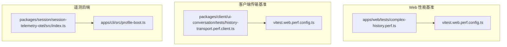
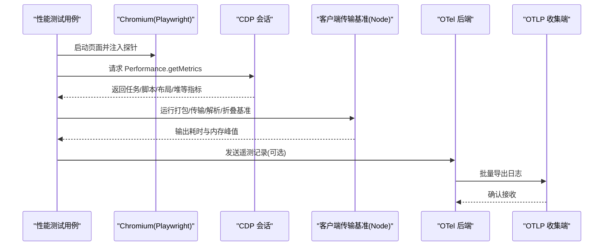
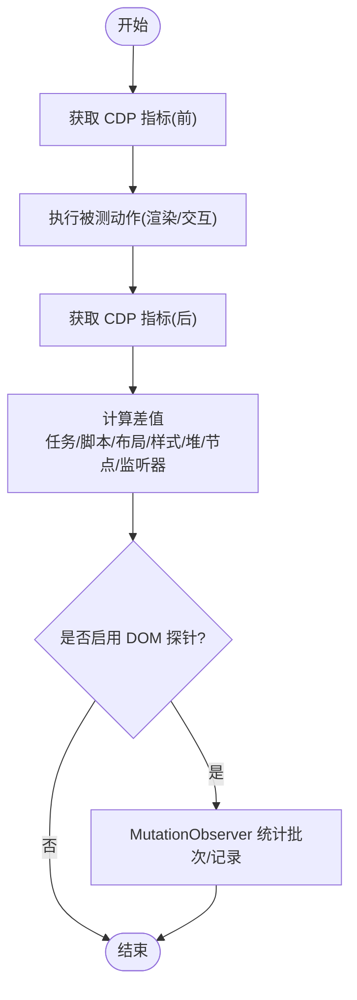
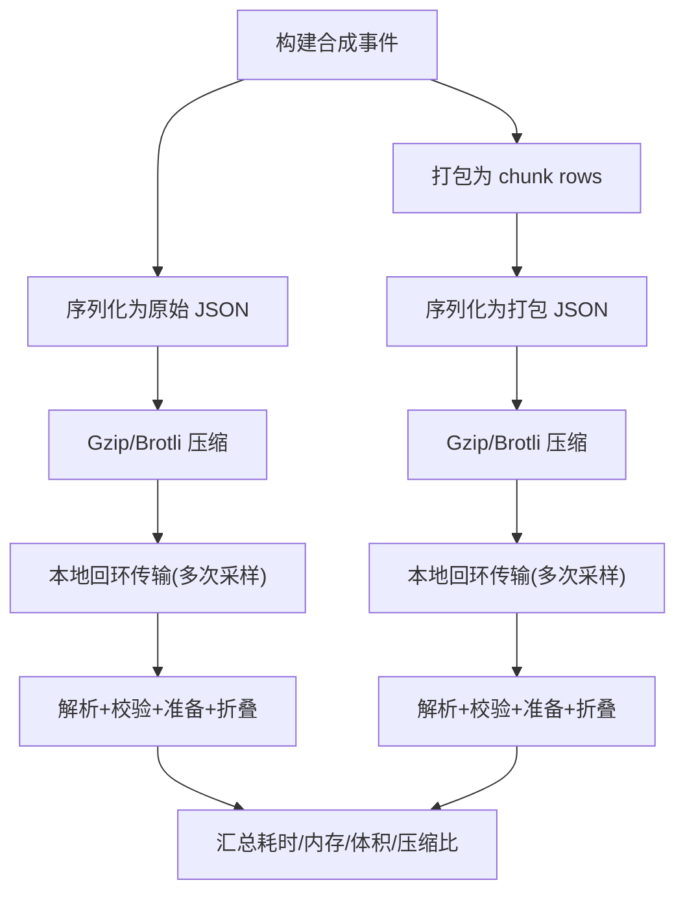
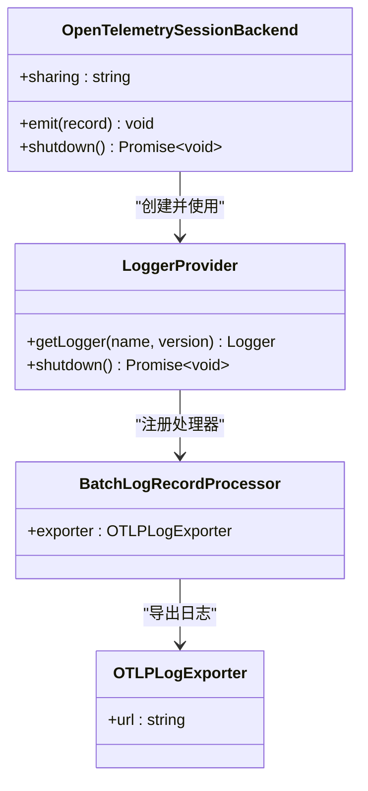
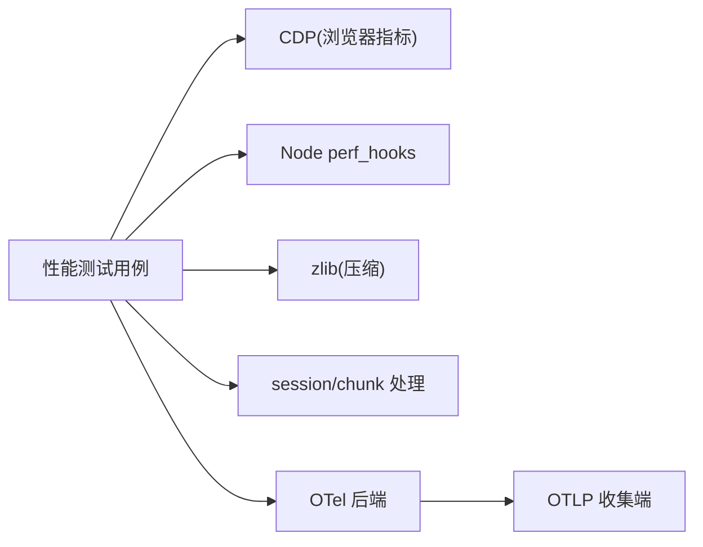

# 性能监控

<cite>
**本文引用的文件**
- [complex-history.perf.ts](file://apps/web/tests/complex-history.perf.ts)
- [history-transport.perf.client.ts](file://packages/client/ui-conversation/tests/history-transport.perf.client.ts)
- [vitest.web.perf.config.ts](file://vitest.web.perf.config.ts)
- [vitest.web-stress.config.ts](file://vitest.web-stress.config.ts)
- [session-telemetry-otel/index.ts](file://packages/session/session-telemetry-otel/src/index.ts)
- [profile-boot.ts](file://apps/cli/src/profile-boot.ts)
- [perf_hooks.ts](file://packages/experimental/webworker-runtime/src/node/builtin_modules/implemented/perf_hooks.ts)
</cite>

## 目录
1. [简介](#简介)
2. [项目结构](#项目结构)
3. [核心组件](#核心组件)
4. [架构总览](#架构总览)
5. [详细组件分析](#详细组件分析)
6. [依赖关系分析](#依赖关系分析)
7. [性能考量](#性能考量)
8. [故障排查指南](#故障排查指南)
9. [结论](#结论)
10. [附录](#附录)

## 简介
本文件面向 DeepSeek Harness 的性能监控与分析，聚焦以下目标：
- 指标采集机制：覆盖 CPU、内存、I/O 吞吐与网络延迟的观测方法。
- 瓶颈识别工具：火焰图、热点代码定位、慢查询分析思路与实践。
- 基准测试框架：单元测试基准、集成测试基准、端到端性能测试的组织与执行。
- 优化建议：代码级、架构级与配置调优策略。
- 实时监控仪表板与告警：基于 OpenTelemetry 的日志导出与可观测性接入方式。

## 项目结构
仓库内与性能监控相关的实现主要分布在三类位置：
- Web 端浏览器性能基准：通过 Playwright + CDP 抓取 Chromium 指标，评估渲染、内存与交互时延。
- 客户端历史传输与回放基准：在 Node 环境模拟打包/解压、压缩/解压缩、序列化/反序列化与本地回环传输，测量主机与客户端侧的额外堆峰值与耗时。
- 遥测后端（OpenTelemetry）：将会话事件与操作日志以 OTLP/HTTP 批量导出，支持模式切换与优雅关闭。

图表来源
- [complex-history.perf.ts:1-120](file://apps/web/tests/complex-history.perf.ts#L1-L120)
- [history-transport.perf.client.ts:1-120](file://packages/client/ui-conversation/tests/history-transport.perf.client.ts#L1-L120)
- [vitest.web.perf.config.ts:1-22](file://vitest.web.perf.config.ts#L1-L22)
- [session-telemetry-otel/index.ts:1-150](file://packages/session/session-telemetry-otel/src/index.ts#L1-L150)
- [profile-boot.ts:70-110](file://apps/cli/src/profile-boot.ts#L70-L110)

章节来源
- [complex-history.perf.ts:1-120](file://apps/web/tests/complex-history.perf.ts#L1-L120)
- [history-transport.perf.client.ts:1-120](file://packages/client/ui-conversation/tests/history-transport.perf.client.ts#L1-L120)
- [vitest.web.perf.config.ts:1-22](file://vitest.web.perf.config.ts#L1-L22)
- [session-telemetry-otel/index.ts:1-150](file://packages/session/session-telemetry-otel/src/index.ts#L1-L150)
- [profile-boot.ts:70-110](file://apps/cli/src/profile-boot.ts#L70-L110)

## 核心组件
- 浏览器性能采集器：通过 CDP 获取任务时长、脚本时长、布局时长、重算样式时长、节点数、监听器数量、JS 堆使用量等指标，结合页面 MutationObserver 统计 DOM 变更批次与记录数，衡量渲染与交互时延。
- 历史传输与回放基准：构造大规模合成事件，对比原始 JSON 与“打包”后的 chunk row 格式，在主机与客户端分别测量序列化、压缩、传输、解析、校验、准备、折叠（assemble）各阶段耗时与额外堆峰值。
- OpenTelemetry 遥测后端：封装 LoggerProvider 与 BatchLogRecordProcessor，按模式（FULL/FEEDBACK_ONLY/DISABLED）控制上报范围，提供优雅关闭与超时保护。
- 启动与开关：CLI 启动流程支持通过环境变量禁用遥测行，便于在 CI 或调试场景下快速关闭遥测开销。

章节来源
- [complex-history.perf.ts:519-580](file://apps/web/tests/complex-history.perf.ts#L519-L580)
- [history-transport.perf.client.ts:240-263](file://packages/client/ui-conversation/tests/history-transport.perf.client.ts#L240-L263)
- [history-transport.perf.client.ts:453-642](file://packages/client/ui-conversation/tests/history-transport.perf.client.ts#L453-L642)
- [session-telemetry-otel/index.ts:147-253](file://packages/session/session-telemetry-otel/src/index.ts#L147-L253)
- [profile-boot.ts:76-103](file://apps/cli/src/profile-boot.ts#L76-L103)

## 架构总览
下图展示了从基准测试到指标采集与上报的整体链路：Web 基准通过 CDP 拉取浏览器指标；客户端基准在 Node 中完成数据打包/传输/解析/折叠；遥测后端将事件批量导出至 OTLP 收集端；CLI 启动流程负责装配与开关。

图表来源
- [complex-history.perf.ts:519-580](file://apps/web/tests/complex-history.perf.ts#L519-L580)
- [history-transport.perf.client.ts:203-238](file://packages/client/ui-conversation/tests/history-transport.perf.client.ts#L203-L238)
- [session-telemetry-otel/index.ts:197-239](file://packages/session/session-telemetry-otel/src/index.ts#L197-L239)

## 详细组件分析

### 浏览器性能采集（复杂历史渲染）
- 指标来源：通过 CDP 的 Performance.getMetrics 获取 TaskDuration、ScriptDuration、LayoutDuration、RecalcStyleDuration、Nodes、JSEventListeners、JSHeapUsedSize 等。
- 渲染探针：使用 MutationObserver 观察特定容器，统计变更批次与记录数；通过 requestAnimationFrame 与文本节点遍历判断首屏可见与绘制时机。
- 用户交互时延：捕获可信点击、DOM 插入与绘制时间戳，计算 send-to-DOM、send-to-paint、dom-to-paint 等关键路径时延。
- 稳定性判定：对行数等指标进行稳定读取，避免异步更新导致的抖动。

图表来源
- [complex-history.perf.ts:519-580](file://apps/web/tests/complex-history.perf.ts#L519-L580)
- [complex-history.perf.ts:582-617](file://apps/web/tests/complex-history.perf.ts#L582-L617)
- [complex-history.perf.ts:619-779](file://apps/web/tests/complex-history.perf.ts#L619-L779)

章节来源
- [complex-history.perf.ts:519-580](file://apps/web/tests/complex-history.perf.ts#L519-L580)
- [complex-history.perf.ts:582-617](file://apps/web/tests/complex-history.perf.ts#L582-L617)
- [complex-history.perf.ts:619-779](file://apps/web/tests/complex-history.perf.ts#L619-L779)

### 历史传输与回放基准（打包 vs 原始）
- 数据构造：生成大量逻辑事件与增量块，构建原始 JSON 与打包后的 chunk row 记录。
- 主机侧测量：序列化耗时、gzip/brotli 压缩体积与耗时、本地回环传输耗时（headers/body/total）。
- 客户端侧测量：JSON 解析、Zod 校验、historyEntries 准备、ConversationNodeAssembler 折叠耗时与额外堆峰值（强制 GC 基线采样）。
- 结果输出：结构化报告包含字节大小、压缩比、各阶段耗时、传输样本、客户端总耗时与合成 API 等待/就绪时间。

图表来源
- [history-transport.perf.client.ts:291-321](file://packages/client/ui-conversation/tests/history-transport.perf.client.ts#L291-L321)
- [history-transport.perf.client.ts:453-642](file://packages/client/ui-conversation/tests/history-transport.perf.client.ts#L453-L642)
- [history-transport.perf.client.ts:203-238](file://packages/client/ui-conversation/tests/history-transport.perf.client.ts#L203-L238)

章节来源
- [history-transport.perf.client.ts:240-263](file://packages/client/ui-conversation/tests/history-transport.perf.client.ts#L240-L263)
- [history-transport.perf.client.ts:453-642](file://packages/client/ui-conversation/tests/history-transport.perf.client.ts#L453-L642)

### OpenTelemetry 遥测后端
- 模式控制：FULL（全量上报）、FEEDBACK_ONLY（仅反馈上报）、DISABLED（本地丢弃）。
- 导出管线：LoggerProvider + BatchLogRecordProcessor + OTLPLogExporter，资源属性携带服务名、版本与匿名用户 ID。
- 安全与健壮性：校验 exporter.url、processor.maxExportBatchSize、shutdownTimeoutMillis；shutdown 使用 Promise.race 防止阻塞。
- 启动集成：CLI 启动流程可通过环境变量禁用遥测行，避免不必要的开销。

图表来源
- [session-telemetry-otel/index.ts:147-253](file://packages/session/session-telemetry-otel/src/index.ts#L147-L253)
- [session-telemetry-otel/index.ts:283-298](file://packages/session/session-telemetry-otel/src/index.ts#L283-L298)
- [profile-boot.ts:76-103](file://apps/cli/src/profile-boot.ts#L76-L103)

章节来源
- [session-telemetry-otel/index.ts:147-253](file://packages/session/session-telemetry-otel/src/index.ts#L147-L253)
- [session-telemetry-otel/index.ts:283-298](file://packages/session/session-telemetry-otel/src/index.ts#L283-L298)
- [profile-boot.ts:76-103](file://apps/cli/src/profile-boot.ts#L76-L103)

### 性能测试配置与执行
- 性能专用配置：启用 --expose-gc 以支持强制 GC 基线采样；扩大 hook/test 超时；排除默认清单，仅包含 *.perf.ts 与 *.perf.client.ts。
- 压力测试配置：独立清单，仅包含 apps/web/stress-tests/**/*.stress.ts，关闭文件并行以避免干扰。
- 高基数诊断：手动触发的高基数诊断不在默认清单中，避免 CI 常规执行。

章节来源
- [vitest.web.perf.config.ts:1-22](file://vitest.web.perf.config.ts#L1-L22)
- [vitest.web-stress.config.ts:1-16](file://vitest.web-stress.config.ts#L1-L16)

## 依赖关系分析
- 浏览器基准依赖 Playwright 与 CDP，用于获取运行时指标与页面状态。
- 客户端基准依赖 Node perf_hooks 与 zlib，以及内部 session/chunk 处理模块，完成打包与回放。
- 遥测后端依赖 OpenTelemetry SDK，并通过 CLI 启动流程进行装配与开关控制。
- Worker 环境中的 perf_hooks 兼容层仅提供 performance 时钟，确保跨环境一致性。

图表来源
- [complex-history.perf.ts:1-120](file://apps/web/tests/complex-history.perf.ts#L1-L120)
- [history-transport.perf.client.ts:1-120](file://packages/client/ui-conversation/tests/history-transport.perf.client.ts#L1-L120)
- [session-telemetry-otel/index.ts:197-239](file://packages/session/session-telemetry-otel/src/index.ts#L197-L239)
- [perf_hooks.ts:1-28](file://packages/experimental/webworker-runtime/src/node/builtin_modules/implemented/perf_hooks.ts#L1-L28)

章节来源
- [complex-history.perf.ts:1-120](file://apps/web/tests/complex-history.perf.ts#L1-L120)
- [history-transport.perf.client.ts:1-120](file://packages/client/ui-conversation/tests/history-transport.perf.client.ts#L1-L120)
- [session-telemetry-otel/index.ts:197-239](file://packages/session/session-telemetry-otel/src/index.ts#L197-L239)
- [perf_hooks.ts:1-28](file://packages/experimental/webworker-runtime/src/node/builtin_modules/implemented/perf_hooks.ts#L1-L28)

## 性能考量
- CPU 使用率：通过 CDP 的 TaskDuration、ScriptDuration、LayoutDuration、RecalcStyleDuration 估算浏览器侧 CPU 占用；Node 侧可使用 perf_hooks 的 process.cpuUsage 或系统工具配合基准。
- 内存占用：使用强制 GC 基线采样额外堆峰值，关注 host 与 client 两侧差异；浏览器侧关注 JSHeapUsedSize、Nodes、JSEventListeners。
- I/O 吞吐：通过本地回环服务器测量 headers/body/total 传输耗时，结合 gzip/brotli 压缩体积评估带宽与 CPU 权衡。
- 网络延迟：在真实网络环境下替换本地回环，记录 DNS/TLS/TTB/TTFB/响应体下载耗时；在基准中可用 fetch 拦截或代理注入。
- 渲染性能：关注首次可见时间、滚动流畅度、长列表虚拟化的命中率与重排次数；通过 MutationObserver 与 rAF 标记关键帧。
- 回放性能：对比原始与打包格式的 assemble 耗时与内存峰值，验证增量块合并与空白前缀处理的复杂度。

[本节为通用指导，不直接分析具体文件]

## 故障排查指南
- 遥测关闭失败：检查环境变量是否生效，确认遥测行是否存在并被正确禁用；查看启动日志中的警告信息。
- 遥测导出挂起：确认 exporter.url 合法且可达；调整 processor.maxExportBatchSize 与 shutdownTimeoutMillis；必要时降低并发或增大超时。
- 浏览器指标不可用：确保使用支持 CDP 的 Chromium 内核；检查权限与沙箱限制；在 CI 中确认 headless 模式可用。
- 强制 GC 未生效：确认 Vitest 执行参数包含 --expose-gc；在 worker 环境中确认宿主支持 gc。
- 传输基准不稳定：增加采样次数与预热；固定网络条件或使用本地回环；避免与其他高负载任务并发。

章节来源
- [profile-boot.ts:76-103](file://apps/cli/src/profile-boot.ts#L76-L103)
- [session-telemetry-otel/index.ts:170-195](file://packages/session/session-telemetry-otel/src/index.ts#L170-L195)
- [session-telemetry-otel/index.ts:283-298](file://packages/session/session-telemetry-otel/src/index.ts#L283-L298)
- [vitest.web.perf.config.ts:1-22](file://vitest.web.perf.config.ts#L1-L22)

## 结论
DeepSeek Harness 提供了完善的性能监控与分析能力：
- 浏览器侧通过 CDP 与 DOM 探针精确度量渲染与交互时延。
- 客户端侧通过打包/传输/回放基准量化序列化、压缩、解析与折叠成本。
- 遥测后端基于 OpenTelemetry 提供可扩展的上报通道与优雅关闭。
- 通过独立的性能与压力测试配置，可在 CI 中按需执行高基数诊断。
建议在生产环境中结合指标阈值与告警规则，持续跟踪关键路径性能，并结合代码级与架构级优化策略，保障用户体验与系统稳定性。

[本节为总结，不直接分析具体文件]

## 附录
- 实时仪表板与告警建议：
  - 将 OTLP 日志导入可视化平台（如 Grafana/Loki），建立仪表盘展示错误率、延迟分布、资源使用趋势。
  - 设置告警规则：导出失败率、shutdown 超时、浏览器堆增长异常、渲染卡顿（layout/recalc 占比过高）。
  - 在 CI 中保留性能回归门禁：比较关键指标的基线，超阈即失败。
- 常用命令与配置要点：
  - 性能测试：使用 vitest.web.perf.config.ts 执行 *.perf.ts 与 *.perf.client.ts。
  - 压力测试：使用 vitest.web-stress.config.ts 执行 stress 用例。
  - 遥测开关：通过环境变量禁用遥测行，或在配置中设置 mode=DISABLED。

[本节为补充说明，不直接分析具体文件]