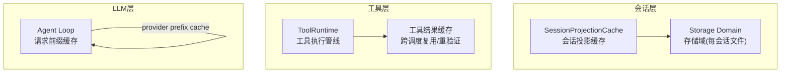
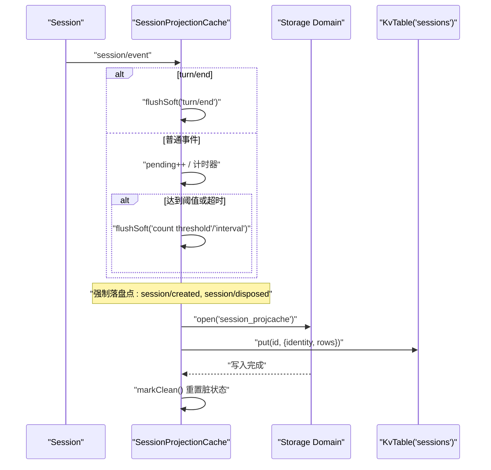
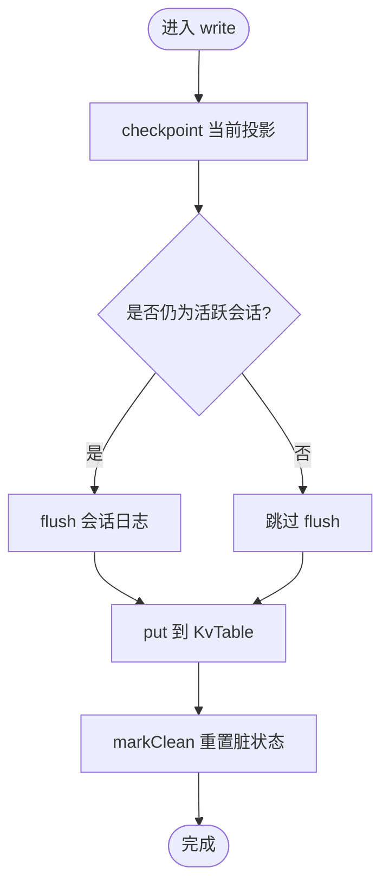
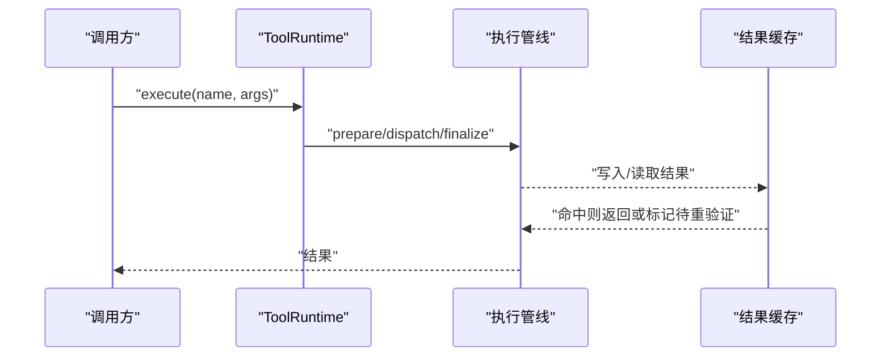
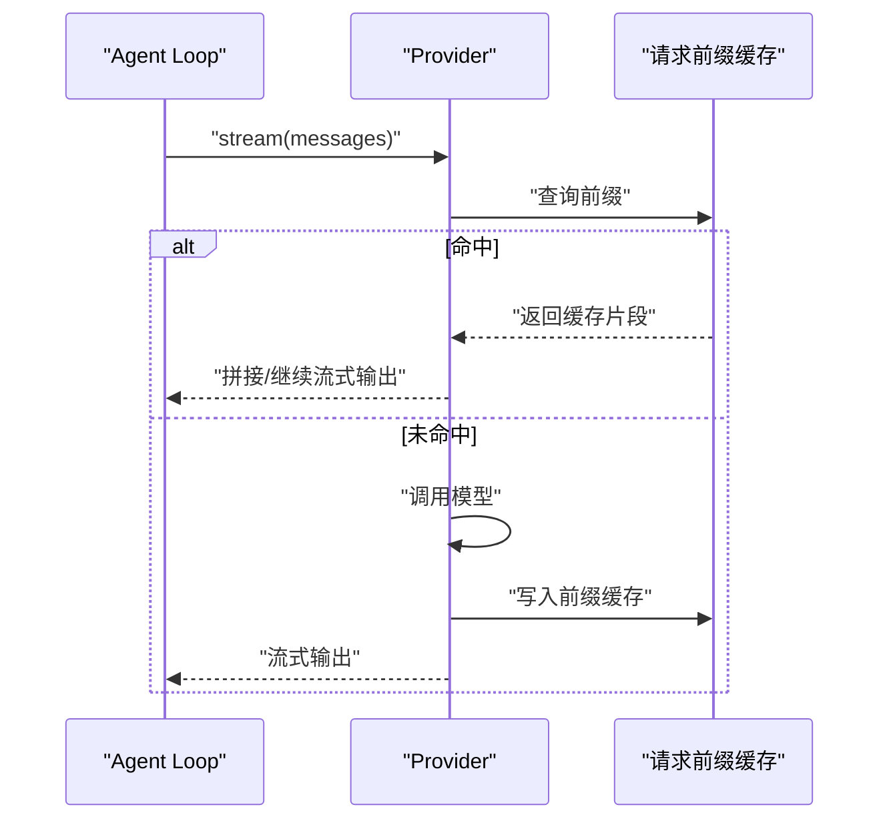
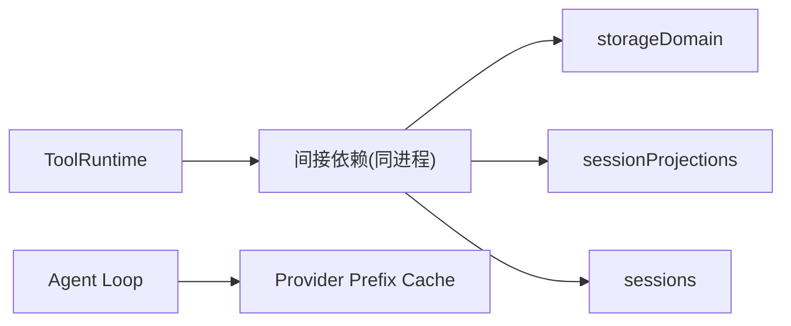

# 缓存策略

<cite>
**本文引用的文件**
- [packages/session/session-projection-cache/src/index.ts](file://packages/session/session-projection-cache/src/index.ts)
- [packages/session/session-projection-cache/tests/cache.spec.ts](file://packages/session/session-projection-cache/tests/cache.spec.ts)
- [.agents/notes/implemented/architecture/2026-08-19-projection-cache-per-session-files.md](file://.agents/notes/implemented/architecture/2026-08-19-projection-cache-per-session-files.md)
- [packages/core/tools/src/index.ts](file://packages/core/tools/src/index.ts)
- [packages/core/tools/tests/tools.spec.ts](file://packages/core/tools/tests/tools.spec.ts)
- [packages/compaction/compaction/src/tool-pairing.ts](file://packages/compaction/compaction/src/tool-pairing.ts)
- [packages/client/ui-chat/src/client/conversation-nodes/tool.ts](file://packages/client/ui-chat/src/client/conversation-nodes/tool.ts)
- [packages/client/ui-conversation/src/client/conversation/historical-images.ts](file://packages/client/ui-conversation/src/client/conversation/historical-images.ts)
- [packages/client/modules/src/client/system.ts](file://packages/client/modules/src/client/system.ts)
- [packages/api/session-controller/src/client/sessions/manager.ts](file://packages/api/session-controller/src/client/sessions/manager.ts)
- [packages/client/ui-chat/src/client/chat/token-format.ts](file://packages/client/ui-chat/src/client/chat/token-format.ts)
- [packages/core/agent-loop/tests/request-cache.e2e.ts](file://packages/core/agent-loop/tests/request-cache.e2e.ts)
</cite>

## 目录
1. [简介](#简介)
2. [项目结构](#项目结构)
3. [核心组件](#核心组件)
4. [架构总览](#架构总览)
5. [详细组件分析](#详细组件分析)
6. [依赖关系分析](#依赖关系分析)
7. [性能考虑](#性能考虑)
8. [故障排查指南](#故障排查指南)
9. [结论](#结论)
10. [附录](#附录)

## 简介
本文件聚焦 DeepSeek Harness 的缓存策略，围绕三类关键缓存进行系统化说明：
- 会话状态投影缓存（SessionProjectionCache）：以写回为主、读路径零 I/O 的持久化投影快照，保障冷启动与列表展示的快速读取。
- 工具调用缓存：在工具执行管线中的结果复用与重验证机制，避免重复计算并保证一致性。
- LLM 响应缓存：基于请求前缀的去重与命中统计，减少重复推理成本。

文档同时给出配置项、触发条件、失效策略、分布式实践建议以及性能调优方法。

## 项目结构
DeepSeek Harness 将缓存能力按子系统拆分：
- 会话投影缓存位于 session-projection-cache 包，提供 per-session 的持久化记录与写后落盘策略。
- 工具执行与缓存位于 core/tools 包，并在 compaction、client 等模块中配合使用。
- LLM 相关缓存通过 agent-loop 测试与运行时集成，体现为 provider prefix cache 的命中行为。

图表来源
- [packages/session/session-projection-cache/src/index.ts:1-324](file://packages/session/session-projection-cache/src/index.ts#L1-L324)
- [.agents/notes/implemented/architecture/2026-08-19-projection-cache-per-session-files.md:1-13](file://.agents/notes/implemented/architecture/2026-08-19-projection-cache-per-session-files.md#L1-L13)
- [packages/core/tools/src/index.ts:780-979](file://packages/core/tools/src/index.ts#L780-L979)
- [packages/core/agent-loop/tests/request-cache.e2e.ts:71-74](file://packages/core/agent-loop/tests/request-cache.e2e.ts#L71-L74)

章节来源
- [packages/session/session-projection-cache/src/index.ts:1-324](file://packages/session/session-projection-cache/src/index.ts#L1-L324)
- [.agents/notes/implemented/architecture/2026-08-19-projection-cache-per-session-files.md:1-13](file://.agents/notes/implemented/architecture/2026-08-19-projection-cache-per-session-files.md#L1-L13)

## 核心组件
- 会话投影缓存（SessionProjectionCache）
  - 职责：维护每个会话的投影快照，提供冷启动快速恢复与列表展示的无 I/O 读取。
  - 写回策略：计数阈值 + 时间间隔节流；三个强制落盘点（创建、turn/end、session/disposed）。
  - 一致性：读路径仅访问内存表；写路径先持久化再更新内存，确保“只可能落后日志，不会超前”。
- 工具执行与缓存（ToolRuntime）
  - 职责：工具注册、调度、执行管线；支持跨调度结果复用与重验证。
  - 缓存键：基于工具名与参数规范化后的可序列化形式；在不同分发路径下仍可被识别并重验证。
- LLM 请求前缀缓存
  - 职责：对相同消息前缀的请求进行去重，提升命中率，降低 API 调用成本。
  - 指标：前端提供缓存命中率百分比格式化能力，便于监控。

章节来源
- [packages/session/session-projection-cache/src/index.ts:48-76](file://packages/session/session-projection-cache/src/index.ts#L48-L76)
- [packages/core/tools/tests/tools.spec.ts:1785-1824](file://packages/core/tools/tests/tools.spec.ts#L1785-L1824)
- [packages/core/agent-loop/tests/request-cache.e2e.ts:71-74](file://packages/core/agent-loop/tests/request-cache.e2e.ts#L71-L74)
- [packages/client/ui-chat/src/client/chat/token-format.ts:32-98](file://packages/client/ui-chat/src/client/chat/token-format.ts#L32-L98)

## 架构总览
下图展示了会话投影缓存从事件到落盘的完整流程，包括节流与强制落盘点，以及冷启动时的热/冷路径选择。

图表来源
- [packages/session/session-projection-cache/src/index.ts:218-271](file://packages/session/session-projection-cache/src/index.ts#L218-L271)
- [packages/session/session-projection-cache/src/index.ts:278-304](file://packages/session/session-projection-cache/src/index.ts#L278-L304)

章节来源
- [packages/session/session-projection-cache/src/index.ts:218-304](file://packages/session/session-projection-cache/src/index.ts#L218-L304)

## 详细组件分析

### 会话状态投影缓存（SessionProjectionCache）
- 工作原理
  - 打开 storageDomain 的 session_projcache，使用 per-record 布局（每会话一个 JSON 文件），避免单文件重写放大。
  - 读路径：cachedSnapshot/hydratePrepared/coldSnapshot 均不直接访问持久层，而是基于内存表与事件流折叠。
  - 写路径：write 先 checkpoint 当前 registry 快照，再 flush 会话日志，最后 put 到 KvTable；失败软处理，不影响主路径。
- 写回触发条件
  - 计数阈值：writeEveryEvents 个已提交事件后触发。
  - 时间阈值：writeIntervalMs 内未达阈值则定时触发。
  - 强制落盘点：session/created、turn/end、session/disposed。
- 一致性保证
  - 读路径仅访问内存表，写路径先持久化再更新内存，保证“读不会绕过写链”，且记录带 identity（createdAt/cwd）校验，防止跨生命周期误用旧行。
  - coldSnapshot 会尝试从缓存恢复，若 schema 不兼容则回退到全量日志重建，并异步写回新行（fail-soft）。

图表来源
- [packages/session/session-projection-cache/src/index.ts:172-193](file://packages/session/session-projection-cache/src/index.ts#L172-L193)
- [packages/session/session-projection-cache/src/index.ts:278-295](file://packages/session/session-projection-cache/src/index.ts#L278-L295)

章节来源
- [packages/session/session-projection-cache/src/index.ts:89-113](file://packages/session/session-projection-cache/src/index.ts#L89-L113)
- [packages/session/session-projection-cache/src/index.ts:128-170](file://packages/session/session-projection-cache/src/index.ts#L128-L170)
- [packages/session/session-projection-cache/src/index.ts:172-193](file://packages/session/session-projection-cache/src/index.ts#L172-L193)
- [packages/session/session-projection-cache/src/index.ts:207-215](file://packages/session/session-projection-cache/src/index.ts#L207-L215)
- [packages/session/session-projection-cache/src/index.ts:218-271](file://packages/session/session-projection-cache/src/index.ts#L218-L271)
- [packages/session/session-projection-cache/src/index.ts:278-304](file://packages/session/session-projection-cache/src/index.ts#L278-L304)
- [.agents/notes/implemented/architecture/2026-08-19-projection-cache-per-session-files.md:1-13](file://.agents/notes/implemented/architecture/2026-08-19-projection-cache-per-session-files.md#L1-L13)

### 工具调用缓存策略
- 缓存键生成
  - 基于工具名与参数规范化后的可序列化形式；不同分发路径下的同一逻辑结果可被识别。
- 失效策略
  - 当返回类型或结构发生变化时，会在后续分发中进行重验证，避免陈旧值污染。
- 穿透防护
  - 通过管道事件（tools/execute、tools/result）统一拦截，结合 WeakMap/WeakSet 管理上下文，避免跨作用域泄漏。
- 典型场景
  - 同一次轮次内的多次调用可复用同一结果对象；跨调度也能正确重验证。

图表来源
- [packages/core/tools/tests/tools.spec.ts:1785-1824](file://packages/core/tools/tests/tools.spec.ts#L1785-L1824)
- [packages/core/tools/src/index.ts:780-979](file://packages/core/tools/src/index.ts#L780-L979)

章节来源
- [packages/core/tools/tests/tools.spec.ts:1785-1824](file://packages/core/tools/tests/tools.spec.ts#L1785-L1824)
- [packages/core/tools/src/index.ts:780-979](file://packages/core/tools/src/index.ts#L780-L979)

### LLM 响应缓存机制
- 响应去重
  - 基于 provider 前缀的消息序列进行缓存命中，首次之后重复请求可直接命中。
- TTL 管理
  - 代码库未暴露显式 TTL 配置；实际命中由 provider 实现与请求前缀匹配决定。
- 缓存预热
  - 可通过预发常用对话前缀触发首次构建，使后续请求命中。
- 命中率监控
  - 前端提供缓存命中率百分比格式化函数，便于观测与告警。

图表来源
- [packages/core/agent-loop/tests/request-cache.e2e.ts:71-74](file://packages/core/agent-loop/tests/request-cache.e2e.ts#L71-L74)
- [packages/client/ui-chat/src/client/chat/token-format.ts:32-98](file://packages/client/ui-chat/src/client/chat/token-format.ts#L32-L98)

章节来源
- [packages/core/agent-loop/tests/request-cache.e2e.ts:71-74](file://packages/core/agent-loop/tests/request-cache.e2e.ts#L71-L74)
- [packages/client/ui-chat/src/client/chat/token-format.ts:32-98](file://packages/client/ui-chat/src/client/chat/token-format.ts#L32-L98)

### 其他相关缓存与优化点
- 压缩阶段工具配对缓存（tool-pairing）
  - 使用 WeakMap 按会话维度缓存平衡信息，仅在日志增长或替换时重建，避免重复解析。
- UI 侧历史图片缓存
  - 历史图片加载采用本地缓存，减少重复网络请求。
- 客户端模块加载缓存
  - 使用 Map 缓存模块清单与外部依赖正则，加速构建与加载。
- 会话控制器条目缓存
  - 对会话条目进行本地缓存，减少重复列表查询。

章节来源
- [packages/compaction/compaction/src/tool-pairing.ts:11-86](file://packages/compaction/compaction/src/tool-pairing.ts#L11-L86)
- [packages/client/ui-conversation/src/client/conversation/historical-images.ts:16-20](file://packages/client/ui-conversation/src/client/conversation/historical-images.ts#L16-L20)
- [packages/client/modules/src/client/system.ts:174-218](file://packages/client/modules/src/client/system.ts#L174-L218)
- [packages/api/session-controller/src/client/sessions/manager.ts:934-949](file://packages/api/session-controller/src/client/sessions/manager.ts#L934-L949)

## 依赖关系分析
- SessionProjectionCache 依赖
  - storageDomain：打开 session_projcache 域，读写 per-record 文件。
  - sessionProjections：负责投影单元的状态折叠与检查点生成。
  - sessions：在写回前 flush 活跃会话，确保日志一致。
- ToolRuntime 依赖
  - systemPrompt：注入工具提示与模式（native/ptc/both）。
  - 执行管线：通过 prepare/dispatch/finalize/finish 四阶段编排。
- LLM 缓存依赖
  - Agent Loop 与 Provider 实现：共享请求前缀缓存，命中后直接返回。

图表来源
- [packages/session/session-projection-cache/src/index.ts:77-95](file://packages/session/session-projection-cache/src/index.ts#L77-L95)
- [packages/core/tools/src/index.ts:780-979](file://packages/core/tools/src/index.ts#L780-L979)
- [packages/core/agent-loop/tests/request-cache.e2e.ts:71-74](file://packages/core/agent-loop/tests/request-cache.e2e.ts#L71-L74)

章节来源
- [packages/session/session-projection-cache/src/index.ts:77-95](file://packages/session/session-projection-cache/src/index.ts#L77-L95)
- [packages/core/tools/src/index.ts:780-979](file://packages/core/tools/src/index.ts#L780-L979)
- [packages/core/agent-loop/tests/request-cache.e2e.ts:71-74](file://packages/core/agent-loop/tests/request-cache.e2e.ts#L71-L74)

## 性能考虑
- 会话投影缓存
  - 配置项：writeEveryEvents、writeIntervalMs 需根据事件吞吐与延迟目标调优。
  - 命中率：冷启动时 coldSnapshot 会重建并写回，后续冷读将显著提速。
  - 内存占用：per-record 布局避免单文件重写放大，降低磁盘抖动与锁竞争。
- 工具调用缓存
  - 复用范围：尽量在同一轮次/作用域内复用结果，减少重复计算。
  - 重验证：当返回结构变化时，管线会自动重验证，避免错误命中。
- LLM 响应缓存
  - 命中率：通过稳定消息前缀提升命中；对高频问题可预热。
  - 监控：使用 formatCacheHitPercent 等工具观察命中率，指导业务侧优化。

[本节为通用性能建议，无需特定文件引用]

## 故障排查指南
- 写回失败
  - 现象：coldSnapshot 写回失败会记录警告，缓存保持陈旧，下次冷读重试。
  - 处理：检查存储域可用性与权限；关注日志中的失败原因。
- 身份不匹配
  - 现象：recordFor 返回 undefined，表示存储记录与当前会话生命周期不一致。
  - 处理：确认 createdAt/cwd 是否变更；必要时走全量日志重建。
- 工具缓存重验证
  - 现象：跨调度返回结果被重新验证，导致执行体再次运行。
  - 处理：检查工具输出结构与参数规范化是否正确；避免副作用导致的不可预期结果。
- LLM 缓存未命中
  - 现象：重复请求未命中 provider prefix cache。
  - 处理：确认消息前缀是否一致；检查 provider 实现是否启用缓存。

章节来源
- [packages/session/session-projection-cache/src/index.ts:207-215](file://packages/session/session-projection-cache/src/index.ts#L207-L215)
- [packages/session/session-projection-cache/src/index.ts:97-113](file://packages/session/session-projection-cache/src/index.ts#L97-L113)
- [packages/core/tools/tests/tools.spec.ts:1785-1824](file://packages/core/tools/tests/tools.spec.ts#L1785-L1824)
- [packages/core/agent-loop/tests/request-cache.e2e.ts:71-74](file://packages/core/agent-loop/tests/request-cache.e2e.ts#L71-L74)

## 结论
DeepSeek Harness 的缓存体系以“写回优先、读路径零 I/O”为核心设计，结合 per-record 持久化、强制落盘点与 fail-soft 策略，在保证一致性的前提下显著提升冷启动与列表展示性能。工具调用缓存通过规范化键与重验证机制，兼顾效率与安全。LLM 请求前缀缓存进一步降低推理成本。通过合理配置与监控，可在多租户与分布式环境中获得稳定高效的缓存表现。

[本节为总结性内容，无需特定文件引用]

## 附录
- 配置项参考
  - SessionProjectionCache.Config
    - writeEveryEvents：两次强制落盘点之间的事件计数阈值。
    - writeIntervalMs：两次强制落盘点之间的最大等待时间。
- 最佳实践
  - 分布式缓存：将 per-record 文件迁移至共享存储（如对象存储），并通过版本与 identity 校验保证一致性。
  - 失效策略：在会话重建或存储后端切换时，主动清理或降级到全量日志重建。
  - 预热策略：对高频会话或模板化对话进行首次构建，提升后续命中率。
  - 监控指标：跟踪缓存命中率、写回失败率、冷读重建次数与耗时。

[本节为补充信息，无需特定文件引用]