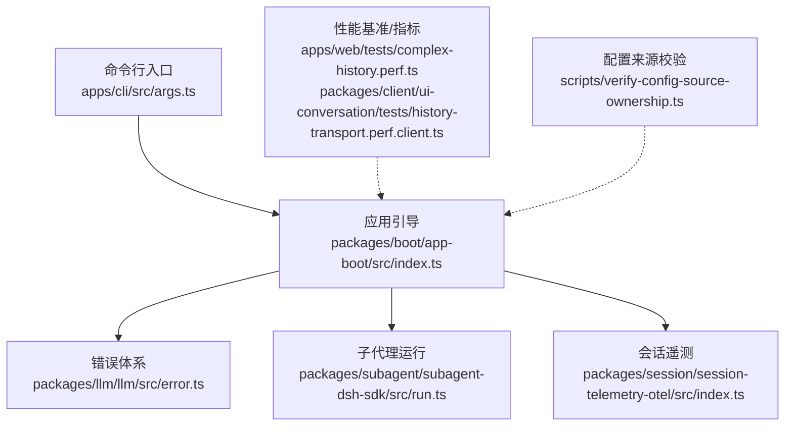
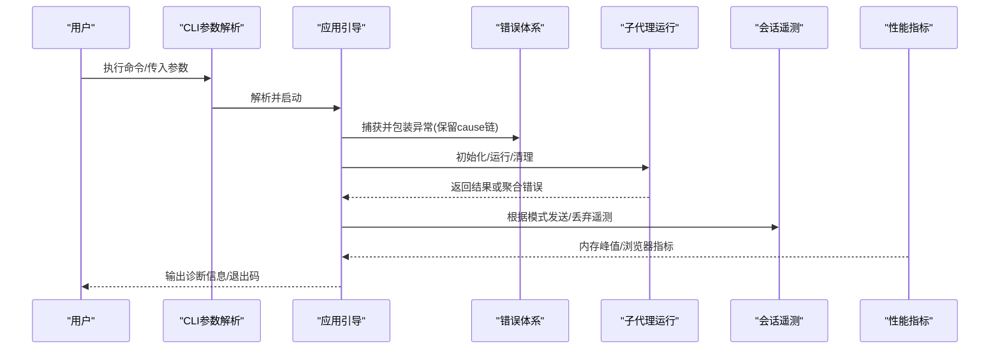
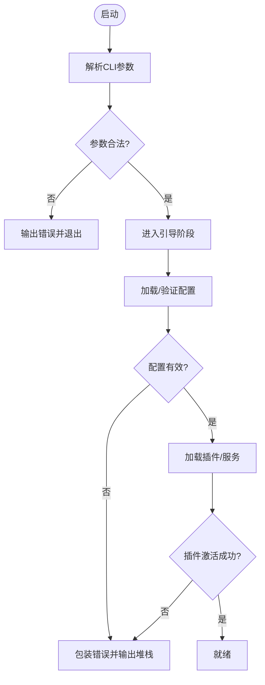
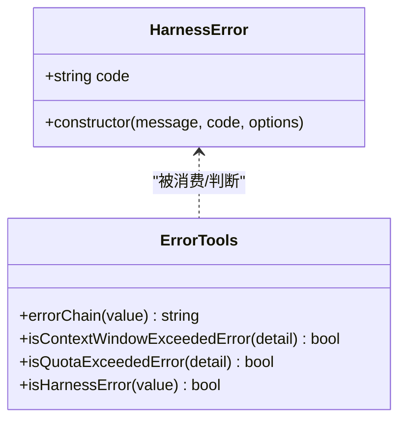
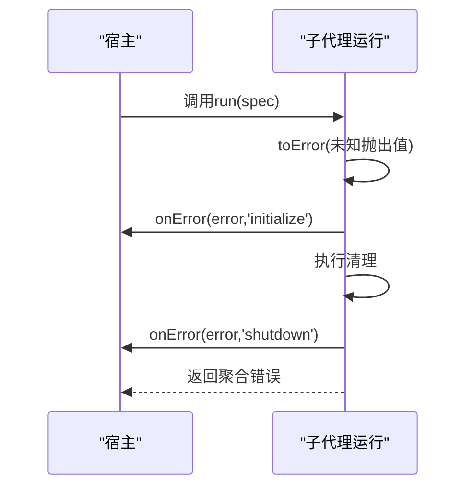
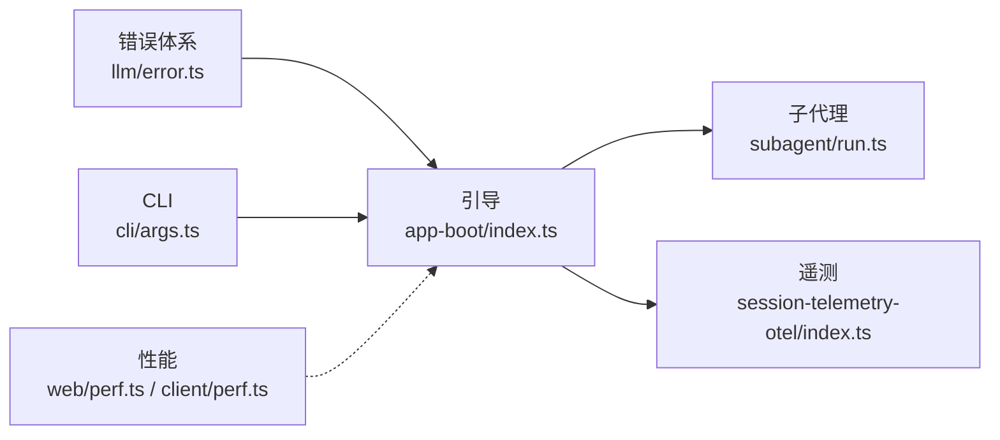

# 故障排除指南

<cite>
**本文引用的文件**
- [packages/llm/llm/src/error.ts](file://packages/llm/llm/src/error.ts)
- [packages/boot/app-boot/src/index.ts](file://packages/boot/app-boot/src/index.ts)
- [apps/cli/src/args.ts](file://apps/cli/src/args.ts)
- [packages/subagent/subagent-dsh-sdk/src/run.ts](file://packages/subagent/subagent-dsh-sdk/src/run.ts)
- [packages/session/session-telemetry-otel/src/index.ts](file://packages/session/session-telemetry-otel/src/index.ts)
- [packages/client/ui-conversation/tests/history-transport.perf.client.ts](file://packages/client/ui-conversation/tests/history-transport.perf.client.ts)
- [apps/web/tests/complex-history.perf.ts](file://apps/web/tests/complex-history.perf.ts)
- [scripts/verify-config-source-ownership.ts](file://scripts/verify-config-source-ownership.ts)
- [.agents/notes/implemented/architecture/2026-06-11-structured-error-taxonomy.zh.md](file://.agents/notes/implemented/architecture/2026-06-11-structured-error-taxonomy.zh.md)
</cite>

## 目录
1. [简介](#简介)
2. [项目结构](#项目结构)
3. [核心组件](#核心组件)
4. [架构总览](#架构总览)
5. [详细组件分析](#详细组件分析)
6. [依赖关系分析](#依赖关系分析)
7. [性能注意事项](#性能注意事项)
8. [故障排除指南](#故障排除指南)
9. [结论](#结论)
10. [附录](#附录)

## 简介
本指南面向DeepSeek Harness的使用者与开发者，聚焦启动失败、运行时错误与性能问题的诊断与修复。内容涵盖：
- 常见错误的分类与根因定位
- 日志分析与堆栈跟踪解读
- 内存与I/O瓶颈识别
- 调试工具与技巧（含遥测与反馈）
- 错误代码参考与修复步骤
- 社区支持与获取帮助渠道

## 项目结构
DeepSeek Harness采用多包模块化架构，关键与故障排除相关的模块包括：
- 启动与配置：CLI参数解析、分层环境加载、应用引导与错误包装
- 错误体系：统一的HarnessError基类、错误链渲染、上下文窗口/配额超限识别
- 子代理运行：SDK运行时的错误归一化与上报
- 遥测与反馈：会话遥测模式控制、本地反馈提示
- 性能基准与指标：内存峰值采样、浏览器性能指标采集

图表来源
- [apps/cli/src/args.ts:74-103](file://apps/cli/src/args.ts#L74-L103)
- [packages/boot/app-boot/src/index.ts:800-847](file://packages/boot/app-boot/src/index.ts#L800-L847)
- [packages/llm/llm/src/error.ts:1-164](file://packages/llm/llm/src/error.ts#L1-L164)
- [packages/subagent/subagent-dsh-sdk/src/run.ts:183-217](file://packages/subagent/subagent-dsh-sdk/src/run.ts#L183-L217)
- [packages/session/session-telemetry-otel/src/index.ts:50-168](file://packages/session/session-telemetry-otel/src/index.ts#L50-L168)
- [apps/web/tests/complex-history.perf.ts:515-542](file://apps/web/tests/complex-history.perf.ts#L515-L542)
- [packages/client/ui-conversation/tests/history-transport.perf.client.ts:240-263](file://packages/client/ui-conversation/tests/history-transport.perf.client.ts#L240-L263)
- [scripts/verify-config-source-ownership.ts:24-55](file://scripts/verify-config-source-ownership.ts#L24-L55)

章节来源
- [apps/cli/src/args.ts:74-103](file://apps/cli/src/args.ts#L74-L103)
- [packages/boot/app-boot/src/index.ts:800-847](file://packages/boot/app-boot/src/index.ts#L800-L847)
- [packages/llm/llm/src/error.ts:1-164](file://packages/llm/llm/src/error.ts#L1-L164)
- [packages/subagent/subagent-dsh-sdk/src/run.ts:183-217](file://packages/subagent/subagent-dsh-sdk/src/run.ts#L183-L217)
- [packages/session/session-telemetry-otel/src/index.ts:50-168](file://packages/session/session-telemetry-otel/src/index.ts#L50-L168)
- [apps/web/tests/complex-history.perf.ts:515-542](file://apps/web/tests/complex-history.perf.ts#L515-L542)
- [packages/client/ui-conversation/tests/history-transport.perf.client.ts:240-263](file://packages/client/ui-conversation/tests/history-transport.perf.client.ts#L240-L263)
- [scripts/verify-config-source-ownership.ts:24-55](file://scripts/verify-config-source-ownership.ts#L24-L55)

## 核心组件
- 统一错误基类与错误链渲染：提供稳定的machine-routable code、cause链与AggregateError成员渲染，便于日志与回放使用。
- 启动引导与错误包装：在引导阶段捕获并包装异常，保留最深层cause的堆栈信息，便于定位插件或配置问题。
- 子代理运行错误归一化：将未知抛出值归一为Error，并在初始化/清理阶段聚合失败，确保宿主侧可观测。
- 会话遥测与反馈：支持禁用/仅反馈/完整三种模式；禁用时记录本地警告，避免误传数据。
- 性能指标与内存采样：通过V8 GC与进程内存API采样堆使用峰值；通过CDP采集浏览器性能指标。

章节来源
- [packages/llm/llm/src/error.ts:1-164](file://packages/llm/llm/src/error.ts#L1-L164)
- [packages/boot/app-boot/src/index.ts:800-847](file://packages/boot/app-boot/src/index.ts#L800-L847)
- [packages/subagent/subagent-dsh-sdk/src/run.ts:183-217](file://packages/subagent/subagent-dsh-sdk/src/run.ts#L183-L217)
- [packages/session/session-telemetry-otel/src/index.ts:50-168](file://packages/session/session-telemetry-otel/src/index.ts#L50-L168)
- [packages/client/ui-conversation/tests/history-transport.perf.client.ts:240-263](file://packages/client/ui-conversation/tests/history-transport.perf.client.ts#L240-L263)
- [apps/web/tests/complex-history.perf.ts:515-542](file://apps/web/tests/complex-history.perf.ts#L515-L542)

## 架构总览
下图展示从CLI到引导、错误处理、子代理运行与遥测的关键交互路径，以及性能指标采集点。

图表来源
- [apps/cli/src/args.ts:74-103](file://apps/cli/src/args.ts#L74-L103)
- [packages/boot/app-boot/src/index.ts:800-847](file://packages/boot/app-boot/src/index.ts#L800-L847)
- [packages/llm/llm/src/error.ts:1-164](file://packages/llm/llm/src/error.ts#L1-L164)
- [packages/subagent/subagent-dsh-sdk/src/run.ts:183-217](file://packages/subagent/subagent-dsh-sdk/src/run.ts#L183-L217)
- [packages/session/session-telemetry-otel/src/index.ts:50-168](file://packages/session/session-telemetry-otel/src/index.ts#L50-L168)
- [apps/web/tests/complex-history.perf.ts:515-542](file://apps/web/tests/complex-history.perf.ts#L515-L542)

## 详细组件分析

### 启动失败诊断
- 现象：CLI启动后立刻失败，无业务输出。
- 关键点：
  - CLI参数冲突或非法参数会直接报错退出。
  - 引导阶段捕获所有异常，附加bin名与阶段信息，并追加最深层cause堆栈。
  - 配置文件读取/解析失败会被明确标注。
- 建议步骤：
  - 检查CLI参数是否互斥或重复（如dump-config相关选项）。
  - 查看引导阶段的错误消息与堆栈，定位具体插件或配置层。
  - 若涉及配置注入，确认环境变量与配置文件来源合规。

图表来源
- [apps/cli/src/args.ts:74-103](file://apps/cli/src/args.ts#L74-L103)
- [packages/boot/app-boot/src/index.ts:800-847](file://packages/boot/app-boot/src/index.ts#L800-L847)

章节来源
- [apps/cli/src/args.ts:74-103](file://apps/cli/src/args.ts#L74-L103)
- [packages/boot/app-boot/src/index.ts:800-847](file://packages/boot/app-boot/src/index.ts#L800-L847)

### 运行时错误与错误代码参考
- 错误分类：
  - 上下文窗口超限：CONTEXT_WINDOW_EXCEEDED_CODE
  - 配额耗尽：QUOTA_EXCEEDED_CODE
  - 空响应：EMPTY_RESPONSE_CODE
  - 无效凭据：INVALID_CREDENTIAL_CODE
- 错误链渲染：errorChain会将cause链与AggregateError成员拼接，便于日志阅读。
- 类型判断：isHarnessError用于边界处类型收窄。
- 建议步骤：
  - 优先依据code分支处理，而非解析message。
  - 对网络封装错误（如fetch失败），借助errorChain查看底层原因。
  - 针对上下文窗口/配额问题，调整输入长度或账户额度。

图表来源
- [packages/llm/llm/src/error.ts:1-164](file://packages/llm/llm/src/error.ts#L1-L164)

章节来源
- [packages/llm/llm/src/error.ts:1-164](file://packages/llm/llm/src/error.ts#L1-L164)
- [.agents/notes/implemented/architecture/2026-06-11-structured-error-taxonomy.zh.md:1-27](file://.agents/notes/implemented/architecture/2026-06-11-structured-error-taxonomy.zh.md#L1-L27)

### 子代理运行错误与上报
- 行为：
  - 将未知抛出值归一化为Error。
  - 在初始化/清理阶段发生失败时，聚合错误并上报给宿主回调。
- 建议步骤：
  - 关注onError回调中的错误对象与阶段信息。
  - 若出现AggregateError，分别检查initialize与shutdown两个阶段的cause。

图表来源
- [packages/subagent/subagent-dsh-sdk/src/run.ts:183-217](file://packages/subagent/subagent-dsh-sdk/src/run.ts#L183-L217)

章节来源
- [packages/subagent/subagent-dsh-sdk/src/run.ts:183-217](file://packages/subagent/subagent-dsh-sdk/src/run.ts#L183-L217)

### 遥测与反馈
- 模式：
  - FULL：完整上传
  - FEEDBACK_ONLY：仅在记录反馈时上传必要记录
  - DISABLED：不上传，记录本地警告
- 建议步骤：
  - 若需本地诊断但不外发，使用DISABLED模式。
  - 记录反馈时注意共享披露说明，理解上传范围。

章节来源
- [packages/session/session-telemetry-otel/src/index.ts:50-168](file://packages/session/session-telemetry-otel/src/index.ts#L50-L168)

### 性能调优与问题定位
- 内存分析：
  - 使用强制GC前后对比heapUsed，计算额外峰值。
  - 多次采样取中位数，降低噪声。
- 浏览器性能：
  - 通过CDP采集JSHeapUsedSize、Nodes、JSEventListeners等指标。
- I/O瓶颈：
  - 结合事件流与序列化耗时（JSON/Gzip/Brotli）评估压缩与传输开销。
- 建议步骤：
  - 在关键路径前后插入内存采样，观察增量。
  - 对大历史/长对话场景，启用压缩与分页策略。
  - 监控浏览器端DOM节点与监听器数量，防止泄漏。

章节来源
- [packages/client/ui-conversation/tests/history-transport.perf.client.ts:240-263](file://packages/client/ui-conversation/tests/history-transport.perf.client.ts#L240-L263)
- [apps/web/tests/complex-history.perf.ts:515-542](file://apps/web/tests/complex-history.perf.ts#L515-L542)

## 依赖关系分析
- 低耦合高内聚：错误体系位于公共包，被广泛依赖但无新增边。
- 启动流程强约束：CLI参数与引导阶段严格校验，失败快速失败。
- 遥测可插拔：通过模式开关控制数据外发，默认安全。
- 性能可观测：测试与基准提供内存与浏览器指标采集能力。

图表来源
- [packages/llm/llm/src/error.ts:1-164](file://packages/llm/llm/src/error.ts#L1-L164)
- [packages/boot/app-boot/src/index.ts:800-847](file://packages/boot/app-boot/src/index.ts#L800-L847)
- [apps/cli/src/args.ts:74-103](file://apps/cli/src/args.ts#L74-L103)
- [packages/subagent/subagent-dsh-sdk/src/run.ts:183-217](file://packages/subagent/subagent-dsh-sdk/src/run.ts#L183-L217)
- [packages/session/session-telemetry-otel/src/index.ts:50-168](file://packages/session/session-telemetry-otel/src/index.ts#L50-L168)
- [apps/web/tests/complex-history.perf.ts:515-542](file://apps/web/tests/complex-history.perf.ts#L515-L542)
- [packages/client/ui-conversation/tests/history-transport.perf.client.ts:240-263](file://packages/client/ui-conversation/tests/history-transport.perf.client.ts#L240-L263)

## 性能注意事项
- 避免在热路径创建大对象，必要时复用缓冲。
- 对长对话/大历史启用压缩与分页，减少内存与带宽占用。
- 定期强制GC并采样内存峰值，识别增长趋势。
- 监控浏览器端DOM与事件监听器数量，及时释放资源。
- 对I/O密集任务进行批处理与背压控制。

## 故障排除指南

### 启动失败
- 可能原因：
  - CLI参数冲突或非法（如dump-config相关选项）。
  - 配置文件读取/解析失败。
  - 插件激活失败（包含初始化/清理阶段错误）。
- 诊断方法：
  - 检查CLI参数合法性与互斥性。
  - 查看引导阶段输出的错误消息与堆栈，定位具体阶段与插件。
  - 若涉及配置来源，使用配置校验脚本排查违规项。
- 修复步骤：
  - 修正CLI参数或移除冲突选项。
  - 修复配置文件语法与必填字段。
  - 隔离问题插件，逐步恢复以定位根因。

章节来源
- [apps/cli/src/args.ts:74-103](file://apps/cli/src/args.ts#L74-L103)
- [packages/boot/app-boot/src/index.ts:800-847](file://packages/boot/app-boot/src/index.ts#L800-L847)
- [scripts/verify-config-source-ownership.ts:24-55](file://scripts/verify-config-source-ownership.ts#L24-L55)

### 运行时错误
- 可能原因：
  - 上下文窗口超限、配额耗尽、空响应、无效凭据。
  - 网络请求失败（如fetch封装错误）。
  - 子代理初始化/清理阶段失败。
- 诊断方法：
  - 依据错误code分支处理，避免字符串匹配。
  - 使用errorChain查看cause链与AggregateError成员。
  - 关注子代理onError回调的阶段信息与错误对象。
- 修复步骤：
  - 缩短输入或拆分请求以规避上下文窗口限制。
  - 检查账户额度或切换模型/提供商。
  - 修正凭据格式或更新密钥。
  - 修复子代理初始化逻辑与清理资源。

章节来源
- [packages/llm/llm/src/error.ts:1-164](file://packages/llm/llm/src/error.ts#L1-L164)
- [packages/subagent/subagent-dsh-sdk/src/run.ts:183-217](file://packages/subagent/subagent-dsh-sdk/src/run.ts#L183-L217)

### 性能问题
- 可能原因：
  - 内存泄漏或峰值过高。
  - I/O阻塞或压缩效率低。
  - 浏览器端DOM/监听器过多导致卡顿。
- 诊断方法：
  - 使用强制GC前后对比heapUsed，计算额外峰值。
  - 通过CDP采集JSHeapUsedSize、Nodes、JSEventListeners等指标。
  - 分析事件流与序列化耗时，评估压缩策略。
- 修复步骤：
  - 引入分页、虚拟化与懒加载。
  - 优化数据结构，避免大对象频繁创建。
  - 调整压缩算法与批次大小，平衡CPU与带宽。
  - 释放未使用的监听器与DOM引用。

章节来源
- [packages/client/ui-conversation/tests/history-transport.perf.client.ts:240-263](file://packages/client/ui-conversation/tests/history-transport.perf.client.ts#L240-L263)
- [apps/web/tests/complex-history.perf.ts:515-542](file://apps/web/tests/complex-history.perf.ts#L515-L542)

### 调试工具与技巧
- 日志分析：
  - 优先依据错误code与阶段信息进行路由与分类。
  - 使用errorChain还原完整的cause链，避免掩盖底层原因。
- 堆栈跟踪：
  - 关注引导阶段包装后的堆栈，定位最深层插件错误。
- 内存分析：
  - 在关键路径前后插入内存采样，观察增量与趋势。
- 遥测与反馈：
  - 使用FEEDBACK_ONLY模式在需要时上传必要记录。
  - 禁用模式下仅本地记录，避免误传。

章节来源
- [packages/llm/llm/src/error.ts:1-164](file://packages/llm/llm/src/error.ts#L1-L164)
- [packages/boot/app-boot/src/index.ts:800-847](file://packages/boot/app-boot/src/index.ts#L800-L847)
- [packages/session/session-telemetry-otel/src/index.ts:50-168](file://packages/session/session-telemetry-otel/src/index.ts#L50-L168)

### 错误代码参考与解决方案
- CONTEXT_WINDOW_EXCEEDED：缩短输入或拆分请求。
- QUOTA：检查账户额度或切换提供商。
- EMPTY_RESPONSE：重试或调整提示词/模型。
- INVALID_CREDENTIAL：修正凭据格式或更新密钥。
- UNKNOWN（非Error抛出）：规范化抛出值，确保携带code。

章节来源
- [packages/llm/llm/src/error.ts:1-164](file://packages/llm/llm/src/error.ts#L1-L164)
- [packages/subagent/subagent-dsh-sdk/src/run.ts:183-217](file://packages/subagent/subagent-dsh-sdk/src/run.ts#L183-L217)

### 社区支持与获取帮助
- 提交反馈：
  - 在禁用遥测模式下，记录本地反馈并附带错误code与堆栈。
- 文档与规范：
  - 参考结构化错误分类与遥测模式的实现说明。
- 工具与脚本：
  - 使用配置来源校验脚本排查违规配置。

章节来源
- [packages/session/session-telemetry-otel/src/index.ts:50-168](file://packages/session/session-telemetry-otel/src/index.ts#L50-L168)
- [.agents/notes/implemented/architecture/2026-06-11-structured-error-taxonomy.zh.md:1-27](file://.agents/notes/implemented/architecture/2026-06-11-structured-error-taxonomy.zh.md#L1-L27)
- [scripts/verify-config-source-ownership.ts:24-55](file://scripts/verify-config-source-ownership.ts#L24-L55)

## 结论
通过统一的错误体系、严格的启动引导、可插拔的遥测机制与完善的性能指标采集，DeepSeek Harness提供了强大的故障排除基础。实践中应优先依据错误code与阶段信息进行定位，结合日志、堆栈与内存指标进行根因分析，并采取针对性的修复措施。对于复杂问题，可利用反馈机制与社区资源获取进一步支持。

## 附录
- 常用命令与标志：
  - 检查CLI参数合法性与互斥性。
  - 使用dump-config相关标志打印配置层（注意互斥与限制）。
- 环境变量与模式：
  - DSH_TELEMETRY_MODE控制遥测模式（FULL/FEEDBACK_ONLY/DISABLED）。
- 性能基准：
  - 在测试环境中启用强制GC与CDP指标采集，复现与验证优化效果。