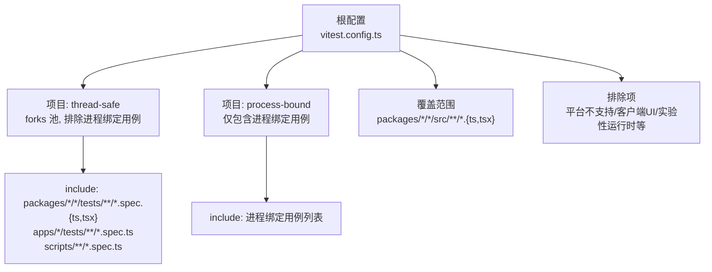
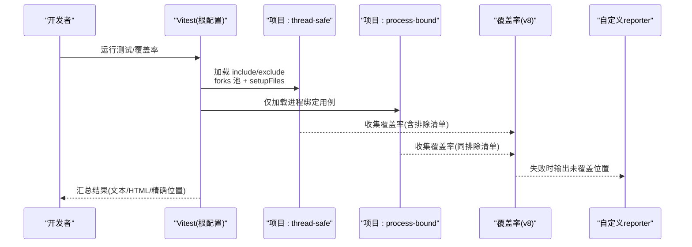
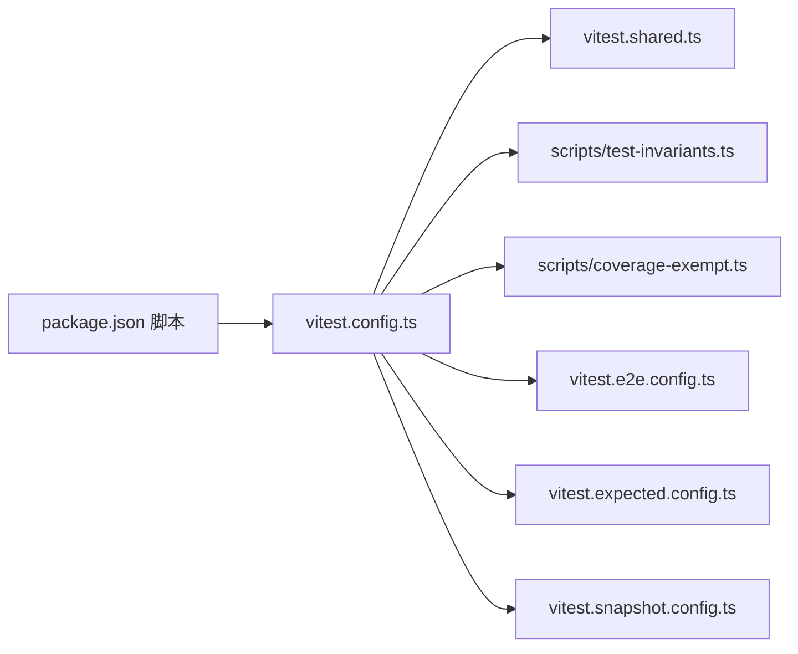

# 单元测试

<cite>
**本文引用的文件**
- [vitest.config.ts](file://vitest.config.ts)
- [vitest.shared.ts](file://vitest.shared.ts)
- [vitest.e2e.config.ts](file://vitest.e2e.config.ts)
- [vitest.expected.config.ts](file://vitest.expected.config.ts)
- [vitest.snapshot.config.ts](file://vitest.snapshot.config.ts)
- [package.json](file://package.json)
- [scripts/test-invariants.ts](file://scripts/test-invariants.ts)
- [scripts/coverage-exempt.ts](file://scripts/coverage-exempt.ts)
- [docs/testing.md](file://docs/testing.md)
- [apps/cli/tests/args.spec.ts](file://apps/cli/tests/args.spec.ts)
- [packages/acp/acp/tests/approval.spec.ts](file://packages/acp/acp/tests/approval.spec.ts)
</cite>

## 目录
1. [简介](#简介)
2. [项目结构](#项目结构)
3. [核心组件](#核心组件)
4. [架构总览](#架构总览)
5. [详细组件分析](#详细组件分析)
6. [依赖关系分析](#依赖关系分析)
7. [性能考虑](#性能考虑)
8. [故障排查指南](#故障排查指南)
9. [结论](#结论)
10. [附录](#附录)

## 简介
本文件面向 DeepSeek Harness 的单元测试体系，聚焦 Vitest 测试框架在本仓库中的配置与使用方式，涵盖：
- 测试环境设置、Mock 对象创建与断言库使用
- 线程安全测试与进程绑定测试的分离策略
- 平台特定的测试排除规则
- 异步测试处理、错误测试与性能测试的最佳实践
- 覆盖率要求（100% 阈值）与覆盖率报告生成
- 为不同包类型编写单元测试的具体示例与路径指引

## 项目结构
仓库采用多工作区组织，测试集中在各包的 tests 目录以及 scripts 下的 spec 文件。根级 vitest 配置通过“多项目”模式同时运行两类用例：
- 线程安全测试（默认聚合）
- 进程绑定测试（独立项目）

图表来源
- [vitest.config.ts:112-191](file://vitest.config.ts#L112-L191)
- [vitest.config.ts:192-362](file://vitest.config.ts#L192-L362)

章节来源
- [vitest.config.ts:112-191](file://vitest.config.ts#L112-L191)
- [vitest.config.ts:192-362](file://vitest.config.ts#L192-L362)

## 核心组件
- 共享插件与环境参数
  - 标准装饰器预转换插件，确保 TypeScript 装饰器在 Vite 解析前被正确转译
  - 统一注入 --no-webstorage 以隔离 jsdom 存储与 Node Web Storage
- 多项目测试编排
  - thread-safe：通用线程安全用例，使用 forks 池避免 worker 线程问题
  - process-bound：进程全局状态、进程 API、时序敏感 I/O 的用例单独运行
- 平台特定排除
  - Windows 下排除 Bash/终端/子进程等 POSIX 相关套件
  - 非 Linux 下排除固定 Linux Worker 行为对比套件
- 覆盖率门控
  - 使用 v8 提供程序，按文件 100% 阈值（语句、分支、函数、行）
  - 自定义 reporter 输出未覆盖位置（行:列+类别），便于定位
  - 重型套件可豁免并并行运行，不污染覆盖率数据

章节来源
- [vitest.shared.ts:1-43](file://vitest.shared.ts#L1-L43)
- [vitest.config.ts:22-110](file://vitest.config.ts#L22-L110)
- [vitest.config.ts:135-191](file://vitest.config.ts#L135-L191)
- [vitest.config.ts:192-362](file://vitest.config.ts#L192-L362)

## 架构总览
下图展示 Vitest 在多项目模式下的执行流程、覆盖率采集与平台/进程边界控制。

图表来源
- [vitest.config.ts:149-191](file://vitest.config.ts#L149-L191)
- [vitest.config.ts:192-362](file://vitest.config.ts#L192-L362)

## 详细组件分析

### 测试环境与初始化
- 统一入口：所有项目共用 setupFiles 注入测试不变量宿主，自动挂载各包 invariant 伴生服务，保证测试期服务拓扑一致
- 装饰器支持：通过 pre 阶段插件将装饰器语法转译为 ESNext，并清理 source map 尾注，避免干扰覆盖率
- 环境变量：
  - 关闭 webstorage 以避免 jsdom 与 Node 原生存储冲突
  - 重型套件豁免开关与分区模式开关用于 CI 分片与性能优化

章节来源
- [vitest.config.ts:149-191](file://vitest.config.ts#L149-L191)
- [vitest.shared.ts:1-43](file://vitest.shared.ts#L1-L43)
- [scripts/test-invariants.ts:1-275](file://scripts/test-invariants.ts#L1-L275)

### 线程安全测试与进程绑定测试分离
- 分离原因：部分用例涉及进程全局状态、进程 API、时序敏感 I/O，无法在 worker 线程中稳定隔离
- 实现方式：
  - thread-safe 项目：排除进程绑定用例列表，其余用例在此运行
  - process-bound 项目：仅包含进程绑定用例，确保其独占进程上下文
- 收益：提高稳定性、减少跨进程副作用导致的偶发失败

章节来源
- [vitest.config.ts:135-191](file://vitest.config.ts#L135-L191)

### 平台特定测试排除规则
- Windows 不支持：Bash、终端 bash、hooks、sandbox-local、子进程相关套件
- 非 Linux 不支持：WebWorker 运行时中固定 Linux 行为的对比套件
- 覆盖率排除：Windows-only 源码、pwsh 缺失时的豁免、runner 入口仅在子进程执行的场景

章节来源
- [vitest.config.ts:22-110](file://vitest.config.ts#L22-L110)
- [vitest.config.ts:339-343](file://vitest.config.ts#L339-L343)

### Mock 对象创建与断言库使用
- 断言库：Vitest 内置 expect/it/describe
- Mock 能力：vi.spyOn/vi.mock 可用于拦截 process.exit、stdout/stderr 等系统调用
- 最佳实践：
  - 在 afterEach 中恢复所有 mock，避免污染后续用例
  - 对副作用强的模块进行最小化 mock，尽量保留真实下游逻辑

章节来源
- [apps/cli/tests/args.spec.ts:1-107](file://apps/cli/tests/args.spec.ts#L1-L107)

### 异步测试、错误测试与性能测试
- 异步测试：使用 async/await 配合 Vitest 的 Promise 感知；长耗时 e2e 配置了超时与重试
- 错误测试：显式断言拒绝路径、异常传播与资源释放（如权限请求失败、未知选项、取消）
- 性能测试：
  - 快照回放模式支持并发控制，重放模式下可并行执行，记录/刷新串行写回
  - 重型套件可豁免覆盖率并在并行门中运行，缩短 CI 时间

章节来源
- [vitest.e2e.config.ts:31-62](file://vitest.e2e.config.ts#L31-L62)
- [vitest.snapshot.config.ts:39-67](file://vitest.snapshot.config.ts#L39-L67)
- [packages/acp/acp/tests/approval.spec.ts:1-87](file://packages/acp/acp/tests/approval.spec.ts#L1-L87)

### 覆盖率要求与报告生成
- 覆盖率目标：每文件 100%（语句、分支、函数、行）
- 覆盖范围：packages/*/*/src/**/*.{ts,tsx}
- 排除策略：类型定义、bin/worker 入口、客户端 UI 债务、实验性运行时、平台专属代码等
- 报告输出：
  - CI：text + 自定义 reporter（精确到行:列+类别）
  - 本地：text + html + 自定义 reporter
- 重型套件豁免：通过集中清单管理 filter/exclude，确保不影响最终阈值判定

章节来源
- [vitest.config.ts:192-362](file://vitest.config.ts#L192-L362)
- [scripts/coverage-exempt.ts:1-60](file://scripts/coverage-exempt.ts#L1-L60)

### 不同包类型的单元测试示例
- CLI 应用包
  - 示例：命令行参数解析与路由
  - 要点：mock 进程退出与输出流，验证错误码与帮助信息
  - 参考路径：[apps/cli/tests/args.spec.ts:1-107](file://apps/cli/tests/args.spec.ts#L1-L107)
- ACP/协议桥接包
  - 示例：机器权限策略映射、取消与未知选择处理、对外代理行为
  - 要点：基于 harness 装配会话与审批服务，断言协议事件与返回码
  - 参考路径：[packages/acp/acp/tests/approval.spec.ts:1-87](file://packages/acp/acp/tests/approval.spec.ts#L1-L87)
- 脚本工具包
  - 示例：安装钩子、翻译配对合并等脚本的契约测试
  - 要点：作为脚本 spec 纳入统一发现与覆盖率统计
  - 参考路径：见根配置 include 规则

章节来源
- [apps/cli/tests/args.spec.ts:1-107](file://apps/cli/tests/args.spec.ts#L1-L107)
- [packages/acp/acp/tests/approval.spec.ts:1-87](file://packages/acp/acp/tests/approval.spec.ts#L1-L87)
- [vitest.config.ts:112-116](file://vitest.config.ts#L112-L116)

## 依赖关系分析
- 配置层
  - vitest.config.ts 聚合多项目、覆盖率与平台排除
  - vitest.shared.ts 提供装饰器插件与 execArgv
  - 其他配置文件分别负责 e2e、expected、snapshot 等不同测试层级
- 运行时层
  - test-invariants.ts 自动挂载各包 invariant 伴生服务，保障测试期一致性
  - coverage-exempt.ts 维护重型套件豁免清单，与覆盖率门联动
- 命令层
  - package.json 暴露 test/test:coverage/test:e2e/test:snapshot 等脚本

图表来源
- [package.json:19-67](file://package.json#L19-L67)
- [vitest.config.ts:149-191](file://vitest.config.ts#L149-L191)
- [vitest.shared.ts:1-43](file://vitest.shared.ts#L1-L43)
- [scripts/test-invariants.ts:1-275](file://scripts/test-invariants.ts#L1-L275)
- [scripts/coverage-exempt.ts:1-60](file://scripts/coverage-exempt.ts#L1-L60)
- [vitest.e2e.config.ts:31-62](file://vitest.e2e.config.ts#L31-L62)
- [vitest.expected.config.ts:7-19](file://vitest.expected.config.ts#L7-L19)
- [vitest.snapshot.config.ts:39-67](file://vitest.snapshot.config.ts#L39-L67)

章节来源
- [package.json:19-67](file://package.json#L19-L67)
- [vitest.config.ts:149-191](file://vitest.config.ts#L149-L191)
- [vitest.shared.ts:1-43](file://vitest.shared.ts#L1-L43)
- [scripts/test-invariants.ts:1-275](file://scripts/test-invariants.ts#L1-L275)
- [scripts/coverage-exempt.ts:1-60](file://scripts/coverage-exempt.ts#L1-L60)
- [vitest.e2e.config.ts:31-62](file://vitest.e2e.config.ts#L31-L62)
- [vitest.expected.config.ts:7-19](file://vitest.expected.config.ts#L7-L19)
- [vitest.snapshot.config.ts:39-67](file://vitest.snapshot.config.ts#L39-L67)

## 性能考虑
- 使用 forks 池避免 worker 线程在 Node 24 上的已知崩溃路径
- 重型套件豁免并并行运行，降低覆盖率采集带来的编译/子进程开销
- 快照重放模式支持并发控制，记录/刷新保持串行以避免竞争写
- 合理设置超时与重试，平衡稳定性与吞吐

章节来源
- [vitest.config.ts:162-191](file://vitest.config.ts#L162-L191)
- [vitest.snapshot.config.ts:54-67](file://vitest.snapshot.config.ts#L54-L67)
- [vitest.e2e.config.ts:50-62](file://vitest.e2e.config.ts#L50-L62)

## 故障排查指南
- 覆盖率失败
  - 查看 text 与 HTML 报告，结合自定义 reporter 输出的“行:列+类别”快速定位
  - 确认是否命中平台/实验性/客户端 UI 等排除项
- 平台相关失败
  - Windows 上 Bash/终端/子进程相关套件会被排除；如需验证，请在对应平台运行
  - 非 Linux 上 WebWorker 固定行为对比套件会跳过
- 进程绑定失败
  - 检查是否在 process-bound 项目中运行；避免在 thread-safe 项目中引入进程全局状态
- 装饰器或解析问题
  - 确认已通过标准装饰器插件预处理；必要时检查 tsconfig.base.json paths 映射

章节来源
- [vitest.config.ts:22-110](file://vitest.config.ts#L22-L110)
- [vitest.config.ts:192-362](file://vitest.config.ts#L192-L362)
- [vitest.shared.ts:11-43](file://vitest.shared.ts#L11-L43)

## 结论
本仓库通过 Vitest 的多项目编排、严格的覆盖率门控与平台/进程边界控制，构建了稳定且高效的测试体系。遵循本文的实践建议，可以为不同包类型编写高质量的单元测试，并确保在 CI 中持续获得高可信度的质量信号。

## 附录
- 测试分层与策略说明参见文档：[docs/testing.md](file://docs/testing.md)
- 常用脚本命令参见：[package.json](file://package.json)

章节来源
- [docs/testing.md:1-51](file://docs/testing.md#L1-L51)
- [package.json:19-67](file://package.json#L19-L67)