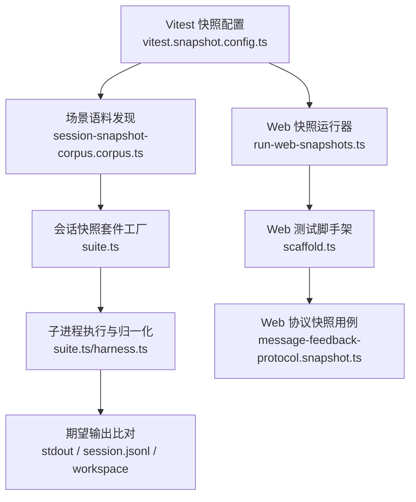
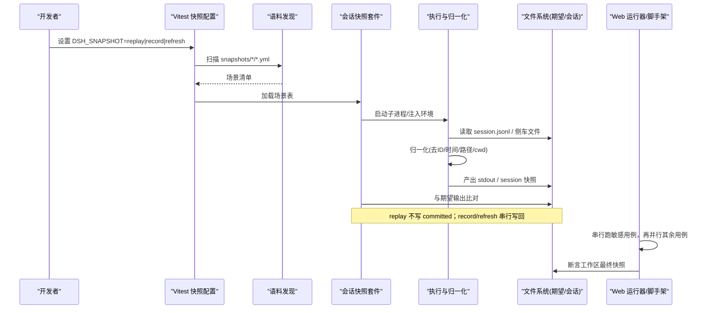
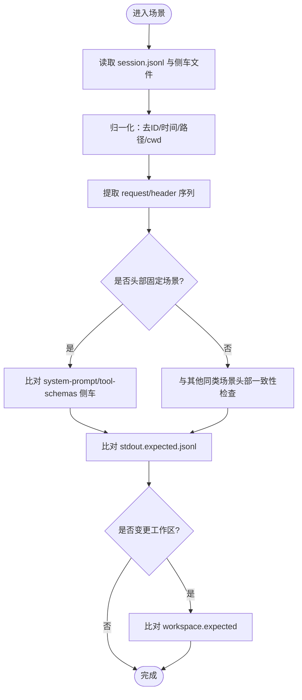
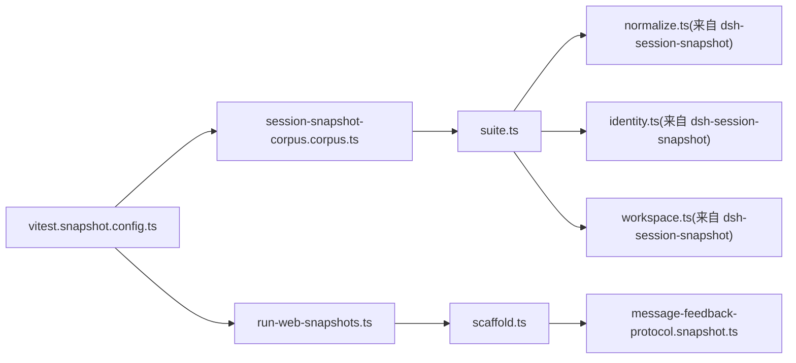

# 快照测试

<cite>
**本文引用的文件**
- [AGENTS.md](file://snapshots/AGENTS.md)
- [vitest.snapshot.config.ts](file://vitest.snapshot.config.ts)
- [session-snapshot-corpus.corpus.ts](file://scripts/session-snapshot-corpus.corpus.ts)
- [suite.ts](file://packages/test-support/session-snapshot/src/suite.ts)
- [snapshot.ts（客户端运行时）](file://packages/test-support/client-runtime/src/snapshot.ts)
- [run-web-snapshots.ts](file://scripts/run-web-snapshots.ts)
- [scaffold.ts（Web 测试脚手架）](file://apps/web/tests/scaffold.ts)
- [message-feedback-protocol.snapshot.ts](file://apps/web/tests/message-feedback-protocol.snapshot.ts)
- [snapshot.yml（示例场景清单）](file://snapshots/web/fresh-round-trip/snapshot.yml)
</cite>

## 目录
1. [简介](#简介)
2. [项目结构](#项目结构)
3. [核心组件](#核心组件)
4. [架构总览](#架构总览)
5. [详细组件分析](#详细组件分析)
6. [依赖关系分析](#依赖关系分析)
7. [性能考量](#性能考量)
8. [故障排查指南](#故障排查指南)
9. [结论](#结论)
10. [附录](#附录)

## 简介
本文件面向 DeepSeek Harness 的“快照测试”体系，系统性说明其概念、应用场景与工程实践。仓库中的快照测试覆盖三类关键对象：
- UI 组件快照：对 Web 界面渲染结果进行稳定化断言，屏蔽 CSS 模块哈希与 SVG 内部细节等噪声。
- 会话输出快照：以 JSONL 形式记录并回放会话事件流，比较标准化后的 stdout、协议消息与工作区产物。
- 工具响应快照：对工具调用与系统提示词、工具模式等请求头进行规范化比对，确保接口契约稳定。

快照测试通过“重放已提交会话 + 对比期望输出”的方式，将易变值（如 ID、时间戳、路径）替换为类型化占位符或指纹，从而获得可重复、可审查的稳定基线。

## 项目结构
快照测试在仓库中按“场景驱动”的组织方式管理：
- 每个场景一个目录，包含会话输入、期望输出与可选的工作区期望产物。
- 统一的清单 manifest（snapshot.yml）声明场景元数据、配置组合与头部固定策略。
- 统一入口由 Vitest 配置与脚本编排，支持 replay/record/refresh 三种模式。

图表来源
- [vitest.snapshot.config.ts:39-67](file://vitest.snapshot.config.ts#L39-L67)
- [session-snapshot-corpus.corpus.ts:41-71](file://scripts/session-snapshot-corpus.corpus.ts#L41-L71)
- [suite.ts:1-18](file://packages/test-support/session-snapshot/src/suite.ts#L1-L18)
- [run-web-snapshots.ts:1-45](file://scripts/run-web-snapshots.ts#L1-L45)
- [scaffold.ts:104-128](file://apps/web/tests/scaffold.ts#L104-L128)
- [message-feedback-protocol.snapshot.ts:52-118](file://apps/web/tests/message-feedback-protocol.snapshot.ts#L52-L118)

章节来源
- [AGENTS.md:1-16](file://snapshots/AGENTS.md#L1-L16)
- [vitest.snapshot.config.ts:39-67](file://vitest.snapshot.config.ts#L39-L67)
- [session-snapshot-corpus.corpus.ts:41-71](file://scripts/session-snapshot-corpus.corpus.ts#L41-L71)

## 核心组件
- 快照套件工厂（suite.ts）：定义 Scenario 表、头部固定策略、侧车文件（system-prompt.expected.md、tool-schemas.expected.json）、平台差异处理、会话日志归一化与刷新写入策略。
- 语料发现（session-snapshot-corpus.corpus.ts）：扫描 snapshots 下各 profile 的场景目录，校验 snapshot.yml 必填字段，维护命名约定与所有权约束。
- 客户端 DOM 快照序列化（client-runtime snapshot.ts）：注册自定义序列化器，折叠 CSS 模块类名、用指纹替代 SVG 内容，保证 .snap 文件稳定。
- Web 快照运行器（run-web-snapshots.ts）：串行执行敏感用例，再并行执行其余用例，控制并发度与退出码。
- Web 测试脚手架（scaffold.ts）：解析 DSH_SNAPSHOT 模式、断言工作区最终快照。
- Web 协议快照用例（message-feedback-protocol.snapshot.ts）：通过宿主 API 发起一系列交互，收集协议交换并生成期望输出。

章节来源
- [suite.ts:70-191](file://packages/test-support/session-snapshot/src/suite.ts#L70-L191)
- [session-snapshot-corpus.corpus.ts:41-71](file://scripts/session-snapshot-corpus.corpus.ts#L41-L71)
- [snapshot.ts（客户端运行时）:1-90](file://packages/test-support/client-runtime/src/snapshot.ts#L1-L90)
- [run-web-snapshots.ts:1-45](file://scripts/run-web-snapshots.ts#L1-L45)
- [scaffold.ts:104-128](file://apps/web/tests/scaffold.ts#L104-L128)
- [message-feedback-protocol.snapshot.ts:52-118](file://apps/web/tests/message-feedback-protocol.snapshot.ts#L52-L118)

## 架构总览
快照测试围绕“重放—归一化—比对”的主循环构建，同时提供 record/refresh 两种更新通道。

图表来源
- [vitest.snapshot.config.ts:24-67](file://vitest.snapshot.config.ts#L24-L67)
- [session-snapshot-corpus.corpus.ts:41-71](file://scripts/session-snapshot-corpus.corpus.ts#L41-L71)
- [suite.ts:239-268](file://packages/test-support/session-snapshot/src/suite.ts#L239-L268)
- [run-web-snapshots.ts:1-45](file://scripts/run-web-snapshots.ts#L1-L45)
- [scaffold.ts:104-128](file://apps/web/tests/scaffold.ts#L104-L128)

## 详细组件分析

### 会话快照套件（suite.ts）
- 场景描述：Scenario 定义了是否记录、是否比较日志、是否固定头部、是否跨平台跳过等。
- 头部固定：通过 pinsHeader 指定唯一“头部固定”场景，其 system-prompt 与 tool-schemas 作为侧车文件被其他成员复用与校验。
- 归一化与刷新：使用 fixtureContext、normalizedHeaders、stabilizeFixtureMessageIds、refreshFixtureReplacements 等工具，确保不同运行环境的等价性。
- 共享快照声明：claimSharedSnapshot 防止多场景对同一共享文件产生冲突内容。

图表来源
- [suite.ts:70-191](file://packages/test-support/session-snapshot/src/suite.ts#L70-L191)
- [suite.ts:239-268](file://packages/test-support/session-snapshot/src/suite.ts#L239-L268)
- [suite.ts:338-356](file://packages/test-support/session-snapshot/src/suite.ts#L338-L356)
- [suite.ts:440-468](file://packages/test-support/session-snapshot/src/suite.ts#L440-L468)
- [suite.ts:533-555](file://packages/test-support/session-snapshot/src/suite.ts#L533-L555)
- [suite.ts:725-728](file://packages/test-support/session-snapshot/src/suite.ts#L725-L728)
- [suite.ts:782-800](file://packages/test-support/session-snapshot/src/suite.ts#L782-L800)

章节来源
- [suite.ts:70-191](file://packages/test-support/session-snapshot/src/suite.ts#L70-L191)
- [suite.ts:239-268](file://packages/test-support/session-snapshot/src/suite.ts#L239-L268)
- [suite.ts:338-356](file://packages/test-support/session-snapshot/src/suite.ts#L338-L356)
- [suite.ts:440-468](file://packages/test-support/session-snapshot/src/suite.ts#L440-L468)
- [suite.ts:533-555](file://packages/test-support/session-snapshot/src/suite.ts#L533-L555)
- [suite.ts:725-728](file://packages/test-support/session-snapshot/src/suite.ts#L725-L728)
- [suite.ts:782-800](file://packages/test-support/session-snapshot/src/suite.ts#L782-L800)

### 语料发现与所有权约束（session-snapshot-corpus.corpus.ts）
- 强制每个场景存在 snapshot.yml，并校验 scenario/profile/composition/recording/header 等字段。
- 限制 .snapshot.ts 后缀仅用于“已录制会话适配器”，避免滥用。
- 校验 session.jsonl 的存在性与引用关系，确保无环引用与唯一所有者。
- 校验工作区期望产物与空标记的一致性。

章节来源
- [session-snapshot-corpus.corpus.ts:41-71](file://scripts/session-snapshot-corpus.corpus.ts#L41-L71)
- [session-snapshot-corpus.corpus.ts:77-97](file://scripts/session-snapshot-corpus.corpus.ts#L77-L97)
- [session-snapshot-corpus.corpus.ts:99-181](file://scripts/session-snapshot-corpus.corpus.ts#L99-L181)

### Web 快照运行器（run-web-snapshots.ts）
- 先串行执行少数敏感用例，再并行执行其余用例，通过环境变量控制并发。
- 失败时立即中止后续流程，保证 CI 稳定性。

章节来源
- [run-web-snapshots.ts:1-45](file://scripts/run-web-snapshots.ts#L1-L45)

### Web 测试脚手架（scaffold.ts）
- webSnapshotMode：解析 DSH_SNAPSHOT，限定合法取值。
- assertFinalWorkspaceSnapshot：当场景声明 workspace.final=true 时，捕获并比对完整工作区快照。

章节来源
- [scaffold.ts:104-128](file://apps/web/tests/scaffold.ts#L104-L128)

### Web 协议快照用例（message-feedback-protocol.snapshot.ts）
- 通过宿主 API 发起 list/put/conflict/delete 等操作，收集协议交换。
- 对版本、时间戳、消息 ID 做最小化归一化后，与 protocol.expected.json 比对。
- 使用 compareOrRefreshGolden 与 assertFixtureInventory 管理期望与夹具清单。

章节来源
- [message-feedback-protocol.snapshot.ts:52-118](file://apps/web/tests/message-feedback-protocol.snapshot.ts#L52-L118)

### DOM 快照序列化（client-runtime snapshot.ts）
- 折叠 CSS 模块类名，保留语义类名。
- 将 SVG 内部节点替换为 data-content 指纹，避免图形细节导致抖动。
- 通过 registerDomSnapshotSerializer 注册到 expect，供所有 DOM 快照使用。

章节来源
- [snapshot.ts（客户端运行时）:1-90](file://packages/test-support/client-runtime/src/snapshot.ts#L1-L90)

## 依赖关系分析
- Vitest 快照配置负责启用插件、设置超时、选择 include 路径，并在 replay 模式下启用文件级并行与最大并发。
- 语料发现依赖 @deepseek-ai/dsh-session-snapshot 提供的解析与归一化工具。
- 套件工厂依赖 normalize、identity、workspace 等模块，形成“读取—归一化—比对”的强内聚链路。
- Web 层通过 run-web-snapshots 与 scaffold 协同，确保浏览器端行为稳定且可回放。

图表来源
- [vitest.snapshot.config.ts:39-67](file://vitest.snapshot.config.ts#L39-L67)
- [session-snapshot-corpus.corpus.ts:41-71](file://scripts/session-snapshot-corpus.corpus.ts#L41-L71)
- [suite.ts:239-268](file://packages/test-support/session-snapshot/src/suite.ts#L239-L268)
- [run-web-snapshots.ts:1-45](file://scripts/run-web-snapshots.ts#L1-L45)
- [scaffold.ts:104-128](file://apps/web/tests/scaffold.ts#L104-L128)
- [message-feedback-protocol.snapshot.ts:52-118](file://apps/web/tests/message-feedback-protocol.snapshot.ts#L52-L118)

章节来源
- [vitest.snapshot.config.ts:39-67](file://vitest.snapshot.config.ts#L39-L67)
- [session-snapshot-corpus.corpus.ts:41-71](file://scripts/session-snapshot-corpus.corpus.ts#L41-L71)
- [suite.ts:239-268](file://packages/test-support/session-snapshot/src/suite.ts#L239-L268)
- [run-web-snapshots.ts:1-45](file://scripts/run-web-snapshots.ts#L1-L45)
- [scaffold.ts:104-128](file://apps/web/tests/scaffold.ts#L104-L128)
- [message-feedback-protocol.snapshot.ts:52-118](file://apps/web/tests/message-feedback-protocol.snapshot.ts#L52-L118)

## 性能考量
- 并发控制：replay 模式默认启用文件级并行与 maxConcurrency，可通过 DSH_SNAPSHOT_MAX_CONCURRENCY 调整；record/refresh 保持串行以避免竞争写。
- 浏览器用例：敏感用例串行执行，其余用例并行，平衡稳定性与速度。
- 超时设置：测试与钩子超时分别设定，避免长耗时阻塞整体流水线。
- 归一化成本：仅在必要时克隆与归一化 DOM，减少额外开销。

章节来源
- [vitest.snapshot.config.ts:6-22](file://vitest.snapshot.config.ts#L6-L22)
- [vitest.snapshot.config.ts:54-67](file://vitest.snapshot.config.ts#L54-L67)
- [run-web-snapshots.ts:1-45](file://scripts/run-web-snapshots.ts#L1-L45)
- [snapshot.ts（客户端运行时）:54-76](file://packages/test-support/client-runtime/src/snapshot.ts#L54-L76)

## 故障排查指南
- 场景清单缺失或字段非法：检查 snapshots/*/scenario/snapshot.yml 是否存在且包含必需字段。
- 会话夹具命名不规范：确保主夹具为 session.jsonl，子夹具为 session.1.jsonl … 连续编号。
- 头部固定冲突：每个 composition/header class 只能有一个 pinsHeader=true 的场景；侧车文件需与源一致。
- 工作区期望不一致：若场景声明 workspace.final=true，需提交完整 workspace.expected 或使用 .empty 标记空结果。
- Web 模式错误：DSH_SNAPSHOT 必须为 replay/record/refresh 之一。
- 并发异常：确认 DSH_WEB_SNAPSHOT_WORKERS 为大于 1 的整数；否则抛出错误。

章节来源
- [session-snapshot-corpus.corpus.ts:41-71](file://scripts/session-snapshot-corpus.corpus.ts#L41-L71)
- [suite.ts:338-356](file://packages/test-support/session-snapshot/src/suite.ts#L338-L356)
- [suite.ts:145-161](file://packages/test-support/session-snapshot/src/suite.ts#L145-L161)
- [AGENTS.md:13-16](file://snapshots/AGENTS.md#L13-L16)
- [scaffold.ts:104-113](file://apps/web/tests/scaffold.ts#L104-L113)
- [run-web-snapshots.ts:9-13](file://scripts/run-web-snapshots.ts#L9-L13)

## 结论
DeepSeek Harness 的快照测试通过严格的场景组织、头部固定与侧车文件机制，结合会话与 Web 双通道的重放与比对，提供了高稳定性的回归保障。配合合理的并发策略与归一化手段，既能快速反馈问题，又能确保提交的期望输出具备可读性与可维护性。

## 附录

### 快照文件组织结构与管理策略
- 目录层级：按 profile（acp/sdk/session/web）+ 场景名组织，每个场景包含 session.jsonl 与期望输出。
- 清单文件：snapshot.yml 声明 scenario/profile/composition/recording/header 等元数据。
- 侧车文件：system-prompt.expected.md 与 tool-schemas.expected.json 独立于会话日志，便于人类审阅。
- 工作区产物：若场景变更工作区，提交 workspace.expected 并使用 .empty 表示空结果。
- 所有权规则：每个 header class 仅一个 pinsHeader 场景拥有侧车；其他成员通过一致性检查复用。

章节来源
- [AGENTS.md:1-16](file://snapshots/AGENTS.md#L1-L16)
- [session-snapshot-corpus.corpus.ts:99-181](file://scripts/session-snapshot-corpus.corpus.ts#L99-L181)
- [suite.ts:43-57](file://packages/test-support/session-snapshot/src/suite.ts#L43-L57)
- [suite.ts:533-555](file://packages/test-support/session-snapshot/src/suite.ts#L533-L555)

### 创建、更新与验证快照
- 创建：编写场景目录与 snapshot.yml，准备 session.jsonl 与必要侧车；在 replay 模式下运行以生成期望输出。
- 更新：使用 record 模式从真实 API 重新录制受控场景；使用 refresh 模式基于已提交脚本重写 stdout 与可比会话夹具。
- 验证：commit 前逐项审查 JSONL、提示词、模式、协议与 UI 差异；确保无未声明的写入。

章节来源
- [vitest.snapshot.config.ts:24-37](file://vitest.snapshot.config.ts#L24-L37)
- [suite.ts:239-268](file://packages/test-support/session-snapshot/src/suite.ts#L239-L268)
- [AGENTS.md:13-16](file://snapshots/AGENTS.md#L13-L16)

### 最佳实践
- 命名规范：仅允许 .snapshot.ts 后缀用于“已录制会话适配器”；场景目录与清单保持一致。
- 版本控制：侧车文件与 session.jsonl 共同构成不可变基线；任何变更需人工审查。
- 差异分析：优先关注头部变化、工具模式与协议字段；忽略时间戳、ID 与路径等易变值。
- 并发与环境：合理设置 DSH_SNAPSHOT_MAX_CONCURRENCY 与 DSH_WEB_SNAPSHOT_WORKERS；CI 中固定构建产物。

章节来源
- [session-snapshot-corpus.corpus.ts:77-97](file://scripts/session-snapshot-corpus.corpus.ts#L77-L97)
- [vitest.snapshot.config.ts:6-22](file://vitest.snapshot.config.ts#L6-L22)
- [run-web-snapshots.ts:9-13](file://scripts/run-web-snapshots.ts#L9-L13)

### 具体示例
- Web 界面快照：通过 DOM 序列化器折叠类名与 SVG 内容，确保 .snap 文件稳定。
- CLI/会话输出快照：以 stdout.expected.jsonl 与 session.jsonl 为核心，比较标准化后的输出。
- API 响应快照：在 message-feedback-protocol 用例中，收集 list/put/conflict/delete 的协议交换，归一化后与 protocol.expected.json 比对。

章节来源
- [snapshot.ts（客户端运行时）:1-90](file://packages/test-support/client-runtime/src/snapshot.ts#L1-L90)
- [suite.ts:440-468](file://packages/test-support/session-snapshot/src/suite.ts#L440-L468)
- [message-feedback-protocol.snapshot.ts:52-118](file://apps/web/tests/message-feedback-protocol.snapshot.ts#L52-L118)
- [snapshot.yml（示例场景清单）:1-9](file://snapshots/web/fresh-round-trip/snapshot.yml#L1-L9)