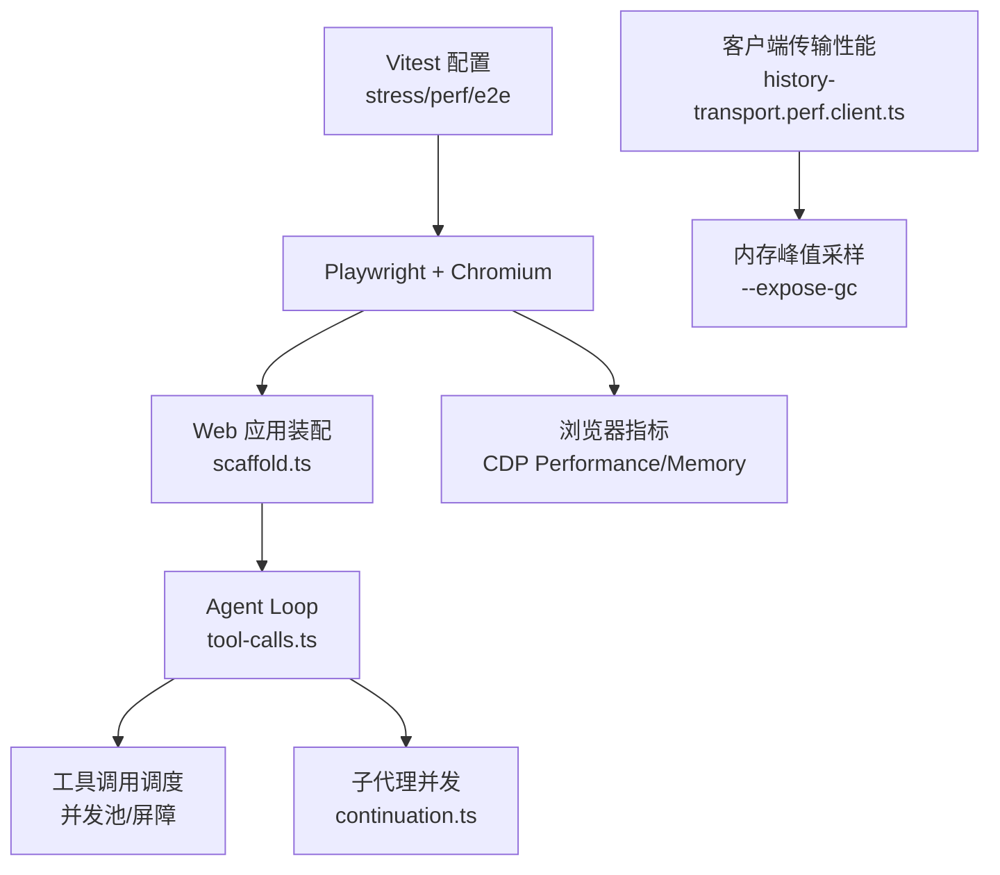
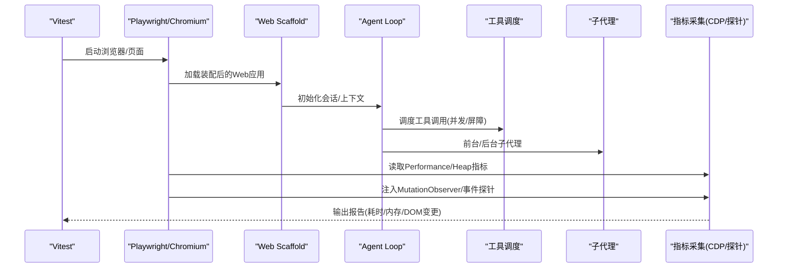
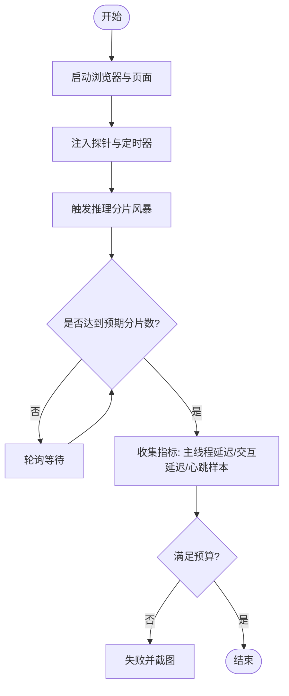
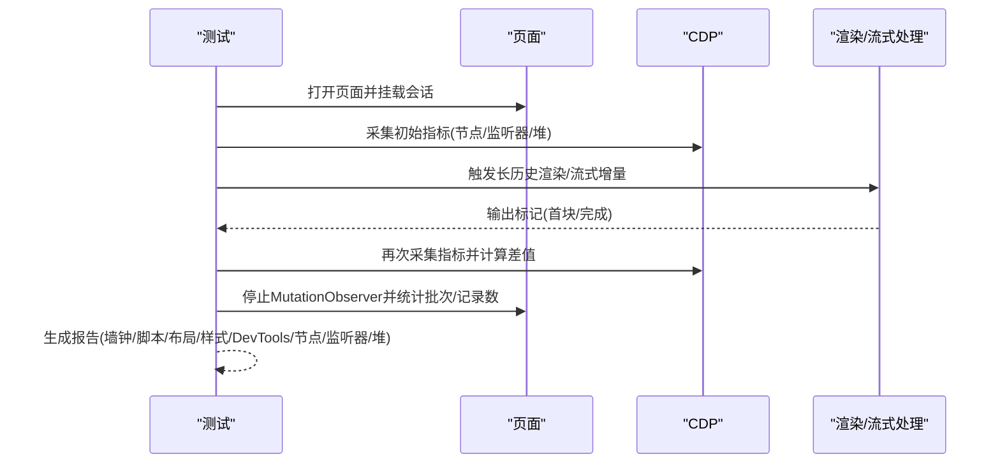
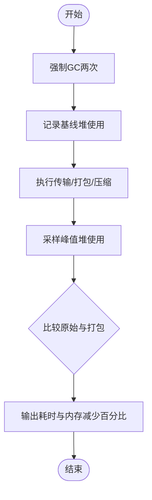
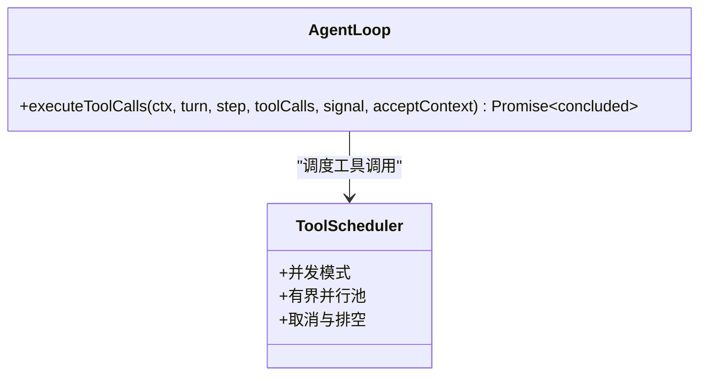
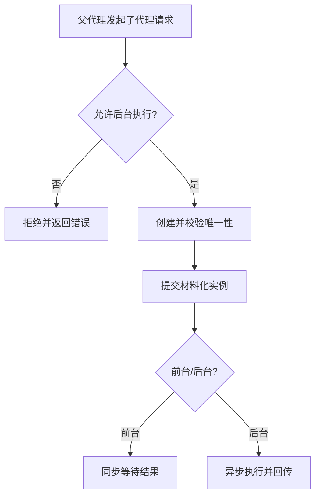
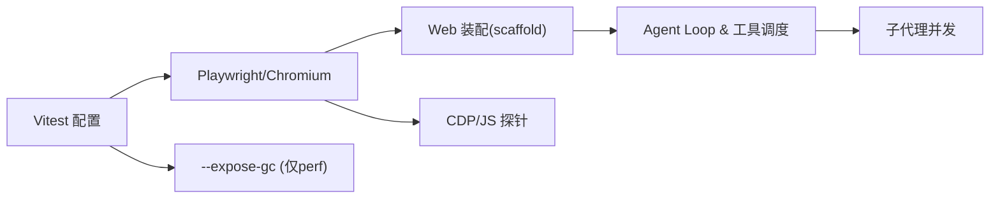

# 性能测试

<cite>
**本文引用的文件**
- [BENCHMARK.md](file://BENCHMARK.md)
- [vitest.web-stress.config.ts](file://vitest.web-stress.config.ts)
- [vitest.web.perf.config.ts](file://vitest.web.perf.config.ts)
- [vitest.web.config.ts](file://vitest.web.config.ts)
- [vitest.shared.ts](file://vitest.shared.ts)
- [apps/web/stress-tests/reasoning-chunks.stress.ts](file://apps/web/stress-tests/reasoning-chunks.stress.ts)
- [apps/web/tests/complex-history.perf.ts](file://apps/web/tests/complex-history.perf.ts)
- [apps/web/tests/scaffold.ts](file://apps/web/tests/scaffold.ts)
- [packages/client/ui-conversation/tests/history-transport.perf.client.ts](file://packages/client/ui-conversation/tests/history-transport.perf.client.ts)
- [packages/core/agent-loop/src/tool-calls.ts](file://packages/core/agent-loop/src/tool-calls.ts)
- [packages/core/agent-loop/README.md](file://packages/core/agent-loop/README.md)
- [packages/subagent/subagent/src/continuation.ts](file://packages/subagent/subagent/src/continuation.ts)
</cite>

## 目录
1. [简介](#简介)
2. [项目结构](#项目结构)
3. [核心组件](#核心组件)
4. [架构总览](#架构总览)
5. [详细组件分析](#详细组件分析)
6. [依赖关系分析](#依赖关系分析)
7. [性能考量](#性能考量)
8. [故障排查指南](#故障排查指南)
9. [结论](#结论)
10. [附录](#附录)

## 简介
本文件面向DeepSeek Harness的性能测试，覆盖负载与并发、长时间运行（浸泡）测试、内存泄漏检测、基准建立与维护，以及回归检测方法。文档基于仓库中现有的Web端压力与性能测试配置与实现，结合智能体循环、工具调用与子代理并发机制，提供可操作的策略与示例路径，帮助团队在CI与本地环境中稳定地评估与保障系统性能。

## 项目结构
仓库为多包Monorepo，性能测试主要位于Web应用层与客户端UI层：
- Web端压力测试：独立Vitest配置与用例，聚焦浏览器主线程响应性与渲染吞吐
- Web端性能测试：高基数会话与历史渲染、流式增量、内存与DOM指标采集
- 客户端传输性能：历史数据打包/压缩与内存峰值测量
- 智能体循环与工具调度：并发控制、取消与结果提交
- 子代理并发：前台/后台执行模式与并发安全

**图示来源**
- [vitest.web-stress.config.ts:1-16](file://vitest.web-stress.config.ts#L1-L16)
- [vitest.web.perf.config.ts:1-22](file://vitest.web.perf.config.ts#L1-L22)
- [apps/web/tests/scaffold.ts:1-200](file://apps/web/tests/scaffold.ts#L1-L200)
- [packages/core/agent-loop/src/tool-calls.ts:40-68](file://packages/core/agent-loop/src/tool-calls.ts#L40-L68)
- [packages/subagent/subagent/src/continuation.ts:447-487](file://packages/subagent/subagent/src/continuation.ts#L447-L487)
- [packages/client/ui-conversation/tests/history-transport.perf.client.ts:240-283](file://packages/client/ui-conversation/tests/history-transport.perf.client.ts#L240-L283)

**章节来源**
- [vitest.web-stress.config.ts:1-16](file://vitest.web-stress.config.ts#L1-L16)
- [vitest.web.perf.config.ts:1-22](file://vitest.web.perf.config.ts#L1-L22)
- [apps/web/tests/scaffold.ts:1-200](file://apps/web/tests/scaffold.ts#L1-L200)

## 核心组件
- 压力测试入口与配置
  - 通过独立的Vitest配置启用浏览器压力测试，关闭文件并行以提升稳定性，并设置较长超时以容纳长时间运行场景
  - 性能测试配置额外启用Node的强制GC能力，用于内存基线对比
- 浏览器侧探针与指标
  - 使用Playwright连接Chromium，通过CDP获取任务时长、脚本时长、布局/样式重算、堆内存等指标
  - 注入MutationObserver与自定义事件，测量用户交互到DOM可见再到绘制的端到端时延
- 智能体循环与工具调度
  - 工具调用按并发模式调度，支持独占屏障与有界并行池；取消时会排空已启动调用并记录合成结果
- 子代理并发
  - 支持前台与后台执行模式，并在并发安全约束下区分执行路径

**章节来源**
- [vitest.web-stress.config.ts:1-16](file://vitest.web-stress.config.ts#L1-L16)
- [vitest.web.perf.config.ts:1-22](file://vitest.web.perf.config.ts#L1-L22)
- [apps/web/tests/complex-history.perf.ts:515-568](file://apps/web/tests/complex-history.perf.ts#L515-L568)
- [packages/core/agent-loop/src/tool-calls.ts:40-68](file://packages/core/agent-loop/src/tool-calls.ts#L40-L68)
- [packages/core/agent-loop/README.md:93-106](file://packages/core/agent-loop/README.md#L93-L106)
- [packages/subagent/subagent/src/continuation.ts:447-487](file://packages/subagent/subagent/src/continuation.ts#L447-L487)

## 架构总览
下图展示了从测试驱动到被测系统的完整链路：Vitest触发Playwright启动真实装配的Web应用，通过scaffold注入会话与回放，Agent Loop负责步骤与工具调度，子代理并发处理后台任务，浏览器侧通过CDP与JS探针采集指标。

**图示来源**
- [vitest.web-stress.config.ts:1-16](file://vitest.web-stress.config.ts#L1-L16)
- [apps/web/tests/scaffold.ts:1-200](file://apps/web/tests/scaffold.ts#L1-L200)
- [packages/core/agent-loop/src/tool-calls.ts:40-68](file://packages/core/agent-loop/src/tool-calls.ts#L40-L68)
- [packages/subagent/subagent/src/continuation.ts:447-487](file://packages/subagent/subagent/src/continuation.ts#L447-L487)
- [apps/web/tests/complex-history.perf.ts:515-568](file://apps/web/tests/complex-history.perf.ts#L515-L568)

## 详细组件分析

### 浏览器压力测试：推理分片风暴
该用例向装配后的应用注入大量推理分片，验证主线程响应性不被阻塞，同时保证交互事件仍可按时处理。

**图示来源**
- [apps/web/stress-tests/reasoning-chunks.stress.ts:1-154](file://apps/web/stress-tests/reasoning-chunks.stress.ts#L1-L154)

**章节来源**
- [apps/web/stress-tests/reasoning-chunks.stress.ts:1-154](file://apps/web/stress-tests/reasoning-chunks.stress.ts#L1-L154)

### 长历史与会话渲染性能
该用例构造大量工作区与长会话，模拟真实使用中的高基数场景，并通过CDP与DOM探针测量渲染与内存变化。

**图示来源**
- [apps/web/tests/complex-history.perf.ts:515-568](file://apps/web/tests/complex-history.perf.ts#L515-L568)
- [apps/web/tests/complex-history.perf.ts:582-617](file://apps/web/tests/complex-history.perf.ts#L582-L617)
- [apps/web/tests/complex-history.perf.ts:619-779](file://apps/web/tests/complex-history.perf.ts#L619-L779)

**章节来源**
- [apps/web/tests/complex-history.perf.ts:37-82](file://apps/web/tests/complex-history.perf.ts#L37-L82)
- [apps/web/tests/complex-history.perf.ts:515-568](file://apps/web/tests/complex-history.perf.ts#L515-L568)
- [apps/web/tests/complex-history.perf.ts:582-617](file://apps/web/tests/complex-history.perf.ts#L582-L617)
- [apps/web/tests/complex-history.perf.ts:619-779](file://apps/web/tests/complex-history.perf.ts#L619-L779)

### 客户端传输性能与内存峰值
针对历史数据传输与打包压缩流程，使用强制GC基线采样内存峰值，比较原始与打包后差异，并记录各阶段耗时。

**图示来源**
- [packages/client/ui-conversation/tests/history-transport.perf.client.ts:240-283](file://packages/client/ui-conversation/tests/history-transport.perf.client.ts#L240-L283)
- [packages/client/ui-conversation/tests/history-transport.perf.client.ts:568-596](file://packages/client/ui-conversation/tests/history-transport.perf.client.ts#L568-L596)

**章节来源**
- [packages/client/ui-conversation/tests/history-transport.perf.client.ts:240-283](file://packages/client/ui-conversation/tests/history-transport.perf.client.ts#L240-L283)
- [packages/client/ui-conversation/tests/history-transport.perf.client.ts:568-596](file://packages/client/ui-conversation/tests/history-transport.perf.client.ts#L568-L596)

### 智能体循环与工具调用并发
工具调用按当前并发模式调度，支持独占屏障与有界并行池；取消时会排空已启动调用并记录合成结果，确保步骤边界一致性。

**图示来源**
- [packages/core/agent-loop/src/tool-calls.ts:40-68](file://packages/core/agent-loop/src/tool-calls.ts#L40-L68)
- [packages/core/agent-loop/README.md:93-106](file://packages/core/agent-loop/README.md#L93-L106)

**章节来源**
- [packages/core/agent-loop/src/tool-calls.ts:40-68](file://packages/core/agent-loop/src/tool-calls.ts#L40-L68)
- [packages/core/agent-loop/README.md:93-106](file://packages/core/agent-loop/README.md#L93-L106)

### 子代理并发与前台/后台模式
子代理在并发安全约束下创建与提交，支持前台与后台执行模式，并在执行期拒绝被禁用的后台请求。

**图示来源**
- [packages/subagent/subagent/src/continuation.ts:447-487](file://packages/subagent/subagent/src/continuation.ts#L447-L487)

**章节来源**
- [packages/subagent/subagent/src/continuation.ts:447-487](file://packages/subagent/subagent/src/continuation.ts#L447-L487)

## 依赖关系分析
- 测试配置依赖
  - stress与perf配置分别包含不同的用例集与运行时参数（如--expose-gc），避免默认测试套件污染
  - web配置启用装饰器预处理与环境变量加载，保证真实装配链路的可测性
- 运行时依赖
  - Playwright与Chromium用于驱动真实浏览器
  - CDP用于获取浏览器性能与内存指标
  - Node进程级GC用于内存峰值采样
- 模块依赖
  - Agent Loop与工具调度、子代理并发共同决定整体吞吐与延迟特性

**图示来源**
- [vitest.web-stress.config.ts:1-16](file://vitest.web-stress.config.ts#L1-L16)
- [vitest.web.perf.config.ts:1-22](file://vitest.web.perf.config.ts#L1-L22)
- [vitest.web.config.ts:1-38](file://vitest.web.config.ts#L1-L38)
- [vitest.shared.ts:1-43](file://vitest.shared.ts#L1-L43)
- [apps/web/tests/scaffold.ts:1-200](file://apps/web/tests/scaffold.ts#L1-L200)

**章节来源**
- [vitest.web-stress.config.ts:1-16](file://vitest.web-stress.config.ts#L1-L16)
- [vitest.web.perf.config.ts:1-22](file://vitest.web.perf.config.ts#L1-L22)
- [vitest.web.config.ts:1-38](file://vitest.web.config.ts#L1-L38)
- [vitest.shared.ts:1-43](file://vitest.shared.ts#L1-L43)
- [apps/web/tests/scaffold.ts:1-200](file://apps/web/tests/scaffold.ts#L1-L200)

## 性能考量
- 负载与并发
  - 通过Agent Loop的工具调用并发池与子代理的前台/后台模式，评估不同并发策略对吞吐与延迟的影响
  - 建议逐步增加并发度，观察CPU与内存曲线，定位瓶颈点
- 长时间运行（浸泡）测试
  - 使用长会话与持续对话场景，周期性采集浏览器指标与DOM状态，检查内存增长与资源释放
  - 建议在CI中作为可选通道运行，避免影响常规流水线速度
- 内存泄漏检测
  - 使用CDP的HeapProfiler与JS探针，结合强制GC基线，比较前后堆使用量与对象数量
  - 关注节点数、监听器数量与堆大小变化趋势
- 基准建立与维护
  - 将关键指标（首包时间、流式首块时间、布局/样式重算耗时、堆使用）纳入报告
  - 维护基线数据集，定期回归比对，异常波动需人工复核
- 回归检测
  - 在PR或发布前自动执行stress与perf用例，阈值告警与失败阻断
  - 结合快照与期望值断言，确保功能正确性与性能稳定性并重

[本节为通用指导，不直接分析具体文件]

## 故障排查指南
- 浏览器无指标
  - 确认已通过CDP启用Performance与HeapProfiler，且页面处于受控环境
  - 检查playwright版本与Chromium兼容性
- 探针未触发
  - 确认MutationObserver目标元素存在且属性过滤匹配
  - 检查自定义事件是否正确派发与监听
- 强制GC不可用
  - 确保perf配置启用--expose-gc，并在Node进程中可用
- 工具调用卡住
  - 检查Agent Loop的取消信号与排空逻辑，确认步骤边界未被阻塞
- 子代理冲突
  - 检查子代理ID唯一性校验与并发安全约束，避免重复创建

**章节来源**
- [apps/web/tests/complex-history.perf.ts:515-568](file://apps/web/tests/complex-history.perf.ts#L515-L568)
- [apps/web/tests/complex-history.perf.ts:582-617](file://apps/web/tests/complex-history.perf.ts#L582-L617)
- [packages/client/ui-conversation/tests/history-transport.perf.client.ts:240-283](file://packages/client/ui-conversation/tests/history-transport.perf.client.ts#L240-L283)
- [packages/core/agent-loop/src/tool-calls.ts:40-68](file://packages/core/agent-loop/src/tool-calls.ts#L40-L68)
- [packages/subagent/subagent/src/continuation.ts:447-487](file://packages/subagent/subagent/src/continuation.ts#L447-L487)

## 结论
本项目提供了完善的Web端压力与性能测试基础设施，涵盖浏览器主线程响应性、长会话渲染、内存与DOM指标采集，以及客户端传输性能与内存峰值测量。结合Agent Loop与子代理并发机制，可在不同负载与并发模式下全面评估系统表现。建议将stress与perf用例纳入CI，建立基线与回归告警，持续优化性能与稳定性。

[本节为总结，不直接分析具体文件]

## 附录
- 快速开始
  - 参考基准说明，安装SDK并运行最小变体，使用独立工作区与会话ID进行独立基准任务
- 运行命令
  - 压力测试：使用stress配置运行，适合长时间运行与可视化剖析
  - 性能测试：使用perf配置运行，启用强制GC，适合内存诊断与高基数场景
  - 常规Web测试：使用web配置运行，包含e2e与快照用例
- 示例路径
  - 推理分片压力：apps/web/stress-tests/reasoning-chunks.stress.ts
  - 长历史渲染：apps/web/tests/complex-history.perf.ts
  - 传输性能：packages/client/ui-conversation/tests/history-transport.perf.client.ts

**章节来源**
- [BENCHMARK.md:1-4](file://BENCHMARK.md#L1-L4)
- [vitest.web-stress.config.ts:1-16](file://vitest.web-stress.config.ts#L1-L16)
- [vitest.web.perf.config.ts:1-22](file://vitest.web.perf.config.ts#L1-L22)
- [vitest.web.config.ts:1-38](file://vitest.web.config.ts#L1-L38)
- [apps/web/stress-tests/reasoning-chunks.stress.ts:1-154](file://apps/web/stress-tests/reasoning-chunks.stress.ts#L1-L154)
- [apps/web/tests/complex-history.perf.ts:37-82](file://apps/web/tests/complex-history.perf.ts#L37-L82)
- [packages/client/ui-conversation/tests/history-transport.perf.client.ts:240-283](file://packages/client/ui-conversation/tests/history-transport.perf.client.ts#L240-L283)