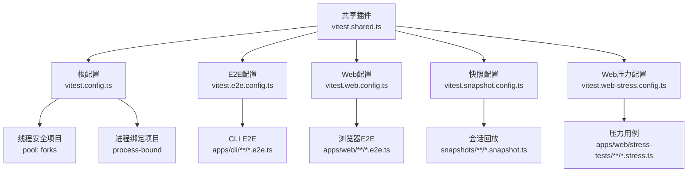
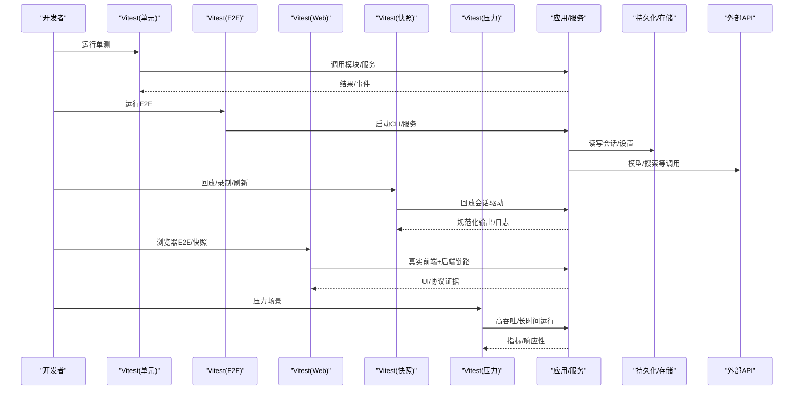
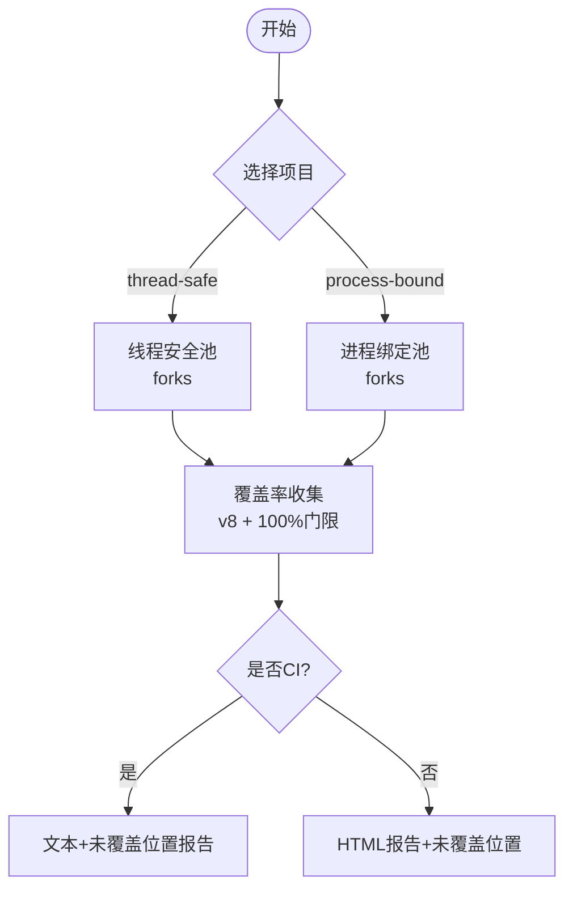
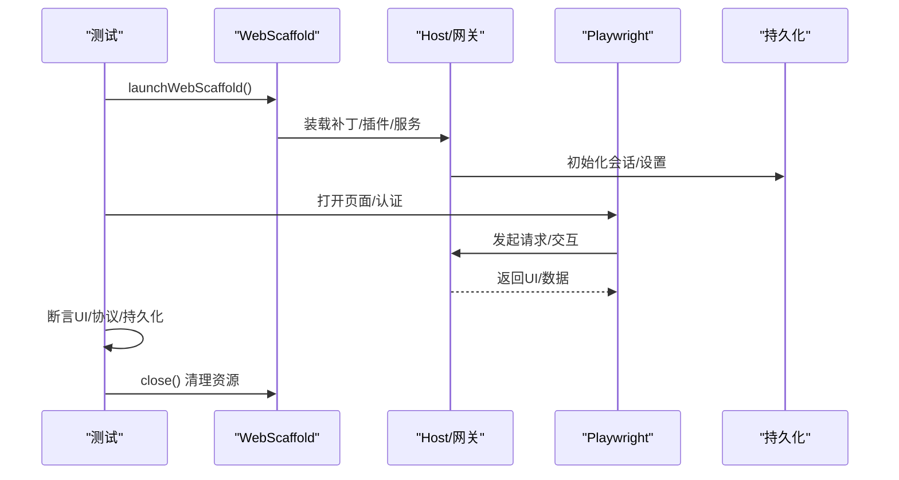
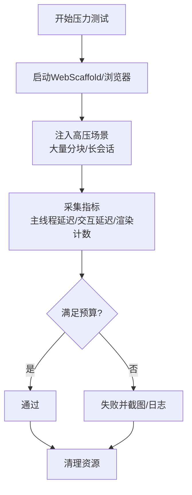
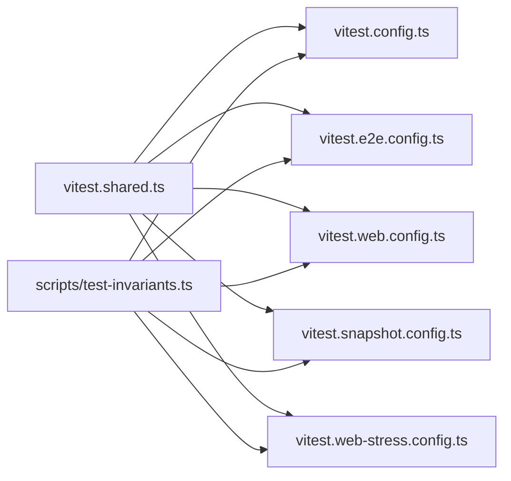

# 测试策略

<cite>
**本文引用的文件**
- [vitest.config.ts](file://vitest.config.ts)
- [vitest.e2e.config.ts](file://vitest.e2e.config.ts)
- [vitest.web.config.ts](file://vitest.web.config.ts)
- [vitest.shared.ts](file://vitest.shared.ts)
- [vitest.snapshot.config.ts](file://vitest.snapshot.config.ts)
- [vitest.web-stress.config.ts](file://vitest.web-stress.config.ts)
- [docs/testing.md](file://docs/testing.md)
- [apps/cli/tests/args.spec.ts](file://apps/cli/tests/args.spec.ts)
- [packages/core/agent-loop/tests/contract-regressions.spec.ts](file://packages/core/agent-loop/tests/contract-regressions.spec.ts)
- [apps/web/tests/scaffold.ts](file://apps/web/tests/scaffold.ts)
- [apps/web/stress-tests/reasoning-chunks.stress.ts](file://apps/web/stress-tests/reasoning-chunks.stress.ts)
- [scripts/test-invariants.ts](file://scripts/test-invariants.ts)
</cite>

## 目录
1. [简介](#简介)
2. [项目结构](#项目结构)
3. [核心组件](#核心组件)
4. [架构总览](#架构总览)
5. [详细组件分析](#详细组件分析)
6. [依赖关系分析](#依赖关系分析)
7. [性能考虑](#性能考虑)
8. [故障排查指南](#故障排查指南)
9. [结论](#结论)
10. [附录](#附录)

## 简介
本测试策略面向 DeepSeek Harness，覆盖单元测试、集成测试、端到端（E2E）测试、快照测试与性能/压力测试，并给出覆盖率门禁与持续集成建议。策略基于仓库中多套 Vitest 配置与测试实践，强调“优先真实实现、最小化 Mock”的原则，并通过分层配置将不同风险与成本的测试隔离执行。

## 项目结构
仓库采用多工程与工作区组织，测试按层级与运行环境拆分：
- 单元测试：根 vitest.config.ts，聚焦 packages 与 scripts 的 .spec.ts，使用 v8 覆盖率门禁（每文件 100%）。
- E2E（带密钥）：vitest.e2e.config.ts，针对 apps/cli 与部分包 e2e 用例，支持重试与并发控制。
- Web 浏览器 E2E：vitest.web.config.ts，运行 apps/web 下的 e2e/snapshot 用例，串行执行以保证稳定性。
- 快照测试：vitest.snapshot.config.ts，以会话回放驱动，支持 replay/record/refresh 模式。
- Web 压力测试：vitest.web-stress.config.ts，仅包含 *.stress.ts，长耗时且非默认运行。
- 共享能力：vitest.shared.ts 提供装饰器预处理与 execArgv 统一；scripts/test-invariants.ts 提供全局不变量宿主。

图表来源
- [vitest.config.ts:149-191](file://vitest.config.ts#L149-L191)
- [vitest.e2e.config.ts:31-61](file://vitest.e2e.config.ts#L31-L61)
- [vitest.web.config.ts:16-37](file://vitest.web.config.ts#L16-L37)
- [vitest.snapshot.config.ts:39-66](file://vitest.snapshot.config.ts#L39-L66)
- [vitest.web-stress.config.ts:6-14](file://vitest.web-stress.config.ts#L6-L14)
- [vitest.shared.ts:1-43](file://vitest.shared.ts#L1-L43)

章节来源
- [vitest.config.ts:149-191](file://vitest.config.ts#L149-L191)
- [vitest.e2e.config.ts:31-61](file://vitest.e2e.config.ts#L31-L61)
- [vitest.web.config.ts:16-37](file://vitest.web.config.ts#L16-L37)
- [vitest.snapshot.config.ts:39-66](file://vitest.snapshot.config.ts#L39-L66)
- [vitest.web-stress.config.ts:6-14](file://vitest.web-stress.config.ts#L6-L14)
- [vitest.shared.ts:1-43](file://vitest.shared.ts#L1-L43)

## 核心组件
- 多项目与池化策略：通过 projects 将“线程安全”和“进程绑定”两类用例分离，避免进程级状态污染；统一使用 fork 池提升稳定性。
- 覆盖率门禁：v8 提供者，逐文件 100% 阈值；对平台不支持或外部依赖路径进行精确排除；在 CI 输出未覆盖位置报告。
- 装饰器与路径解析：统一 TypeScript 装饰器预编译与 tsconfig.base.json 路径映射，确保测试始终解析到源码而非构建产物。
- 不变量宿主：全局注入 InvariantRegistry 与各包 companion，保证服务拓扑与契约在启动阶段即被校验。
- 环境变量与密钥管理：E2E/Web/快照配置按需加载 .env，区分 keyless 回放与带密钥录制。

章节来源
- [vitest.config.ts:149-191](file://vitest.config.ts#L149-L191)
- [vitest.config.ts:192-362](file://vitest.config.ts#L192-L362)
- [vitest.shared.ts:1-43](file://vitest.shared.ts#L1-L43)
- [scripts/test-invariants.ts:1-275](file://scripts/test-invariants.ts#L1-L275)

## 架构总览
下图展示测试层如何协同工作：单元用例保障核心逻辑与边界；E2E 验证真实入口与外部交互；快照测试锁定协议与可观测输出；Web 层用浏览器回放与截图断言 UI；压力测试评估渲染与主线程响应。

图表来源
- [docs/testing.md:7-15](file://docs/testing.md#L7-L15)
- [vitest.e2e.config.ts:31-61](file://vitest.e2e.config.ts#L31-L61)
- [vitest.web.config.ts:16-37](file://vitest.web.config.ts#L16-L37)
- [vitest.snapshot.config.ts:39-66](file://vitest.snapshot.config.ts#L39-L66)
- [vitest.web-stress.config.ts:6-14](file://vitest.web-stress.config.ts#L6-L14)

## 详细组件分析

### 单元测试框架（Vitest）配置与实践
- 多项目隔离：thread-safe 与 process-bound 分离，避免进程级副作用互相影响。
- 覆盖率门禁：v8 提供者，perFile 100%，CI 下输出未覆盖位置明细；对类型/入口/实验模块进行合理排除。
- 平台适配：Windows/macOS 下跳过不兼容套件；pwsh 缺失时豁免特定文件，保持跨主机绿色。
- 路径与装饰器：通过 vite-tsconfig-paths 与标准装饰器插件，保证源码解析与语法支持。

图表来源
- [vitest.config.ts:149-191](file://vitest.config.ts#L149-L191)
- [vitest.config.ts:192-362](file://vitest.config.ts#L192-L362)

章节来源
- [vitest.config.ts:149-191](file://vitest.config.ts#L149-L191)
- [vitest.config.ts:192-362](file://vitest.config.ts#L192-L362)
- [vitest.shared.ts:1-43](file://vitest.shared.ts#L1-L43)

### 测试用例编写与断言
- CLI 参数解析：通过 vi.spyOn 拦截 process.exit/stdout/stderr，断言退出码与路由行为。
- Agent Loop 契约：围绕 turn/step 边界、中止恢复、错误传播、事件顺序等进行回归测试，结合 Invariant 守护契约一致性。
- 最佳实践：优先真实实现，仅对昂贵/不确定边界（LLM、网络、时钟）做 Mock；e2e 断言外部世界（文件、进程、网络），而非自报告。

章节来源
- [apps/cli/tests/args.spec.ts:1-107](file://apps/cli/tests/args.spec.ts#L1-L107)
- [packages/core/agent-loop/tests/contract-regressions.spec.ts:1-800](file://packages/core/agent-loop/tests/contract-regressions.spec.ts#L1-L800)
- [docs/testing.md:22-37](file://docs/testing.md#L22-L37)

### Mock 对象创建与使用
- 适配器 Mock：为 LLM 流式接口提供可控响应序列，用于断言循环、工具调用、中止与恢复等行为。
- 会话与工具：注册工具与事件钩子，构造复杂交互路径（如批处理中止、post-execute 注入上下文）。
- 约束：Mock 仅用于昂贵/非确定性边界；下游尽量走真实实现，确保桥接正确性与产品行为一致。

章节来源
- [packages/core/agent-loop/tests/contract-regressions.spec.ts:1-800](file://packages/core/agent-loop/tests/contract-regressions.spec.ts#L1-L800)
- [docs/testing.md:22-30](file://docs/testing.md#L22-L30)

### 集成测试策略（服务间通信、数据库、外部 API）
- 服务间通信：通过真实 Loader/Context 装配，挂载必要行（session persistence、webserver、settings、credentials），以最小 patch 模拟生产组合。
- 数据库交互：使用内存 SQLite 或临时 JSONL 持久化根，确保隔离与可清理；断言写入结果与查询一致性。
- 外部 API：E2E 配置支持重试与并发限制；快照回放模式无需密钥，关键路径通过回放脚本驱动；录制模式需密钥并受控。

章节来源
- [vitest.e2e.config.ts:31-61](file://vitest.e2e.config.ts#L31-L61)
- [vitest.snapshot.config.ts:24-66](file://vitest.snapshot.config.ts#L24-L66)
- [apps/web/tests/scaffold.ts:436-563](file://apps/web/tests/scaffold.ts#L436-L563)

### 端到端测试方案（Web 界面、CLI、快照）
- Web 界面：通过 scaffold 启动真实 web 组合，注入 replay 或 route-only adapter，配合 Playwright 进行浏览器交互与断言；CI 强制 replay 模式。
- CLI：e2e 用例直接驱动已构建产物，验证入口、配置导出、进程生命周期等。
- 快照：会话回放驱动，比较规范化协议/转录/持久化输出；workspace 变更对比独立 expected 树。

图表来源
- [apps/web/tests/scaffold.ts:364-798](file://apps/web/tests/scaffold.ts#L364-L798)
- [vitest.web.config.ts:16-37](file://vitest.web.config.ts#L16-L37)

章节来源
- [apps/web/tests/scaffold.ts:364-798](file://apps/web/tests/scaffold.ts#L364-L798)
- [vitest.web.config.ts:16-37](file://vitest.web.config.ts#L16-L37)
- [vitest.snapshot.config.ts:24-66](file://vitest.snapshot.config.ts#L24-L66)
- [docs/testing.md:7-15](file://docs/testing.md#L7-L15)

### 性能测试与压力测试
- 浏览器压力：专用 *.stress.ts 用例，注入大量推理分块，测量主线程延迟与交互响应，确保渲染不卡顿。
- 负载与并发：E2E 与快照支持并发控制；快照回放在 replay 模式下并行文件执行，但文件内并发受限；录制/刷新串行以避免竞争写。
- 内存泄漏检测：通过严格资源清理（临时目录、会话、服务 fiber 释放）与超时保护，结合失败截图与控制台告警辅助定位。

图表来源
- [apps/web/stress-tests/reasoning-chunks.stress.ts:46-154](file://apps/web/stress-tests/reasoning-chunks.stress.ts#L46-L154)
- [vitest.web-stress.config.ts:6-14](file://vitest.web-stress.config.ts#L6-L14)

章节来源
- [apps/web/stress-tests/reasoning-chunks.stress.ts:46-154](file://apps/web/stress-tests/reasoning-chunks.stress.ts#L46-L154)
- [vitest.web-stress.config.ts:6-14](file://vitest.web-stress.config.ts#L6-L14)
- [vitest.snapshot.config.ts:54-66](file://vitest.snapshot.config.ts#L54-L66)

## 依赖关系分析
- 配置依赖：所有 Vitest 配置共享 vitest.shared.ts 提供的装饰器与 execArgv；路径解析统一指向 tsconfig.base.json。
- 运行时依赖：E2E/Web/快照配置按需加载 .env；Web 测试依赖 Playwright；快照依赖 dsh-session-snapshot 与回放库。
- 测试基础设施：scripts/test-invariants.ts 作为全局不变量宿主，自动发现并挂载各包 invariant companion。

图表来源
- [vitest.shared.ts:1-43](file://vitest.shared.ts#L1-L43)
- [vitest.config.ts:149-191](file://vitest.config.ts#L149-L191)
- [vitest.e2e.config.ts:31-61](file://vitest.e2e.config.ts#L31-L61)
- [vitest.web.config.ts:16-37](file://vitest.web.config.ts#L16-L37)
- [vitest.snapshot.config.ts:39-66](file://vitest.snapshot.config.ts#L39-L66)
- [vitest.web-stress.config.ts:6-14](file://vitest.web-stress.config.ts#L6-L14)
- [scripts/test-invariants.ts:1-275](file://scripts/test-invariants.ts#L1-L275)

章节来源
- [vitest.shared.ts:1-43](file://vitest.shared.ts#L1-L43)
- [scripts/test-invariants.ts:1-275](file://scripts/test-invariants.ts#L1-L275)

## 性能考虑
- 并发与超时：E2E 与快照分别设置合理的 testTimeout/hookTimeout 与 maxWorkers；快照回放在 replay 模式允许文件级并行，但文件内并发受控。
- 资源隔离：Web 测试使用临时 workspace/persistenceRoot，避免污染用户环境；每次测试后清理。
- 稳定性：E2E 启用重试；Web 测试串行执行减少竞争；压力测试限定预算并记录失败截图。

章节来源
- [vitest.e2e.config.ts:50-61](file://vitest.e2e.config.ts#L50-L61)
- [vitest.snapshot.config.ts:54-66](file://vitest.snapshot.config.ts#L54-L66)
- [apps/web/tests/scaffold.ts:391-433](file://apps/web/tests/scaffold.ts#L391-L433)

## 故障排查指南
- 覆盖率门禁失败：查看未覆盖位置报告（CI 文本+自定义 reporter），确认是否为死代码或需要补充测试；必要时调整排除项并附理由。
- 平台相关跳过：Windows/macOS 下某些套件被排除；pwsh 缺失会豁免特定文件；检查平台支持与 skip 条件。
- E2E 密钥问题：E2E/Web/快照在 record 模式需要密钥；keyless 模式应使用回放；确认 .env 与环境变量。
- Web 测试失败：使用失败截图与控制台监控；检查浏览器头/认证 cookie；确认回放 fixture 消费完整。

章节来源
- [vitest.config.ts:192-362](file://vitest.config.ts#L192-L362)
- [vitest.e2e.config.ts:5-14](file://vitest.e2e.config.ts#L5-L14)
- [vitest.web.config.ts:5-14](file://vitest.web.config.ts#L5-L14)
- [vitest.snapshot.config.ts:24-37](file://vitest.snapshot.config.ts#L24-L37)
- [apps/web/tests/scaffold.ts:705-798](file://apps/web/tests/scaffold.ts#L705-L798)

## 结论
本策略通过分层配置与严格的质量门禁，确保从单元到端到端的全面覆盖与稳定性。优先真实实现、最小化 Mock 的原则提升了测试可信度；快照与回放机制保障了协议与输出的长期稳定；压力测试为关键用户体验提供量化信号。建议在 CI 中按层执行，逐步引入更多 with-key 场景与浏览器快照，持续提升质量与交付信心。

## 附录
- 命令参考：参见仓库根 AGENTS.md 中的测试命令说明。
- 策略文档：详见 docs/testing.md，涵盖层级定义、with-key 政策、真实入口测试与快照要求。

章节来源
- [docs/testing.md:7-51](file://docs/testing.md#L7-L51)