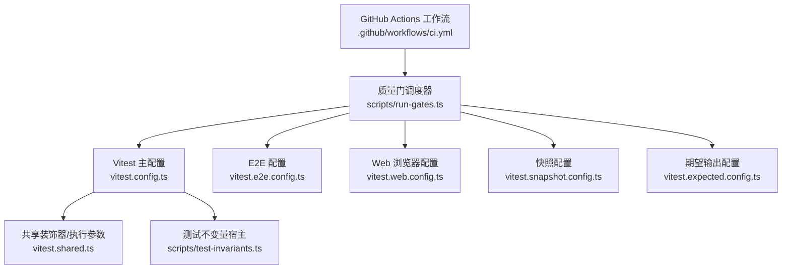
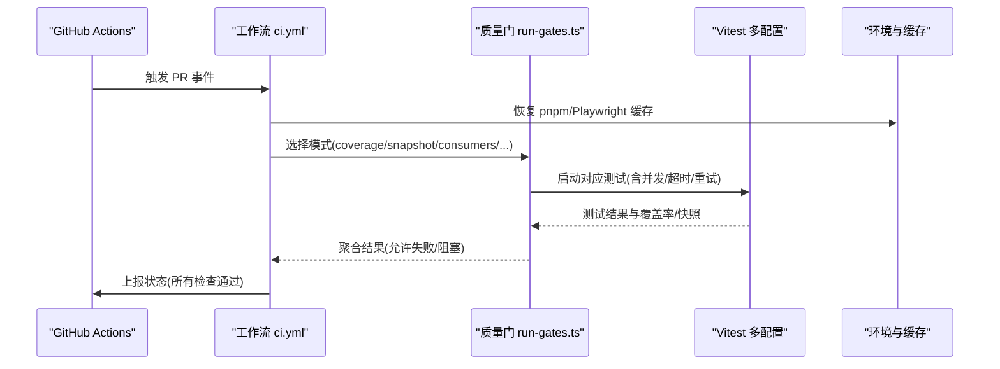
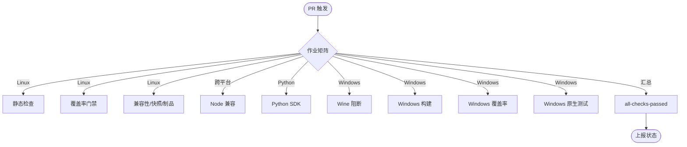
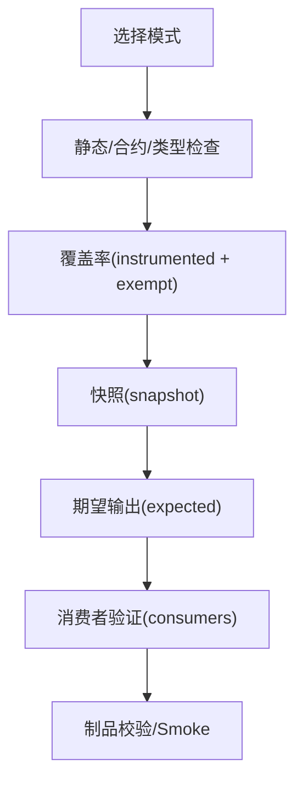
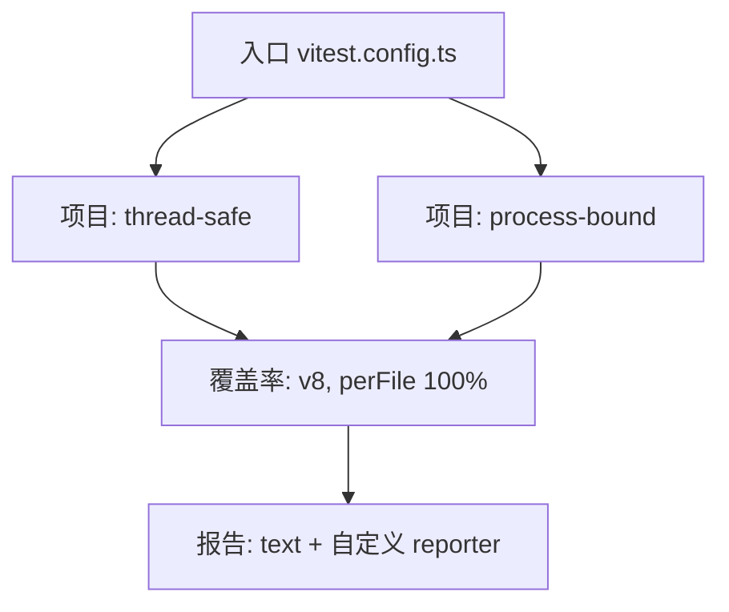
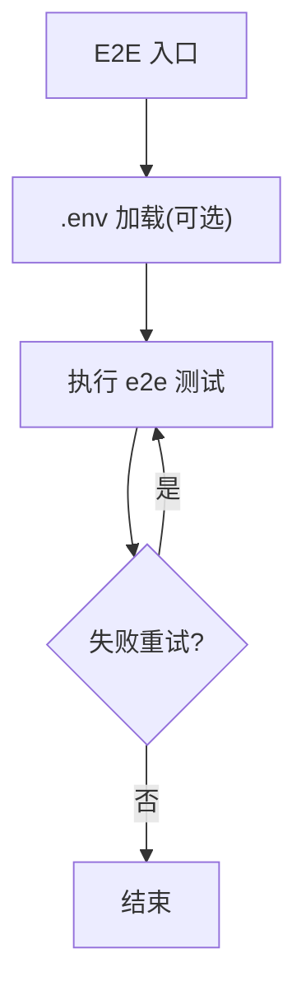
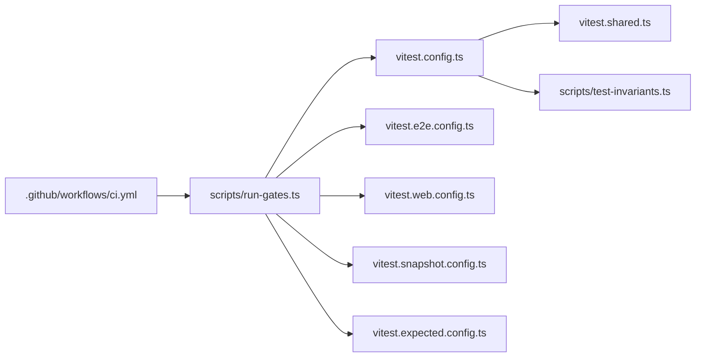

# 测试自动化

<cite>
**本文引用的文件**
- [CI 工作流](file://.github/workflows/ci.yml)
- [根包脚本与命令](file://package.json)
- [Vitest 主配置](file://vitest.config.ts)
- [E2E 配置](file://vitest.e2e.config.ts)
- [Web 浏览器测试配置](file://vitest.web.config.ts)
- [快照回放/录制配置](file://vitest.snapshot.config.ts)
- [期望输出配置](file://vitest.expected.config.ts)
- [共享装饰器与执行参数](file://vitest.shared.ts)
- [质量门调度器](file://scripts/run-gates.ts)
- [测试不变量宿主](file://scripts/test-invariants.ts)
</cite>

## 目录
1. [简介](#简介)
2. [项目结构](#项目结构)
3. [核心组件](#核心组件)
4. [架构总览](#架构总览)
5. [详细组件分析](#详细组件分析)
6. [依赖关系分析](#依赖关系分析)
7. [性能考量](#性能考量)
8. [故障排查指南](#故障排查指南)
9. [结论](#结论)
10. [附录](#附录)

## 简介
本文件面向 DeepSeek Harness 的测试自动化，聚焦持续集成中的测试流水线、本地测试脚本、测试套件组织与执行策略（并行与顺序控制）、测试报告与结果分析、环境准备与清理、以及在 CI/CD 中集成不同类型测试的方法与失败重试机制。文档以仓库内实际配置文件为依据，提供可操作的流程说明与可视化图示。

## 项目结构
测试体系围绕以下层次组织：
- 入口与编排：GitHub Actions 工作流负责触发、资源分配、缓存与并发控制；根 package.json 暴露统一的质量门脚本；run-gates.ts 将多种检查聚合为有向无环图并调度执行。
- 测试运行器：Vitest 多配置驱动不同测试类型（单元、E2E、Web 浏览器、快照回放/录制、期望输出）。
- 环境与约束：通过环境变量控制并发、超时、覆盖率阈值、平台排除、沙箱工具准备等。
- 报告与分析：覆盖率由 v8 提供者生成，按文件 100% 阈值门禁；自定义 reporter 输出未覆盖位置；Web 快照在 CI 中以 replay 模式比对黄金文件。

**图表来源**
- [.github/workflows/ci.yml:1-583](file://.github/workflows/ci.yml#L1-L583)
- [scripts/run-gates.ts:213-777](file://scripts/run-gates.ts#L213-L777)
- [vitest.config.ts:1-365](file://vitest.config.ts#L1-L365)
- [vitest.e2e.config.ts:1-63](file://vitest.e2e.config.ts#L1-L63)
- [vitest.web.config.ts:1-38](file://vitest.web.config.ts#L1-L38)
- [vitest.snapshot.config.ts:1-68](file://vitest.snapshot.config.ts#L1-L68)
- [vitest.expected.config.ts:1-20](file://vitest.expected.config.ts#L1-L20)
- [vitest.shared.ts:1-43](file://vitest.shared.ts#L1-L43)
- [scripts/test-invariants.ts:1-275](file://scripts/test-invariants.ts#L1-L275)

**章节来源**
- [.github/workflows/ci.yml:1-583](file://.github/workflows/ci.yml#L1-L583)
- [package.json:19-155](file://package.json#L19-L155)

## 核心组件
- GitHub Actions 工作流：定义 PR 触发的多作业矩阵（Linux/Windows、Node 版本兼容、Python SDK、Wine 模拟 Windows），设置缓存、并发、失败回退池、以及最终汇总检查。
- 质量门调度器：集中定义各模式的门（静态检查、覆盖率、快照、制品校验、消费者验证、Windows 构建/完整/观测）及其依赖关系与并发预算。
- Vitest 多配置：
  - 主配置：线程安全进程与进程绑定两类项目，v8 覆盖率 100% 阈值，平台与包级排除，装饰器预处理。
  - E2E 配置：真实 API 调用，重试与超时，可控并行度。
  - Web 浏览器配置：基于已构建前端产物进行交互快照回放。
  - 快照配置：replay/record/refresh 三种模式，串行写回保护，并发回放控制。
  - 期望输出配置：无需录制会话的本地组装期望输出测试。
- 共享能力：装饰器预编译、执行参数注入、测试不变量宿主自动挂载包级 invariant 服务。

**章节来源**
- [scripts/run-gates.ts:213-777](file://scripts/run-gates.ts#L213-L777)
- [vitest.config.ts:1-365](file://vitest.config.ts#L1-L365)
- [vitest.e2e.config.ts:1-63](file://vitest.e2e.config.ts#L1-L63)
- [vitest.web.config.ts:1-38](file://vitest.web.config.ts#L1-L38)
- [vitest.snapshot.config.ts:1-68](file://vitest.snapshot.config.ts#L1-L68)
- [vitest.expected.config.ts:1-20](file://vitest.expected.config.ts#L1-L20)
- [vitest.shared.ts:1-43](file://vitest.shared.ts#L1-L43)
- [scripts/test-invariants.ts:1-275](file://scripts/test-invariants.ts#L1-L275)

## 架构总览
下图展示从 PR 触发到各类测试执行的端到端流程，包括并发控制、缓存、平台差异处理与最终汇总。

**图表来源**
- [.github/workflows/ci.yml:21-583](file://.github/workflows/ci.yml#L21-L583)
- [scripts/run-gates.ts:213-777](file://scripts/run-gates.ts#L213-L777)
- [vitest.config.ts:149-191](file://vitest.config.ts#L149-L191)
- [vitest.e2e.config.ts:31-61](file://vitest.e2e.config.ts#L31-L61)
- [vitest.snapshot.config.ts:39-66](file://vitest.snapshot.config.ts#L39-L66)

## 详细组件分析

### GitHub Actions 工作流（ci.yml）
- 触发与并发：PR 触发，使用 concurrency 取消旧任务；根据 Linux/Windows 回退变量切换自托管池。
- 关键作业：
  - node-24 / static：静态检查与合约就绪。
  - node-24 / coverage：覆盖率门禁，启用分片与最大工作进程。
  - node-24 / consumers：兼容性、快照、制品校验，包含 Playwright 安装与缓存。
  - node-compat：多 Node 版本冒烟。
  - python-sdk / python-runtime：Python SDK 与发布形态矩阵。
  - windows-*：Wine 阻断、真实 Windows 构建/覆盖率/原生测试/观测性检查。
  - all-checks-passed：汇总必需作业结果，确保分支保护。
- 缓存与沙箱：pnpm store、Playwright 缓存、bubblewrap 准备脚本。

**图表来源**
- [.github/workflows/ci.yml:21-583](file://.github/workflows/ci.yml#L21-L583)

**章节来源**
- [.github/workflows/ci.yml:1-583](file://.github/workflows/ci.yml#L1-L583)

### 质量门调度器（run-gates.ts）
- 模式与门：定义 ci-primary、ci-coverage、ci-snapshot、ci-consumers、ci-windows-blocking/complete/observational、node-compat 等模式，每个模式由若干 Gate 组成，支持 needs/after 依赖与 allowFailure。
- 并发控制：默认并发基于 CPU 与模式限制；可通过 DSH_GATE_CONCURRENCY 覆盖。
- 覆盖率门：拆分 instrumented 与 exempt-heavy 两个子任务，支持分片与超时调整。
- 快照与期望输出：封装 snapshotGate 与 expectedOutputGate，依赖构建产物或已验证构建。
- 消费者门：构建官方客户端制品后，依次执行 publint、lint/duplication、snapshot、expected-output、web 快照、doc-typecheck、node-next-types、built-bin smoke。

**图表来源**
- [scripts/run-gates.ts:213-777](file://scripts/run-gates.ts#L213-L777)

**章节来源**
- [scripts/run-gates.ts:1-800](file://scripts/run-gates.ts#L1-L800)

### Vitest 主配置（vitest.config.ts）
- 项目划分：thread-safe 与 process-bound 两个项目，分别隔离进程全局状态与时序敏感测试。
- 覆盖率：v8 提供者，包含 packages/*/src/**，严格 perFile 100% 阈值；自定义 reporter 输出未覆盖位置。
- 平台与包排除：Windows 不支持的 shell/terminal/sandbox 包与特定测试；非 Linux 下 webworker 相关测试排除；pwsh 可用性影响覆盖豁免。
- 装饰器与路径解析：tsconfig.base.json paths 优先，标准装饰器预转换。

**图表来源**
- [vitest.config.ts:149-365](file://vitest.config.ts#L149-L365)

**章节来源**
- [vitest.config.ts:1-365](file://vitest.config.ts#L1-L365)

### E2E 配置（vitest.e2e.config.ts）
- 适用范围：packages/*/tests/*.e2e.ts 与 apps/cli/tests/*.e2e.ts。
- 重试与超时：testTimeout 120s，hookTimeout 30s，retry 2 次，适合真实 API 调用的瞬态失败。
- 并行控制：fileParallelism 与 maxWorkers 受 DSH_E2E_MAX_WORKERS 控制，默认 4。

**图表来源**
- [vitest.e2e.config.ts:1-63](file://vitest.e2e.config.ts#L1-L63)

**章节来源**
- [vitest.e2e.config.ts:1-63](file://vitest.e2e.config.ts#L1-L63)

### Web 浏览器测试配置（vitest.web.config.ts）
- 适用范围：apps/web/tests/*.e2e.ts、*.snapshot.ts 及 inspector 客户端浏览器 e2e。
- 行为：CI 默认 replay 模式对比黄金文件；本地 record/refresh 需显式开启。
- 并发：禁用文件级并行，避免 HMR 与动态生命周期竞争。

**章节来源**
- [vitest.web.config.ts:1-38](file://vitest.web.config.ts#L1-L38)

### 快照配置（vitest.snapshot.config.ts）
- 模式：replay（默认 keyless）、record（读取 .env 密钥）、refresh（更新当前期望输出）。
- 并发：replay 模式支持文件级并行与 maxConcurrency 控制；record/refresh 保持串行以避免写入冲突。
- 包含：session 快照语料与 apps/web 快照（lib 模式下）。

**章节来源**
- [vitest.snapshot.config.ts:1-68](file://vitest.snapshot.config.ts#L1-L68)

### 期望输出配置（vitest.expected.config.ts）
- 适用范围：apps/cli/tests/*.expected.e2e.ts。
- 并发：maxWorkers 取可用 CPU 上限与 5 的最小值。

**章节来源**
- [vitest.expected.config.ts:1-20](file://vitest.expected.config.ts#L1-L20)

### 共享能力（vitest.shared.ts）
- 装饰器插件：在 Vite 解析前对 TypeScript 装饰器进行转译，保证覆盖率与运行时一致性。
- 执行参数：注入 --no-webstorage 以避免 jsdom 与 Node 存储冲突。

**章节来源**
- [vitest.shared.ts:1-43](file://vitest.shared.ts#L1-L43)

### 测试不变量宿主（scripts/test-invariants.ts）
- 作用：在每个测试根自动挂载包级 invariant 服务，确保服务拓扑与初始化契约满足预期。
- 特性：懒加载 companion 模块，避免全量导入开销；对手动拓扑测试提供例外；提供 TEST_INVARIANT_READY_SERVICE 作为屏障。

**章节来源**
- [scripts/test-invariants.ts:1-275](file://scripts/test-invariants.ts#L1-L275)

## 依赖关系分析
- 工作流依赖：ci.yml 通过 jobs 组合多个独立任务，最终 by all-checks-passed 汇总。
- 质量门依赖：run-gates.ts 中 gatesForMode 返回带 needs/after 的门图，确保构建、类型检查、快照、制品校验的顺序。
- Vitest 配置依赖：主配置与 E2E/Web/快照/期望输出配置共享装饰器与执行参数；覆盖率与阈值在主配置中统一治理。
- 平台差异：Windows 排除 Bash/终端相关包与测试；非 Linux 排除 webworker 相关测试；pwsh 存在性决定覆盖豁免。

**图表来源**
- [.github/workflows/ci.yml:21-583](file://.github/workflows/ci.yml#L21-L583)
- [scripts/run-gates.ts:213-777](file://scripts/run-gates.ts#L213-L777)
- [vitest.config.ts:149-191](file://vitest.config.ts#L149-L191)
- [vitest.e2e.config.ts:31-61](file://vitest.e2e.config.ts#L31-L61)
- [vitest.web.config.ts:24-36](file://vitest.web.config.ts#L24-L36)
- [vitest.snapshot.config.ts:39-66](file://vitest.snapshot.config.ts#L39-L66)
- [vitest.expected.config.ts:7-18](file://vitest.expected.config.ts#L7-L18)
- [vitest.shared.ts:15-42](file://vitest.shared.ts#L15-L42)
- [scripts/test-invariants.ts:159-211](file://scripts/test-invariants.ts#L159-L211)

**章节来源**
- [.github/workflows/ci.yml:21-583](file://.github/workflows/ci.yml#L21-L583)
- [scripts/run-gates.ts:213-777](file://scripts/run-gates.ts#L213-L777)

## 性能考量
- 并发控制：
  - CI 层：DSH_GATE_CONCURRENCY 控制质量门并发；覆盖率 lane 使用 DSH_COVERAGE_MAX_WORKERS 与 DSH_COVERAGE_PARTITIONS 分片。
  - Vitest 层：E2E 使用 DSH_E2E_MAX_WORKERS；快照回放使用 DSH_SNAPSHOT_MAX_CONCURRENCY；Web 浏览器测试禁用文件级并行。
- 缓存优化：pnpm store、Playwright 缓存、Wine apt 缓存；自托管 VM 持久化减少冷启动。
- 超时与重试：E2E 与快照配置提供合理超时；E2E 内置 retry 应对瞬态失败。
- 覆盖率阈值：perFile 100% 强制高质量；豁免列表明确且可审计。

[本节为通用指导，不直接分析具体文件]

## 故障排查指南
- 覆盖率不达标：查看主配置的覆盖率阈值与豁免列表；使用自定义 reporter 定位未覆盖语句/分支/函数；必要时调整测试或扩大覆盖范围。
- E2E 失败：检查 DSH_E2E_MAX_WORKERS 是否过高导致配额争用；确认 .env 或环境变量是否正确；利用 retry 与更长超时。
- 快照不一致：区分 replay/record/refresh 模式；CI 默认 replay 比对黄金文件；本地刷新需显式设置 DSH_SNAPSHOT=refresh。
- Windows 问题：确认 Wine 安装与缓存；Windows 原生测试需要特定路径；注意平台排除规则。
- 质量门阻塞：查看 run-gates.ts 的模式门图，确认依赖链；必要时调整 DSH_GATE_CONCURRENCY 或允许部分观测性门失败。

**章节来源**
- [vitest.config.ts:192-365](file://vitest.config.ts#L192-L365)
- [vitest.e2e.config.ts:31-61](file://vitest.e2e.config.ts#L31-L61)
- [vitest.snapshot.config.ts:24-66](file://vitest.snapshot.config.ts#L24-L66)
- [.github/workflows/ci.yml:320-547](file://.github/workflows/ci.yml#L320-L547)
- [scripts/run-gates.ts:589-622](file://scripts/run-gates.ts#L589-L622)

## 结论
DeepSeek Harness 的测试自动化通过 GitHub Actions 工作流、质量门调度器与 Vitest 多配置形成闭环：以严格的覆盖率与快照门禁保障质量，以灵活的并发与重试机制提升稳定性，以平台差异化与缓存优化提升效率。建议在新增测试时遵循现有模式与配置约定，并在 CI 中选择合适的门与并发参数，确保快速反馈与高可信度。

[本节为总结，不直接分析具体文件]

## 附录
- 常用命令（来自根包脚本）：
  - 单元测试：test
  - 覆盖率：test:coverage / test:coverage:partitioned
  - E2E：test:e2e
  - Web 快照：test:web / test:web:built / test:web:perf / test:web:stress
  - 快照回放/录制：test:snapshot / test:snapshot:refresh
  - 期望输出：test:expected
  - 质量门：check:ci / check:ci:static / check:ci:coverage / check:ci:consumers / check:windows-wine / check:node-compat

**章节来源**
- [package.json:19-155](file://package.json#L19-L155)