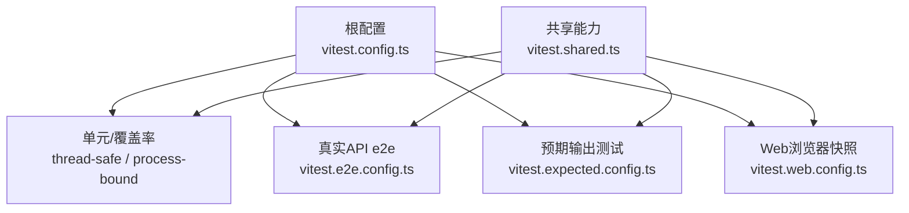
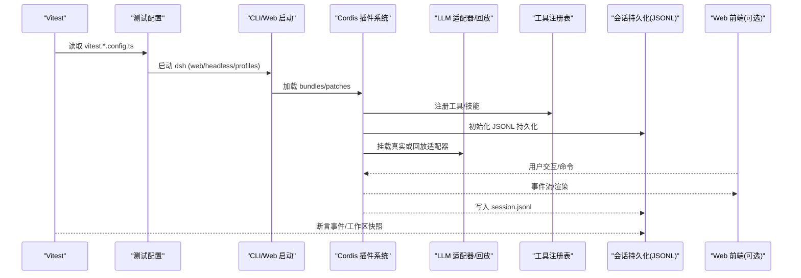
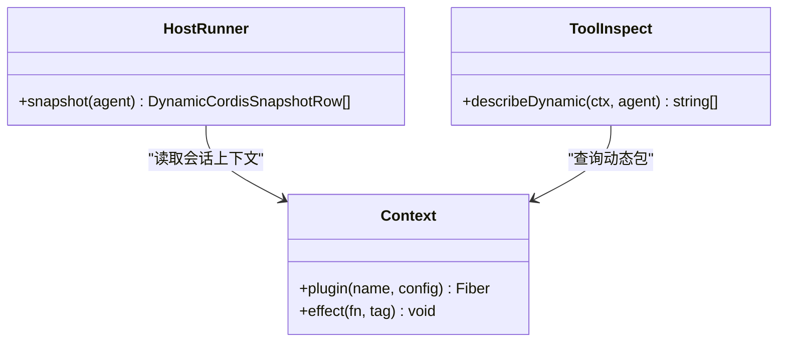
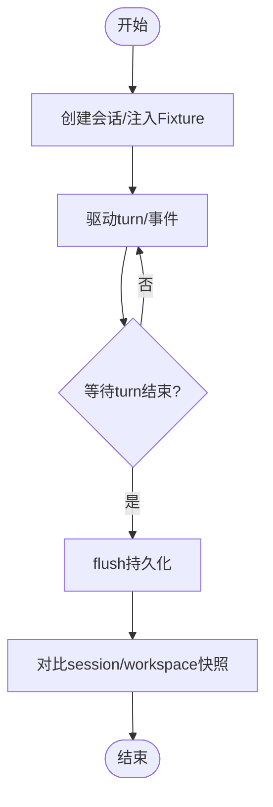
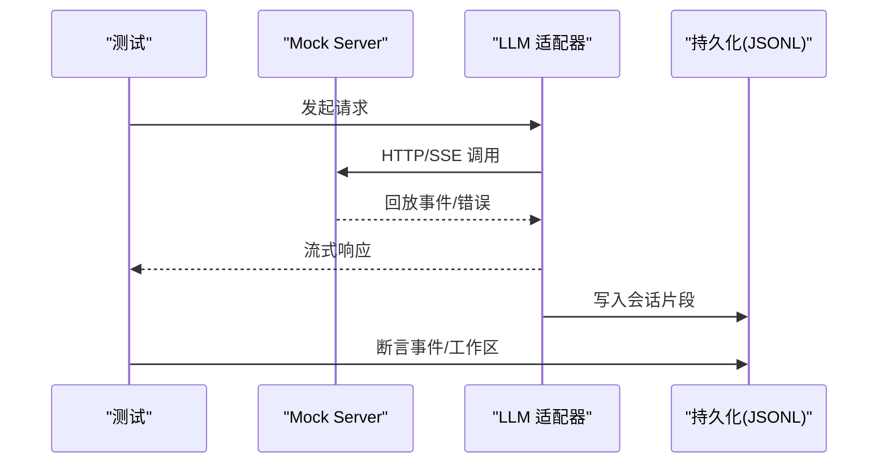
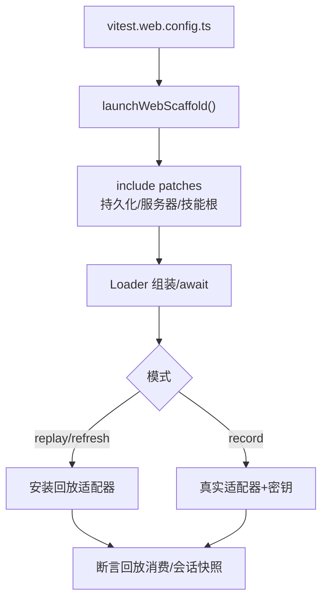
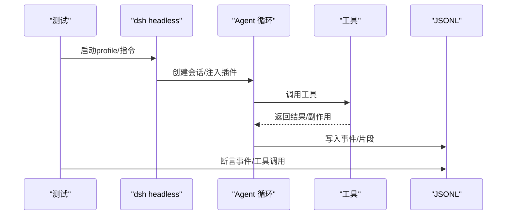
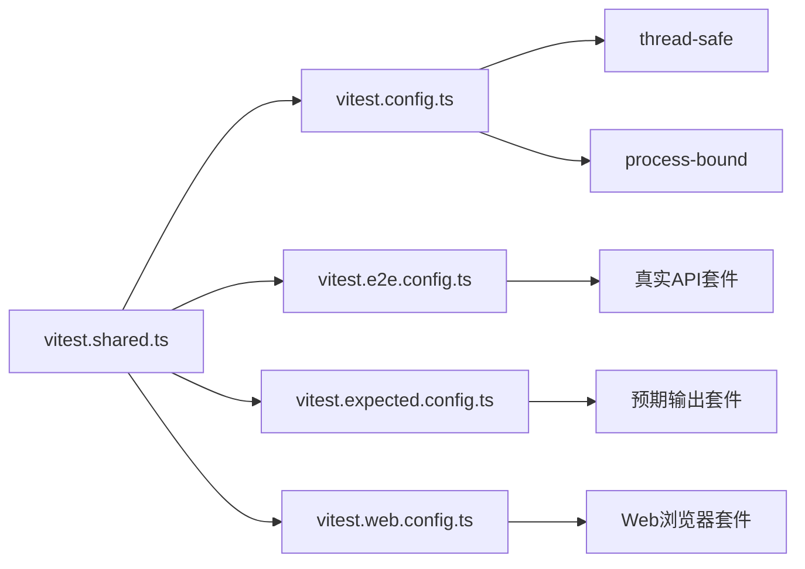

# 集成测试

<cite>
**本文引用的文件**
- [README.md](file://README.md)
- [testing.md](file://docs/testing.md)
- [vitest.config.ts](file://vitest.config.ts)
- [vitest.e2e.config.ts](file://vitest.e2e.config.ts)
- [vitest.expected.config.ts](file://vitest.expected.config.ts)
- [vitest.web.config.ts](file://vitest.web.config.ts)
- [vitest.shared.ts](file://vitest.shared.ts)
- [apps/cli/tests/agent-team-headless.e2e.ts](file://apps/cli/tests/agent-team-headless.e2e.ts)
- [apps/web/tests/scaffold.ts](file://apps/web/tests/scaffold.ts)
- [packages/llm/llm-pi-ai/tests/mock-server.ts](file://packages/llm/llm-pi-ai/tests/mock-server.ts)
- [packages/test-support/client-runtime/src/sessions.ts](file://packages/test-support/client-runtime/src/sessions.ts)
- [packages/extensions/tool-cordis/src/inspect.ts](file://packages/extensions/tool-cordis/src/inspect.ts)
- [packages/extensions/cordis-host-runner/src/index.ts](file://packages/extensions/cordis-host-runner/src/index.ts)
</cite>

## 目录
1. [简介](#简介)
2. [项目结构](#项目结构)
3. [核心组件](#核心组件)
4. [架构总览](#架构总览)
5. [详细组件分析](#详细组件分析)
6. [依赖关系分析](#依赖关系分析)
7. [性能与稳定性考量](#性能与稳定性考量)
8. [故障排查指南](#故障排查指南)
9. [结论](#结论)
10. [附录](#附录)

## 简介
本文件面向 DeepSeek Harness（dsh）的集成测试，聚焦服务间通信测试策略与端到端验证。内容覆盖：
- 插件系统测试、会话管理测试、工具执行测试
- 外部 API 模拟与数据库交互测试方法
- Web 界面、CLI 工具、Python SDK 的端到端测试配置
- 测试数据管理与测试环境隔离方案
- 智能体生命周期、工具调用链、事件流的集成示例

## 项目结构
仓库采用多包与工作区组织，测试按层级与用途拆分：
- 单元测试与覆盖率门控：基于 Vitest，按线程安全与进程绑定两类工程运行，严格每文件 100% 覆盖率
- 真实 API e2e：可带密钥运行，自跳过无密钥场景，适合 CI keyless 环境
- 预期输出测试：无需录制会话，直接断言构建产物或 CLI 行为
- Web 浏览器快照：Chromium 驱动，回放/录制/刷新模式，CI 强制只读回放
- 共享测试能力：装饰器预处理、路径解析、执行参数等统一在共享配置中

**图表来源**
- [vitest.config.ts:149-191](file://vitest.config.ts#L149-L191)
- [vitest.e2e.config.ts:31-62](file://vitest.e2e.config.ts#L31-L62)
- [vitest.expected.config.ts:6-19](file://vitest.expected.config.ts#L6-L19)
- [vitest.web.config.ts:16-37](file://vitest.web.config.ts#L16-L37)
- [vitest.shared.ts:1-43](file://vitest.shared.ts#L1-L43)

**章节来源**
- [testing.md:7-16](file://docs/testing.md#L7-L16)
- [vitest.config.ts:149-191](file://vitest.config.ts#L149-L191)
- [vitest.e2e.config.ts:31-62](file://vitest.e2e.config.ts#L31-L62)
- [vitest.expected.config.ts:6-19](file://vitest.expected.config.ts#L6-L19)
- [vitest.web.config.ts:16-37](file://vitest.web.config.ts#L16-L37)
- [vitest.shared.ts:1-43](file://vitest.shared.ts#L1-L43)

## 核心组件
- 测试分层与门控
  - 单元与覆盖率：分 thread-safe 与 process-bound 两个工程，确保进程级状态隔离；覆盖率阈值 perFile 100%，对客户端 UI 与实验性模块有明确豁免清单
  - 真实 API e2e：支持并行度控制（DSH_E2E_MAX_WORKERS），超时与重试策略，自动加载 .env
  - 预期输出测试：仅包含 apps/cli 下的 expected 用例，独立超时与并行度
  - Web 浏览器快照：串行文件执行，长超时，支持 replay/record/refresh 三种模式
- 共享测试能力
  - TypeScript 装饰器预转换
  - 统一的 execArgv 以规避 Web Storage 干扰
  - tsconfig.base.json 路径映射，保证源码优先于构建产物

**章节来源**
- [vitest.config.ts:149-191](file://vitest.config.ts#L149-L191)
- [vitest.config.ts:192-362](file://vitest.config.ts#L192-L362)
- [vitest.e2e.config.ts:31-62](file://vitest.e2e.config.ts#L31-L62)
- [vitest.expected.config.ts:6-19](file://vitest.expected.config.ts#L6-L19)
- [vitest.web.config.ts:16-37](file://vitest.web.config.ts#L16-L37)
- [vitest.shared.ts:1-43](file://vitest.shared.ts#L1-L43)

## 架构总览
下图展示从测试入口到被测系统的典型链路：Vitest 配置驱动不同测试类型，通过 CLI/Web 启动 dsh，进入 Cordis 插件体系，挂载 LLM、工具、持久化、Web 服务等，最终通过事件流与持久化进行断言。

**图表来源**
- [apps/web/tests/scaffold.ts:436-563](file://apps/web/tests/scaffold.ts#L436-L563)
- [apps/web/tests/scaffold.ts:632-704](file://apps/web/tests/scaffold.ts#L632-L704)
- [apps/cli/tests/agent-team-headless.e2e.ts:20-113](file://apps/cli/tests/agent-team-headless.e2e.ts#L20-L113)

## 详细组件分析

### 插件系统测试
- 目标：验证插件加载、动态包生命周期、宿主纤维与渲染失败信息
- 关键能力：
  - 通过 Host Runner 的 snapshot 接口获取插件版本、活跃运行、包定义与渲染失败
  - 通过 tool-cordis 的 inspect 描述动态包元数据、宿主/客户端半片存在性与生命周期
- 实践要点：
  - 使用 Cordis Loader + Include/Group 组装测试组合
  - 通过 patches 注入临时插件并校验其生命周期回调
  - 断言插件注册的工具 schema、调用结果与副作用

**图表来源**
- [packages/extensions/cordis-host-runner/src/index.ts:546-574](file://packages/extensions/cordis-host-runner/src/index.ts#L546-L574)
- [packages/extensions/tool-cordis/src/inspect.ts:171-192](file://packages/extensions/tool-cordis/src/inspect.ts#L171-L192)

**章节来源**
- [packages/extensions/cordis-host-runner/src/index.ts:546-574](file://packages/extensions/cordis-host-runner/src/index.ts#L546-L574)
- [packages/extensions/tool-cordis/src/inspect.ts:171-192](file://packages/extensions/tool-cordis/src/inspect.ts#L171-L192)

### 会话管理测试
- 目标：验证会话创建、事件订阅、投影、持久化与清理
- 关键能力：
  - FixtureSession 提供稳定的 SessionFace，事件源与投影由 fixture 控制
  - Web Scaffold 提供 whenTurnSettled 等待 turn/end 并 flush 持久化
  - 通过 session-snapshot 工具比较会话与最终工作区
- 实践要点：
  - 使用临时 persistenceRoot 与 workspaceCwd 隔离环境
  - 在 record/replay/refresh 模式下分别处理模型回放与消费检查
  - 断言 session.jsonl 中的事件序列与工具调用

**图表来源**
- [packages/test-support/client-runtime/src/sessions.ts:22-74](file://packages/test-support/client-runtime/src/sessions.ts#L22-L74)
- [apps/web/tests/scaffold.ts:742-759](file://apps/web/tests/scaffold.ts#L742-L759)
- [apps/web/tests/scaffold.ts:962-980](file://apps/web/tests/scaffold.ts#L962-L980)

**章节来源**
- [packages/test-support/client-runtime/src/sessions.ts:22-74](file://packages/test-support/client-runtime/src/sessions.ts#L22-L74)
- [apps/web/tests/scaffold.ts:742-759](file://apps/web/tests/scaffold.ts#L742-L759)
- [apps/web/tests/scaffold.ts:962-980](file://apps/web/tests/scaffold.ts#L962-L980)

### 工具执行测试
- 目标：验证工具注册、schema、调用链路与副作用
- 关键能力：
  - 通过 Context.tools 注册与查询工具 schema
  - 使用 stub 后端或真实后端（如 bash/pwsh）执行命令
  - 断言工具返回卡片、终端会话复用与发送次数
- 实践要点：
  - 为 shell/terminal 提供 stub 后端，避免真实进程影响
  - 针对 persistent 工具验证会话复用与并发安全
  - 结合 tool-cordis 的 inspect 查看运行时工具状态

**章节来源**
- [packages/shell/tool-bash-persistent/tests/tools.spec.ts:297-332](file://packages/shell/tool-bash-persistent/tests/tools.spec.ts#L297-L332)
- [packages/extensions/tool-cordis/src/inspect.ts:171-192](file://packages/extensions/tool-cordis/src/inspect.ts#L171-L192)

### 外部 API 模拟与数据库交互测试
- 外部 API 模拟
  - 使用本地 mock server 回放脚本化响应，支持延迟、错误码、SSE 事件流
  - 适用于 LLM 适配器、搜索、认证等边界
- 数据库交互
  - 会话持久化使用 JSONL 文件，Web 测试通过内存 SQLite 与 JSONL 组合
  - 通过 session-snapshot 工具标准化与比对记录

**图表来源**
- [packages/llm/llm-pi-ai/tests/mock-server.ts:28-61](file://packages/llm/llm-pi-ai/tests/mock-server.ts#L28-L61)
- [apps/web/tests/scaffold.ts:436-563](file://apps/web/tests/scaffold.ts#L436-L563)

**章节来源**
- [packages/llm/llm-pi-ai/tests/mock-server.ts:28-61](file://packages/llm/llm-pi-ai/tests/mock-server.ts#L28-L61)
- [apps/web/tests/scaffold.ts:436-563](file://apps/web/tests/scaffold.ts#L436-L563)

### 端到端测试配置
- Web 界面测试
  - 使用 scaffold 启动真实 web 组合，支持 replay/record/refresh
  - 通过 include patches 注入临时持久化、webserver、skill roots 等
  - 使用 authenticatedUrl 与 cookie 模拟浏览器登录
- CLI 工具测试
  - 通过 profiles 启动 headless 或特定 bundle 组合
  - 断言退出码、stdout/stderr、session.jsonl 事件
- Python SDK 测试
  - 通过 snapshots/python-sdk-single-exe 与 pytest 配合，验证 SDK 行为一致性

**图表来源**
- [vitest.web.config.ts:16-37](file://vitest.web.config.ts#L16-L37)
- [apps/web/tests/scaffold.ts:436-563](file://apps/web/tests/scaffold.ts#L436-L563)
- [apps/web/tests/scaffold.ts:632-704](file://apps/web/tests/scaffold.ts#L632-L704)

**章节来源**
- [vitest.web.config.ts:16-37](file://vitest.web.config.ts#L16-L37)
- [apps/web/tests/scaffold.ts:436-563](file://apps/web/tests/scaffold.ts#L436-L563)
- [apps/web/tests/scaffold.ts:632-704](file://apps/web/tests/scaffold.ts#L632-L704)
- [apps/cli/tests/agent-team-headless.e2e.ts:20-113](file://apps/cli/tests/agent-team-headless.e2e.ts#L20-L113)

### 测试数据管理与环境隔离
- 测试数据
  - 会话固定数据位于 snapshots/session、snapshots/sdk、snapshots/acp、snapshots/web
  - 使用 session-snapshot 工具进行规范化、ID 脱敏、消息稳定化
- 环境隔离
  - 每个 Web 测试使用独立的 workspaceCwd、persistenceRoot、harnessHome
  - 通过环境变量锁定 skill roots、telemetry、webserver 端口等
  - 清理阶段回收 fiber、临时目录与环境变量

**章节来源**
- [apps/web/tests/scaffold.ts:350-357](file://apps/web/tests/scaffold.ts#L350-L357)
- [apps/web/tests/scaffold.ts:391-423](file://apps/web/tests/scaffold.ts#L391-L423)
- [apps/web/tests/scaffold.ts:760-796](file://apps/web/tests/scaffold.ts#L760-L796)

### 集成测试示例
- 智能体生命周期
  - 通过 CLI headless profile 启动团队任务，断言 team/message 事件、tool/call 与任务完成状态
- 工具调用链
  - 使用 tool-bash-persistent 验证工具 schema、会话复用与命令执行
- 事件流
  - 通过 session/event 监听 turn/end，flush 后断言 session.jsonl 内容与工具调用

**图表来源**
- [apps/cli/tests/agent-team-headless.e2e.ts:20-113](file://apps/cli/tests/agent-team-headless.e2e.ts#L20-L113)
- [packages/shell/tool-bash-persistent/tests/tools.spec.ts:297-332](file://packages/shell/tool-bash-persistent/tests/tools.spec.ts#L297-L332)

**章节来源**
- [apps/cli/tests/agent-team-headless.e2e.ts:20-113](file://apps/cli/tests/agent-team-headless.e2e.ts#L20-L113)
- [packages/shell/tool-bash-persistent/tests/tools.spec.ts:297-332](file://packages/shell/tool-bash-persistent/tests/tools.spec.ts#L297-L332)

## 依赖关系分析
- 测试配置之间的耦合
  - vitest.config.ts 作为主入口，聚合 thread-safe 与 process-bound 工程，并定义覆盖率范围与排除项
  - vitest.e2e.config.ts 专注真实 API 套件，支持并行度与重试
  - vitest.expected.config.ts 专注预期输出，独立超时与并行度
  - vitest.web.config.ts 专注浏览器快照，串行执行与长超时
- 共享能力
  - vitest.shared.ts 提供装饰器预处理与 execArgv 设置，被所有配置复用
- 被测组件依赖
  - Web Scaffold 依赖 Loader、Include、Group、App Boot、Session、Persistence、WebServer 等
  - CLI 测试依赖 execa、resolveExampleLaunch、profiles 与 fixtures

**图表来源**
- [vitest.config.ts:149-191](file://vitest.config.ts#L149-L191)
- [vitest.e2e.config.ts:31-62](file://vitest.e2e.config.ts#L31-L62)
- [vitest.expected.config.ts:6-19](file://vitest.expected.config.ts#L6-L19)
- [vitest.web.config.ts:16-37](file://vitest.web.config.ts#L16-L37)
- [vitest.shared.ts:1-43](file://vitest.shared.ts#L1-L43)

**章节来源**
- [vitest.config.ts:149-191](file://vitest.config.ts#L149-L191)
- [vitest.e2e.config.ts:31-62](file://vitest.e2e.config.ts#L31-L62)
- [vitest.expected.config.ts:6-19](file://vitest.expected.config.ts#L6-L19)
- [vitest.web.config.ts:16-37](file://vitest.web.config.ts#L16-L37)
- [vitest.shared.ts:1-43](file://vitest.shared.ts#L1-L43)

## 性能与稳定性考量
- 并行度与资源限制
  - e2e 支持 DSH_E2E_MAX_WORKERS 控制文件并行度，避免共享 API 配额争用
  - Web 套件串行执行，避免 HMR 与动态生命周期竞争
- 超时与重试
  - e2e 默认 120s 测试超时、30s hook 超时，支持 retry 2 次
  - Web 套件 180s 测试超时、120s hook 超时，适应浏览器交互
- 覆盖率门控
  - perFile 100% 阈值，对客户端 UI、实验性模块与生成代码有明确豁免
  - 未覆盖行通常视为死代码，需删除而非盲目补测

**章节来源**
- [vitest.e2e.config.ts:31-62](file://vitest.e2e.config.ts#L31-L62)
- [vitest.web.config.ts:16-37](file://vitest.web.config.ts#L16-L37)
- [vitest.config.ts:192-362](file://vitest.config.ts#L192-L362)

## 故障排查指南
- 常见症状
  - 无密钥导致真实 API 套件跳过：检查环境变量与 .env 加载
  - Web 回放未消费：关闭时 assertConsumed 失败，说明场景未驱动足够模型调用
  - 工具执行失败：确认 stub 后端是否正确注册，shell/pwsh 是否可用
- 定位步骤
  - 查看 session.jsonl 事件序列，确认 turn/end 与 tool_call 是否存在
  - 使用 tool-cordis inspect 查看动态包与工具状态
  - 检查 Web Scaffold 的 mode 与 replayFixture 配置是否匹配
- 恢复策略
  - 调整并行度与超时，降低竞争
  - 使用 replayProvidersOnly 仅挂载提供者目录，避免模型调用
  - 清理临时目录与环境变量，确保环境隔离

**章节来源**
- [vitest.e2e.config.ts:31-62](file://vitest.e2e.config.ts#L31-L62)
- [apps/web/tests/scaffold.ts:760-796](file://apps/web/tests/scaffold.ts#L760-L796)
- [packages/extensions/tool-cordis/src/inspect.ts:171-192](file://packages/extensions/tool-cordis/src/inspect.ts#L171-L192)

## 结论
DeepSeek Harness 的集成测试体系以分层与隔离为核心，通过 Vitest 的多配置与共享能力，覆盖单元、e2e、预期输出与 Web 浏览器快照。借助插件系统、会话管理、工具执行与外部 API 模拟，能够完整验证智能体生命周期、工具调用链与事件流。严格的覆盖率门控与详尽的环境隔离确保了测试的可维护性与稳定性。

## 附录
- 快速参考
  - 运行单元与覆盖率：pnpm run test
  - 运行真实 API e2e：pnpm run test:e2e
  - 运行预期输出：pnpm run test:expected
  - 运行 Web 快照：pnpm run test:web
- 相关文档
  - 测试策略与层级说明见 docs/testing.md
  - 项目概览与运行方式见 README.md

**章节来源**
- [testing.md:7-16](file://docs/testing.md#L7-L16)
- [README.md:17-41](file://README.md#L17-L41)