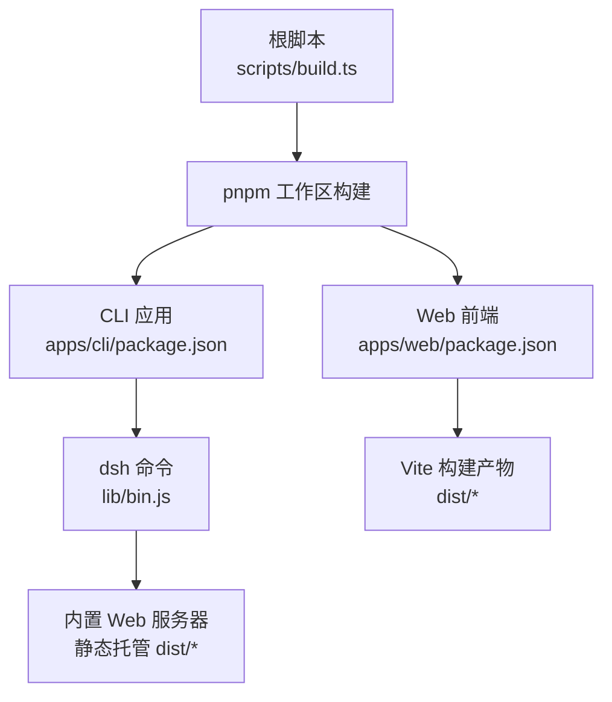
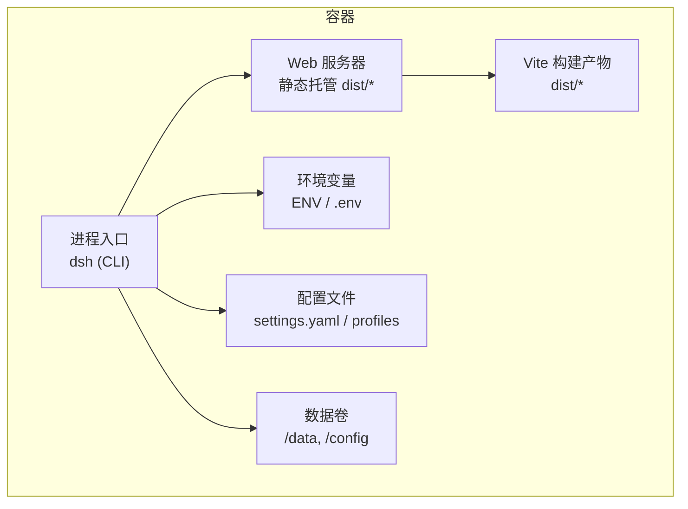
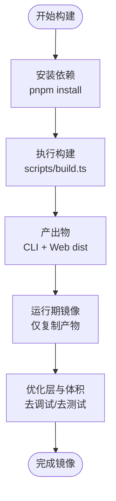
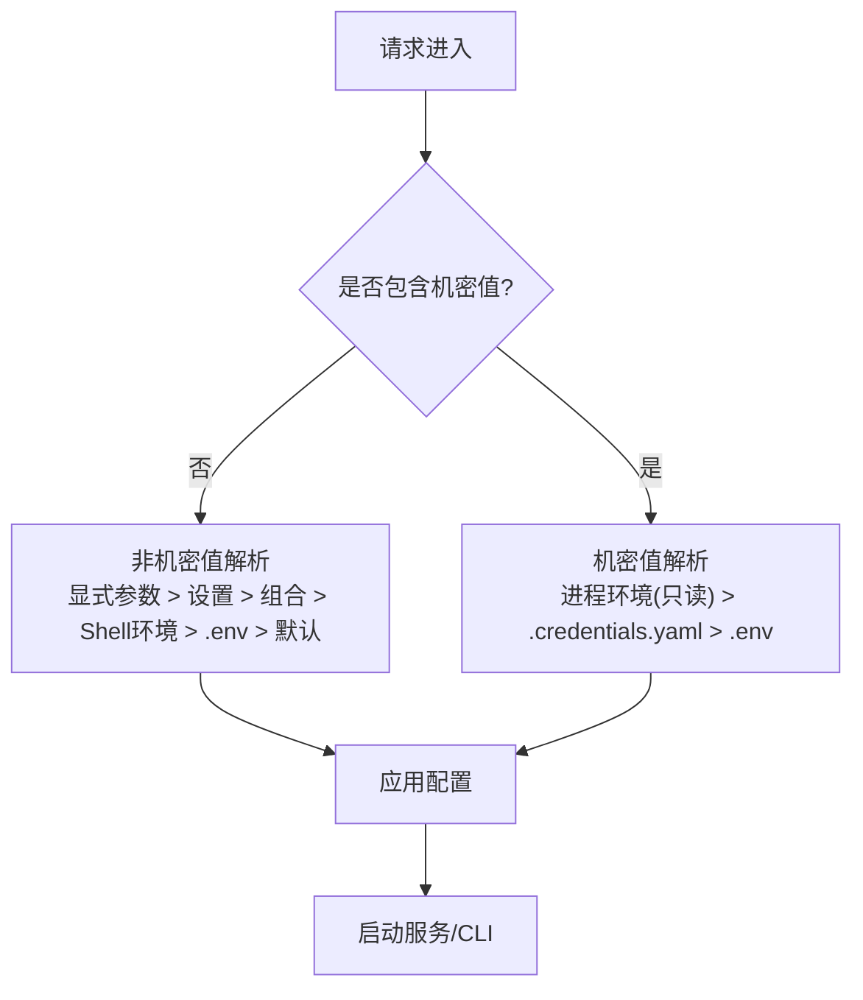
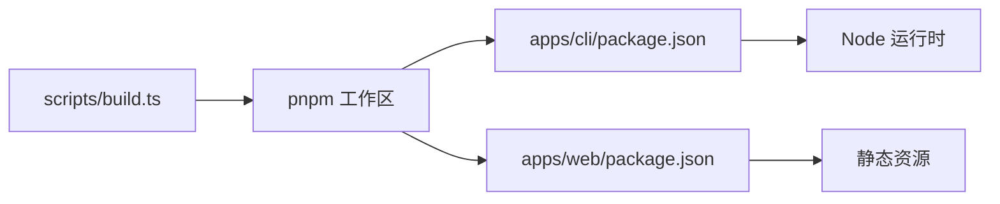

# 容器化部署

<cite>
**本文引用的文件**
- [package.json](file://package.json)
- [apps/cli/package.json](file://apps/cli/package.json)
- [apps/web/package.json](file://apps/web/package.json)
- [scripts/build.ts](file://scripts/build.ts)
- [packages/experimental/webworker-packer/src/repository.ts](file://packages/experimental/webworker-packer/src/repository.ts)
- [packages/boot/app-boot/tests/app-boot.spec.ts](file://packages/boot/app-boot/tests/app-boot.spec.ts)
- [packages/shell/shell-env/tests/shell-env.spec.ts](file://packages/shell/shell-env/tests/shell-env.spec.ts)
- [.agents/notes/implemented/architecture/2026-08-04-configuration-source-ownership.md](file://.agents/notes/implemented/architecture/2026-08-04-configuration-source-ownership.md)
- [.agents/notes/implemented/architecture/2026-08-04-credentials-yaml-and-user-environment-layer.md](file://.agents/notes/implemented/architecture/2026-08-04-credentials-yaml-and-user-environment-layer.md)
</cite>

## 目录
1. [简介](#简介)
2. [项目结构](#项目结构)
3. [核心组件](#核心组件)
4. [架构总览](#架构总览)
5. [详细组件分析](#详细组件分析)
6. [依赖关系分析](#依赖关系分析)
7. [性能考量](#性能考量)
8. [故障排查指南](#故障排查指南)
9. [结论](#结论)
10. [附录](#附录)

## 简介
本文件面向DeepSeek Harness的容器化部署，聚焦以下目标：
- Docker镜像构建：多阶段构建优化、镜像分层策略与最小化镜像大小。
- CLI应用与Web应用的容器化配置：环境变量管理、端口映射与数据卷挂载。
- Kubernetes部署清单：Deployment、Service、Ingress与ConfigMap。
- 健康检查、资源限制与滚动更新策略。
- 生产环境最佳实践与安全加固建议。

说明：仓库未提供现成的Dockerfile或Kubernetes清单。本文基于现有脚本、包入口与环境加载行为，给出可落地的构建与部署方案，并标注对应源码依据。

## 项目结构
- 根级脚本与命令
  - 根脚本统一编排构建流程，调用pnpm执行子任务。
  - CLI应用通过bin暴露dsh命令，负责启动CLI与内置Web服务。
  - Web前端使用Vite构建产物，由CLI提供的Web服务静态托管。
- 关键入口
  - CLI入口：apps/cli/package.json声明bin指向lib/bin.js。
  - Web前端：apps/web/package.json定义vite build与预览打包能力。
  - 构建编排：scripts/build.ts封装pnpm调用与构建环境注入。
- 配置与运行时
  - 环境变量加载：支持从指定目录加载.env，并在缺失时静默回退到进程环境。
  - 配置来源优先级：非机密值与机密值分别有明确的覆盖顺序，确保部署可控。

**图示来源**
- [scripts/build.ts:1-29](file://scripts/build.ts#L1-L29)
- [apps/cli/package.json:14-23](file://apps/cli/package.json#L14-L23)
- [apps/web/package.json:18-29](file://apps/web/package.json#L18-L29)

**章节来源**
- [package.json:19-155](file://package.json#L19-L155)
- [apps/cli/package.json:14-23](file://apps/cli/package.json#L14-L23)
- [apps/web/package.json:18-29](file://apps/web/package.json#L18-L29)
- [scripts/build.ts:1-29](file://scripts/build.ts#L1-L29)

## 核心组件
- CLI应用（dsh）
  - 通过bin暴露命令行入口，负责profile启动、插件管理与浏览器UI别名。
  - 内置Web服务用于托管前端静态资源。
- Web前端
  - 使用Vite构建，输出静态资源供CLI内置Web服务托管。
  - 支持预览模式下的VFS镜像打包能力（实验性）。
- 构建编排
  - scripts/build.ts统一调用pnpm执行构建，注入客户端构建环境与记录。
- 配置与环境
  - 支持从指定目录加载.env；当不存在时不报错，优先使用进程环境。
  - 配置来源优先级明确，避免部署被意外覆盖。

**章节来源**
- [apps/cli/package.json:1-23](file://apps/cli/package.json#L1-L23)
- [apps/web/package.json:1-29](file://apps/web/package.json#L1-L29)
- [scripts/build.ts:1-29](file://scripts/build.ts#L1-L29)
- [packages/boot/app-boot/tests/app-boot.spec.ts:35-59](file://packages/boot/app-boot/tests/app-boot.spec.ts#L35-L59)
- [.agents/notes/implemented/architecture/2026-08-04-configuration-source-ownership.md:17-30](file://.agents/notes/implemented/architecture/2026-08-04-configuration-source-ownership.md#L17-L30)

## 架构总览
下图展示容器内运行时的主要组件交互：CLI作为进程入口，启动Web服务并托管前端静态资源；环境变量与配置文件按既定优先级生效；持久化数据通过数据卷挂载。

**图示来源**
- [apps/cli/package.json:14-23](file://apps/cli/package.json#L14-L23)
- [apps/web/package.json:18-29](file://apps/web/package.json#L18-L29)
- [packages/boot/app-boot/tests/app-boot.spec.ts:35-59](file://packages/boot/app-boot/tests/app-boot.spec.ts#L35-L59)

## 详细组件分析

### 镜像构建与分层策略（多阶段构建）
- 阶段一：构建期
  - 安装依赖并执行根脚本构建，生成CLI与Web前端产物。
  - 利用pnpm工作区缓存加速重复构建。
- 阶段二：运行期
  - 仅复制必要产物（CLI二进制/JS与Web dist），剔除构建工具链与测试代码。
  - 使用精简基础镜像（如Alpine或Distroless Node），减少攻击面。
- 分层优化要点
  - 将依赖安装与源代码分离为不同层，提升缓存命中率。
  - 将频繁变更的配置与静态资源放入独立层，便于滚动更新。
  - 清理不必要的中间文件与调试信息。

[本节为概念性流程，不直接映射具体源码文件]

### CLI应用容器化配置
- 入口与命令
  - 容器启动命令应指向dsh，以复用其内置Web服务与CLI能力。
- 端口映射
  - 若启用Web服务，需将容器内监听端口映射至宿主机（例如8080）。
- 数据卷挂载
  - 挂载会话与日志目录（如/data）以实现状态持久化。
  - 挂载配置目录（如/config）以便外部注入配置。
- 环境变量
  - 通过ENV或Kubernetes ConfigMap/Secret注入API密钥、端点地址等。
  - 注意：.env文件仅在指定目录存在时加载，否则静默回退到进程环境。

**章节来源**
- [apps/cli/package.json:14-23](file://apps/cli/package.json#L14-L23)
- [packages/boot/app-boot/tests/app-boot.spec.ts:35-59](file://packages/boot/app-boot/tests/app-boot.spec.ts#L35-L59)

### Web应用容器化配置
- 构建产物
  - 使用Vite构建，输出静态资源到dist目录。
- 静态托管
  - 由CLI内置Web服务提供静态资源访问。
- 预览与VFS打包（实验性）
  - 支持在预览模式下打包VFS镜像，便于离线或沙箱场景。

**章节来源**
- [apps/web/package.json:18-29](file://apps/web/package.json#L18-L29)
- [packages/experimental/webworker-packer/src/repository.ts:106-133](file://packages/experimental/webworker-packer/src/repository.ts#L106-L133)

### 环境变量与配置优先级
- 非机密值优先级（从高到低）
  - 本次运行的显式参数 > 用户设置 > 组合配置（profile、patch） > 当前Shell继承的环境 > 发现的.env文件 > 默认值。
- 机密值优先级（从高到低）
  - 继承进程环境（只读，最高优先级） > $DSH_HOME/.credentials.yaml > 项目.env > $DSH_HOME/.env。
- 安全约束
  - 某些变量（如DSH_*、PATH、BROWSER或代理相关）不允许来自.env，以避免安全风险。
  - 重复变量所有权注册会被拒绝，防止冲突。

**图示来源**
- [.agents/notes/implemented/architecture/2026-08-04-configuration-source-ownership.md:17-30](file://.agents/notes/implemented/architecture/2026-08-04-configuration-source-ownership.md#L17-L30)
- [.agents/notes/implemented/architecture/2026-08-04-credentials-yaml-and-user-environment-layer.md:28-30](file://.agents/notes/implemented/architecture/2026-08-04-credentials-yaml-and-user-environment-layer.md#L28-L30)
- [packages/shell/shell-env/tests/shell-env.spec.ts:96-118](file://packages/shell/shell-env/tests/shell-env.spec.ts#L96-L118)

**章节来源**
- [.agents/notes/implemented/architecture/2026-08-04-configuration-source-ownership.md:17-30](file://.agents/notes/implemented/architecture/2026-08-04-configuration-source-ownership.md#L17-L30)
- [.agents/notes/implemented/architecture/2026-08-04-credentials-yaml-and-user-environment-layer.md:28-30](file://.agents/notes/implemented/architecture/2026-08-04-credentials-yaml-and-user-environment-layer.md#L28-L30)
- [packages/shell/shell-env/tests/shell-env.spec.ts:96-118](file://packages/shell/shell-env/tests/shell-env.spec.ts#L96-L118)

### Kubernetes部署清单（示例）
以下为通用模板，需根据实际端口与路径调整：
- Deployment
  - replicas: 按需设定
  - containers: image、ports、envFrom（ConfigMap/Secret）、volumeMounts（/data、/config）
  - livenessProbe/readinessProbe: HTTP探针指向Web服务健康端点
  - resources: requests/limits（CPU、内存）
  - strategy: rollingUpdate（maxSurge、maxUnavailable）
- Service
  - type: ClusterIP（内部）或 LoadBalancer（外部）
  - ports: 映射容器端口
- Ingress
  - hosts/rules: 域名与路径转发至Service
  - tls: 证书配置
- ConfigMap/Secret
  - ConfigMap: 非敏感配置（如BASE_URL、LOG_LEVEL）
  - Secret: 敏感信息（如API_KEY、证书）

[本节为概念性清单模板，不直接映射具体源码文件]

### 健康检查、资源限制与滚动更新
- 健康检查
  - 使用HTTP探针检查Web服务返回200的端点。
  - 若Web服务未暴露健康端点，可使用TCP探针检查端口连通性。
- 资源限制
  - 设置requests与limits，避免资源争用与OOM。
- 滚动更新
  - 使用rollingUpdate策略，逐步替换Pod，保证服务连续性。
  - 结合readinessProbe确保新Pod就绪后再切流。

[本节为通用实践，不直接映射具体源码文件]

## 依赖关系分析
- 构建依赖
  - scripts/build.ts通过pnpm调用工作区脚本，驱动CLI与Web构建。
- 运行依赖
  - CLI依赖Node运行时与自身模块；Web前端为静态资源，无运行时依赖。
- 配置依赖
  - 环境变量与配置文件按优先级生效，确保部署可控。

**图示来源**
- [scripts/build.ts:1-29](file://scripts/build.ts#L1-L29)
- [apps/cli/package.json:14-23](file://apps/cli/package.json#L14-L23)
- [apps/web/package.json:18-29](file://apps/web/package.json#L18-L29)

**章节来源**
- [scripts/build.ts:1-29](file://scripts/build.ts#L1-L29)
- [apps/cli/package.json:14-23](file://apps/cli/package.json#L14-L23)
- [apps/web/package.json:18-29](file://apps/web/package.json#L18-L29)

## 性能考量
- 构建缓存
  - 利用pnpm工作区缓存与Docker层缓存，缩短CI时间。
- 镜像体积
  - 仅复制必要产物，剔除开发依赖与测试代码。
  - 使用精简基础镜像，减少攻击面与下载时间。
- 运行时优化
  - 合理设置资源requests/limits，避免过度分配。
  - 使用连接池与并发控制（如适用）提升吞吐。

[本节为通用指导，不直接映射具体源码文件]

## 故障排查指南
- 环境变量加载失败
  - 现象：.env无法加载或变量未生效。
  - 排查：确认.env所在目录是否正确；检查是否存在同名但不可读的目录；查看警告日志。
- 配置覆盖异常
  - 现象：部署配置被用户设置或Shell环境覆盖。
  - 排查：核对配置优先级；确认机密值是否来自进程环境（只读）；避免在.env中设置受保护变量。
- 重复变量所有权
  - 现象：注册时抛出重复变量错误。
  - 排查：检查多个模块是否声明了相同变量名；调整命名空间或移除冲突。

**章节来源**
- [packages/boot/app-boot/tests/app-boot.spec.ts:35-59](file://packages/boot/app-boot/tests/app-boot.spec.ts#L35-L59)
- [.agents/notes/implemented/architecture/2026-08-04-configuration-source-ownership.md:17-30](file://.agents/notes/implemented/architecture/2026-08-04-configuration-source-ownership.md#L17-L30)
- [packages/shell/shell-env/tests/shell-env.spec.ts:96-118](file://packages/shell/shell-env/tests/shell-env.spec.ts#L96-L118)

## 结论
- 本项目通过脚本与包入口清晰定义了CLI与Web的构建与运行方式，适合容器化部署。
- 环境变量与配置优先级明确，有助于在生产环境中实现可控与安全的部署。
- 建议采用多阶段构建与精简镜像，结合Kubernetes的健康检查与滚动更新，保障高可用与可维护性。

[本节为总结，不直接映射具体源码文件]

## 附录
- 常用环境变量（示例）
  - BASE_URL：后端API基地址
  - LOG_LEVEL：日志级别
  - API_KEY：模型API密钥（通过Secret注入）
- 数据卷建议
  - /data：会话与持久化数据
  - /config：外部配置文件
- 安全加固建议
  - 使用只读文件系统（除必要写入目录）
  - 最小权限原则运行容器进程
  - 定期扫描镜像漏洞并更新基础镜像

[本节为通用建议，不直接映射具体源码文件]