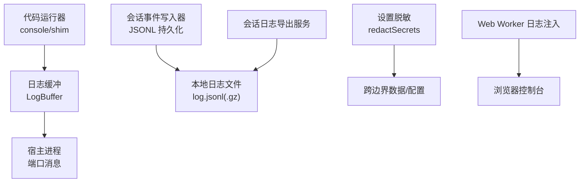
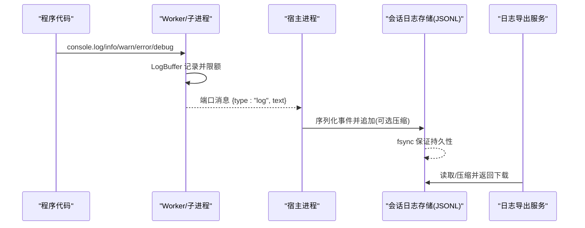
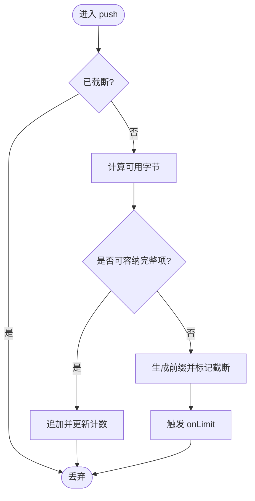
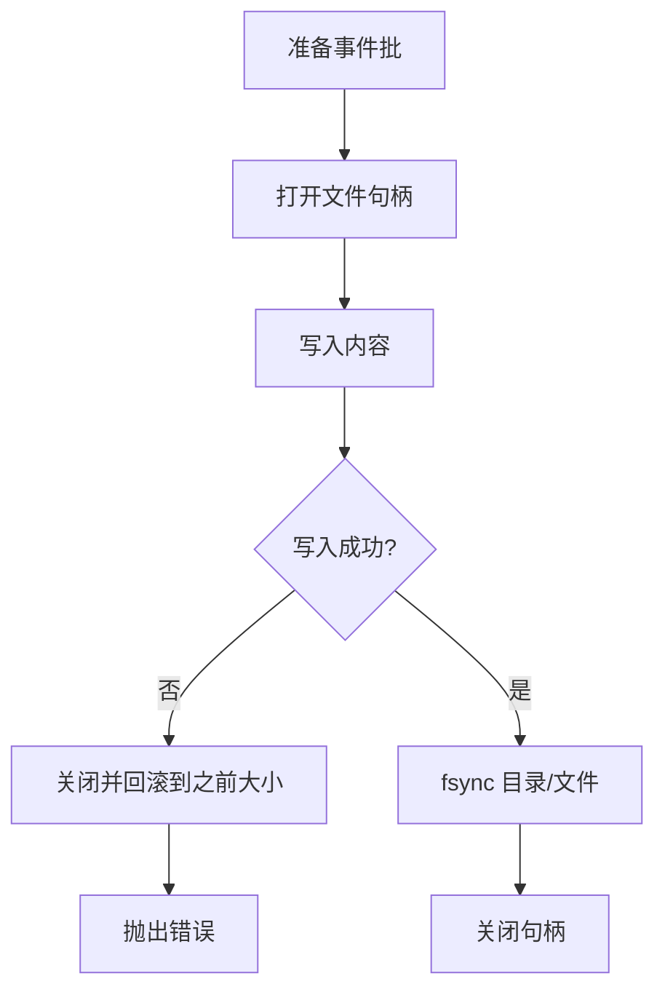
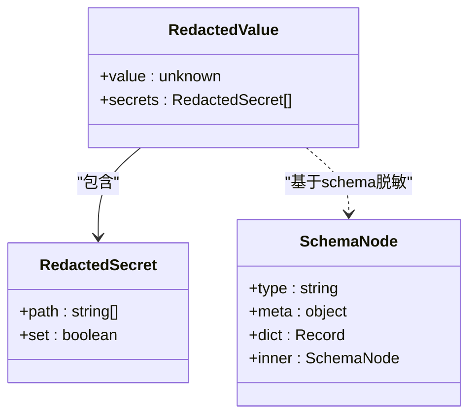
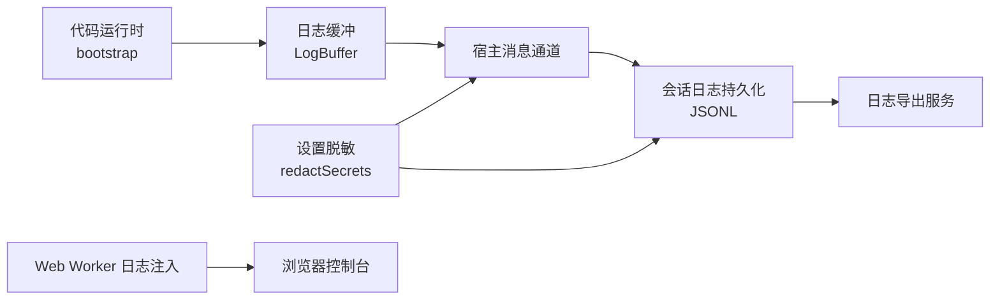

# 日志管理

<cite>
**本文引用的文件**
- [bootstrap.ts](file://packages/code-runtime/code-runtime-worker-thread/src/bootstrap.ts)
- [index.ts（会话日志导出）](file://packages/session-query/session-log-export/src/index.ts)
- [index.ts（JSONL 会话日志持久化）](file://packages/session/session-persistence-jsonl/src/index.ts)
- [atomic.ts（JSON 存储原子写入）](file://packages/storage/storage-json/src/atomic.ts)
- [redact.ts（设置值脱敏）](file://packages/settings/settings/src/redact.ts)
- [worker-host.ts（Web Worker 日志注入）](file://packages/experimental/webworker-runtime/src/worker-host.ts)
- [config.txt（快照配置示例）](file://snapshots/session/fs-edit/workspace/config.txt)
</cite>

## 目录
1. [简介](#简介)
2. [项目结构](#项目结构)
3. [核心组件](#核心组件)
4. [架构总览](#架构总览)
5. [详细组件分析](#详细组件分析)
6. [依赖关系分析](#依赖关系分析)
7. [性能考虑](#性能考虑)
8. [故障排查指南](#故障排查指南)
9. [结论](#结论)
10. [附录](#附录)

## 简介
本文件面向 DeepSeek Harness 的日志管理系统，聚焦以下目标：
- 明确结构化日志格式、日志级别与字段约定
- 说明本地日志轮转、远程收集与集中式存储策略
- 提供日志查询与分析工具使用建议（grep、awk、Logstash、Kibana）
- 给出安全考量（敏感信息脱敏、访问控制）
- 提出性能优化与存储成本控制建议

## 项目结构
DeepSeek Harness 将“代码执行输出”和“会话事件日志”分别实现为可组合的子系统：
- 代码运行时子进程/Worker 的输出通过受限控制台与流捕获，统一进入带预算控制的缓冲，再按协议上报给宿主
- 会话事件以 JSONL 追加到本地文件，支持压缩与原子 fsync 保证崩溃恢复
- 会话日志导出模块提供下载入口与压缩等级配置
- 设置系统提供基于 schema 的结构化脱敏能力，避免机密泄露到网络边界或日志中
- Web Worker 环境内安装日志接收器，确保 Cordis 日志在浏览器侧可见

图表来源
- [bootstrap.ts:49-120](file://packages/code-runtime/code-runtime-worker-thread/src/bootstrap.ts#L49-L120)
- [index.ts（会话日志导出）:46-65](file://packages/session-query/session-log-export/src/index.ts#L46-L65)
- [index.ts（JSONL 会话日志持久化）:653-722](file://packages/session/session-persistence-jsonl/src/index.ts#L653-L722)
- [redact.ts:1-110](file://packages/settings/settings/src/redact.ts#L1-L110)
- [worker-host.ts:289-312](file://packages/experimental/webworker-runtime/src/worker-host.ts#L289-L312)

章节来源
- [bootstrap.ts:49-120](file://packages/code-runtime/code-runtime-worker-thread/src/bootstrap.ts#L49-L120)
- [index.ts（会话日志导出）:46-65](file://packages/session-query/session-log-export/src/index.ts#L46-L65)
- [index.ts（JSONL 会话日志持久化）:653-722](file://packages/session/session-persistence-jsonl/src/index.ts#L653-L722)
- [redact.ts:1-110](file://packages/settings/settings/src/redact.ts#L1-L110)
- [worker-host.ts:289-312](file://packages/experimental/webworker-runtime/src/worker-host.ts#L289-L312)

## 核心组件
- 代码运行时日志缓冲与控制台替换：对 console.log/info/warn/error/debug 进行统一渲染并计入字节预算，超出时截断并上报限制信号
- 会话事件 JSONL 持久化：按会话维度追加事件行，必要时压缩；写入后 fsync 保证崩溃恢复；失败回滚避免部分写导致重复序列号
- 会话日志导出：暴露下载路由，支持压缩等级配置
- 设置脱敏：基于 schema 的 role('secret') 字段在跨边界前移除，并记录位置以便 UI 呈现只写输入
- Web Worker 日志注入：将 Cordis 日志输出到浏览器控制台，便于前端调试

章节来源
- [bootstrap.ts:49-120](file://packages/code-runtime/code-runtime-worker-thread/src/bootstrap.ts#L49-L120)
- [index.ts（JSONL 会话日志持久化）:653-722](file://packages/session/session-persistence-jsonl/src/index.ts#L653-L722)
- [index.ts（会话日志导出）:46-65](file://packages/session-query/session-log-export/src/index.ts#L46-L65)
- [redact.ts:1-110](file://packages/settings/settings/src/redact.ts#L1-L110)
- [worker-host.ts:289-312](file://packages/experimental/webworker-runtime/src/worker-host.ts#L289-L312)

## 架构总览
下图展示从代码执行到日志落盘与导出的端到端流程，以及脱敏与安全边界。

图表来源
- [bootstrap.ts:369-424](file://packages/code-runtime/code-runtime-worker-thread/src/bootstrap.ts#L369-L424)
- [index.ts（JSONL 会话日志持久化）:670-722](file://packages/session/session-persistence-jsonl/src/index.ts#L670-L722)
- [index.ts（会话日志导出）:46-65](file://packages/session-query/session-log-export/src/index.ts#L46-L65)

## 详细组件分析

### 代码运行时日志缓冲与控制台替换
- 行为要点
  - 仅暴露五类日志方法：log、info、warn、error、debug
  - 所有输出经 util.inspect 风格渲染后进入 LogBuffer
  - LogBuffer 维护 JSON 字节预算，超限时输出一个能容纳的前缀并触发一次 onLimit 回调
  - stdout/stderr 的 write 被拦截并入队，保持与 console 输出一致的顺序
  - 完成值与异常均受限于剩余字节预算，超限会返回固定诊断而非真实内容

- 复杂度与性能
  - push 操作近似 O(1)，字符串长度与 JSON 编码开销由内置函数估算
  - inspect 深度与长度受限，防止爆炸式渲染

- 错误处理
  - 输出超限不抛错，而是通过 output-limit 信号通知宿主
  - 异常与无效输出会被裁剪为安全片段

图表来源
- [bootstrap.ts:49-98](file://packages/code-runtime/code-runtime-worker-thread/src/bootstrap.ts#L49-L98)

章节来源
- [bootstrap.ts:49-120](file://packages/code-runtime/code-runtime-worker-thread/src/bootstrap.ts#L49-L120)
- [bootstrap.ts:122-150](file://packages/code-runtime/code-runtime-worker-thread/src/bootstrap.ts#L122-L150)
- [bootstrap.ts:155-229](file://packages/code-runtime/code-runtime-worker-thread/src/bootstrap.ts#L155-L229)
- [bootstrap.ts:369-424](file://packages/code-runtime/code-runtime-worker-thread/src/bootstrap.ts#L369-L424)

### 会话事件 JSONL 持久化
- 行为要点
  - 每个会话对应一个 log.jsonl（或压缩后缀），按事件批次追加
  - 写入后调用 fsync，确保崩溃恢复
  - 若写入或同步失败，回滚到写入前大小，避免部分写导致的重复序列号
  - 修复接口可将文件截断到指定偏移并 fsync

- 数据结构
  - 每行一条事件记录（JSON 文本），整体构成不可变追加日志
  - 元数据（如 cwd、id）用于定位与归档

- 性能与可靠性
  - 批量编码减少 IO 次数
  - fsync 保障幂等重试与一致性

图表来源
- [index.ts（JSONL 会话日志持久化）:670-722](file://packages/session/session-persistence-jsonl/src/index.ts#L670-L722)

章节来源
- [index.ts（JSONL 会话日志持久化）:653-722](file://packages/session/session-persistence-jsonl/src/index.ts#L653-L722)

### 会话日志导出与压缩
- 行为要点
  - 提供注册路由的能力，供上层 HTTP 框架挂载下载接口
  - 压缩等级可配置（0-9），默认值来自常量
  - 响应体包含请求确认信息，具体归档逻辑由上层实现

- 集成点
  - 通过 fetch 注册机制与宿主 API 层集成
  - 与 JSONL 持久化配合，形成“写-读”闭环

章节来源
- [index.ts（会话日志导出）:46-65](file://packages/session-query/session-log-export/src/index.ts#L46-L65)

### 设置值脱敏（敏感信息保护）
- 行为要点
  - 基于 schema 的 role('secret') 标记，在跨边界前移除机密字段
  - 返回脱敏后的值与机密位置列表，便于 UI 显示只写输入
  - 遍历 object/dict/array 容器，递归剥离机密

- 安全影响
  - 避免密钥、令牌等敏感信息进入日志、网络或配置界面
  - 对于未覆盖的 union/transform 路径，当前实现保留原值（已知限制）

图表来源
- [redact.ts:1-110](file://packages/settings/settings/src/redact.ts#L1-L110)

章节来源
- [redact.ts:1-110](file://packages/settings/settings/src/redact.ts#L1-L110)

### Web Worker 日志注入
- 行为要点
  - 在 Web Worker 环境中安装日志接收器，将 Cordis 的 warn/error 输出到浏览器控制台
  - 通过 LoggerService 与 LogExporter 协作，控制日志级别与颜色
  - 避免 info/debug 淹没页面控制台，仅注入警告与错误

章节来源
- [worker-host.ts:289-312](file://packages/experimental/webworker-runtime/src/worker-host.ts#L289-L312)

### 本地原子写入（辅助持久化）
- 行为要点
  - 通过临时文件 + fsync + rename 的方式实现原子替换
  - 父目录 fsync 保证新条目可见且持久
  - 适用于单写者场景下的单元文件更新

章节来源
- [atomic.ts:1-40](file://packages/storage/storage-json/src/atomic.ts#L1-L40)

## 依赖关系分析
- 代码运行时依赖日志缓冲与控制台替换，确保输出有序且可控
- 会话日志持久化依赖文件系统与压缩能力，提供崩溃恢复
- 导出服务依赖持久化产物，提供下载能力
- 脱敏能力独立于日志子系统，但在配置与网络边界处被广泛使用
- Web Worker 注入依赖 Cordis 日志服务，改善前端可观测性

图表来源
- [bootstrap.ts:369-424](file://packages/code-runtime/code-runtime-worker-thread/src/bootstrap.ts#L369-L424)
- [index.ts（JSONL 会话日志持久化）:670-722](file://packages/session/session-persistence-jsonl/src/index.ts#L670-L722)
- [index.ts（会话日志导出）:46-65](file://packages/session-query/session-log-export/src/index.ts#L46-L65)
- [redact.ts:1-110](file://packages/settings/settings/src/redact.ts#L1-L110)
- [worker-host.ts:289-312](file://packages/experimental/webworker-runtime/src/worker-host.ts#L289-L312)

章节来源
- [bootstrap.ts:369-424](file://packages/code-runtime/code-runtime-worker-thread/src/bootstrap.ts#L369-L424)
- [index.ts（JSONL 会话日志持久化）:670-722](file://packages/session/session-persistence-jsonl/src/index.ts#L670-L722)
- [index.ts（会话日志导出）:46-65](file://packages/session-query/session-log-export/src/index.ts#L46-L65)
- [redact.ts:1-110](file://packages/settings/settings/src/redact.ts#L1-L110)
- [worker-host.ts:289-312](file://packages/experimental/webworker-runtime/src/worker-host.ts#L289-L312)

## 性能考虑
- 输出预算控制
  - 代码运行时输出受 maxOutputBytes 约束，避免大对象或恶意输出拖垮宿主
  - 超限时仅保留前缀并上报，降低内存与带宽压力

- 写入效率与一致性
  - JSONL 采用批量编码与 fsync，兼顾吞吐与可靠性
  - 失败回滚避免部分写导致的重复序列号

- 压缩与存储成本
  - 会话日志导出支持压缩等级配置，可按需平衡 CPU 与磁盘空间
  - 结合定期清理策略（例如过期会话清理）控制长期存储成本

- 前端日志
  - Web Worker 仅注入 warn/error，避免控制台刷屏影响性能

[本节为通用指导，无需特定文件引用]

## 故障排查指南
- 输出超限
  - 现象：收到 output-limit 信号，后续输出被丢弃
  - 处理：检查程序输出量，调整 maxOutputBytes；审查是否存在循环打印或超大对象

- 写入失败
  - 现象：appendLines 抛出错误并回滚
  - 处理：检查磁盘空间与权限；确认 fsync 支持；必要时手动修复到上一偏移

- 脱敏缺失
  - 现象：配置或日志中出现敏感字段
  - 处理：确认 schema 正确标注 role('secret')；注意 union/transform 路径的已知限制

- 前端日志不可见
  - 现象：浏览器控制台无 Cordis 日志
  - 处理：确认已安装日志注入；检查日志级别过滤

章节来源
- [bootstrap.ts:192-229](file://packages/code-runtime/code-runtime-worker-thread/src/bootstrap.ts#L192-L229)
- [index.ts（JSONL 会话日志持久化）:670-722](file://packages/session/session-persistence-jsonl/src/index.ts#L670-L722)
- [redact.ts:86-90](file://packages/settings/settings/src/redact.ts#L86-L90)
- [worker-host.ts:289-312](file://packages/experimental/webworker-runtime/src/worker-host.ts#L289-L312)

## 结论
DeepSeek Harness 的日志体系围绕“可控、可靠、可观测”设计：
- 代码运行时输出通过预算控制与顺序保证，避免资源滥用
- 会话事件以 JSONL 追加并 fsync，确保崩溃恢复与可回放
- 导出服务提供灵活的压缩与下载能力
- 脱敏机制在跨边界前移除机密字段，提升安全性
- 前端日志注入增强可观测性

建议在生产环境中结合本地轮转、远程收集与集中式存储，构建完整的日志生命周期管理。

[本节为总结，无需特定文件引用]

## 附录

### 日志格式规范
- 代码运行时日志
  - 来源：console.log/info/warn/error/debug
  - 格式：单行文本，由 util.inspect 风格渲染
  - 字段：无结构化字段，遵循顺序与预算控制
  - 参考路径：[bootstrap.ts:100-120](file://packages/code-runtime/code-runtime-worker-thread/src/bootstrap.ts#L100-L120)

- 会话事件日志
  - 来源：会话事件序列化
  - 格式：JSONL，每行一条事件记录
  - 字段：事件类型、时间戳、上下文（如 cwd、id）、负载
  - 参考路径：[index.ts（JSONL 会话日志持久化）:670-722](file://packages/session/session-persistence-jsonl/src/index.ts#L670-L722)

- 日志级别
  - 代码运行时：log、info、warn、error、debug
  - Web Worker：warn/error 优先注入，避免控制台过载
  - 参考路径：[bootstrap.ts:100-120](file://packages/code-runtime/code-runtime-worker-thread/src/bootstrap.ts#L100-L120)、[worker-host.ts:289-312](file://packages/experimental/webworker-runtime/src/worker-host.ts#L289-L312)

### 日志收集策略
- 本地日志轮转
  - 基于会话目录与文件命名，结合过期清理策略（如 spill 清理）控制留存周期
  - 参考路径：[index.ts（JSONL 会话日志持久化）:670-722](file://packages/session/session-persistence-jsonl/src/index.ts#L670-L722)

- 远程日志收集
  - 通过宿主进程将 worker 日志以端口消息形式上报，可在上层接入远端采集器
  - 参考路径：[bootstrap.ts:369-424](file://packages/code-runtime/code-runtime-worker-thread/src/bootstrap.ts#L369-L424)

- 集中式存储
  - 将 JSONL 日志归档至集中存储，启用压缩与索引以提升查询效率
  - 参考路径：[index.ts（会话日志导出）:46-65](file://packages/session-query/session-log-export/src/index.ts#L46-L65)

### 日志查询与分析工具
- grep/awk
  - 使用正则匹配事件类型、会话 ID、错误关键字
  - 示例思路：按会话目录筛选，按行解析 JSONL 字段

- Logstash/Kibana
  - 使用 JSON 解析器解析 JSONL 行，提取字段建立索引
  - 在 Kibana 中创建可视化面板，监控错误率、会话时长、工具调用分布

[本节为通用指导，无需特定文件引用]

### 安全考虑
- 敏感信息脱敏
  - 使用 redactSecrets 在跨边界前移除 role('secret') 字段
  - 注意 union/transform 路径的已知限制
  - 参考路径：[redact.ts:1-110](file://packages/settings/settings/src/redact.ts#L1-L110)

- 访问控制
  - 日志导出接口应限制访问范围（如鉴权、白名单）
  - 本地日志文件权限最小化（如 0o600）
  - 参考路径：[atomic.ts:24-40](file://packages/storage/storage-json/src/atomic.ts#L24-L40)

### 性能优化与存储成本控制建议
- 合理设置 maxOutputBytes，避免过大输出
- 根据负载选择压缩等级，平衡 CPU 与磁盘
- 定期清理过期会话日志，释放存储空间
- 在前端仅注入 warn/error，减少控制台压力
- 对高频日志进行采样或聚合，降低存储与传输成本

[本节为通用指导，无需特定文件引用]