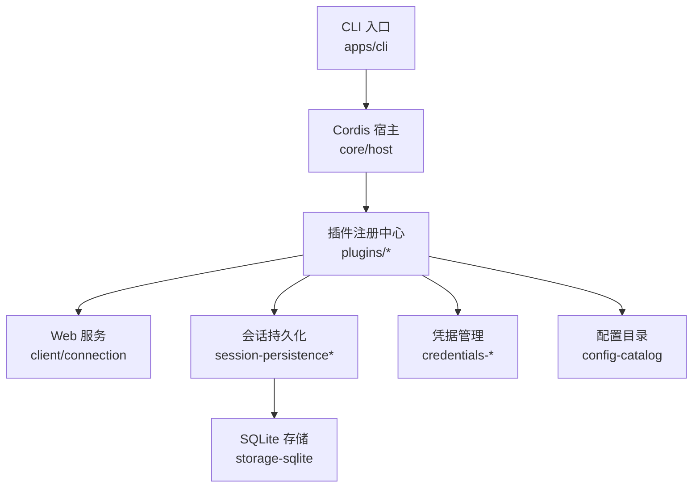
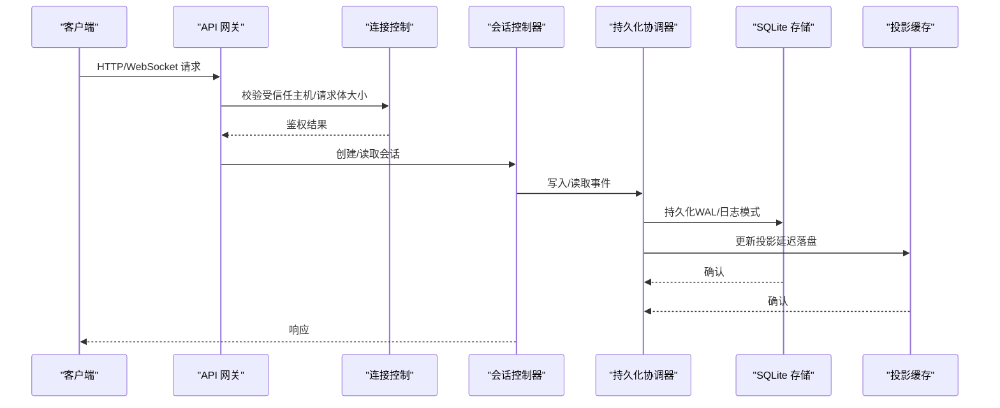
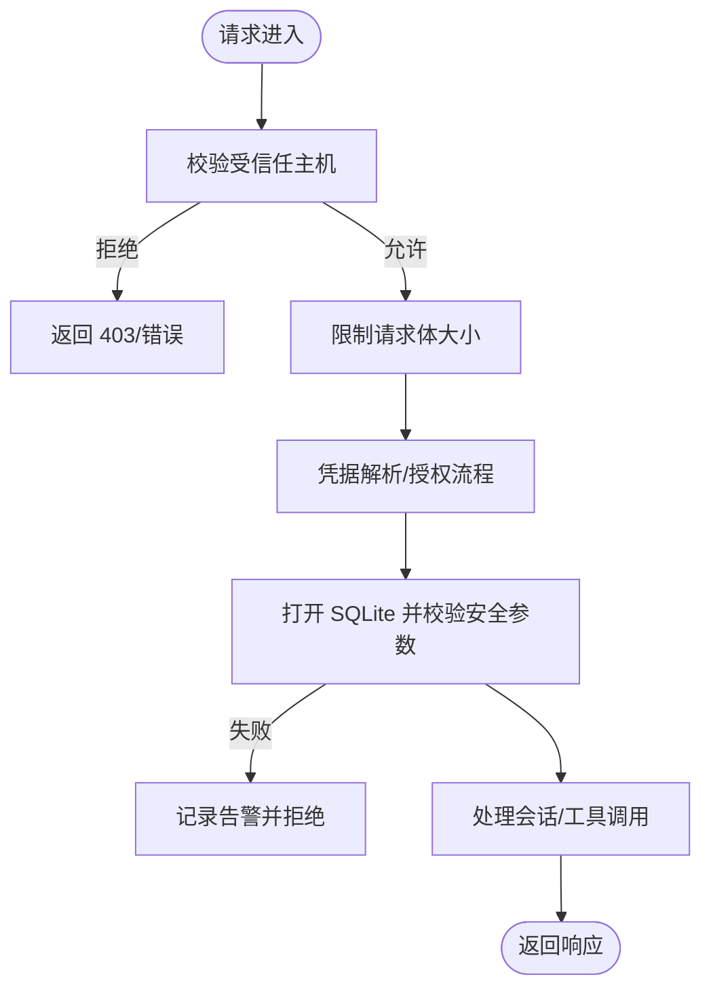
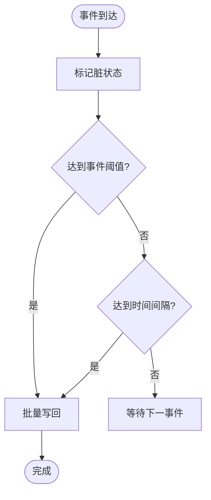
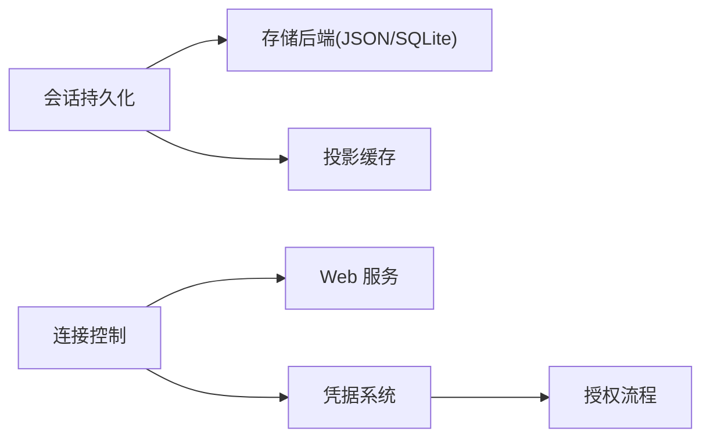

# 生产环境最佳实践

<cite>
**本文引用的文件**
- [README.md](file://README.md)
- [package.json](file://package.json)
- [SAFETY.md](file://SAFETY.md)
- [docs/config-catalog.md](file://docs/config-catalog.md)
- [packages/credentials/README.md](file://packages/credentials/README.md)
- [packages/credentials/authorization/src/types.ts](file://packages/credentials/authorization/src/types.ts)
- [packages/client/connection/src/index.ts](file://packages/client/connection/src/index.ts)
- [packages/storage/storage-sqlite/src/index.ts](file://packages/storage/storage-sqlite/src/index.ts)
- [packages/session/session-persistence-sqlite/src/schema.ts](file://packages/session/session-persistence-sqlite/src/schema.ts)
- [packages/session/session-projection-cache/src/index.ts](file://packages/session/session-projection-cache/src/index.ts)
- [packages/session/session-persistence/src/coordinator.ts](file://packages/session/session-persistence/src/coordinator.ts)
- [scripts/build.ts](file://scripts/build.ts)
- [scripts/release/pack.ts](file://scripts/release/pack.ts)
- [scripts/release/publish.ts](file://scripts/release/publish.ts)
- [scripts/run-gates.ts](file://scripts/run-gates.ts)
- [scripts/clean.ts](file://scripts/clean.ts)
- [scripts/dev-web.ts](file://scripts/dev-web.ts)
- [scripts/check-workspace-constraints.ts](file://scripts/check-workspace-constraints.ts)
- [scripts/verify-config-source-ownership.ts](file://scripts/verify-config来源所有权.ts)
- [.github/workflows/ci.yml](file://.github/workflows/ci.yml)
- [.github/workflows/ci-master.yml](file://.github/workflows/ci-master.yml)
</cite>

## 目录
1. [简介](#简介)
2. [项目结构](#项目结构)
3. [核心组件](#核心组件)
4. [架构总览](#架构总览)
5. [详细组件分析](#详细组件分析)
6. [依赖关系分析](#依赖关系分析)
7. [性能优化建议](#性能优化建议)
8. [故障排除指南](#故障排除指南)
9. [结论](#结论)
10. [附录](#附录)

## 简介
本文件面向生产部署与运维团队，围绕 DeepSeek Harness（dsh）的安全加固、性能优化、备份恢复、运维自动化与故障排除提供可落地的最佳实践。内容基于仓库中的配置目录、存储与安全实现、构建与发布脚本以及 CI 工作流进行归纳总结，确保在生产环境中具备可审计、可回滚、可观测与可恢复的能力。

## 项目结构
- 应用入口与运行方式：通过 CLI 启动 Web UI 或 headless 模式；支持从 npm 包直接运行与源码构建两种路径。
- 插件化架构：以 Cordis 为内核，所有能力以插件形式挂载，便于按部署需求裁剪与组合。
- 配置体系：集中式配置目录生成器维护各插件的部署级配置项，运行时由 schema 校验并注入。
- 存储与持久化：提供 JSON 与 SQLite 后端；会话持久化层对数据库安全参数进行强制校验。
- 构建与发布：统一的构建脚本、打包与发布流程，配合 CI 工作流保障一致性。

图表来源
- [package.json:19-155](file://package.json#L19-L155)
- [docs/config-catalog.md:1-10](file://docs/config-catalog.md#L1-L10)
- [packages/storage/storage-sqlite/src/index.ts:18-48](file://packages/storage/storage-sqlite/src/index.ts#L18-L48)
- [packages/client/connection/src/index.ts:413-430](file://packages/client/connection/src/index.ts#L413-L430)

章节来源
- [README.md:17-41](file://README.md#L17-L41)
- [package.json:1-196](file://package.json#L1-L196)
- [docs/config-catalog.md:1-10](file://docs/config-catalog.md#L1-L10)

## 核心组件
- 连接与访问控制：Web 客户端连接插件定义受信任主机、Cookie 生命周期与请求体大小限制，用于网络边界与资源保护。
- 凭据与授权：凭据系统分离“密钥值”和“引用名”，支持本地文件与授权流程；授权条目描述方法集与状态。
- 存储与持久化：SQLite 后端提供 WAL/日志模式选择；会话持久化层在打开数据库时强制关闭可信模式与内存映射，防止不安全配置。
- 投影缓存：会话投影缓存采用写后延迟提交策略，按事件数或时间间隔触发落盘，提高写入吞吐并降低抖动。
- 构建与发布：统一构建脚本与发布脚本，结合 CI 工作流完成多目标构建与制品验证。

章节来源
- [packages/client/connection/src/index.ts:413-430](file://packages/client/connection/src/index.ts#L413-L430)
- [packages/credentials/README.md:1-22](file://packages/credentials/README.md#L1-L22)
- [packages/credentials/authorization/src/types.ts:81-91](file://packages/credentials/authorization/src/types.ts#L81-L91)
- [packages/storage/storage-sqlite/src/index.ts:18-48](file://packages/storage/storage-sqlite/src/index.ts#L18-L48)
- [packages/session/session-persistence-sqlite/src/schema.ts:91-105](file://packages/session/session-persistence-sqlite/src/schema.ts#L91-L105)
- [packages/session/session-projection-cache/src/index.ts:55-87](file://packages/session/session-projection-cache/src/index.ts#L55-L87)
- [scripts/build.ts](file://scripts/build.ts)
- [scripts/release/pack.ts](file://scripts/release/pack.ts)
- [scripts/release/publish.ts](file://scripts/release/publish.ts)

## 架构总览
下图展示生产环境下关键组件的交互：外部请求经网关进入 Web 服务，鉴权通过后访问会话控制器；会话数据通过持久化协调器写入 SQLite；凭据系统提供密钥解析；投影缓存提升查询性能。

图表来源
- [packages/client/connection/src/index.ts:413-430](file://packages/client/connection/src/index.ts#L413-L430)
- [packages/session/session-persistence/src/coordinator.ts:608-630](file://packages/session/session-persistence/src/coordinator.ts#L608-L630)
- [packages/storage/storage-sqlite/src/index.ts:18-48](file://packages/storage/storage-sqlite/src/index.ts#L18-L48)
- [packages/session/session-projection-cache/src/index.ts:55-87](file://packages/session/session-projection-cache/src/index.ts#L55-L87)

## 详细组件分析

### 安全加固
- 网络安全
  - 受信任主机白名单：仅允许配置的 host:port 或 host 匹配，拒绝非预期 Host 头，避免反向代理误配导致越权。
  - Cookie 生命周期：可配置浏览器会话有效期，减少长期凭证驻留风险。
  - 请求体大小限制：限制最大缓冲 JSON 请求体，缓解 DoS 风险。
- 数据加密与存储安全
  - SQLite 安全参数：强制关闭 trusted_schema 与 mmap_size，防止不安全的数据库配置被复用。
  - 存储后端选择：根据文件系统特性选择 WAL 或 rollback journal 模式，保证一致性与性能。
- 访问控制与凭据
  - 凭据与配置分离：配置中只引用凭据名称，实际密钥存储在受控位置；支持热重载与环境覆盖。
  - 授权流程：当凭据需人工交互获取时，使用授权流程注册表管理方法与状态。

图表来源
- [packages/client/connection/src/index.ts:413-430](file://packages/client/connection/src/index.ts#L413-L430)
- [packages/session/session-persistence-sqlite/src/schema.ts:91-105](file://packages/session/session-persistence-sqlite/src/schema.ts#L91-L105)
- [packages/credentials/authorization/src/types.ts:81-91](file://packages/credentials/authorization/src/types.ts#L81-L91)

章节来源
- [packages/client/connection/src/index.ts:413-430](file://packages/client/connection/src/index.ts#L413-L430)
- [packages/session/session-persistence-sqlite/src/schema.ts:91-105](file://packages/session/session-persistence-sqlite/src/schema.ts#L91-L105)
- [packages/credentials/README.md:1-22](file://packages/credentials/README.md#L1-L22)
- [packages/credentials/authorization/src/types.ts:81-91](file://packages/credentials/authorization/src/types.ts#L81-L91)

### 性能优化
- 写入与缓存
  - 投影缓存写后延迟：按事件计数或时间间隔触发落盘，减少频繁 I/O 抖动。
  - 会话准备缓存：协调器维护已准备会话的缓存大小，平衡内存与启动速度。
- 存储模式
  - SQLite 日志模式：本地磁盘推荐 WAL；网络挂载建议使用 delete/truncate/persist 等回滚日志模式。
- 执行预算
  - 代码执行 Worker 线程：设置忙时 CPU 预算、墙钟上限、输出字节上限与堆大小上限，防止资源滥用。

图表来源
- [packages/session/session-projection-cache/src/index.ts:55-87](file://packages/session/session-projection-cache/src/index.ts#L55-L87)
- [packages/session/session-persistence/src/coordinator.ts:608-630](file://packages/session/session-persistence/src/coordinator.ts#L608-L630)
- [packages/storage/storage-sqlite/src/index.ts:18-48](file://packages/storage/storage-sqlite/src/index.ts#L18-L48)

章节来源
- [packages/session/session-projection-cache/src/index.ts:55-87](file://packages/session/session-projection-cache/src/index.ts#L55-L87)
- [packages/session/session-persistence/src/coordinator.ts:608-630](file://packages/session/session-persistence/src/coordinator.ts#L608-L630)
- [docs/config-catalog.md:450-485](file://docs/config-catalog.md#L450-L485)

### 备份恢复方案
- 数据备份
  - 会话事件与投影：基于 SQLite 文件与投影缓存目录进行定期快照；建议在 WAL 模式下进行一致性拷贝或使用数据库导出工具。
  - 附件与本地存储：JSON 后端目录与附件目录纳入备份范围。
- 配置备份
  - 用户设置与凭据：settings.yaml 与 .credentials.yaml 应纳入版本化管理与异地备份；注意环境变量覆盖优先级。
- 灾难恢复计划
  - 恢复顺序：先恢复配置与凭据，再恢复会话与投影数据；启动后校验数据库安全参数与索引完整性。
  - 回滚策略：保留最近 N 个快照，支持一键回滚到稳定版本；发布前通过 CI 验证制品一致性。

章节来源
- [packages/storage/storage-json/src/index.ts:104-119](file://packages/storage/storage-json/src/index.ts#L104-L119)
- [packages/storage/storage-sqlite/src/index.ts:18-48](file://packages/storage/storage-sqlite/src/index.ts#L18-L48)
- [docs/config-catalog.md:569-587](file://docs/config-catalog.md#L569-L587)

### 运维自动化脚本
- 部署脚本
  - 构建：统一构建脚本负责编译与产物准备；官方构建 profile 可用于生产镜像。
  - 打包与发布：打包脚本生成平台无关制品；发布脚本执行校验与上传。
- 监控脚本
  - 健康检查：通过 API 网关心跳与 Web 服务端口探测；结合 CI 工作流进行冒烟测试。
  - 指标采集：利用代码执行预算与输出限制，避免监控探针影响主业务。
- 维护任务自动化
  - 清理与约束检查：清理脚本释放临时文件；工作区约束检查确保依赖与配置一致性。
  - 开发辅助：开发 Web 脚本支持热重载与调试；CI 门禁保障质量。

章节来源
- [scripts/build.ts](file://scripts/build.ts)
- [scripts/release/pack.ts](file://scripts/release/pack.ts)
- [scripts/release/publish.ts](file://scripts/release/publish.ts)
- [scripts/clean.ts](file://scripts/clean.ts)
- [scripts/check-workspace-constraints.ts](file://scripts/check-workspace-constraints.ts)
- [scripts/dev-web.ts](file://scripts/dev-web.ts)
- [.github/workflows/ci.yml](file://.github/workflows/ci.yml)
- [.github/workflows/ci-master.yml](file://.github/workflows/ci-master.yml)

### 故障排除指南
- 常见问题
  - 数据库安全参数异常：若 trusted_schema 或 mmap_size 不为期望值，将抛出错误；需检查历史数据库迁移与权限。
  - 索引失败：外部数据库若使用不同 journal_mode 或存在未兼容结构，将拒绝加载；需统一模式与重建索引。
  - 凭据覆盖冲突：环境变量优先于本地凭据文件；若出现意外覆盖，检查进程环境与配置文件优先级。
- 定位步骤
  - 查看日志：关注持久化协调器与存储后端的警告与错误；投影缓存失败会自我修复但需记录告警。
  - 复现最小用例：使用 headless 模式与最小配置复现问题；逐步启用插件定位根因。
  - 回滚与恢复：使用最近快照回滚配置与数据；重新运行构建与发布流程验证。

章节来源
- [packages/session/session-persistence-sqlite/src/schema.ts:91-105](file://packages/session/session-persistence-sqlite/src/schema.ts#L91-L105)
- [packages/session/session-projection-cache/src/index.ts:55-87](file://packages/session/session-projection-cache/src/index.ts#L55-L87)
- [packages/credentials/README.md:1-22](file://packages/credentials/README.md#L1-L22)

## 依赖关系分析
- 插件耦合
  - 会话持久化依赖存储后端与投影服务；存储后端可选择 JSON 或 SQLite。
  - 连接控制依赖 Web 服务与凭据系统；授权流程与凭据注册表解耦。
- 外部依赖
  - Node.js 引擎版本要求严格；构建与运行需满足指定版本。
  - CI 工作流隔离 pnpm 安装目录，避免跨作业污染。

图表来源
- [packages/session/session-persistence/src/coordinator.ts:608-630](file://packages/session/session-persistence/src/coordinator.ts#L608-L630)
- [packages/storage/storage-sqlite/src/index.ts:18-48](file://packages/storage/storage-sqlite/src/index.ts#L18-L48)
- [packages/client/connection/src/index.ts:413-430](file://packages/client/connection/src/index.ts#L413-L430)
- [packages/credentials/authorization/src/types.ts:81-91](file://packages/credentials/authorization/src/types.ts#L81-L91)

章节来源
- [package.json:8-18](file://package.json#L8-L18)
- [scripts/ci-workflow.spec.ts:1-24](file://scripts/ci-workflow.spec.ts#L1-L24)

## 性能优化建议
- 存储层
  - 使用 WAL 模式提升并发写入性能；在网络挂载场景切换为回滚日志模式。
  - 调整投影缓存写阈值与时间间隔，平衡实时性与 I/O 压力。
- 执行层
  - 合理设置 Worker 线程的忙时预算与堆大小，避免长任务阻塞与内存泄漏。
- 网络层
  - 配置合理的 Cookie 生命周期与请求体大小限制，防止恶意请求占用资源。
- 构建与发布
  - 使用官方构建 profile 生成最小化产物；CI 中并行执行多目标构建与验证。

[本节为通用指导，无需特定文件来源]

## 故障排除指南
- 数据库相关
  - 若数据库安全参数校验失败，检查历史迁移与权限；必要时重建数据库并导入快照。
  - 索引失败时，统一 journal_mode 并重建索引；避免混用不同模式的数据库文件。
- 凭据与配置
  - 环境变量覆盖行为可能导致意外结果；检查进程环境与配置文件优先级。
  - 授权流程卡住时，检查注册的方法集与状态；必要时重启服务重置。
- 构建与发布
  - 构建失败时，检查 Node.js 版本与工作区约束；清理缓存后重试。
  - 发布失败时，核对制品签名与校验；回滚至上一稳定版本。

章节来源
- [packages/session/session-persistence-sqlite/src/schema.ts:91-105](file://packages/session/session-persistence-sqlite/src/schema.ts#L91-L105)
- [packages/credentials/authorization/src/types.ts:81-91](file://packages/credentials/authorization/src/types.ts#L81-L91)
- [scripts/check-workspace-constraints.ts](file://scripts/check-workspace-constraints.ts)

## 结论
DeepSeek Harness 在生产环境中可通过严格的网络安全、数据加密与访问控制措施，结合投影缓存与 SQLite 安全参数优化，获得高可用与高性能表现。配合完善的备份恢复方案与自动化运维脚本，可实现稳定、可观测与可恢复的生产部署。建议持续遵循安全声明与最小权限原则，定期演练灾难恢复流程，确保业务连续性。

[本节为总结性内容，无需特定文件来源]

## 附录
- 安全声明：项目处于实验阶段，未经过安全审计；不应将其作为唯一安全控制措施。
- 参考文档：配置目录、子系统文档与工具目录可作为扩展与定制依据。

章节来源
- [SAFETY.md:1-28](file://SAFETY.md#L1-L28)
- [docs/config-catalog.md:1-10](file://docs/config-catalog.md#L1-L10)