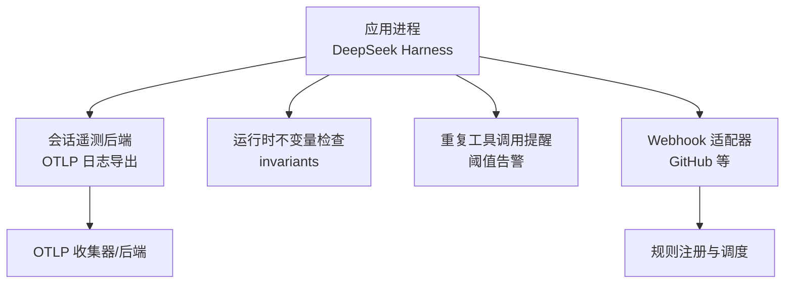
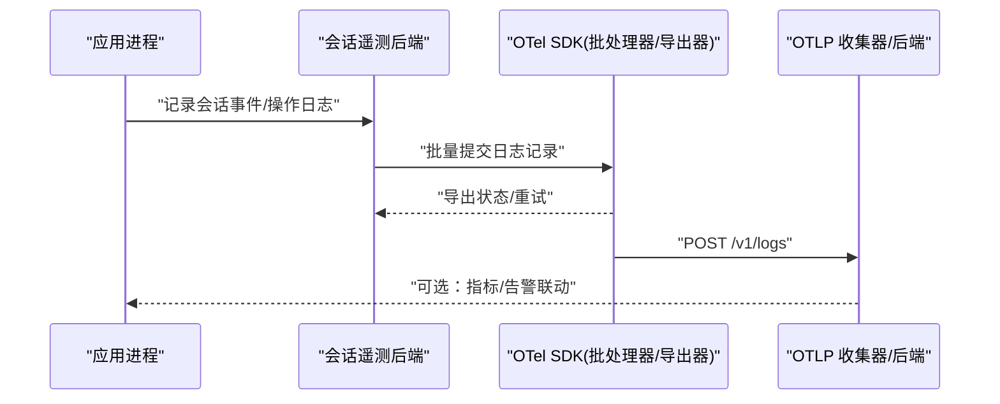
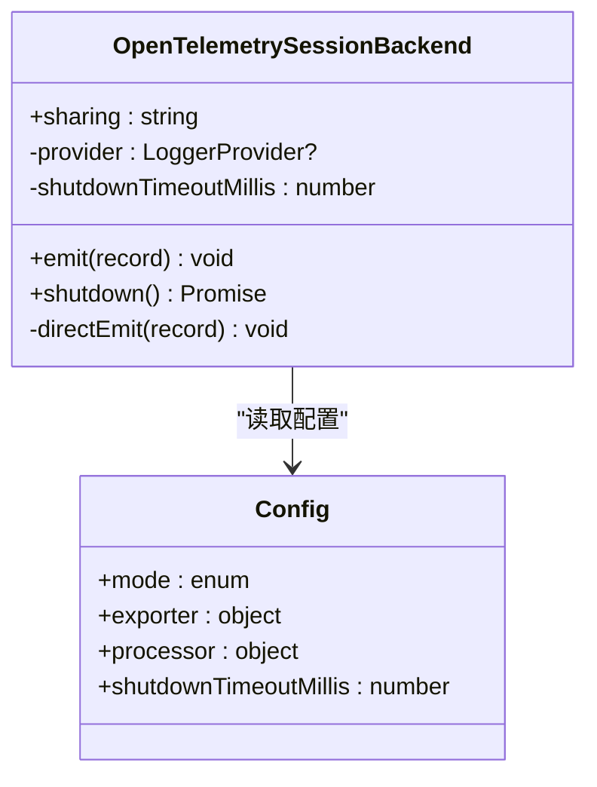
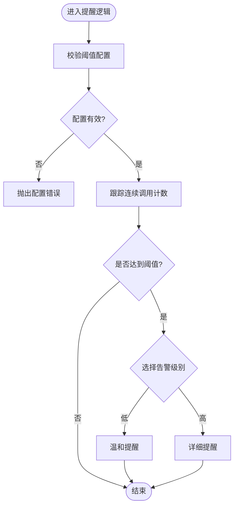
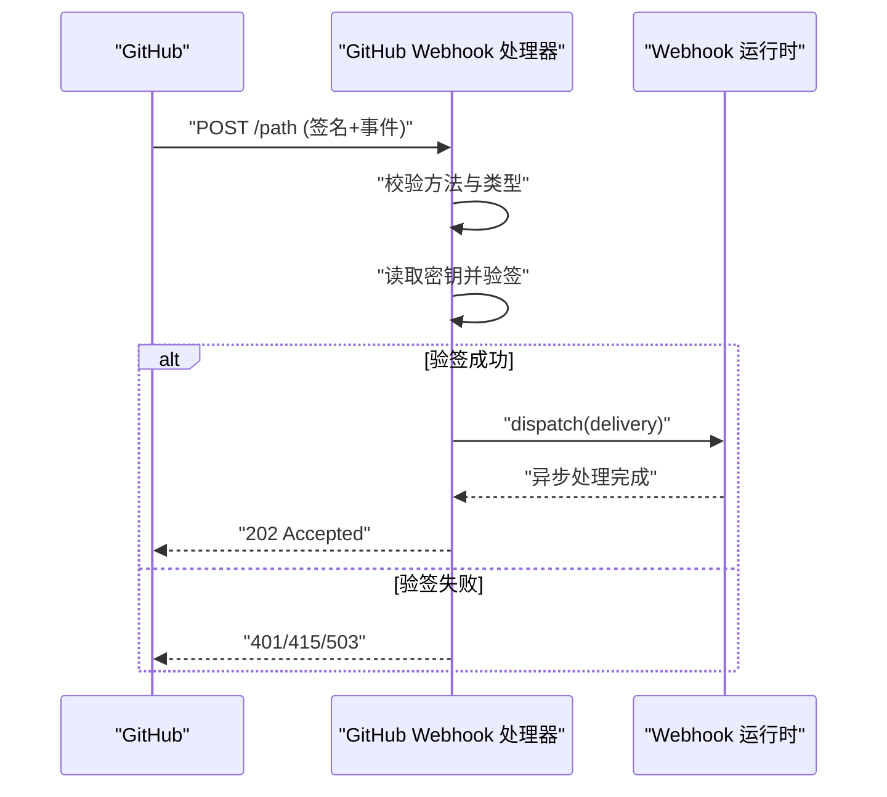
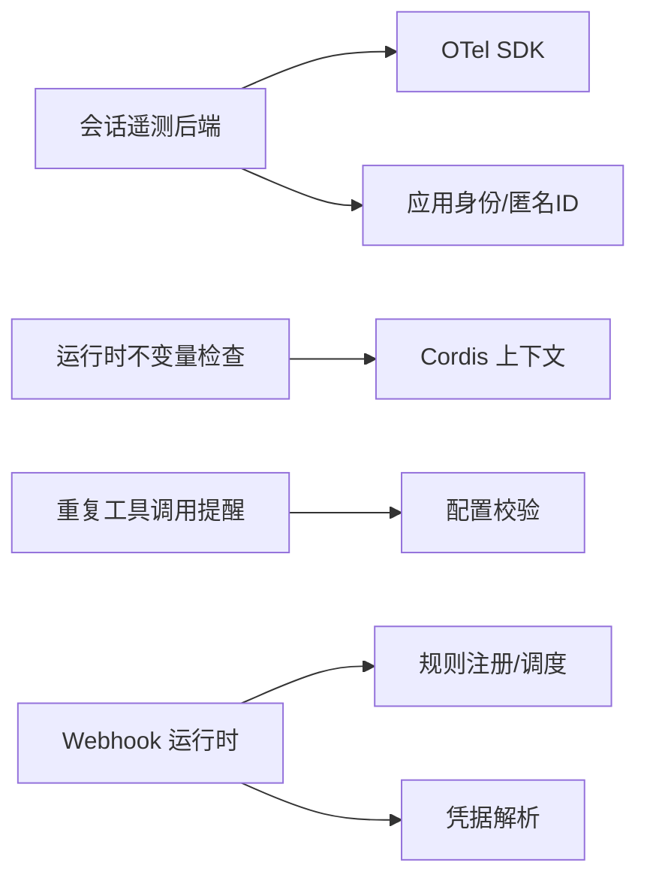

# 监控告警系统

<cite>
**本文引用的文件**
- [packages/session/session-telemetry-otel/src/index.ts](file://packages/session/session-telemetry-otel/src/index.ts)
- [packages/guard/repeat-tool-reminder/src/index.ts](file://packages/guard/repeat-tool-reminder/src/index.ts)
- [packages/webhook/webhook-github/src/handler.ts](file://packages/webhook/webhook-github/src/handler.ts)
- [packages/webhook/webhook/src/index.ts](file://packages/webhook/webhook/src/index.ts)
- [apps/web/tests/expected/schedule-after/every-conversation.expected.md](file://apps/web/tests/expected/schedule-after/every-conversation.expected.md)
- [packages/runtime-diagnostics/README.md](file://packages/runtime-diagnostics/README.md)
- [.agents/notes/implemented/feature/2026-08-25-feedback-gated-telemetry-default.md](file://.agents/notes/implemented/feature/2026-08-25-feedback-gated-telemetry-default.md)
</cite>

## 目录
1. [简介](#简介)
2. [项目结构](#项目结构)
3. [核心组件](#核心组件)
4. [架构总览](#架构总览)
5. [详细组件分析](#详细组件分析)
6. [依赖关系分析](#依赖关系分析)
7. [性能考量](#性能考量)
8. [故障排查指南](#故障排查指南)
9. [结论](#结论)
10. [附录](#附录)

## 简介
本文件面向 DeepSeek Harness 的监控与告警体系，聚焦以下目标：
- 关键指标监控：CPU、内存、磁盘使用率与应用性能指标（错误率、延迟等）
- 异常检测机制：错误率监控、延迟监控、资源使用异常检测
- 告警规则配置：阈值设置、告警级别、通知渠道
- 监控工具集成：Prometheus、Grafana 等
- 日志聚合与分析：ELK Stack、Loki 等

说明：本仓库提供了会话遥测（OTLP 日志导出）、运行时不变量检查、以及基于阈值的重复调用提醒等能力。结合这些能力，可构建完整的“采集—传输—可视化—告警”闭环。

## 项目结构
围绕监控告警的相关代码主要分布在以下位置：
- 会话遥测后端（OTLP/HTTP 日志导出）：packages/session/session-telemetry-otel
- 运行时不变量检查（运行时自校验）：packages/runtime-diagnostics
- 重复工具调用提醒（阈值告警示例）：packages/guard/repeat-tool-reminder
- Webhook 事件处理（外部事件接入示例）：packages/webhook/*
- 测试与期望输出（用于验证行为）：apps/web/tests/expected/...

图表来源
- [packages/session/session-telemetry-otel/src/index.ts:147-253](file://packages/session/session-telemetry-otel/src/index.ts#L147-L253)
- [packages/runtime-diagnostics/README.md:10-37](file://packages/runtime-diagnostics/README.md#L10-L37)
- [packages/guard/repeat-tool-reminder/src/index.ts:123-141](file://packages/guard/repeat-tool-reminder/src/index.ts#L123-L141)
- [packages/webhook/webhook-github/src/handler.ts:72-102](file://packages/webhook/webhook-github/src/handler.ts#L72-L102)
- [packages/webhook/webhook/src/index.ts:121-175](file://packages/webhook/webhook/src/index.ts#L121-L175)

章节来源
- [packages/session/session-telemetry-otel/src/index.ts:147-253](file://packages/session/session-telemetry-otel/src/index.ts#L147-L253)
- [packages/runtime-diagnostics/README.md:10-37](file://packages/runtime-diagnostics/README.md#L10-L37)
- [packages/guard/repeat-tool-reminder/src/index.ts:123-141](file://packages/guard/repeat-tool-reminder/src/index.ts#L123-L141)
- [packages/webhook/webhook-github/src/handler.ts:72-102](file://packages/webhook/webhook-github/src/handler.ts#L72-L102)
- [packages/webhook/webhook/src/index.ts:121-175](file://packages/webhook/webhook/src/index.ts#L121-L175)

## 核心组件
- 会话遥测后端（OpenTelemetry Session Backend）
  - 负责将会话事件以 OTLP 日志形式批量导出到远端收集器
  - 支持三种共享模式：FULL、FEEDBACK_ONLY、DISABLED
  - 通过 BatchLogRecordProcessor 进行批处理与重试，提供 shutdown 超时保护
- 运行时不变量检查（Runtime Invariants）
  - 在运行期对包内持久化事件和数据关系进行自校验，违规时上报错误并归属到对应包
- 重复工具调用提醒（Repeat Tool Reminder）
  - 基于配置的阈值序列触发不同级别的提醒，体现“阈值—级别—动作”的告警范式
- Webhook 事件处理
  - 接收外部认证事件并进行本地分发，可作为外部指标或告警事件的入口

章节来源
- [packages/session/session-telemetry-otel/src/index.ts:43-125](file://packages/session/session-telemetry-otel/src/index.ts#L43-L125)
- [packages/session/session-telemetry-otel/src/index.ts:147-253](file://packages/session/session-telemetry-otel/src/index.ts#L147-L253)
- [packages/runtime-diagnostics/README.md:10-37](file://packages/runtime-diagnostics/README.md#L10-L37)
- [packages/guard/repeat-tool-reminder/src/index.ts:123-141](file://packages/guard/repeat-tool-reminder/src/index.ts#L123-L141)
- [packages/webhook/webhook/src/index.ts:121-175](file://packages/webhook/webhook/src/index.ts#L121-L175)

## 架构总览
下图展示了从应用内部事件到 OTLP 后端的完整链路，以及与 Webhook 事件接入的关系。

图表来源
- [packages/session/session-telemetry-otel/src/index.ts:197-236](file://packages/session/session-telemetry-otel/src/index.ts#L197-L236)
- [packages/session/session-telemetry-otel/src/index.ts:283-298](file://packages/session/session-telemetry-otel/src/index.ts#L283-L298)

## 详细组件分析

### 组件A：会话遥测后端（OTLP 日志导出）
- 功能要点
  - 配置项包含 mode、exporter、processor、shutdownTimeoutMillis
  - 非 DISABLED 模式要求 exporter.url 为有效 http(s) URL
  - 批处理器参数 maxExportBatchSize 必须为正整数
  - 关闭路径带有超时保护，避免无限等待
- 数据流
  - 应用侧通过 emit 发送记录
  - 由 LoggerProvider + BatchLogRecordProcessor 统一批处理
  - OTLPLogExporter 将记录发送到远端收集器
- 共享策略
  - FULL：实时导出所有记录
  - FEEDBACK_ONLY：仅在用户记录反馈时回放未共享的记录
  - DISABLED：不导出任何内容，仅本地警告

图表来源
- [packages/session/session-telemetry-otel/src/index.ts:91-125](file://packages/session/session-telemetry-otel/src/index.ts#L91-L125)
- [packages/session/session-telemetry-otel/src/index.ts:147-253](file://packages/session/session-telemetry-otel/src/index.ts#L147-L253)
- [packages/session/session-telemetry-otel/src/index.ts:283-298](file://packages/session/session-telemetry-otel/src/index.ts#L283-L298)

章节来源
- [packages/session/session-telemetry-otel/src/index.ts:91-125](file://packages/session/session-telemetry-otel/src/index.ts#L91-L125)
- [packages/session/session-telemetry-otel/src/index.ts:147-253](file://packages/session/session-telemetry-otel/src/index.ts#L147-L253)
- [packages/session/session-telemetry-otel/src/index.ts:283-298](file://packages/session/session-telemetry-otel/src/index.ts#L283-L298)

### 组件B：运行时不变量检查（Runtime Invariants）
- 作用
  - 在运行期对包内持久化事件与数据关系进行自校验
  - 违规时以错误形式上报，并归属到具体包，便于定位
- 适用场景
  - 作为“健康探针”，辅助发现数据一致性问题
  - 与日志/指标管道结合，形成异常检测基础

章节来源
- [packages/runtime-diagnostics/README.md:10-37](file://packages/runtime-diagnostics/README.md#L10-L37)

### 组件C：重复工具调用提醒（阈值告警示例）
- 功能要点
  - 阈值数组需为非空、互异且≥2的整数，内部会排序
  - 不同阈值触发不同级别的提醒（温和提示与详细信息）
- 告警范式
  - 阈值：可配置的多级阈值
  - 级别：按阈值递增提升告警强度
  - 动作：上下文注入提醒信息，便于后续自动化或人工处置

图表来源
- [packages/guard/repeat-tool-reminder/src/index.ts:123-141](file://packages/guard/repeat-tool-reminder/src/index.ts#L123-L141)

章节来源
- [packages/guard/repeat-tool-reminder/src/index.ts:123-141](file://packages/guard/repeat-tool-reminder/src/index.ts#L123-L141)

### 组件D：Webhook 事件处理（外部事件接入）
- GitHub Webhook 处理器
  - 校验请求方法、Content-Type、签名与必要头
  - 读取密钥并验签，失败返回相应 HTTP 状态码
- 规则调度
  - 注册规则、启动调用、生命周期管理（中止与清理）

图表来源
- [packages/webhook/webhook-github/src/handler.ts:72-102](file://packages/webhook/webhook-github/src/handler.ts#L72-L102)
- [packages/webhook/webhook/src/index.ts:121-175](file://packages/webhook/webhook/src/index.ts#L121-L175)

章节来源
- [packages/webhook/webhook-github/src/handler.ts:72-102](file://packages/webhook/webhook-github/src/handler.ts#L72-L102)
- [packages/webhook/webhook/src/index.ts:121-175](file://packages/webhook/webhook/src/index.ts#L121-L175)

## 依赖关系分析
- 会话遥测后端依赖
  - OpenTelemetry SDK（LoggerProvider、BatchLogRecordProcessor、OTLPLogExporter）
  - 应用身份与匿名用户 ID（用于资源属性）
- 运行时不变量检查
  - 与 Cordis 上下文和包内服务注册耦合
- 重复工具调用提醒
  - 依赖配置校验与上下文注入机制
- Webhook
  - 依赖 WebServer、Credentials、规则注册与调度

图表来源
- [packages/session/session-telemetry-otel/src/index.ts:197-236](file://packages/session/session-telemetry-otel/src/index.ts#L197-L236)
- [packages/runtime-diagnostics/README.md:22-37](file://packages/runtime-diagnostics/README.md#L22-L37)
- [packages/guard/repeat-tool-reminder/src/index.ts:123-141](file://packages/guard/repeat-tool-reminder/src/index.ts#L123-L141)
- [packages/webhook/webhook/src/index.ts:121-175](file://packages/webhook/webhook/src/index.ts#L121-L175)

章节来源
- [packages/session/session-telemetry-otel/src/index.ts:197-236](file://packages/session/session-telemetry-otel/src/index.ts#L197-L236)
- [packages/runtime-diagnostics/README.md:22-37](file://packages/runtime-diagnostics/README.md#L22-L37)
- [packages/guard/repeat-tool-reminder/src/index.ts:123-141](file://packages/guard/repeat-tool-reminder/src/index.ts#L123-L141)
- [packages/webhook/webhook/src/index.ts:121-175](file://packages/webhook/webhook/src/index.ts#L121-L175)

## 性能考量
- 批处理与导出
  - 通过 BatchLogRecordProcessor 控制批次大小与调度间隔，降低网络开销
  - 合理设置 maxExportBatchSize，避免队列堆积导致关闭阻塞
- 关闭超时
  - 提供 shutdownTimeoutMillis 限制 provider 关闭等待时间，防止进程挂起
- 资源属性
  - 使用 service.name/version 与 user.id 作为资源属性，便于后端聚合与去重
- 前端性能指标（参考）
  - 浏览器性能 API 可用于 DOM 节点数、监听器数量、堆内存等指标采集，便于评估 UI 性能

章节来源
- [packages/session/session-telemetry-otel/src/index.ts:184-195](file://packages/session/session-telemetry-otel/src/index.ts#L184-L195)
- [packages/session/session-telemetry-otel/src/index.ts:283-298](file://packages/session/session-telemetry-otel/src/index.ts#L283-L298)
- [packages/session/session-telemetry-otel/src/index.ts:197-205](file://packages/session/session-telemetry-otel/src/index.ts#L197-L205)

## 故障排查指南
- 遥测导出失败
  - 检查 exporter.url 是否为有效 http(s) URL
  - 确认 maxExportBatchSize 为正整数，避免关闭时队列无法排空
  - 关注 shutdownTimeoutMillis 是否过短导致强制中断
- 反馈模式下的数据缺失
  - 默认模式下可能未启用遥测；当用户记录反馈时会回放未共享记录
  - 若反馈事件不在会话主日志中，将被忽略并记录警告
- 运行时不变量违规
  - 根据错误归属的包名定位问题，检查持久化事件与数据关系
- Webhook 验签失败
  - 检查 Content-Type、签名头、密钥是否正确
  - 注意方法限制（仅 POST）与最大请求体大小

章节来源
- [packages/session/session-telemetry-otel/src/index.ts:170-195](file://packages/session/session-telemetry-otel/src/index.ts#L170-L195)
- [packages/session/session-telemetry-otel/src/index.ts:283-298](file://packages/session/session-telemetry-otel/src/index.ts#L283-L298)
- [.agents/notes/implemented/feature/2026-08-25-feedback-gated-telemetry-default.md:1-13](file://.agents/notes/implemented/feature/2026-08-25-feedback-gated-telemetry-default.md#L1-L13)
- [packages/webhook/webhook-github/src/handler.ts:72-102](file://packages/webhook/webhook-github/src/handler.ts#L72-L102)

## 结论
- 本仓库提供了会话遥测（OTLP）、运行时不变量检查、阈值型提醒与 Webhook 事件接入等关键能力，可作为监控告警体系的基石
- 建议结合 Prometheus/Grafana 与 ELK/Loki 构建端到端监控：
  - 指标：系统资源（CPU/内存/磁盘）与应用性能（错误率/延迟）
  - 日志：通过 OTLP 导出至收集器，再汇聚到日志平台
  - 告警：基于阈值与规则引擎实现多级告警与通知
- 在生产部署中，务必合理配置批处理参数与关闭超时，确保稳定性与可观测性

## 附录

### 关键指标监控建议
- 系统资源
  - CPU 使用率、内存占用、磁盘 I/O 与使用率
- 应用性能
  - 错误率（HTTP 5xx、业务错误）、P95/P99 延迟、吞吐
- 会话与工具
  - 工具调用次数、重复调用次数、失败重试次数

### 异常检测机制
- 错误率监控：统计单位时间内错误比例，超过阈值触发告警
- 延迟监控：计算分位延迟，突增时预警
- 资源使用异常：内存泄漏、CPU 飙升、磁盘满等

### 告警规则配置
- 阈值设置：多级阈值（如 3/5/10），不同级别对应不同动作
- 告警级别：info/warn/error，与严重度映射
- 通知渠道：邮件、IM、Webhook 等

### 监控工具集成方案
- Prometheus + Grafana
  - 指标采集：Node Exporter、cAdvisor、应用自定义指标
  - 可视化：仪表盘、SLO/SLI 看板
  - 告警：Alertmanager 路由与抑制
- 日志聚合与分析
  - ELK Stack：Filebeat/Fluent Bit -> Logstash -> Elasticsearch -> Kibana
  - Loki：轻量日志聚合，配合 Promtail 采集，Grafana 查询

### 与仓库能力的对接
- 将 OTLP 日志导入 Loki/Elasticsearch，建立会话与工具调用的可观测视图
- 利用运行时不变量检查结果作为健康探针，纳入 Grafana 健康看板
- 将重复工具调用提醒作为业务告警源，接入 Alertmanager

章节来源
- [apps/web/tests/expected/schedule-after/every-conversation.expected.md:1-2](file://apps/web/tests/expected/schedule-after/every-conversation.expected.md#L1-L2)
- [packages/session/session-telemetry-otel/src/index.ts:43-125](file://packages/session/session-telemetry-otel/src/index.ts#L43-L125)
- [packages/runtime-diagnostics/README.md:10-37](file://packages/runtime-diagnostics/README.md#L10-L37)
- [packages/guard/repeat-tool-reminder/src/index.ts:123-141](file://packages/guard/repeat-tool-reminder/src/index.ts#L123-L141)