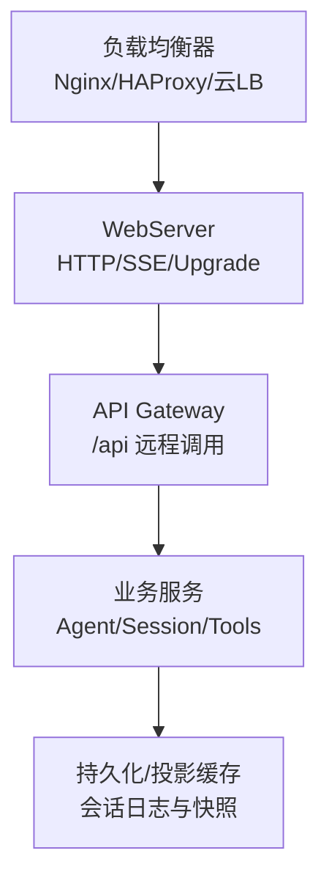
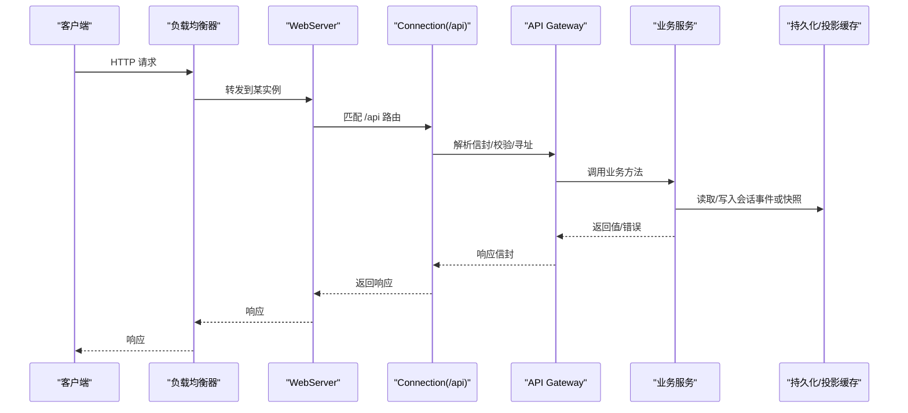
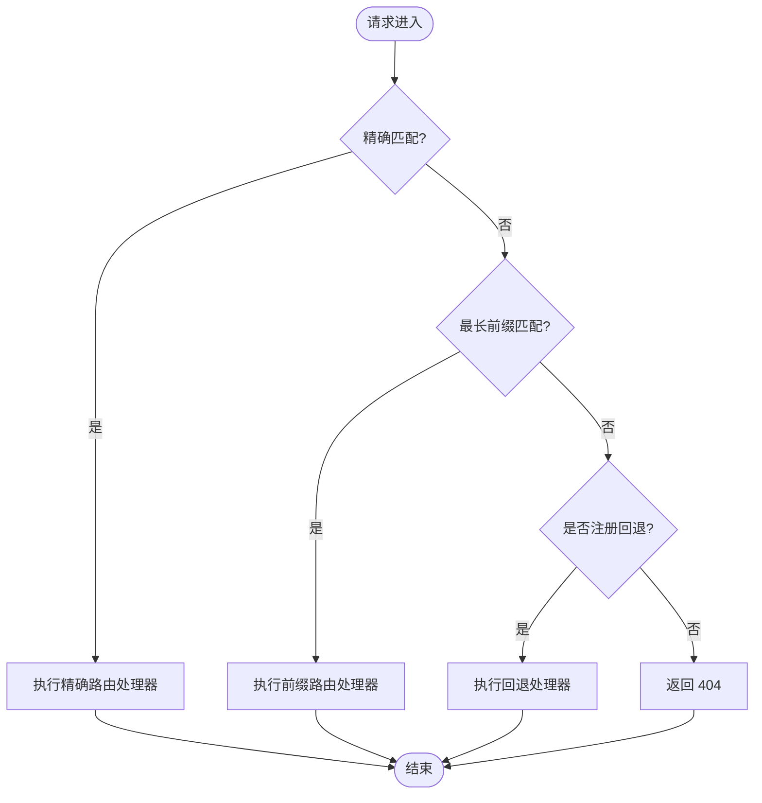
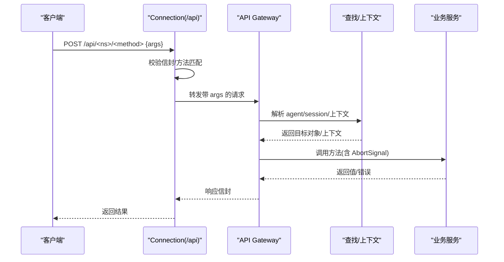
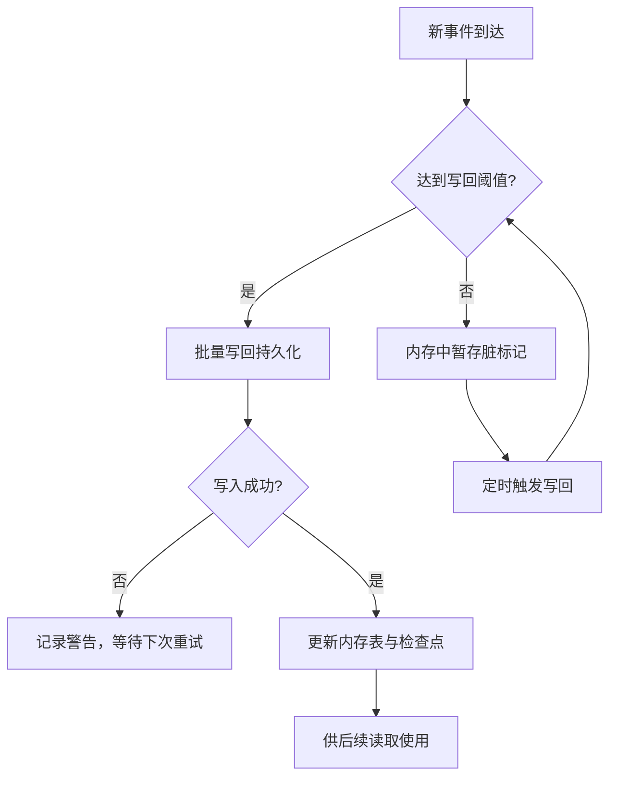
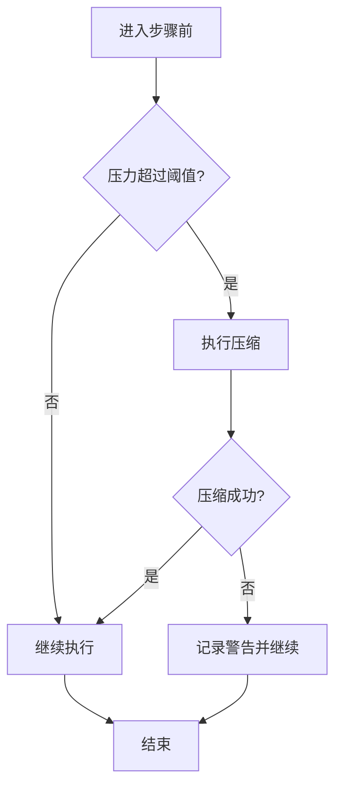
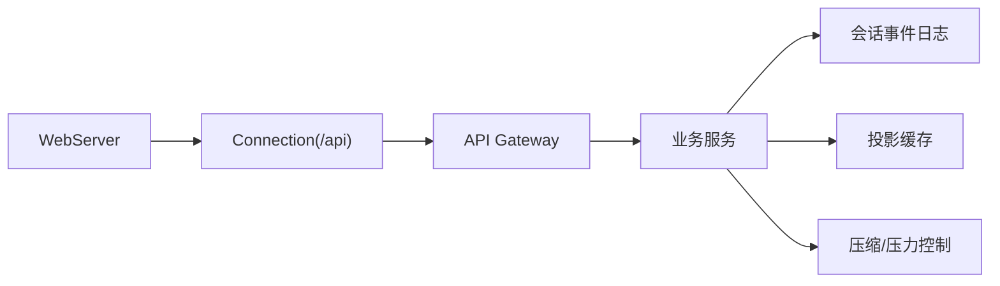

# 负载均衡与高可用

<cite>
**本文引用的文件**
- [packages/host/webserver/src/index.ts](file://packages/host/webserver/src/index.ts)
- [docs/subsystems/web-server.zh.md](file://docs/subsystems/web-server.zh.md)
- [docs/api-gateway.md](file://docs/api-gateway.md)
- [packages/client/connection/src/rpc-host.ts](file://packages/client/connection/src/rpc-host.ts)
- [packages/compaction/compaction-basic/src/index.ts](file://packages/compaction/compaction-basic/src/index.ts)
- [packages/session/session-projection-cache/src/index.ts](file://packages/session/session-projection-cache/src/index.ts)
- [packages/session/session-projection-cache/README.zh.md](file://packages/session/session-projection-cache/README.zh.md)
- [packages/api/session-controller/src/client/sessions/manager.ts](file://packages/api/session-controller/src/client/sessions/manager.ts)
- [docs/architecture.md](file://docs/architecture.md)
</cite>

## 目录
1. [简介](#简介)
2. [项目结构](#项目结构)
3. [核心组件](#核心组件)
4. [架构总览](#架构总览)
5. [详细组件分析](#详细组件分析)
6. [依赖关系分析](#依赖关系分析)
7. [性能考虑](#性能考虑)
8. [故障排查指南](#故障排查指南)
9. [结论](#结论)
10. [附录](#附录)

## 简介
本文件面向 DeepSeek Harness 的“多实例部署、负载均衡与高可用”主题，结合代码库中的 Web 服务器、API Gateway、连接层与会话持久化能力，给出可落地的部署策略与运维建议。重点包括：
- 无状态服务设计与会话共享方案
- 负载均衡器（Nginx/HAProxy/云厂商）配置要点
- 健康检查、自动重启与服务发现
- 水平/垂直扩缩容策略
- 性能调优与容量规划

## 项目结构
DeepSeek Harness 采用插件化架构（Cordis），通过 Profile/Bundles 组合运行态。Web 服务器提供 HTTP 路由与升级通道；API Gateway 将业务 Remote 方法暴露为 /api 端点；连接层负责 RPC 信封、信任边界与取消；会话子系统提供事件日志与投影缓存，支撑冷启动恢复与跨实例一致性。

图表来源
- [packages/host/webserver/src/index.ts:117-315](file://packages/host/webserver/src/index.ts#L117-L315)
- [docs/api-gateway.md:119-128](file://docs/api-gateway.md#L119-L128)
- [packages/session/session-projection-cache/src/index.ts:68-87](file://packages/session/session-projection-cache/src/index.ts#L68-L87)

章节来源
- [docs/architecture.md:9-47](file://docs/architecture.md#L9-L47)
- [docs/subsystems/web-server.zh.md:1-53](file://docs/subsystems/web-server.zh.md#L1-L53)

## 核心组件
- Web 服务器（WebServer）
  - 绑定 host/port，注册 exact/prefix 路由与 upgrade 路由，支持 gzip 压缩与 index.html 注入。
  - 监听失败即初始化失败，便于编排层快速感知并重启。
- API Gateway（Typert Gateway + Connection）
  - 将业务服务以 Remote 方式暴露到 /api，统一信封、校验、寻址与取消。
  - 连接层承担信任检查、RPC ID、响应封装与请求取消。
- 会话与投影缓存
  - 会话事件日志作为唯一事实源；投影缓存按写回策略持久化，崩溃后不领先于日志，支持冷恢复。
- 压缩与压力控制
  - 基于 token 计量与 compaction 在步骤前进行主动压缩，避免上下文溢出导致请求失败。

章节来源
- [packages/host/webserver/src/index.ts:124-186](file://packages/host/webserver/src/index.ts#L124-L186)
- [docs/api-gateway.md:80-128](file://docs/api-gateway.md#L80-L128)
- [packages/session/session-projection-cache/src/index.ts:55-87](file://packages/session/session-projection-cache/src/index.ts#L55-L87)
- [packages/compaction/compaction-basic/src/index.ts:132-165](file://packages/compaction/compaction-basic/src/index.ts#L132-L165)

## 架构总览
下图展示从客户端到后端服务的典型请求路径，以及流式/升级通道的处理位置。

图表来源
- [packages/host/webserver/src/index.ts:219-315](file://packages/host/webserver/src/index.ts#L219-L315)
- [packages/client/connection/src/rpc-host.ts:219-257](file://packages/client/connection/src/rpc-host.ts#L219-L257)
- [docs/api-gateway.md:119-128](file://docs/api-gateway.md#L119-L128)
- [packages/session/session-projection-cache/src/index.ts:68-87](file://packages/session/session-projection-cache/src/index.ts#L68-L87)

## 详细组件分析

### Web 服务器与无状态设计
- 绑定与路由
  - 支持 loopback 或全接口绑定；exact 优先、最长前缀次之、最后回退。
  - 重复路由会抛错，确保组合契约清晰。
- 压缩与流
  - 可选 gzip，跳过 SSE、Range、ZIP 等 identity 响应。
  - 支持 HTTP Upgrade 路由，适合 WebSocket 等长连接。
- 进程级健壮性
  - 监听失败拒绝初始化；异常请求记录警告并返回 400，不退出进程。
  - 优雅关闭时显式销毁已升级 socket，避免挂起。

图表来源
- [packages/host/webserver/src/index.ts:317-327](file://packages/host/webserver/src/index.ts#L317-L327)
- [packages/host/webserver/src/index.ts:219-256](file://packages/host/webserver/src/index.ts#L219-L256)

章节来源
- [packages/host/webserver/src/index.ts:117-315](file://packages/host/webserver/src/index.ts#L117-L315)
- [docs/subsystems/web-server.zh.md:1-53](file://docs/subsystems/web-server.zh.md#L1-L53)

### API Gateway 与连接层
- 远程调用模型
  - 业务服务通过 @Remote/@RemoteScope 暴露方法；构建期生成严格描述符与编解码器。
  - 运行时根据描述符校验参数、解析对象/Context、调用服务并验证返回值。
- 连接层职责
  - 统一信任检查、RPC ID、响应信封、请求取消；/api 桥接由连接层持有。
- 会话恢复与冷启动
  - 会话控制器负责 Agent/Session 身份策略与查找，支持冷会话自动恢复与并发去重。

图表来源
- [packages/client/connection/src/rpc-host.ts:219-257](file://packages/client/connection/src/rpc-host.ts#L219-L257)
- [docs/api-gateway.md:119-128](file://docs/api-gateway.md#L119-L128)

章节来源
- [docs/api-gateway.md:1-165](file://docs/api-gateway.md#L1-L165)
- [packages/client/connection/src/rpc-host.ts:219-257](file://packages/client/connection/src/rpc-host.ts#L219-L257)

### 会话共享与投影缓存
- 事件日志为唯一事实源，投影缓存按写回策略（计数/时间）持久化，并在创建、turn/end、释放时强制检查点。
- 崩溃后缓存可能落后但不会领先；读取只接受版本与 schema 匹配的记录，保证一致性。
- 连接断开后可刷新列表与子代理目录，实现断线重连后的数据自愈。

图表来源
- [packages/session/session-projection-cache/src/index.ts:55-87](file://packages/session/session-projection-cache/src/index.ts#L55-L87)
- [packages/session/session-projection-cache/README.zh.md:59-75](file://packages/session/session-projection-cache/README.zh.md#L59-L75)
- [packages/api/session-controller/src/client/sessions/manager.ts:798-825](file://packages/api/session-controller/src/client/sessions/manager.ts#L798-L825)

章节来源
- [packages/session/session-projection-cache/src/index.ts:55-87](file://packages/session/session-projection-cache/src/index.ts#L55-L87)
- [packages/session/session-projection-cache/README.zh.md:59-75](file://packages/session/session-projection-cache/README.zh.md#L59-L75)
- [packages/api/session-controller/src/client/sessions/manager.ts:798-825](file://packages/api/session-controller/src/client/sessions/manager.ts#L798-L825)

### 压缩与压力控制（影响多实例稳定性）
- 步骤前自动压缩：在 agent/pre-step 钩子中评估压力，必要时压缩历史，避免上下文溢出。
- 失败降级：压缩失败仅告警并继续本轮，保障可用性。

图表来源
- [packages/compaction/compaction-basic/src/index.ts:132-165](file://packages/compaction/compaction-basic/src/index.ts#L132-L165)

章节来源
- [packages/compaction/compaction-basic/src/index.ts:132-165](file://packages/compaction/compaction-basic/src/index.ts#L132-L165)

## 依赖关系分析
- WebServer 提供 HTTP 入口，连接层在其之上实现 /api 桥接；API Gateway 再向上暴露业务 Remote。
- 会话子系统通过事件日志与投影缓存为上层提供一致视图，支撑冷恢复与跨实例共享。
- 压缩与压力控制作为横切关注点，在步骤前介入，降低 OOM/超时风险。

图表来源
- [packages/host/webserver/src/index.ts:117-315](file://packages/host/webserver/src/index.ts#L117-L315)
- [docs/api-gateway.md:119-128](file://docs/api-gateway.md#L119-L128)
- [packages/session/session-projection-cache/src/index.ts:68-87](file://packages/session/session-projection-cache/src/index.ts#L68-L87)
- [packages/compaction/compaction-basic/src/index.ts:132-165](file://packages/compaction/compaction-basic/src/index.ts#L132-L165)

章节来源
- [docs/architecture.md:9-47](file://docs/architecture.md#L9-L47)

## 性能考虑
- 网络与传输
  - 启用 gzip 压缩以降低带宽占用；对 SSE/Range/ZIP 保持 identity 响应。
  - 合理设置压缩级别与阈值，平衡 CPU 与带宽。
- 会话与存储
  - 调整投影缓存写回间隔与批次数，减少磁盘 IO 抖动。
  - 利用 turn/end 与释放时的强制检查点，缩短冷恢复时间。
- 计算与内存
  - 通过步骤前压缩避免上下文过大导致的 LLM 调用失败与资源紧张。
  - 监控 token 用量与上下文窗口，动态调整压缩策略。
- 容量规划
  - 单实例 QPS × 实例数 = 集群吞吐；结合模型提供方限流与配额规划实例规模。
  - 针对长会话场景预留更多内存与磁盘空间，避免频繁换盘与 GC 停顿。

[本节为通用指导，不直接分析具体文件]

## 故障排查指南
- 启动与监听
  - 监听失败（端口占用等）会导致初始化失败，应检查端口冲突与权限。
  - 异常请求（畸形 URL、客户端中断）会记录警告并返回 400，不退出进程。
- 连接与网关
  - /api 请求需满足信封与方法匹配；非法请求将返回 bad-request。
  - 缺失 Provider、未知标识、参数不匹配会在进入业务前失败，便于定位。
- 会话恢复
  - 连接重建后会刷新会话列表与子代理目录，若数据未同步，检查投影缓存写回与日志完整性。
- 压缩与压力
  - 压缩失败仅告警并继续；若频繁触发压缩，需评估上下文增长与模型窗口限制。

章节来源
- [packages/host/webserver/src/index.ts:219-315](file://packages/host/webserver/src/index.ts#L219-L315)
- [packages/client/connection/src/rpc-host.ts:219-257](file://packages/client/connection/src/rpc-host.ts#L219-L257)
- [docs/api-gateway.md:119-128](file://docs/api-gateway.md#L119-L128)
- [packages/api/session-controller/src/client/sessions/manager.ts:798-825](file://packages/api/session-controller/src/client/sessions/manager.ts#L798-L825)
- [packages/compaction/compaction-basic/src/index.ts:132-165](file://packages/compaction/compaction-basic/src/index.ts#L132-L165)

## 结论
DeepSeek Harness 通过 WebServer、API Gateway、连接层与会话持久化的协同，天然支持无状态多实例部署与横向扩展。配合外部负载均衡与健康检查，可实现高可用与弹性伸缩；借助投影缓存与步骤前压缩，可在故障与压力下保持稳定。建议在部署中明确会话共享策略（如外部会话存储）、配置合理的压缩与写回参数，并建立完善的监控与自愈机制。

[本节为总结，不直接分析具体文件]

## 附录

### 多实例部署与无状态设计
- 应用层无状态
  - 将会话状态外置到共享存储（文件系统/数据库/对象存储），进程内仅保留热态。
  - 利用投影缓存的写回与强制检查点，确保崩溃后能冷恢复。
- 会话共享方案
  - 使用共享存储域存放会话事件与快照；各实例通过相同根目录访问。
  - 连接断开后自动刷新目录与会话，提升鲁棒性。

章节来源
- [packages/session/session-projection-cache/src/index.ts:55-87](file://packages/session/session-projection-cache/src/index.ts#L55-L87)
- [packages/session/session-projection-cache/README.zh.md:59-75](file://packages/session/session-projection-cache/README.zh.md#L59-L75)
- [packages/api/session-controller/src/client/sessions/manager.ts:798-825](file://packages/api/session-controller/src/client/sessions/manager.ts#L798-L825)

### 负载均衡器配置要点
- Nginx
  - 上游使用多个实例地址；开启 gzip 透传；对 /api 启用 keepalive 与超时控制。
  - 健康检查：定期探测 /health 或 /api 端点；失败剔除。
- HAProxy
  - 使用 TCP/HTTP 模式均可；配置 health-check 与慢请求检测；启用重试与连接复用。
- 云服务商负载均衡
  - 基于健康探针与自动扩缩组；将实例加入/移出池由探针状态驱动。

[本节为通用指导，不直接分析具体文件]

### 健康检查、自动重启与服务发现
- 健康检查
  - 在 WebServer 上暴露轻量 /health 路由；返回进程就绪与依赖状态。
  - 网关侧可附加 /api 连通性检查。
- 自动重启
  - 容器编排（Kubernetes/Systemd）监听进程退出码；失败立即重启。
- 服务发现
  - 使用 DNS/服务网格/云原生服务目录，使负载均衡器动态感知实例变化。

[本节为通用指导，不直接分析具体文件]

### 扩缩容策略
- 水平扩展
  - 增加实例数量，结合负载均衡轮询/加权；注意会话存储的读写并发与锁粒度。
- 垂直扩展
  - 提升 CPU/内存以应对大上下文与高并发；同时调整压缩阈值与写回批次。
- 弹性策略
  - 基于指标（CPU、QPS、延迟、token 用量）触发扩缩容；设置冷却时间与最小实例数。

[本节为通用指导，不直接分析具体文件]

### 性能调优清单
- 压缩：开启 gzip，合理设置 level 与 threshold；避免对 SSE/Range 压缩。
- 会话：调优 writeEveryEvents 与 writeIntervalMs；利用 turn/end 强制检查点。
- 网关：限制最大并发与超时；对 /api 启用连接复用。
- 监控：追踪请求延迟、错误率、压缩比、磁盘 IO、token 用量。

[本节为通用指导，不直接分析具体文件]