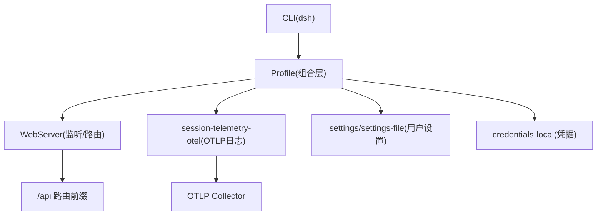
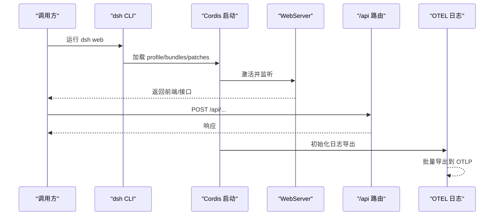
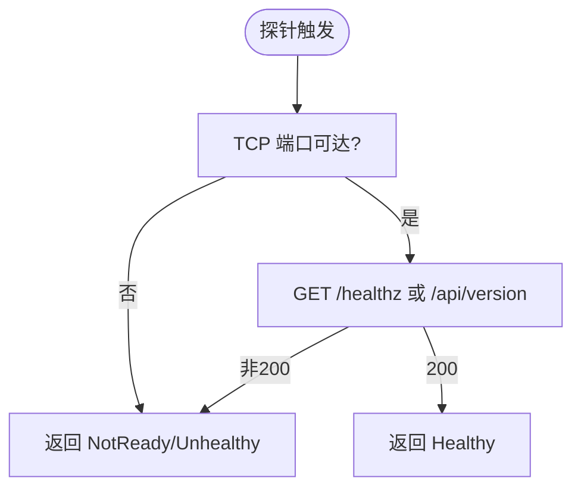
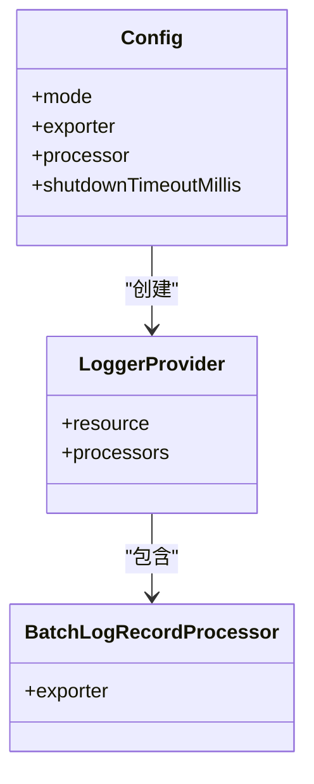
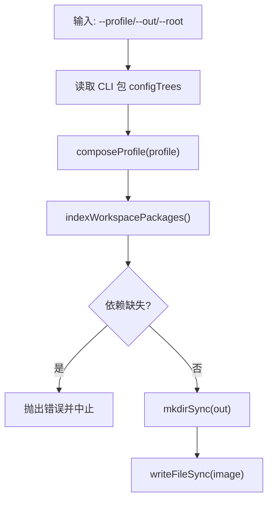
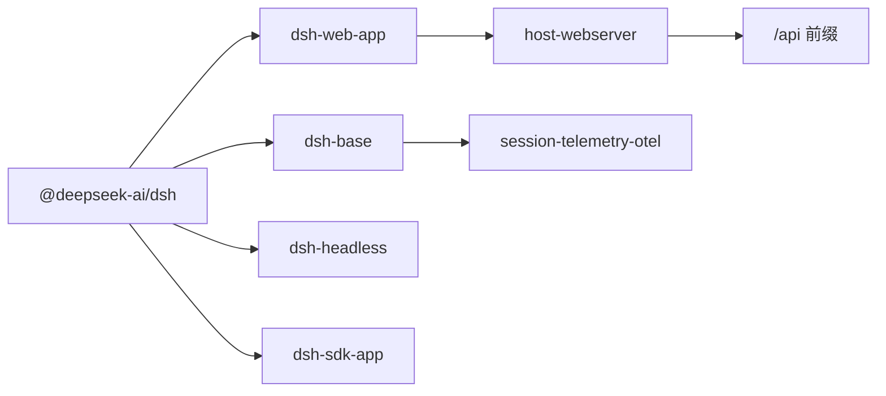

# 部署运维

<cite>
**本文引用的文件**
- [README.md](file://README.md)
- [apps/cli/package.json](file://apps/cli/package.json)
- [docs/architecture.md](file://docs/architecture.md)
- [docs/config-catalog.md](file://docs/config-catalog.md)
- [docs/subsystems/web-server.md](file://docs/subsystems/web-server.md)
- [packages/host/webserver/README.md](file://packages/host/webserver/README.md)
- [packages/client/connection/src/api-path.ts](file://packages/client/connection/src/api-path.ts)
- [packages/session/session-telemetry-otel/src/index.ts](file://packages/session/session-telemetry-otel/src/index.ts)
- [.agents/notes/implemented/feature/2026-08-25-feedback-gated-telemetry-default.md](file://.agents/notes/implemented/feature/2026-08-25-feedback-gated-telemetry-default.md)
- [.agents/notes/implemented/architecture/2026-08-04-configuration-source-ownership.md](file://.agents/notes/implemented/architecture/2026-08-04-configuration-source-ownership.md)
- [packages/experimental/webworker-packer/src/repository.ts](file://packages/experimental/webworker-packer/src/repository.ts)
- [packages/experimental/webworker-packer/src/bin.ts](file://packages/experimental/webworker-packer/src/bin.ts)
</cite>

## 目录
1. [简介](#简介)
2. [项目结构](#项目结构)
3. [核心组件](#核心组件)
4. [架构总览](#架构总览)
5. [详细组件分析](#详细组件分析)
6. [依赖关系分析](#依赖关系分析)
7. [性能与高可用](#性能与高可用)
8. [监控与告警](#监控与告警)
9. [日志管理](#日志管理)
10. [生产部署最佳实践](#生产部署最佳实践)
11. [故障排查指南](#故障排查指南)
12. [结论](#结论)

## 简介
本运维文档面向 DeepSeek Harness（dsh）的生产化容器化部署，覆盖 Docker 镜像构建、Kubernetes 服务编排、负载均衡与高可用、健康检查、监控告警、日志收集与查询，以及自动化脚本与最佳实践。dsh 采用“一切皆插件”的 Cordis 架构，通过 profile 与 bundle 在启动时组合出可替换的服务树；应用入口为 CLI 命令（如 dsh web），Web 服务器监听端口并提供 /api 路由前缀，会话与遥测等能力以插件形式挂载。

## 项目结构
- 应用入口：CLI 包提供 dsh 命令，支持 web、headless、sdk 等 profile。
- Web 服务：HTTP 服务器子系统负责监听、路由注册、静态资源回退与索引注入。
- 配置体系：生成式配置目录集中描述各插件可配置项；非机密值与凭据遵循两套优先级顺序。
- 遥测：OpenTelemetry 日志导出插件支持按模式上报，默认受反馈开关控制。
- 打包：实验性 VFS 打包工具可从仓库根组装 profile 并输出可部署镜像内容。

**图示来源**
- [docs/architecture.md:15-47](file://docs/architecture.md#L15-L47)
- [docs/subsystems/web-server.md:49-51](file://docs/subsystems/web-server.md#L49-L51)
- [packages/session/session-telemetry-otel/src/index.ts:86-125](file://packages/session/session-telemetry-otel/src/index.ts#L86-L125)
- [packages/client/connection/src/api-path.ts:1-7](file://packages/client/connection/src/api-path.ts#L1-L7)

**章节来源**
- [README.md:17-41](file://README.md#L17-L41)
- [docs/architecture.md:15-47](file://docs/architecture.md#L15-L47)

## 核心组件
- CLI 与 Profile：dsh 命令选择 profile（web/headless/sdk/acp），由 profile 声明的 bundles 与 patch 文件组合出运行时插件树。
- WebServer：激活即监听，失败则拒绝初始化；register(route) 注册具名路由；port 暴露实际监听端口（含 OS 分配）。
- 配置与凭据：非机密值与凭据各自有明确的优先级顺序；凭据优先来自进程环境，避免进入配置文件。
- 遥测：OTLP 日志导出插件支持多种模式与处理器选项，关闭/反馈/全量三种策略，带优雅关闭超时。
- 打包：VFS 打包器读取 CLI 包的 configTrees 声明，将配置树与 workspace 包纳入镜像产物。

**章节来源**
- [docs/architecture.md:15-47](file://docs/architecture.md#L15-L47)
- [docs/subsystems/web-server.md:49-51](file://docs/subsystems/web-server.md#L49-L51)
- [.agents/notes/implemented/architecture/2026-08-04-configuration-source-ownership.md:17-39](file://.agents/notes/implemented/architecture/2026-08-04-configuration-source-ownership.md#L17-L39)
- [packages/session/session-telemetry-otel/src/index.ts:86-125](file://packages/session/session-telemetry-otel/src/index.ts#L86-L125)
- [packages/experimental/webworker-packer/src/repository.ts:106-133](file://packages/experimental/webworker-packer/src/repository.ts#L106-L133)

## 架构总览
dsh 以 Cordis 为核心，profile 作为启动时的组合层，bundles 提供功能插件，patch 文件用于覆盖或插入行。所有能力（模型适配器、工具、持久化、沙箱、审批、设置、凭据、遥测等）均可通过配置替换。Web 服务器作为 HTTP 载体，不内置 TLS/认证，需由组合层或网关提供安全边界。

**图示来源**
- [docs/architecture.md:15-47](file://docs/architecture.md#L15-L47)
- [docs/subsystems/web-server.md:49-51](file://docs/subsystems/web-server.md#L49-L51)
- [packages/client/connection/src/api-path.ts:1-7](file://packages/client/connection/src/api-path.ts#L1-L7)
- [packages/session/session-telemetry-otel/src/index.ts:191-214](file://packages/session/session-telemetry-otel/src/index.ts#L191-L214)

## 详细组件分析

### Web 服务器与健康检查
- 行为：激活即监听，失败（如端口占用）会拒绝初始化；register 添加具名路由；port 返回实际端口。
- 安全：无全局 TLS/认证/Origin 策略，绑定非回环地址会暴露未保护路由，需由上层网关或连接插件限制 Host。
- 健康检查建议：
  - 就绪探针：GET /healthz 或 GET /ready（由组合层实现），返回 200 表示服务已监听且路由注册完成。
  - 存活探针：TCP 探测目标端口，确认 Node 进程存活。
  - 深度检查：访问 /api 下某个轻量端点（如版本信息）验证路由链路与依赖可用。

**图示来源**
- [docs/subsystems/web-server.md:49-51](file://docs/subsystems/web-server.md#L49-L51)
- [packages/host/webserver/README.md:109-114](file://packages/host/webserver/README.md#L109-L114)

**章节来源**
- [docs/subsystems/web-server.md:49-51](file://docs/subsystems/web-server.md#L49-L51)
- [packages/host/webserver/README.md:85-124](file://packages/host/webserver/README.md#L85-L124)

### 配置与凭据优先级（容器/CI 友好）
- 非机密值：显式运行参数 > 用户设置 > 组合层 > 当前 shell 环境 > 发现的文件 .env > 默认值。
- 凭据：进程环境 > $DSH_HOME/.credentials.yaml > 工作目录 .env > $DSH_HOME/.env。
- 部署建议：
  - 使用环境变量注入敏感值（如 API Key、Endpoint），避免写入镜像或配置清单。
  - 通过 profile/patch 固定非机密配置，确保可审计与可回滚。

**章节来源**
- [.agents/notes/implemented/architecture/2026-08-04-configuration-source-ownership.md:17-39](file://.agents/notes/implemented/architecture/2026-08-04-configuration-source-ownership.md#L17-L39)

### 遥测与反馈门控
- 模式：DISABLED/FEEDBACK_ONLY/FULL，默认受共享基础配置影响；反馈模式下仅上传尚未共享的会话记录。
- 导出：通过 OTLP HTTP 导出器，支持 headers/timeout/compression/keepAlive 等 SDK 选项；BatchLogRecordProcessor 批处理。
- 优雅关闭：shutdownTimeoutMillis 控制等待 Provider 完全关闭的时间。

**图示来源**
- [packages/session/session-telemetry-otel/src/index.ts:86-125](file://packages/session/session-telemetry-otel/src/index.ts#L86-L125)
- [packages/session/session-telemetry-otel/src/index.ts:191-214](file://packages/session/session-telemetry-otel/src/index.ts#L191-L214)
- [.agents/notes/implemented/feature/2026-08-25-feedback-gated-telemetry-default.md:1-13](file://.agents/notes/implemented/feature/2026-08-25-feedback-gated-telemetry-default.md#L1-L13)

**章节来源**
- [packages/session/session-telemetry-otel/src/index.ts:86-125](file://packages/session/session-telemetry-otel/src/index.ts#L86-L125)
- [.agents/notes/implemented/feature/2026-08-25-feedback-gated-telemetry-default.md:1-13](file://.agents/notes/implemented/feature/2026-08-25-feedback-gated-telemetry-default.md#L1-L13)

### 镜像构建与打包
- 入口：实验性 VFS 打包器从仓库根读取 profile、workspace 包与 configTrees 声明，产出镜像内容。
- 配置树：CLI 包的 package.json 中 dsh.configTrees 声明 mount/path/scanRoster，用于将配置目录打入镜像。
- 构建流程：解析参数 -> 组合 profile -> 校验依赖缺失 -> 写出镜像文件。

**图示来源**
- [packages/experimental/webworker-packer/src/bin.ts:22-62](file://packages/experimental/webworker-packer/src/bin.ts#L22-L62)
- [packages/experimental/webworker-packer/src/repository.ts:106-133](file://packages/experimental/webworker-packer/src/repository.ts#L106-L133)

**章节来源**
- [packages/experimental/webworker-packer/src/bin.ts:22-62](file://packages/experimental/webworker-packer/src/bin.ts#L22-L62)
- [packages/experimental/webworker-packer/src/repository.ts:106-133](file://packages/experimental/webworker-packer/src/repository.ts#L106-L133)

## 依赖关系分析
- CLI 依赖众多 dsh-* 包，形成完整的 profile 生态（web-app、headless、sdk、acp 等）。
- WebServer 与 client/connection 协作：/api 前缀统一，连接插件负责 Host/Origin 校验与会话认证。
- 遥测插件依赖 OTLP 导出器与 SDK 选项对象，生命周期由 Cordis fiber 管理。

**图示来源**
- [apps/cli/package.json:20-90](file://apps/cli/package.json#L20-L90)
- [packages/client/connection/src/api-path.ts:1-7](file://packages/client/connection/src/api-path.ts#L1-L7)
- [packages/session/session-telemetry-otel/src/index.ts:86-125](file://packages/session/session-telemetry-otel/src/index.ts#L86-L125)

**章节来源**
- [apps/cli/package.json:1-144](file://apps/cli/package.json#L1-L144)
- [packages/client/connection/src/api-path.ts:1-7](file://packages/client/connection/src/api-path.ts#L1-L7)

## 性能与高可用
- 多实例与水平扩展：
  - 每个 Pod 运行一个 dsh web 进程，通过 Service/Ingress 进行负载均衡。
  - 无状态设计：会话与持久化通过外部存储（JSONL 持久化、远程 LLM、对象存储）解耦。
- 健康检查：
  - Liveness：TCP 端口探测。
  - Readiness：HTTP 健康端点（/healthz 或 /api/version）。
- 故障转移：
  - 使用 Deployment 副本数 > 1，配合滚动更新与自动重启策略。
  - 对长任务（如工具执行、子代理）设置超时与重试上限，避免阻塞 Pod。
- 资源限制：
  - 为 Pod 设置 CPU/Memory requests/limits，防止资源争用。
  - 针对代码执行 Worker 线程设置 computeMs/maxWallMs/maxOldGenerationSizeMb 等限制（参考代码运行时代码）。

[本节为通用指导，不直接分析具体文件]

## 监控与告警
- 关键指标：
  - 请求量、延迟、错误率（来自 WebServer 与 /api 路由）。
  - 会话事件流（turn/step/tool 事件）与压缩/溢出情况。
  - 遥测日志（OTLP）中的错误级别与耗时。
- 异常检测：
  - 基于 OTLP 日志的阈值规则（如 error 级别突增、超时增多）。
  - 健康检查失败次数与恢复时间。
- 自动告警：
  - 在 Prometheus/Grafana 或日志平台中配置告警规则，推送至企业通知渠道。
  - 结合反馈门控模式，仅在用户提交反馈时上传必要会话数据，减少隐私风险。

**章节来源**
- [packages/session/session-telemetry-otel/src/index.ts:86-125](file://packages/session/session-telemetry-otel/src/index.ts#L86-L125)
- [.agents/notes/implemented/feature/2026-08-25-feedback-gated-telemetry-default.md:1-13](file://.agents/notes/implemented/feature/2026-08-25-feedback-gated-telemetry-default.md#L1-L13)

## 日志管理
- 日志格式：
  - 使用 OTLP 结构化日志，携带 service.name/version 与 user.id 等资源属性。
  - 通过 BatchLogRecordProcessor 批量导出，降低网络开销。
- 日志轮转：
  - 在 OTLP Collector 侧配置日志落盘与轮转策略（大小/时间）。
  - 对本地调试场景，可在容器内保留 stdout/stderr 并由 Sidecar 采集。
- 查询与分析：
  - 将 OTLP 日志接入 Loki/ES/OpenSearch，建立索引与看板。
  - 基于 event.type、severity 等字段过滤与聚合，定位问题。

**章节来源**
- [packages/session/session-telemetry-otel/src/index.ts:191-214](file://packages/session/session-telemetry-otel/src/index.ts#L191-L214)

## 生产部署最佳实践
- 镜像构建：
  - 使用多阶段构建，最小化基础镜像。
  - 通过 VFS 打包器将 profile 与配置树打入镜像，确保可重复构建。
- 配置管理：
  - 使用 ConfigMap/Secret 注入非机密与机密配置，避免硬编码。
  - 遵循凭据与环境变量优先级，确保 CI/CD 可覆盖。
- 服务编排：
  - Deployment 定义副本数、资源限制、滚动更新策略。
  - Service 暴露端口，Ingress 提供域名与 TLS 终止。
  - 健康检查探针确保流量只路由到就绪 Pod。
- 安全加固：
  - 仅允许信任的 Host/Origin，必要时前置反向代理或 API 网关。
  - 限制对外网络访问，仅放行必要的 LLM/存储/Collector 端点。
- 自动化脚本：
  - 构建脚本：封装 VFS 打包与镜像推送。
  - 发布脚本：基于 Git Tag 触发 CI/CD，生成变更集与回滚方案。
  - 运维脚本：一键部署/扩缩容/滚动更新/健康检查。

[本节为通用指导，不直接分析具体文件]

## 故障排查指南
- 启动失败：
  - 检查 WebServer 监听失败（端口占用、权限不足），查看初始化拒绝原因。
  - 检查 profile 与 bundles 是否完整，依赖是否缺失。
- 路由不可达：
  - 确认 /api 前缀是否正确，Host/Origin 是否被连接插件拒绝。
  - 检查 Ingress/Service 映射与 TLS 配置。
- 遥测无数据：
  - 检查 OTLP exporter.url 与 headers，确认网络可达。
  - 确认 mode 与反馈门控策略，必要时临时切换为 FULL 验证链路。
- 凭据不生效：
  - 核对环境变量与 .credentials.yaml 路径，确认优先级覆盖预期。
  - 避免将密钥写入镜像或配置清单。

**章节来源**
- [docs/subsystems/web-server.md:49-51](file://docs/subsystems/web-server.md#L49-L51)
- [packages/client/connection/src/api-path.ts:1-7](file://packages/client/connection/src/api-path.ts#L1-L7)
- [packages/session/session-telemetry-otel/src/index.ts:86-125](file://packages/session/session-telemetry-otel/src/index.ts#L86-L125)
- [.agents/notes/implemented/architecture/2026-08-04-configuration-source-ownership.md:17-39](file://.agents/notes/implemented/architecture/2026-08-04-configuration-source-ownership.md#L17-L39)

## 结论
DeepSeek Harness 通过 Cordis 插件化与 profile 组合，提供了高度可配置的运行时。生产部署应围绕“无状态服务 + 外部持久化/遥测”展开，借助健康检查、负载均衡与滚动更新实现高可用；通过 OTLP 日志与指标采集建立可观测性闭环；严格遵循配置与凭据优先级，确保安全与可维护性。结合自动化脚本与最佳实践，可实现稳定、可扩展、易运维的 dsh 生产环境。