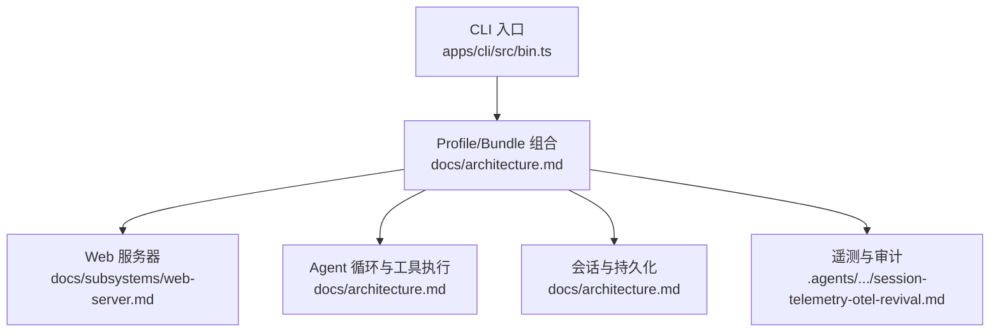
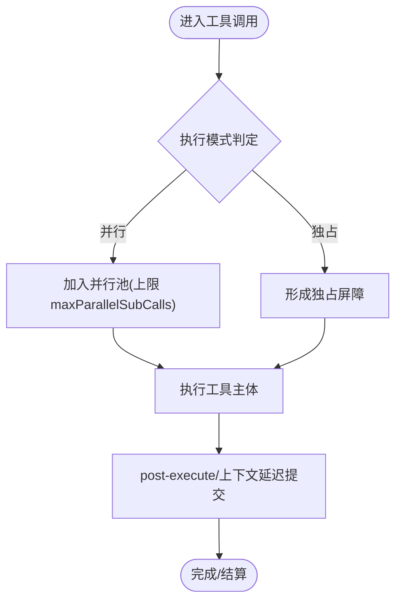
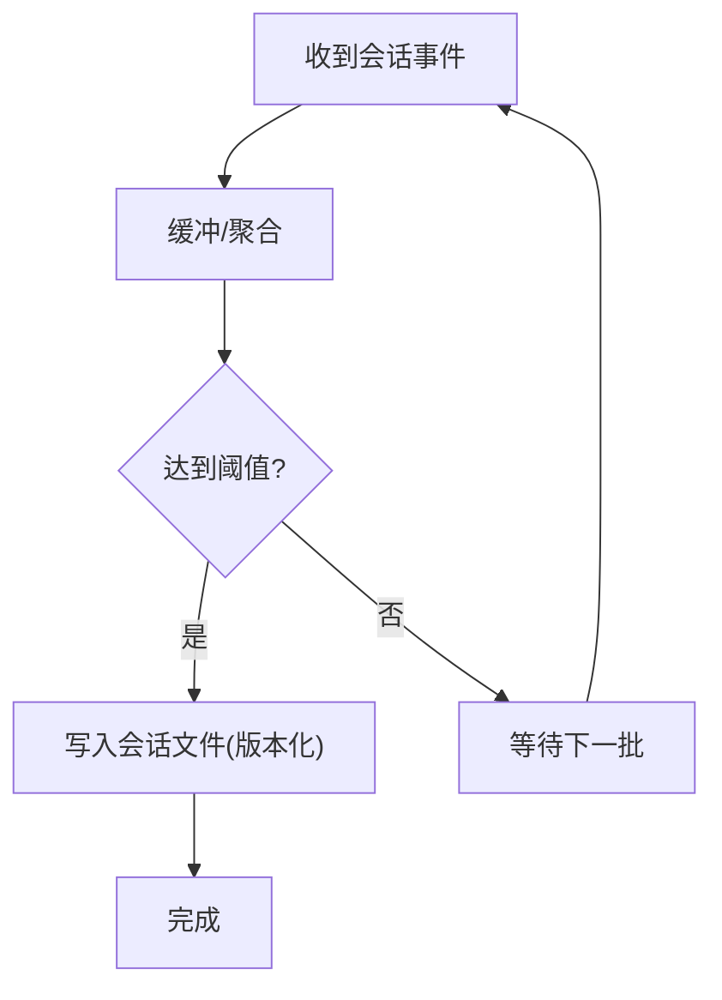
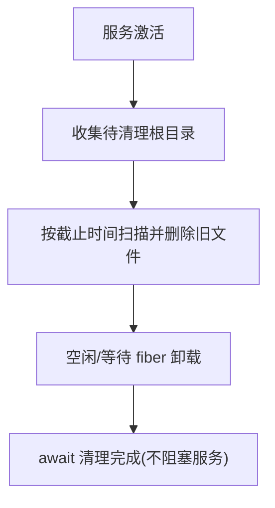
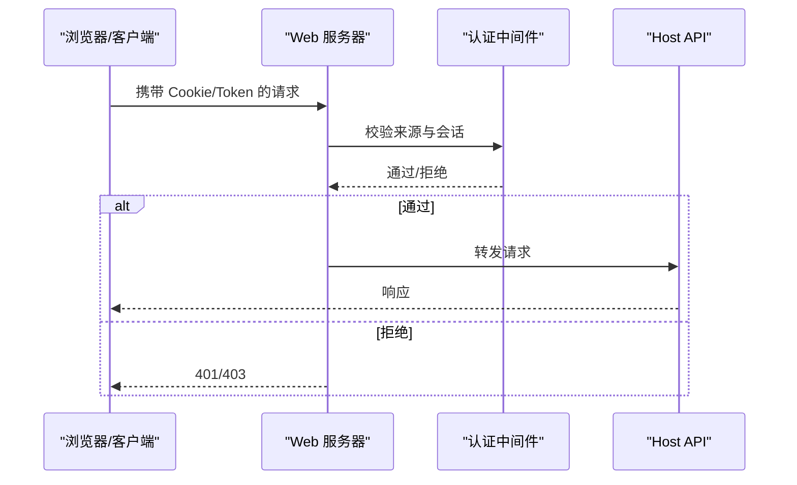
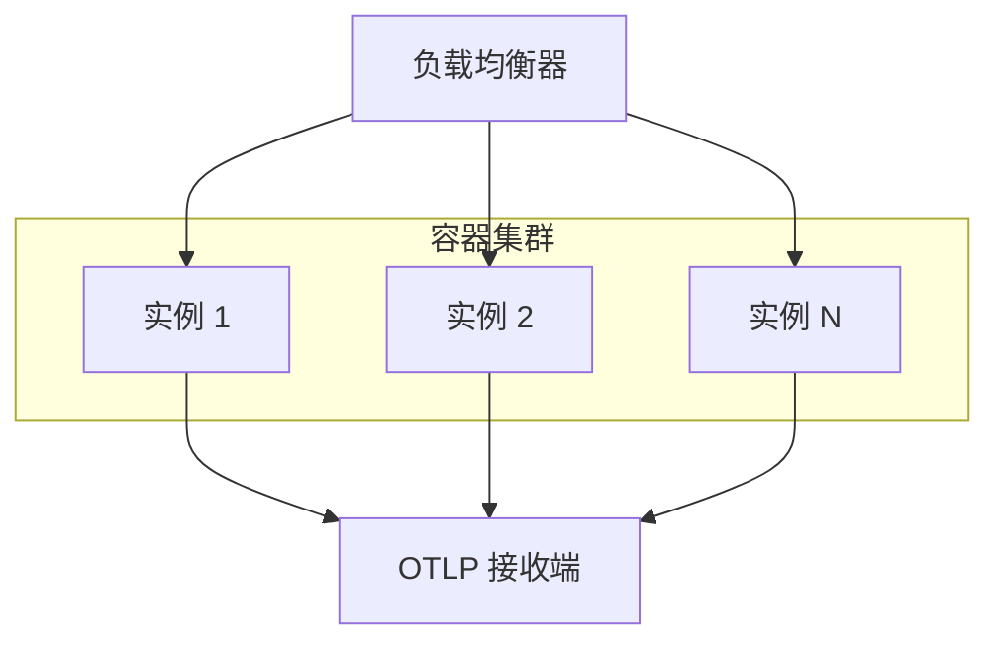
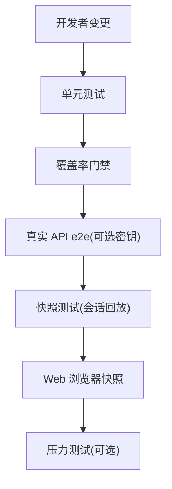
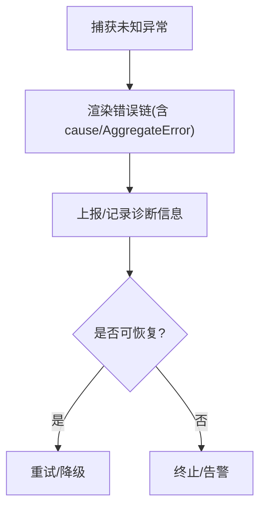
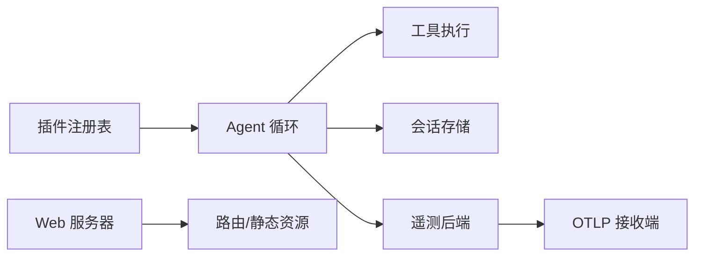

# 高级主题

<cite>
**本文引用的文件**
- [README.md](file://README.md)
- [package.json](file://package.json)
- [SAFETY.md](file://SAFETY.md)
- [architecture.md](file://docs/architecture.md)
- [testing.md](file://docs/testing.md)
- [web-server.md](file://docs/subsystems/web-server.md)
- [registry.zh.md](file://docs/cordis-api/registry.zh.md)
- [settings.zh.md](file://docs/subsystems/settings.zh.md)
- [tools.zh.md](file://docs/subsystems/tools.zh.md)
- [2026-08-24-browser-token-authentication.md](file://.agents/notes/implemented/architecture/2026-08-24-browser-token-authentication.md)
- [2026-07-17-local-spill-startup-cleanup.zh.md](file://.agents/notes/implemented/architecture/2026-07-17-local-spill-startup-cleanup.zh.md)
- [2026-08-19-projection-cache-per-session-files.md](file://.agents/notes/implemented/architecture/2026-08-19-projection-cache-per-session-files.md)
- [2026-07-26-ptc-live-parallel-dispatch.zh.md](file://.agents/notes/implemented/feature/2026-07-26-ptc-live-parallel-dispatch.zh.md)
- [2026-07-10-parallel-tool-call-execution.zh.md](file://.agents/notes/implemented/feature/2026-07-10-parallel-tool-call-execution.zh.md)
- [2026-07-23-session-telemetry-otel-revival.md](file://.agents/notes/implemented/feature/2026-07-23-session-telemetry-otel-revival.md)
- [cache.spec.ts](file://packages/session/session-projection-cache/tests/cache.spec.ts)
- [spill index.ts](file://packages/spill/spill-local/src/index.ts)
- [spill cleanup.ts](file://packages/spill/spill-local/src/cleanup.ts)
- [agent-loop index.ts](file://packages/core/agent-loop/src/index.ts)
- [execution-mode.spec.ts](file://packages/core/tools/tests/execution-mode.spec.ts)
- [ptc.spec.ts](file://packages/core/tools/tests/ptc.spec.ts)
- [tool-calls.spec.ts](file://packages/core/agent-loop/tests/tool-calls.spec.ts)
- [otel.spec.ts](file://packages/session/session-telemetry-otel/tests/otel.spec.ts)
- [session telemetry index.ts](file://packages/session/session-telemetry/src/index.ts)
- [error.ts](file://packages/llm/llm/src/error.ts)
- [run.ts](file://packages/subagent/subagent-dsh-sdk/src/run.ts)
- [vitest.e2e.config.ts](file://vitest.e2e.config.ts)
- [vitest.web-stress.config.ts](file://vitest.web-stress.config.ts)
</cite>

## 目录
1. [简介](#简介)
2. [项目结构](#项目结构)
3. [核心组件](#核心组件)
4. [架构总览](#架构总览)
5. [详细组件分析](#详细组件分析)
6. [依赖关系分析](#依赖关系分析)
7. [性能考虑](#性能考虑)
8. [故障排除指南](#故障排除指南)
9. [结论](#结论)
10. [附录](#附录)

## 简介
本高级主题文档面向需要深入优化、加固与运维 DeepSeek Harness（dsh）的工程师与平台团队。内容覆盖：
- 性能优化：内存管理、并发处理、缓存机制
- 安全与防护：输入验证、权限控制、审计日志
- 部署与运维：容器化、负载均衡、监控告警
- 测试策略：分层测试、快照与端到端、压力测试
- 故障排除：常见错误、诊断与恢复
- 扩展与定制：插件化能力、配置编排与最佳实践

## 项目结构
DeepSeek Harness 采用“一切皆插件”的 Cordis 架构，通过 Profile 与 Bundle 在启动时组合出完整运行树。核心入口由 CLI 驱动，Web UI、Headless、SDK、ACP 等应用形态均为不同 Profile 的组合产物。仓库根提供统一的构建、测试、发布脚本与工作区管理。



图表来源
- [architecture.md:15-47](file://docs/architecture.md#L15-L47)
- [web-server.md:1-54](file://docs/subsystems/web-server.md#L1-L54)

章节来源
- [README.md:17-41](file://README.md#L17-L41)
- [package.json:19-155](file://package.json#L19-L155)
- [architecture.md:15-47](file://docs/architecture.md#L15-L47)

## 核心组件
- 插件注册表与服务发现：通过 Cordis 的 Plugin/Service/Registry 实现可插拔能力装配与生命周期管理。
- Agent 循环与工具执行：统一调度模型请求与工具调用，支持并行与独占模式，具备有序派发与屏障。
- 会话与投影缓存：基于事件日志的不可变记录，配合按会话文件的投影缓存提升冷启动与回放性能。
- Web 服务器：轻量 HTTP 载体，负责路由、压缩、静态资源与升级协议；不耦合 Agent 领域概念。
- 遥测与审计：OpenTelemetry 后端将会话事件导出为日志/指标，支持分享策略与回放边界。

章节来源
- [registry.zh.md:60-121](file://docs/cordis-api/registry.zh.md#L60-L121)
- [architecture.md:49-115](file://docs/architecture.md#L49-L115)
- [web-server.md:1-54](file://docs/subsystems/web-server.md#L1-L54)
- [.agents/notes/implemented/architecture/2026-08-19-projection-cache-per-session-files.md:1-13](file://.agents/notes/implemented/architecture/2026-08-19-projection-cache-per-session-files.md#L1-L13)
- [.agents/notes/implemented/feature/2026-07-23-session-telemetry-otel-revival.md:31-32](file://.agents/notes/implemented/feature/2026-07-23-session-telemetry-otel-revival.md#L31-L32)

## 架构总览
下图展示了从 CLI 到 Web 服务器、Agent 循环、工具执行、会话存储与遥测的整体交互。

```mermaid
sequenceDiagram
participant U as "用户/客户端"
participant CLI as "CLI 入口"
participant CFG as "Profile/Bundle 组合"
participant WEB as "Web 服务器"
participant LOOP as "Agent 循环"
participant TOOLS as "工具执行"
participant STORE as "会话存储"
participant TELE as "遥测后端"
U->>CLI : 启动命令
CLI->>CFG : 加载并组装插件树
CFG->>WEB : 注册路由/静态资源
U->>WEB : HTTP 请求
WEB-->>U : 响应/流式数据
U->>LOOP : 提交任务/消息
LOOP->>TOOLS : 调度工具调用(并行/独占)
TOOLS-->>LOOP : 结果/副作用
LOOP->>STORE : 写入会话事件
LOOP->>TELE : 导出事件/指标
LOOP-->>U : 返回结果/流式输出
```

图表来源
- [architecture.md:41-115](file://docs/architecture.md#L41-L115)
- [web-server.md:1-54](file://docs/subsystems/web-server.md#L1-L54)
- [.agents/notes/implemented/feature/2026-07-23-session-telemetry-otel-revival.md:31-32](file://.agents/notes/implemented/feature/2026-07-23-session-telemetry-otel-revival.md#L31-L32)

## 详细组件分析

### 并发与工具执行（性能与安全）
- 工具执行模式：默认保守为独占，可通过声明或分类器判定为并行；最大并行度受部署配置限制。
- 有序派发与屏障：确保独占调用形成顺序屏障，避免共享状态竞争。
- 子调用池：PTC 模式下对子调用进行有界并行，防止资源耗尽。



图表来源
- [tools.zh.md:243-253](file://docs/subsystems/tools.zh.md#L243-L253)
- [.agents/notes/implemented/feature/2026-07-26-ptc-live-parallel-dispatch.zh.md:13-20](file://.agents/notes/implemented/feature/2026-07-26-ptc-live-parallel-dispatch.zh.md#L13-L20)
- [.agents/notes/implemented/feature/2026-07-10-parallel-tool-call-execution.zh.md:57-97](file://.agents/notes/implemented/feature/2026-07-10-parallel-tool-call-execution.zh.md#L57-L97)

章节来源
- [execution-mode.spec.ts:40-67](file://packages/core/tools/tests/execution-mode.spec.ts#L40-L67)
- [ptc.spec.ts:580-603](file://packages/core/tools/tests/ptc.spec.ts#L580-L603)
- [tool-calls.spec.ts:117-142](file://packages/core/agent-loop/tests/tool-calls.spec.ts#L117-L142)

### 会话投影缓存（性能与可靠性）
- 按会话文件布局：每个会话独立文档，降低写放大与单点故障影响。
- 冷启动快照：读取失败降级为警告，不影响服务可用性。
- 写入节流：按事件数或时间间隔落盘，平衡吞吐与一致性。



图表来源
- [.agents/notes/implemented/architecture/2026-08-19-projection-cache-per-session-files.md:1-13](file://.agents/notes/implemented/architecture/2026-08-19-projection-cache-per-session-files.md#L1-L13)
- [cache.spec.ts:429-450](file://packages/session/session-projection-cache/tests/cache.spec.ts#L429-L450)

章节来源
- [cache.spec.ts:82-106](file://packages/session/session-projection-cache/tests/cache.spec.ts#L82-L106)
- [cache.spec.ts:429-450](file://packages/session/session-projection-cache/tests/cache.spec.ts#L429-L450)

### 临时存储清理（内存与磁盘管理）
- 启动一次性扫描：按过期阈值清理 spill 根目录，避免定时器与守护进程复杂度。
- 幂等删除：并发安全，忽略 ENOENT/ENOTEMPTY 等竞态错误。
- 配置旋钮：cleanupPeriodDays 控制保留时长。



图表来源
- [spill index.ts:83-117](file://packages/spill/spill-local/src/index.ts#L83-L117)
- [spill cleanup.ts:345-362](file://packages/spill/spill-local/src/cleanup.ts#L345-L362)
- [.agents/notes/implemented/architecture/2026-07-17-local-spill-startup-cleanup.zh.md:19-33](file://.agents/notes/implemented/architecture/2026-07-17-local-spill-startup-cleanup.zh.md#L19-L33)

章节来源
- [spill index.ts:83-117](file://packages/spill/spill-local/src/index.ts#L83-L117)
- [spill cleanup.ts:345-362](file://packages/spill/spill-local/src/cleanup.ts#L345-L362)

### 安全与权限（输入验证、权限控制、审计日志）
- 浏览器令牌认证：Host API 全量要求浏览器会话认证，防止仅凭 Host 头越权。
- 最小权限原则：以最少权限运行，优先使用隔离环境。
- 遥测分享策略：后端暴露分享状态，用于向用户透明反馈数据是否离开进程。



图表来源
- [2026-08-24-browser-token-authentication.md:1-43](file://.agents/notes/implemented/architecture/2026-08-24-browser-token-authentication.md#L1-L43)
- [web-server.md:27-54](file://docs/subsystems/web-server.md#L27-L54)
- [session telemetry index.ts:133-159](file://packages/session/session-telemetry/src/index.ts#L133-L159)

章节来源
- [SAFETY.md:5-27](file://SAFETY.md#L5-L27)
- [2026-08-24-browser-token-authentication.md:1-43](file://.agents/notes/implemented/architecture/2026-08-24-browser-token-authentication.md#L1-L43)
- [session telemetry index.ts:133-159](file://packages/session/session-telemetry/src/index.ts#L133-L159)

### 部署与运维（容器化、负载均衡、监控告警）
- 容器化：通过 CLI 包声明的配置树打包镜像，挂载配置文件至指定路径。
- 负载均衡：Web 服务器绑定 host/port，结合外部反向代理实现多实例水平扩展。
- 监控告警：OpenTelemetry 后端导出会话事件与指标，支持回放边界与去重策略。



图表来源
- [experimental webworker-packer repository.ts:106-133](file://packages/experimental/webworker-packer/src/repository.ts#L106-L133)
- [web-server.md:29-54](file://docs/subsystems/web-server.md#L29-L54)
- [.agents/notes/implemented/feature/2026-07-23-session-telemetry-otel-revival.md:31-32](file://.agents/notes/implemented/feature/2026-07-23-session-telemetry-otel-revival.md#L31-L32)

章节来源
- [web-server.md:29-54](file://docs/subsystems/web-server.md#L29-L54)
- [otel.spec.ts:98-119](file://packages/session/session-telemetry-otel/tests/otel.spec.ts#L98-L119)

### 测试策略（分层、快照、端到端、压力）
- 单元测试：快速回归契约与并发边界。
- 覆盖率门禁：逐文件 100% 覆盖源码，识别死代码。
- 真实 API e2e：可选密钥驱动，自跳过保障无密钥 CI。
- 快照测试：录制会话作为黄金值，回放对比输出。
- Web 浏览器快照：Chromium 比对 UI 与 ARIA 证据。
- 压力测试：专用配置禁用文件并行，延长超时，评估长时间运行稳定性。



图表来源
- [testing.md:7-14](file://docs/testing.md#L7-L14)
- [vitest.e2e.config.ts:31-62](file://vitest.e2e.config.ts#L31-L62)
- [vitest.web-stress.config.ts:1-15](file://vitest.web-stress.config.ts#L1-L15)

章节来源
- [testing.md:7-51](file://docs/testing.md#L7-L51)
- [vitest.e2e.config.ts:31-62](file://vitest.e2e.config.ts#L31-L62)
- [vitest.web-stress.config.ts:1-15](file://vitest.web-stress.config.ts#L1-L15)

### 错误处理与诊断（健壮性）
- 错误链渲染：完整展开 cause 链与 AggregateError 成员，便于定位底层故障。
- SDK 启动失败映射：初始化与关闭阶段错误分别上报并聚合。
- 观察中止：会话观测被中止时抛出结构化错误。



图表来源
- [error.ts:102-130](file://packages/llm/llm/src/error.ts#L102-L130)
- [run.ts:183-217](file://packages/subagent/subagent-dsh-sdk/src/run.ts#L183-L217)
- [session telemetry observation.ts:190-213](file://packages/session-query/session-query/src/observation.ts#L190-L213)

章节来源
- [error.ts:102-130](file://packages/llm/llm/src/error.ts#L102-L130)
- [run.ts:183-217](file://packages/subagent/subagent-dsh-sdk/src/run.ts#L183-L217)
- [session telemetry observation.ts:190-213](file://packages/session-query/session-query/src/observation.ts#L190-L213)

## 依赖关系分析
- 插件层依赖：所有功能通过 Cordis 插件注册，解耦强、替换成本低。
- 运行时依赖：Agent 循环依赖工具注册表、会话存储与遥测后端；Web 服务器独立于 Agent 领域。
- 外部集成：HTTP 服务器对接浏览器/代理；遥测对接 OTLP 接收端；本地存储依赖文件系统。



图表来源
- [registry.zh.md:60-121](file://docs/cordis-api/registry.zh.md#L60-L121)
- [architecture.md:49-115](file://docs/architecture.md#L49-L115)
- [web-server.md:1-54](file://docs/subsystems/web-server.md#L1-L54)

章节来源
- [registry.zh.md:60-121](file://docs/cordis-api/registry.zh.md#L60-L121)
- [architecture.md:49-115](file://docs/architecture.md#L49-L115)
- [web-server.md:1-54](file://docs/subsystems/web-server.md#L1-L54)

## 性能考虑
- 内存管理
  - 使用一次性启动清理避免长期定时器开销，减少后台任务与锁竞争。
  - 投影缓存按会话文件布局，降低写放大与单文件损坏风险。
- 并发处理
  - 工具执行默认保守为独占，必要时声明并行；设置合理的 maxParallelToolCalls/maxParallelSubCalls。
  - 有序派发确保屏障语义，避免共享状态竞争。
- 缓存机制
  - 投影缓存节流写入，平衡一致性与吞吐。
  - 冷启动快照失败软降级，保证可用性。
- 网络与 I/O
  - Web 服务器启用 gzip 压缩，合理设置阈值与级别。
  - 遥测导出按需开启，避免高频写入影响主流程。

[本节为通用指导，无需特定文件引用]

## 故障排除指南
- 无法启动或端口占用
  - 检查 Web 服务器监听失败（如 EADDRINUSE），根据日志调整端口或释放占用。
- 认证失败或越权
  - 确认浏览器会话与 Host/Origin 校验；确保未绕过认证直接访问 Host API。
- 工具执行卡住或超时
  - 检查工具执行模式与并行上限；排查独占调用是否阻塞后续任务。
- 会话回放不一致
  - 核对快照录制与回放输入；必要时刷新快照并审查差异。
- 遥测缺失或重复
  - 检查 OTLP 接收端连接与去重策略；确认分享策略与回放边界。

章节来源
- [web-server.md:29-54](file://docs/subsystems/web-server.md#L29-L54)
- [2026-08-24-browser-token-authentication.md:1-43](file://.agents/notes/implemented/architecture/2026-08-24-browser-token-authentication.md#L1-L43)
- [ptc.spec.ts:580-603](file://packages/core/tools/tests/ptc.spec.ts#L580-L603)
- [otel.spec.ts:98-119](file://packages/session/session-telemetry-otel/tests/otel.spec.ts#L98-L119)

## 结论
DeepSeek Harness 通过插件化架构提供了高度可扩展与可替换的能力面。在生产环境中，应重点关注：
- 并发与资源上限配置，避免过载与竞争
- 安全的认证与最小权限策略
- 健壮的缓存与清理机制，保障可用性与可维护性
- 完善的测试与监控体系，确保问题早发现早恢复
- 容器化与负载均衡，支撑弹性扩展与高可用

[本节为总结性内容，无需特定文件引用]

## 附录
- 配置与编排
  - 使用 Profile/Bundle 组合不同应用形态；通过 patch 覆盖默认行为。
  - 设置项 validate/applies 语义明确，区分即时生效与重启生效。
- 扩展与定制
  - 新增能力通过 Service Definition/Provider/Consumer 三件套设计。
  - 工具执行模式与并行度可按场景调优；谨慎声明 isConcurrencySafe。
- 最佳实践
  - 优先真实实现测试，仅在必要边界使用模拟。
  - 保持快照与预期输出同步更新，确保交付质量。

章节来源
- [architecture.md:15-47](file://docs/architecture.md#L15-L47)
- [settings.zh.md:52-59](file://docs/subsystems/settings.zh.md#L52-L59)
- [testing.md:18-51](file://docs/testing.md#L18-L51)