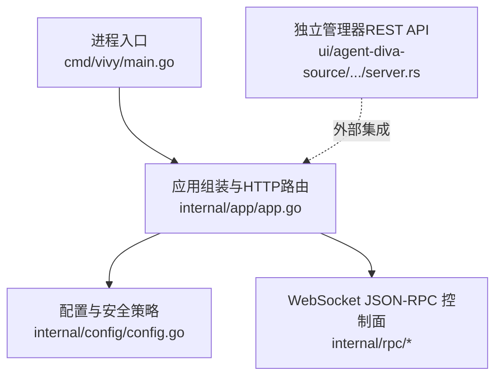
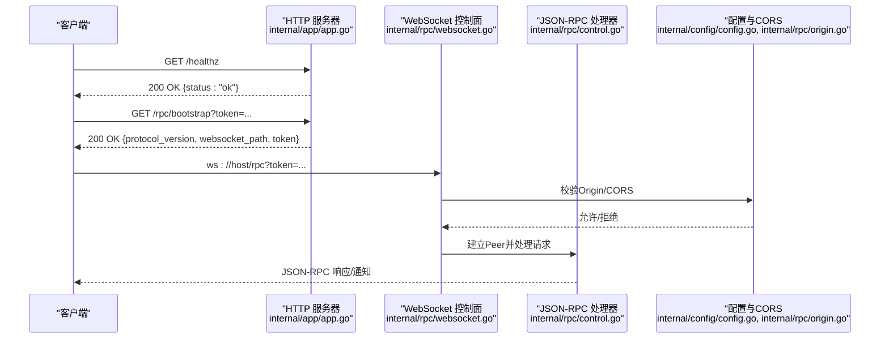
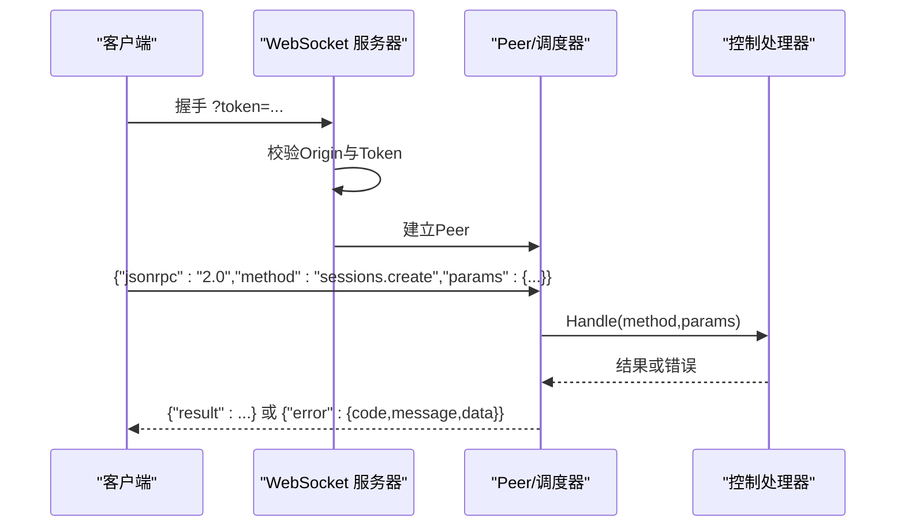
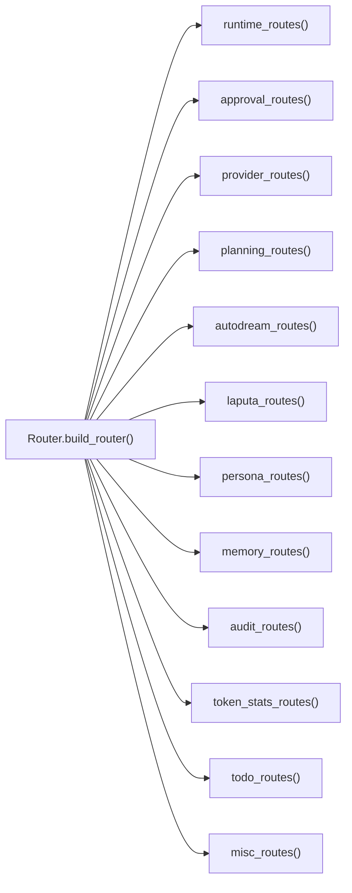
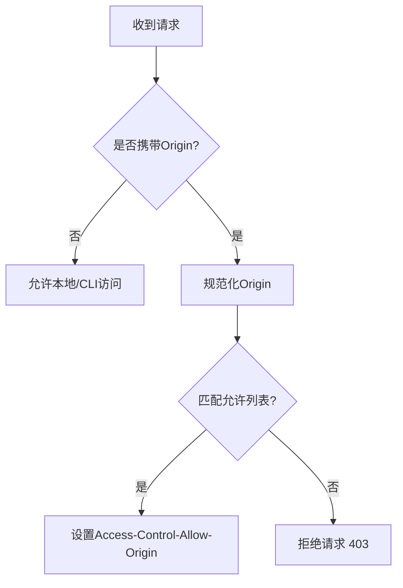
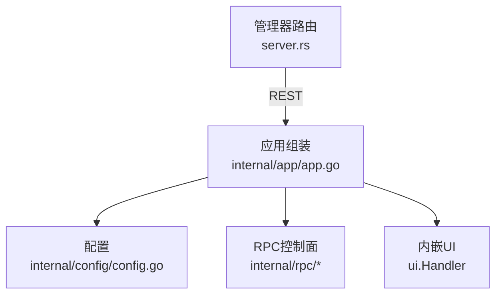

# HTTP REST API

<cite>
**本文引用的文件**
- [cmd/vivy/main.go](file://cmd/vivy/main.go)
- [internal/app/app.go](file://internal/app/app.go)
- [internal/config/config.go](file://internal/config/config.go)
- [internal/rpc/protocol.go](file://internal/rpc/protocol.go)
- [internal/rpc/control.go](file://internal/rpc/control.go)
- [internal/rpc/websocket.go](file://internal/rpc/websocket.go)
- [internal/rpc/origin.go](file://internal/rpc/origin.go)
- [ui/agent-diva-source/agent-diva-manager/src/server.rs](file://ui/agent-diva-source/agent-diva-manager/src/server.rs)
</cite>

## 目录
1. [简介](#简介)
2. [项目结构](#项目结构)
3. [核心组件](#核心组件)
4. [架构总览](#架构总览)
5. [详细组件分析](#详细组件分析)
6. [依赖关系分析](#依赖关系分析)
7. [性能与限流](#性能与限流)
8. [故障排查指南](#故障排查指南)
9. [结论](#结论)
10. [附录：API 参考](#附录api-参考)

## 简介
本仓库提供 Vivy Agent 运行时（vivy.exe）的本地服务，对外暴露两类接口：
- 轻量 HTTP 端点：健康检查、引导信息、内嵌 UI。
- WebSocket JSON-RPC 控制面：会话、运行、事件订阅、审批、问题交互等。

此外，项目还包含一个独立的 Rust 管理器进程（位于 ui/agent-diva-source），通过 Axum 提供丰富的 /api/* REST 路由，用于管理运行、计划、审计、MCP、定时任务等能力。

## 项目结构
Vivy 主进程由 Go 实现，入口在 cmd/vivy/main.go；应用组装与 HTTP 路由注册在 internal/app/app.go；配置与安全策略在 internal/config/config.go；JSON-RPC 协议与传输在 internal/rpc/*；独立管理器使用 Rust + Axum 提供 /api/* REST 路由。

**图表来源**
- [cmd/vivy/main.go:23-73](file://cmd/vivy/main.go#L23-L73)
- [internal/app/app.go:325-362](file://internal/app/app.go#L325-L362)
- [internal/config/config.go:51-68](file://internal/config/config.go#L51-L68)
- [ui/agent-diva-source/agent-diva-manager/src/server.rs:93-113](file://ui/agent-diva-source/agent-diva-manager/src/server.rs#L93-L113)

**章节来源**
- [cmd/vivy/main.go:23-73](file://cmd/vivy/main.go#L23-L73)
- [internal/app/app.go:325-362](file://internal/app/app.go#L325-L362)
- [internal/config/config.go:51-68](file://internal/config/config.go#L51-L68)
- [ui/agent-diva-source/agent-diva-manager/src/server.rs:93-113](file://ui/agent-diva-source/agent-diva-manager/src/server.rs#L93-L113)

## 核心组件
- 进程入口：加载配置、设置日志、启动应用并监听 HTTP。
- 应用组装：初始化存储、提供者、运行时引擎、RPC 控制面、健康检查与引导端点、内嵌 UI。
- 配置与安全：严格校验配置、限制跨域来源、强制环回地址策略。
- JSON-RPC 控制面：基于 WebSocket 的双向通信，支持方法调用、错误码、背压与有序响应。
- 管理器 REST API：Axum 路由聚合，提供运行、计划、审计、MCP、定时任务等管理能力。

**章节来源**
- [cmd/vivy/main.go:23-73](file://cmd/vivy/main.go#L23-L73)
- [internal/app/app.go:63-362](file://internal/app/app.go#L63-L362)
- [internal/config/config.go:316-528](file://internal/config/config.go#L316-L528)
- [internal/rpc/protocol.go:18-32](file://internal/rpc/protocol.go#L18-L32)
- [ui/agent-diva-source/agent-diva-manager/src/server.rs:93-113](file://ui/agent-diva-source/agent-diva-manager/src/server.rs#L93-L113)

## 架构总览
Vivy 主进程以 HTTP 服务器形式暴露少量端点，并通过 WebSocket 提供 JSON-RPC 控制面；管理器进程通过 Axum 提供丰富 REST API，通常与主进程协同工作。

**图表来源**
- [internal/app/app.go:325-348](file://internal/app/app.go#L325-L348)
- [internal/rpc/websocket.go:27-47](file://internal/rpc/websocket.go#L27-L47)
- [internal/rpc/origin.go:38-65](file://internal/rpc/origin.go#L38-L65)
- [internal/config/config.go:586-609](file://internal/config/config.go#L586-L609)

## 详细组件分析

### HTTP 端点（主进程）
- GET /healthz
  - 用途：健康检查，返回进程就绪状态。
  - 响应：application/json，包含 status 与 stage。
  - 状态码：200。
- GET /rpc/bootstrap
  - 用途：获取 WebSocket 连接所需协议版本与令牌。
  - 参数：token（查询参数）。
  - 响应：application/json，包含 protocol_version、websocket_path、token。
  - 安全：需满足 Origin 策略；成功时设置 CORS 头。
  - 状态码：200/403（禁止来源）。
- /（根路径）
  - 用途：默认构建下提供内嵌 UI；headless 构建返回 404。
  - 状态码：200/404。

注意：主进程未暴露传统 RESTful CRUD 接口；业务控制通过 WebSocket JSON-RPC 完成。

**章节来源**
- [internal/app/app.go:325-348](file://internal/app/app.go#L325-L348)
- [internal/rpc/origin.go:38-65](file://internal/rpc/origin.go#L38-L65)

### WebSocket JSON-RPC 控制面
- 传输：WebSocket，路径 /rpc。
- 认证：
  - 查询参数 token 或 Authorization: Bearer <token>。
  - 来源校验：Origin 必须匹配或为空（本地 CLI/测试）。
- 协议：
  - 版本：vivy.rpc.v1。
  - 标准 JSON-RPC 2.0 帧格式。
  - 错误码：ParseError(-32700)、InvalidRequest(-32600)、MethodNotFound(-32601)、InvalidParams(-32602)、InternalError(-32603)、ServerOverload(-32001)。
- 能力：
  - 会话管理：创建、列出、获取、删除、重命名。
  - 消息与运行：列出消息、启动轮次、取消运行、查询运行、读取运行日志。
  - 子任务：启动/查询/等待/取消子运行。
  - 审批与问题：列出待审批、响应审批、列出问题、回答问题。
  - 预检：preflight，返回策略、工具选择、上下文大小等。
  - 后台任务：列出与附加后台任务。
  - 评估：触发评估任务（通过 Eval 接口）。
- 背压与顺序：
  - 输出队列有界，满时返回 ServerOverload。
  - AfterResponse 保证“响应先于事件”的顺序。

**图表来源**
- [internal/rpc/websocket.go:27-47](file://internal/rpc/websocket.go#L27-L47)
- [internal/rpc/protocol.go:18-32](file://internal/rpc/protocol.go#L18-L32)
- [internal/rpc/control.go:83-89](file://internal/rpc/control.go#L83-L89)

**章节来源**
- [internal/rpc/websocket.go:27-55](file://internal/rpc/websocket.go#L27-L55)
- [internal/rpc/protocol.go:18-32](file://internal/rpc/protocol.go#L18-L32)
- [internal/rpc/control.go:83-89](file://internal/rpc/control.go#L83-L89)

### 管理器 REST API（Rust Axum）
管理器进程通过 Axum Router 聚合多个功能模块，统一挂载到 /api/*，并启用宽松 CORS 与 HTTP 追踪层。

主要路由分组：
- 运行与自动化
  - /api/autodream/runs：列表/触发自动运行
  - /api/autodream/runs/:id：获取运行详情
  - /api/autodream/runs/:id/live-text：实时文本流
  - /api/autodream/runs/:id/events：事件列表
  - /api/autodream/runs/:id/cancel：取消运行
- 提供者模型
  - /api/providers：列表/创建
  - /api/providers/resolve：解析提供者
  - /api/providers/:name：获取/更新/删除
  - /api/providers/:name/models：列表/添加模型
  - /api/providers/:name/models/:model_id：删除模型
- 计划执行
  - /api/plan-reports：列表/创建报告
  - /api/plan-reports/:report_id/revisions：追加修订
  - /api/plan-reports/:report_id/approve：批准报告
  - /api/plan-executions/active：获取活跃执行
  - /api/plan-executions/:execution_id/todos：任务列表
  - /api/plan-executions/:execution_id/todos/:todo_id：更新任务
- 审计与日志
  - /api/audit/log：审计日志
  - /api/audit/events：审计事件
- MCP 管理
  - /api/mcps：列表/创建
  - /api/mcps/:name：更新/删除
  - /api/mcps/:name/enable：启用
  - /api/mcps/:name/refresh：刷新状态
- 定时任务
  - /api/cron/jobs：列表/创建
  - /api/cron/jobs/:id：获取/更新/删除
  - /api/cron/jobs/:id/enable：启用
  - /api/cron/jobs/:id/run：立即运行
  - /api/cron/jobs/:id/stop：停止

**图表来源**
- [ui/agent-diva-source/agent-diva-manager/src/server.rs:93-113](file://ui/agent-diva-source/agent-diva-manager/src/server.rs#L93-L113)
- [ui/agent-diva-source/agent-diva-manager/src/server.rs:115-133](file://ui/agent-diva-source/agent-diva-manager/src/server.rs#L115-L133)
- [ui/agent-diva-source/agent-diva-manager/src/server.rs:314-335](file://ui/agent-diva-source/agent-diva-manager/src/server.rs#L314-L335)
- [ui/agent-diva-source/agent-diva-manager/src/server.rs:337-368](file://ui/agent-diva-source/agent-diva-manager/src/server.rs#L337-L368)
- [ui/agent-diva-source/agent-diva-manager/src/server.rs:370-375](file://ui/agent-diva-source/agent-diva-manager/src/server.rs#L370-L375)

**章节来源**
- [ui/agent-diva-source/agent-diva-manager/src/server.rs:93-113](file://ui/agent-diva-source/agent-diva-manager/src/server.rs#L93-L113)
- [ui/agent-diva-source/agent-diva-manager/src/server.rs:115-133](file://ui/agent-diva-source/agent-diva-manager/src/server.rs#L115-L133)
- [ui/agent-diva-source/agent-diva-manager/src/server.rs:314-368](file://ui/agent-diva-source/agent-diva-manager/src/server.rs#L314-L368)
- [ui/agent-diva-source/agent-diva-manager/src/server.rs:370-375](file://ui/agent-diva-source/agent-diva-manager/src/server.rs#L370-L375)

### 跨域与来源策略（CORS）
- 主进程：
  - 仅对 /rpc/bootstrap 与 /rpc 进行来源校验。
  - 允许的 Origin 必须为 http/https 且主机为环回地址。
  - 若配置了 server.allowed_origins，则 server.addr 的主机必须为环回。
- 管理器：
  - 使用 CorsLayer::permissive()，允许所有来源（开发/内网场景）。
  - 建议生产环境收紧策略。

**图表来源**
- [internal/rpc/origin.go:38-65](file://internal/rpc/origin.go#L38-L65)
- [internal/config/config.go:586-609](file://internal/config/config.go#L586-L609)
- [ui/agent-diva-source/agent-diva-manager/src/server.rs:110-112](file://ui/agent-diva-source/agent-diva-manager/src/server.rs#L110-L112)

**章节来源**
- [internal/rpc/origin.go:38-65](file://internal/rpc/origin.go#L38-L65)
- [internal/config/config.go:586-609](file://internal/config/config.go#L586-L609)
- [ui/agent-diva-source/agent-diva-manager/src/server.rs:110-112](file://ui/agent-diva-source/agent-diva-manager/src/server.rs#L110-L112)

### 认证与鉴权
- WebSocket 控制面：
  - 通过查询参数 token 或 Authorization: Bearer <token> 验证。
  - Token 由服务端生成并在 /rpc/bootstrap 返回。
- 来源校验：
  - 浏览器跨域请求需携带合法 Origin。
- 管理器 REST：
  - 当前示例路由未内置鉴权中间件；如需生产使用，应增加鉴权层。

**章节来源**
- [internal/rpc/websocket.go:27-55](file://internal/rpc/websocket.go#L27-L55)
- [internal/app/app.go:325-348](file://internal/app/app.go#L325-L348)

### 速率限制与背压
- JSON-RPC 输出队列有界，超出时返回 ServerOverload(-32001)，客户端应退避重试。
- 管理器上传限制：文件上传最大 50MB。
- 建议：
  - 客户端实现指数退避与抖动。
  - 在生产网关层增加限流（如令牌桶/漏桶）。

**章节来源**
- [internal/rpc/protocol.go:20-32](file://internal/rpc/protocol.go#L20-L32)
- [ui/agent-diva-source/agent-diva-manager/src/server.rs:286-288](file://ui/agent-diva-source/agent-diva-manager/src/server.rs#L286-L288)

## 依赖关系分析
- 主进程依赖：
  - 配置：internal/config/config.go（严格校验、环回策略）。
  - 运行时：internal/runtime（引擎、工具、策略）。
  - RPC：internal/rpc（协议、传输、控制器）。
  - UI：ui.Handler（内嵌前端）。
- 管理器依赖：
  - Axum Router 聚合各功能模块。
  - CORS 与追踪层。

**图表来源**
- [internal/app/app.go:325-362](file://internal/app/app.go#L325-L362)
- [internal/config/config.go:51-68](file://internal/config/config.go#L51-L68)
- [ui/agent-diva-source/agent-diva-manager/src/server.rs:93-113](file://ui/agent-diva-source/agent-diva-manager/src/server.rs#L93-L113)

**章节来源**
- [internal/app/app.go:325-362](file://internal/app/app.go#L325-L362)
- [internal/config/config.go:51-68](file://internal/config/config.go#L51-L68)
- [ui/agent-diva-source/agent-diva-manager/src/server.rs:93-113](file://ui/agent-diva-source/agent-diva-manager/src/server.rs#L93-L113)

## 性能与限流
- 背压：
  - JSON-RPC 输出缓冲有界，避免内存膨胀。
- 超时与关闭：
  - 优雅关闭窗口约 5 秒，确保运行终止与存储关闭。
- 监控指标：
  - 管理器启用 TraceLayer 用于 HTTP 追踪。
  - 建议接入 Prometheus 指标（如请求数、延迟、错误率）。
- 日志记录：
  - 主进程使用 slog JSON 日志输出到 stdout。
  - 审计钩子将关键操作写入审计日志。

**章节来源**
- [internal/rpc/protocol.go:70-83](file://internal/rpc/protocol.go#L70-L83)
- [internal/app/app.go:41-45](file://internal/app/app.go#L41-L45)
- [ui/agent-diva-source/agent-diva-manager/src/server.rs:110-112](file://ui/agent-diva-source/agent-diva-manager/src/server.rs#L110-L112)
- [cmd/vivy/main.go:36-37](file://cmd/vivy/main.go#L36-L37)

## 故障排查指南
- 健康检查失败：
  - 检查 /healthz 返回状态与阶段。
- 来源被拒绝：
  - 确认 Origin 已正确配置且为环回地址。
- WebSocket 连接失败：
  - 检查 token 是否正确传递。
  - 确认 Authorization 头格式为 Bearer <token>。
- 过载错误：
  - 出现 ServerOverload 时，客户端应退避重试。
- 管理器上传失败：
  - 确认文件大小不超过 50MB。

**章节来源**
- [internal/app/app.go:342-345](file://internal/app/app.go#L342-L345)
- [internal/rpc/origin.go:38-65](file://internal/rpc/origin.go#L38-L65)
- [internal/rpc/websocket.go:27-55](file://internal/rpc/websocket.go#L27-L55)
- [internal/rpc/protocol.go:20-32](file://internal/rpc/protocol.go#L20-L32)
- [ui/agent-diva-source/agent-diva-manager/src/server.rs:286-288](file://ui/agent-diva-source/agent-diva-manager/src/server.rs#L286-L288)

## 结论
Vivy 主进程提供最小化 HTTP 端点与强大的 WebSocket JSON-RPC 控制面；管理器进程通过 Axum 提供丰富的 /api/* REST 能力。生产部署时应收紧 CORS、增加鉴权与限流，并接入监控与日志系统以获得可观测性。

## 附录：API 参考

### 主进程 HTTP 端点
- GET /healthz
  - 响应：application/json
  - 字段：status、stage
  - 状态码：200
- GET /rpc/bootstrap
  - 查询参数：token
  - 响应：application/json
  - 字段：protocol_version、websocket_path、token
  - 状态码：200/403
- /
  - 默认构建：内嵌 UI
  - headless 构建：404

**章节来源**
- [internal/app/app.go:325-348](file://internal/app/app.go#L325-L348)

### WebSocket JSON-RPC 方法（摘要）
- sessions.create/list/get/delete/rename
- messages.list
- runs.start_turn/cancel/get/run_log
- children.start/get/list/wait/cancel
- approvals.list/respond
- questions.list/respond
- preflight
- background.list/attach
- eval.*（通过 Eval 接口）

错误码：
- -32700 解析错误
- -32600 无效请求
- -32601 方法不存在
- -32602 参数无效
- -32603 内部错误
- -32001 服务器过载

**章节来源**
- [internal/rpc/control.go:83-89](file://internal/rpc/control.go#L83-L89)
- [internal/rpc/protocol.go:20-32](file://internal/rpc/protocol.go#L20-L32)

### 管理器 REST 路由（摘要）
- /api/autodream/runs：GET/POST
- /api/autodream/runs/:id：GET
- /api/autodream/runs/:id/live-text：GET
- /api/autodream/runs/:id/events：GET
- /api/autodream/runs/:id/cancel：POST
- /api/providers：GET/POST
- /api/providers/resolve：POST
- /api/providers/:name：GET/PUT/DELETE
- /api/providers/:name/models：GET/POST
- /api/providers/:name/models/:model_id：DELETE
- /api/plan-reports：GET/POST
- /api/plan-reports/:report_id/revisions：POST
- /api/plan-reports/:report_id/approve：POST
- /api/plan-executions/active：GET
- /api/plan-executions/:execution_id/todos：GET
- /api/plan-executions/:execution_id/todos/:todo_id：PATCH
- /api/audit/log：GET
- /api/audit/events：GET
- /api/mcps：GET/POST
- /api/mcps/:name：PUT/DELETE
- /api/mcps/:name/enable：POST
- /api/mcps/:name/refresh：POST
- /api/cron/jobs：GET/POST
- /api/cron/jobs/:id：GET/PUT/DELETE
- /api/cron/jobs/:id/enable：POST
- /api/cron/jobs/:id/run：POST
- /api/cron/jobs/:id/stop：POST

**章节来源**
- [ui/agent-diva-source/agent-diva-manager/src/server.rs:115-133](file://ui/agent-diva-source/agent-diva-manager/src/server.rs#L115-L133)
- [ui/agent-diva-source/agent-diva-manager/src/server.rs:314-368](file://ui/agent-diva-source/agent-diva-manager/src/server.rs#L314-L368)
- [ui/agent-diva-source/agent-diva-manager/src/server.rs:370-375](file://ui/agent-diva-source/agent-diva-manager/src/server.rs#L370-L375)